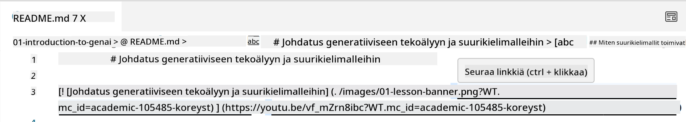
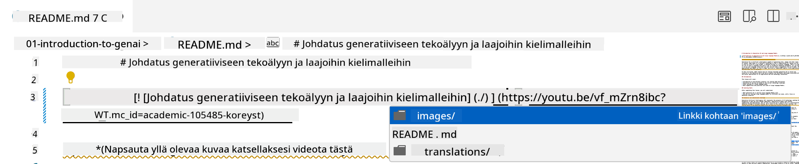
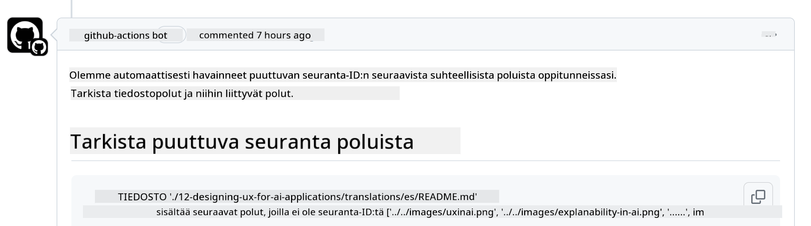
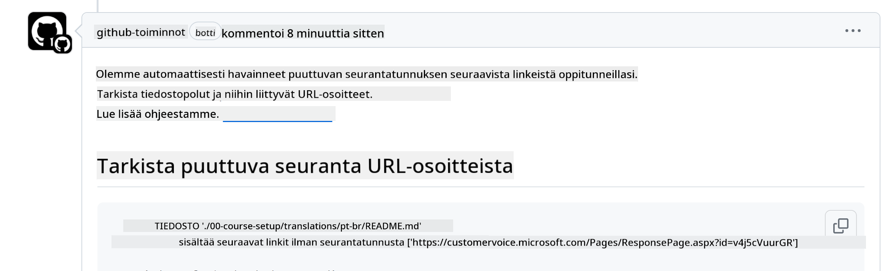
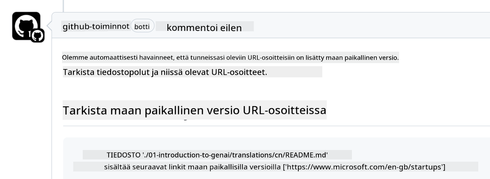

<!--
CO_OP_TRANSLATOR_METADATA:
{
  "original_hash": "57c41f2af71001a2cff9d8eb797cb843",
  "translation_date": "2025-05-19T11:19:06+00:00",
  "source_file": "CONTRIBUTING.md",
  "language_code": "fi"
}
-->
# Osallistuminen

Tämä projekti toivottaa tervetulleiksi osallistumiset ja ehdotukset. Useimmat osallistumiset edellyttävät, että hyväksyt Contributor License Agreement (CLA) -sopimuksen, jossa ilmoitat, että sinulla on oikeus myöntää meille oikeudet käyttää panostasi. Lisätietoja löytyy osoitteesta <https://cla.microsoft.com>.

> Tärkeää: Kun käännät tekstiä tässä repoissa, varmista, ettet käytä konekäännöstä. Varmistamme käännökset yhteisön kautta, joten tarjoudu käännöksiin vain kielillä, joissa olet taitava.

Kun lähetät pull requestin, CLA-bot määrittää automaattisesti, tarvitsetko CLA:n, ja merkitsee PR:n asianmukaisesti (esim. label, kommentti). Seuraa yksinkertaisesti botin antamia ohjeita. Sinun tarvitsee tehdä tämä vain kerran kaikissa CLA:ta käyttävissä repossa.

## Käyttäytymissäännöt

Tämä projekti on omaksunut [Microsoftin avoimen lähdekoodin käyttäytymissäännöt](https://opensource.microsoft.com/codeofconduct/?WT.mc_id=academic-105485-koreyst). Lisätietoja löytyy [käyttäytymissääntöjen UKK:sta](https://opensource.microsoft.com/codeofconduct/faq/?WT.mc_id=academic-105485-koreyst) tai ota yhteyttä [opencode@microsoft.com](mailto:opencode@microsoft.com) lisäkysymyksissä tai -kommenteissa.

## Kysymys tai ongelma?

Älä avaa GitHub-ongelmia yleisille tukikysymyksille, sillä GitHub-listaa tulisi käyttää ominaisuuspyyntöihin ja virheraportteihin. Näin voimme helpommin seurata varsinaisia ongelmia tai bugeja koodista ja pitää yleisen keskustelun erillään varsinaisesta koodista.

## Kirjoitusvirheet, ongelmat, bugit ja osallistumiset

Aina kun teet muutoksia Generative AI for Beginners -repossa, seuraa näitä suosituksia.

* Tee aina fork omalle tilillesi ennen kuin teet muutoksia
* Älä yhdistä useita muutoksia yhteen pull requestiin. Esimerkiksi, lähetä bugikorjaukset ja dokumentaatiopäivitykset erillisinä PR:inä
* Jos pull requestisi näyttää yhdistämiskonflikteja, varmista, että päivität paikallisen päähaaran vastaamaan päärepon sisältöä ennen kuin teet muutoksia
* Jos lähetät käännöksen, luo yksi PR kaikille käännetyille tiedostoille, sillä emme hyväksy osittaisia käännöksiä sisällölle
* Jos lähetät kirjoitusvirheen tai dokumentaation korjauksen, voit yhdistää muutokset yhteen PR:ään, jos se on sopivaa

## Yleiset ohjeet kirjoittamiseen

- Varmista, että kaikki URL-osoitteesi on kääritty hakasulkeisiin, joita seuraa sulku ilman ylimääräisiä välilyöntejä niiden ympärillä tai sisällä ``.
- Varmista, että kaikki suhteelliset linkit (eli linkit muihin tiedostoihin ja kansioihin repossa) alkavat `./` viitaten tiedostoon tai kansioon nykyisessä työskentelyhakemistossa tai `../` viitaten tiedostoon tai kansioon päätyöskentelyhakemistossa.
- Varmista, että kaikki suhteelliset linkit (eli linkit muihin tiedostoihin ja kansioihin repossa) sisältävät seurantatunnuksen (eli `?` tai `&` sitten `wt.mc_id=` tai `WT.mc_id=`) niiden lopussa.
- Varmista, että kaikki URL-osoitteet seuraavista domaineista _github.com, microsoft.com, visualstudio.com, aka.ms, ja azure.com_ sisältävät seurantatunnuksen (eli `?` tai `&` sitten `wt.mc_id=` tai `WT.mc_id=`) niiden lopussa.
- Varmista, ettei linkeissäsi ole maakohtaista lokaalia (eli `/en-us/` tai `/en/`).
- Varmista, että kaikki kuvat on tallennettu `./images` kansioon.
- Varmista, että kuvilla on kuvaavat nimet käyttäen englanninkielisiä merkkejä, numeroita ja viivoja kuvan nimessä.

## GitHub-työnkulut

Kun lähetät pull requestin, neljä erilaista työnkulkua aktivoituu tarkistamaan edelliset säännöt.
Seuraa yksinkertaisesti täällä listattuja ohjeita läpäistäksesi työnkulun tarkistukset.

- [Tarkista rikkinäiset suhteelliset polut](../..)
- [Tarkista, että poluilla on seuranta](../..)
- [Tarkista, että URL-osoitteilla on seuranta](../..)
- [Tarkista, ettei URL-osoitteilla ole lokaalia](../..)

### Tarkista rikkinäiset suhteelliset polut

Tämä työnkulku varmistaa, että kaikki suhteelliset polut tiedostoissasi toimivat.
Tämä repositorio on otettu käyttöön GitHub-sivuilla, joten sinun on oltava hyvin varovainen kirjoittaessasi linkkejä, jotka yhdistävät kaiken, jotta et ohjaa ketään väärään paikkaan.

Varmistaaksesi, että linkkisi toimivat oikein, käytä yksinkertaisesti VS-koodia tarkistaaksesi sen.

Esimerkiksi, kun viet hiiren minkä tahansa linkin päälle tiedostoissasi, sinua kehotetaan seuraamaan linkkiä painamalla **ctrl + klikkaa**

Jos klikkaat linkkiä eikä se toimi paikallisesti, se varmasti laukaisee työnkulun eikä toimi GitHubissa.

Korjataksesi tämän ongelman, yritä kirjoittaa linkki VS-koodin avulla.

Kun kirjoitat `./` tai `../`, VS-koodi kehottaa sinua valitsemaan saatavilla olevista vaihtoehdoista sen mukaan, mitä kirjoitit.

Seuraa polkua klikkaamalla haluttua tiedostoa tai kansiota, ja voit olla varma, ettei polkusi ole rikkinäinen.

Kun lisäät oikean suhteellisen polun, tallenna ja työnnä muutoksesi, työnkulku laukaistaan uudelleen tarkistamaan muutoksesi.
Jos läpäiset tarkistuksen, olet valmis jatkamaan.

### Tarkista, että poluilla on seuranta

Tämä työnkulku varmistaa, että kaikilla suhteellisilla poluilla on seuranta.
Tämä repositorio on otettu käyttöön GitHub-sivuilla, joten meidän on seurattava liikkumista eri tiedostojen ja kansioiden välillä.

Varmistaaksesi, että suhteellisilla poluillasi on seuranta, tarkista yksinkertaisesti seuraava teksti `?wt.mc_id=` polun lopussa.
Jos se on liitetty suhteellisiin polkuihisi, läpäiset tämän tarkistuksen.

Jos ei, saatat saada seuraavan virheen.

Korjataksesi tämän ongelman, yritä avata tiedostopolku, jonka työnkulku korosti, ja lisää seurantatunnus suhteellisten polkujen loppuun.

Kun lisäät seurantatunnuksen, tallenna ja työnnä muutoksesi, työnkulku laukaistaan uudelleen tarkistamaan muutoksesi.
Jos läpäiset tarkistuksen, olet valmis jatkamaan.

### Tarkista, että URL-osoitteilla on seuranta

Tämä työnkulku varmistaa, että kaikilla web-URL-osoitteilla on seuranta.
Tämä repositorio on kaikkien saatavilla, joten sinun on varmistettava, että seuraat pääsyä tietääksesi, mistä liikenne tulee.

Varmistaaksesi, että URL-osoitteillasi on seuranta, tarkista yksinkertaisesti seuraava teksti `?wt.mc_id=` URL-osoitteen lopussa.
Jos se on liitetty URL-osoitteisiisi, läpäiset tämän tarkistuksen.

Jos ei, saatat saada seuraavan virheen.

Korjataksesi tämän ongelman, yritä avata tiedostopolku, jonka työnkulku korosti, ja lisää seurantatunnus URL-osoitteiden loppuun.

Kun lisäät seurantatunnuksen, tallenna ja työnnä muutoksesi, työnkulku laukaistaan uudelleen tarkistamaan muutoksesi.
Jos läpäiset tarkistuksen, olet valmis jatkamaan.

### Tarkista, ettei URL-osoitteilla ole lokaalia

Tämä työnkulku varmistaa, ettei millään web-URL-osoitteella ole maakohtaista lokaalia.
Tämä repositorio on kaikkien saatavilla ympäri maailmaa, joten sinun on varmistettava, ettet sisällytä maasi lokaalia URL-osoitteisiin.

Varmistaaksesi, ettei URL-osoitteillasi ole maakohtaista lokaalia, tarkista yksinkertaisesti seuraava teksti `/en-us/` tai `/en/` tai mikä tahansa muu kielilokaali URL-osoitteessa.
Jos se ei ole läsnä URL-osoitteissasi, läpäiset tämän tarkistuksen.

Jos ei, saatat saada seuraavan virheen.

Korjataksesi tämän ongelman, yritä avata tiedostopolku, jonka työnkulku korosti, ja poista maan lokaali URL-osoitteista.

Kun poistat maan lokaalin, tallenna ja työnnä muutoksesi, työnkulku laukaistaan uudelleen tarkistamaan muutoksesi.
Jos läpäiset tarkistuksen, olet valmis jatkamaan.

Onnittelut! Palaamme asiaan mahdollisimman pian palautteen kanssa osallistumisestasi.

**Vastuuvapauslauseke**:  
Tämä asiakirja on käännetty käyttämällä tekoälypohjaista käännöspalvelua [Co-op Translator](https://github.com/Azure/co-op-translator). Vaikka pyrimme tarkkuuteen, ole tietoinen siitä, että automaattiset käännökset voivat sisältää virheitä tai epätarkkuuksia. Alkuperäistä asiakirjaa sen alkuperäisellä kielellä tulisi pitää auktoritatiivisena lähteenä. Kriittisen tiedon osalta suositellaan ammattimaista ihmiskääntäjää. Emme ole vastuussa väärinkäsityksistä tai virheellisistä tulkinnoista, jotka johtuvat tämän käännöksen käytöstä.