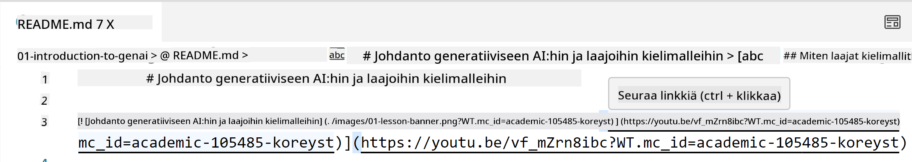
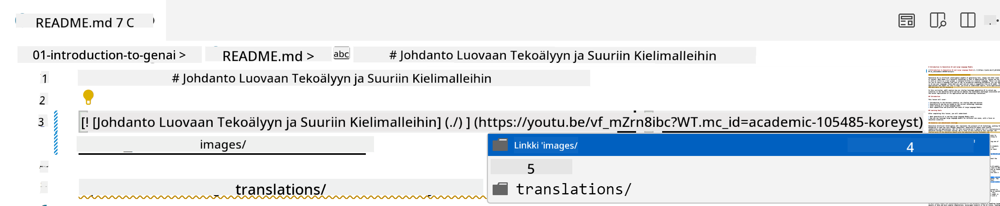
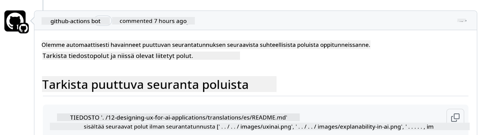
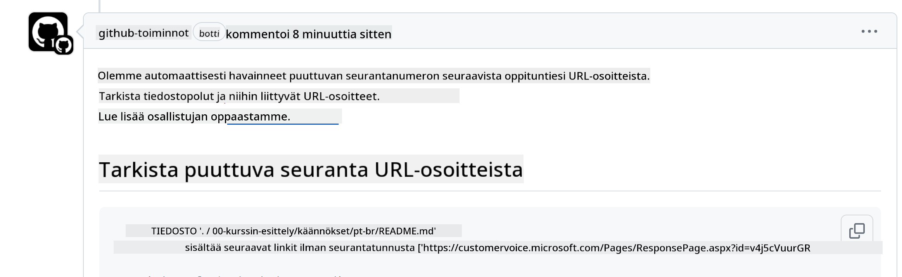
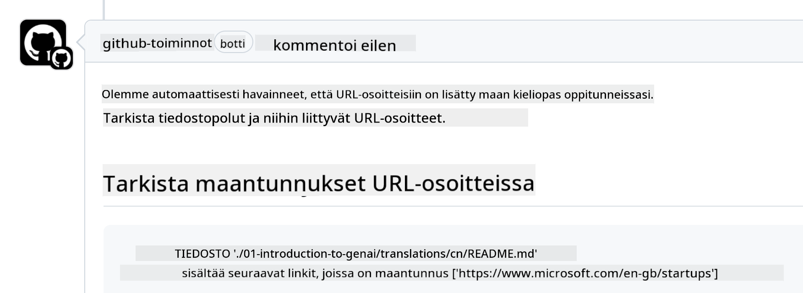

<!--
CO_OP_TRANSLATOR_METADATA:
{
  "original_hash": "57c41f2af71001a2cff9d8eb797cb843",
  "translation_date": "2025-06-25T07:13:26+00:00",
  "source_file": "CONTRIBUTING.md",
  "language_code": "fi"
}
-->
# Osallistuminen

Tämä projekti toivottaa tervetulleiksi osallistumiset ja ehdotukset. Useimmat osallistumiset vaativat, että hyväksyt Contributor License Agreement (CLA) -sopimuksen, jossa ilmoitat, että sinulla on oikeus antaa meille oikeudet käyttää panostasi. Lisätietoja on osoitteessa <https://cla.microsoft.com>.

> Tärkeää: kun käännät tekstiä tässä repo:ssa, varmista, että et käytä konekäännöstä. Vahvistamme käännökset yhteisön kautta, joten ilmoittaudu kääntämään vain kielille, joissa olet taitava.

Kun lähetät pull-pyynnön, CLA-bot määrittää automaattisesti, tarvitsetko CLA:n, ja merkitsee PR:n asianmukaisesti (esim. merkintä, kommentti). Seuraa yksinkertaisesti botin antamia ohjeita. Tämä tarvitsee tehdä vain kerran kaikissa repositorioissa, jotka käyttävät CLA:ta.

## Käytännesäännöt

Tämä projekti on omaksunut [Microsoft Open Source Code of Conduct](https://opensource.microsoft.com/codeofconduct/?WT.mc_id=academic-105485-koreyst). Lisätietoja saat lukemalla [Code of Conduct FAQ](https://opensource.microsoft.com/codeofconduct/faq/?WT.mc_id=academic-105485-koreyst) tai ottamalla yhteyttä [opencode@microsoft.com](mailto:opencode@microsoft.com) lisäkysymyksissä tai kommenteissa.

## Kysymys tai ongelma?

Älä avaa GitHub-ongelmia yleisiä tukikysymyksiä varten, sillä GitHub-listaa tulisi käyttää ominaisuuspyyntöihin ja virheraportteihin. Näin voimme helpommin seurata todellisia ongelmia tai virheitä koodista ja pitää yleinen keskustelu erillään varsinaisesta koodista.

## Kirjoitusvirheet, ongelmat, virheet ja osallistumiset

Aina kun teet muutoksia Generative AI for Beginners -repositorioon, noudata näitä suosituksia.

* Haaroita aina repositorio omaan tiliisi ennen kuin teet muutoksia
* Älä yhdistä useita muutoksia yhteen pull-pyyntöön. Esimerkiksi, lähetä virheenkorjaus ja dokumentaatiopäivitykset erillisinä PR:inä
* Jos pull-pyyntösi näyttää yhdistämiskonflikteja, varmista, että päivität paikallisen päähaarasi vastaamaan päärepositorion sisältöä ennen muutosten tekemistä
* Jos lähetät käännöksen, luo yksi PR kaikille käännetyille tiedostoille, sillä emme hyväksy osittaisia käännöksiä sisällöstä
* Jos lähetät kirjoitus- tai dokumentaatiokorjauksen, voit yhdistää muutokset yhteen PR:ään, jos se on sopivaa

## Yleiset ohjeet kirjoittamiseen

- Varmista, että kaikki URL-osoitteet on kääritty hakasulkeisiin, joita seuraa sulku ilman ylimääräisiä välilyöntejä niiden ympärillä tai sisällä ``.
- Varmista, että kaikki suhteelliset linkit (eli linkit muihin tiedostoihin ja kansioihin repositoriossa) alkavat `./` viitaten tiedostoon tai kansioon, joka sijaitsee nykyisessä työhakemistossa, tai `../` viitaten tiedostoon tai kansioon, joka sijaitsee ylemmässä työhakemistossa.
- Varmista, että kaikki suhteelliset linkit (eli linkit muihin tiedostoihin ja kansioihin repositoriossa) sisältävät seuranta-ID:n (eli `?` tai `&` sitten `wt.mc_id=` tai `WT.mc_id=`) lopussa.
- Varmista, että mikä tahansa URL seuraavista verkkotunnuksista _github.com, microsoft.com, visualstudio.com, aka.ms, ja azure.com_ sisältää seuranta-ID:n (eli `?` tai `&` sitten `wt.mc_id=` tai `WT.mc_id=`) lopussa.
- Varmista, että linkeissäsi ei ole maakohtaista kieliversiota (eli `/en-us/` tai `/en/`).
- Varmista, että kaikki kuvat on tallennettu `./images`-kansioon.
- Varmista, että kuvilla on kuvailevat nimet käyttäen englantilaisia kirjaimia, numeroita ja viivoja kuvasi nimessä.

## GitHub-työnkulut

Kun lähetät pull-pyynnön, neljä eri työnkulkua käynnistyy tarkistamaan edelliset säännöt. Seuraa yksinkertaisesti tässä lueteltuja ohjeita läpäistäksesi työnkulun tarkistukset.

- [Tarkista rikkinäiset suhteelliset polut](../..)
- [Tarkista, että poluilla on seuranta](../..)
- [Tarkista, että URL-osoitteilla on seuranta](../..)
- [Tarkista, ettei URL-osoitteilla ole kieliversiota](../..)

### Tarkista rikkinäiset suhteelliset polut

Tämä työnkulku varmistaa, että mikä tahansa suhteellinen polku tiedostoissasi toimii. Tämä repositorio on julkaistu GitHub Pages -sivustolle, joten sinun on oltava hyvin varovainen, kun kirjoitat linkkejä, jotka liittävät kaiken yhteen, jotta et ohjaa ketään väärään paikkaan.

Varmistaaksesi, että linkkisi toimivat oikein, käytä yksinkertaisesti VS-koodia tarkistaaksesi ne.

Esimerkiksi, kun viet hiiren minkä tahansa linkin päälle tiedostoissasi, sinua kehotetaan seuraamaan linkkiä painamalla **ctrl + click**

Jos napsautat linkkiä ja se ei toimi paikallisesti, se varmasti laukaisee työnkulun ja ei toimi GitHubissa.

Korjataksesi tämän ongelman, yritä kirjoittaa linkki VS-koodin avulla.

Kun kirjoitat `./` tai `../`, VS-koodi kehottaa sinua valitsemaan käytettävissä olevista vaihtoehdoista sen mukaan, mitä kirjoitit.

Seuraa polkua napsauttamalla haluttua tiedostoa tai kansiota ja varmistat, että polkusi ei ole rikki.

Kun lisäät oikean suhteellisen polun, tallenna ja työnnä muutoksesi, jolloin työnkulku käynnistyy uudelleen tarkistamaan muutoksesi. Jos läpäiset tarkistuksen, olet valmis jatkamaan.

### Tarkista, että poluilla on seuranta

Tämä työnkulku varmistaa, että mikä tahansa suhteellinen polku sisältää seurannan. Tämä repositorio on julkaistu GitHub Pages -sivustolle, joten meidän on seurattava liikkumista eri tiedostojen ja kansioiden välillä.

Varmistaaksesi, että suhteellisilla poluillasi on seuranta, tarkista yksinkertaisesti seuraava teksti `?wt.mc_id=` polun lopussa. Jos se on lisätty suhteellisiin polkuihisi, läpäiset tämän tarkistuksen.

Jos ei, saatat saada seuraavan virheen.

Korjataksesi tämän ongelman, yritä avata tiedostopolku, jonka työnkulku korosti, ja lisää seuranta-ID suhteellisten polkujen loppuun.

Kun lisäät seuranta-ID:n, tallenna ja työnnä muutoksesi, jolloin työnkulku käynnistyy uudelleen tarkistamaan muutoksesi. Jos läpäiset tarkistuksen, olet valmis jatkamaan.

### Tarkista, että URL-osoitteilla on seuranta

Tämä työnkulku varmistaa, että mikä tahansa web-URL sisältää seurannan. Tämä repositorio on kaikkien saatavilla, joten sinun on varmistettava, että seuraat pääsyä tietääksesi, mistä liikenne tulee.

Varmistaaksesi, että URL-osoitteillasi on seuranta, tarkista yksinkertaisesti seuraava teksti `?wt.mc_id=` URL-osoitteen lopussa. Jos se on lisätty URL-osoitteisiisi, läpäiset tämän tarkistuksen.

Jos ei, saatat saada seuraavan virheen.

Korjataksesi tämän ongelman, yritä avata tiedostopolku, jonka työnkulku korosti, ja lisää seuranta-ID URL-osoitteiden loppuun.

Kun lisäät seuranta-ID:n, tallenna ja työnnä muutoksesi, jolloin työnkulku käynnistyy uudelleen tarkistamaan muutoksesi. Jos läpäiset tarkistuksen, olet valmis jatkamaan.

### Tarkista, ettei URL-osoitteilla ole kieliversiota

Tämä työnkulku varmistaa, että mikä tahansa web-URL ei sisällä maakohtaista kieliversiota. Tämä repositorio on kaikkien saatavilla ympäri maailmaa, joten sinun on varmistettava, ettet sisällä maasi kieliversiota URL-osoitteissa.

Varmistaaksesi, että URL-osoitteissasi ei ole maakohtaista kieliversiota, tarkista yksinkertaisesti seuraava teksti `/en-us/` tai `/en/` tai mikä tahansa muu kieliversio missä tahansa URL-osoitteessa. Jos sitä ei ole URL-osoitteissasi, läpäiset tämän tarkistuksen.

Jos ei, saatat saada seuraavan virheen.

Korjataksesi tämän ongelman, yritä avata tiedostopolku, jonka työnkulku korosti, ja poista maakohtainen kieliversio URL-osoitteista.

Kun poistat maakohtaisen kieliversion, tallenna ja työnnä muutoksesi, jolloin työnkulku käynnistyy uudelleen tarkistamaan muutoksesi. Jos läpäiset tarkistuksen, olet valmis jatkamaan.

Onnittelut! Palaamme sinulle mahdollisimman pian palautteen kanssa panoksestasi.

**Vastuuvapauslauseke**:  
Tämä asiakirja on käännetty käyttämällä tekoälypohjaista käännöspalvelua [Co-op Translator](https://github.com/Azure/co-op-translator). Pyrimme tarkkuuteen, mutta huomioithan, että automaattiset käännökset saattavat sisältää virheitä tai epätarkkuuksia. Alkuperäistä asiakirjaa sen alkuperäisellä kielellä tulisi pitää auktoritatiivisena lähteenä. Kriittisen tiedon osalta suositellaan ammattimaista ihmiskäännöstä. Emme ole vastuussa mahdollisista väärinkäsityksistä tai virheellisistä tulkinnoista, jotka johtuvat tämän käännöksen käytöstä.