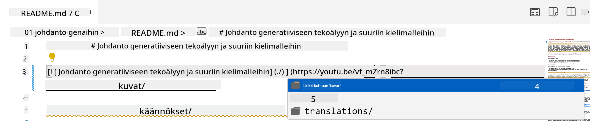
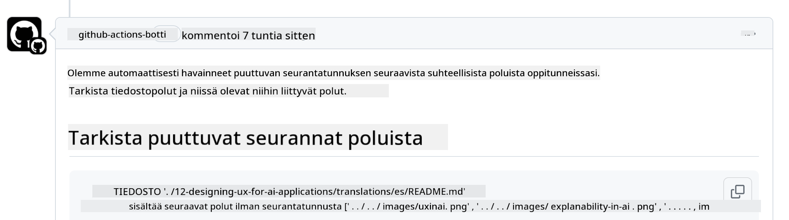
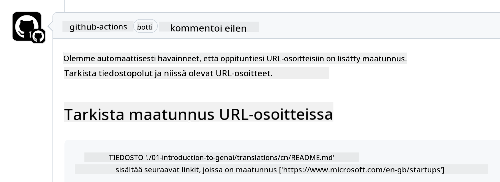

<!--
CO_OP_TRANSLATOR_METADATA:
{
  "original_hash": "57c41f2af71001a2cff9d8eb797cb843",
  "translation_date": "2025-07-09T06:08:36+00:00",
  "source_file": "CONTRIBUTING.md",
  "language_code": "fi"
}
-->
# Osallistuminen

Tämä projekti toivottaa tervetulleiksi panokset ja ehdotukset. Useimmat panokset edellyttävät, että hyväksyt Contributor License Agreementin (CLA), jossa vahvistat, että sinulla on oikeus ja todellisuudessa myönnät meille oikeudet käyttää panostasi. Lisätietoja löytyy osoitteesta <https://cla.microsoft.com>.

> Tärkeää: kun käännät tekstiä tässä repossa, varmista, ettet käytä konekäännöstä. Tarkistamme käännökset yhteisön avulla, joten ilmoittaudu vapaaehtoiseksi vain kielissä, joissa olet taitava.

Kun lähetät pull requestin, CLA-botti määrittää automaattisesti, tarvitsetko CLA:n ja merkitsee PR:n asianmukaisesti (esim. tunniste, kommentti). Noudata vain botin antamia ohjeita. Tämä riittää tekemään vain kerran kaikissa CLA:ta käyttävissä repohin.

## Käyttäytymissäännöt

Tämä projekti on ottanut käyttöön [Microsoft Open Source Code of Conductin](https://opensource.microsoft.com/codeofconduct/?WT.mc_id=academic-105485-koreyst).  
Lisätietoja löydät [Code of Conduct FAQ:sta](https://opensource.microsoft.com/codeofconduct/faq/?WT.mc_id=academic-105485-koreyst) tai ota yhteyttä osoitteeseen [opencode@microsoft.com](mailto:opencode@microsoft.com) lisäkysymyksiä tai kommentteja varten.

## Kysymys tai ongelma?

Älä avaa GitHub-issueita yleisille tukikysymyksille, sillä GitHub-listaa tulisi käyttää ominaisuuspyyntöihin ja bugiraportteihin. Näin voimme helpommin seurata todellisia ongelmia tai bugeja koodissa ja pitää yleisen keskustelun erillään varsinaisesta koodista.

## Kirjoitusvirheet, ongelmat, bugit ja panokset

Kun teet muutoksia Generative AI for Beginners -repossa, noudata seuraavia suosituksia.

* Tee aina oma fork reposta ennen kuin teet muutoksia
* Älä yhdistä useita muutoksia yhteen pull requestiin. Esimerkiksi lähetä bugikorjaukset ja dokumentaatiopäivitykset erillisinä PR:inä
* Jos pull requestissasi on merge-konflikteja, varmista, että päivität paikallisen main-haarasi vastaamaan päärepossa olevaa main-haaraa ennen muutosten tekemistä
* Jos lähetät käännöksen, tee yksi PR kaikista käännetyistä tiedostoista, sillä emme hyväksy osittaisia käännöksiä sisällöstä
* Jos lähetät kirjoitusvirheen tai dokumentaatiokorjauksen, voit yhdistää muutokset yhteen PR:ään, jos se on sopivaa

## Yleisiä ohjeita kirjoittamiseen

- Varmista, että kaikki URL-osoitteesi ovat hakasulkeissa ja niitä seuraa sulkeet ilman ylimääräisiä välilyöntejä ``.
- Varmista, että kaikki suhteelliset linkit (eli linkit muihin tiedostoihin ja kansioihin repossa) alkavat `./` viitaten nykyisen työskentelykansion tiedostoon tai kansioon tai `../` viitaten ylemmän tason kansioon tai tiedostoon.
- Varmista, että kaikissa suhteellisissa linkeissä on seuranta-ID (eli `?` tai `&` ja sitten `wt.mc_id=` tai `WT.mc_id=`) linkin lopussa.
- Varmista, että kaikissa seuraavien domainien URL-osoitteissa _github.com, microsoft.com, visualstudio.com, aka.ms ja azure.com_ on seuranta-ID (eli `?` tai `&` ja sitten `wt.mc_id=` tai `WT.mc_id=`) linkin lopussa.
- Varmista, ettei linkeissäsi ole maakohtaisia paikallisasetuksia (esim. `/en-us/` tai `/en/`).
- Varmista, että kaikki kuvat ovat tallennettu `./images`-kansioon.
- Varmista, että kuvilla on kuvaavat nimet, joissa on englanninkielisiä merkkejä, numeroita ja väliviivoja.

## GitHub-työnkulut

Kun lähetät pull requestin, neljä eri työnkulkua käynnistyy tarkistamaan yllä olevat säännöt.  
Noudata tässä annettuja ohjeita läpäistäksesi työnkulkujen tarkistukset.

- [Tarkista rikkinäiset suhteelliset polut](../..)
- [Tarkista, että poluissa on seuranta](../..)
- [Tarkista, että URL-osoitteissa on seuranta](../..)
- [Tarkista, ettei URL-osoitteissa ole paikallisasetuksia](../..)

### Tarkista rikkinäiset suhteelliset polut

Tämä työnkulku varmistaa, että tiedostoissasi olevat suhteelliset polut toimivat.  
Tämä repo on julkaistu GitHub Pages -palvelussa, joten sinun täytyy olla tarkkana linkkien kanssa, jotta kukaan ei päädy väärään paikkaan.

Varmista linkkien toimivuus käyttämällä VS Codea.

Esimerkiksi, kun viet hiiren minkä tahansa linkin päälle tiedostoissasi, voit seurata linkkiä painamalla **ctrl + klikkaus**

Jos klikkaat linkkiä ja se ei toimi paikallisesti, työnkulku varmasti epäonnistuu eikä linkki toimi GitHubissa.

Korjataksesi tämän, kirjoita linkki VS Coden avulla.

Kun kirjoitat `./` tai `../`, VS Code ehdottaa käytettävissä olevia vaihtoehtoja kirjoittamasi perusteella.

Seuraa polkua klikkaamalla haluamaasi tiedostoa tai kansiota, niin voit olla varma, ettei polkusi ole rikki.

Kun lisäät oikean suhteellisen polun, tallenna ja työnnä muutokset, työnkulku käynnistyy uudelleen tarkistamaan muutokset.  
Jos tarkistus menee läpi, voit jatkaa.

### Tarkista, että poluissa on seuranta

Tämä työnkulku varmistaa, että kaikissa suhteellisissa poluissa on seuranta.  
Repo on julkaistu GitHub Pages -palvelussa, joten meidän täytyy seurata liikkumista eri tiedostojen ja kansioiden välillä.

Varmista, että suhteellisissa poluissasi on seuranta tarkistamalla, että polun lopussa on teksti `?wt.mc_id=`.  
Jos se on lisätty, tarkistus menee läpi.

Jos ei, saatat saada seuraavan virheen.

Korjataksesi tämän, avaa työnkulun osoittama tiedostopolku ja lisää seuranta-ID suhteellisten polkujen loppuun.

Kun lisäät seuranta-ID:n, tallenna ja työnnä muutokset, työnkulku käynnistyy uudelleen tarkistamaan muutokset.  
Jos tarkistus menee läpi, voit jatkaa.

### Tarkista, että URL-osoitteissa on seuranta

Tämä työnkulku varmistaa, että kaikissa web-URL-osoitteissa on seuranta.  
Repo on kaikkien saatavilla, joten sinun täytyy varmistaa, että liikenteen lähde voidaan jäljittää.

Varmista, että URL-osoitteissasi on seuranta tarkistamalla, että URL:n lopussa on teksti `?wt.mc_id=`.  
Jos se on lisätty, tarkistus menee läpi.

Jos ei, saatat saada seuraavan virheen.

Korjataksesi tämän, avaa työnkulun osoittama tiedostopolku ja lisää seuranta-ID URL-osoitteiden loppuun.

Kun lisäät seuranta-ID:n, tallenna ja työnnä muutokset, työnkulku käynnistyy uudelleen tarkistamaan muutokset.  
Jos tarkistus menee läpi, voit jatkaa.

### Tarkista, ettei URL-osoitteissa ole paikallisasetuksia

Tämä työnkulku varmistaa, ettei web-URL-osoitteissa ole maakohtaisia paikallisasetuksia.  
Repo on kaikkien saatavilla ympäri maailmaa, joten sinun täytyy varmistaa, ettei URL-osoitteissa ole oman maasi paikallisasetusta.

Varmista, ettei URL-osoitteissasi ole paikallisasetusta tarkistamalla, ettei URL:ssa ole tekstiä `/en-us/`, `/en/` tai muita kielikohtaisia paikallisasetuksia.  
Jos niitä ei ole, tarkistus menee läpi.

Jos on, saatat saada seuraavan virheen.

Korjataksesi tämän, avaa työnkulun osoittama tiedostopolku ja poista maakohtainen paikallisasetus URL-osoitteista.

Kun poistat paikallisasetuksen, tallenna ja työnnä muutokset, työnkulku käynnistyy uudelleen tarkistamaan muutokset.  
Jos tarkistus menee läpi, voit jatkaa.

Onnittelut! Otamme sinuun yhteyttä mahdollisimman pian palautteen kanssa panoksestasi.

**Vastuuvapauslauseke**:  
Tämä asiakirja on käännetty käyttämällä tekoälypohjaista käännöspalvelua [Co-op Translator](https://github.com/Azure/co-op-translator). Vaikka pyrimme tarkkuuteen, huomioithan, että automaattikäännöksissä saattaa esiintyä virheitä tai epätarkkuuksia. Alkuperäistä asiakirjaa sen alkuperäiskielellä tulee pitää virallisena lähteenä. Tärkeissä tiedoissa suositellaan ammattimaista ihmiskäännöstä. Emme ole vastuussa tämän käännöksen käytöstä aiheutuvista väärinymmärryksistä tai tulkinnoista.