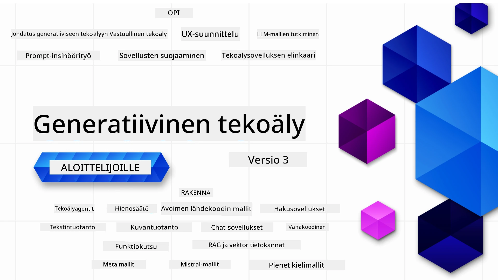

### 21 Oppituntia, jotka opettavat kaiken tarvittavan generatiivisten tekoälysovellusten rakentamisen aloittamiseen

[](https://github.com/microsoft/Generative-AI-For-Beginners/blob/master/LICENSE?WT.mc_id=academic-105485-koreyst)
[](https://GitHub.com/microsoft/Generative-AI-For-Beginners/graphs/contributors/?WT.mc_id=academic-105485-koreyst)
[](https://GitHub.com/microsoft/Generative-AI-For-Beginners/issues/?WT.mc_id=academic-105485-koreyst)
[](https://GitHub.com/microsoft/Generative-AI-For-Beginners/pulls/?WT.mc_id=academic-105485-koreyst)
[](http://makeapullrequest.com?WT.mc_id=academic-105485-koreyst)

[](https://GitHub.com/microsoft/Generative-AI-For-Beginners/watchers/?WT.mc_id=academic-105485-koreyst)
[](https://GitHub.com/microsoft/Generative-AI-For-Beginners/network/?WT.mc_id=academic-105485-koreyst)
[](https://GitHub.com/microsoft/Generative-AI-For-Beginners/stargazers/?WT.mc_id=academic-105485-koreyst)

[](https://discord.gg/nTYy5BXMWG)

### 🌐 Monikielinen tuki

#### Tuettu GitHub-toiminnon kautta (automaattinen ja aina ajan tasalla)

<!-- CO-OP TRANSLATOR LANGUAGES TABLE START -->
[Arabic](../ar/README.md) | [Bengali](../bn/README.md) | [Bulgarian](../bg/README.md) | [Burmese (Myanmar)](../my/README.md) | [Chinese (Simplified)](../zh-CN/README.md) | [Chinese (Traditional, Hong Kong)](../zh-HK/README.md) | [Chinese (Traditional, Macau)](../zh-MO/README.md) | [Chinese (Traditional, Taiwan)](../zh-TW/README.md) | [Croatian](../hr/README.md) | [Czech](../cs/README.md) | [Danish](../da/README.md) | [Dutch](../nl/README.md) | [Estonian](../et/README.md) | [Finnish](./README.md) | [French](../fr/README.md) | [German](../de/README.md) | [Greek](../el/README.md) | [Hebrew](../he/README.md) | [Hindi](../hi/README.md) | [Hungarian](../hu/README.md) | [Indonesian](../id/README.md) | [Italian](../it/README.md) | [Japanese](../ja/README.md) | [Kannada](../kn/README.md) | [Korean](../ko/README.md) | [Lithuanian](../lt/README.md) | [Malay](../ms/README.md) | [Malayalam](../ml/README.md) | [Marathi](../mr/README.md) | [Nepali](../ne/README.md) | [Nigerian Pidgin](../pcm/README.md) | [Norwegian](../no/README.md) | [Persian (Farsi)](../fa/README.md) | [Polish](../pl/README.md) | [Portuguese (Brazil)](../pt-BR/README.md) | [Portuguese (Portugal)](../pt-PT/README.md) | [Punjabi (Gurmukhi)](../pa/README.md) | [Romanian](../ro/README.md) | [Russian](../ru/README.md) | [Serbian (Cyrillic)](../sr/README.md) | [Slovak](../sk/README.md) | [Slovenian](../sl/README.md) | [Spanish](../es/README.md) | [Swahili](../sw/README.md) | [Swedish](../sv/README.md) | [Tagalog (Filipino)](../tl/README.md) | [Tamil](../ta/README.md) | [Telugu](../te/README.md) | [Thai](../th/README.md) | [Turkish](../tr/README.md) | [Ukrainian](../uk/README.md) | [Urdu](../ur/README.md) | [Vietnamese](../vi/README.md)

> **Haluatko kloonata paikallisesti?**

> Tämä arkisto sisältää yli 50 kielikäännöstä, mikä lisää latauskoon merkittävästi. Jos haluat kloonata ilman käännöksiä, käytä harvaa checkoutia:
> ```bash
> git clone --filter=blob:none --sparse https://github.com/microsoft/generative-ai-for-beginners.git
> cd generative-ai-for-beginners
> git sparse-checkout set --no-cone '/*' '!translations' '!translated_images'
> ```
> Tämä antaa sinulle kaiken tarvittavan kurssin suorittamiseen nopeammalla latauksella.
<!-- CO-OP TRANSLATOR LANGUAGES TABLE END -->

# Generatiivinen tekoäly aloittelijoille (Versio 3) - Kurssi

Opi generatiivisten tekoälysovellusten rakentamisen perusteet Microsoft Cloud Advocates -tiimimme kattavalla 21 oppitunnin kurssilla.

## 🌱 Aloittaminen

Tässä kurssissa on 21 oppituntia. Jokainen oppitunti kattaa oman aiheensa, joten aloita mistä haluat!

Oppitunnit on luokiteltu joko "Opi" -oppitunneiksi, jotka selittävät generatiivisen tekoälyn käsitteen, tai "Rakenna" -oppitunneiksi, joissa konseptit ja koodiesimerkit selitetään sekä **Pythonilla** että **TypeScriptiltä** mahdollisuuksien mukaan.

.NET-kehittäjille suosittelemme tutustumaan [Generative AI for Beginners (.NET Edition)](https://github.com/microsoft/Generative-AI-for-beginners-dotnet?WT.mc_id=academic-105485-koreyst)!

Jokaisessa oppitunnissa on myös "Jatka oppimista" -osio, jossa on lisäoppimistyökaluja.

## Mitä tarvitset
### Tämän kurssin koodin suorittamiseen voit käyttää jompaa kumpaa: 
 - [Azure OpenAI Service](https://aka.ms/genai-beginners/azure-open-ai?WT.mc_id=academic-105485-koreyst) - **Oppitunnit:** "aoai-assignment"
 - [GitHub Marketplace Model Catalog](https://aka.ms/genai-beginners/gh-models?WT.mc_id=academic-105485-koreyst) - **Oppitunnit:** "githubmodels"
 - [OpenAI API](https://aka.ms/genai-beginners/open-ai?WT.mc_id=academic-105485-koreyst) - **Oppitunnit:** "oai-assignment" 
   
- Perustiedot Pythonista tai TypeScriptistä auttavat - \*Täysin aloittelijoille suosittelemme näitä [Python](https://aka.ms/genai-beginners/python?WT.mc_id=academic-105485-koreyst) ja [TypeScript](https://aka.ms/genai-beginners/typescript?WT.mc_id=academic-105485-koreyst) kursseja
- GitHub-tili, jotta voit [forkata tämän koko arkiston](https://aka.ms/genai-beginners/github?WT.mc_id=academic-105485-koreyst) omaan GitHub-tiliisi

Olemme luoneet **[Kurssin asennus](./00-course-setup/README.md?WT.mc_id=academic-105485-koreyst)** -oppitunnin auttamaan kehitysympäristön asentamisessa.

Älä unohda [tähtää (🌟) tätä arkistoa](https://docs.github.com/en/get-started/exploring-projects-on-github/saving-repositories-with-stars?WT.mc_id=academic-105485-koreyst) löytääksesi sen helpommin myöhemmin.

## 🧠 Valmis käyttöönottoon?

Jos etsit edistyneempiä koodiesimerkkejä, tutustu [generatiivisen tekoälyn koodiesimerkkikokoelmaamme](https://aka.ms/genai-beg-code?WT.mc_id=academic-105485-koreyst) sekä **Pythonilla** että **TypeScriptillä**.

## 🗣️ Tapaa muita oppijoita, saa tukea

Liity [viralliselle Azure AI Foundry Discord -palvelimelle](https://aka.ms/genai-discord?WT.mc_id=academic-105485-koreyst) tavata ja verkostoitua kurssia käyvien muiden oppijoiden kanssa ja saadaksesi tukea.

Esitä kysymyksiä tai jaa palautetta tuotteesta [Azure AI Foundry -kehittäjäfoorumilla](https://aka.ms/azureaifoundry/forum) GitHubissa.

## 🚀 Startupin rakentaminen?

Vieraile [Microsoft for Startups](https://www.microsoft.com/startups) -sivustolla ja selvitä, miten voit aloittaa rakentamisen Azure-luotoilla jo tänään.

## 🙏 Haluatko auttaa?

Onko sinulla ehdotuksia tai oletko löytänyt kirjoitus- tai koodivirheitä? [Avaa issue](https://github.com/microsoft/generative-ai-for-beginners/issues?WT.mc_id=academic-105485-koreyst) tai [Luo pull-pyyntö](https://github.com/microsoft/generative-ai-for-beginners/pulls?WT.mc_id=academic-105485-koreyst)

## 📂 Jokainen oppitunti sisältää:

- Lyhyen videon johdannon aiheeseen
- Kirjallisen oppitunnin README-tiedostossa
- Python- ja TypeScript-koodiesimerkit, jotka tukevat Azure OpenAI:ta ja OpenAI API:ta
- Linkkejä lisäresursseihin oppimisen jatkamiseksi

## 🗃️ Oppitunnit

| #   | **Oppitunnin linkki**                                                                                                                         | **Kuvaus**                                                                                      | **Video**                                                                   | **Lisäoppimista**                                                              |
| --- | -------------------------------------------------------------------------------------------------------------------------------------------- | ---------------------------------------------------------------------------------------------- | --------------------------------------------------------------------------- | ------------------------------------------------------------------------------ |
| 00  | [Kurssin asennus](./00-course-setup/README.md?WT.mc_id=academic-105485-koreyst)                                                              | **Opi:** Kuinka asentaa kehitysympäristösi                                                    | Video tulossa pian                                                           | [Lue lisää](https://aka.ms/genai-collection?WT.mc_id=academic-105485-koreyst) |
| 01  | [Johdatus generatiiviseen tekoälyyn ja LLM-malleihin](./01-introduction-to-genai/README.md?WT.mc_id=academic-105485-koreyst)                   | **Opi:** Ymmärrä, mitä generatiivinen tekoäly on ja miten laajat kielimallit (LLM) toimivat     | [Video](https://aka.ms/gen-ai-lesson-1-gh?WT.mc_id=academic-105485-koreyst) | [Lue lisää](https://aka.ms/genai-collection?WT.mc_id=academic-105485-koreyst) |
| 02  | [Eri laajojen kielimallien tutkiminen ja vertaaminen](./02-exploring-and-comparing-different-llms/README.md?WT.mc_id=academic-105485-koreyst)  | **Opi:** Kuinka valita oikea malli käyttötarkoituksiisi                                        | [Video](https://aka.ms/gen-ai-lesson2-gh?WT.mc_id=academic-105485-koreyst)  | [Lue lisää](https://aka.ms/genai-collection?WT.mc_id=academic-105485-koreyst) |
| 03  | [Generatiivisen tekoälyn vastuullinen käyttö](./03-using-generative-ai-responsibly/README.md?WT.mc_id=academic-105485-koreyst)                  | **Opi:** Kuinka rakentaa generatiivisia tekoälysovelluksia vastuullisesti                      | [Video](https://aka.ms/gen-ai-lesson3-gh?WT.mc_id=academic-105485-koreyst)  | [Lue lisää](https://aka.ms/genai-collection?WT.mc_id=academic-105485-koreyst) |
| 04  | [Ymmärtäminen Prompt Engineeringin Perusteet](./04-prompt-engineering-fundamentals/README.md?WT.mc_id=academic-105485-koreyst)             | **Opi:** Käytännön Prompt Engineeringin parhaat käytännöt                                           | [Video](https://aka.ms/gen-ai-lesson4-gh?WT.mc_id=academic-105485-koreyst)  | [Lue lisää](https://aka.ms/genai-collection?WT.mc_id=academic-105485-koreyst) |
| 05  | [Edistyneiden Promptien Luominen](./05-advanced-prompts/README.md?WT.mc_id=academic-105485-koreyst)                                                | **Opi:** Kuinka soveltaa prompt engineering -tekniikoita, jotka parantavat promptiesi tulosta. | [Video](https://aka.ms/gen-ai-lesson5-gh?WT.mc_id=academic-105485-koreyst)  | [Lue lisää](https://aka.ms/genai-collection?WT.mc_id=academic-105485-koreyst) |
| 06  | [Tekstintuotantosovellusten Rakentaminen](./06-text-generation-apps/README.md?WT.mc_id=academic-105485-koreyst)                                | **Rakenna:** Tekstintuotantosovellus Azure OpenAI / OpenAI API:lla                                | [Video](https://aka.ms/gen-ai-lesson6-gh?WT.mc_id=academic-105485-koreyst)  | [Lue lisää](https://aka.ms/genai-collection?WT.mc_id=academic-105485-koreyst) |
| 07  | [Chat-sovellusten Rakentaminen](./07-building-chat-applications/README.md?WT.mc_id=academic-105485-koreyst)                                     | **Rakenna:** Tekniikoita chat-sovellusten tehokkaaseen rakentamiseen ja integrointiin.               | [Video](https://aka.ms/gen-ai-lessons7-gh?WT.mc_id=academic-105485-koreyst) | [Lue lisää](https://aka.ms/genai-collection?WT.mc_id=academic-105485-koreyst) |
| 08  | [Hakusovellusten Rakentaminen Vektorikantojen Avulla](./08-building-search-applications/README.md?WT.mc_id=academic-105485-koreyst)                        | **Rakenna:** Hakusovellus, joka käyttää Embeddings-menetelmää tietojen hakemiseen.                        | [Video](https://aka.ms/gen-ai-lesson8-gh?WT.mc_id=academic-105485-koreyst)  | [Lue lisää](https://aka.ms/genai-collection?WT.mc_id=academic-105485-koreyst) |
| 09  | [Kuvantuotantosovellusten Rakentaminen](./09-building-image-applications/README.md?WT.mc_id=academic-105485-koreyst)                        | **Rakenna:** Kuvantuotantosovellus                                                       | [Video](https://aka.ms/gen-ai-lesson9-gh?WT.mc_id=academic-105485-koreyst)  | [Lue lisää](https://aka.ms/genai-collection?WT.mc_id=academic-105485-koreyst) |
| 10  | [Low Code AI -sovellusten Rakentaminen](./10-building-low-code-ai-applications/README.md?WT.mc_id=academic-105485-koreyst)                       | **Rakenna:** Generatiivinen AI -sovellus Low Code -työkaluilla                                     | [Video](https://aka.ms/gen-ai-lesson10-gh?WT.mc_id=academic-105485-koreyst) | [Lue lisää](https://aka.ms/genai-collection?WT.mc_id=academic-105485-koreyst) |
| 11  | [Ulkoisten Sovellusten Integrointi Funktiokutsujen Avulla](./11-integrating-with-function-calling/README.md?WT.mc_id=academic-105485-koreyst) | **Rakenna:** Mitä funktiokutsu on ja sen käyttötapaukset sovelluksissa                          | [Video](https://aka.ms/gen-ai-lesson11-gh?WT.mc_id=academic-105485-koreyst) | [Lue lisää](https://aka.ms/genai-collection?WT.mc_id=academic-105485-koreyst) |
| 12  | [UX:n Suunnittelu AI-sovelluksiin](./12-designing-ux-for-ai-applications/README.md?WT.mc_id=academic-105485-koreyst)                         | **Opi:** Kuinka soveltaa UX-suunnitteluperiaatteita Generatiivisten AI -sovellusten kehityksessä         | [Video](https://aka.ms/gen-ai-lesson12-gh?WT.mc_id=academic-105485-koreyst) | [Lue lisää](https://aka.ms/genai-collection?WT.mc_id=academic-105485-koreyst) |
| 13  | [Generatiivisten AI-sovellusten Turvaaminen](./13-securing-ai-applications/README.md?WT.mc_id=academic-105485-koreyst)                         | **Opi:** Uhkat ja riskit AI-järjestelmille sekä keinot näiden järjestelmien turvaamiseen.             | [Video](https://aka.ms/gen-ai-lesson13-gh?WT.mc_id=academic-105485-koreyst) | [Lue lisää](https://aka.ms/genai-collection?WT.mc_id=academic-105485-koreyst) |
| 14  | [Generatiivisen AI-sovelluksen Elinkaari](./14-the-generative-ai-application-lifecycle/README.md?WT.mc_id=academic-105485-koreyst)           | **Opi:** Työkalut ja mittarit LLM-elinkaaren ja LLMOpsin hallintaan                         | [Video](https://aka.ms/gen-ai-lesson14-gh?WT.mc_id=academic-105485-koreyst) | [Lue lisää](https://aka.ms/genai-collection?WT.mc_id=academic-105485-koreyst) |
| 15  | [Retrieval Augmented Generation (RAG) ja Vektorikannat](./15-rag-and-vector-databases/README.md?WT.mc_id=academic-105485-koreyst)        | **Rakenna:** Sovellus, joka käyttää RAG-kehystä hakeakseen upotuksia Vektorikannoista  | [Video](https://aka.ms/gen-ai-lesson15-gh?WT.mc_id=academic-105485-koreyst) | [Lue lisää](https://aka.ms/genai-collection?WT.mc_id=academic-105485-koreyst) |
| 16  | [Avoimen Lähdekoodin Mallit ja Hugging Face](./16-open-source-models/README.md?WT.mc_id=academic-105485-koreyst)                                    | **Rakenna:** Sovellus, joka käyttää avoimen lähdekoodin malleja Hugging Facesta                    | [Video](https://aka.ms/gen-ai-lesson16-gh?WT.mc_id=academic-105485-koreyst) | [Lue lisää](https://aka.ms/genai-collection?WT.mc_id=academic-105485-koreyst) |
| 17  | [AI-agentit](./17-ai-agents/README.md?WT.mc_id=academic-105485-koreyst)                                                                       | **Rakenna:** Sovellus, joka käyttää AI Agent -kehystä                                           | [Video](https://aka.ms/gen-ai-lesson17-gh?WT.mc_id=academic-105485-koreyst) | [Lue lisää](https://aka.ms/genai-collection?WT.mc_id=academic-105485-koreyst) |
| 18  | [LLM-mallien hienosäätö](./18-fine-tuning/README.md?WT.mc_id=academic-105485-koreyst)                                                              | **Opi:** Mitä, miksi ja miten LLM-malleja hienosäädetään                                            | [Video](https://aka.ms/gen-ai-lesson18-gh?WT.mc_id=academic-105485-koreyst) | [Lue lisää](https://aka.ms/genai-collection?WT.mc_id=academic-105485-koreyst) |
| 19  | [Rakentaminen Pienten Kielenmallien (SLM) kanssa](./19-slm/README.md?WT.mc_id=academic-105485-koreyst)                                                              | **Opi:** Pienten kielenmallien rakentamisen edut                                            | Tulossa video | [Lue lisää](https://aka.ms/genai-collection?WT.mc_id=academic-105485-koreyst) |
| 20  | [Rakentaminen Mistral-mallien kanssa](./20-mistral/README.md?WT.mc_id=academic-105485-koreyst)                                                              | **Opi:** Mistral-perheen mallien ominaisuudet ja erot                                           | Tulossa video | [Lue lisää](https://aka.ms/genai-collection?WT.mc_id=academic-105485-koreyst) |
| 21  | [Rakentaminen Meta-mallien kanssa](./21-meta/README.md?WT.mc_id=academic-105485-koreyst)                                                              | **Opi:** Meta-perheen mallien ominaisuudet ja erot                                           | Tulossa video | [Lue lisää](https://aka.ms/genai-collection?WT.mc_id=academic-105485-koreyst) |

### 🌟 Erityiskiitokset

Erityiskiitokset [**John Azizille**](https://www.linkedin.com/in/john0isaac/) kaikista GitHub-toiminnoista ja työnkuluista

[**Bernhard Merklelle**](https://www.linkedin.com/in/bernhard-merkle-738b73/) joka teki keskeisiä parannuksia jokaiselle oppitunnille parantaakseen oppimiskokemusta ja koodin laatua.

## 🎒 Muut kurssit

Tiimimme tuottaa myös muita kursseja! Tutustu:

<!-- CO-OP TRANSLATOR OTHER COURSES START -->
### LangChain
[](https://aka.ms/langchain4j-for-beginners)
[](https://aka.ms/langchainjs-for-beginners?WT.mc_id=m365-94501-dwahlin)

---

### Azure / Edge / MCP / Agentit
[](https://github.com/microsoft/AZD-for-beginners?WT.mc_id=academic-105485-koreyst)
[](https://github.com/microsoft/edgeai-for-beginners?WT.mc_id=academic-105485-koreyst)
[](https://github.com/microsoft/mcp-for-beginners?WT.mc_id=academic-105485-koreyst)
[](https://github.com/microsoft/ai-agents-for-beginners?WT.mc_id=academic-105485-koreyst)

---
 
### Generatiiviset AI -sarjat
[](https://github.com/microsoft/generative-ai-for-beginners?WT.mc_id=academic-105485-koreyst)
[-9333EA?style=for-the-badge&labelColor=E5E7EB&color=9333EA)](https://github.com/microsoft/Generative-AI-for-beginners-dotnet?WT.mc_id=academic-105485-koreyst)
[-C084FC?style=for-the-badge&labelColor=E5E7EB&color=C084FC)](https://github.com/microsoft/generative-ai-for-beginners-java?WT.mc_id=academic-105485-koreyst)
[-E879F9?style=for-the-badge&labelColor=E5E7EB&color=E879F9)](https://github.com/microsoft/generative-ai-with-javascript?WT.mc_id=academic-105485-koreyst)

---
 
### Ydinopetus
[](https://aka.ms/ml-beginners?WT.mc_id=academic-105485-koreyst)
[](https://aka.ms/datascience-beginners?WT.mc_id=academic-105485-koreyst)
[](https://aka.ms/ai-beginners?WT.mc_id=academic-105485-koreyst)
[](https://github.com/microsoft/Security-101?WT.mc_id=academic-96948-sayoung)
[](https://aka.ms/webdev-beginners?WT.mc_id=academic-105485-koreyst)
[](https://aka.ms/iot-beginners?WT.mc_id=academic-105485-koreyst)
[](https://github.com/microsoft/xr-development-for-beginners?WT.mc_id=academic-105485-koreyst)

---
 
### Copilot-sarja
[](https://aka.ms/GitHubCopilotAI?WT.mc_id=academic-105485-koreyst)
[](https://github.com/microsoft/mastering-github-copilot-for-dotnet-csharp-developers?WT.mc_id=academic-105485-koreyst)
[](https://github.com/microsoft/CopilotAdventures?WT.mc_id=academic-105485-koreyst)
<!-- CO-OP TRANSLATOR OTHER COURSES END -->

## Saat apua

Jos jumitut tai sinulla on kysyttävää tekoälysovellusten rakentamisesta. Liity muiden oppijoiden ja kokeneiden kehittäjien keskusteluihin MCP:stä. Se on tukeva yhteisö, jossa kysymyksiä saa esittää ja tietoa jaetaan vapaasti.

[](https://discord.gg/nTYy5BXMWG)

Jos sinulla on tuotepalautetta tai kohtaat virheitä rakentamisen aikana, käy osoitteessa:

[](https://aka.ms/foundry/forum)

---

<!-- CO-OP TRANSLATOR DISCLAIMER START -->
**Vastuuvapauslauseke**:  
Tämä asiakirja on käännetty käyttäen tekoälypohjaista käännöspalvelua [Co-op Translator](https://github.com/Azure/co-op-translator). Pyrimme tarkkuuteen, mutta automaattisissa käännöksissä voi esiintyä virheitä tai epätarkkuuksia. Alkuperäistä asiakirjaa sen alkuperäisellä kielellä tulee pitää virallisena lähteenä. Tärkeissä asioissa suositellaan ammattimaista ihmiskäännöstä. Emme ole vastuussa mahdollisista väärinymmärryksistä tai tulkinnoista, jotka johtuvat tämän käännöksen käytöstä.
<!-- CO-OP TRANSLATOR DISCLAIMER END -->