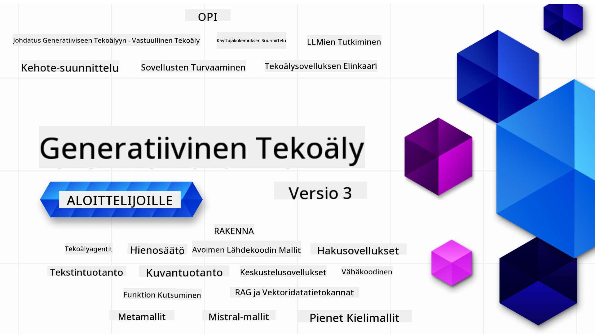

<!--
CO_OP_TRANSLATOR_METADATA:
{
  "original_hash": "c2ee25895ebbfa1a52868bb6eab686fc",
  "translation_date": "2025-05-19T11:49:23+00:00",
  "source_file": "README.md",
  "language_code": "fi"
}
-->

### 21 oppituntia, jotka opettavat kaiken, mitä tarvitset generatiivisten AI-sovellusten rakentamisen aloittamiseen

### 🌐 Monikielinen tuki

#### Tuettu GitHub Actionin kautta (Automaattinen ja aina ajan tasalla)
[Ranska](../fr/README.md) | [Espanja](../es/README.md) | [Saksa](../de/README.md) | [Venäjä](../ru/README.md) | [Arabia](../ar/README.md) | [Persia (Farsi)](../fa/README.md) | [Urdu](../ur/README.md) | [Kiina (yksinkertaistettu)](../zh/README.md) | [Kiina (perinteinen, Macao)](../mo/README.md) | [Kiina (perinteinen, Hongkong)](../hk/README.md) | [Kiina (perinteinen, Taiwan)](../tw/README.md) | [Japani](../ja/README.md) | [Korea](../ko/README.md) | [Hindi](../hi/README.md) | [Bengali](../bn/README.md) | [Marathi](../mr/README.md) | [Nepali](../ne/README.md) | [Punjabi (Gurmukhi)](../pa/README.md) | [Portugali (Portugali)](../pt/README.md) | [Portugali (Brasilia)](../br/README.md) | [Italia](../it/README.md) | [Puola](../pl/README.md) | [Turkki](../tr/README.md) | [Kreikka](../el/README.md) | [Thai](../th/README.md) | [Ruotsi](../sv/README.md) | [Tanska](../da/README.md) | [Norja](../no/README.md) | [Suomi](./README.md) | [Hollanti](../nl/README.md) | [Heprea](../he/README.md) | [Vietnam](../vi/README.md) | [Indonesia](../id/README.md) | [Malaiji](../ms/README.md) | [Tagalog (Filipino)](../tl/README.md) | [Swahili](../sw/README.md) | [Unkari](../hu/README.md) | [Tšekki](../cs/README.md) | [Slovakki](../sk/README.md) | [Romania](../ro/README.md) | [Bulgaria](../bg/README.md) | [Serbia (kyrillinen)](../sr/README.md) | [Kroatia](../hr/README.md) | [Slovenia](../sl/README.md)
# Generatiivinen AI Aloittelijoille (Versio 3) - Kurssi

Opettele generatiivisen AI-sovellusten rakentamisen perusteet kattavalla 21 oppitunnin kurssillamme, jonka ovat luoneet Microsoft Cloud Advocates.

## 🌱 Aloittaminen

Tämä kurssi sisältää 21 oppituntia. Jokainen oppitunti kattaa oman aiheensa, joten voit aloittaa mistä tahansa!

Oppitunnit on merkitty joko "Learn"-oppitunneiksi, jotka selittävät generatiivisen AI:n käsitteen, tai "Build"-oppitunneiksi, jotka selittävät käsitteen ja koodiesimerkit sekä **Python**- että **TypeScript**-kielillä, kun mahdollista.

.NET-kehittäjille: tutustu [Generatiivinen AI Aloittelijoille (.NET Edition)](https://github.com/microsoft/Generative-AI-for-beginners-dotnet?WT.mc_id=academic-105485-koreyst)!

Jokainen oppitunti sisältää myös "Keep Learning" -osion, jossa on lisäoppimistyökaluja.

## Mitä Tarvitset
### Tämän kurssin koodin suorittamiseen voit käyttää joko:
- [Azure OpenAI Service](https://aka.ms/genai-beginners/azure-open-ai?WT.mc_id=academic-105485-koreyst) - **Oppitunnit:** "aoai-assignment"
- [GitHub Marketplace Model Catalog](https://aka.ms/genai-beginners/gh-models?WT.mc_id=academic-105485-koreyst) - **Oppitunnit:** "githubmodels"
- [OpenAI API](https://aka.ms/genai-beginners/open-ai?WT.mc_id=academic-105485-koreyst) - **Oppitunnit:** "oai-assignment"

- Perustiedot Pythonista tai TypeScriptistä ovat hyödyllisiä - \*Täysin aloittelijoille tutustu näihin [Python](https://aka.ms/genai-beginners/python?WT.mc_id=academic-105485-koreyst) ja [TypeScript](https://aka.ms/genai-beginners/typescript?WT.mc_id=academic-105485-koreyst) kursseihin
- GitHub-tili [forkata koko repo](https://aka.ms/genai-beginners/github?WT.mc_id=academic-105485-koreyst) omaan GitHub-tiliisi

Olemme luoneet **[Kurssin Asennus](./00-course-setup/README.md?WT.mc_id=academic-105485-koreyst)** oppitunnin auttaaksemme sinua kehitysympäristön asennuksessa.

Älä unohda [tähti (🌟) tälle repolle](https://docs.github.com/en/get-started/exploring-projects-on-github/saving-repositories-with-stars?WT.mc_id=academic-105485-koreyst) löytääksesi sen helpommin myöhemmin.

## 🧠 Valmis Käyttöönottoon?

Jos etsit kehittyneempiä koodiesimerkkejä, tutustu **Python**- ja **TypeScript**-kielillä olevaan [Generatiivisen AI:n Koodiesimerkkien kokoelmaamme](https://aka.ms/genai-beg-code?WT.mc_id=academic-105485-koreyst).

## 🗣️ Tapaa Muita Oppijoita, Saada Tukea

Liity [viralliselle Azure AI Foundry Discord-palvelimellemme](https://aka.ms/genai-discord?WT.mc_id=academic-105485-koreyst) tapaamaan ja verkostoitumaan muiden kurssin oppijoiden kanssa ja saadaksesi tukea.

Esitä kysymyksiä tai jaa tuotepalautetta [Azure AI Foundry Developer Forum](https://aka.ms/azureaifoundry/forum) GitHubissa.

## 🚀 Rakennatko Startupia?

Rekisteröidy [Microsoft for Startups Founders Hub](https://aka.ms/genai-foundershub?WT.mc_id=academic-105485-koreyst) saadaksesi **ilmaisia OpenAI-krediittejä** ja jopa **150 000 dollaria Azure-krediittejä OpenAI-mallien käyttöön Azure OpenAI Servicesin kautta**.

## 🙏 Haluatko auttaa?

Onko sinulla ehdotuksia tai löysitkö kirjoitus- tai koodivirheitä? [Luo ongelma](https://github.com/microsoft/generative-ai-for-beginners/issues?WT.mc_id=academic-105485-koreyst) tai [Luo pull request](https://github.com/microsoft/generative-ai-for-beginners/pulls?WT.mc_id=academic-105485-koreyst)

## 📂 Jokainen oppitunti sisältää:

- Lyhyen videoesittelyn aiheesta
- Kirjallisen oppitunnin README-tiedostossa
- Python- ja TypeScript-koodiesimerkkejä, jotka tukevat Azure OpenAI:ta ja OpenAI API:a
- Linkkejä lisäresursseihin oppimisen jatkamista varten

## 🗃️ Oppitunnit

| #   | **Oppitunnin Linkki**                                                                                                                         | **Kuvaus**                                                                                       | **Video**                                                                   | **Lisäoppiminen**                                                             |
| --- | -------------------------------------------------------------------------------------------------------------------------------------------- | ------------------------------------------------------------------------------------------------ | --------------------------------------------------------------------------- | ------------------------------------------------------------------------------ |
| 00  | [Kurssin Asennus](./00-course-setup/README.md?WT.mc_id=academic-105485-koreyst)                                                               | **Learn:** Kuinka asettaa kehitysympäristösi                                                     | Video tulossa pian                                                          | [Lisätietoja](https://aka.ms/genai-collection?WT.mc_id=academic-105485-koreyst) |
| 01  | [Johdatus Generatiiviseen AI:hin ja LLM:iin](./01-introduction-to-genai/README.md?WT.mc_id=academic-105485-koreyst)                          | **Learn:** Ymmärtäminen, mitä generatiivinen AI on ja miten suuret kielimallit (LLM:t) toimivat. | [Video](https://aka.ms/gen-ai-lesson-1-gh?WT.mc_id=academic-105485-koreyst) | [Lisätietoja](https://aka.ms/genai-collection?WT.mc_id=academic-105485-koreyst) |
| 02  | [Eri LLM:ien tutkiminen ja vertailu](./02-exploring-and-comparing-different-llms/README.md?WT.mc_id=academic-105485-koreyst)                 | **Learn:** Kuinka valita oikea malli käyttötapaukseesi                                           | [Video](https://aka.ms/gen-ai-lesson2-gh?WT.mc_id=academic-105485-koreyst)  | [Lisätietoja](https://aka.ms/genai-collection?WT.mc_id=academic-105485-koreyst) |
| 03  | [Generatiivisen AI:n Vastuullinen Käyttö](./03-using-generative-ai-responsibly/README.md?WT.mc_id=academic-105485-koreyst)                   | **Learn:** Kuinka rakentaa generatiivisia AI-sovelluksia vastuullisesti                          | [Video](https://aka.ms/gen-ai-lesson3-gh?WT.mc_id=academic-105485-koreyst)  | [Lisätietoja](https://aka.ms/genai-collection?WT.mc_id=academic-105485-koreyst) |
| 04  | [Prompt Engineeringin Perusteiden Ymmärtäminen](./04-prompt-engineering-fundamentals/README.md?WT.mc_id=academic-105485-koreyst)             | **Learn:** Käytännön Prompt Engineering parhaat käytännöt                                         | [Video](https://aka.ms/gen-ai-lesson4-gh?WT.mc_id=academic-105485-koreyst)  | [Lisätietoja](https://aka.ms/genai-collection?WT.mc_id=academic-105485-koreyst) |
| 05  | [Edistyneiden kehotteiden luominen](./05-advanced-prompts/README.md?WT.mc_id=academic-105485-koreyst)                                               | **Opi:** Miten soveltaa kehotteiden suunnittelutekniikoita, jotka parantavat kehotteiden tuloksia. | [Video](https://aka.ms/gen-ai-lesson5-gh?WT.mc_id=academic-105485-koreyst)  | [Lisätietoja](https://aka.ms/genai-collection?WT.mc_id=academic-105485-koreyst) |
| 06  | [Tekstintuotantosovellusten rakentaminen](./06-text-generation-apps/README.md?WT.mc_id=academic-105485-koreyst)                                   | **Rakenna:** Tekstintuotantosovellus käyttäen Azure OpenAI / OpenAI API:a                               | [Video](https://aka.ms/gen-ai-lesson6-gh?WT.mc_id=academic-105485-koreyst)  | [Lisätietoja](https://aka.ms/genai-collection?WT.mc_id=academic-105485-koreyst) |
| 07  | [Keskustelusovellusten rakentaminen](./07-building-chat-applications/README.md?WT.mc_id=academic-105485-koreyst)                                   | **Rakenna:** Tekniikoita tehokkaaseen keskustelusovellusten rakentamiseen ja integrointiin.               | [Video](https://aka.ms/gen-ai-lessons7-gh?WT.mc_id=academic-105485-koreyst) | [Lisätietoja](https://aka.ms/genai-collection?WT.mc_id=academic-105485-koreyst) |
| 08  | [Hakusovellusten rakentaminen vektorikantojen avulla](./08-building-search-applications/README.md?WT.mc_id=academic-105485-koreyst)               | **Rakenna:** Hakusovellus, joka käyttää upotuksia tietojen etsintään.                        | [Video](https://aka.ms/gen-ai-lesson8-gh?WT.mc_id=academic-105485-koreyst)  | [Lisätietoja](https://aka.ms/genai-collection?WT.mc_id=academic-105485-koreyst) |
| 09  | [Kuvantuotantosovellusten rakentaminen](./09-building-image-applications/README.md?WT.mc_id=academic-105485-koreyst)                              | **Rakenna:** Kuvantuotantosovellus                                                       | [Video](https://aka.ms/gen-ai-lesson9-gh?WT.mc_id=academic-105485-koreyst)  | [Lisätietoja](https://aka.ms/genai-collection?WT.mc_id=academic-105485-koreyst) |
| 10  | [Vähäkoodisten tekoälysovellusten rakentaminen](./10-building-low-code-ai-applications/README.md?WT.mc_id=academic-105485-koreyst)                | **Rakenna:** Generatiivinen tekoälysovellus käyttäen vähäkoodisia työkaluja                                     | [Video](https://aka.ms/gen-ai-lesson10-gh?WT.mc_id=academic-105485-koreyst) | [Lisätietoja](https://aka.ms/genai-collection?WT.mc_id=academic-105485-koreyst) |
| 11  | [Ulkopuolisten sovellusten integrointi funktiokutsujen avulla](./11-integrating-with-function-calling/README.md?WT.mc_id=academic-105485-koreyst) | **Rakenna:** Mikä on funktiokutsu ja sen käyttötapaukset sovelluksissa                          | [Video](https://aka.ms/gen-ai-lesson11-gh?WT.mc_id=academic-105485-koreyst) | [Lisätietoja](https://aka.ms/genai-collection?WT.mc_id=academic-105485-koreyst) |
| 12  | [Tekoälysovellusten UX-suunnittelu](./12-designing-ux-for-ai-applications/README.md?WT.mc_id=academic-105485-koreyst)                             | **Opi:** Miten soveltaa UX-suunnitteluperiaatteita generatiivisten tekoälysovellusten kehittämisessä         | [Video](https://aka.ms/gen-ai-lesson12-gh?WT.mc_id=academic-105485-koreyst) | [Lisätietoja](https://aka.ms/genai-collection?WT.mc_id=academic-105485-koreyst) |
| 13  | [Generatiivisten tekoälysovellusten turvaaminen](./13-securing-ai-applications/README.md?WT.mc_id=academic-105485-koreyst)                        | **Opi:** Tekoälyjärjestelmien uhat ja riskit sekä menetelmät niiden turvaamiseksi.             | [Video](https://aka.ms/gen-ai-lesson13-gh?WT.mc_id=academic-105485-koreyst) | [Lisätietoja](https://aka.ms/genai-collection?WT.mc_id=academic-105485-koreyst) |
| 14  | [Generatiivisten tekoälysovellusten elinkaari](./14-the-generative-ai-application-lifecycle/README.md?WT.mc_id=academic-105485-koreyst)           | **Opi:** Työkalut ja mittarit LLM:n elinkaaren ja LLMOps:n hallintaan                         | [Video](https://aka.ms/gen-ai-lesson14-gh?WT.mc_id=academic-105485-koreyst) | [Lisätietoja](https://aka.ms/genai-collection?WT.mc_id=academic-105485-koreyst) |
| 15  | [Hakukoneavusteinen generointi (RAG) ja vektoripohjaiset tietokannat](./15-rag-and-vector-databases/README.md?WT.mc_id=academic-105485-koreyst) | **Rakenna:** Sovellus, joka käyttää RAG-kehystä upotusten hakemiseen vektoripohjaisista tietokannoista | [Video](https://aka.ms/gen-ai-lesson15-gh?WT.mc_id=academic-105485-koreyst) | [Lisätietoja](https://aka.ms/genai-collection?WT.mc_id=academic-105485-koreyst) |
| 16  | [Avoimen lähdekoodin mallit ja Hugging Face](./16-open-source-models/README.md?WT.mc_id=academic-105485-koreyst)                                | **Rakenna:** Sovellus, joka käyttää Hugging Facen avoimen lähdekoodin malleja | [Video](https://aka.ms/gen-ai-lesson16-gh?WT.mc_id=academic-105485-koreyst) | [Lisätietoja](https://aka.ms/genai-collection?WT.mc_id=academic-105485-koreyst) |
| 17  | [AI-agentit](./17-ai-agents/README.md?WT.mc_id=academic-105485-koreyst)                                                                         | **Rakenna:** Sovellus, joka käyttää AI-agenttikehystä | [Video](https://aka.ms/gen-ai-lesson17-gh?WT.mc_id=academic-105485-koreyst) | [Lisätietoja](https://aka.ms/genai-collection?WT.mc_id=academic-105485-koreyst) |
| 18  | [LLM-mallien hienosäätö](./18-fine-tuning/README.md?WT.mc_id=academic-105485-koreyst)                                                            | **Opi:** Mitä, miksi ja miten LLM-mallien hienosäätöä tehdään | [Video](https://aka.ms/gen-ai-lesson18-gh?WT.mc_id=academic-105485-koreyst) | [Lisätietoja](https://aka.ms/genai-collection?WT.mc_id=academic-105485-koreyst) |
| 19  | [Pienillä kielimalleilla rakentaminen](./19-slm/README.md?WT.mc_id=academic-105485-koreyst)                                                      | **Opi:** Pienten kielimallien käytön edut | Video tulossa pian | [Lisätietoja](https://aka.ms/genai-collection?WT.mc_id=academic-105485-koreyst) |
| 20  | [Mistral-malleilla rakentaminen](./20-mistral/README.md?WT.mc_id=academic-105485-koreyst)                                                        | **Opi:** Mistral-malliperheen ominaisuudet ja erot | Video tulossa pian | [Lisätietoja](https://aka.ms/genai-collection?WT.mc_id=academic-105485-koreyst) |
| 21  | [Meta-malleilla rakentaminen](./21-meta/README.md?WT.mc_id=academic-105485-koreyst)                                                              | **Opi:** Meta-malliperheen ominaisuudet ja erot | Video tulossa pian | [Lisätietoja](https://aka.ms/genai-collection?WT.mc_id=academic-105485-koreyst) |

### 🌟 Erityiskiitokset

Erityiskiitokset [**John Azizille**](https://www.linkedin.com/in/john0isaac/) kaikista GitHub-toiminnoista ja työnkuluista.

[**Bernhard Merkle**](https://www.linkedin.com/in/bernhard-merkle-738b73/) merkittävistä panoksista jokaiseen oppituntiin oppimiskokemuksen ja koodin parantamiseksi.

## 🎒 Muut kurssit

Tiimimme tuottaa myös muita kursseja! Tutustu:

- [**UUSI** AI-agentit aloittelijoille](https://github.com/microsoft/ai-agents-for-beginners?WT.mc_id=academic-105485-koreyst)
- [**UUSI** Generatiivinen AI aloittelijoille .NET:in avulla](https://github.com/microsoft/Generative-AI-for-beginners-dotnet?WT.mc_id=academic-105485-koreyst)
- [**UUSI** Generatiivinen AI aloittelijoille JavaScriptin avulla](https://aka.ms/genai-js-course?WT.mc_id=academic-105485-koreyst)
- [ML aloittelijoille](https://aka.ms/ml-beginners?WT.mc_id=academic-105485-koreyst)
- [Data Science aloittelijoille](https://aka.ms/datascience-beginners?WT.mc_id=academic-105485-koreyst)
- [AI aloittelijoille](https://aka.ms/ai-beginners?WT.mc_id=academic-105485-koreyst)
- [Kyberturvallisuus aloittelijoille](https://github.com/microsoft/Security-101??WT.mc_id=academic-96948-sayoung)
- [Web-kehitys aloittelijoille](https://aka.ms/webdev-beginners?WT.mc_id=academic-105485-koreyst)
- [IoT aloittelijoille](https://aka.ms/iot-beginners?WT.mc_id=academic-105485-koreyst)
- [XR-kehitys aloittelijoille](https://github.com/microsoft/xr-development-for-beginners?WT.mc_id=academic-105485-koreyst)
- [GitHub Copilotin hallitseminen AI-pariohjelmointiin](https://aka.ms/GitHubCopilotAI?WT.mc_id=academic-105485-koreyst)
- [GitHub Copilotin hallitseminen C#/NET-kehittäjille](https://github.com/microsoft/mastering-github-copilot-for-dotnet-csharp-developers?WT.mc_id=academic-105485-koreyst)
- [Valitse oma Copilot-seikkailusi](https://github.com/microsoft/CopilotAdventures?WT.mc_id=academic-105485-koreyst)

**Vastuuvapauslauseke**:  
Tämä asiakirja on käännetty käyttäen tekoälykäännöspalvelua [Co-op Translator](https://github.com/Azure/co-op-translator). Vaikka pyrimme tarkkuuteen, huomioithan, että automaattiset käännökset voivat sisältää virheitä tai epätarkkuuksia. Alkuperäinen asiakirja sen alkuperäisellä kielellä tulisi pitää auktoriteettina. Kriittisen tiedon kohdalla suositellaan ammattimaista ihmiskäännöstä. Emme ole vastuussa väärinkäsityksistä tai virhetulkinnoista, jotka johtuvat tämän käännöksen käytöstä.