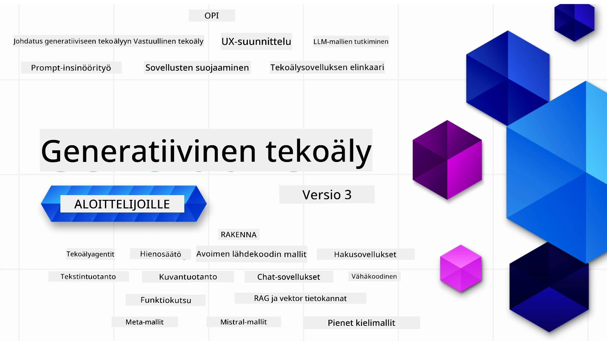

### 21 Oppituntia, jotka opettavat kaiken tarvittavan generatiivisten tekoälysovellusten rakentamisen aloittamiseen

[](https://github.com/microsoft/Generative-AI-For-Beginners/blob/master/LICENSE?WT.mc_id=academic-105485-koreyst)
[](https://GitHub.com/microsoft/Generative-AI-For-Beginners/graphs/contributors/?WT.mc_id=academic-105485-koreyst)
[](https://GitHub.com/microsoft/Generative-AI-For-Beginners/issues/?WT.mc_id=academic-105485-koreyst)
[](https://GitHub.com/microsoft/Generative-AI-For-Beginners/pulls/?WT.mc_id=academic-105485-koreyst)
[](http://makeapullrequest.com?WT.mc_id=academic-105485-koreyst)

[](https://GitHub.com/microsoft/Generative-AI-For-Beginners/watchers/?WT.mc_id=academic-105485-koreyst)
[](https://GitHub.com/microsoft/Generative-AI-For-Beginners/network/?WT.mc_id=academic-105485-koreyst)
[](https://GitHub.com/microsoft/Generative-AI-For-Beginners/stargazers/?WT.mc_id=academic-105485-koreyst)

[](https://discord.gg/nTYy5BXMWG)

### 🌐 Monikielituki

#### Tuettu GitHub Actionin kautta (automaattinen ja aina ajan tasalla)

<!-- CO-OP TRANSLATOR LANGUAGES TABLE START -->
[Arabia](../ar/README.md) | [Bengali](../bn/README.md) | [Bulgaria](../bg/README.md) | [Burma (Myanmar)](../my/README.md) | [Kiina (yksinkertaistettu)](../zh-CN/README.md) | [Kiina (perinteinen, Hongkong)](../zh-HK/README.md) | [Kiina (perinteinen, Macao)](../zh-MO/README.md) | [Kiina (perinteinen, Taiwan)](../zh-TW/README.md) | [Kroatia](../hr/README.md) | [Tsekki](../cs/README.md) | [Tanska](../da/README.md) | [Hollanti](../nl/README.md) | [Viro](../et/README.md) | [Suomi](./README.md) | [Ranska](../fr/README.md) | [Saksa](../de/README.md) | [Kreikka](../el/README.md) | [Heprea](../he/README.md) | [Hindi](../hi/README.md) | [Unkari](../hu/README.md) | [Indonesia](../id/README.md) | [Italia](../it/README.md) | [Japani](../ja/README.md) | [Kannada](../kn/README.md) | [Khmer](../km/README.md) | [Korea](../ko/README.md) | [Liettua](../lt/README.md) | [Malaiji](../ms/README.md) | [Malajalami](../ml/README.md) | [Marathi](../mr/README.md) | [Nepali](../ne/README.md) | [Nigerian Pidgin](../pcm/README.md) | [Norja](../no/README.md) | [Persia (Farsi)](../fa/README.md) | [Puola](../pl/README.md) | [Portugali (Brasilia)](../pt-BR/README.md) | [Portugali (Portugali)](../pt-PT/README.md) | [Punjabi (Gurmukhi)](../pa/README.md) | [Romania](../ro/README.md) | [Venäjä](../ru/README.md) | [Serbia (kyrillinen)](../sr/README.md) | [Slovakki](../sk/README.md) | [Sloveeni](../sl/README.md) | [Espanja](../es/README.md) | [Swahili](../sw/README.md) | [Ruotsi](../sv/README.md) | [Tagalog (Filipino)](../tl/README.md) | [Tamili](../ta/README.md) | [Telugu](../te/README.md) | [Thai](../th/README.md) | [Turkki](../tr/README.md) | [Ukraina](../uk/README.md) | [Urdu](../ur/README.md) | [Vietnami](../vi/README.md)

> **Haluatko kloonata paikallisesti?**
>
> Tämä arkisto sisältää yli 50 käännöstä, mikä kasvattaa merkittävästi latauskokoa. Jos haluat kloonata ilman käännöksiä, käytä sparse checkout -ominaisuutta:
>
> **Bash / macOS / Linux:**
> ```bash
> git clone --filter=blob:none --sparse https://github.com/microsoft/generative-ai-for-beginners.git
> cd generative-ai-for-beginners
> git sparse-checkout set --no-cone '/*' '!translations' '!translated_images'
> ```
>
> **CMD (Windows):**
> ```cmd
> git clone --filter=blob:none --sparse https://github.com/microsoft/generative-ai-for-beginners.git
> cd generative-ai-for-beginners
> git sparse-checkout set --no-cone "/*" "!translations" "!translated_images"
> ```
>
> Tämä antaa sinulle kaiken tarvittavan kurssin suorittamiseen paljon nopeammalla latauksella.
<!-- CO-OP TRANSLATOR LANGUAGES TABLE END -->

# Generatiivinen tekoäly aloittelijoille (Versio 3) - Kurssi

Opettele generatiivisten tekoälysovellusten rakentamisen perusteet Microsoft Cloud Advocatesin 21 oppitunnin kattavalla kurssilla.

## 🌱 Aloittaminen

Tässä kurssissa on 21 oppituntia. Jokainen oppitunti käsittelee omaa aihettaan, joten aloita mistä haluat!

Oppitunnit on merkitty joko "Learn"-oppitunneiksi, joissa selitetään generatiivisen tekoälyn käsitteitä, tai "Build"-oppitunneiksi, joissa käsitellään sekä käsitettä että tarjotaan koodiesimerkkejä **Python**illa ja **TypeScript**illä kun mahdollista.

.NET-kehittäjille on tarjolla [Generative AI for Beginners (.NET Edition)](https://github.com/microsoft/Generative-AI-for-beginners-dotnet?WT.mc_id=academic-105485-koreyst)!

Jokaisessa oppitunnissa on myös "Keep Learning" -osio, joka sisältää lisäoppimateriaaleja.

## Mitä tarvitset
### Tämä kurssi toimii koodin ajoon seuraavilla työkaluilla: 
 - [Azure OpenAI Service](https://aka.ms/genai-beginners/azure-open-ai?WT.mc_id=academic-105485-koreyst) - **Oppitunnit:** "aoai-assignment"
 - [GitHub Marketplace Model Catalog](https://aka.ms/genai-beginners/gh-models?WT.mc_id=academic-105485-koreyst) - **Oppitunnit:** "githubmodels"
 - [OpenAI API](https://aka.ms/genai-beginners/open-ai?WT.mc_id=academic-105485-koreyst) - **Oppitunnit:** "oai-assignment"
   
- Perustiedot Pythonista tai TypeScriptistä ovat hyödyllisiä - \*Täysin aloittelijoille suosittelemme näitä [Python](https://aka.ms/genai-beginners/python?WT.mc_id=academic-105485-koreyst) ja [TypeScript](https://aka.ms/genai-beginners/typescript?WT.mc_id=academic-105485-koreyst) -kursseja
- GitHub-tili voidaksesi [tähdätä (fork) tämän koko repositorion](https://aka.ms/genai-beginners/github?WT.mc_id=academic-105485-koreyst) omalle GitHub-tilillesi

Olemme luoneet **[Kurssin asetukset](./00-course-setup/README.md?WT.mc_id=academic-105485-koreyst)** -oppitunnin auttamaan kehitysympäristön pystyttämisessä.

Älä unohda [tähdätä (🌟) tätä repositoriota](https://docs.github.com/en/get-started/exploring-projects-on-github/saving-repositories-with-stars?WT.mc_id=academic-105485-koreyst) löytääksesi sen helpommin myöhemmin.

## 🧠 Valmis julkaisuun?

Jos etsit edistyneempiä koodiesimerkkejä, tutustu [kokoelmaamme generatiivisen tekoälyn koodiesimerkkejä](https://aka.ms/genai-beg-code?WT.mc_id=academic-105485-koreyst) sekä **Python**illa että **TypeScript**illä.

## 🗣️ Tapaa muita oppijoita, saa tukea

Liity viralliselle [Azure AI Foundry Discord -palvelimellemme](https://aka.ms/genai-discord?WT.mc_id=academic-105485-koreyst) tapaamaan ja verkostoitumaan kurssin muiden oppijoiden kanssa ja saamaan tukea.

Kysy kysymyksiä tai jaa palautetta tuotteesta [Azure AI Foundry -kehittäjäfoorumillamme](https://aka.ms/azureaifoundry/forum) GitHubissa.

## 🚀 Rakentamassa startupia?

Käy sivustolla [Microsoft for Startups](https://www.microsoft.com/startups) saadaksesi tietoa siitä, miten aloittaa rakentaminen Azure-krediiteillä jo tänään.

## 🙏 Haluatko auttaa?

Onko sinulla ehdotuksia tai oletko löytänyt kirjoitus- tai koodivirheitä? [Luo ongelma](https://github.com/microsoft/generative-ai-for-beginners/issues?WT.mc_id=academic-105485-koreyst) tai [tee pull-pyyntö](https://github.com/microsoft/generative-ai-for-beginners/pulls?WT.mc_id=academic-105485-koreyst)

## 📂 Jokaisessa oppitunnissa:

- Lyhyt videoesittely aiheesta
- Kirjallinen oppitunti README-tiedostossa
- Python- ja TypeScript-koodiesimerkit tukemaan Azure OpenAI- ja OpenAI-rajapintoja
- Linkkejä lisäresursseihin oppimisen jatkamiseksi

## 🗃️ Oppitunnit

| #   | **Oppitunnin linkki**                                                                                                                        | **Kuvaus**                                                                                    | **Video**                                                                   | **Lisäoppiminen**                                                              |
| --- | ------------------------------------------------------------------------------------------------------------------------------------------- | --------------------------------------------------------------------------------------------- | --------------------------------------------------------------------------- | ------------------------------------------------------------------------------ |
| 00  | [Kurssin asetukset](./00-course-setup/README.md?WT.mc_id=academic-105485-koreyst)                                                            | **Opiskele:** Kuinka pystyttää kehitysympäristösi                                            | Video tulossa                                                               | [Lue lisää](https://aka.ms/genai-collection?WT.mc_id=academic-105485-koreyst)  |
| 01  | [Johdatus generatiiviseen tekoälyyn ja LLM-malleihin](./01-introduction-to-genai/README.md?WT.mc_id=academic-105485-koreyst)                  | **Opiskele:** Ymmärrä, mikä generatiivinen tekoäly on ja miten suuret kielimallit (LLM) toimivat | [Video](https://aka.ms/gen-ai-lesson-1-gh?WT.mc_id=academic-105485-koreyst) | [Lue lisää](https://aka.ms/genai-collection?WT.mc_id=academic-105485-koreyst)  |
| 02  | [Eri LLM-mallien tutkiskelu ja vertailu](./02-exploring-and-comparing-different-llms/README.md?WT.mc_id=academic-105485-koreyst)              | **Opiskele:** Kuinka valita oikea malli käyttötarkoituksesi mukaan                            | [Video](https://aka.ms/gen-ai-lesson2-gh?WT.mc_id=academic-105485-koreyst)  | [Lue lisää](https://aka.ms/genai-collection?WT.mc_id=academic-105485-koreyst)  |
| 03  | [Generatiivisen tekoälyn vastuullinen käyttö](./03-using-generative-ai-responsibly/README.md?WT.mc_id=academic-105485-koreyst)                 | **Opiskele:** Kuinka rakentaa generatiivisia tekoälysovelluksia vastuullisesti                | [Video](https://aka.ms/gen-ai-lesson3-gh?WT.mc_id=academic-105485-koreyst)  | [Lue lisää](https://aka.ms/genai-collection?WT.mc_id=academic-105485-koreyst)  |
| 04  | [Ymmärrä Prompt-insinöörityön perusteet](./04-prompt-engineering-fundamentals/README.md?WT.mc_id=academic-105485-koreyst)             | **Opiskele:** Käytännön paras käytäntö prompt-insinöörityössä                                             | [Video](https://aka.ms/gen-ai-lesson4-gh?WT.mc_id=academic-105485-koreyst)  | [Lue lisää](https://aka.ms/genai-collection?WT.mc_id=academic-105485-koreyst) |
| 05  | [Edistyneiden prompttien luominen](./05-advanced-prompts/README.md?WT.mc_id=academic-105485-koreyst)                                                | **Opiskele:** Kuinka soveltaa prompt-insinöörityön tekniikoita, jotka parantavat prompttien tuloksia.     | [Video](https://aka.ms/gen-ai-lesson5-gh?WT.mc_id=academic-105485-koreyst)  | [Lue lisää](https://aka.ms/genai-collection?WT.mc_id=academic-105485-koreyst) |
| 06  | [Tekstintuotantosovellusten rakentaminen](./06-text-generation-apps/README.md?WT.mc_id=academic-105485-koreyst)                                | **Rakenna:** Tekstintuotantosovellus käyttäen Azure OpenAI / OpenAI API                                   | [Video](https://aka.ms/gen-ai-lesson6-gh?WT.mc_id=academic-105485-koreyst)  | [Lue lisää](https://aka.ms/genai-collection?WT.mc_id=academic-105485-koreyst) |
| 07  | [Chat-sovellusten rakentaminen](./07-building-chat-applications/README.md?WT.mc_id=academic-105485-koreyst)                                     | **Rakenna:** Tekniikoita chat-sovellusten tehokkaaseen rakentamiseen ja integroimiseen.                   | [Video](https://aka.ms/gen-ai-lessons7-gh?WT.mc_id=academic-105485-koreyst) | [Lue lisää](https://aka.ms/genai-collection?WT.mc_id=academic-105485-koreyst) |
| 08  | [Hakusovellusten rakentaminen vektoritietokantojen avulla](./08-building-search-applications/README.md?WT.mc_id=academic-105485-koreyst)        | **Rakenna:** Hakusovellus, joka käyttää upotuksia tietojen hakemiseen.                                    | [Video](https://aka.ms/gen-ai-lesson8-gh?WT.mc_id=academic-105485-koreyst)  | [Lue lisää](https://aka.ms/genai-collection?WT.mc_id=academic-105485-koreyst) |
| 09  | [Kuvantuotantosovellusten rakentaminen](./09-building-image-applications/README.md?WT.mc_id=academic-105485-koreyst)                            | **Rakenna:** Kuvantuotantosovellus                                                                     | [Video](https://aka.ms/gen-ai-lesson9-gh?WT.mc_id=academic-105485-koreyst)  | [Lue lisää](https://aka.ms/genai-collection?WT.mc_id=academic-105485-koreyst) |
| 10  | [Matala-koodin tekoälysovellusten rakentaminen](./10-building-low-code-ai-applications/README.md?WT.mc_id=academic-105485-koreyst)              | **Rakenna:** Generatiivinen tekoälysovellus matala-koodityökaluilla                                      | [Video](https://aka.ms/gen-ai-lesson10-gh?WT.mc_id=academic-105485-koreyst) | [Lue lisää](https://aka.ms/genai-collection?WT.mc_id=academic-105485-koreyst) |
| 11  | [Ulkoisten sovellusten integrointi toimintokutsujen avulla](./11-integrating-with-function-calling/README.md?WT.mc_id=academic-105485-koreyst) | **Rakenna:** Mikä on toimintokutsu ja miten sitä käytetään sovelluksissa                                  | [Video](https://aka.ms/gen-ai-lesson11-gh?WT.mc_id=academic-105485-koreyst) | [Lue lisää](https://aka.ms/genai-collection?WT.mc_id=academic-105485-koreyst) |
| 12  | [UX:n suunnittelu tekoälysovelluksiin](./12-designing-ux-for-ai-applications/README.md?WT.mc_id=academic-105485-koreyst)                         | **Opiskele:** Kuinka soveltaa UX-suunnitteluperiaatteita generatiivisten tekoälysovellusten kehittämisessä | [Video](https://aka.ms/gen-ai-lesson12-gh?WT.mc_id=academic-105485-koreyst) | [Lue lisää](https://aka.ms/genai-collection?WT.mc_id=academic-105485-koreyst) |
| 13  | [Generatiivisten tekoälysovellustesi suojaaminen](./13-securing-ai-applications/README.md?WT.mc_id=academic-105485-koreyst)                     | **Opiskele:** Tekoälyjärjestelmiin kohdistuvat uhat ja riskit sekä menetelmät näiden suojaamiseksi.      | [Video](https://aka.ms/gen-ai-lesson13-gh?WT.mc_id=academic-105485-koreyst) | [Lue lisää](https://aka.ms/genai-collection?WT.mc_id=academic-105485-koreyst) |
| 14  | [Generatiivisen tekoälyn sovelluksen elinkaaren hallinta](./14-the-generative-ai-application-lifecycle/README.md?WT.mc_id=academic-105485-koreyst)| **Opiskele:** Työkalut ja mittarit LLM-elinkaaren ja LLMOpsin hallintaan                                | [Video](https://aka.ms/gen-ai-lesson14-gh?WT.mc_id=academic-105485-koreyst) | [Lue lisää](https://aka.ms/genai-collection?WT.mc_id=academic-105485-koreyst) |
| 15  | [Hakuun perustuva generointi (RAG) ja vektoritietokannat](./15-rag-and-vector-databases/README.md?WT.mc_id=academic-105485-koreyst)             | **Rakenna:** Sovellus, joka käyttää RAG-viitekehystä upotusten hakemiseen Vektoritietokannoista           | [Video](https://aka.ms/gen-ai-lesson15-gh?WT.mc_id=academic-105485-koreyst) | [Lue lisää](https://aka.ms/genai-collection?WT.mc_id=academic-105485-koreyst) |
| 16  | [Avoimen lähdekoodin mallit ja Hugging Face](./16-open-source-models/README.md?WT.mc_id=academic-105485-koreyst)                                | **Rakenna:** Sovellus, joka käyttää avoimen lähdekoodin malleja Hugging Facesta                          | [Video](https://aka.ms/gen-ai-lesson16-gh?WT.mc_id=academic-105485-koreyst) | [Lue lisää](https://aka.ms/genai-collection?WT.mc_id=academic-105485-koreyst) |
| 17  | [Tekoälyagentit](./17-ai-agents/README.md?WT.mc_id=academic-105485-koreyst)                                                                     | **Rakenna:** Sovellus, joka käyttää tekoälyagenttikehystä                                              | [Video](https://aka.ms/gen-ai-lesson17-gh?WT.mc_id=academic-105485-koreyst) | [Lue lisää](https://aka.ms/genai-collection?WT.mc_id=academic-105485-koreyst) |
| 18  | [LLM-mallien hienosäätö](./18-fine-tuning/README.md?WT.mc_id=academic-105485-koreyst)                                                          | **Opiskele:** Mitä, miksi ja miten hienosäätää LLM-malleja                                           | [Video](https://aka.ms/gen-ai-lesson18-gh?WT.mc_id=academic-105485-koreyst) | [Lue lisää](https://aka.ms/genai-collection?WT.mc_id=academic-105485-koreyst) |
| 19  | [Pienten kielimallien (SLM) käyttö](./19-slm/README.md?WT.mc_id=academic-105485-koreyst)                                                        | **Opiskele:** Pienten kielimallien rakentamisen edut                                               | Video tulossa pian | [Lue lisää](https://aka.ms/genai-collection?WT.mc_id=academic-105485-koreyst) |
| 20  | [Mistral-mallien käyttö](./20-mistral/README.md?WT.mc_id=academic-105485-koreyst)                                                              | **Opiskele:** Mistral-perheen mallien ominaisuudet ja erot                                          | Video tulossa pian | [Lue lisää](https://aka.ms/genai-collection?WT.mc_id=academic-105485-koreyst) |
| 21  | [Meta-mallien käyttö](./21-meta/README.md?WT.mc_id=academic-105485-koreyst)                                                                    | **Opiskele:** Meta-perheen mallien ominaisuudet ja erot                                            | Video tulossa pian | [Lue lisää](https://aka.ms/genai-collection?WT.mc_id=academic-105485-koreyst) |

### 🌟 Erityiskiitokset

Erityiskiitokset [**John Azizille**](https://www.linkedin.com/in/john0isaac/) kaikista GitHub-toimintojen ja työnkulkujen luomisesta

[**Bernhard Merklelle**](https://www.linkedin.com/in/bernhard-merkle-738b73/) avainpanoksista, jotka parantavat oppimiskokemusta ja koodin laatua jokaisessa oppitunnissa.

## 🎒 Muut kurssit

Tiimimme tuottaa myös muita kursseja! Tutustu:

<!-- CO-OP TRANSLATOR OTHER COURSES START -->
### LangChain
[](https://aka.ms/langchain4j-for-beginners)
[](https://aka.ms/langchainjs-for-beginners?WT.mc_id=m365-94501-dwahlin)
[](https://github.com/microsoft/langchain-for-beginners?WT.mc_id=m365-94501-dwahlin)
---

### Azure / Edge / MCP / Agentit
[](https://github.com/microsoft/AZD-for-beginners?WT.mc_id=academic-105485-koreyst)
[](https://github.com/microsoft/edgeai-for-beginners?WT.mc_id=academic-105485-koreyst)
[](https://github.com/microsoft/mcp-for-beginners?WT.mc_id=academic-105485-koreyst)
[](https://github.com/microsoft/ai-agents-for-beginners?WT.mc_id=academic-105485-koreyst)

---
 
### Generatiivinen tekoäly -sarja
[](https://github.com/microsoft/generative-ai-for-beginners?WT.mc_id=academic-105485-koreyst)
[-9333EA?style=for-the-badge&labelColor=E5E7EB&color=9333EA)](https://github.com/microsoft/Generative-AI-for-beginners-dotnet?WT.mc_id=academic-105485-koreyst)
[-C084FC?style=for-the-badge&labelColor=E5E7EB&color=C084FC)](https://github.com/microsoft/generative-ai-for-beginners-java?WT.mc_id=academic-105485-koreyst)
[-E879F9?style=for-the-badge&labelColor=E5E7EB&color=E879F9)](https://github.com/microsoft/generative-ai-with-javascript?WT.mc_id=academic-105485-koreyst)

---
 
### Perusopetus
[](https://aka.ms/ml-beginners?WT.mc_id=academic-105485-koreyst)
[](https://aka.ms/datascience-beginners?WT.mc_id=academic-105485-koreyst)
[](https://aka.ms/ai-beginners?WT.mc_id=academic-105485-koreyst)
[](https://github.com/microsoft/Security-101?WT.mc_id=academic-96948-sayoung)
[](https://aka.ms/webdev-beginners?WT.mc_id=academic-105485-koreyst)
[](https://aka.ms/iot-beginners?WT.mc_id=academic-105485-koreyst)
[](https://github.com/microsoft/xr-development-for-beginners?WT.mc_id=academic-105485-koreyst)

---
 
### Copilot-sarja
[](https://aka.ms/GitHubCopilotAI?WT.mc_id=academic-105485-koreyst)
[](https://github.com/microsoft/mastering-github-copilot-for-dotnet-csharp-developers?WT.mc_id=academic-105485-koreyst)
[](https://github.com/microsoft/CopilotAdventures?WT.mc_id=academic-105485-koreyst)
<!-- CO-OP TRANSLATOR OTHER COURSES END -->

## Apua saatavilla

Jos jumitut tai sinulla on kysyttävää tekoälysovellusten rakentamisesta, liity muiden oppijoiden ja kokeneiden kehittäjien keskusteluihin MCP:ssä. Se on tukeva yhteisö, jossa kysymyksiä saa esittää ja tietoa jaetaan vapaasti.

[](https://discord.gg/nTYy5BXMWG)

Jos sinulla on palautetta tuotteesta tai kohtaat virheitä rakentamisen aikana, vieraile:

[](https://aka.ms/foundry/forum)

---

<!-- CO-OP TRANSLATOR DISCLAIMER START -->
**Vastuuvapauslauseke**:  
Tämä asiakirja on käännetty käyttämällä tekoälypohjaista käännöspalvelua [Co-op Translator](https://github.com/Azure/co-op-translator). Pyrimme tarkkuuteen, mutta huomioithan, että automaattiset käännökset saattavat sisältää virheitä tai epätarkkuuksia. Alkuperäinen asiakirja sen alkuperäisellä kielellä tulisi pitää auktoritatiivisena lähteenä. Tärkeissä asioissa suositellaan ammattimaista ihmiskäännöstä. Emme ole vastuussa tämän käännöksen käytöstä johtuvista väärinkäsityksistä tai virhetulkinoista.
<!-- CO-OP TRANSLATOR DISCLAIMER END -->