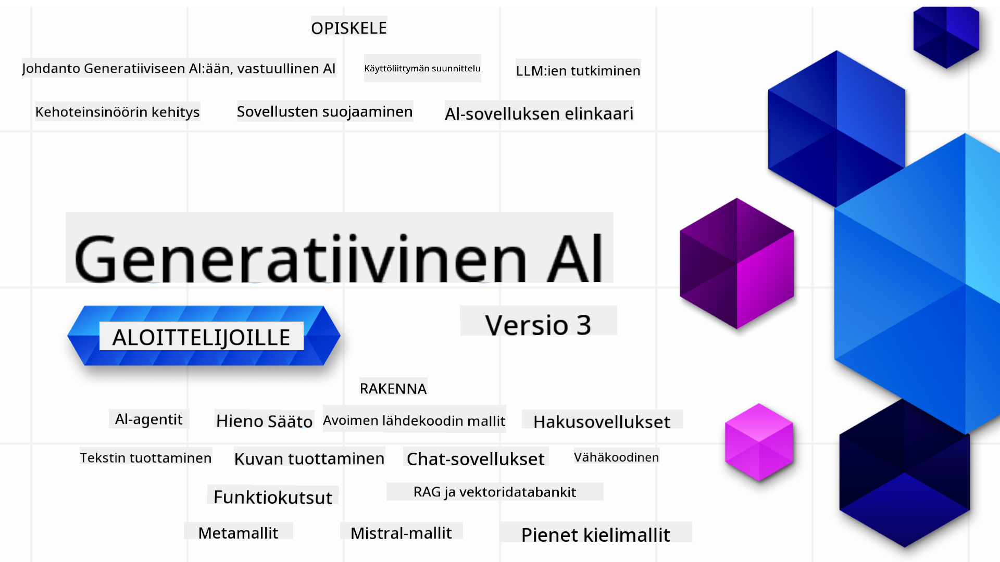

<!--
CO_OP_TRANSLATOR_METADATA:
{
  "original_hash": "6e3f4c8a4f323b8eab1cf11ded304b0f",
  "translation_date": "2025-06-25T08:02:44+00:00",
  "source_file": "README.md",
  "language_code": "fi"
}
-->

### 21 oppituntia, jotka opettavat kaiken, mitä tarvitset generatiivisten tekoälysovellusten rakentamisen aloittamiseen

### 🌐 Monikielinen tuki

#### Tuettu GitHub Actionin kautta (automaattinen ja aina ajan tasalla)

# Generatiivinen AI Aloittelijoille (Versio 3) - Kurssi

Opi generatiivisen AI-sovellusten rakentamisen perusteet Microsoft Cloud Advocatesin 21 oppitunnin kattavalla kurssilla.

## 🌱 Aloittaminen

Kurssi sisältää 21 oppituntia. Jokainen oppitunti käsittelee omaa aihettaan, joten voit aloittaa mistä haluat!

Oppitunnit on merkitty joko "Learn"-oppitunneiksi, jotka selittävät generatiivisen AI-konseptin, tai "Build"-oppitunneiksi, jotka selittävät konseptin ja koodiesimerkit sekä **Pythonilla** että **TypeScriptillä**, kun mahdollista.

.NET-kehittäjille: tutustu [Generative AI for Beginners (.NET Edition)](https://github.com/microsoft/Generative-AI-for-beginners-dotnet?WT.mc_id=academic-105485-koreyst)!

Jokaisessa oppitunnissa on myös "Keep Learning" -osio, jossa on lisäoppimistyökaluja.

## Mitä tarvitset
### Kurssin koodin suorittamiseen voit käyttää joko:
 - [Azure OpenAI Service](https://aka.ms/genai-beginners/azure-open-ai?WT.mc_id=academic-105485-koreyst) - **Oppitunnit:** "aoai-assignment"
 - [GitHub Marketplace Model Catalog](https://aka.ms/genai-beginners/gh-models?WT.mc_id=academic-105485-koreyst) - **Oppitunnit:** "githubmodels"
 - [OpenAI API](https://aka.ms/genai-beginners/open-ai?WT.mc_id=academic-105485-koreyst) - **Oppitunnit:** "oai-assignment"

- Perustiedot Pythonista tai TypeScriptistä ovat hyödyllisiä - \*Täydellisille aloittelijoille tutustu näihin [Python](https://aka.ms/genai-beginners/python?WT.mc_id=academic-105485-koreyst) ja [TypeScript](https://aka.ms/genai-beginners/typescript?WT.mc_id=academic-105485-koreyst) kursseihin
- GitHub-tili [forkkaamaan tämän koko repoon](https://aka.ms/genai-beginners/github?WT.mc_id=academic-105485-koreyst) omaan GitHub-tiliisi

Olemme luoneet **[Kurssin asennus](./00-course-setup/README.md?WT.mc_id=academic-105485-koreyst)** oppitunnin auttamaan kehitysympäristösi asennuksessa.

Älä unohda [tähtää (🌟) tätä repoa](https://docs.github.com/en/get-started/exploring-projects-on-github/saving-repositories-with-stars?WT.mc_id=academic-105485-koreyst) löytääksesi sen helpommin myöhemmin.

## 🧠 Valmis käyttöönottoon?

Jos etsit edistyneempiä koodiesimerkkejä, tutustu [Generative AI Code Samples -kokoelmaamme](https://aka.ms/genai-beg-code?WT.mc_id=academic-105485-koreyst) sekä **Pythonilla** että **TypeScriptillä**.

## 🗣️ Tapaa muita oppijoita, saa tukea

Liity [viralliselle Azure AI Foundry Discord -palvelimellemme](https://aka.ms/genai-discord?WT.mc_id=academic-105485-koreyst) tavataksesi ja verkostoituaksesi muiden kurssin oppijoiden kanssa ja saadaksesi tukea.

Esitä kysymyksiä tai jaa tuoteideoita [Azure AI Foundry Developer Forum](https://aka.ms/azureaifoundry/forum) GitHubissa.

## 🚀 Rakennatko startupia?

Liity [Microsoft for Startups Founders Hubiin](https://aka.ms/genai-foundershub?WT.mc_id=academic-105485-koreyst) saadaksesi **ilmaisia OpenAI-krediittejä** ja jopa **150 000 dollaria Azure-krediittejä päästäksesi käsiksi OpenAI-malleihin Azure OpenAI Servicesin kautta**.

## 🙏 Haluatko auttaa?

Onko sinulla ehdotuksia tai löysitkö kirjoitus- tai koodivirheitä? [Luo ongelma](https://github.com/microsoft/generative-ai-for-beginners/issues?WT.mc_id=academic-105485-koreyst) tai [Luo pull request](https://github.com/microsoft/generative-ai-for-beginners/pulls?WT.mc_id=academic-105485-koreyst)

## 📂 Jokainen oppitunti sisältää:

- Lyhyt videoesittely aiheesta
- Kirjallinen oppitunti README-tiedostossa
- Python- ja TypeScript-koodiesimerkkejä tukemassa Azure OpenAI ja OpenAI API
- Linkkejä lisäresursseihin oppimisen jatkamiseksi

## 🗃️ Oppitunnit

| #   | **Oppitunnin linkki**                                                                                                                              | **Kuvaus**                                                                                     | **Video**                                                                   | **Lisäoppiminen**                                                             |
| --- | -------------------------------------------------------------------------------------------------------------------------------------------- | ----------------------------------------------------------------------------------------------- | --------------------------------------------------------------------------- | ------------------------------------------------------------------------------ |
| 00  | [Kurssin asennus](./00-course-setup/README.md?WT.mc_id=academic-105485-koreyst)                                                                 | **Learn:** Kuinka asettaa kehitysympäristösi                                                    | Video tulossa pian                                                                 | [Learn More](https://aka.ms/genai-collection?WT.mc_id=academic-105485-koreyst) |
| 01  | [Johdatus Generatiiviseen AI:hin ja LLM:iin](./01-introduction-to-genai/README.md?WT.mc_id=academic-105485-koreyst)                              | **Learn:** Ymmärtäminen mitä Generatiivinen AI on ja miten Suuret Kielelliset Mallit (LLM:t) toimivat.       | [Video](https://aka.ms/gen-ai-lesson-1-gh?WT.mc_id=academic-105485-koreyst) | [Learn More](https://aka.ms/genai-collection?WT.mc_id=academic-105485-koreyst) |
| 02  | [Eri LLM:ien tutkiminen ja vertailu](./02-exploring-and-comparing-different-llms/README.md?WT.mc_id=academic-105485-koreyst)             | **Learn:** Kuinka valita oikea malli käyttötarkoitukseesi                                      | [Video](https://aka.ms/gen-ai-lesson2-gh?WT.mc_id=academic-105485-koreyst)  | [Learn More](https://aka.ms/genai-collection?WT.mc_id=academic-105485-koreyst) |
| 03  | [Generatiivisen AI:n vastuullinen käyttö](./03-using-generative-ai-responsibly/README.md?WT.mc_id=academic-105485-koreyst)                           | **Learn:** Kuinka rakentaa Generatiivisia AI-sovelluksia vastuullisesti                                  | [Video](https://aka.ms/gen-ai-lesson3-gh?WT.mc_id=academic-105485-koreyst)  | [Learn More](https://aka.ms/genai-collection?WT.mc_id=academic-105485-koreyst) |
| 04  | [Prompt Engineeringin perusteiden ymmärtäminen](./04-prompt-engineering-fundamentals/README.md?WT.mc_id=academic-105485-koreyst)             | **Learn:** Käytännön Prompt Engineering parhaat käytännöt                                           | [Video](https://aka.ms/gen-ai-lesson4-gh?WT.mc_id=academic-105485-koreyst)  | [Learn More](https://aka.ms/genai-collection?WT.mc_id=academic-105485-koreyst) |
| 05  | [Edistyneiden kehotteiden luominen](./05-advanced-prompts/README.md?WT.mc_id=academic-105485-koreyst)                                                | **Opi:** Miten soveltaa kehotteiden suunnittelutekniikoita, jotka parantavat kehotteiden tuloksia. | [Video](https://aka.ms/gen-ai-lesson5-gh?WT.mc_id=academic-105485-koreyst)  | [Lisätietoja](https://aka.ms/genai-collection?WT.mc_id=academic-105485-koreyst) |
| 06  | [Tekstintuotantosovellusten rakentaminen](./06-text-generation-apps/README.md?WT.mc_id=academic-105485-koreyst)                                | **Rakenna:** Tekstintuotantosovellus Azure OpenAI / OpenAI API:n avulla                                | [Video](https://aka.ms/gen-ai-lesson6-gh?WT.mc_id=academic-105485-koreyst)  | [Lisätietoja](https://aka.ms/genai-collection?WT.mc_id=academic-105485-koreyst) |
| 07  | [Keskustelusovellusten rakentaminen](./07-building-chat-applications/README.md?WT.mc_id=academic-105485-koreyst)                                     | **Rakenna:** Tekniikoita keskustelusovellusten tehokkaaseen rakentamiseen ja integrointiin.               | [Video](https://aka.ms/gen-ai-lessons7-gh?WT.mc_id=academic-105485-koreyst) | [Lisätietoja](https://aka.ms/genai-collection?WT.mc_id=academic-105485-koreyst) |
| 08  | [Hakusovellusten rakentaminen vektorikantojen avulla](./08-building-search-applications/README.md?WT.mc_id=academic-105485-koreyst)                        | **Rakenna:** Hakusovellus, joka käyttää upotuksia tietojen etsintään.                        | [Video](https://aka.ms/gen-ai-lesson8-gh?WT.mc_id=academic-105485-koreyst)  | [Lisätietoja](https://aka.ms/genai-collection?WT.mc_id=academic-105485-koreyst) |
| 09  | [Kuvantuotantosovellusten rakentaminen](./09-building-image-applications/README.md?WT.mc_id=academic-105485-koreyst)                        | **Rakenna:** Kuvantuotantosovellus                                                       | [Video](https://aka.ms/gen-ai-lesson9-gh?WT.mc_id=academic-105485-koreyst)  | [Lisätietoja](https://aka.ms/genai-collection?WT.mc_id=academic-105485-koreyst) |
| 10  | [Vähäkoodisten tekoälysovellusten rakentaminen](./10-building-low-code-ai-applications/README.md?WT.mc_id=academic-105485-koreyst)                       | **Rakenna:** Generatiivinen tekoälysovellus vähäkoodisten työkalujen avulla                                     | [Video](https://aka.ms/gen-ai-lesson10-gh?WT.mc_id=academic-105485-koreyst) | [Lisätietoja](https://aka.ms/genai-collection?WT.mc_id=academic-105485-koreyst) |
| 11  | [Ulkoisten sovellusten integrointi funktionkutsun avulla](./11-integrating-with-function-calling/README.md?WT.mc_id=academic-105485-koreyst) | **Rakenna:** Mikä on funktionkutsu ja sen käyttötapaukset sovelluksille                          | [Video](https://aka.ms/gen-ai-lesson11-gh?WT.mc_id=academic-105485-koreyst) | [Lisätietoja](https://aka.ms/genai-collection?WT.mc_id=academic-105485-koreyst) |
| 12  | [Käyttökokemuksen suunnittelu tekoälysovelluksille](./12-designing-ux-for-ai-applications/README.md?WT.mc_id=academic-105485-koreyst)                         | **Opi:** Miten soveltaa käyttökokemuksen suunnitteluperiaatteita generatiivisten tekoälysovellusten kehittämisessä         | [Video](https://aka.ms/gen-ai-lesson12-gh?WT.mc_id=academic-105485-koreyst) | [Lisätietoja](https://aka.ms/genai-collection?WT.mc_id=academic-105485-koreyst) |
| 13  | [Generatiivisten tekoälysovellusten turvaaminen](./13-securing-ai-applications/README.md?WT.mc_id=academic-105485-koreyst)                         | **Opi:** Tekoälyjärjestelmiin kohdistuvat uhat ja riskit sekä menetelmät näiden järjestelmien turvaamiseksi.             | [Video](https://aka.ms/gen-ai-lesson13-gh?WT.mc_id=academic-105485-koreyst) | [Lisätietoja](https://aka.ms/genai-collection?WT.mc_id=academic-105485-koreyst) |
| 14  | [Generatiivisten tekoälysovellusten elinkaari](./14-the-generative-ai-application-lifecycle/README.md?WT.mc_id=academic-105485-koreyst)           | **Opi:** Työkalut ja mittarit LLM:n elinkaaren hallintaan ja LLMOps                          | [Video](https://aka.ms/gen-ai-lesson14-gh?WT.mc_id=academic-105485-koreyst) | [Lisätietoja](https://aka.ms/genai-collection?WT.mc_id=academic-105485-koreyst) |
| 15  | [Hakujen laajennettu generointi (RAG) ja vektoripohjaiset tietokannat](./15-rag-and-vector-databases/README.md?WT.mc_id=academic-105485-koreyst)        | **Rakenna:** Sovellus, joka käyttää RAG-kehystä hakemaan upotuksia vektoripohjaisista tietokannoista  | [Video](https://aka.ms/gen-ai-lesson15-gh?WT.mc_id=academic-105485-koreyst) | [Lisätietoja](https://aka.ms/genai-collection?WT.mc_id=academic-105485-koreyst) |
| 16  | [Avoimen lähdekoodin mallit ja Hugging Face](./16-open-source-models/README.md?WT.mc_id=academic-105485-koreyst)                                    | **Rakenna:** Sovellus, joka käyttää Hugging Facessa saatavilla olevia avoimen lähdekoodin malleja                    | [Video](https://aka.ms/gen-ai-lesson16-gh?WT.mc_id=academic-105485-koreyst) | [Lisätietoja](https://aka.ms/genai-collection?WT.mc_id=academic-105485-koreyst) |
| 17  | [AI-agentit](./17-ai-agents/README.md?WT.mc_id=academic-105485-koreyst)                                                                       | **Rakenna:** Sovellus, joka käyttää AI-agenttikehystä                                           | [Video](https://aka.ms/gen-ai-lesson17-gh?WT.mc_id=academic-105485-koreyst) | [Lisätietoja](https://aka.ms/genai-collection?WT.mc_id=academic-105485-koreyst) |
| 18  | [LLM:ien hienosäätö](./18-fine-tuning/README.md?WT.mc_id=academic-105485-koreyst)                                                              | **Opi:** Mitä, miksi ja miten LLM:ien hienosäätöä tehdään                                            | [Video](https://aka.ms/gen-ai-lesson18-gh?WT.mc_id=academic-105485-koreyst) | [Lisätietoja](https://aka.ms/genai-collection?WT.mc_id=academic-105485-koreyst) |
| 19  | [Rakentaminen SLM:ien kanssa](./19-slm/README.md?WT.mc_id=academic-105485-koreyst)                                                              | **Opi:** Pienien kielimallien kanssa rakentamisen edut                                            | Video tulossa pian | [Lisätietoja](https://aka.ms/genai-collection?WT.mc_id=academic-105485-koreyst) |
| 20  | [Rakentaminen Mistral-mallien kanssa](./20-mistral/README.md?WT.mc_id=academic-105485-koreyst)                                                              | **Opi:** Mistral-malliperheen ominaisuudet ja erot                                           | Video tulossa pian | [Lisätietoja](https://aka.ms/genai-collection?WT.mc_id=academic-105485-koreyst) |
| 21  | [Rakentaminen Meta-mallien kanssa](./21-meta/README.md?WT.mc_id=academic-105485-koreyst)                                                              | **Opi:** Meta-malliperheen ominaisuudet ja erot                                           | Video tulossa pian | [Lisätietoja](https://aka.ms/genai-collection?WT.mc_id=academic-105485-koreyst) |

### 🌟 Erityiskiitokset

Erityiskiitokset [**John Azizille**](https://www.linkedin.com/in/john0isaac/) kaikista GitHub-toiminnoista ja työnkuluista

[**Bernhard Merkle**](https://www.linkedin.com/in/bernhard-merkle-738b73/) merkittävistä panoksista jokaiseen oppituntiin parantaakseen oppijan ja koodin kokemusta.

## 🎒 Muut kurssit

Tiimimme tuottaa muita kursseja! Tutustu:

- [**UUSI** Mallikontekstiprotokolla aloittelijoille](https://github.com/microsoft/mcp-for-beginners?WT.mc_id=academic-105485-koreyst)
- [AI-agentit aloittelijoille](https://github.com/microsoft/ai-agents-for-beginners?WT.mc_id=academic-105485-koreyst)
- [Generatiivinen AI aloittelijoille käyttäen .NET:iä](https://github.com/microsoft/Generative-AI-for-beginners-dotnet?WT.mc_id=academic-105485-koreyst)
- [Generatiivinen AI aloittelijoille käyttäen JavaScriptiä](https://aka.ms/genai-js-course?WT.mc_id=academic-105485-koreyst)
- [ML aloittelijoille](https://aka.ms/ml-beginners?WT.mc_id=academic-105485-koreyst)
- [Data Science aloittelijoille](https://aka.ms/datascience-beginners?WT.mc_id=academic-105485-koreyst)
- [AI aloittelijoille](https://aka.ms/ai-beginners?WT.mc_id=academic-105485-koreyst)
- [Kyberturvallisuus aloittelijoille](https://github.com/microsoft/Security-101??WT.mc_id=academic-96948-sayoung)
- [Web-kehitys aloittelijoille](https://aka.ms/webdev-beginners?WT.mc_id=academic-105485-koreyst)
- [IoT aloittelijoille](https://aka.ms/iot-beginners?WT.mc_id=academic-105485-koreyst)
- [XR-kehitys aloittelijoille](https://github.com/microsoft/xr-development-for-beginners?WT.mc_id=academic-105485-koreyst)
- [GitHub Copilotin hallinta AI-pariohjelmointiin](https://aka.ms/GitHubCopilotAI?WT.mc_id=academic-105485-koreyst)
- [GitHub Copilotin hallinta C#/.NET-kehittäjille](https://github.com/microsoft/mastering-github-copilot-for-dotnet-csharp-developers?WT.mc_id=academic-105485-koreyst)
- [Valitse oma Copilot-seikkailusi](https://github.com/microsoft/CopilotAdventures?WT.mc_id=academic-105485-koreyst)

**Vastuuvapauslauseke**:  
Tämä asiakirja on käännetty AI-käännöspalvelua [Co-op Translator](https://github.com/Azure/co-op-translator) käyttäen. Vaikka pyrimme tarkkuuteen, olkaa tietoisia siitä, että automaattiset käännökset voivat sisältää virheitä tai epätarkkuuksia. Alkuperäistä asiakirjaa sen alkuperäisellä kielellä tulisi pitää auktoritatiivisena lähteenä. Kriittistä tietoa varten suositellaan ammattimaista ihmiskäännöstä. Emme ole vastuussa väärinkäsityksistä tai virhetulkinnoista, jotka johtuvat tämän käännöksen käytöstä.