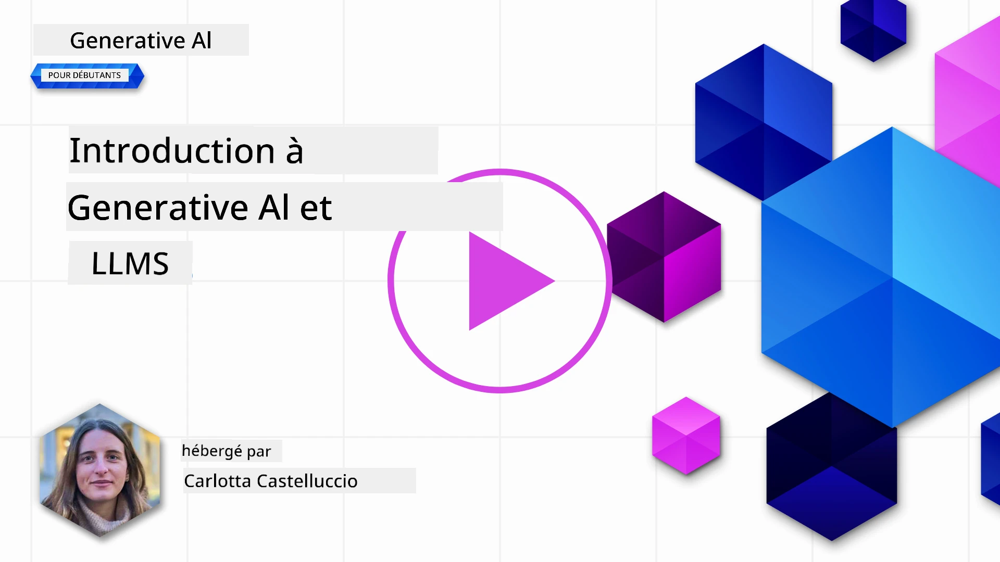
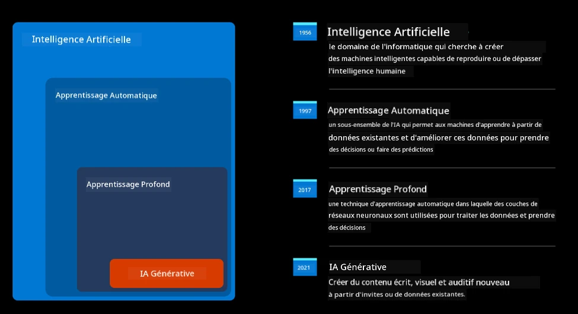
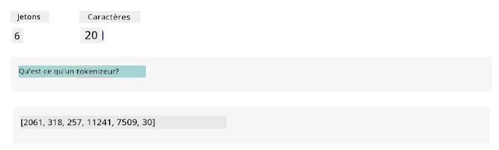
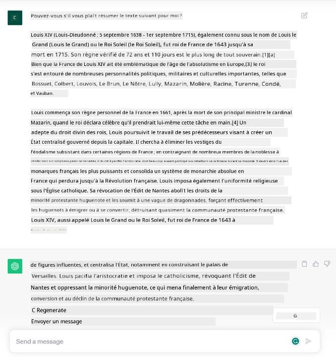
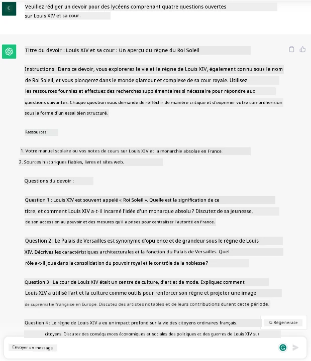
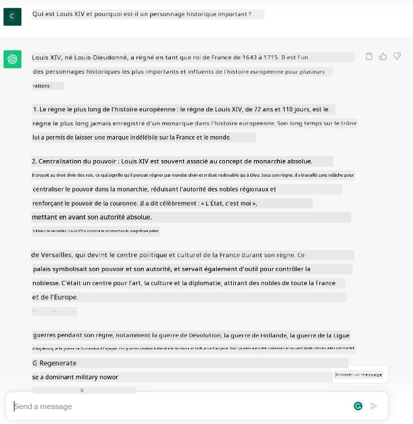
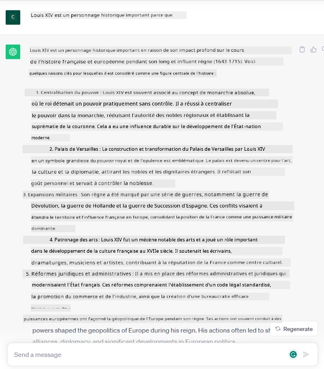
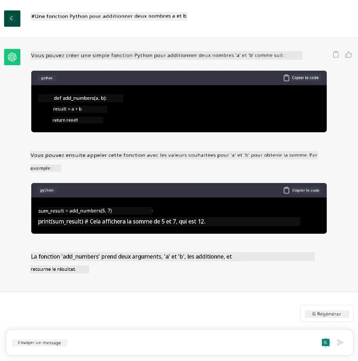

# Introduction à l’IA générative et aux grands modèles de langage

_(Cliquez sur l'image ci-dessus pour regarder la vidéo de cette leçon)_

L’IA générative est une intelligence artificielle capable de générer du texte, des images et d’autres types de contenu. Ce qui en fait une technologie fantastique, c’est qu’elle démocratise l’IA : tout le monde peut l’utiliser avec aussi peu qu’une invite textuelle, une phrase écrite en langage naturel. Il n’est pas nécessaire d’apprendre un langage comme Java ou SQL pour accomplir quelque chose d’utile, il suffit d’utiliser votre langue, d’indiquer ce que vous voulez et une suggestion provenant d’un modèle d’IA apparaît. Les applications et l’impact sont énormes : vous écrivez ou comprenez des rapports, rédigez des applications et bien plus, le tout en quelques secondes.

Dans ce programme, nous explorerons comment notre startup exploite l’IA générative pour débloquer de nouveaux scénarios dans le monde de l’éducation et comment nous abordons les défis inévitables liés aux implications sociales de son application et aux limites technologiques.

## Introduction

Cette leçon couvrira :

- Introduction au scénario commercial : notre idée et mission de startup.
- L’IA générative et comment nous en sommes arrivés au paysage technologique actuel.
- Le fonctionnement interne d’un grand modèle de langage.
- Principales capacités et cas d’utilisation pratiques des grands modèles de langage.

## Objectifs d’apprentissage

Après avoir terminé cette leçon, vous comprendrez :

- Ce qu’est l’IA générative et comment fonctionnent les grands modèles de langage.
- Comment vous pouvez exploiter les grands modèles de langage pour différents cas d’usage, avec un accent sur les scénarios éducatifs.

## Scénario : notre startup éducative

L’intelligence artificielle générative (IA) représente le sommet de la technologie IA, repoussant les limites de ce que l’on croyait autrefois impossible. Les modèles d’IA générative ont plusieurs capacités et applications, mais pour ce programme nous explorerons comment elle révolutionne l’éducation à travers une startup fictive. Nous appellerons cette startup _notre startup_. Notre startup travaille dans le domaine de l’éducation avec la mission ambitieuse de

> _améliorer l’accessibilité à l’apprentissage à l’échelle mondiale, garantir un accès équitable à l’éducation et offrir des expériences d’apprentissage personnalisées à chaque apprenant, selon ses besoins_.

L’équipe de notre startup est consciente que nous ne pourrons pas atteindre cet objectif sans exploiter l’un des outils les plus puissants des temps modernes – les grands modèles de langage (LLM).

L’IA générative est censée révolutionner la façon dont nous apprenons et enseignons aujourd’hui, avec des étudiants disposant à tout moment de professeurs virtuels qui fournissent une grande quantité d’informations et d’exemples, et des enseignants capables d’utiliser des outils innovants pour évaluer leurs élèves et donner des retours.

Pour commencer, définissons quelques concepts et terminologies de base que nous utiliserons tout au long du programme.

## Comment sommes-nous arrivés à l’IA générative ?

Malgré le battage médiatique extraordinaire créé récemment par l’annonce des modèles d’IA générative, cette technologie est le fruit de plusieurs décennies de recherche, avec les premières initiatives remontant aux années 60. Nous sommes aujourd’hui à un point où l’IA possède des capacités cognitives humaines, comme la conversation, démontrée par exemple par [OpenAI ChatGPT](https://openai.com/chatgpt) ou [Microsoft Copilot](https://copilot.microsoft.com/?WT.mc_id=academic-105485-koreyst), qui utilise également un modèle GPT pour son expérience de recherche web conversationnelle.

Pour revenir un peu en arrière, les premiers prototypes d’IA consistaient en des chatbots à saisie manuelle, reposant sur une base de connaissances extraite d’un groupe d’experts et représentée dans un ordinateur. Les réponses dans la base de connaissances étaient déclenchées par des mots-clés apparaissant dans le texte d’entrée.
Cependant, il est rapidement devenu clair qu’une telle approche, utilisant des chatbots à saisie manuelle, ne se prêtait pas à une grande échelle.

### Une approche statistique de l’IA : l’apprentissage automatique

Un tournant est arrivé dans les années 90, avec l’application d’une approche statistique à l’analyse de texte. Cela a conduit au développement de nouveaux algorithmes – connus sous le nom d’apprentissage automatique – capables d’apprendre des motifs à partir des données sans être explicitement programmés. Cette approche permet aux machines de simuler la compréhension du langage humain : un modèle statistique est entraîné sur des paires texte-étiquette, ce qui permet au modèle de classer un texte inconnu avec une étiquette prédéfinie représentant l’intention du message.

### Réseaux neuronaux et assistants virtuels modernes

Ces dernières années, l’évolution technologique du matériel, capable de gérer des quantités plus importantes de données et des calculs plus complexes, a encouragé la recherche en IA, menant au développement d’algorithmes d’apprentissage automatique avancés connus sous le nom de réseaux neuronaux ou apprentissage profond.

Les réseaux neuronaux (et en particulier les réseaux neuronaux récurrents – RNN) ont considérablement amélioré le traitement du langage naturel, permettant la représentation du sens du texte de manière plus significative, en valorisant le contexte d’un mot dans une phrase.

C’est cette technologie qui a alimenté les assistants virtuels nés dans la première décennie du nouveau siècle, très performants pour interpréter le langage humain, identifier un besoin, et effectuer une action pour le satisfaire – comme répondre avec un script prédéfini ou consommer un service tiers.

### Aujourd’hui, l’IA générative

C’est ainsi que nous en sommes arrivés à l’IA générative aujourd’hui, qui peut être vue comme un sous-ensemble de l’apprentissage profond.

Après des décennies de recherche dans le domaine de l’IA, une nouvelle architecture de modèle – appelée _Transformer_ – a surpassé les limites des RNN, étant capable de gérer des séquences de texte beaucoup plus longues en entrée. Les Transformers sont basés sur le mécanisme d’attention, permettant au modèle d’attribuer différents poids aux entrées qu’il reçoit, « en prêtant plus attention » là où l’information la plus pertinente est concentrée, indépendamment de leur ordre dans la séquence textuelle.

La plupart des modèles d’IA générative récents – également connus sous le nom de grands modèles de langage (LLM), puisqu’ils fonctionnent avec des entrées et sorties textuelles – sont en effet basés sur cette architecture. Ce qui est intéressant avec ces modèles – entraînés sur une énorme quantité de données non étiquetées issues de sources diverses comme des livres, articles et sites web – c’est qu’ils peuvent être adaptés à une grande variété de tâches et générer un texte grammaticalement correct avec une apparence de créativité. Ainsi, non seulement ils ont incroyablement amélioré la capacité d’une machine à « comprendre » un texte en entrée, mais ils ont aussi permis à ces modèles de générer une réponse originale en langage humain.

## Comment fonctionnent les grands modèles de langage ?

Dans le chapitre suivant, nous allons explorer différents types de modèles d’IA générative, mais pour l’instant, examinons comment fonctionnent les grands modèles de langage, en mettant l’accent sur les modèles OpenAI GPT (Generative Pre-trained Transformer).

- **Tokenizer, texte en chiffres** : Les grands modèles de langage reçoivent un texte en entrée et génèrent un texte en sortie. Cependant, étant des modèles statistiques, ils fonctionnent beaucoup mieux avec des nombres que des séquences textuelles. C’est pourquoi chaque entrée du modèle est traitée par un tokenizer, avant d’être utilisée par le modèle principal. Un token est un morceau de texte – constitué d’un nombre variable de caractères, la tâche principale du tokenizer est donc de diviser l’entrée en un tableau de tokens. Ensuite, chaque token est associé à un indice de token, qui est l’encodage entier du segment original de texte.

- **Prédiction des tokens de sortie** : Donnant n tokens en entrée (avec un maximum n variant selon le modèle), le modèle est capable de prédire un token en sortie. Ce token est ensuite incorporé dans l’entrée de l’itération suivante, selon un schéma de fenêtre glissante, améliorant l’expérience utilisateur en fournissant une ou plusieurs phrases comme réponse. C’est pourquoi, si vous avez déjà joué avec ChatGPT, vous avez peut-être remarqué qu’il semble parfois s’arrêter au milieu d’une phrase.

- **Processus de sélection, distribution de probabilité** : Le token en sortie est choisi par le modèle en fonction de sa probabilité d’apparaître après la séquence textuelle actuelle. Ceci parce que le modèle prédit une distribution de probabilité sur tous les « tokens suivants » possibles, calculée lors de son entraînement. Cependant, ce n’est pas toujours le token avec la plus haute probabilité qui est choisi dans la distribution résultante. Un degré d’aléa est ajouté à ce choix, de manière à ce que le modèle agisse de façon non déterministe – nous n’obtenons donc pas la même sortie exacte pour la même entrée. Ce degré d’aléa est ajouté pour simuler un processus de pensée créative et peut être réglé à l’aide d’un paramètre du modèle appelé température.

## Comment notre startup peut-elle exploiter les grands modèles de langage ?

Maintenant que nous comprenons mieux le fonctionnement interne d’un grand modèle de langage, voyons quelques exemples pratiques des tâches courantes qu’ils peuvent très bien accomplir, en gardant à l’esprit notre scénario commercial.
Nous avons dit que la capacité principale d’un grand modèle de langage est _de générer un texte à partir de zéro, en partant d’une entrée textuelle, écrite en langage naturel_.

Mais quel type d’entrée et de sortie textuelle ?
L’entrée d’un grand modèle de langage est appelée une invite (prompt), tandis que la sortie est appelée une complétion, terme qui fait référence au mécanisme du modèle pour générer le token suivant afin de compléter l’entrée actuelle. Nous allons plonger dans ce qu’est une invite et comment la concevoir de manière à tirer le meilleur parti de notre modèle. Mais pour l’instant, disons simplement qu’une invite peut inclure :

- Une **instruction** spécifiant le type de sortie attendu du modèle. Cette instruction peut parfois inclure des exemples ou des données supplémentaires.

  1. Résumé d’un article, livre, critiques de produit et plus encore, ainsi qu’extraction d’informations à partir de données non structurées.
    
    
  
  2. Idéation créative et conception d’un article, d’un essai, d’un devoir ou plus.
      
     

- Une **question**, posée sous forme de conversation avec un agent.
  
  

- Un morceau de **texte à compléter**, ce qui est implicitement une demande d’aide à la rédaction.
  
  

- Un morceau de **code** accompagné d’une demande d’explication et de documentation, ou un commentaire demandant de générer un morceau de code réalisant une tâche spécifique.
  
  

Les exemples ci-dessus sont assez simples et ne prétendent pas être une démonstration exhaustive des capacités des grands modèles de langage. Ils visent à montrer le potentiel de l’utilisation de l’IA générative, en particulier mais pas uniquement dans des contextes éducatifs.

De plus, la sortie d’un modèle d’IA générative n’est pas parfaite et parfois la créativité du modèle peut jouer contre lui, résultant en une sortie qui est une combinaison de mots qu’un utilisateur humain peut interpréter comme une mystification de la réalité, ou qui peut être offensante. L’IA générative n’est pas intelligente – du moins pas au sens le plus large du terme, incluant le raisonnement critique et créatif ou l’intelligence émotionnelle ; elle n’est pas déterministe et elle n’est pas fiable, car des fabrications, telles que des références erronées, du contenu et des affirmations, peuvent être combinées avec des informations correctes, et présentées de manière persuasive et confiante. Dans les leçons suivantes, nous aborderons toutes ces limitations et verrons ce que nous pouvons faire pour les atténuer.

## Devoir

Votre devoir est de vous renseigner davantage sur [l’IA générative](https://en.wikipedia.org/wiki/Generative_artificial_intelligence?WT.mc_id=academic-105485-koreyst) et d’essayer d’identifier un domaine où vous ajouteriez aujourd’hui l’IA générative là où elle n’existe pas encore. Comment l’impact serait-il différent de la méthode « traditionnelle » ? Pouvez-vous faire quelque chose que vous ne pouviez pas faire auparavant, ou êtes-vous plus rapide ? Rédigez un résumé de 300 mots sur ce à quoi ressemblerait votre startup IA de rêve en incluant des titres comme « Problème », « Comment j’utiliserais l’IA », « Impact » et éventuellement un plan d’affaires.

Si vous avez réalisé cette tâche, vous pourriez même être prêt à postuler à l’incubateur de Microsoft, [Microsoft for Startups Founders Hub](https://www.microsoft.com/startups?WT.mc_id=academic-105485-koreyst) : nous offrons des crédits pour Azure, OpenAI, du mentorat et bien plus, découvrez-le !

## Vérification des connaissances

Qu’est-ce qui est vrai à propos des grands modèles de langage ?

1. Vous obtenez la même réponse exacte à chaque fois.
1. Ils font tout parfaitement, excellent pour additionner des nombres, produire du code fonctionnel, etc.
1. La réponse peut varier malgré l’utilisation de la même invite. Ils sont aussi excellents pour vous fournir une première ébauche de quelque chose, que ce soit du texte ou du code. Mais vous devez améliorer les résultats.

A : 3, un LLM est non déterministe, la réponse varie, cependant, vous pouvez contrôler cette variance via un réglage de température. Vous ne devriez pas non plus attendre qu’il fasse tout parfaitement, il est là pour faire le travail lourd pour vous, ce qui signifie souvent que vous obtenez une bonne première tentative à améliorer progressivement.

## Très bon travail ! Continuez le parcours

Après avoir terminé cette leçon, consultez notre [collection d’apprentissage sur l’IA générative](https://aka.ms/genai-collection?WT.mc_id=academic-105485-koreyst) pour continuer à approfondir vos connaissances sur l’IA générative !

Rendez-vous à la Leçon 2 où nous verrons comment [explorer et comparer différents types de LLM](../02-exploring-and-comparing-different-llms/README.md?WT.mc_id=academic-105485-koreyst) !

---

<!-- CO-OP TRANSLATOR DISCLAIMER START -->
**Avertissement** :
Ce document a été traduit à l'aide du service de traduction automatique [Co-op Translator](https://github.com/Azure/co-op-translator). Bien que nous nous efforçions d'assurer l'exactitude, veuillez noter que les traductions automatisées peuvent contenir des erreurs ou des inexactitudes. Le document original dans sa langue native doit être considéré comme la source faisant autorité. Pour les informations critiques, il est recommandé de recourir à une traduction professionnelle réalisée par un humain. Nous ne saurions être tenus responsables des malentendus ou erreurs d'interprétation découlant de l'utilisation de cette traduction.
<!-- CO-OP TRANSLATOR DISCLAIMER END -->