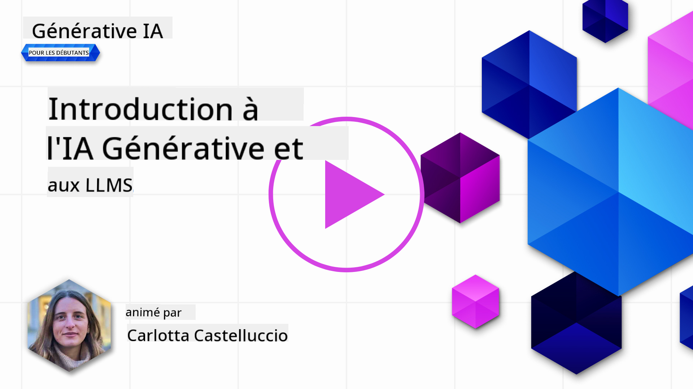
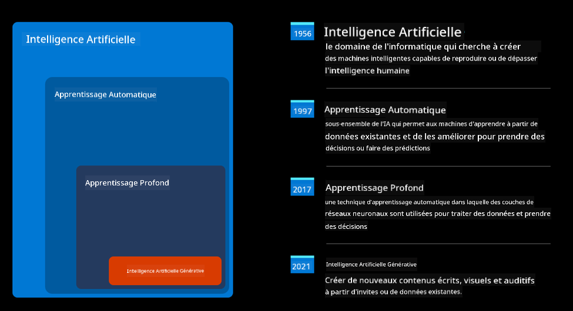
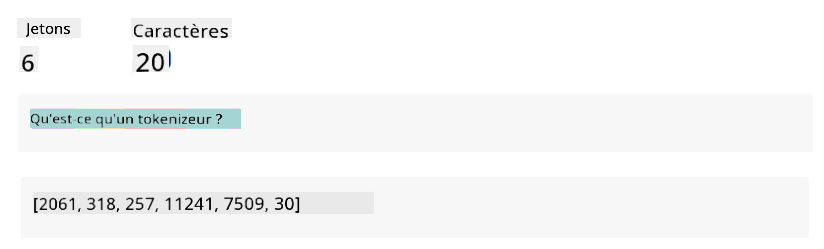
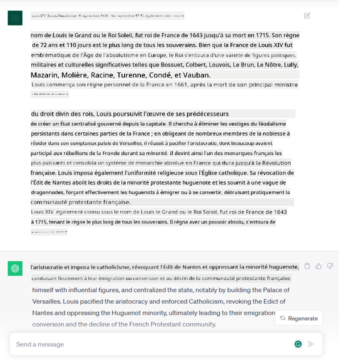
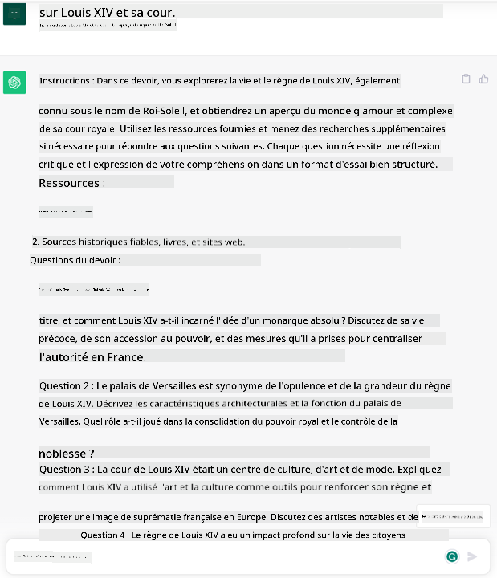
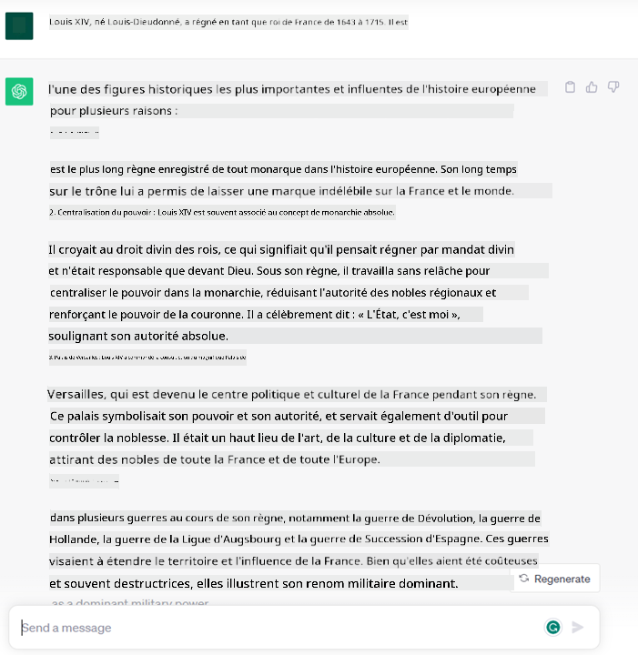
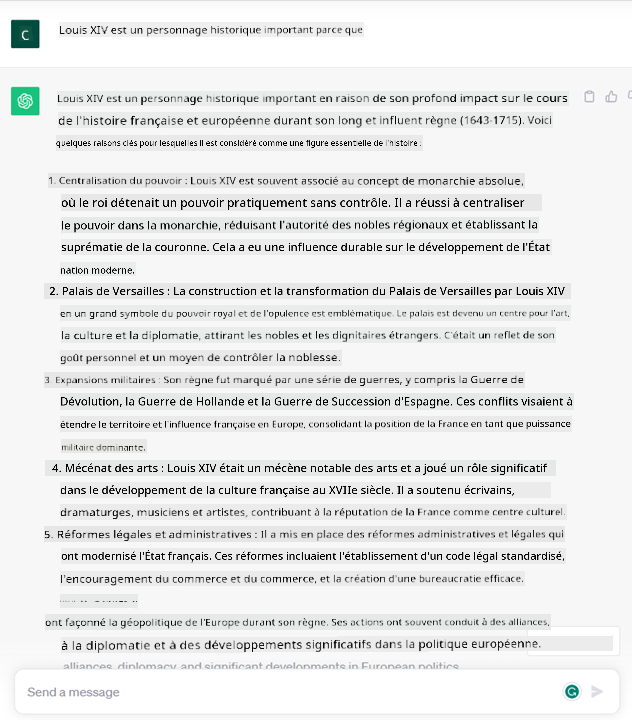
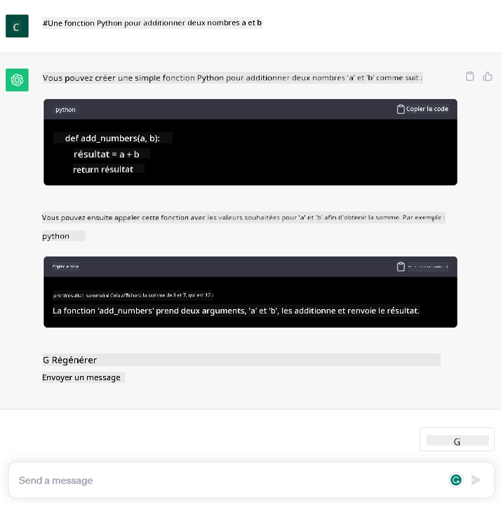

<!--
CO_OP_TRANSLATOR_METADATA:
{
  "original_hash": "f53ba0fa49164f9323043f1c6b11f2b1",
  "translation_date": "2025-06-25T09:34:31+00:00",
  "source_file": "01-introduction-to-genai/README.md",
  "language_code": "fr"
}
-->
# Introduction à l'IA Générative et aux Modèles de Langage de Grande Taille

_(Cliquez sur l'image ci-dessus pour voir la vidéo de cette leçon)_

L'IA générative est une intelligence artificielle capable de générer du texte, des images et d'autres types de contenu. Ce qui en fait une technologie fantastique, c'est qu'elle démocratise l'IA, tout le monde peut l'utiliser avec un simple texte d'invite, une phrase écrite en langage naturel. Il n'est pas nécessaire d'apprendre un langage comme Java ou SQL pour accomplir quelque chose de valable, il suffit d'utiliser votre langage, de dire ce que vous voulez et une suggestion d'un modèle IA en résulte. Les applications et l'impact de cela sont énormes, vous pouvez écrire ou comprendre des rapports, rédiger des applications et bien plus, le tout en quelques secondes.

Dans ce programme, nous explorerons comment notre startup utilise l'IA générative pour débloquer de nouveaux scénarios dans le monde de l'éducation et comment nous abordons les défis inévitables liés aux implications sociales de son application et aux limitations technologiques.

## Introduction

Cette leçon couvrira :

- Introduction au scénario commercial : notre idée de startup et mission.
- IA générative et comment nous avons atteint le paysage technologique actuel.
- Fonctionnement interne d'un modèle de langage de grande taille.
- Principales capacités et cas d'utilisation pratiques des Modèles de Langage de Grande Taille.

## Objectifs d'apprentissage

Après avoir terminé cette leçon, vous comprendrez :

- Ce qu'est l'IA générative et comment fonctionnent les Modèles de Langage de Grande Taille.
- Comment vous pouvez utiliser les modèles de langage de grande taille pour différents cas d'utilisation, en mettant l'accent sur les scénarios éducatifs.

## Scénario : notre startup éducative

L'Intelligence Artificielle (IA) générative représente le sommet de la technologie IA, repoussant les limites de ce qui était autrefois considéré comme impossible. Les modèles d'IA générative ont plusieurs capacités et applications, mais pour ce programme, nous explorerons comment elle révolutionne l'éducation à travers une startup fictive. Nous nous référerons à cette startup comme _notre startup_. Notre startup travaille dans le domaine de l'éducation avec l'ambitieuse mission de

> _améliorer l'accessibilité à l'apprentissage, à l'échelle mondiale, en garantissant un accès équitable à l'éducation et en fournissant des expériences d'apprentissage personnalisées à chaque apprenant, selon ses besoins_.

Notre équipe de startup est consciente que nous ne pourrons pas atteindre cet objectif sans utiliser l'un des outils les plus puissants de l'époque moderne – les Modèles de Langage de Grande Taille (LLMs).

L'IA générative est censée révolutionner notre façon d'apprendre et d'enseigner aujourd'hui, avec des étudiants ayant à leur disposition des enseignants virtuels 24 heures sur 24 qui fournissent de vastes quantités d'informations et d'exemples, et des enseignants capables d'utiliser des outils innovants pour évaluer leurs étudiants et donner des retours.

Pour commencer, définissons quelques concepts de base et terminologie que nous utiliserons tout au long du programme.

## Comment avons-nous obtenu l'IA Générative ?

Malgré l'extraordinaire _hype_ créé récemment par l'annonce des modèles d'IA générative, cette technologie est en gestation depuis des décennies, avec les premiers efforts de recherche remontant aux années 60. Nous sommes maintenant à un point où l'IA possède des capacités cognitives humaines, comme la conversation, comme le montre par exemple [OpenAI ChatGPT](https://openai.com/chatgpt) ou [Bing Chat](https://www.microsoft.com/edge/features/bing-chat?WT.mc_id=academic-105485-koreyst), qui utilise également un modèle GPT pour les conversations de recherche Bing sur le web.

En revenant un peu en arrière, les tout premiers prototypes d'IA consistaient en des chatbots dactylographiés, s'appuyant sur une base de connaissances extraite d'un groupe d'experts et représentée dans un ordinateur. Les réponses dans la base de connaissances étaient déclenchées par des mots-clés apparaissant dans le texte d'entrée.
Cependant, il est vite devenu clair qu'une telle approche, utilisant des chatbots dactylographiés, ne s'adaptait pas bien.

### Une approche statistique de l'IA : Apprentissage Automatique

Un tournant est arrivé dans les années 90, avec l'application d'une approche statistique à l'analyse de texte. Cela a conduit au développement de nouveaux algorithmes – connus sous le nom d'apprentissage automatique – capables d'apprendre des modèles à partir de données sans être explicitement programmés. Cette approche permet aux machines de simuler la compréhension du langage humain : un modèle statistique est entraîné sur des paires texte-étiquette, permettant au modèle de classer un texte d'entrée inconnu avec une étiquette prédéfinie représentant l'intention du message.

### Réseaux neuronaux et assistants virtuels modernes

Ces dernières années, l'évolution technologique du matériel, capable de traiter des quantités de données plus importantes et des calculs plus complexes, a encouragé la recherche en IA, conduisant au développement d'algorithmes d'apprentissage automatique avancés connus sous le nom de réseaux neuronaux ou algorithmes d'apprentissage profond.

Les réseaux neuronaux (et en particulier les Réseaux Neuronaux Récurrents – RNNs) ont considérablement amélioré le traitement du langage naturel, permettant de représenter le sens du texte de manière plus significative, en valorisant le contexte d'un mot dans une phrase.

C'est la technologie qui a alimenté les assistants virtuels nés dans la première décennie du nouveau siècle, très compétents dans l'interprétation du langage humain, l'identification d'un besoin et l'exécution d'une action pour le satisfaire – comme répondre avec un script prédéfini ou consommer un service tiers.

### Aujourd'hui, l'IA Générative

C'est ainsi que nous sommes arrivés à l'IA Générative aujourd'hui, qui peut être vue comme un sous-ensemble de l'apprentissage profond.

Après des décennies de recherche dans le domaine de l'IA, une nouvelle architecture de modèle – appelée _Transformer_ – a surmonté les limites des RNNs, étant capable de recevoir des séquences de texte beaucoup plus longues en entrée. Les Transformers sont basés sur le mécanisme d'attention, permettant au modèle de donner des poids différents aux entrées qu'il reçoit, 'prêter plus d'attention' là où l'information la plus pertinente est concentrée, indépendamment de leur ordre dans la séquence de texte.

La plupart des récents modèles d'IA générative – également connus sous le nom de Modèles de Langage de Grande Taille (LLMs), car ils travaillent avec des entrées et sorties textuelles – sont en effet basés sur cette architecture. Ce qui est intéressant à propos de ces modèles – entraînés sur une énorme quantité de données non étiquetées provenant de diverses sources comme des livres, des articles et des sites web – c'est qu'ils peuvent être adaptés à une grande variété de tâches et générer un texte grammaticalement correct avec une apparence de créativité. Ainsi, non seulement ils ont incroyablement amélioré la capacité d'une machine à 'comprendre' un texte d'entrée, mais ils ont permis leur capacité à générer une réponse originale en langage humain.

## Comment fonctionnent les modèles de langage de grande taille ?

Dans le prochain chapitre, nous allons explorer différents types de modèles d'IA Générative, mais pour l'instant, examinons comment fonctionnent les modèles de langage de grande taille, en mettant l'accent sur les modèles GPT (Generative Pre-trained Transformer) d'OpenAI.

- **Tokenizer, texte en chiffres** : Les Modèles de Langage de Grande Taille reçoivent un texte en entrée et génèrent un texte en sortie. Cependant, étant des modèles statistiques, ils fonctionnent beaucoup mieux avec des chiffres que des séquences de texte. C'est pourquoi chaque entrée au modèle est traitée par un tokenizer, avant d'être utilisée par le modèle central. Un token est un morceau de texte – composé d'un nombre variable de caractères, donc la tâche principale du tokenizer est de diviser l'entrée en un tableau de tokens. Ensuite, chaque token est mappé avec un index de token, qui est le codage entier du morceau de texte original.

- **Prédiction des tokens de sortie** : Étant donné n tokens en entrée (avec un max n variant d'un modèle à l'autre), le modèle est capable de prédire un token en sortie. Ce token est ensuite incorporé dans l'entrée de la prochaine itération, dans un modèle de fenêtre en expansion, permettant une meilleure expérience utilisateur en obtenant une (ou plusieurs) phrase(s) comme réponse. Cela explique pourquoi, si vous avez déjà joué avec ChatGPT, vous avez peut-être remarqué qu'il semble parfois s'arrêter au milieu d'une phrase.

- **Processus de sélection, distribution de probabilité** : Le token de sortie est choisi par le modèle selon sa probabilité d'apparaître après la séquence de texte actuelle. Cela est dû au fait que le modèle prédit une distribution de probabilité sur tous les 'prochains tokens' possibles, calculée en fonction de son entraînement. Cependant, le token avec la probabilité la plus élevée n'est pas toujours choisi dans la distribution résultante. Un degré de hasard est ajouté à ce choix, de sorte que le modèle agit de manière non déterministe - nous n'obtenons pas exactement la même sortie pour la même entrée. Ce degré de hasard est ajouté pour simuler le processus de pensée créative et il peut être ajusté en utilisant un paramètre de modèle appelé température.

## Comment notre startup peut-elle utiliser les Modèles de Langage de Grande Taille ?

Maintenant que nous avons une meilleure compréhension du fonctionnement interne d'un modèle de langage de grande taille, voyons quelques exemples pratiques des tâches les plus courantes qu'ils peuvent accomplir assez bien, avec un regard sur notre scénario commercial.
Nous avons dit que la capacité principale d'un Modèle de Langage de Grande Taille est _générer un texte à partir de rien, à partir d'une entrée textuelle, écrite en langage naturel_.

Mais quel type d'entrée et de sortie textuelles ?
L'entrée d'un modèle de langage de grande taille est connue sous le nom de prompt, tandis que la sortie est connue sous le nom de completion, terme qui se réfère au mécanisme du modèle de générer le prochain token pour compléter l'entrée actuelle. Nous allons approfondir ce qu'est un prompt et comment le concevoir de manière à tirer le meilleur parti de notre modèle. Mais pour l'instant, disons simplement qu'un prompt peut inclure :

- Une **instruction** spécifiant le type de sortie que nous attendons du modèle. Cette instruction peut parfois intégrer des exemples ou des données supplémentaires.

  1. Résumé d'un article, livre, avis de produits et plus, ainsi que l'extraction d'informations à partir de données non structurées.
    
    
  
  2. Idéation créative et conception d'un article, essai, devoir ou plus.
      
     

- Une **question**, posée sous forme de conversation avec un agent.
  
  

- Un morceau de **texte à compléter**, qui est implicitement une demande d'assistance à la rédaction.
  
  

- Un morceau de **code** avec la demande de l'expliquer et de le documenter, ou un commentaire demandant de générer un morceau de code accomplissant une tâche spécifique.
  
  

Les exemples ci-dessus sont assez simples et ne sont pas destinés à être une démonstration exhaustive des capacités des Modèles de Langage de Grande Taille. Ils sont destinés à montrer le potentiel de l'utilisation de l'IA générative, en particulier mais pas uniquement dans des contextes éducatifs.

De plus, la sortie d'un modèle d'IA générative n'est pas parfaite et parfois la créativité du modèle peut se retourner contre lui, entraînant une sortie qui est une combinaison de mots que l'utilisateur humain peut interpréter comme une mystification de la réalité, ou elle peut être offensante. L'IA générative n'est pas intelligente - du moins dans la définition plus complète de l'intelligence, incluant le raisonnement critique et créatif ou l'intelligence émotionnelle; elle n'est pas déterministe, et elle n'est pas digne de confiance, car des fabrications, telles que des références erronées, du contenu et des déclarations, peuvent être combinées avec des informations correctes, et présentées de manière persuasive et confiante. Dans les leçons suivantes, nous aborderons toutes ces limitations et nous verrons ce que nous pouvons faire pour les atténuer.

## Devoir

Votre devoir est de lire davantage sur [l'IA générative](https://en.wikipedia.org/wiki/Generative_artificial_intelligence?WT.mc_id=academic-105485-koreyst) et d'essayer d'identifier un domaine où vous ajouteriez l'IA générative aujourd'hui qui n'en a pas. En quoi l'impact serait-il différent de le faire à l'ancienne, pouvez-vous faire quelque chose que vous ne pouviez pas auparavant, ou êtes-vous plus rapide ? Écrivez un résumé de 300 mots sur ce à quoi ressemblerait votre startup de rêve en IA et incluez des en-têtes comme "Problème", "Comment j'utiliserais l'IA", "Impact" et éventuellement un plan d'affaires.

Si vous avez fait cette tâche, vous pourriez même être prêt à postuler à l'incubateur de Microsoft, [Microsoft pour Startups Founders Hub](https://www.microsoft.com/startups?WT.mc_id=academic-105485-koreyst) nous offrons des crédits pour Azure, OpenAI, mentorat et bien plus encore, consultez-le !

## Vérification des connaissances

Qu'est-ce qui est vrai à propos des modèles de langage de grande taille ?

1. Vous obtenez exactement la même réponse à chaque fois.
1. Il fait les choses parfaitement, excellent pour additionner des nombres, produire du code fonctionnel, etc.
1. La réponse peut varier malgré l'utilisation du même prompt. Il est également excellent pour vous donner un premier jet de quelque chose, que ce soit du texte ou du code. Mais vous devez améliorer les résultats.

R : 3, un LLM est non déterministe, la réponse varie, cependant, vous pouvez contrôler sa variance via un réglage de température. Vous ne devriez pas non plus vous attendre à ce qu'il fasse les choses parfaitement, il est là pour faire le gros du travail pour vous, ce qui signifie souvent que vous obtenez une bonne première tentative de quelque chose que vous devez améliorer progressivement.

## Excellent travail ! Continuez votre parcours

Après avoir terminé cette leçon, consultez notre [collection d'apprentissage sur l'IA générative](https://aka.ms/genai-collection?WT.mc_id=academic-105485-koreyst) pour continuer à développer vos connaissances en IA générative !

Rendez-vous à la Leçon 2 où nous allons examiner comment [explorer et comparer différents types de LLM](../02-exploring-and-comparing-different-llms/README.md?WT.mc_id=academic-105485-koreyst) !

**Avertissement** :  
Ce document a été traduit à l'aide du service de traduction IA [Co-op Translator](https://github.com/Azure/co-op-translator). Bien que nous nous efforcions d'assurer l'exactitude, veuillez noter que les traductions automatisées peuvent contenir des erreurs ou des inexactitudes. Le document original dans sa langue d'origine doit être considéré comme la source faisant autorité. Pour des informations critiques, une traduction humaine professionnelle est recommandée. Nous ne sommes pas responsables des malentendus ou des interprétations erronées résultant de l'utilisation de cette traduction.