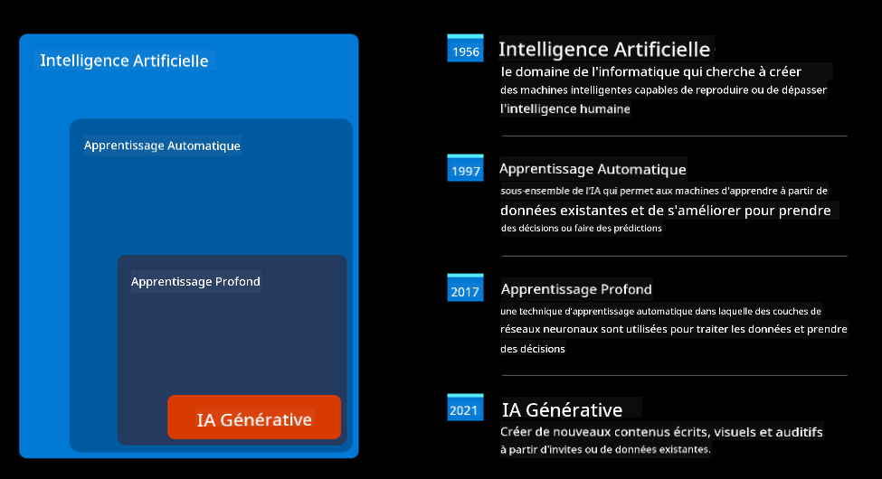
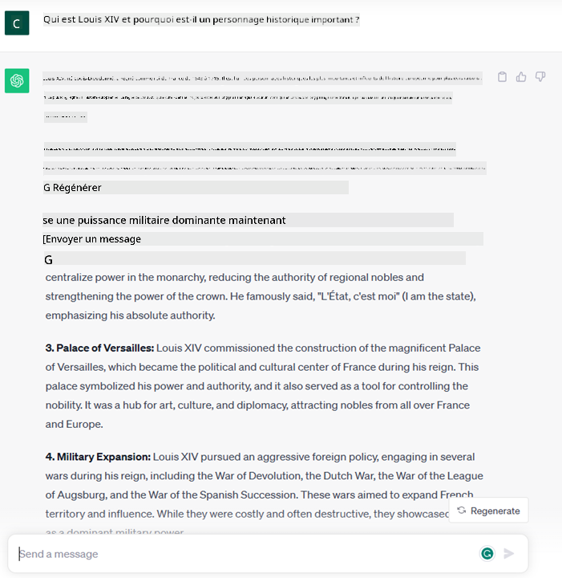
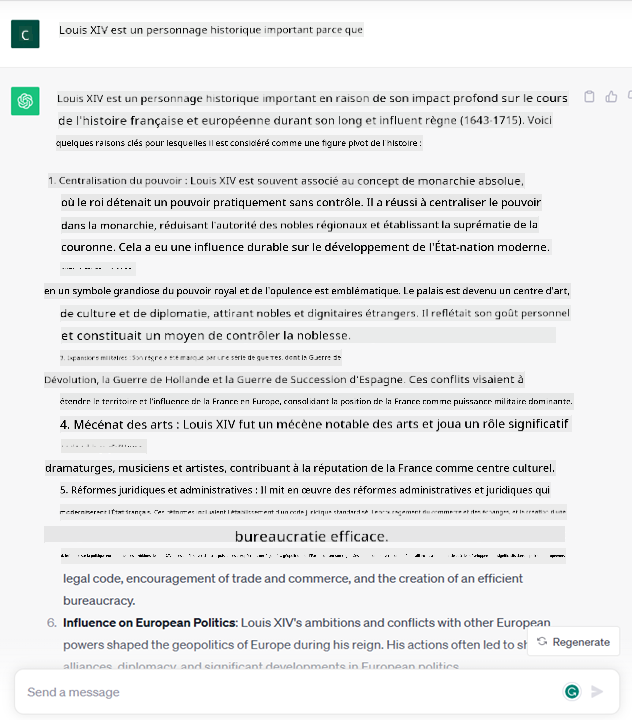

<!--
CO_OP_TRANSLATOR_METADATA:
{
  "original_hash": "f53ba0fa49164f9323043f1c6b11f2b1",
  "translation_date": "2025-07-09T07:40:20+00:00",
  "source_file": "01-introduction-to-genai/README.md",
  "language_code": "fr"
}
-->
# Introduction à l’IA générative et aux grands modèles de langage

_(Cliquez sur l’image ci-dessus pour voir la vidéo de cette leçon)_

L’IA générative est une intelligence artificielle capable de créer du texte, des images et d’autres types de contenus. Ce qui en fait une technologie fantastique, c’est qu’elle démocratise l’IA : n’importe qui peut l’utiliser avec simplement une invite textuelle, une phrase écrite en langage naturel. Il n’est pas nécessaire d’apprendre un langage comme Java ou SQL pour accomplir quelque chose d’utile, il suffit d’utiliser votre langue, d’exprimer ce que vous voulez, et une suggestion vous est proposée par un modèle d’IA. Les applications et l’impact sont énormes : vous pouvez rédiger ou comprendre des rapports, écrire des applications et bien plus encore, le tout en quelques secondes.

Dans ce programme, nous allons explorer comment notre startup utilise l’IA générative pour ouvrir de nouveaux scénarios dans le monde de l’éducation, et comment nous abordons les défis inévitables liés aux implications sociales de son application ainsi qu’aux limites technologiques.

## Introduction

Cette leçon couvrira :

- Introduction au scénario business : notre idée de startup et notre mission.
- L’IA générative et comment nous en sommes arrivés à la technologie actuelle.
- Le fonctionnement interne d’un grand modèle de langage.
- Les principales capacités et cas d’usage pratiques des grands modèles de langage.

## Objectifs d’apprentissage

À l’issue de cette leçon, vous comprendrez :

- Ce qu’est l’IA générative et comment fonctionnent les grands modèles de langage.
- Comment vous pouvez exploiter les grands modèles de langage pour différents cas d’usage, avec un focus sur les scénarios éducatifs.

## Scénario : notre startup éducative

L’intelligence artificielle générative représente le summum de la technologie IA, repoussant les limites de ce qui était autrefois considéré comme impossible. Les modèles d’IA générative ont plusieurs capacités et applications, mais dans ce programme, nous allons explorer comment elle révolutionne l’éducation à travers une startup fictive. Nous appellerons cette startup _notre startup_. Notre startup évolue dans le domaine de l’éducation avec la mission ambitieuse suivante :

> _améliorer l’accessibilité à l’apprentissage à l’échelle mondiale, garantir un accès équitable à l’éducation et offrir des expériences d’apprentissage personnalisées à chaque apprenant, selon ses besoins_.

Notre équipe est consciente que nous ne pourrons pas atteindre cet objectif sans exploiter l’un des outils les plus puissants de notre époque – les grands modèles de langage (LLMs).

L’IA générative devrait révolutionner la manière dont nous apprenons et enseignons aujourd’hui, avec des étudiants disposant de professeurs virtuels disponibles 24h/24 fournissant une grande quantité d’informations et d’exemples, et des enseignants pouvant utiliser des outils innovants pour évaluer leurs élèves et leur donner des retours.

Pour commencer, définissons quelques concepts et terminologies de base que nous utiliserons tout au long du programme.

## Comment sommes-nous arrivés à l’IA générative ?

Malgré l’énorme _buzz_ créé récemment par l’annonce des modèles d’IA générative, cette technologie se construit depuis des décennies, avec les premiers travaux de recherche remontant aux années 60. Nous en sommes aujourd’hui à un stade où l’IA possède des capacités cognitives humaines, comme la conversation, illustrée par exemple par [OpenAI ChatGPT](https://openai.com/chatgpt) ou [Bing Chat](https://www.microsoft.com/edge/features/bing-chat?WT.mc_id=academic-105485-koreyst), qui utilise également un modèle GPT pour les conversations de recherche web Bing.

Pour revenir un peu en arrière, les tout premiers prototypes d’IA consistaient en des chatbots à base de règles, s’appuyant sur une base de connaissances extraite d’un groupe d’experts et représentée dans un ordinateur. Les réponses dans cette base étaient déclenchées par des mots-clés présents dans le texte d’entrée.  
Cependant, il est vite apparu que cette approche, basée sur des chatbots à règles, ne pouvait pas être étendue à grande échelle.

### Une approche statistique de l’IA : le Machine Learning

Un tournant est survenu dans les années 90, avec l’application d’une approche statistique à l’analyse de texte. Cela a conduit au développement de nouveaux algorithmes – appelés apprentissage automatique (machine learning) – capables d’apprendre des motifs à partir des données sans être explicitement programmés. Cette approche permet aux machines de simuler la compréhension du langage humain : un modèle statistique est entraîné sur des paires texte-étiquette, ce qui lui permet de classer un texte inconnu avec une étiquette prédéfinie représentant l’intention du message.

### Réseaux de neurones et assistants virtuels modernes

Ces dernières années, l’évolution technologique du matériel, capable de gérer des volumes de données plus importants et des calculs plus complexes, a encouragé la recherche en IA, menant au développement d’algorithmes avancés d’apprentissage automatique appelés réseaux de neurones ou apprentissage profond (deep learning).

Les réseaux de neurones (et en particulier les réseaux de neurones récurrents – RNN) ont considérablement amélioré le traitement du langage naturel, permettant de représenter le sens d’un texte de manière plus pertinente, en tenant compte du contexte d’un mot dans une phrase.

C’est cette technologie qui a alimenté les assistants virtuels nés dans la première décennie du nouveau siècle, très compétents pour interpréter le langage humain, identifier un besoin et effectuer une action pour y répondre – comme répondre avec un script prédéfini ou utiliser un service tiers.

### Aujourd’hui, l’IA générative

C’est ainsi que nous en sommes arrivés à l’IA générative actuelle, qui peut être vue comme un sous-ensemble de l’apprentissage profond.

Après des décennies de recherche en IA, une nouvelle architecture de modèle – appelée _Transformer_ – a dépassé les limites des RNN, étant capable de traiter des séquences de texte beaucoup plus longues en entrée. Les Transformers reposent sur le mécanisme d’attention, qui permet au modèle d’attribuer des poids différents aux entrées qu’il reçoit, « prêtant plus d’attention » là où se concentre l’information la plus pertinente, indépendamment de leur ordre dans la séquence de texte.

La plupart des modèles récents d’IA générative – également appelés grands modèles de langage (LLMs), car ils travaillent avec des entrées et sorties textuelles – sont basés sur cette architecture. Ce qui est intéressant avec ces modèles – entraînés sur une énorme quantité de données non étiquetées provenant de sources diverses comme des livres, articles et sites web – c’est qu’ils peuvent être adaptés à une grande variété de tâches et générer un texte grammaticalement correct avec une certaine créativité. Ainsi, non seulement ils ont considérablement amélioré la capacité d’une machine à « comprendre » un texte d’entrée, mais ils ont aussi permis de générer une réponse originale en langage humain.

## Comment fonctionnent les grands modèles de langage ?

Dans le chapitre suivant, nous explorerons différents types de modèles d’IA générative, mais pour l’instant, voyons comment fonctionnent les grands modèles de langage, en nous concentrant sur les modèles OpenAI GPT (Generative Pre-trained Transformer).

- **Tokenizer, du texte aux nombres** : Les grands modèles de langage reçoivent un texte en entrée et génèrent un texte en sortie. Cependant, étant des modèles statistiques, ils fonctionnent bien mieux avec des nombres qu’avec des séquences de texte. C’est pourquoi chaque entrée est traitée par un tokenizer avant d’être utilisée par le modèle principal. Un token est un fragment de texte – composé d’un nombre variable de caractères, donc la tâche principale du tokenizer est de découper l’entrée en un tableau de tokens. Ensuite, chaque token est associé à un index de token, qui est l’encodage entier du fragment de texte original.

- **Prédiction des tokens de sortie** : Donnés n tokens en entrée (avec un maximum n qui varie selon le modèle), le modèle est capable de prédire un token en sortie. Ce token est ensuite incorporé dans l’entrée de l’itération suivante, selon un schéma de fenêtre glissante, permettant une meilleure expérience utilisateur en obtenant une ou plusieurs phrases en réponse. Cela explique pourquoi, si vous avez déjà utilisé ChatGPT, vous avez peut-être remarqué qu’il s’arrête parfois au milieu d’une phrase.

- **Processus de sélection, distribution de probabilité** : Le token de sortie est choisi par le modèle selon sa probabilité d’apparaître après la séquence de texte actuelle. En effet, le modèle prédit une distribution de probabilité sur tous les « tokens suivants » possibles, calculée à partir de son entraînement. Cependant, ce n’est pas toujours le token avec la probabilité la plus élevée qui est choisi. Un certain degré d’aléa est ajouté à ce choix, de sorte que le modèle agit de manière non déterministe – on n’obtient pas exactement la même sortie pour la même entrée. Ce degré d’aléa est ajouté pour simuler le processus de pensée créative et peut être ajusté via un paramètre du modèle appelé température.

## Comment notre startup peut-elle exploiter les grands modèles de langage ?

Maintenant que nous comprenons mieux le fonctionnement interne d’un grand modèle de langage, voyons quelques exemples pratiques des tâches les plus courantes qu’ils peuvent accomplir efficacement, en gardant à l’esprit notre scénario business.  
Nous avons dit que la principale capacité d’un grand modèle de langage est _de générer un texte à partir de zéro, en partant d’une entrée textuelle écrite en langage naturel_.

Mais quel type d’entrée et de sortie textuelle ?  
L’entrée d’un grand modèle de langage est appelée prompt, tandis que la sortie est appelée completion, terme qui fait référence au mécanisme du modèle pour générer le token suivant afin de compléter l’entrée actuelle. Nous allons approfondir ce qu’est un prompt et comment le concevoir pour tirer le meilleur parti de notre modèle. Mais pour l’instant, disons simplement qu’un prompt peut inclure :

- Une **instruction** précisant le type de sortie attendu du modèle. Cette instruction peut parfois inclure des exemples ou des données supplémentaires.

  1. Résumé d’un article, livre, avis produit et plus, ainsi que l’extraction d’informations à partir de données non structurées.
    
    
  
  2. Idéation créative et rédaction d’un article, d’un essai, d’un devoir ou plus.
      
     

- Une **question**, posée sous forme de conversation avec un agent.
  
  

- Un fragment de **texte à compléter**, ce qui est implicitement une demande d’aide à la rédaction.
  
  

- Un fragment de **code** accompagné d’une demande d’explication et de documentation, ou un commentaire demandant de générer un morceau de code réalisant une tâche spécifique.
  
  

Les exemples ci-dessus sont assez simples et ne prétendent pas être une démonstration exhaustive des capacités des grands modèles de langage. Ils ont pour but de montrer le potentiel de l’IA générative, en particulier mais pas uniquement dans des contextes éducatifs.

Par ailleurs, la sortie d’un modèle d’IA générative n’est pas parfaite et parfois la créativité du modèle peut jouer contre lui, produisant un résultat qui est une combinaison de mots que l’utilisateur humain peut interpréter comme une mystification de la réalité, voire offensante. L’IA générative n’est pas intelligente – du moins pas dans la définition la plus large de l’intelligence, incluant le raisonnement critique et créatif ou l’intelligence émotionnelle ; elle n’est pas déterministe, et elle n’est pas fiable, car des fabrications, telles que des références erronées, des contenus et affirmations incorrects, peuvent être mêlées à des informations justes, et présentées de manière persuasive et confiante. Dans les leçons suivantes, nous aborderons toutes ces limites et verrons comment les atténuer.

## Exercice

Votre exercice est de vous documenter davantage sur [l’IA générative](https://en.wikipedia.org/wiki/Generative_artificial_intelligence?WT.mc_id=academic-105485-koreyst) et d’essayer d’identifier un domaine où vous ajouteriez aujourd’hui de l’IA générative alors qu’elle n’y est pas encore. En quoi l’impact serait-il différent par rapport à la méthode « classique » ? Pouvez-vous faire quelque chose que vous ne pouviez pas faire avant, ou êtes-vous plus rapide ? Rédigez un résumé de 300 mots décrivant à quoi ressemblerait votre startup IA de rêve, en incluant des titres comme « Problème », « Comment j’utiliserais l’IA », « Impact » et éventuellement un plan d’affaires.

Si vous réalisez cette tâche, vous pourriez même être prêt à postuler à l’incubateur de Microsoft, [Microsoft for Startups Founders Hub](https://www.microsoft.com/startups?WT.mc_id=academic-105485-koreyst) : nous offrons des crédits pour Azure, OpenAI, du mentorat et bien plus, n’hésitez pas à jeter un œil !

## Vérification des connaissances

Qu’est-ce qui est vrai à propos des grands modèles de langage ?

1. Vous obtenez la même réponse exacte à chaque fois.  
1. Ils font tout parfaitement, excellent pour additionner des nombres, produire du code fonctionnel, etc.  
1. La réponse peut varier même en utilisant la même invite. Ils sont aussi très bons pour fournir un premier brouillon, que ce soit du texte ou du code. Mais vous devez améliorer les résultats.

Réponse : 3, un LLM est non déterministe, la réponse varie, cependant vous pouvez contrôler cette variance via un paramètre de température. Vous ne devez pas non plus vous attendre à ce qu’il fasse tout parfaitement, il est là pour faire le travail lourd pour vous, ce qui signifie souvent que vous obtenez une bonne première version à améliorer progressivement.

## Excellent travail ! Continuez l’aventure

Après avoir terminé cette leçon, consultez notre [collection d’apprentissage sur l’IA générative](https://aka.ms/genai-collection?WT.mc_id=academic-105485-koreyst) pour continuer à approfondir vos connaissances sur l’IA générative !
Rendez-vous à la Leçon 2 où nous verrons comment [explorer et comparer différents types de LLM](../02-exploring-and-comparing-different-llms/README.md?WT.mc_id=academic-105485-koreyst) !

**Avertissement** :  
Ce document a été traduit à l’aide du service de traduction automatique [Co-op Translator](https://github.com/Azure/co-op-translator). Bien que nous nous efforcions d’assurer l’exactitude, veuillez noter que les traductions automatiques peuvent contenir des erreurs ou des inexactitudes. Le document original dans sa langue d’origine doit être considéré comme la source faisant foi. Pour les informations critiques, une traduction professionnelle réalisée par un humain est recommandée. Nous déclinons toute responsabilité en cas de malentendus ou de mauvaises interprétations résultant de l’utilisation de cette traduction.