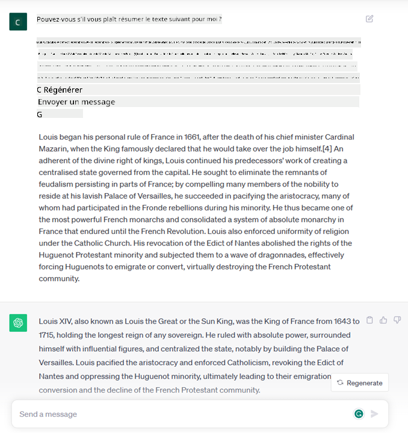
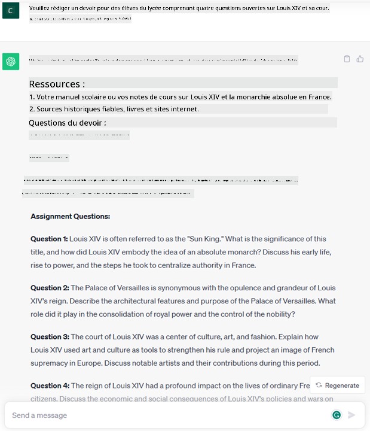

<!--
CO_OP_TRANSLATOR_METADATA:
{
  "original_hash": "bfb7901bdbece1ba3e9f35c400ca33e8",
  "translation_date": "2025-10-17T22:42:53+00:00",
  "source_file": "01-introduction-to-genai/README.md",
  "language_code": "fr"
}
-->
# Introduction à l'IA générative et aux modèles de langage étendus

_(Cliquez sur l'image ci-dessus pour visionner la vidéo de cette leçon)_

L'IA générative est une intelligence artificielle capable de générer du texte, des images et d'autres types de contenu. Ce qui rend cette technologie fantastique, c'est qu'elle démocratise l'IA : tout le monde peut l'utiliser avec aussi peu qu'une simple invite textuelle, une phrase écrite en langage naturel. Il n'est pas nécessaire d'apprendre un langage comme Java ou SQL pour accomplir quelque chose de significatif, il suffit d'utiliser votre propre langage, de formuler ce que vous voulez, et un modèle d'IA vous propose une suggestion. Les applications et l'impact de cette technologie sont énormes : rédiger ou comprendre des rapports, écrire des applications et bien plus encore, le tout en quelques secondes.

Dans ce programme, nous explorerons comment notre startup utilise l'IA générative pour débloquer de nouveaux scénarios dans le domaine de l'éducation et comment nous abordons les défis inévitables liés aux implications sociales de son application et aux limites technologiques.

## Introduction

Cette leçon couvrira :

- Introduction au scénario commercial : notre idée de startup et notre mission.
- L'IA générative et comment nous avons atteint le paysage technologique actuel.
- Fonctionnement interne d'un modèle de langage étendu.
- Principales capacités et cas d'utilisation pratiques des modèles de langage étendus.

## Objectifs d'apprentissage

Après avoir terminé cette leçon, vous comprendrez :

- Ce qu'est l'IA générative et comment fonctionnent les modèles de langage étendus.
- Comment vous pouvez utiliser les modèles de langage étendus pour différents cas d'utilisation, en mettant l'accent sur les scénarios éducatifs.

## Scénario : notre startup éducative

L'intelligence artificielle générative (IA) représente le sommet de la technologie IA, repoussant les limites de ce qui était autrefois considéré comme impossible. Les modèles d'IA générative ont plusieurs capacités et applications, mais dans ce programme, nous explorerons comment elle révolutionne l'éducation à travers une startup fictive. Nous nous référerons à cette startup comme _notre startup_. Notre startup travaille dans le domaine de l'éducation avec une mission ambitieuse :

> _améliorer l'accessibilité à l'apprentissage à l'échelle mondiale, garantir un accès équitable à l'éducation et offrir des expériences d'apprentissage personnalisées à chaque apprenant, selon ses besoins_.

L'équipe de notre startup est consciente qu'elle ne pourra pas atteindre cet objectif sans exploiter l'un des outils les plus puissants de notre époque – les modèles de langage étendus (LLMs).

L'IA générative devrait révolutionner la façon dont nous apprenons et enseignons aujourd'hui, avec des étudiants disposant de professeurs virtuels 24 heures sur 24 qui fournissent une quantité énorme d'informations et d'exemples, et des enseignants capables d'utiliser des outils innovants pour évaluer leurs élèves et leur donner des retours.

Pour commencer, définissons quelques concepts et terminologies de base que nous utiliserons tout au long du programme.

## Comment avons-nous obtenu l'IA générative ?

Malgré l'extraordinaire _engouement_ créé récemment par l'annonce des modèles d'IA générative, cette technologie est en développement depuis des décennies, les premiers efforts de recherche remontant aux années 60. Nous sommes maintenant à un point où l'IA possède des capacités cognitives humaines, comme la conversation, illustrée par exemple par [OpenAI ChatGPT](https://openai.com/chatgpt) ou [Bing Chat](https://www.microsoft.com/edge/features/bing-chat?WT.mc_id=academic-105485-koreyst), qui utilise également un modèle GPT pour les conversations de recherche sur le web.

En revenant un peu en arrière, les tout premiers prototypes d'IA consistaient en des chatbots écrits, reposant sur une base de connaissances extraite d'un groupe d'experts et représentée dans un ordinateur. Les réponses dans la base de connaissances étaient déclenchées par des mots-clés apparaissant dans le texte d'entrée. Cependant, il est vite devenu évident qu'une telle approche, utilisant des chatbots écrits, ne se généralisait pas bien.

### Une approche statistique de l'IA : l'apprentissage automatique

Un tournant est arrivé dans les années 90, avec l'application d'une approche statistique à l'analyse de texte. Cela a conduit au développement de nouveaux algorithmes – connus sous le nom d'apprentissage automatique – capables d'apprendre des modèles à partir de données sans être explicitement programmés. Cette approche permet aux machines de simuler la compréhension du langage humain : un modèle statistique est entraîné sur des paires texte-étiquette, permettant au modèle de classer un texte d'entrée inconnu avec une étiquette prédéfinie représentant l'intention du message.

### Réseaux neuronaux et assistants virtuels modernes

Ces dernières années, l'évolution technologique du matériel, capable de traiter de plus grandes quantités de données et des calculs plus complexes, a encouragé la recherche en IA, conduisant au développement d'algorithmes avancés d'apprentissage automatique connus sous le nom de réseaux neuronaux ou d'algorithmes d'apprentissage profond.

Les réseaux neuronaux (et en particulier les réseaux neuronaux récurrents – RNNs) ont considérablement amélioré le traitement du langage naturel, permettant de représenter le sens du texte de manière plus significative, en valorisant le contexte d'un mot dans une phrase.

C'est cette technologie qui a alimenté les assistants virtuels nés dans la première décennie du nouveau siècle, très compétents pour interpréter le langage humain, identifier un besoin et effectuer une action pour le satisfaire – comme répondre avec un script prédéfini ou consommer un service tiers.

### Aujourd'hui, l'IA générative

C'est ainsi que nous sommes arrivés à l'IA générative aujourd'hui, qui peut être considérée comme un sous-ensemble de l'apprentissage profond.

Après des décennies de recherche dans le domaine de l'IA, une nouvelle architecture de modèle – appelée _Transformer_ – a surmonté les limites des RNNs, étant capable de recevoir des séquences de texte beaucoup plus longues en entrée. Les Transformers sont basés sur le mécanisme d'attention, permettant au modèle de donner des poids différents aux entrées qu'il reçoit, en « prêtant plus d'attention » là où se concentre l'information la plus pertinente, indépendamment de leur ordre dans la séquence de texte.

La plupart des modèles récents d'IA générative – également connus sous le nom de modèles de langage étendus (LLMs), car ils fonctionnent avec des entrées et sorties textuelles – sont en effet basés sur cette architecture. Ce qui est intéressant à propos de ces modèles – entraînés sur une énorme quantité de données non étiquetées provenant de diverses sources comme des livres, des articles et des sites web – c'est qu'ils peuvent être adaptés à une grande variété de tâches et générer un texte grammaticalement correct avec une apparence de créativité. Ainsi, non seulement ils ont incroyablement amélioré la capacité d'une machine à « comprendre » un texte d'entrée, mais ils ont également permis sa capacité à générer une réponse originale en langage humain.

## Comment fonctionnent les modèles de langage étendus ?

Dans le prochain chapitre, nous allons explorer différents types de modèles d'IA générative, mais pour l'instant, examinons comment fonctionnent les modèles de langage étendus, en nous concentrant sur les modèles OpenAI GPT (Generative Pre-trained Transformer).

- **Tokenisation, texte en chiffres** : Les modèles de langage étendus reçoivent un texte en entrée et génèrent un texte en sortie. Cependant, étant des modèles statistiques, ils fonctionnent beaucoup mieux avec des chiffres qu'avec des séquences de texte. C'est pourquoi chaque entrée au modèle est traitée par un tokenizer avant d'être utilisée par le modèle principal. Un token est un fragment de texte – composé d'un nombre variable de caractères, donc la tâche principale du tokenizer est de diviser l'entrée en un tableau de tokens. Ensuite, chaque token est associé à un index de token, qui est le codage entier du fragment de texte original.

- **Prédiction des tokens de sortie** : Étant donné n tokens en entrée (avec un maximum n variant d'un modèle à l'autre), le modèle est capable de prédire un token en sortie. Ce token est ensuite incorporé dans l'entrée de l'itération suivante, dans un modèle de fenêtre extensible, permettant une meilleure expérience utilisateur en obtenant une (ou plusieurs) phrase(s) comme réponse. Cela explique pourquoi, si vous avez déjà utilisé ChatGPT, vous avez peut-être remarqué qu'il semble parfois s'arrêter au milieu d'une phrase.

- **Processus de sélection, distribution de probabilité** : Le token de sortie est choisi par le modèle en fonction de sa probabilité de se produire après la séquence de texte actuelle. Cela est dû au fait que le modèle prédit une distribution de probabilité sur tous les « prochains tokens » possibles, calculée en fonction de son entraînement. Cependant, le token ayant la probabilité la plus élevée n'est pas toujours choisi dans la distribution résultante. Un degré de hasard est ajouté à ce choix, de manière à ce que le modèle agisse de manière non déterministe – nous n'obtenons pas exactement le même résultat pour la même entrée. Ce degré de hasard est ajouté pour simuler le processus de pensée créative et peut être ajusté à l'aide d'un paramètre du modèle appelé température.

## Comment notre startup peut-elle utiliser les modèles de langage étendus ?

Maintenant que nous comprenons mieux le fonctionnement interne d'un modèle de langage étendu, voyons quelques exemples pratiques des tâches les plus courantes qu'ils peuvent accomplir avec succès, en gardant à l'esprit notre scénario commercial. Nous avons dit que la principale capacité d'un modèle de langage étendu est _de générer un texte à partir de zéro, en commençant par une entrée textuelle, écrite en langage naturel_.

Mais quel type d'entrée et de sortie textuelles ?
L'entrée d'un modèle de langage étendu est connue sous le nom de prompt, tandis que la sortie est connue sous le nom de completion, terme qui fait référence au mécanisme du modèle de génération du prochain token pour compléter l'entrée actuelle. Nous allons approfondir ce qu'est un prompt et comment le concevoir de manière à tirer le meilleur parti de notre modèle. Mais pour l'instant, disons simplement qu'un prompt peut inclure :

- Une **instruction** spécifiant le type de sortie que nous attendons du modèle. Cette instruction peut parfois inclure des exemples ou des données supplémentaires.

  1. Résumé d'un article, livre, avis sur un produit, etc., accompagné de l'extraction d'informations à partir de données non structurées.
    
    
  
  2. Idéation créative et conception d'un article, d'un essai, d'un devoir ou autre.
      
     

- Une **question**, posée sous forme de conversation avec un agent.
  
  

- Un fragment de **texte à compléter**, qui est implicitement une demande d'assistance à la rédaction.
  
  

- Un fragment de **code** accompagné d'une demande d'explication et de documentation, ou un commentaire demandant de générer un morceau de code réalisant une tâche spécifique.
  
  

Les exemples ci-dessus sont assez simples et ne sont pas destinés à être une démonstration exhaustive des capacités des modèles de langage étendus. Ils visent à montrer le potentiel de l'utilisation de l'IA générative, en particulier mais pas exclusivement dans des contextes éducatifs.

De plus, la sortie d'un modèle d'IA générative n'est pas parfaite et parfois la créativité du modèle peut jouer contre lui, produisant une sortie qui est une combinaison de mots que l'utilisateur humain peut interpréter comme une déformation de la réalité, ou qui peut être offensante. L'IA générative n'est pas intelligente – du moins pas dans la définition plus complète de l'intelligence, incluant le raisonnement critique et créatif ou l'intelligence émotionnelle ; elle n'est pas déterministe, et elle n'est pas fiable, car des fabrications, telles que des références erronées, du contenu et des déclarations, peuvent être combinées avec des informations correctes et présentées de manière persuasive et confiante. Dans les leçons suivantes, nous aborderons toutes ces limites et verrons ce que nous pouvons faire pour les atténuer.

## Devoir

Votre devoir est de vous renseigner davantage sur [l'IA générative](https://en.wikipedia.org/wiki/Generative_artificial_intelligence?WT.mc_id=academic-105485-koreyst) et d'essayer d'identifier un domaine où vous ajouteriez l'IA générative aujourd'hui et qui n'en dispose pas encore. En quoi l'impact serait-il différent par rapport à la méthode "traditionnelle", pourriez-vous faire quelque chose que vous ne pouviez pas faire auparavant, ou seriez-vous plus rapide ? Rédigez un résumé de 300 mots sur ce à quoi ressemblerait votre startup IA de rêve et incluez des rubriques telles que "Problème", "Comment j'utiliserais l'IA", "Impact" et éventuellement un plan d'affaires.

Si vous réalisez cette tâche, vous pourriez même être prêt à postuler à l'incubateur de Microsoft, [Microsoft for Startups Founders Hub](https://www.microsoft.com/startups?WT.mc_id=academic-105485-koreyst) où nous offrons des crédits pour Azure, OpenAI, du mentorat et bien plus encore, allez voir !

## Vérification des connaissances

Qu'est-ce qui est vrai à propos des modèles de langage étendus ?

1. Vous obtenez exactement la même réponse à chaque fois.
1. Ils font tout parfaitement, excellents pour additionner des chiffres, produire du code fonctionnel, etc.
1. La réponse peut varier malgré l'utilisation du même prompt. Ils sont également excellents pour vous fournir une première ébauche de quelque chose, que ce soit du texte ou du code. Mais vous devez améliorer les résultats.

R : 3, un LLM est non déterministe, la réponse varie, cependant, vous pouvez contrôler cette variance via un paramètre de température. Vous ne devriez pas non plus vous attendre à ce qu'il fasse tout parfaitement, il est là pour faire le gros du travail pour vous, ce qui signifie souvent que vous obtenez une bonne première tentative de quelque chose que vous devez améliorer progressivement.

## Excellent travail ! Continuez votre parcours

Après avoir terminé cette leçon, consultez notre [collection d'apprentissage sur l'IA générative](https://aka.ms/genai-collection?WT.mc_id=academic-105485-koreyst) pour continuer à approfondir vos connaissances sur l'IA générative !
Rendez-vous à la Leçon 2 où nous examinerons comment [explorer et comparer différents types de LLM](../02-exploring-and-comparing-different-llms/README.md?WT.mc_id=academic-105485-koreyst) !

---

**Avertissement** :  
Ce document a été traduit à l'aide du service de traduction automatique [Co-op Translator](https://github.com/Azure/co-op-translator). Bien que nous nous efforcions d'assurer l'exactitude, veuillez noter que les traductions automatisées peuvent contenir des erreurs ou des inexactitudes. Le document original dans sa langue d'origine doit être considéré comme la source faisant autorité. Pour des informations critiques, il est recommandé de recourir à une traduction humaine professionnelle. Nous ne sommes pas responsables des malentendus ou des interprétations erronées résultant de l'utilisation de cette traduction.