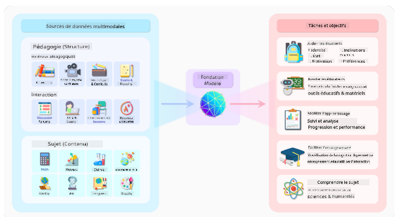
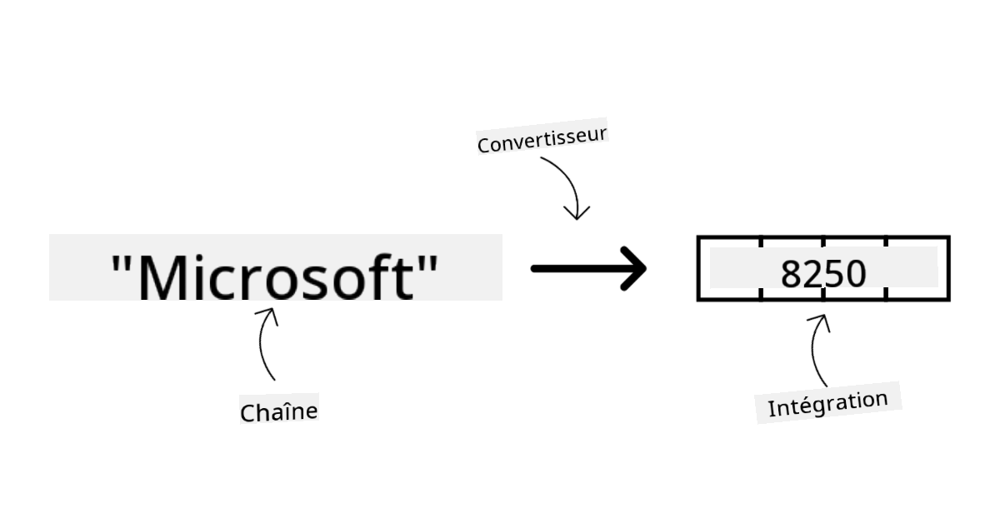
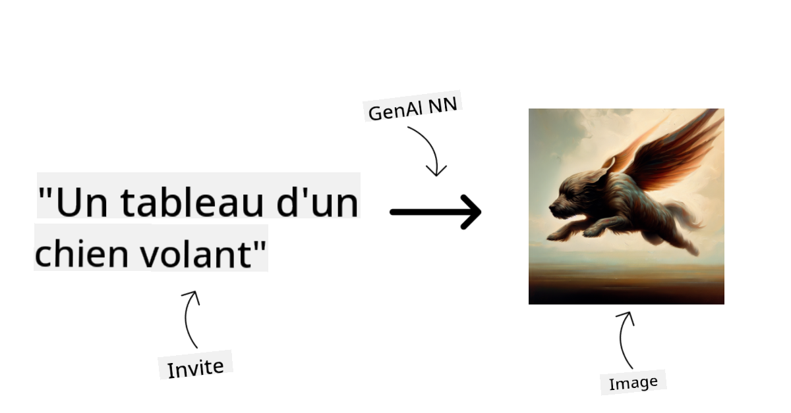
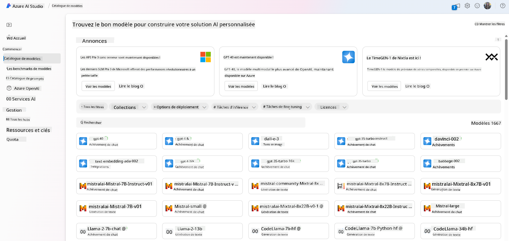
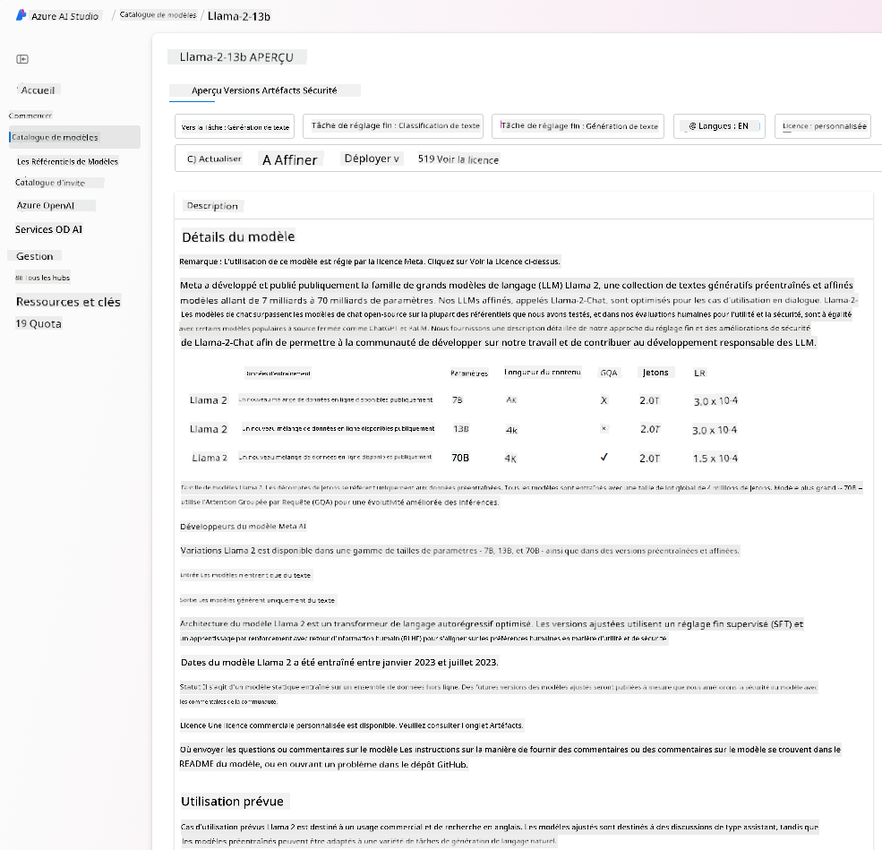
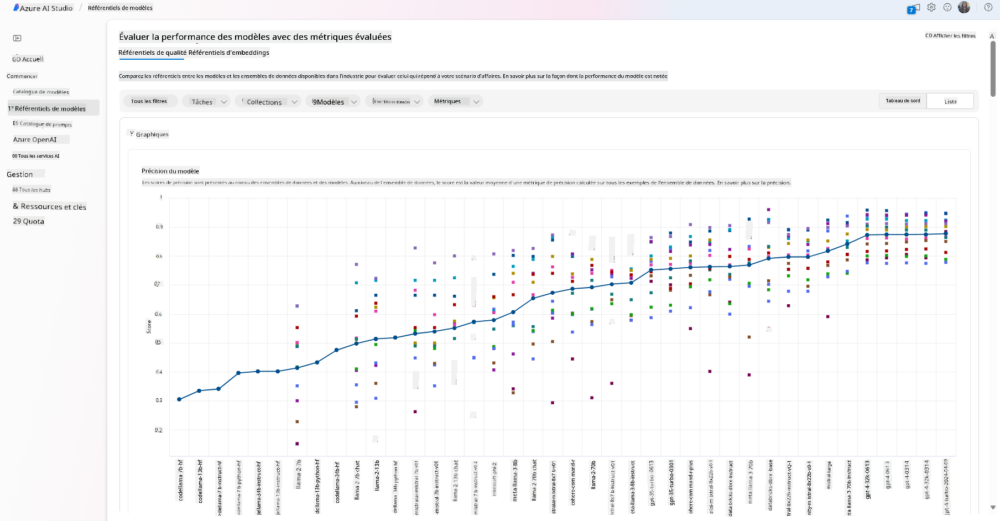
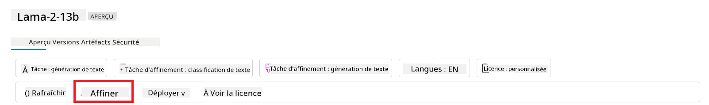
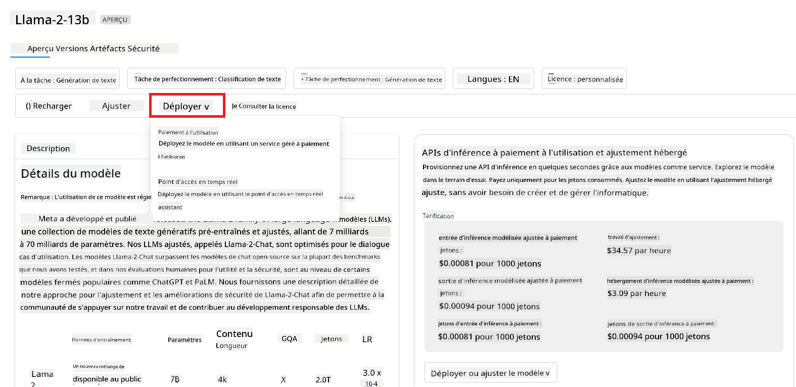
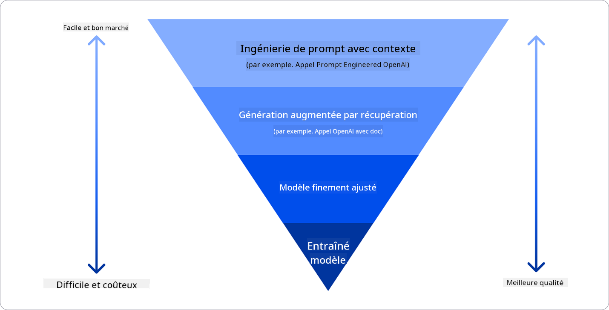

<!--
CO_OP_TRANSLATOR_METADATA:
{
  "original_hash": "e2f686f2eb794941761252ac5e8e090b",
  "translation_date": "2025-05-19T09:15:16+00:00",
  "source_file": "02-exploring-and-comparing-different-llms/README.md",
  "language_code": "fr"
}
-->
# Exploration et comparaison des différents LLM

> _Cliquez sur l'image ci-dessus pour voir la vidéo de cette leçon_

Dans la leçon précédente, nous avons vu comment l'IA générative transforme le paysage technologique, comment les grands modèles de langage (LLM) fonctionnent et comment une entreprise - comme notre startup - peut les appliquer à ses cas d'utilisation et se développer ! Dans ce chapitre, nous cherchons à comparer et contraster différents types de grands modèles de langage (LLM) pour comprendre leurs avantages et inconvénients.

La prochaine étape dans le parcours de notre startup est d'explorer le paysage actuel des LLM et de comprendre lesquels sont adaptés à notre cas d'utilisation.

## Introduction

Cette leçon couvrira :

- Différents types de LLM dans le paysage actuel.
- Tester, itérer et comparer différents modèles pour votre cas d'utilisation sur Azure.
- Comment déployer un LLM.

## Objectifs d'apprentissage

Après avoir terminé cette leçon, vous serez capable de :

- Sélectionner le bon modèle pour votre cas d'utilisation.
- Comprendre comment tester, itérer et améliorer la performance de votre modèle.
- Savoir comment les entreprises déploient des modèles.

## Comprendre les différents types de LLM

Les LLM peuvent avoir plusieurs catégorisations basées sur leur architecture, leurs données d'entraînement et leur cas d'utilisation. Comprendre ces différences aidera notre startup à sélectionner le bon modèle pour le scénario, et à comprendre comment tester, itérer et améliorer la performance.

Il existe de nombreux types de modèles LLM, votre choix de modèle dépend de ce que vous souhaitez en faire, de vos données, de combien vous êtes prêt à payer et plus encore.

Selon que vous souhaitez utiliser les modèles pour la génération de texte, d'audio, de vidéo, d'image, etc., vous pourriez opter pour un type de modèle différent.

- **Reconnaissance audio et vocale**. Pour cet objectif, les modèles de type Whisper sont un excellent choix car ils sont polyvalents et destinés à la reconnaissance vocale. Ils sont entraînés sur des audios divers et peuvent effectuer une reconnaissance vocale multilingue. Apprenez-en plus sur les [modèles de type Whisper ici](https://platform.openai.com/docs/models/whisper?WT.mc_id=academic-105485-koreyst).

- **Génération d'images**. Pour la génération d'images, DALL-E et Midjourney sont deux choix très connus. DALL-E est proposé par Azure OpenAI. [Lisez-en plus sur DALL-E ici](https://platform.openai.com/docs/models/dall-e?WT.mc_id=academic-105485-koreyst) et également dans le chapitre 9 de ce programme.

- **Génération de texte**. La plupart des modèles sont entraînés sur la génération de texte et vous avez un grand choix allant de GPT-3.5 à GPT-4. Ils ont des coûts différents, GPT-4 étant le plus cher. Cela vaut la peine de consulter le [Azure OpenAI playground](https://oai.azure.com/portal/playground?WT.mc_id=academic-105485-koreyst) pour évaluer quels modèles conviennent le mieux à vos besoins en termes de capacités et de coûts.

- **Multi-modalité**. Si vous cherchez à gérer plusieurs types de données en entrée et sortie, vous pourriez vouloir examiner des modèles comme [gpt-4 turbo avec vision ou gpt-4o](https://learn.microsoft.com/azure/ai-services/openai/concepts/models#gpt-4-and-gpt-4-turbo-models?WT.mc_id=academic-105485-koreyst) - les dernières versions des modèles OpenAI - qui sont capables de combiner le traitement du langage naturel à la compréhension visuelle, permettant des interactions via des interfaces multimodales.

Sélectionner un modèle signifie que vous obtenez certaines capacités de base, ce qui pourrait ne pas être suffisant cependant. Souvent, vous avez des données spécifiques à l'entreprise que vous devez d'une manière ou d'une autre communiquer au LLM. Il existe plusieurs choix sur la façon d'aborder cela, plus à ce sujet dans les sections à venir.

### Modèles de fondation versus LLM

Le terme Modèle de fondation a été [inventé par des chercheurs de Stanford](https://arxiv.org/abs/2108.07258?WT.mc_id=academic-105485-koreyst) et défini comme un modèle d'IA qui suit certains critères, tels que :

- **Ils sont entraînés en utilisant l'apprentissage non supervisé ou l'apprentissage auto-supervisé**, ce qui signifie qu'ils sont entraînés sur des données multimodales non étiquetées, et qu'ils ne nécessitent pas d'annotation ou d'étiquetage humain des données pour leur processus d'entraînement.
- **Ce sont des modèles très grands**, basés sur des réseaux neuronaux très profonds entraînés sur des milliards de paramètres.
- **Ils sont normalement destinés à servir de 'fondation' pour d'autres modèles**, ce qui signifie qu'ils peuvent être utilisés comme point de départ pour d'autres modèles à construire par-dessus, ce qui peut être fait par ajustement fin.

Source de l'image : [Essential Guide to Foundation Models and Large Language Models | par Babar M Bhatti | Medium
](https://thebabar.medium.com/essential-guide-to-foundation-models-and-large-language-models-27dab58f7404)

Pour clarifier davantage cette distinction, prenons ChatGPT comme exemple. Pour construire la première version de ChatGPT, un modèle appelé GPT-3.5 a servi de modèle de fondation. Cela signifie qu'OpenAI a utilisé des données spécifiques au chat pour créer une version ajustée de GPT-3.5 qui était spécialisée pour bien performer dans des scénarios de conversation, tels que les chatbots.

Source de l'image : [2108.07258.pdf (arxiv.org)](https://arxiv.org/pdf/2108.07258.pdf?WT.mc_id=academic-105485-koreyst)

### Modèles open source versus propriétaires

Une autre façon de catégoriser les LLM est de savoir s'ils sont open source ou propriétaires.

Les modèles open source sont des modèles qui sont mis à disposition du public et peuvent être utilisés par n'importe qui. Ils sont souvent mis à disposition par l'entreprise qui les a créés, ou par la communauté de recherche. Ces modèles peuvent être inspectés, modifiés et personnalisés pour les différents cas d'utilisation des LLM. Cependant, ils ne sont pas toujours optimisés pour une utilisation en production, et peuvent ne pas être aussi performants que les modèles propriétaires. De plus, le financement des modèles open source peut être limité, et ils peuvent ne pas être maintenus à long terme ou ne pas être mis à jour avec les dernières recherches. Des exemples de modèles open source populaires incluent [Alpaca](https://crfm.stanford.edu/2023/03/13/alpaca.html?WT.mc_id=academic-105485-koreyst), [Bloom](https://huggingface.co/bigscience/bloom) et [LLaMA](https://llama.meta.com).

Les modèles propriétaires sont des modèles qui sont détenus par une entreprise et ne sont pas mis à disposition du public. Ces modèles sont souvent optimisés pour une utilisation en production. Cependant, ils ne peuvent pas être inspectés, modifiés ou personnalisés pour différents cas d'utilisation. De plus, ils ne sont pas toujours disponibles gratuitement, et peuvent nécessiter un abonnement ou un paiement pour être utilisés. Les utilisateurs n'ont pas non plus de contrôle sur les données utilisées pour entraîner le modèle, ce qui signifie qu'ils doivent faire confiance au propriétaire du modèle pour garantir l'engagement envers la confidentialité des données et l'utilisation responsable de l'IA. Des exemples de modèles propriétaires populaires incluent [modèles OpenAI](https://platform.openai.com/docs/models/overview?WT.mc_id=academic-105485-koreyst), [Google Bard](https://sapling.ai/llm/bard?WT.mc_id=academic-105485-koreyst) ou [Claude 2](https://www.anthropic.com/index/claude-2?WT.mc_id=academic-105485-koreyst).

### Incorporation versus Génération d'images versus Génération de texte et de code

Les LLM peuvent également être catégorisés par le type de sortie qu'ils génèrent.

Les incorporations sont un ensemble de modèles qui peuvent convertir du texte en une forme numérique, appelée incorporation, qui est une représentation numérique du texte d'entrée. Les incorporations facilitent la compréhension par les machines des relations entre les mots ou les phrases et peuvent être consommées comme entrées par d'autres modèles, tels que les modèles de classification ou les modèles de regroupement qui ont de meilleures performances sur les données numériques. Les modèles d'incorporation sont souvent utilisés pour l'apprentissage par transfert, où un modèle est construit pour une tâche de substitution pour laquelle il y a une abondance de données, puis les poids du modèle (incorporations) sont réutilisés pour d'autres tâches en aval. Un exemple de cette catégorie est [incorporations OpenAI](https://platform.openai.com/docs/models/embeddings?WT.mc_id=academic-105485-koreyst).

Les modèles de génération d'images sont des modèles qui génèrent des images. Ces modèles sont souvent utilisés pour l'édition d'images, la synthèse d'images et la traduction d'images. Les modèles de génération d'images sont souvent entraînés sur de grands ensembles de données d'images, tels que [LAION-5B](https://laion.ai/blog/laion-5b/?WT.mc_id=academic-105485-koreyst), et peuvent être utilisés pour générer de nouvelles images ou pour éditer des images existantes avec des techniques de peinture, de super-résolution et de colorisation. Des exemples incluent [DALL-E-3](https://openai.com/dall-e-3?WT.mc_id=academic-105485-koreyst) et [modèles de diffusion stable](https://github.com/Stability-AI/StableDiffusion?WT.mc_id=academic-105485-koreyst).

Les modèles de génération de texte et de code sont des modèles qui génèrent du texte ou du code. Ces modèles sont souvent utilisés pour la synthèse de texte, la traduction et la réponse à des questions. Les modèles de génération de texte sont souvent entraînés sur de grands ensembles de données de texte, tels que [BookCorpus](https://www.cv-foundation.org/openaccess/content_iccv_2015/html/Zhu_Aligning_Books_and_ICCV_2015_paper.html?WT.mc_id=academic-105485-koreyst), et peuvent être utilisés pour générer de nouveaux textes ou pour répondre à des questions. Les modèles de génération de code, comme [CodeParrot](https://huggingface.co/codeparrot?WT.mc_id=academic-105485-koreyst), sont souvent entraînés sur de grands ensembles de données de code, tels que GitHub, et peuvent être utilisés pour générer du nouveau code ou pour corriger des bogues dans le code existant.

### Encodeur-Décodeur versus Décodeur uniquement

Pour parler des différents types d'architectures de LLM, utilisons une analogie.

Imaginez que votre responsable vous a donné une tâche pour rédiger un quiz pour les étudiants. Vous avez deux collègues ; l'un s'occupe de créer le contenu et l'autre s'occupe de le réviser.

Le créateur de contenu est comme un modèle de Décodeur uniquement, il peut regarder le sujet et voir ce que vous avez déjà écrit, puis il peut rédiger un cours basé sur cela. Il est très bon pour écrire du contenu engageant et informatif, mais il n'est pas très bon pour comprendre le sujet et les objectifs d'apprentissage. Quelques exemples de modèles de Décodeur sont les modèles de la famille GPT, tels que GPT-3.

Le réviseur est comme un modèle d'Encodeur uniquement, il regarde le cours écrit et les réponses, remarque la relation entre eux et comprend le contexte, mais il n'est pas bon pour générer du contenu. Un exemple de modèle d'Encodeur uniquement serait BERT.

Imaginez que nous puissions avoir quelqu'un aussi qui pourrait créer et réviser le quiz, c'est un modèle Encodeur-Décodeur. Quelques exemples seraient BART et T5.

### Service versus Modèle

Parlons maintenant de la différence entre un service et un modèle. Un service est un produit proposé par un fournisseur de services cloud, et est souvent une combinaison de modèles, de données et d'autres composants. Un modèle est le composant central d'un service, et est souvent un modèle de fondation, tel qu'un LLM.

Les services sont souvent optimisés pour une utilisation en production et sont souvent plus faciles à utiliser que les modèles, via une interface utilisateur graphique. Cependant, les services ne sont pas toujours disponibles gratuitement, et peuvent nécessiter un abonnement ou un paiement pour être utilisés, en échange de l'utilisation des équipements et des ressources du propriétaire du service, optimisant les dépenses et facilitant la mise à l'échelle. Un exemple de service est [Azure OpenAI Service](https://learn.microsoft.com/azure/ai-services/openai/overview?WT.mc_id=academic-105485-koreyst), qui propose un plan tarifaire à la consommation, ce qui signifie que les utilisateurs sont facturés proportionnellement à leur utilisation du service. De plus, Azure OpenAI Service offre une sécurité de niveau entreprise et un cadre d'IA responsable en plus des capacités des modèles.

Les modèles sont juste le réseau neuronal, avec les paramètres, les poids et autres. Permettant aux entreprises de fonctionner localement, cependant, elles auraient besoin d'acheter des équipements, de construire une structure pour évoluer et d'acheter une licence ou d'utiliser un modèle open source. Un modèle comme LLaMA est disponible pour être utilisé, nécessitant une puissance de calcul pour exécuter le modèle.

## Comment tester et itérer avec différents modèles pour comprendre la performance sur Azure

Une fois que notre équipe a exploré le paysage actuel des LLM et identifié quelques bons candidats pour leurs scénarios, la prochaine étape est de les tester sur leurs données et sur leur charge de travail. C'est un processus itératif, réalisé par des expériences et des mesures. La plupart des modèles que nous avons mentionnés dans les paragraphes précédents (modèles OpenAI, modèles open source comme Llama2, et transformateurs Hugging Face) sont disponibles dans le [Catalogue de modèles](https://learn.microsoft.com/azure/ai-studio/how-to/model-catalog-overview?WT.mc_id=academic-105485-koreyst) dans [Azure AI Studio](https://ai.azure.com/?WT.mc_id=academic-105485-koreyst).

[Azure AI Studio](https://learn.microsoft.com/azure/ai-studio/what-is-ai-studio?WT.mc_id=academic-105485-koreyst) est une plateforme cloud conçue pour les développeurs afin de créer des applications d'IA générative et de gérer l'ensemble du cycle de développement - de l'expérimentation à l'évaluation - en combinant tous les services Azure AI en un seul hub avec une interface utilisateur pratique. Le Catalogue de modèles dans Azure AI Studio permet à l'utilisateur de :

- Trouver le modèle de fondation d'intérêt dans le catalogue - soit propriétaire soit open source, en filtrant par tâche, licence ou nom. Pour améliorer la recherche, les modèles sont organisés en collections, comme la collection Azure OpenAI, la collection Hugging Face, et plus encore.

- Examiner la carte du modèle, y compris une description détaillée de l'utilisation prévue et des données d'entraînement, des exemples de code et des résultats d'évaluation sur la bibliothèque d'évaluations internes.

- Comparez les benchmarks entre les modèles et les ensembles de données disponibles dans l'industrie pour évaluer lequel répond au scénario commercial, via le volet [Model Benchmarks](https://learn.microsoft.com/azure/ai-studio/how-to/model-benchmarks?WT.mc_id=academic-105485-koreyst).

- Affinez le modèle sur des données d'entraînement personnalisées pour améliorer les performances du modèle dans une charge de travail spécifique, en tirant parti des capacités d'expérimentation et de suivi d'Azure AI Studio.

- Déployez le modèle pré-entraîné original ou la version affinée pour une inférence en temps réel à distance - calcul géré - ou un point de terminaison API sans serveur - [paiement à l'utilisation](https://learn.microsoft.com/azure/ai-studio/how-to/model-catalog-overview#model-deployment-managed-compute-and-serverless-api-pay-as-you-go?WT.mc_id=academic-105485-koreyst) - pour permettre aux applications de l'utiliser.

> [!NOTE]
> Tous les modèles du catalogue ne sont pas actuellement disponibles pour l'affinage et/ou le déploiement à l'utilisation. Consultez la fiche du modèle pour les détails sur les capacités et les limitations du modèle.

## Amélioration des résultats des LLM

Nous avons exploré avec notre équipe de start-up différents types de LLM et une plateforme Cloud (Azure Machine Learning) nous permettant de comparer différents modèles, les évaluer sur des données de test, améliorer les performances et les déployer sur des points de terminaison d'inférence.

Mais quand devraient-ils envisager d'affiner un modèle plutôt que d'utiliser un modèle pré-entraîné ? Y a-t-il d'autres approches pour améliorer les performances du modèle sur des charges de travail spécifiques ?

Il existe plusieurs approches qu'une entreprise peut utiliser pour obtenir les résultats souhaités d'un LLM. Vous pouvez sélectionner différents types de modèles avec divers degrés de formation lors du déploiement d'un LLM en production, avec différents niveaux de complexité, de coût et de qualité. Voici quelques approches différentes :

- **Ingénierie des prompts avec contexte**. L'idée est de fournir suffisamment de contexte lorsque vous donnez un prompt pour vous assurer d'obtenir les réponses dont vous avez besoin.

- **Génération augmentée par la récupération, RAG**. Vos données pourraient exister dans une base de données ou un point de terminaison web par exemple, pour garantir que ces données, ou un sous-ensemble d'entre elles, soient incluses au moment du prompt, vous pouvez récupérer les données pertinentes et en faire partie du prompt de l'utilisateur.

- **Modèle affiné**. Ici, vous avez entraîné le modèle davantage sur vos propres données, ce qui a conduit à ce que le modèle soit plus précis et réactif à vos besoins, mais cela pourrait être coûteux.

Source de l'image : [Four Ways that Enterprises Deploy LLMs | Fiddler AI Blog](https://www.fiddler.ai/blog/four-ways-that-enterprises-deploy-llms?WT.mc_id=academic-105485-koreyst)

### Ingénierie des prompts avec contexte

Les LLM pré-entraînés fonctionnent très bien sur les tâches de langage naturel généralisées, même en les appelant avec un court prompt, comme une phrase à compléter ou une question - ce qu'on appelle l'apprentissage "zero-shot".

Cependant, plus l'utilisateur peut encadrer sa requête, avec une demande détaillée et des exemples - le Contexte - plus la réponse sera précise et proche des attentes de l'utilisateur. Dans ce cas, on parle d'apprentissage "one-shot" si le prompt inclut seulement un exemple et d'apprentissage "few-shot" s'il inclut plusieurs exemples. L'ingénierie des prompts avec contexte est l'approche la plus rentable pour commencer.

### Génération augmentée par la récupération (RAG)

Les LLM ont la limitation qu'ils ne peuvent utiliser que les données qui ont été utilisées pendant leur entraînement pour générer une réponse. Cela signifie qu'ils ne connaissent rien des faits survenus après leur processus d'entraînement, et ils ne peuvent pas accéder à des informations non publiques (comme les données d'entreprise).
Cela peut être surmonté grâce à RAG, une technique qui augmente le prompt avec des données externes sous forme de morceaux de documents, en considérant les limites de longueur de prompt. Cela est soutenu par des outils de base de données vectorielle (comme [Azure Vector Search](https://learn.microsoft.com/azure/search/vector-search-overview?WT.mc_id=academic-105485-koreyst)) qui récupèrent les morceaux utiles à partir de diverses sources de données prédéfinies et les ajoutent au Contexte du prompt.

Cette technique est très utile lorsqu'une entreprise n'a pas suffisamment de données, de temps ou de ressources pour affiner un LLM, mais souhaite tout de même améliorer les performances sur une charge de travail spécifique et réduire les risques de fabrications, c'est-à-dire de mystification de la réalité ou de contenu nuisible.

### Modèle affiné

L'affinage est un processus qui exploite l'apprentissage par transfert pour "adapter" le modèle à une tâche en aval ou pour résoudre un problème spécifique. Différemment de l'apprentissage few-shot et de RAG, il en résulte un nouveau modèle généré, avec des poids et des biais mis à jour. Il nécessite un ensemble d'exemples d'entraînement consistant en une seule entrée (le prompt) et sa sortie associée (la complétion).
Ce serait l'approche préférée si :

- **Utilisation de modèles affinés**. Une entreprise souhaite utiliser des modèles moins performants affinés (comme des modèles d'intégration) plutôt que des modèles haute performance, résultant en une solution plus rentable et rapide.

- **Considération de la latence**. La latence est importante pour un cas d'utilisation spécifique, donc il n'est pas possible d'utiliser des prompts très longs ou le nombre d'exemples que le modèle devrait apprendre ne correspond pas à la limite de longueur du prompt.

- **Rester à jour**. Une entreprise dispose de nombreuses données de haute qualité et de labels de vérité terrain et des ressources nécessaires pour maintenir ces données à jour au fil du temps.

### Modèle entraîné

Entraîner un LLM à partir de zéro est sans aucun doute l'approche la plus difficile et la plus complexe à adopter, nécessitant des quantités massives de données, des ressources qualifiées et une puissance de calcul appropriée. Cette option ne devrait être envisagée que dans un scénario où une entreprise a un cas d'utilisation spécifique à un domaine et une grande quantité de données centrées sur le domaine.

## Vérification des connaissances

Quelle pourrait être une bonne approche pour améliorer les résultats de complétion des LLM ?

1. Ingénierie des prompts avec contexte
1. RAG
1. Modèle affiné

R:3, si vous avez le temps et les ressources et des données de haute qualité, l'affinage est la meilleure option pour rester à jour. Cependant, si vous cherchez à améliorer les choses et que vous manquez de temps, il vaut la peine de considérer RAG en premier.

## 🚀 Défi

Informez-vous davantage sur comment vous pouvez [utiliser RAG](https://learn.microsoft.com/azure/search/retrieval-augmented-generation-overview?WT.mc_id=academic-105485-koreyst) pour votre entreprise.

## Excellent travail, poursuivez votre apprentissage

Après avoir terminé cette leçon, consultez notre [collection d'apprentissage de l'IA générative](https://aka.ms/genai-collection?WT.mc_id=academic-105485-koreyst) pour continuer à améliorer vos connaissances en IA générative !

Rendez-vous à la leçon 3 où nous examinerons comment [construire avec l'IA générative de manière responsable](../03-using-generative-ai-responsibly/README.md?WT.mc_id=academic-105485-koreyst) !

**Avertissement** :  
Ce document a été traduit à l'aide du service de traduction IA [Co-op Translator](https://github.com/Azure/co-op-translator). Bien que nous nous efforcions d'assurer l'exactitude, veuillez noter que les traductions automatiques peuvent contenir des erreurs ou des inexactitudes. Le document original dans sa langue d'origine doit être considéré comme la source faisant autorité. Pour des informations critiques, il est recommandé de faire appel à une traduction humaine professionnelle. Nous ne sommes pas responsables des malentendus ou des interprétations erronées résultant de l'utilisation de cette traduction.