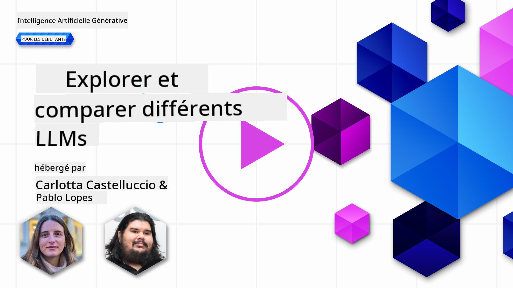
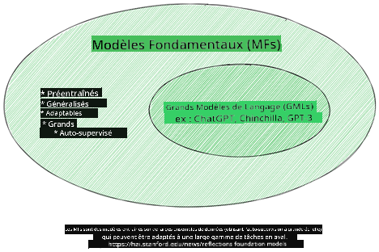
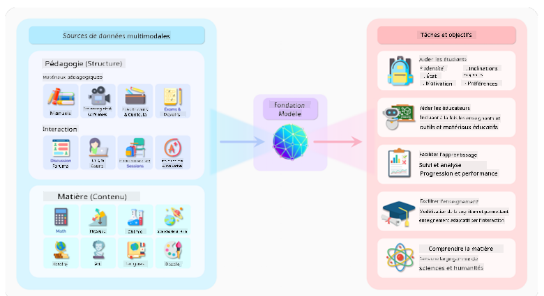
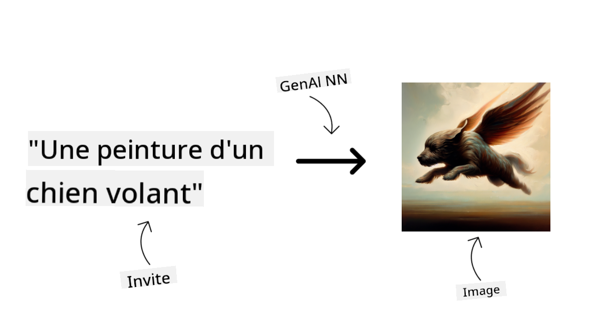
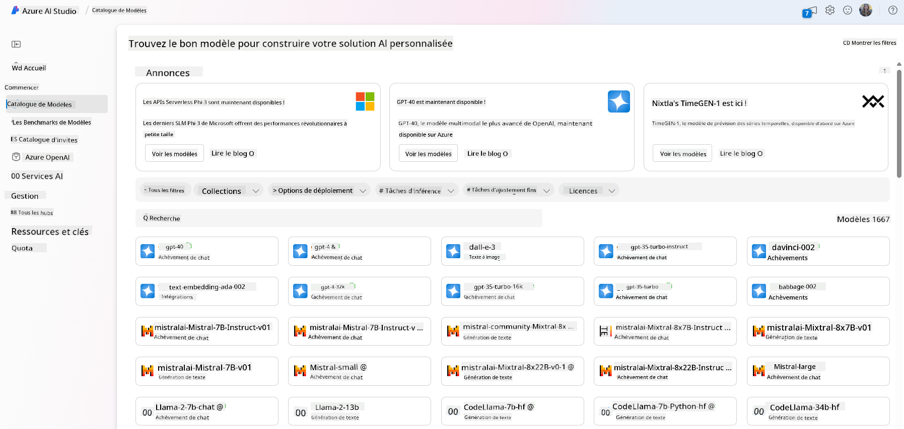
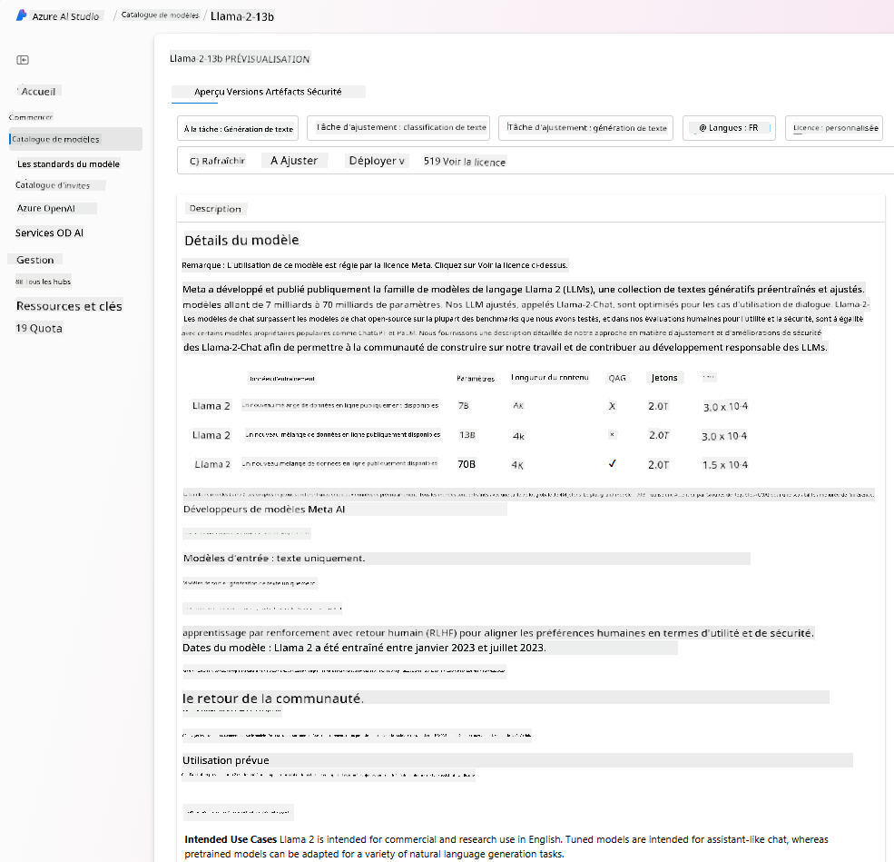
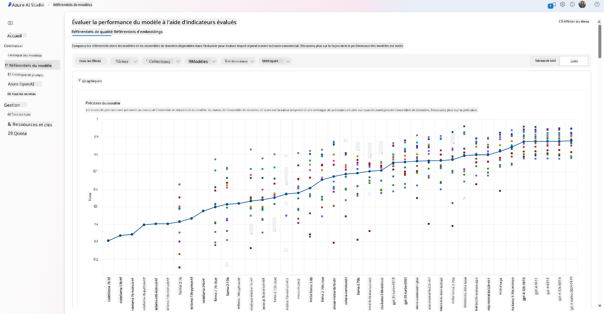
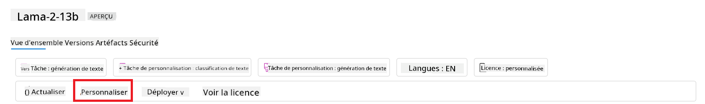
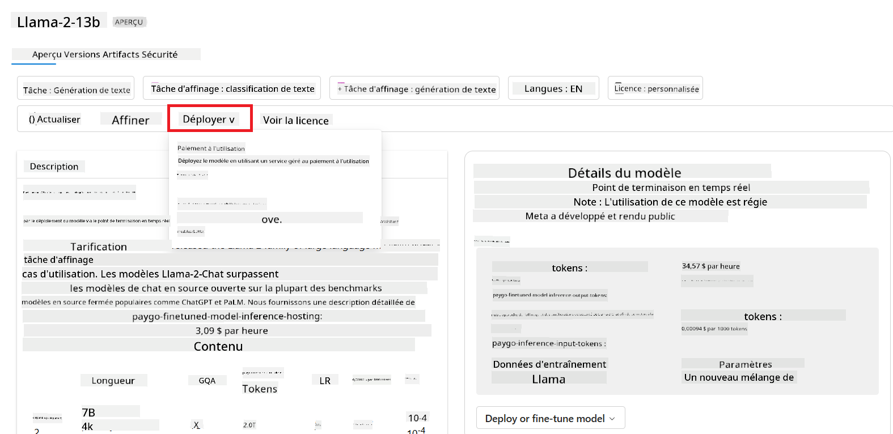

<!--
CO_OP_TRANSLATOR_METADATA:
{
  "original_hash": "e2f686f2eb794941761252ac5e8e090b",
  "translation_date": "2025-07-09T08:07:24+00:00",
  "source_file": "02-exploring-and-comparing-different-llms/README.md",
  "language_code": "fr"
}
-->
# Explorer et comparer différents LLMs

> _Cliquez sur l’image ci-dessus pour voir la vidéo de cette leçon_

Avec la leçon précédente, nous avons vu comment l’IA générative transforme le paysage technologique, comment fonctionnent les Large Language Models (LLMs) et comment une entreprise – comme notre startup – peut les appliquer à ses cas d’usage pour se développer ! Dans ce chapitre, nous allons comparer différents types de grands modèles de langage (LLMs) afin de comprendre leurs avantages et inconvénients.

La prochaine étape dans le parcours de notre startup est d’explorer le paysage actuel des LLMs et de comprendre lesquels conviennent à notre cas d’usage.

## Introduction

Cette leçon couvrira :

- Les différents types de LLMs dans le paysage actuel.
- Tester, itérer et comparer différents modèles pour votre cas d’usage dans Azure.
- Comment déployer un LLM.

## Objectifs d’apprentissage

Après avoir terminé cette leçon, vous serez capable de :

- Choisir le modèle adapté à votre cas d’usage.
- Comprendre comment tester, itérer et améliorer les performances de votre modèle.
- Savoir comment les entreprises déploient des modèles.

## Comprendre les différents types de LLMs

Les LLMs peuvent être classés selon leur architecture, leurs données d’entraînement et leur cas d’usage. Comprendre ces différences aidera notre startup à sélectionner le modèle adapté au scénario, et à savoir comment tester, itérer et améliorer les performances.

Il existe de nombreux types de modèles LLM, votre choix dépendra de l’usage que vous souhaitez en faire, de vos données, de votre budget, et plus encore.

Selon que vous souhaitez utiliser les modèles pour du texte, de l’audio, de la vidéo, de la génération d’images, etc., vous choisirez un type de modèle différent.

- **Reconnaissance audio et vocale**. Pour cela, les modèles de type Whisper sont un excellent choix car ils sont polyvalents et conçus pour la reconnaissance vocale. Ils sont entraînés sur des données audio variées et peuvent effectuer une reconnaissance vocale multilingue. En savoir plus sur les [modèles de type Whisper ici](https://platform.openai.com/docs/models/whisper?WT.mc_id=academic-105485-koreyst).

- **Génération d’images**. Pour la génération d’images, DALL-E et Midjourney sont deux choix très connus. DALL-E est proposé par Azure OpenAI. [En savoir plus sur DALL-E ici](https://platform.openai.com/docs/models/dall-e?WT.mc_id=academic-105485-koreyst) ainsi que dans le chapitre 9 de ce programme.

- **Génération de texte**. La plupart des modèles sont entraînés pour la génération de texte et vous avez un large choix, de GPT-3.5 à GPT-4. Ils ont des coûts différents, GPT-4 étant le plus cher. Il est intéressant d’explorer le [playground Azure OpenAI](https://oai.azure.com/portal/playground?WT.mc_id=academic-105485-koreyst) pour évaluer quels modèles correspondent le mieux à vos besoins en termes de capacités et de coût.

- **Multi-modalité**. Si vous souhaitez traiter plusieurs types de données en entrée et sortie, vous pouvez vous tourner vers des modèles comme [gpt-4 turbo avec vision ou gpt-4o](https://learn.microsoft.com/azure/ai-services/openai/concepts/models#gpt-4-and-gpt-4-turbo-models?WT.mc_id=academic-105485-koreyst) – les dernières versions des modèles OpenAI – capables de combiner traitement du langage naturel et compréhension visuelle, permettant des interactions via des interfaces multi-modales.

Choisir un modèle vous donne des capacités de base, qui peuvent ne pas suffire. Souvent, vous avez des données spécifiques à votre entreprise que vous devez d’une manière ou d’une autre transmettre au LLM. Il existe plusieurs approches pour cela, que nous verrons dans les sections suivantes.

### Foundation Models versus LLMs

Le terme Foundation Model a été [inventé par des chercheurs de Stanford](https://arxiv.org/abs/2108.07258?WT.mc_id=academic-105485-koreyst) et désigne un modèle d’IA répondant à certains critères, tels que :

- **Ils sont entraînés en apprentissage non supervisé ou auto-supervisé**, c’est-à-dire sur des données multi-modales non étiquetées, sans nécessiter d’annotation humaine pour l’entraînement.
- **Ce sont des modèles très volumineux**, basés sur des réseaux neuronaux profonds entraînés sur des milliards de paramètres.
- **Ils sont généralement destinés à servir de ‘fondation’ pour d’autres modèles**, pouvant être utilisés comme point de départ pour construire d’autres modèles via du fine-tuning.

Source de l’image : [Essential Guide to Foundation Models and Large Language Models | par Babar M Bhatti | Medium](https://thebabar.medium.com/essential-guide-to-foundation-models-and-large-language-models-27dab58f7404)

Pour clarifier cette distinction, prenons ChatGPT en exemple. Pour construire la première version de ChatGPT, un modèle appelé GPT-3.5 a servi de foundation model. Cela signifie qu’OpenAI a utilisé des données spécifiques au chat pour créer une version ajustée de GPT-3.5, spécialisée pour bien fonctionner dans des scénarios conversationnels, comme les chatbots.

Source de l’image : [2108.07258.pdf (arxiv.org)](https://arxiv.org/pdf/2108.07258.pdf?WT.mc_id=academic-105485-koreyst)

### Modèles Open Source versus propriétaires

Une autre façon de classer les LLMs est de savoir s’ils sont open source ou propriétaires.

Les modèles open source sont accessibles au public et peuvent être utilisés par tous. Ils sont souvent publiés par l’entreprise qui les a créés ou par la communauté de recherche. Ces modèles peuvent être inspectés, modifiés et personnalisés pour différents cas d’usage. Cependant, ils ne sont pas toujours optimisés pour la production et peuvent être moins performants que les modèles propriétaires. De plus, le financement des modèles open source peut être limité, ils ne sont pas toujours maintenus sur le long terme ni mis à jour avec les dernières avancées. Parmi les modèles open source populaires, on trouve [Alpaca](https://crfm.stanford.edu/2023/03/13/alpaca.html?WT.mc_id=academic-105485-koreyst), [Bloom](https://huggingface.co/bigscience/bloom) et [LLaMA](https://llama.meta.com).

Les modèles propriétaires appartiennent à une entreprise et ne sont pas accessibles au public. Ils sont souvent optimisés pour la production. Cependant, ils ne peuvent pas être inspectés, modifiés ou personnalisés pour différents cas d’usage. Ils ne sont pas toujours gratuits et peuvent nécessiter un abonnement ou un paiement. De plus, les utilisateurs n’ont pas le contrôle sur les données utilisées pour entraîner le modèle, ils doivent donc faire confiance au propriétaire du modèle pour garantir la confidentialité des données et une utilisation responsable de l’IA. Parmi les modèles propriétaires populaires, on trouve les [modèles OpenAI](https://platform.openai.com/docs/models/overview?WT.mc_id=academic-105485-koreyst), [Google Bard](https://sapling.ai/llm/bard?WT.mc_id=academic-105485-koreyst) ou [Claude 2](https://www.anthropic.com/index/claude-2?WT.mc_id=academic-105485-koreyst).

### Embedding versus génération d’images versus génération de texte et code

Les LLMs peuvent aussi être classés selon le type de sortie qu’ils génèrent.

Les embeddings sont des modèles qui convertissent du texte en une forme numérique, appelée embedding, une représentation numérique du texte d’entrée. Les embeddings facilitent la compréhension des relations entre mots ou phrases par les machines et peuvent être utilisés comme entrées par d’autres modèles, comme des modèles de classification ou de clustering, qui fonctionnent mieux avec des données numériques. Les modèles d’embedding sont souvent utilisés pour le transfert d’apprentissage, où un modèle est construit pour une tâche de substitution avec beaucoup de données, puis les poids du modèle (embeddings) sont réutilisés pour d’autres tâches en aval. Un exemple dans cette catégorie est [OpenAI embeddings](https://platform.openai.com/docs/models/embeddings?WT.mc_id=academic-105485-koreyst).

Les modèles de génération d’images créent des images. Ils sont souvent utilisés pour l’édition, la synthèse et la traduction d’images. Ces modèles sont entraînés sur de grands ensembles d’images, comme [LAION-5B](https://laion.ai/blog/laion-5b/?WT.mc_id=academic-105485-koreyst), et peuvent générer de nouvelles images ou modifier des images existantes avec des techniques d’inpainting, de super-résolution et de colorisation. Exemples : [DALL-E-3](https://openai.com/dall-e-3?WT.mc_id=academic-105485-koreyst) et [Stable Diffusion](https://github.com/Stability-AI/StableDiffusion?WT.mc_id=academic-105485-koreyst).

Les modèles de génération de texte et de code produisent du texte ou du code. Ils sont souvent utilisés pour la synthèse de texte, la traduction et la réponse à des questions. Ces modèles sont entraînés sur de grands ensembles de textes, comme [BookCorpus](https://www.cv-foundation.org/openaccess/content_iccv_2015/html/Zhu_Aligning_Books_and_ICCV_2015_paper.html?WT.mc_id=academic-105485-koreyst), et peuvent générer du texte nouveau ou répondre à des questions. Les modèles de génération de code, comme [CodeParrot](https://huggingface.co/codeparrot?WT.mc_id=academic-105485-koreyst), sont entraînés sur de grands ensembles de code, comme GitHub, et peuvent générer du code ou corriger des bugs.

### Encoder-Decoder versus Decoder-only

Pour parler des différentes architectures des LLMs, utilisons une analogie.

Imaginez que votre manager vous demande de créer un quiz pour les étudiants. Vous avez deux collègues : l’un s’occupe de créer le contenu, l’autre de le relire.

Le créateur de contenu est comme un modèle Decoder-only, il peut regarder le sujet et ce que vous avez déjà écrit, puis rédiger un cours à partir de cela. Il est très bon pour écrire un contenu engageant et informatif, mais il comprend moins bien le sujet et les objectifs pédagogiques. Quelques exemples de modèles Decoder sont les modèles de la famille GPT, comme GPT-3.

Le relecteur est comme un modèle Encoder-only, il examine le cours écrit et les réponses, remarque les relations entre eux et comprend le contexte, mais il n’est pas bon pour générer du contenu. Un exemple de modèle Encoder-only est BERT.

Imaginez maintenant que nous ayons quelqu’un qui puisse à la fois créer et relire le quiz, c’est un modèle Encoder-Decoder. Quelques exemples sont BART et T5.

### Service versus Modèle

Parlons maintenant de la différence entre un service et un modèle. Un service est un produit proposé par un fournisseur de services cloud, souvent une combinaison de modèles, de données et d’autres composants. Un modèle est le composant central d’un service, souvent un foundation model, comme un LLM.

Les services sont souvent optimisés pour la production et plus faciles à utiliser que les modèles, via une interface graphique. Cependant, ils ne sont pas toujours gratuits et peuvent nécessiter un abonnement ou un paiement, en échange de l’utilisation des équipements et ressources du fournisseur, optimisant les coûts et facilitant la montée en charge. Un exemple de service est [Azure OpenAI Service](https://learn.microsoft.com/azure/ai-services/openai/overview?WT.mc_id=academic-105485-koreyst), qui propose un tarif à l’usage, facturant les utilisateurs proportionnellement à leur consommation. De plus, Azure OpenAI Service offre une sécurité de niveau entreprise et un cadre d’IA responsable en complément des capacités des modèles.

Les modèles sont simplement les réseaux neuronaux, avec leurs paramètres, poids, etc. Ils permettent aux entreprises de fonctionner localement, mais nécessitent d’acheter du matériel, de construire une infrastructure pour monter en charge et d’acheter une licence ou d’utiliser un modèle open source. Un modèle comme LLaMA est disponible à l’utilisation, mais demande une puissance de calcul importante.

## Comment tester et itérer avec différents modèles pour comprendre leurs performances sur Azure

Une fois que notre équipe a exploré le paysage actuel des LLMs et identifié quelques bons candidats pour leurs scénarios, l’étape suivante est de les tester sur leurs données et leur charge de travail. C’est un processus itératif, réalisé par des expériences et des mesures.
La plupart des modèles que nous avons mentionnés dans les paragraphes précédents (modèles OpenAI, modèles open source comme Llama2, et transformers Hugging Face) sont disponibles dans le [Model Catalog](https://learn.microsoft.com/azure/ai-studio/how-to/model-catalog-overview?WT.mc_id=academic-105485-koreyst) de [Azure AI Studio](https://ai.azure.com/?WT.mc_id=academic-105485-koreyst).

[Azure AI Studio](https://learn.microsoft.com/azure/ai-studio/what-is-ai-studio?WT.mc_id=academic-105485-koreyst) est une plateforme Cloud conçue pour les développeurs afin de créer des applications d’IA générative et gérer l’ensemble du cycle de vie du développement – de l’expérimentation à l’évaluation – en combinant tous les services Azure AI dans un hub unique avec une interface graphique pratique. Le Model Catalog dans Azure AI Studio permet à l’utilisateur de :

- Trouver le Foundation Model qui l’intéresse dans le catalogue – qu’il soit propriétaire ou open source, en filtrant par tâche, licence ou nom. Pour faciliter la recherche, les modèles sont organisés en collections, comme la collection Azure OpenAI, la collection Hugging Face, et d’autres.

- Consulter la fiche du modèle, incluant une description détaillée de l’usage prévu et des données d’entraînement, des exemples de code et les résultats d’évaluation issus de la bibliothèque interne d’évaluations.

- Comparer les benchmarks entre modèles et jeux de données disponibles dans l’industrie pour déterminer celui qui correspond le mieux au scénario métier, via le panneau [Model Benchmarks](https://learn.microsoft.com/azure/ai-studio/how-to/model-benchmarks?WT.mc_id=academic-105485-koreyst).

- Affiner le modèle sur des données d’entraînement personnalisées pour améliorer ses performances sur une charge de travail spécifique, en tirant parti des capacités d’expérimentation et de suivi d’Azure AI Studio.

- Déployer le modèle pré-entraîné original ou la version fine-tunée sur un endpoint d’inférence en temps réel distant – compute managé – ou un endpoint API serverless – [pay-as-you-go](https://learn.microsoft.com/azure/ai-studio/how-to/model-catalog-overview#model-deployment-managed-compute-and-serverless-api-pay-as-you-go?WT.mc_id=academic-105485-koreyst) – pour permettre aux applications de l’utiliser.

> [!NOTE]
> Tous les modèles du catalogue ne sont pas encore disponibles pour le fine-tuning et/ou le déploiement pay-as-you-go. Consultez la fiche du modèle pour connaître ses capacités et ses limites.

## Améliorer les résultats des LLM

Nous avons exploré avec notre équipe startup différents types de LLM ainsi qu’une plateforme Cloud (Azure Machine Learning) qui nous permet de comparer différents modèles, de les évaluer sur des données de test, d’améliorer leurs performances et de les déployer sur des endpoints d’inférence.

Mais quand faut-il envisager de fine-tuner un modèle plutôt que d’utiliser un modèle pré-entraîné ? Existe-t-il d’autres méthodes pour améliorer les performances d’un modèle sur des charges de travail spécifiques ?

Plusieurs approches sont possibles pour une entreprise afin d’obtenir les résultats souhaités avec un LLM. Vous pouvez choisir différents types de modèles avec des degrés d’entraînement variés lors du déploiement d’un LLM en production, avec des niveaux de complexité, de coût et de qualité différents. Voici quelques approches possibles :

- **Prompt engineering avec contexte**. L’idée est de fournir suffisamment de contexte lors de la requête pour s’assurer d’obtenir les réponses attendues.

- **Retrieval Augmented Generation, RAG**. Vos données peuvent exister dans une base de données ou un endpoint web par exemple, pour garantir que ces données, ou un sous-ensemble, soient incluses au moment de la requête, vous pouvez récupérer les données pertinentes et les intégrer dans le prompt de l’utilisateur.

- **Modèle fine-tuné**. Ici, vous entraînez davantage le modèle sur vos propres données, ce qui rend le modèle plus précis et réactif à vos besoins, mais cela peut être coûteux.

Source image : [Four Ways that Enterprises Deploy LLMs | Fiddler AI Blog](https://www.fiddler.ai/blog/four-ways-that-enterprises-deploy-llms?WT.mc_id=academic-105485-koreyst)

### Prompt Engineering avec Contexte

Les LLM pré-entraînés fonctionnent très bien sur des tâches générales en langage naturel, même en les appelant avec un prompt court, comme une phrase à compléter ou une question – ce qu’on appelle l’apprentissage “zero-shot”.

Cependant, plus l’utilisateur peut cadrer sa requête avec une demande détaillée et des exemples – le Contexte – plus la réponse sera précise et proche des attentes. On parle alors d’apprentissage “one-shot” si le prompt contient un seul exemple, et “few-shot” s’il en contient plusieurs. Le prompt engineering avec contexte est l’approche la plus économique pour débuter.

### Retrieval Augmented Generation (RAG)

Les LLM ont la limitation de ne pouvoir utiliser que les données sur lesquelles ils ont été entraînés pour générer une réponse. Cela signifie qu’ils ne connaissent rien des faits survenus après leur entraînement, et qu’ils ne peuvent pas accéder à des informations non publiques (comme des données d’entreprise).  
Cette limite peut être contournée grâce à RAG, une technique qui enrichit le prompt avec des données externes sous forme de fragments de documents, en respectant les limites de longueur du prompt. Cela est rendu possible par des outils de bases de données vectorielles (comme [Azure Vector Search](https://learn.microsoft.com/azure/search/vector-search-overview?WT.mc_id=academic-105485-koreyst)) qui récupèrent les fragments utiles à partir de différentes sources de données prédéfinies et les ajoutent au contexte du prompt.

Cette technique est très utile lorsqu’une entreprise ne dispose pas de suffisamment de données, de temps ou de ressources pour fine-tuner un LLM, mais souhaite tout de même améliorer les performances sur une charge de travail spécifique et réduire les risques de fabrications, c’est-à-dire de distorsions de la réalité ou de contenus nuisibles.

### Modèle fine-tuné

Le fine-tuning est un processus qui utilise le transfert d’apprentissage pour ‘adapter’ le modèle à une tâche spécifique ou résoudre un problème particulier. Contrairement à l’apprentissage few-shot et à RAG, il aboutit à la création d’un nouveau modèle avec des poids et biais mis à jour. Il nécessite un ensemble d’exemples d’entraînement composés d’une entrée unique (le prompt) et de sa sortie associée (la complétion).  
Cette approche est recommandée si :

- **Utilisation de modèles fine-tunés**. Une entreprise souhaite utiliser des modèles fine-tunés moins puissants (comme les modèles d’embeddings) plutôt que des modèles très performants, ce qui permet une solution plus économique et rapide.

- **Considération de la latence**. La latence est importante pour un cas d’usage spécifique, donc il n’est pas possible d’utiliser des prompts très longs ou un nombre d’exemples trop élevé qui ne rentre pas dans la limite de longueur du prompt.

- **Maintenir à jour**. Une entreprise dispose de nombreuses données de haute qualité et d’étiquettes fiables, ainsi que des ressources nécessaires pour maintenir ces données à jour dans le temps.

### Modèle entraîné

Entraîner un LLM depuis zéro est sans aucun doute l’approche la plus difficile et la plus complexe à adopter, nécessitant d’énormes quantités de données, des ressources qualifiées et une puissance de calcul adaptée. Cette option ne devrait être envisagée que dans un scénario où une entreprise a un cas d’usage très spécifique au domaine et une grande quantité de données centrées sur ce domaine.

## Vérification des connaissances

Quelle pourrait être une bonne approche pour améliorer les résultats de complétion d’un LLM ?

1. Prompt engineering avec contexte  
1. RAG  
1. Modèle fine-tuné

Réponse : 3, si vous disposez du temps, des ressources et de données de haute qualité, le fine-tuning est la meilleure option pour rester à jour. Cependant, si vous cherchez à améliorer les choses rapidement et que vous manquez de temps, il vaut la peine de considérer d’abord RAG.

## 🚀 Défi

Informez-vous davantage sur la manière dont vous pouvez [utiliser RAG](https://learn.microsoft.com/azure/search/retrieval-augmented-generation-overview?WT.mc_id=academic-105485-koreyst) pour votre entreprise.

## Excellent travail, continuez votre apprentissage

Après avoir terminé cette leçon, consultez notre [collection Generative AI Learning](https://aka.ms/genai-collection?WT.mc_id=academic-105485-koreyst) pour continuer à approfondir vos connaissances en IA générative !

Rendez-vous à la Leçon 3 où nous verrons comment [construire avec l’IA générative de manière responsable](../03-using-generative-ai-responsibly/README.md?WT.mc_id=academic-105485-koreyst) !

**Avertissement** :  
Ce document a été traduit à l’aide du service de traduction automatique [Co-op Translator](https://github.com/Azure/co-op-translator). Bien que nous nous efforcions d’assurer l’exactitude, veuillez noter que les traductions automatiques peuvent contenir des erreurs ou des inexactitudes. Le document original dans sa langue d’origine doit être considéré comme la source faisant foi. Pour les informations critiques, une traduction professionnelle réalisée par un humain est recommandée. Nous déclinons toute responsabilité en cas de malentendus ou de mauvaises interprétations résultant de l’utilisation de cette traduction.