<!--
CO_OP_TRANSLATOR_METADATA:
{
  "original_hash": "e2f686f2eb794941761252ac5e8e090b",
  "translation_date": "2025-06-25T10:12:53+00:00",
  "source_file": "02-exploring-and-comparing-different-llms/README.md",
  "language_code": "fr"
}
-->
# Explorer et comparer différents LLM

> _Cliquez sur l'image ci-dessus pour voir la vidéo de cette leçon_

Dans la leçon précédente, nous avons vu comment l'IA générative transforme le paysage technologique, comment fonctionnent les modèles de langage de grande taille (LLM) et comment une entreprise - comme notre startup - peut les appliquer à ses cas d'utilisation et se développer ! Dans ce chapitre, nous cherchons à comparer et contraster différents types de modèles de langage de grande taille (LLM) pour comprendre leurs avantages et inconvénients.

La prochaine étape du parcours de notre startup est d'explorer le paysage actuel des LLM et de comprendre lesquels sont adaptés à notre cas d'utilisation.

## Introduction

Cette leçon couvrira :

- Différents types de LLM dans le paysage actuel.
- Tester, itérer et comparer différents modèles pour votre cas d'utilisation dans Azure.
- Comment déployer un LLM.

## Objectifs d'apprentissage

Après avoir terminé cette leçon, vous serez capable de :

- Sélectionner le bon modèle pour votre cas d'utilisation.
- Comprendre comment tester, itérer et améliorer les performances de votre modèle.
- Savoir comment les entreprises déploient des modèles.

## Comprendre les différents types de LLM

Les LLM peuvent avoir plusieurs catégorisations basées sur leur architecture, leurs données d'entraînement et leur cas d'utilisation. Comprendre ces différences aidera notre startup à choisir le bon modèle pour le scénario et à comprendre comment tester, itérer et améliorer les performances.

Il existe de nombreux types de modèles LLM, votre choix de modèle dépend de ce que vous souhaitez en faire, de vos données, de combien vous êtes prêt à payer et plus encore.

Selon si vous souhaitez utiliser les modèles pour le texte, l'audio, la vidéo, la génération d'images, etc., vous pourriez opter pour un type de modèle différent.

- **Reconnaissance audio et vocale**. Pour cet objectif, les modèles de type Whisper sont un excellent choix car ils sont polyvalents et destinés à la reconnaissance vocale. Ils sont entraînés sur des audios divers et peuvent effectuer une reconnaissance vocale multilingue. Apprenez-en plus sur les [modèles de type Whisper ici](https://platform.openai.com/docs/models/whisper?WT.mc_id=academic-105485-koreyst).

- **Génération d'images**. Pour la génération d'images, DALL-E et Midjourney sont deux choix très connus. DALL-E est proposé par Azure OpenAI. [Lisez-en plus sur DALL-E ici](https://platform.openai.com/docs/models/dall-e?WT.mc_id=academic-105485-koreyst) et aussi dans le chapitre 9 de ce programme.

- **Génération de texte**. La plupart des modèles sont entraînés sur la génération de texte et vous avez une grande variété de choix, de GPT-3.5 à GPT-4. Ils ont des coûts différents, GPT-4 étant le plus cher. Cela vaut la peine de regarder dans le [Azure OpenAI playground](https://oai.azure.com/portal/playground?WT.mc_id=academic-105485-koreyst) pour évaluer quels modèles conviennent le mieux à vos besoins en termes de capacité et de coût.

- **Multi-modalité**. Si vous souhaitez gérer plusieurs types de données en entrée et en sortie, vous pourriez vouloir vous pencher sur des modèles comme [gpt-4 turbo avec vision ou gpt-4o](https://learn.microsoft.com/azure/ai-services/openai/concepts/models#gpt-4-and-gpt-4-turbo-models?WT.mc_id=academic-105485-koreyst) - les dernières versions des modèles OpenAI - qui sont capables de combiner le traitement du langage naturel avec la compréhension visuelle, permettant des interactions via des interfaces multimodales.

Choisir un modèle signifie obtenir certaines capacités de base, qui pourraient ne pas être suffisantes cependant. Souvent, vous avez des données spécifiques à l'entreprise que vous devez d'une manière ou d'une autre communiquer au LLM. Il existe plusieurs choix sur la façon d'aborder cela, plus à ce sujet dans les sections à venir.

### Modèles de fondation contre LLM

Le terme Modèle de fondation a été [inventé par des chercheurs de Stanford](https://arxiv.org/abs/2108.07258?WT.mc_id=academic-105485-koreyst) et défini comme un modèle d'IA qui suit certains critères, tels que :

- **Ils sont entraînés en utilisant l'apprentissage non supervisé ou l'apprentissage auto-supervisé**, ce qui signifie qu'ils sont entraînés sur des données multimodales non étiquetées, et qu'ils ne nécessitent pas d'annotation ou de labellisation humaine des données pour leur processus d'entraînement.
- **Ce sont des modèles très grands**, basés sur des réseaux neuronaux très profonds entraînés sur des milliards de paramètres.
- **Ils sont normalement destinés à servir de "fondation" pour d'autres modèles**, ce qui signifie qu'ils peuvent être utilisés comme point de départ pour d'autres modèles à construire dessus, ce qui peut être fait par ajustement fin.

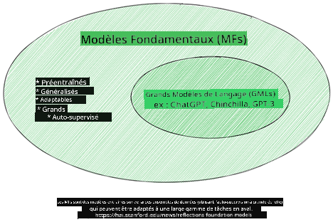

Source de l'image : [Guide essentiel des modèles de fondation et des modèles de langage de grande taille | par Babar M Bhatti | Medium
](https://thebabar.medium.com/essential-guide-to-foundation-models-and-large-language-models-27dab58f7404)

Pour clarifier davantage cette distinction, prenons ChatGPT comme exemple. Pour construire la première version de ChatGPT, un modèle appelé GPT-3.5 a servi de modèle de fondation. Cela signifie qu'OpenAI a utilisé des données spécifiques au chat pour créer une version ajustée de GPT-3.5 spécialisée dans la performance dans des scénarios conversationnels, tels que les chatbots.

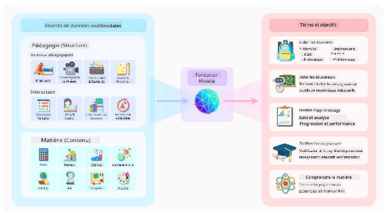

Source de l'image : [2108.07258.pdf (arxiv.org)](https://arxiv.org/pdf/2108.07258.pdf?WT.mc_id=academic-105485-koreyst)

### Modèles open source contre propriétaires

Une autre façon de catégoriser les LLM est de savoir s'ils sont open source ou propriétaires.

Les modèles open source sont des modèles qui sont mis à la disposition du public et peuvent être utilisés par quiconque. Ils sont souvent mis à disposition par l'entreprise qui les a créés ou par la communauté de recherche. Ces modèles peuvent être inspectés, modifiés et personnalisés pour les divers cas d'utilisation des LLM. Cependant, ils ne sont pas toujours optimisés pour une utilisation en production et peuvent ne pas être aussi performants que les modèles propriétaires. De plus, le financement des modèles open source peut être limité et ils peuvent ne pas être maintenus à long terme ou ne pas être mis à jour avec les dernières recherches. Des exemples de modèles open source populaires incluent [Alpaca](https://crfm.stanford.edu/2023/03/13/alpaca.html?WT.mc_id=academic-105485-koreyst), [Bloom](https://huggingface.co/bigscience/bloom) et [LLaMA](https://llama.meta.com).

Les modèles propriétaires sont des modèles qui sont détenus par une entreprise et ne sont pas mis à disposition du public. Ces modèles sont souvent optimisés pour une utilisation en production. Cependant, ils ne sont pas autorisés à être inspectés, modifiés ou personnalisés pour différents cas d'utilisation. De plus, ils ne sont pas toujours disponibles gratuitement et peuvent nécessiter un abonnement ou un paiement pour être utilisés. Les utilisateurs n'ont pas non plus de contrôle sur les données utilisées pour entraîner le modèle, ce qui signifie qu'ils doivent faire confiance au propriétaire du modèle pour garantir l'engagement envers la confidentialité des données et l'utilisation responsable de l'IA. Des exemples de modèles propriétaires populaires incluent [les modèles OpenAI](https://platform.openai.com/docs/models/overview?WT.mc_id=academic-105485-koreyst), [Google Bard](https://sapling.ai/llm/bard?WT.mc_id=academic-105485-koreyst) ou [Claude 2](https://www.anthropic.com/index/claude-2?WT.mc_id=academic-105485-koreyst).

### Embedding contre génération d'images contre génération de texte et de code

Les LLM peuvent également être catégorisés par le type de sortie qu'ils génèrent.

Les embeddings sont un ensemble de modèles capables de convertir du texte en une forme numérique, appelée embedding, qui est une représentation numérique du texte d'entrée. Les embeddings facilitent la compréhension par les machines des relations entre les mots ou les phrases et peuvent être consommés comme entrées par d'autres modèles, tels que les modèles de classification ou de regroupement qui ont de meilleures performances sur les données numériques. Les modèles d'embedding sont souvent utilisés pour l'apprentissage par transfert, où un modèle est construit pour une tâche de substitution pour laquelle il y a une abondance de données, puis les poids du modèle (embeddings) sont réutilisés pour d'autres tâches en aval. Un exemple de cette catégorie est [OpenAI embeddings](https://platform.openai.com/docs/models/embeddings?WT.mc_id=academic-105485-koreyst).

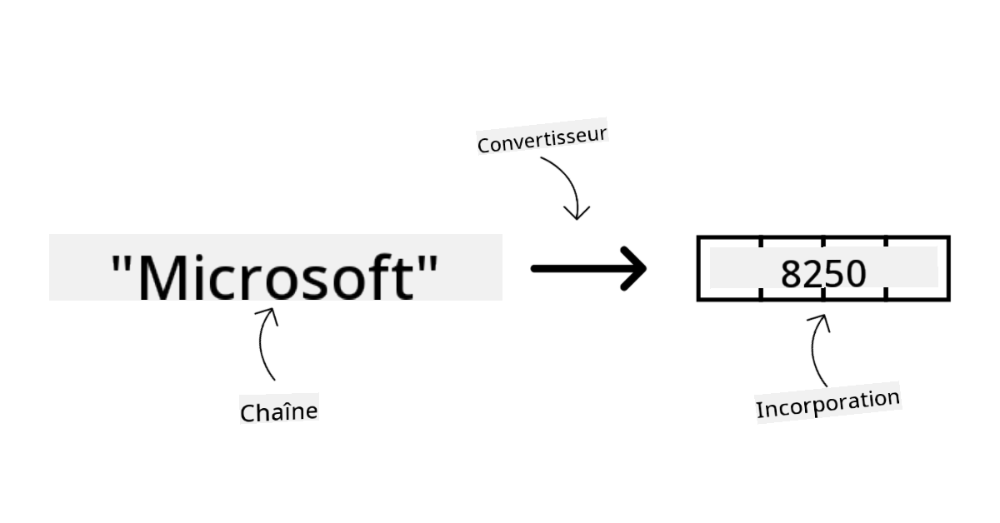

Les modèles de génération d'images sont des modèles qui génèrent des images. Ces modèles sont souvent utilisés pour l'édition d'images, la synthèse d'images et la traduction d'images. Les modèles de génération d'images sont souvent entraînés sur de grands ensembles de données d'images, tels que [LAION-5B](https://laion.ai/blog/laion-5b/?WT.mc_id=academic-105485-koreyst), et peuvent être utilisés pour générer de nouvelles images ou pour éditer des images existantes avec des techniques de peinture, de super-résolution et de colorisation. Les exemples incluent [DALL-E-3](https://openai.com/dall-e-3?WT.mc_id=academic-105485-koreyst) et [les modèles Stable Diffusion](https://github.com/Stability-AI/StableDiffusion?WT.mc_id=academic-105485-koreyst).

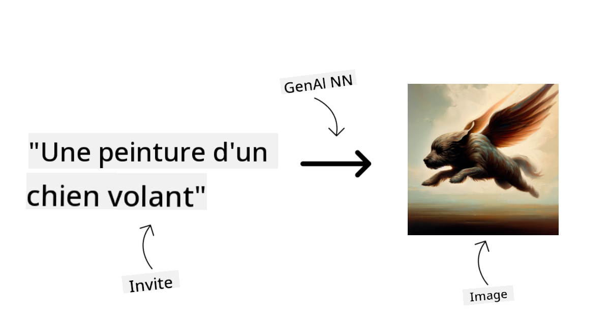

Les modèles de génération de texte et de code sont des modèles qui génèrent du texte ou du code. Ces modèles sont souvent utilisés pour la synthèse de texte, la traduction et la réponse aux questions. Les modèles de génération de texte sont souvent entraînés sur de grands ensembles de données de texte, tels que [BookCorpus](https://www.cv-foundation.org/openaccess/content_iccv_2015/html/Zhu_Aligning_Books_and_ICCV_2015_paper.html?WT.mc_id=academic-105485-koreyst), et peuvent être utilisés pour générer du nouveau texte ou pour répondre à des questions. Les modèles de génération de code, comme [CodeParrot](https://huggingface.co/codeparrot?WT.mc_id=academic-105485-koreyst), sont souvent entraînés sur de grands ensembles de données de code, tels que GitHub, et peuvent être utilisés pour générer du nouveau code ou pour corriger des bogues dans du code existant.

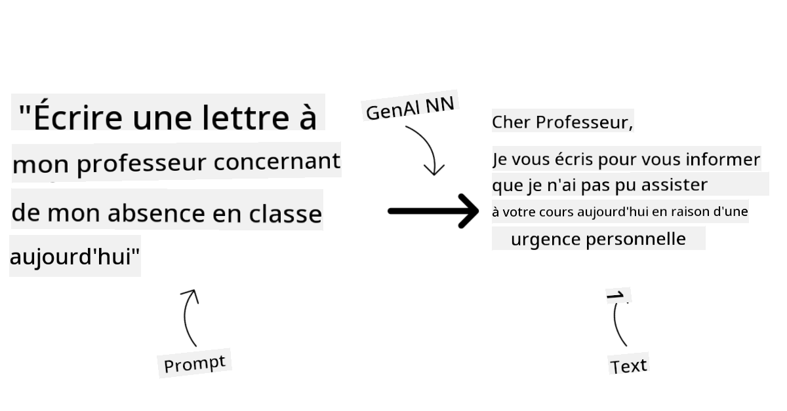

### Encodeur-Décodeur contre Décodeur seul

Pour parler des différents types d'architectures des LLM, utilisons une analogie.

Imaginez que votre responsable vous a donné une tâche pour rédiger un quiz pour les étudiants. Vous avez deux collègues ; l'un supervise la création du contenu et l'autre supervise la révision.

Le créateur de contenu est comme un modèle Décodeur seul, il peut regarder le sujet et voir ce que vous avez déjà écrit, puis il peut écrire un cours basé sur cela. Il est très bon pour écrire du contenu engageant et informatif, mais il n'est pas très bon pour comprendre le sujet et les objectifs d'apprentissage. Quelques exemples de modèles Décodeur sont les modèles de la famille GPT, tels que GPT-3.

Le réviseur est comme un modèle Encodeur seul, il regarde le cours écrit et les réponses, remarquant la relation entre eux et comprenant le contexte, mais il n'est pas bon pour générer du contenu. Un exemple de modèle Encodeur seul serait BERT.

Imaginez que nous puissions avoir quelqu'un qui pourrait créer et réviser le quiz, c'est un modèle Encodeur-Décodeur. Quelques exemples seraient BART et T5.

### Service contre Modèle

Maintenant, parlons de la différence entre un service et un modèle. Un service est un produit offert par un fournisseur de services cloud et est souvent une combinaison de modèles, de données et d'autres composants. Un modèle est le composant central d'un service et est souvent un modèle de fondation, tel qu'un LLM.

Les services sont souvent optimisés pour une utilisation en production et sont souvent plus faciles à utiliser que les modèles, via une interface utilisateur graphique. Cependant, les services ne sont pas toujours disponibles gratuitement et peuvent nécessiter un abonnement ou un paiement pour être utilisés, en échange de l'utilisation des équipements et ressources du propriétaire du service, optimisant les dépenses et permettant une mise à l'échelle facile. Un exemple de service est [Azure OpenAI Service](https://learn.microsoft.com/azure/ai-services/openai/overview?WT.mc_id=academic-105485-koreyst), qui propose un plan tarifaire à la demande, ce qui signifie que les utilisateurs sont facturés proportionnellement à leur utilisation du service. De plus, Azure OpenAI Service offre une sécurité de niveau entreprise et un cadre d'IA responsable en plus des capacités des modèles.

Les modèles sont juste le réseau neuronal, avec les paramètres, les poids, et autres. Permettant aux entreprises de fonctionner localement, cependant, elles auraient besoin d'acheter des équipements, de construire une structure pour évoluer et d'acheter une licence ou d'utiliser un modèle open source. Un modèle comme LLaMA est disponible pour être utilisé, nécessitant une puissance de calcul pour exécuter le modèle.

## Comment tester et itérer avec différents modèles pour comprendre les performances sur Azure

Une fois que notre équipe a exploré le paysage actuel des LLM et identifié quelques bons candidats pour leurs scénarios, la prochaine étape est de les tester sur leurs données et sur leur charge de travail. C'est un processus itératif, réalisé par des expériences et des mesures.
La plupart des modèles que nous avons mentionnés dans les paragraphes précédents (modèles OpenAI, modèles open source comme Llama2 et transformers Hugging Face) sont disponibles dans le [Catalogue de modèles](https://learn.microsoft.com/azure/ai-studio/how-to/model-catalog-overview?WT.mc_id=academic-105485-koreyst) dans [Azure AI Studio](https://ai.azure.com/?WT.mc_id=academic-105485-koreyst).

[Azure AI Studio](https://learn.microsoft.com/azure/ai-studio/what-is-ai-studio?WT.mc_id=academic-105485-koreyst) est une plateforme cloud conçue pour les développeurs afin de construire des applications d'IA générative et de gérer l'ensemble du cycle de développement - de l'expérimentation à l'évaluation - en combinant tous les services Azure AI dans un seul hub avec une interface graphique pratique. Le Catalogue de modèles dans Azure AI Studio permet à l'utilisateur de :

- Trouver le modèle de fondation d'intérêt dans le catalogue - soit propriétaire soit open source, en filtrant par tâche, licence ou nom. Pour améliorer la recherche, les modèles sont organisés en collections, comme la collection Azure OpenAI, la collection Hugging Face, et plus.

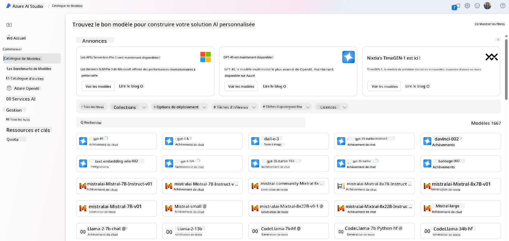

- Examiner la carte du modèle, y compris une description détaillée de l'utilisation prévue et des données d'entraînement, des exemples de code et des résultats d'évaluation sur la bibliothèque d'évaluations internes.

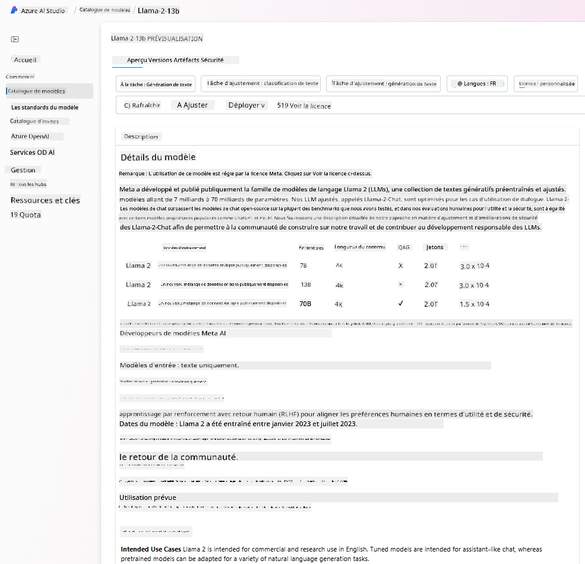
- Comparez les benchmarks entre les modèles et les ensembles de données disponibles dans l'industrie pour évaluer lequel répond au scénario commercial, via le volet [Model Benchmarks](https://learn.microsoft.com/azure/ai-studio/how-to/model-benchmarks?WT.mc_id=academic-105485-koreyst).

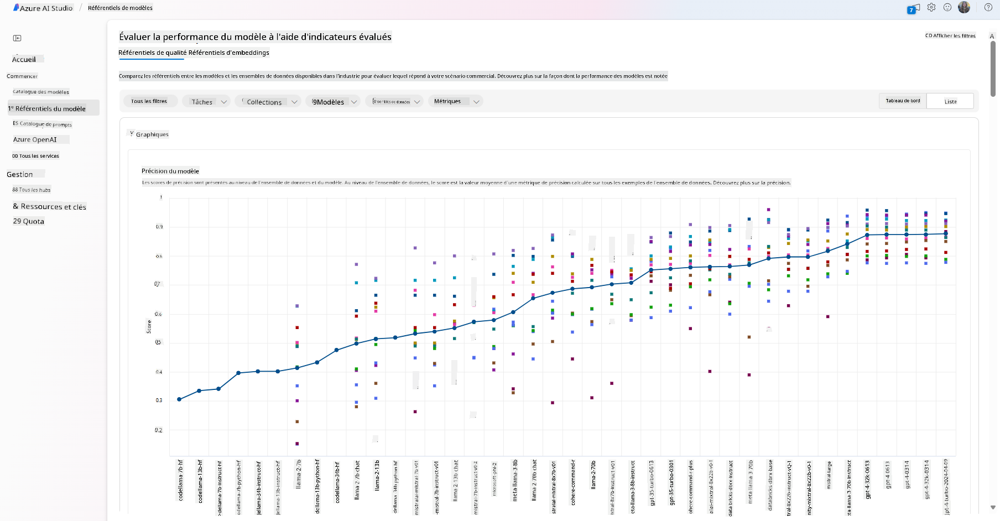

- Affinez le modèle sur des données d'entraînement personnalisées pour améliorer les performances du modèle dans une charge de travail spécifique, en tirant parti des capacités d'expérimentation et de suivi d'Azure AI Studio.

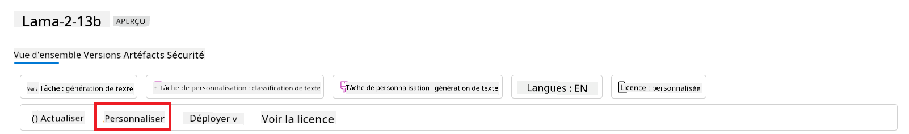

- Déployez le modèle pré-entraîné original ou la version affinée pour une inférence en temps réel à distance - calcul géré - ou un point de terminaison API sans serveur - [paiement à l'utilisation](https://learn.microsoft.com/azure/ai-studio/how-to/model-catalog-overview#model-deployment-managed-compute-and-serverless-api-pay-as-you-go?WT.mc_id=academic-105485-koreyst) - pour permettre aux applications de le consommer.

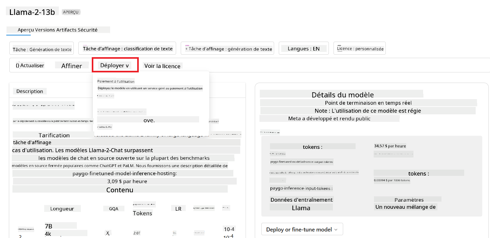

> [!NOTE]
> Tous les modèles du catalogue ne sont pas actuellement disponibles pour l'affinage et/ou le déploiement en paiement à l'utilisation. Consultez la fiche du modèle pour plus de détails sur les capacités et les limitations du modèle.

## Améliorer les résultats des LLM

Nous avons exploré avec notre équipe de startup différents types de LLM et une plateforme Cloud (Azure Machine Learning) nous permettant de comparer différents modèles, les évaluer sur des données de test, améliorer les performances et les déployer sur des points de terminaison d'inférence.

Mais quand doivent-ils envisager d'affiner un modèle plutôt que d'utiliser un modèle pré-entraîné ? Existe-t-il d'autres approches pour améliorer les performances du modèle sur des charges de travail spécifiques ?

Il existe plusieurs approches qu'une entreprise peut utiliser pour obtenir les résultats dont elle a besoin à partir d'un LLM. Vous pouvez sélectionner différents types de modèles avec différents degrés d'entraînement lors du déploiement d'un LLM en production, avec différents niveaux de complexité, de coût et de qualité. Voici quelques approches différentes :

- **Ingénierie de prompt avec contexte**. L'idée est de fournir suffisamment de contexte lorsque vous faites un prompt pour garantir que vous obtenez les réponses dont vous avez besoin.

- **Génération augmentée par récupération, RAG**. Vos données peuvent exister dans une base de données ou un point de terminaison web par exemple, pour garantir que ces données, ou un sous-ensemble de celles-ci, soient incluses au moment du prompt, vous pouvez récupérer les données pertinentes et les intégrer au prompt de l'utilisateur.

- **Modèle affiné**. Ici, vous avez entraîné le modèle davantage sur vos propres données, ce qui a conduit à ce que le modèle soit plus précis et réactif à vos besoins, mais cela peut être coûteux.

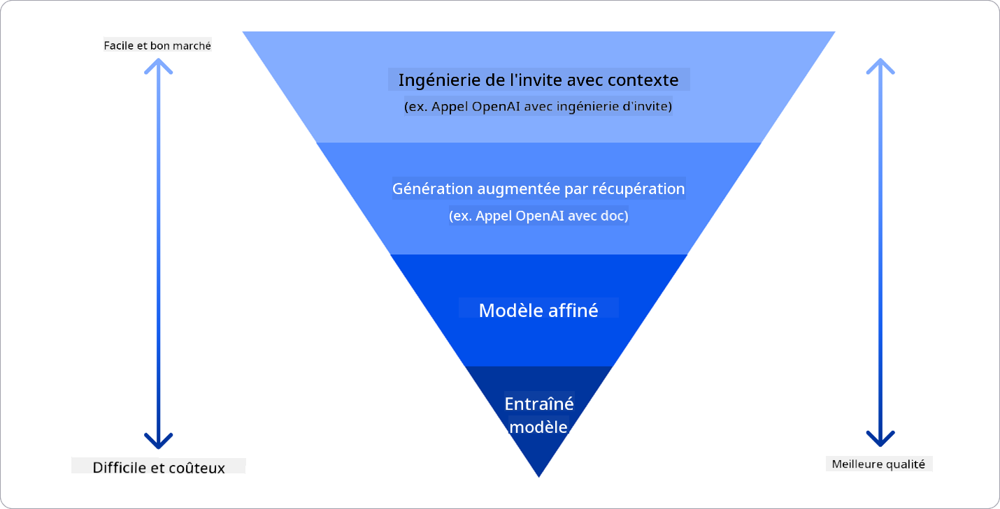

Source de l'image : [Four Ways that Enterprises Deploy LLMs | Fiddler AI Blog](https://www.fiddler.ai/blog/four-ways-that-enterprises-deploy-llms?WT.mc_id=academic-105485-koreyst)

### Ingénierie de prompt avec contexte

Les LLM pré-entraînés fonctionnent très bien sur les tâches de langage naturel généralisées, même en les appelant avec un prompt court, comme une phrase à compléter ou une question – le soi-disant apprentissage “zero-shot”.

Cependant, plus l'utilisateur peut formuler sa requête, avec une demande détaillée et des exemples – le Contexte – plus la réponse sera précise et proche des attentes de l'utilisateur. Dans ce cas, on parle d'apprentissage “one-shot” si le prompt inclut seulement un exemple et d'apprentissage “few-shot” s'il inclut plusieurs exemples.
L'ingénierie de prompt avec contexte est l'approche la plus rentable pour commencer.

### Génération augmentée par récupération (RAG)

Les LLM ont la limitation de ne pouvoir utiliser que les données qui ont été utilisées lors de leur entraînement pour générer une réponse. Cela signifie qu'ils ne connaissent rien des faits survenus après leur processus d'entraînement, et qu'ils ne peuvent pas accéder à des informations non publiques (comme les données de l'entreprise).
Cela peut être surmonté grâce à RAG, une technique qui augmente le prompt avec des données externes sous forme de fragments de documents, en tenant compte des limites de longueur du prompt. Cela est soutenu par des outils de base de données vectorielle (comme [Azure Vector Search](https://learn.microsoft.com/azure/search/vector-search-overview?WT.mc_id=academic-105485-koreyst)) qui récupèrent les fragments utiles à partir de diverses sources de données prédéfinies et les ajoutent au Contexte du prompt.

Cette technique est très utile lorsqu'une entreprise n'a pas assez de données, pas assez de temps ou de ressources pour affiner un LLM, mais souhaite néanmoins améliorer les performances sur une charge de travail spécifique et réduire les risques de fabrications, c'est-à-dire la mystification de la réalité ou le contenu nuisible.

### Modèle affiné

L'affinage est un processus qui exploite l'apprentissage par transfert pour ‘adapter’ le modèle à une tâche en aval ou pour résoudre un problème spécifique. Contrairement à l'apprentissage few-shot et à RAG, il en résulte un nouveau modèle généré, avec des poids et des biais mis à jour. Il nécessite un ensemble d'exemples d'entraînement composé d'une seule entrée (le prompt) et de sa sortie associée (la complétion).
Ce serait l'approche préférée si :

- **Utilisation de modèles affinés**. Une entreprise souhaite utiliser des modèles affinés moins performants (comme les modèles d'embeddings) plutôt que des modèles haute performance, ce qui entraîne une solution plus rentable et rapide.

- **Considération de la latence**. La latence est importante pour un cas d'utilisation spécifique, donc il n'est pas possible d'utiliser des prompts très longs ou le nombre d'exemples qui devraient être appris par le modèle ne correspond pas à la limite de longueur du prompt.

- **Rester à jour**. Une entreprise dispose de nombreuses données de haute qualité et d'étiquettes de vérité terrain et des ressources nécessaires pour maintenir ces données à jour au fil du temps.

### Modèle entraîné

Entraîner un LLM à partir de zéro est sans aucun doute l'approche la plus difficile et la plus complexe à adopter, nécessitant des quantités massives de données, des ressources qualifiées et une puissance de calcul appropriée. Cette option devrait être envisagée uniquement dans un scénario où une entreprise a un cas d'utilisation spécifique au domaine et une grande quantité de données centrées sur le domaine.

## Vérification des connaissances

Quelle pourrait être une bonne approche pour améliorer les résultats de complétion des LLM ?

1. Ingénierie de prompt avec contexte
1. RAG
1. Modèle affiné

R : 3, si vous avez le temps et les ressources et des données de haute qualité, l'affinage est la meilleure option pour rester à jour. Cependant, si vous cherchez à améliorer les choses et que vous manquez de temps, il vaut la peine de considérer RAG en premier.

## 🚀 Défi

Lisez davantage sur comment vous pouvez [utiliser RAG](https://learn.microsoft.com/azure/search/retrieval-augmented-generation-overview?WT.mc_id=academic-105485-koreyst) pour votre entreprise.

## Excellent travail, continuez votre apprentissage

Après avoir terminé cette leçon, consultez notre [collection d'apprentissage sur l'IA générative](https://aka.ms/genai-collection?WT.mc_id=academic-105485-koreyst) pour continuer à approfondir vos connaissances en IA générative !

Rendez-vous à la leçon 3 où nous examinerons comment [construire avec l'IA générative de manière responsable](../03-using-generative-ai-responsibly/README.md?WT.mc_id=academic-105485-koreyst) !

**Avertissement** :  
Ce document a été traduit à l'aide du service de traduction IA [Co-op Translator](https://github.com/Azure/co-op-translator). Bien que nous nous efforcions d'assurer l'exactitude, veuillez noter que les traductions automatiques peuvent contenir des erreurs ou des inexactitudes. Le document original dans sa langue d'origine doit être considéré comme la source faisant autorité. Pour des informations critiques, une traduction professionnelle par un humain est recommandée. Nous ne sommes pas responsables des malentendus ou des interprétations erronées résultant de l'utilisation de cette traduction.