# Explorer et comparer différents LLM

[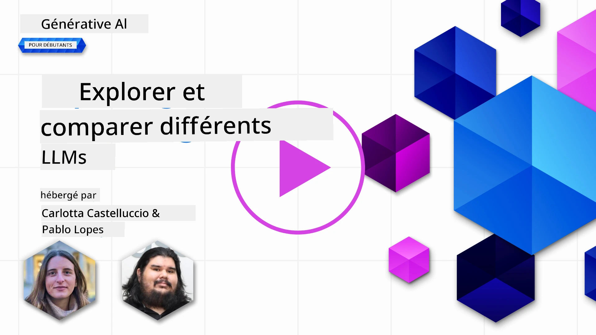](https://youtu.be/KIRUeDKscfI?si=8BHX1zvwzQBn-PlK)

> _Cliquez sur l'image ci-dessus pour voir la vidéo de cette leçon_

Avec la leçon précédente, nous avons vu comment l'IA générative change le paysage technologique, comment fonctionnent les grands modèles de langage (LLM) et comment une entreprise - comme notre startup - peut les appliquer à ses cas d'utilisation et se développer ! Dans ce chapitre, nous allons comparer et contraster différents types de grands modèles de langage (LLM) pour comprendre leurs avantages et inconvénients.

La prochaine étape du parcours de notre startup est d'explorer le paysage actuel des LLM et de comprendre lesquels conviennent à notre cas d'utilisation.

## Introduction

Cette leçon couvrira :

- Différents types de LLM dans le paysage actuel.
- Tester, itérer et comparer différents modèles pour votre cas d'utilisation dans Azure.
- Comment déployer un LLM.

## Objectifs d'apprentissage

Après avoir terminé cette leçon, vous serez capable de :

- Sélectionner le bon modèle pour votre cas d'utilisation.
- Comprendre comment tester, itérer et améliorer la performance de votre modèle.
- Savoir comment les entreprises déploient des modèles.

## Comprendre les différents types de LLM

Les LLM peuvent avoir plusieurs catégorisations basées sur leur architecture, leurs données d'entraînement et leur cas d'utilisation. Comprendre ces différences aidera notre startup à choisir le bon modèle pour le scénario, et à comprendre comment tester, itérer et améliorer la performance.

Il existe de nombreux types différents de modèles LLM, votre choix de modèle dépend de ce que vous souhaitez en faire, de vos données, de combien vous êtes prêt à payer, et plus encore.

Selon si vous souhaitez utiliser les modèles pour du texte, audio, vidéo, génération d’images, etc., vous pouvez opter pour un type de modèle différent.

- **Reconnaissance audio et vocale**. Les modèles de type Whisper restent utiles comme modèles de reconnaissance vocale à usage général, mais les choix en production incluent désormais de nouveaux modèles speech-to-text tels que `gpt-4o-transcribe`, `gpt-4o-mini-transcribe`, et des variantes de diarisation. Évaluez la couverture linguistique, la diarisation, le support en temps réel, la latence et le coût pour votre scénario. En savoir plus dans la [documentation OpenAI speech-to-text](https://platform.openai.com/docs/guides/speech-to-text?WT.mc_id=academic-105485-koreyst).

- **Génération d’images**. DALL-E et Midjourney sont des options bien connues pour la génération d’images, mais les API d’images actuelles d’OpenAI se centrent sur les modèles GPT Image comme `gpt-image-2`, tandis que Stable Diffusion, Imagen, Flux, et d’autres familles de modèles sont également des choix courants. Comparez la conformité aux prompts, le support d’édition, le contrôle de style, les exigences de sécurité, et les licences. En savoir plus dans le [guide OpenAI de génération d’images](https://platform.openai.com/docs/guides/images?WT.mc_id=academic-105485-koreyst) et au Chapitre 9 de ce cursus.

- **Génération de texte**. Les modèles textuels couvrent maintenant des modèles de pointe, des modèles de raisonnement, des modèles plus petits à faible latence, et des modèles à poids ouverts. Les exemples actuels incluent les modèles OpenAI GPT-5.x, Anthropic Claude 4.x, Google Gemini 3.x, Meta Llama 4, et Mistral. Ne choisissez pas seulement en fonction de la date de sortie ou du prix; comparez la qualité des tâches, la latence, la fenêtre de contexte, l’utilisation d’outils, le comportement en matière de sécurité, la disponibilité régionale, et le coût total. Le [catalogue des modèles Microsoft Foundry](https://ai.azure.com/catalog?WT.mc_id=academic-105485-koreyst) est un bon endroit pour comparer les modèles disponibles sur Azure.

- **Multimodalité**. Beaucoup de modèles actuels peuvent traiter plus que du texte. Certains acceptent des entrées image, audio ou vidéo ; certains peuvent appeler des outils ; et des modèles spécialisés peuvent générer des images, audio ou vidéo. Par exemple, les modèles OpenAI actuels supportent texte et image en entrée, les modèles Gemini peuvent supporter texte, code, image, audio et vidéo selon la variante, et Llama 4 Scout et Maverick sont des modèles à poids ouverts nativement multimodaux. Vérifiez toujours la fiche de chaque modèle pour les modalités d’entrée et de sortie supportées avant de construire un workflow autour.

Sélectionner un modèle signifie obtenir des capacités de base, qui peuvent parfois ne pas suffire. Souvent, vous avez des données spécifiques à votre entreprise que vous devez d’une manière ou d’une autre communiquer au LLM. Il existe différentes approches pour cela, plus de détails dans les sections à venir.

### Modèles fondamentaux versus LLMs

Le terme Modèle Fondamental a été [inventé par des chercheurs de Stanford](https://arxiv.org/abs/2108.07258?WT.mc_id=academic-105485-koreyst) et défini comme un modèle d’IA qui suit certains critères, tels que :

- **Ils sont entraînés en apprentissage non supervisé ou auto-supervisé**, ce qui signifie qu’ils sont entraînés sur des données multimodales non annotées et ne nécessitent pas d’annotation humaine des données pour leur processus d’entraînement.
- **Ce sont des modèles très volumineux**, basés sur des réseaux de neurones très profonds entraînés sur des milliards de paramètres.
- **Ils sont normalement destinés à servir de ‘fondation’ pour d’autres modèles**, ce qui signifie qu’ils peuvent être utilisés comme point de départ pour bâtir d’autres modèles par un affinage.

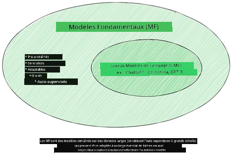

Source de l'image : [Guide essentiel des modèles fondamentaux et des grands modèles de langage | par Babar M Bhatti | Medium
](https://thebabar.medium.com/essential-guide-to-foundation-models-and-large-language-models-27dab58f7404)

Pour clarifier davantage cette distinction, prenons ChatGPT comme exemple historique. Les premières versions de ChatGPT utilisaient GPT-3.5 comme modèle fondamental. OpenAI a ensuite utilisé des données spécifiques au chat et des techniques d’alignement pour créer une version ajustée qui performe mieux dans les scénarios conversationnels, tels que les chatbots. Les services d’IA modernes routent souvent entre plusieurs variantes de modèles, donc le nom du service et celui du modèle sous-jacent ne sont pas toujours identiques.

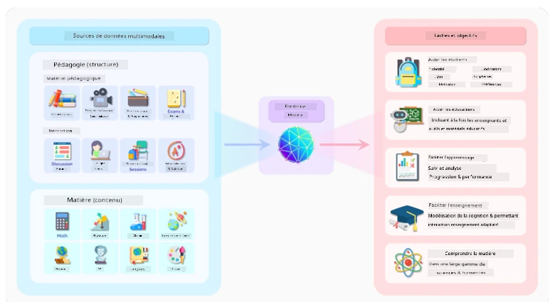

Source de l'image : [2108.07258.pdf (arxiv.org)](https://arxiv.org/pdf/2108.07258.pdf?WT.mc_id=academic-105485-koreyst)

### Modèles Open-Weight/Open-Source versus Modèles propriétaires

Une autre manière de catégoriser les LLM est de savoir s’ils sont open-weight, open-source, ou propriétaires.

Les modèles open-source et open-weight rendent les artefacts du modèle disponibles pour l’inspection, le téléchargement ou la personnalisation, mais leurs licences diffèrent. Certains sont totalement open source, tandis que d’autres sont des modèles open-weight avec des restrictions d’usage. Ils peuvent être utiles lorsqu’une entreprise a besoin de plus de contrôle sur le déploiement, la localisation des données, le coût, ou la personnalisation. Cependant, les équipes doivent toujours revoir les termes de licence, les coûts de service, la maintenance, les mises à jour de sécurité, et la qualité d’évaluation avant de les utiliser en production. Des exemples incluent [Meta Llama 4](https://ai.meta.com/blog/llama-4-multimodal-intelligence/?WT.mc_id=academic-105485-koreyst), certains [modèles Mistral](https://docs.mistral.ai/models/overview?WT.mc_id=academic-105485-koreyst), et de nombreux modèles hébergés sur [Hugging Face](https://huggingface.co/models?WT.mc_id=academic-105485-koreyst).

Les modèles propriétaires sont détenus et hébergés par un fournisseur. Ces modèles sont souvent optimisés pour une utilisation en production gérée et peuvent offrir un fort support, des systèmes de sécurité, l’intégration d’outils, et l’échelle. Cependant, les clients ne peuvent généralement pas inspecter ou modifier les poids du modèle, et doivent revoir les termes du fournisseur concernant la confidentialité, la conservation, la conformité, et l’usage acceptable. Des exemples incluent les [modèles OpenAI](https://platform.openai.com/docs/models?WT.mc_id=academic-105485-koreyst), [Google Gemini](https://deepmind.google/models/gemini/pro/?WT.mc_id=academic-105485-koreyst), et [Anthropic Claude](https://platform.claude.com/docs/en/about-claude/models/overview?WT.mc_id=academic-105485-koreyst).

### Embedding versus Génération d’images versus Génération de texte et code

Les LLM peuvent aussi être catégorisés selon le type de sortie qu’ils génèrent.

Les embeddings sont un ensemble de modèles qui peuvent convertir le texte en une forme numérique, appelée embedding, qui est une représentation numérique du texte d’entrée. Les embeddings facilitent la compréhension par les machines des relations entre mots ou phrases et peuvent être utilisés comme entrées par d’autres modèles, tels que des modèles de classification ou de regroupement qui ont de meilleures performances sur les données numériques. Les modèles d’embedding sont souvent employés pour l’apprentissage par transfert, où un modèle est construit pour une tâche de substitution disposant d’une abondance de données, puis les poids du modèle (embeddings) sont réutilisés pour d’autres tâches en aval. Un exemple de cette catégorie est [OpenAI embeddings](https://platform.openai.com/docs/models/embeddings?WT.mc_id=academic-105485-koreyst).

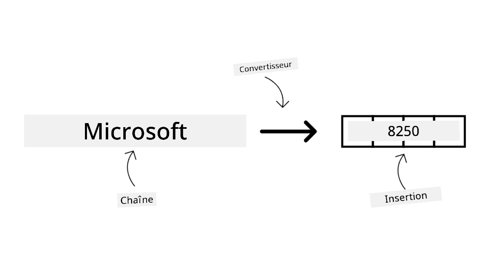

Les modèles de génération d’images sont des modèles qui génèrent des images. Ces modèles sont souvent utilisés pour l’édition d’images, la synthèse d’images, et la traduction d’images. Les modèles de génération d’images sont souvent entraînés sur de grands ensembles de données d’images, tels que [LAION-5B](https://laion.ai/blog/laion-5b/?WT.mc_id=academic-105485-koreyst), et peuvent être utilisés pour générer de nouvelles images ou pour éditer des images existantes avec des techniques d’inpainting, super-résolution et colorisation. Des exemples incluent les [modèles GPT Image](https://platform.openai.com/docs/guides/images?WT.mc_id=academic-105485-koreyst), les [modèles Stable Diffusion](https://github.com/Stability-AI/StableDiffusion?WT.mc_id=academic-105485-koreyst), et les modèles Imagen.

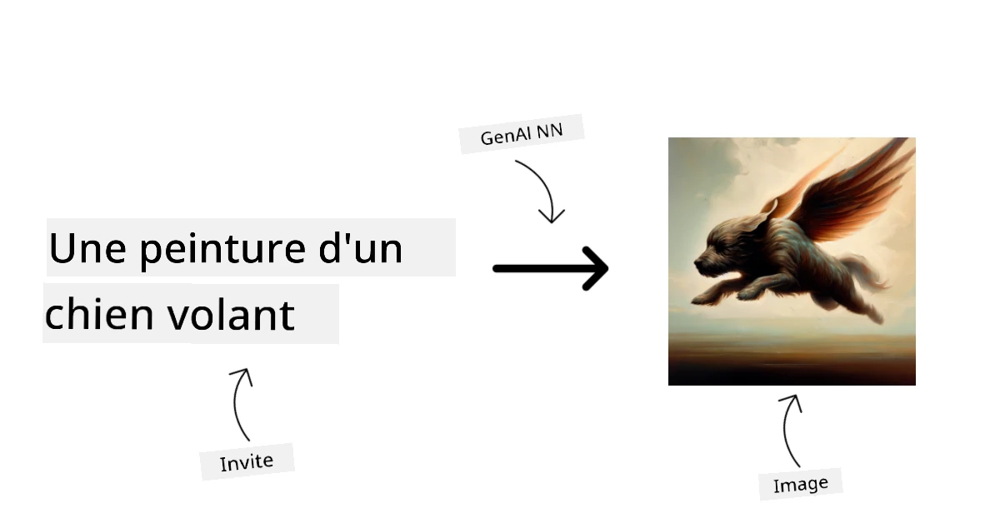

Les modèles de génération de texte et de code sont des modèles qui génèrent du texte ou du code. Ces modèles sont souvent utilisés pour la synthèse de texte, la traduction, et la réponse à des questions. Les modèles de génération de texte sont souvent entraînés sur de grands ensembles de données textuelles, tels que [BookCorpus](https://www.cv-foundation.org/openaccess/content_iccv_2015/html/Zhu_Aligning_Books_and_ICCV_2015_paper.html?WT.mc_id=academic-105485-koreyst), et peuvent être utilisés pour générer du texte neuf ou répondre à des questions. Les modèles de génération de code, comme [CodeParrot](https://huggingface.co/codeparrot?WT.mc_id=academic-105485-koreyst), sont souvent entraînés sur de grandes bases de code, comme GitHub, et peuvent être utilisés pour générer du code neuf ou corriger des bugs dans un code existant.

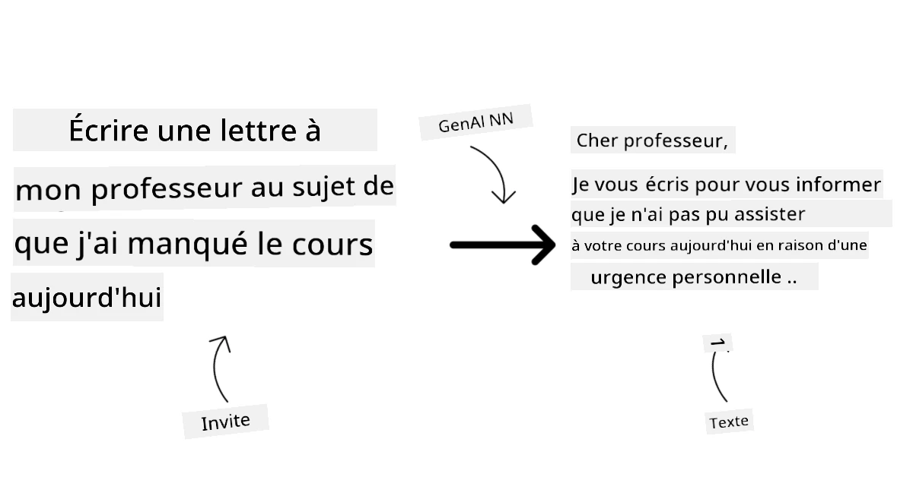

### Encodeur-Décodeur versus Décodeur-seul

Pour parler des différents types d'architectures des LLM, utilisons une analogie.

Imaginez que votre manager vous ait donné la tâche d’écrire un quiz pour les étudiants. Vous avez deux collègues ; l’un supervise la création du contenu et l’autre la révision.

Le créateur de contenu est comme un modèle décodeur seul : il peut regarder le sujet, voir ce que vous avez déjà écrit, puis continuer à générer du contenu basé sur ce contexte. Ils sont très bons pour écrire un contenu engageant et informatif, mais ils ne sont pas toujours le meilleur choix lorsque la tâche est seulement de classifier, récupérer, ou encoder de l’information. Des exemples de familles de modèles décodeurs seuls incluent les modèles GPT et Llama.

Le réviseur est comme un modèle encodeur seul, il regarde le cours écrit et les réponses, remarque la relation entre eux et comprend le contexte, mais il n’est pas bon pour générer du contenu. Un exemple de modèle encodeur seul serait BERT.

Imaginez que nous pouvons aussi avoir quelqu’un qui pourrait créer et réviser le quiz, c’est un modèle Encodeur-Décodeur. Quelques exemples seraient BART et T5.

### Service versus Modèle

Maintenant, parlons de la différence entre un service et un modèle. Un service est un produit offert par un fournisseur de service cloud, et est souvent une combinaison de modèles, données, et autres composants. Un modèle est le composant central d’un service, et est souvent un modèle fondamental, tel qu’un LLM.

Les services sont souvent optimisés pour une utilisation en production et sont souvent plus faciles à utiliser que les modèles, via une interface graphique utilisateur. Cependant, les services ne sont pas toujours disponibles gratuitement, et peuvent nécessiter un abonnement ou un paiement pour les utiliser, en échange de l’utilisation des équipements et ressources du propriétaire du service, optimisant les dépenses et une montée en échelle facile. Un exemple de service est [Azure OpenAI Service](https://learn.microsoft.com/azure/ai-foundry/openai/overview?WT.mc_id=academic-105485-koreyst), qui offre un plan tarifaire pay-as-you-go, ce qui signifie que les utilisateurs sont facturés proportionnellement à leur usage du service. Azure OpenAI Service offre également une sécurité de niveau entreprise et un cadre d’IA responsable en plus des capacités des modèles.

Les modèles sont les artefacts du réseau neuronal : paramètres, poids, architecture, tokenizer, et configuration de support. Exécuter un modèle localement ou dans un environnement privé requiert un matériel adapté, une infrastructure de service, de la supervision, et soit une licence open-source/open-weight compatible, soit une licence commerciale. Les modèles open-weight tels que Llama 4 ou les modèles Mistral peuvent être auto-hébergés, mais ils nécessitent toujours une puissance de calcul et une expertise opérationnelle.

## Comment tester et itérer avec différents modèles pour comprendre la performance sur Azure

Une fois que notre équipe a exploré le paysage actuel des LLM et identifié quelques bons candidats pour leurs scénarios, l’étape suivante consiste à les tester sur leurs données et sur leur charge de travail. C’est un processus itératif, réalisé par expériences et mesures.
La plupart des modèles que nous avons mentionnés dans les paragraphes précédents (modèles OpenAI, modèles à poids ouverts comme Llama 4 et Mistral, et modèles Hugging Face) sont disponibles dans [Microsoft Foundry Models](https://learn.microsoft.com/azure/foundry/concepts/foundry-models-overview?WT.mc_id=academic-105485-koreyst).

[Microsoft Foundry](https://learn.microsoft.com/azure/foundry/what-is-foundry?WT.mc_id=academic-105485-koreyst), anciennement Azure AI Studio/Azure AI Foundry, est une plateforme unifiée Azure pour construire des applications et agents d’IA. Elle aide les développeurs à gérer le cycle de vie, de l’expérimentation et l’évaluation jusqu’au déploiement, monitoring et gouvernance. Le catalogue de modèles dans Microsoft Foundry permet à l’utilisateur de :

- Trouver le modèle fondation d’intérêt dans le catalogue, y compris les modèles vendus par Azure et les modèles de partenaires et fournisseurs communautaires. Les utilisateurs peuvent filtrer par tâche, fournisseur, licence, option de déploiement ou nom.

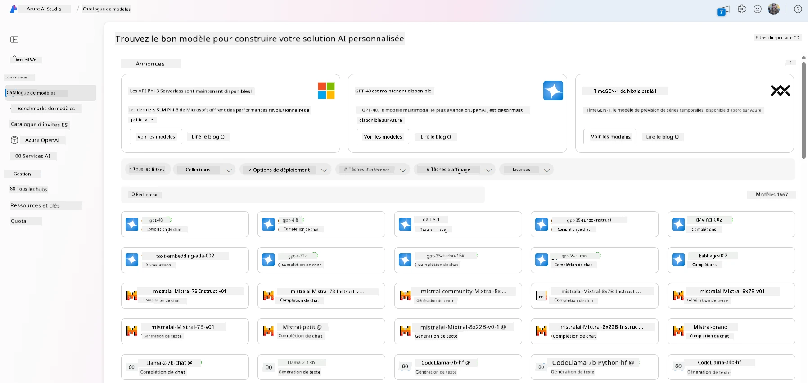

- Examiner la fiche modèle, incluant une description détaillée de l’usage prévu et des données d’entraînement, des exemples de code et des résultats d’évaluation sur la bibliothèque interne d’évaluations.

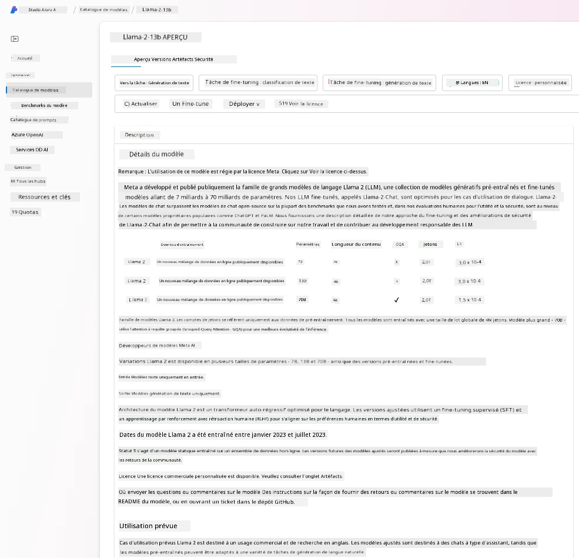

- Comparer les benchmarks entre modèles et ensembles de données disponibles dans l’industrie pour évaluer lequel répond au scénario métier, via le volet [Model Benchmarks](https://learn.microsoft.com/azure/ai-foundry/concepts/model-benchmarks?WT.mc_id=academic-105485-koreyst).

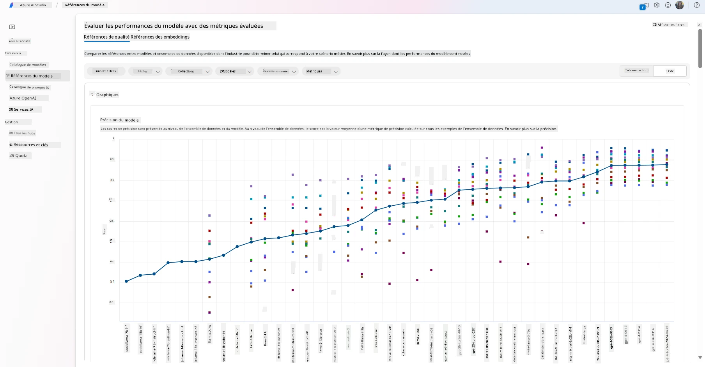

- Affiner les modèles supportés sur des données d’entraînement personnalisées pour améliorer la performance du modèle dans une charge de travail spécifique, en tirant parti des capacités d’expérimentation et de suivi de Microsoft Foundry.

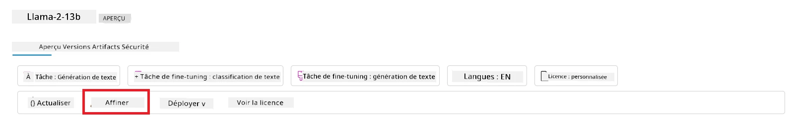

- Déployer le modèle pré-entraîné original ou la version affinée vers un point de terminaison d’inférence distant en temps réel, en utilisant des options de calcul managé ou de déploiement serverless, pour permettre aux applications de le consommer.

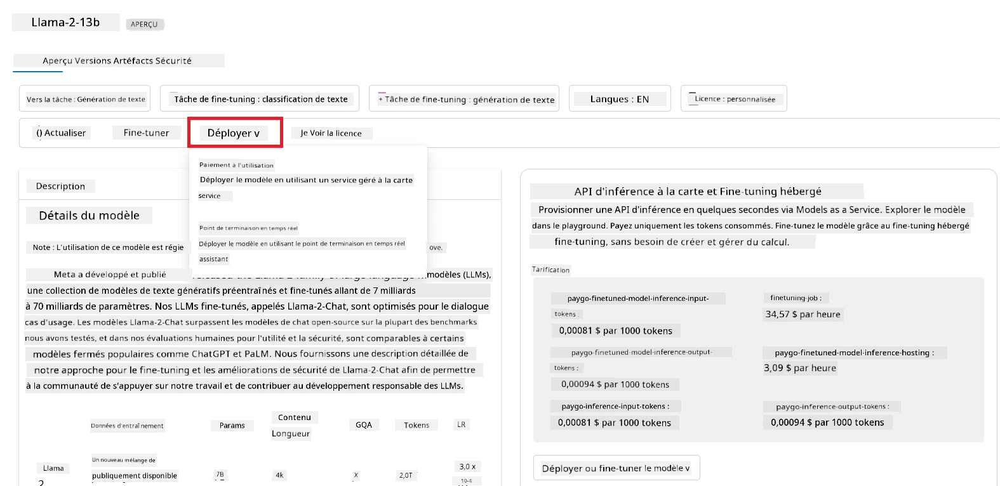

> [!NOTE]
> Tous les modèles du catalogue ne sont pas actuellement disponibles pour un affinement et/ou un déploiement pay-as-you-go. Vérifiez la fiche du modèle pour les détails sur ses capacités et ses limitations.

## Améliorer les résultats des LLM

Nous avons exploré avec notre équipe startup différents types de LLM et une plateforme cloud (Microsoft Foundry) qui nous permet de comparer différents modèles, de les évaluer sur des données de test, d’améliorer leur performance, et de les déployer sur des points d’inférence.

Mais quand doivent-ils envisager d’affiner un modèle plutôt que d’utiliser un modèle pré-entraîné ? Existe-t-il d’autres approches pour améliorer la performance du modèle sur des charges de travail spécifiques ?

Plusieurs approches sont possibles pour une entreprise afin d’obtenir les résultats souhaités d’un LLM. Vous pouvez sélectionner différents types de modèles avec différents degrés d’entraînement lors du déploiement d’un LLM en production, avec différents niveaux de complexité, de coût et de qualité. Voici quelques approches différentes :

- **Ingénierie des prompts avec contexte**. L’idée est de fournir suffisamment de contexte lors du prompt pour s’assurer d’obtenir les réponses nécessaires.

- **Retrieval Augmented Generation, RAG**. Vos données peuvent exister dans une base de données ou un point de terminaison web par exemple, pour s’assurer que ces données, ou un sous-ensemble de celles-ci, sont incluses au moment du prompt, vous pouvez récupérer les données pertinentes et les intégrer au prompt de l’utilisateur.

- **Modèle affiné**. Ici, vous entraînez davantage le modèle sur vos propres données ce qui rend le modèle plus précis et réactif à vos besoins mais cela peut être coûteux.

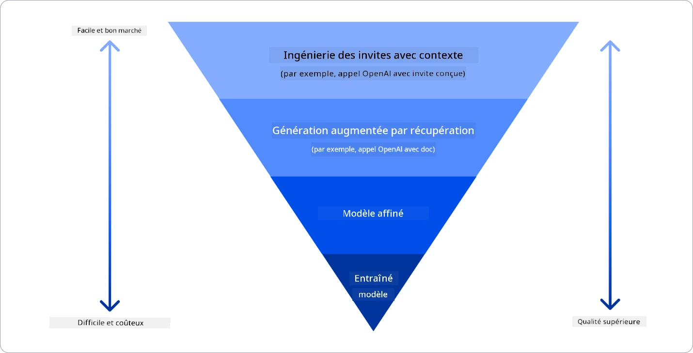

Source de l’image : [Four Ways that Enterprises Deploy LLMs | Fiddler AI Blog](https://www.fiddler.ai/blog/four-ways-that-enterprises-deploy-llms?WT.mc_id=academic-105485-koreyst)

### Ingénierie des prompts avec contexte

Les LLM pré-entraînés fonctionnent très bien sur des tâches générales en langage naturel, même en les appelant avec un prompt court, comme une phrase à compléter ou une question – ce qu’on appelle l’apprentissage “zero-shot”.

Cependant, plus l’utilisateur peut cadrer sa requête, avec une demande détaillée et des exemples – le Contexte – plus la réponse sera précise et proche des attentes de l’utilisateur. Dans ce cas, on parle d’apprentissage “one-shot” si le prompt contient un seul exemple et “few-shot” s’il contient plusieurs exemples.
L’ingénierie des prompts avec contexte est l’approche la plus rentable pour commencer.

### Retrieval Augmented Generation (RAG)

Les LLM ont la limitation qu’ils ne peuvent utiliser que les données ayant servi à leur entraînement pour générer une réponse. Cela signifie qu’ils ne savent rien des faits survenus après leur entraînement, et qu’ils ne peuvent pas accéder à des informations non publiques (comme des données d’entreprise).
Cela peut être contourné grâce à RAG, une technique qui augmente le prompt avec des données externes sous forme de fragments de documents, en tenant compte des limites de longueur du prompt. Cela est supporté par des outils de base de données vectorielle (comme [Azure Vector Search](https://learn.microsoft.com/azure/search/vector-search-overview?WT.mc_id=academic-105485-koreyst)) qui récupèrent les fragments utiles à partir de diverses sources de données pré-définies et les ajoutent au Contexte du prompt.

Cette technique est très utile lorsqu’une entreprise ne dispose pas de suffisamment de données, de temps ou de ressources pour affiner un LLM, mais souhaite tout de même améliorer la performance sur une charge de travail spécifique et réduire les risques de réponses hallucinées, obsolètes ou non supportées.

### Modèle affiné

L’affinage est un processus qui utilise le transfert d’apprentissage pour ‘adapter’ le modèle à une tâche particulière ou pour résoudre un problème spécifique. Contrairement à l’apprentissage few-shot et à RAG, cela aboutit à la génération d’un nouveau modèle, avec des poids et biais mis à jour. Cela nécessite un ensemble d’exemples d’entraînement comprenant une entrée unique (le prompt) et sa sortie associée (la complétion).
Ce serait l’approche préférée si :

- **Utiliser des modèles plus petits spécifiques à une tâche**. Une entreprise souhaite affiner un modèle plus petit pour une tâche restreinte plutôt que de solliciter à plusieurs reprises un grand modèle frontalier, ce qui conduit à une solution plus économique et plus rapide.

- **Prendre en compte la latence**. La latence est importante pour un cas d’usage spécifique, il n’est donc pas possible d’utiliser des prompts très longs ou le nombre d’exemples à apprendre pour le modèle ne correspond pas à la limite de longueur du prompt.

- **Adapter le comportement stable**. Une entreprise a beaucoup d’exemples de haute qualité et souhaite que le modèle suive systématiquement un schéma de tâche, un format de sortie, un ton ou un style spécifique à un domaine. Si le problème principal est l’actualité des faits ou des connaissances privées qui changent souvent, utilisez RAG au lieu de compter uniquement sur l’affinage.

### Modèle entraîné

Entraîner un LLM à partir de zéro est sans aucun doute l’approche la plus difficile et la plus complexe à adopter, nécessitant d’énormes quantités de données, des ressources qualifiées et une puissance de calcul appropriée. Cette option doit être considérée uniquement dans un scénario où une entreprise a un cas d’usage spécifique à un domaine et une grande quantité de données centrées sur ce domaine.

## Vérification des connaissances

Quelle pourrait être une bonne approche pour améliorer les résultats d’un LLM ?

1. Ingénierie des prompts avec contexte
1. RAG
1. Modèle affiné

R : Les trois peuvent aider. Commencez par l’ingénierie des prompts et le contexte pour des améliorations rapides, et utilisez RAG lorsque le modèle a besoin de faits actuels ou de données privées d’entreprise. Choisissez l’affinage lorsque vous avez suffisamment d’exemples de haute qualité et que vous avez besoin que le modèle suive systématiquement une tâche, un format, un ton ou un schéma de domaine.

## 🚀 Défi

Lisez plus sur la façon dont vous pouvez [utiliser RAG](https://learn.microsoft.com/azure/search/retrieval-augmented-generation-overview?WT.mc_id=academic-105485-koreyst) pour votre entreprise.

## Excellent travail, continuez votre apprentissage

Après avoir terminé cette leçon, consultez notre [collection d’apprentissage de l’IA générative](https://aka.ms/genai-collection?WT.mc_id=academic-105485-koreyst) pour continuer à améliorer vos connaissances en IA générative !

Rendez-vous à la leçon 3 où nous verrons comment [construire avec l’IA générative de manière responsable](../03-using-generative-ai-responsibly/README.md?WT.mc_id=academic-105485-koreyst) !

---

<!-- CO-OP TRANSLATOR DISCLAIMER START -->
**Avertissement** :
Ce document a été traduit à l'aide du service de traduction automatique [Co-op Translator](https://github.com/Azure/co-op-translator). Bien que nous nous efforçions d'assurer l'exactitude, veuillez noter que les traductions automatisées peuvent contenir des erreurs ou des inexactitudes. Le document original dans sa langue native doit être considéré comme la source faisant autorité. Pour les informations critiques, il est recommandé de recourir à une traduction professionnelle réalisée par un humain. Nous ne saurions être tenus responsables des malentendus ou erreurs d'interprétation découlant de l'utilisation de cette traduction.
<!-- CO-OP TRANSLATOR DISCLAIMER END -->