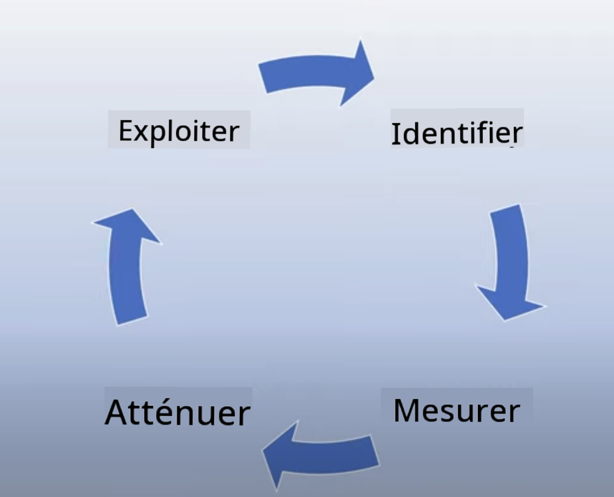
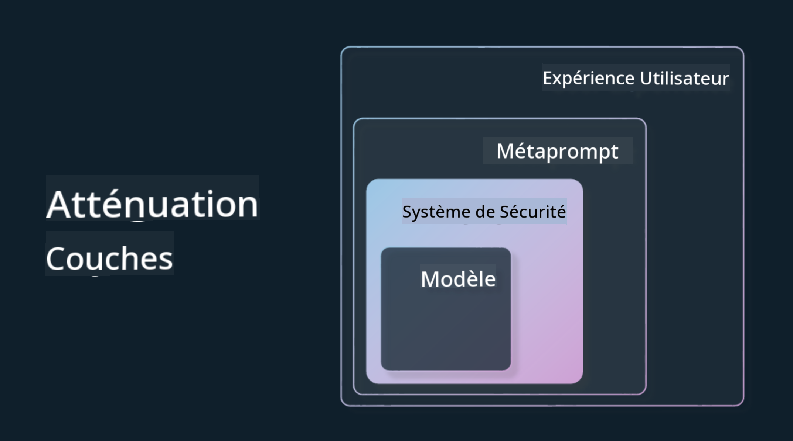

<!--
CO_OP_TRANSLATOR_METADATA:
{
  "original_hash": "7f8f4c11f8c1cb6e1794442dead414ea",
  "translation_date": "2025-07-09T08:45:59+00:00",
  "source_file": "03-using-generative-ai-responsibly/README.md",
  "language_code": "fr"
}
-->
# Utiliser l’IA Générative de manière responsable

> _Cliquez sur l’image ci-dessus pour voir la vidéo de cette leçon_

Il est facile d’être fasciné par l’IA, et plus particulièrement par l’IA générative, mais il est essentiel de réfléchir à la manière de l’utiliser de façon responsable. Il faut prendre en compte des aspects comme garantir que les résultats soient justes, non nuisibles, et bien plus encore. Ce chapitre a pour but de vous fournir ce contexte, ce qu’il faut considérer, et comment agir concrètement pour améliorer votre usage de l’IA.

## Introduction

Cette leçon abordera :

- Pourquoi il est important de privilégier une IA responsable lors de la création d’applications d’IA générative.
- Les principes fondamentaux de l’IA responsable et leur lien avec l’IA générative.
- Comment appliquer ces principes d’IA responsable à travers des stratégies et des outils.

## Objectifs d’apprentissage

À l’issue de cette leçon, vous saurez :

- L’importance de l’IA responsable dans la création d’applications d’IA générative.
- Quand réfléchir à et appliquer les principes fondamentaux de l’IA responsable dans ce contexte.
- Quels outils et stratégies sont à votre disposition pour mettre en pratique le concept d’IA responsable.

## Principes de l’IA responsable

L’engouement pour l’IA générative n’a jamais été aussi fort. Cet engouement a attiré de nombreux nouveaux développeurs, de l’attention et des financements dans ce domaine. Bien que cela soit très positif pour quiconque souhaite créer des produits et des entreprises utilisant l’IA générative, il est aussi crucial d’avancer de manière responsable.

Tout au long de ce cours, nous nous concentrons sur la construction de notre startup et de notre produit éducatif en IA. Nous utiliserons les principes de l’IA responsable : Équité, Inclusion, Fiabilité/Sécurité, Sécurité & Confidentialité, Transparence et Responsabilité. Avec ces principes, nous explorerons leur lien avec notre utilisation de l’IA générative dans nos produits.

## Pourquoi prioriser l’IA responsable

Lors de la création d’un produit, adopter une approche centrée sur l’humain en gardant à l’esprit l’intérêt de l’utilisateur conduit aux meilleurs résultats.

La particularité de l’IA générative réside dans sa capacité à créer des réponses utiles, des informations, des conseils et du contenu pour les utilisateurs. Cela peut se faire sans de nombreuses étapes manuelles, ce qui peut donner des résultats très impressionnants. Sans une planification et des stratégies appropriées, cela peut malheureusement aussi entraîner des résultats nuisibles pour vos utilisateurs, votre produit et la société dans son ensemble.

Examinons quelques-uns (mais pas tous) de ces résultats potentiellement nuisibles :

### Hallucinations

Les hallucinations désignent le phénomène où un LLM produit un contenu soit complètement absurde, soit factuellement incorrect selon d’autres sources d’information.

Par exemple, imaginons que nous développions une fonctionnalité pour notre startup permettant aux étudiants de poser des questions historiques à un modèle. Un étudiant demande : `Qui était le seul survivant du Titanic ?`

Le modèle produit une réponse comme celle-ci :

> _(Source : [Flying bisons](https://flyingbisons.com?WT.mc_id=academic-105485-koreyst))_

C’est une réponse très confiante et détaillée. Malheureusement, elle est incorrecte. Avec un minimum de recherche, on découvre qu’il y a eu plusieurs survivants du naufrage du Titanic. Pour un étudiant qui commence à s’informer sur ce sujet, cette réponse peut sembler suffisamment convaincante pour ne pas être remise en question et être prise pour un fait. Les conséquences peuvent rendre le système d’IA peu fiable et nuire à la réputation de notre startup.

À chaque nouvelle version d’un LLM, nous constatons des améliorations pour réduire les hallucinations. Malgré ces progrès, en tant que développeurs et utilisateurs, nous devons rester conscients de ces limites.

### Contenu nuisible

Nous avons vu précédemment quand un LLM produit des réponses incorrectes ou absurdes. Un autre risque à connaître est celui d’un modèle qui génère du contenu nuisible.

Le contenu nuisible peut être défini comme :

- Fournir des instructions ou encourager l’automutilation ou la violence envers certains groupes.
- Contenu haineux ou dégradant.
- Aider à planifier des attaques ou des actes violents.
- Fournir des instructions pour trouver du contenu illégal ou commettre des actes illégaux.
- Afficher du contenu sexuellement explicite.

Pour notre startup, nous voulons nous assurer de disposer des bons outils et stratégies pour empêcher que ce type de contenu soit visible par les étudiants.

### Manque d’équité

L’équité signifie « s’assurer qu’un système d’IA est exempt de biais et de discrimination et qu’il traite tout le monde de manière juste et égale ». Dans le domaine de l’IA générative, nous voulons éviter que des visions du monde excluantes envers des groupes marginalisés soient renforcées par les résultats du modèle.

Ce type de résultats nuit non seulement à la création d’expériences produit positives pour nos utilisateurs, mais cause aussi des dommages sociaux plus larges. En tant que développeurs, nous devons toujours garder à l’esprit une base d’utilisateurs large et diversifiée lors de la conception de solutions avec l’IA générative.

## Comment utiliser l’IA générative de manière responsable

Maintenant que nous avons identifié l’importance de l’IA générative responsable, voyons 4 étapes pour construire nos solutions IA de façon responsable :

### Mesurer les risques potentiels

Dans les tests logiciels, on teste les actions attendues d’un utilisateur sur une application. De la même manière, tester un ensemble diversifié de requêtes que les utilisateurs sont susceptibles d’utiliser est un bon moyen d’évaluer les risques potentiels.

Puisque notre startup développe un produit éducatif, il serait pertinent de préparer une liste de requêtes liées à l’éducation. Cela pourrait couvrir un certain sujet, des faits historiques, ou des questions sur la vie étudiante.

### Atténuer les risques potentiels

Il est temps de trouver des moyens pour prévenir ou limiter les risques causés par le modèle et ses réponses. Nous pouvons envisager cela à 4 niveaux différents :

- **Modèle**. Choisir le bon modèle pour le bon cas d’usage. Les modèles plus grands et complexes comme GPT-4 peuvent présenter un risque plus élevé de contenu nuisible lorsqu’ils sont appliqués à des cas d’usage plus petits et spécifiques. Utiliser vos données d’entraînement pour affiner le modèle réduit aussi ce risque.

- **Système de sécurité**. Un système de sécurité est un ensemble d’outils et de configurations sur la plateforme qui héberge le modèle et qui aide à limiter les risques. Par exemple, le système de filtrage de contenu du service Azure OpenAI. Ces systèmes doivent aussi détecter les attaques de type jailbreak et les activités indésirables comme les requêtes provenant de bots.

- **Metaprompt**. Les metaprompts et le grounding sont des moyens de diriger ou de limiter le modèle selon certains comportements et informations. Cela peut passer par des entrées système définissant certaines limites du modèle. De plus, fournir des réponses plus pertinentes par rapport au domaine ou au contexte du système.

Cela peut aussi inclure des techniques comme Retrieval Augmented Generation (RAG) pour que le modèle ne puise l’information que dans une sélection de sources fiables. Une leçon plus loin dans ce cours porte sur [la création d’applications de recherche](../08-building-search-applications/README.md?WT.mc_id=academic-105485-koreyst).

- **Expérience utilisateur**. Le dernier niveau est celui où l’utilisateur interagit directement avec le modèle via l’interface de notre application. Nous pouvons ainsi concevoir l’UI/UX pour limiter les types d’entrées que l’utilisateur peut envoyer au modèle ainsi que les textes ou images affichés. Lors du déploiement de l’application IA, il est aussi important d’être transparent sur ce que notre application d’IA générative peut ou ne peut pas faire.

Nous avons une leçon entière dédiée à [la conception UX pour les applications IA](../12-designing-ux-for-ai-applications/README.md?WT.mc_id=academic-105485-koreyst).

- **Évaluer le modèle**. Travailler avec des LLM peut être complexe car nous n’avons pas toujours le contrôle sur les données d’entraînement du modèle. Quoi qu’il en soit, il faut toujours évaluer la performance et les résultats du modèle. Il est important de mesurer la précision, la similarité, la pertinence et la fiabilité des réponses. Cela aide à instaurer transparence et confiance auprès des parties prenantes et des utilisateurs.

### Exploiter une solution d’IA générative responsable

Mettre en place une pratique opérationnelle autour de vos applications IA est la dernière étape. Cela inclut de collaborer avec d’autres départements de notre startup comme le service juridique et la sécurité pour garantir la conformité aux réglementations. Avant le lancement, il faut aussi élaborer des plans pour la livraison, la gestion des incidents et le retour en arrière afin d’éviter tout préjudice croissant pour nos utilisateurs.

## Outils

Même si le travail de développement de solutions d’IA responsable peut sembler important, il en vaut largement la peine. À mesure que le domaine de l’IA générative se développe, davantage d’outils permettant aux développeurs d’intégrer efficacement la responsabilité dans leurs processus vont mûrir. Par exemple, [Azure AI Content Safety](https://learn.microsoft.com/azure/ai-services/content-safety/overview?WT.mc_id=academic-105485-koreyst) peut aider à détecter le contenu et les images nuisibles via une requête API.

## Vérification des connaissances

Quelles sont les choses auxquelles vous devez faire attention pour garantir un usage responsable de l’IA ?

1. Que la réponse soit correcte.  
1. L’usage nuisible, que l’IA ne soit pas utilisée à des fins criminelles.  
1. S’assurer que l’IA soit exempte de biais et de discrimination.

R : Les points 2 et 3 sont corrects. L’IA responsable vous aide à envisager comment atténuer les effets nuisibles, les biais, et plus encore.

## 🚀 Défi

Lisez la documentation sur [Azure AI Content Safety](https://learn.microsoft.com/azure/ai-services/content-safety/overview?WT.mc_id=academic-105485-koreyst) et voyez ce que vous pouvez adopter pour votre usage.

## Excellent travail, continuez votre apprentissage

Après avoir terminé cette leçon, consultez notre [collection d’apprentissage sur l’IA générative](https://aka.ms/genai-collection?WT.mc_id=academic-105485-koreyst) pour continuer à approfondir vos connaissances sur l’IA générative !

Rendez-vous à la leçon 4 où nous aborderons les [fondamentaux de la conception de prompts](../04-prompt-engineering-fundamentals/README.md?WT.mc_id=academic-105485-koreyst) !

**Avertissement** :  
Ce document a été traduit à l’aide du service de traduction automatique [Co-op Translator](https://github.com/Azure/co-op-translator). Bien que nous nous efforcions d’assurer l’exactitude, veuillez noter que les traductions automatiques peuvent contenir des erreurs ou des inexactitudes. Le document original dans sa langue d’origine doit être considéré comme la source faisant foi. Pour les informations critiques, une traduction professionnelle réalisée par un humain est recommandée. Nous déclinons toute responsabilité en cas de malentendus ou de mauvaises interprétations résultant de l’utilisation de cette traduction.