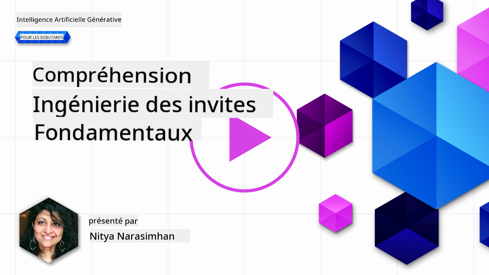
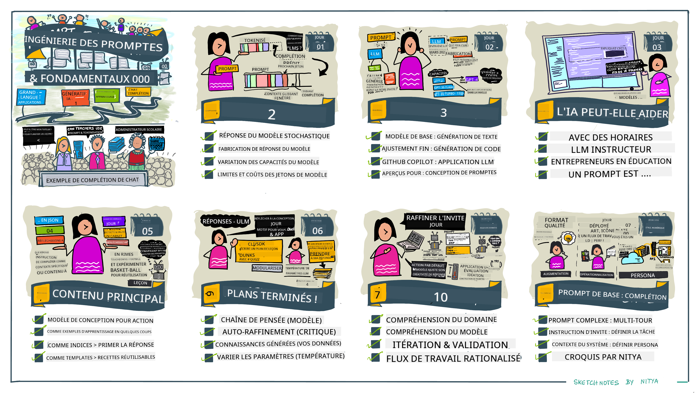
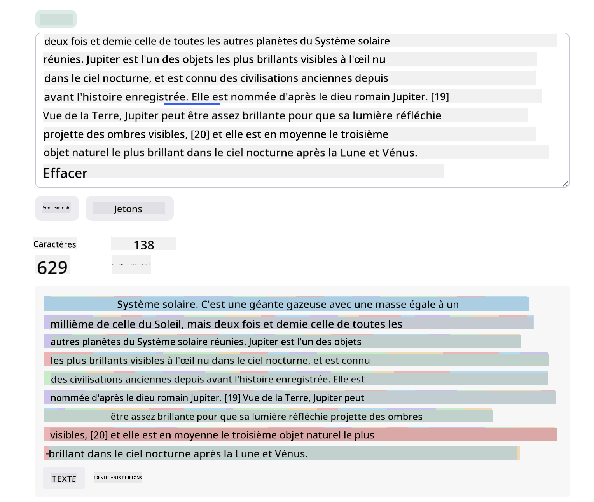
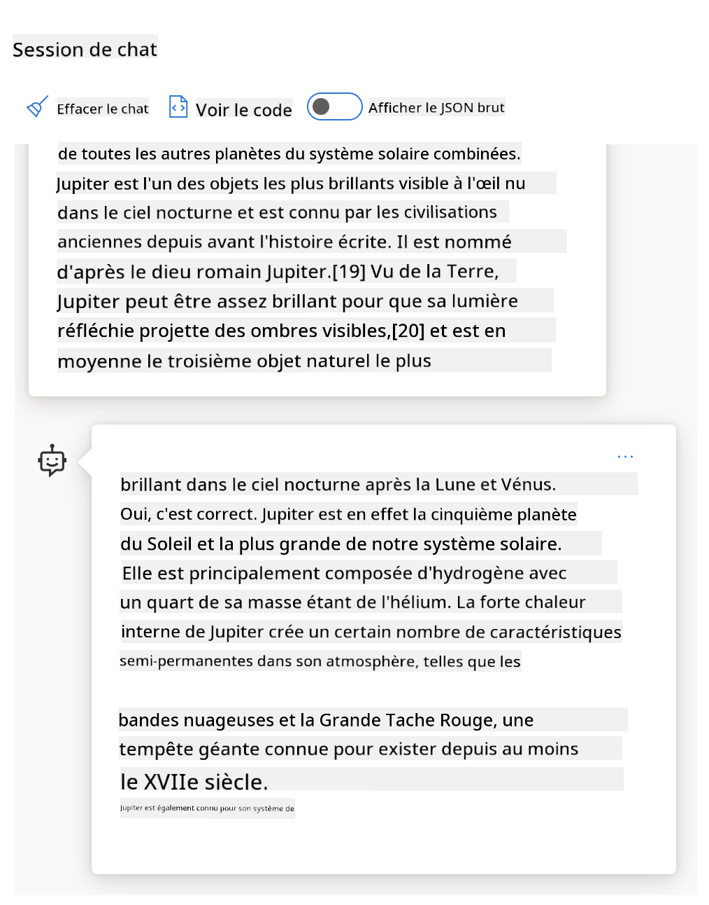
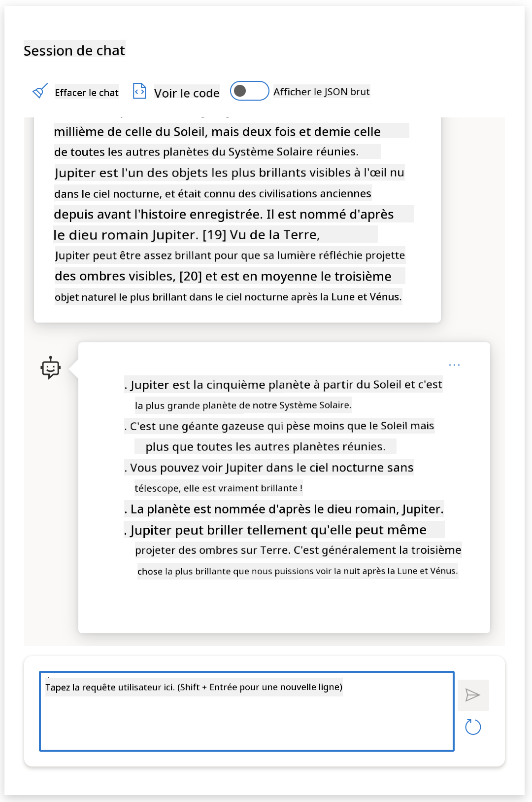
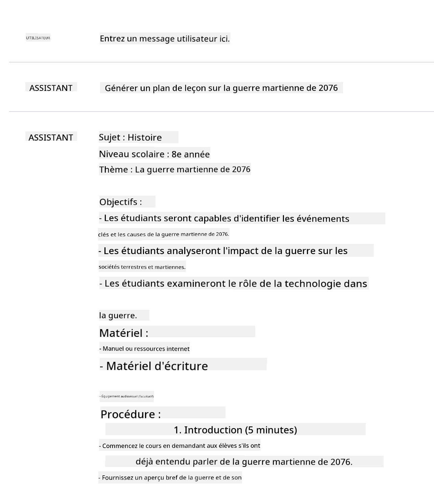
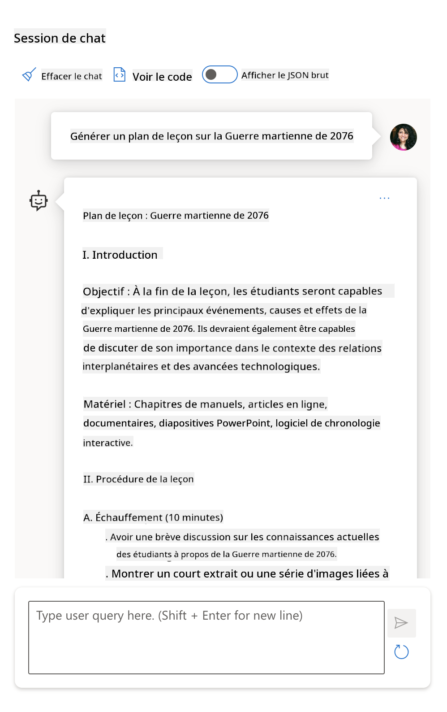
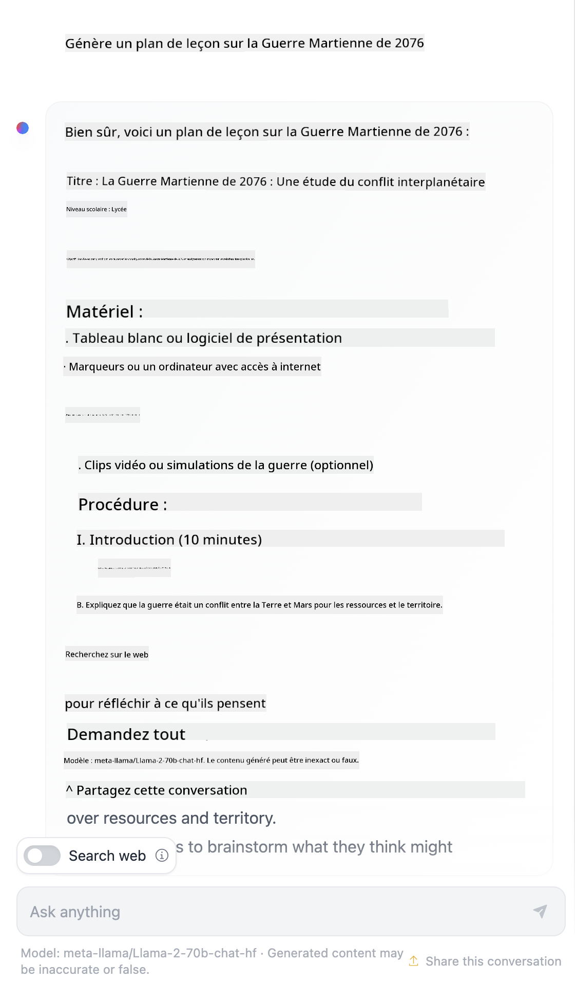

<!--
CO_OP_TRANSLATOR_METADATA:
{
  "original_hash": "a45c318dc6ebc2604f35b8b829f93af2",
  "translation_date": "2025-07-09T09:10:24+00:00",
  "source_file": "04-prompt-engineering-fundamentals/README.md",
  "language_code": "fr"
}
-->
# Fondamentaux de l'Ingénierie des Prompts

[](https://aka.ms/gen-ai-lesson4-gh?WT.mc_id=academic-105485-koreyst)

## Introduction  
Ce module couvre les concepts et techniques essentiels pour créer des prompts efficaces dans les modèles d’IA générative. La manière dont vous rédigez votre prompt pour un LLM est également importante. Un prompt soigneusement conçu peut obtenir une meilleure qualité de réponse. Mais que signifient exactement les termes _prompt_ et _ingénierie des prompts_ ? Et comment améliorer le _prompt d’entrée_ que j’envoie au LLM ? Ce sont les questions auxquelles nous allons tenter de répondre dans ce chapitre et le suivant.

_L’IA générative_ est capable de créer du contenu nouveau (texte, images, audio, code, etc.) en réponse aux demandes des utilisateurs. Elle y parvient grâce à des _grands modèles de langage_ comme la série GPT d’OpenAI ("Generative Pre-trained Transformer") qui sont entraînés à utiliser le langage naturel et le code.

Les utilisateurs peuvent désormais interagir avec ces modèles via des paradigmes familiers comme le chat, sans nécessiter de compétences techniques ou de formation. Les modèles sont _basés sur des prompts_ : les utilisateurs envoient un texte (prompt) et reçoivent une réponse de l’IA (complétion). Ils peuvent ensuite "dialoguer avec l’IA" de manière itérative, dans des conversations à plusieurs tours, en affinant leur prompt jusqu’à ce que la réponse corresponde à leurs attentes.

Les "prompts" deviennent ainsi l’_interface de programmation_ principale des applications d’IA générative, indiquant aux modèles ce qu’ils doivent faire et influençant la qualité des réponses retournées. L’"ingénierie des prompts" est un domaine d’étude en pleine expansion qui se concentre sur la _conception et l’optimisation_ des prompts pour fournir des réponses cohérentes et de qualité à grande échelle.

## Objectifs d’apprentissage

Dans cette leçon, nous apprendrons ce qu’est l’ingénierie des prompts, pourquoi elle est importante, et comment créer des prompts plus efficaces pour un modèle et un objectif d’application donnés. Nous comprendrons les concepts clés et les bonnes pratiques de l’ingénierie des prompts – et découvrirons un environnement interactif de type Jupyter Notebooks "sandbox" où nous pourrons voir ces concepts appliqués à des exemples concrets.

À la fin de cette leçon, nous serons capables de :

1. Expliquer ce qu’est l’ingénierie des prompts et pourquoi elle est importante.  
2. Décrire les composants d’un prompt et leur utilisation.  
3. Apprendre les meilleures pratiques et techniques pour l’ingénierie des prompts.  
4. Appliquer les techniques apprises à des exemples réels, en utilisant un endpoint OpenAI.

## Termes clés

Ingénierie des Prompts : La pratique de concevoir et affiner les entrées pour guider les modèles d’IA vers la production des sorties souhaitées.  
Tokenisation : Le processus de conversion du texte en unités plus petites, appelées tokens, que le modèle peut comprendre et traiter.  
LLMs ajustés par instructions : Grands modèles de langage (LLMs) qui ont été affinés avec des instructions spécifiques pour améliorer la précision et la pertinence de leurs réponses.

## Environnement d’apprentissage

L’ingénierie des prompts est actuellement plus un art qu’une science. La meilleure façon d’améliorer notre intuition est de _pratiquer davantage_ et d’adopter une approche par essais et erreurs qui combine expertise du domaine d’application avec des techniques recommandées et des optimisations spécifiques au modèle.

Le Jupyter Notebook qui accompagne cette leçon offre un environnement _sandbox_ où vous pouvez tester ce que vous apprenez – au fur et à mesure ou dans le cadre du défi de code à la fin. Pour exécuter les exercices, vous aurez besoin de :

1. **Une clé API Azure OpenAI** – le point de terminaison du service pour un LLM déployé.  
2. **Un environnement d’exécution Python** – dans lequel le Notebook peut être exécuté.  
3. **Variables d’environnement locales** – _complétez dès maintenant les étapes du [SETUP](./../00-course-setup/SETUP.md?WT.mc_id=academic-105485-koreyst) pour être prêt_.

Le notebook propose des exercices _de démarrage_ – mais vous êtes encouragé à ajouter vos propres sections _Markdown_ (description) et _Code_ (requêtes de prompt) pour essayer plus d’exemples ou d’idées – et développer votre intuition pour la conception de prompts.

## Guide illustré

Vous souhaitez avoir une vue d’ensemble de ce que couvre cette leçon avant de vous plonger dedans ? Consultez ce guide illustré, qui vous donne une idée des principaux sujets abordés et des points clés à retenir pour chacun. La feuille de route de la leçon vous emmène de la compréhension des concepts fondamentaux et des défis à leur résolution avec des techniques d’ingénierie des prompts et des bonnes pratiques adaptées. Notez que la section "Techniques avancées" de ce guide fait référence au contenu du _chapitre suivant_ de ce cursus.



## Notre startup

Parlons maintenant de la façon dont _ce sujet_ s’inscrit dans la mission de notre startup visant à [apporter l’innovation IA à l’éducation](https://educationblog.microsoft.com/2023/06/collaborating-to-bring-ai-innovation-to-education?WT.mc_id=academic-105485-koreyst). Nous voulons construire des applications d’IA pour un _apprentissage personnalisé_ – réfléchissons donc à la manière dont différents utilisateurs de notre application pourraient "concevoir" des prompts :

- **Les administrateurs** pourraient demander à l’IA d’_analyser les données du programme scolaire pour identifier les lacunes_. L’IA peut résumer les résultats ou les visualiser avec du code.  
- **Les enseignants** pourraient demander à l’IA de _générer un plan de cours pour un public cible et un sujet donnés_. L’IA peut construire un plan personnalisé dans un format spécifié.  
- **Les étudiants** pourraient demander à l’IA de _les accompagner dans une matière difficile_. L’IA peut désormais guider les étudiants avec des leçons, des indices et des exemples adaptés à leur niveau.

Ce n’est qu’un aperçu. Découvrez [Prompts For Education](https://github.com/microsoft/prompts-for-edu/tree/main?WT.mc_id=academic-105485-koreyst) – une bibliothèque open source de prompts sélectionnée par des experts en éducation – pour avoir une idée plus large des possibilités ! _Essayez d’exécuter certains de ces prompts dans le sandbox ou dans l’OpenAI Playground pour voir ce qui se passe !_

<!--  
MODÈLE DE LEÇON :  
Cette unité doit couvrir le concept clé n°1.  
Renforcez le concept avec des exemples et des références.  

CONCEPT N°1 :  
Ingénierie des Prompts.  
Définissez-le et expliquez pourquoi il est nécessaire.  
-->

## Qu’est-ce que l’ingénierie des prompts ?

Nous avons commencé cette leçon en définissant **l’ingénierie des prompts** comme le processus de _conception et d’optimisation_ des entrées textuelles (prompts) pour fournir des réponses (complétions) cohérentes et de qualité selon un objectif d’application et un modèle donnés. On peut voir cela comme un processus en deux étapes :

- _concevoir_ le prompt initial pour un modèle et un objectif donnés  
- _affiner_ le prompt de manière itérative pour améliorer la qualité de la réponse

C’est nécessairement un processus d’essais et erreurs qui demande de l’intuition et des efforts de la part de l’utilisateur pour obtenir des résultats optimaux. Mais pourquoi est-ce important ? Pour répondre à cette question, il faut d’abord comprendre trois concepts :

- _Tokenisation_ = comment le modèle "voit" le prompt  
- _Base LLMs_ = comment le modèle de base "traite" un prompt  
- _LLMs ajustés par instructions_ = comment le modèle peut désormais "comprendre des tâches"

### Tokenisation

Un LLM perçoit les prompts comme une _séquence de tokens_ où différents modèles (ou versions d’un même modèle) peuvent tokeniser un même prompt de façons différentes. Comme les LLMs sont entraînés sur des tokens (et non sur du texte brut), la manière dont les prompts sont tokenisés a un impact direct sur la qualité de la réponse générée.

Pour vous faire une idée de la tokenisation, essayez des outils comme le [OpenAI Tokenizer](https://platform.openai.com/tokenizer?WT.mc_id=academic-105485-koreyst) présenté ci-dessous. Copiez votre prompt et voyez comment il est converti en tokens, en faisant attention à la gestion des espaces et de la ponctuation. Notez que cet exemple montre un LLM plus ancien (GPT-3) – essayer avec un modèle plus récent peut donner un résultat différent.



### Concept : Modèles de base

Une fois le prompt tokenisé, la fonction principale du ["Base LLM"](https://blog.gopenai.com/an-introduction-to-base-and-instruction-tuned-large-language-models-8de102c785a6?WT.mc_id=academic-105485-koreyst) (ou modèle de base) est de prédire le token suivant dans la séquence. Comme les LLMs sont entraînés sur d’énormes ensembles de textes, ils ont une bonne compréhension des relations statistiques entre tokens et peuvent faire cette prédiction avec une certaine confiance. Notez qu’ils ne comprennent pas le _sens_ des mots dans le prompt ou le token ; ils voient juste un motif qu’ils peuvent "compléter" avec leur prédiction suivante. Ils peuvent continuer à prédire la séquence jusqu’à ce qu’une intervention utilisateur ou une condition préétablie mette fin au processus.

Vous voulez voir comment fonctionne la complétion basée sur un prompt ? Entrez le prompt ci-dessus dans l’Azure OpenAI Studio [_Chat Playground_](https://oai.azure.com/playground?WT.mc_id=academic-105485-koreyst) avec les paramètres par défaut. Le système est configuré pour traiter les prompts comme des demandes d’information – vous devriez donc voir une complétion qui correspond à ce contexte.

Mais que se passe-t-il si l’utilisateur souhaite voir quelque chose de spécifique qui répond à certains critères ou objectifs ? C’est là que les LLMs _ajustés par instructions_ entrent en jeu.



### Concept : LLMs ajustés par instructions

Un [LLM ajusté par instructions](https://blog.gopenai.com/an-introduction-to-base-and-instruction-tuned-large-language-models-8de102c785a6?WT.mc_id=academic-105485-koreyst) part du modèle de base et l’affine avec des exemples ou des paires entrée/sortie (par exemple, des "messages" à plusieurs tours) qui contiennent des instructions claires – et la réponse de l’IA tente de suivre ces instructions.

Cela utilise des techniques comme l’apprentissage par renforcement avec retour humain (RLHF) qui peuvent entraîner le modèle à _suivre des instructions_ et _apprendre des retours_ pour produire des réponses mieux adaptées aux applications pratiques et plus pertinentes pour les objectifs des utilisateurs.

Essayons : reprenez le prompt ci-dessus, mais modifiez maintenant le _message système_ pour fournir l’instruction suivante en contexte :

> _Résumez le contenu fourni pour un élève de CE1. Limitez le résultat à un paragraphe avec 3 à 5 points clés._

Voyez comment le résultat est maintenant ajusté pour refléter l’objectif et le format souhaités ? Un enseignant peut directement utiliser cette réponse dans ses diapositives pour ce cours.



## Pourquoi avons-nous besoin de l’ingénierie des prompts ?

Maintenant que nous savons comment les prompts sont traités par les LLMs, parlons du _pourquoi_ de l’ingénierie des prompts. La réponse réside dans le fait que les LLMs actuels présentent plusieurs défis qui rendent plus difficile d’obtenir des _complétions fiables et cohérentes_ sans effort dans la construction et l’optimisation des prompts. Par exemple :

1. **Les réponses des modèles sont stochastiques.** Le _même prompt_ produira probablement des réponses différentes selon les modèles ou versions de modèles. Et il peut même produire des résultats différents avec _le même modèle_ à différents moments. _Les techniques d’ingénierie des prompts peuvent nous aider à minimiser ces variations en fournissant de meilleures limites_.

1. **Les modèles peuvent inventer des réponses.** Les modèles sont pré-entraînés avec des ensembles de données _grands mais finis_, ce qui signifie qu’ils manquent de connaissances sur des concepts hors de ce périmètre d’entraînement. En conséquence, ils peuvent produire des complétions inexactes, imaginaires ou directement contradictoires avec des faits connus. _Les techniques d’ingénierie des prompts aident les utilisateurs à identifier et atténuer ces fabrications, par exemple en demandant à l’IA des citations ou des raisonnements_.

1. **Les capacités des modèles varient.** Les modèles plus récents ou les nouvelles générations ont des capacités plus riches mais apportent aussi des particularités et des compromis en termes de coût et de complexité. _L’ingénierie des prompts peut nous aider à développer des bonnes pratiques et des workflows qui masquent ces différences et s’adaptent aux exigences spécifiques des modèles de manière évolutive et fluide_.

Voyons cela en action dans l’OpenAI ou Azure OpenAI Playground :

- Utilisez le même prompt avec différents déploiements de LLM (par exemple, OpenAI, Azure OpenAI, Hugging Face) – avez-vous remarqué des variations ?  
- Utilisez le même prompt plusieurs fois avec le _même_ déploiement de LLM (par exemple, Azure OpenAI playground) – comment ces variations diffèrent-elles ?

### Exemple de fabrications

Dans ce cours, nous utilisons le terme **"fabrication"** pour désigner le phénomène où les LLMs génèrent parfois des informations factuellement incorrectes en raison de limites dans leur entraînement ou d’autres contraintes. Vous avez peut-être aussi entendu parler de ce phénomène sous le nom d’_"hallucinations"_ dans des articles populaires ou des publications scientifiques. Cependant, nous recommandons fortement d’utiliser le terme _"fabrication"_ afin de ne pas anthropomorphiser ce comportement en lui attribuant une caractéristique humaine. Cela renforce également les [directives d’IA responsable](https://www.microsoft.com/ai/responsible-ai?WT.mc_id=academic-105485-koreyst) du point de vue terminologique, en éliminant des termes qui peuvent être considérés comme offensants ou non inclusifs dans certains contextes.

Vous voulez comprendre comment fonctionnent les fabrications ? Pensez à un prompt qui demande à l’IA de générer du contenu sur un sujet inexistant (pour s’assurer qu’il ne figure pas dans le jeu de données d’entraînement). Par exemple – j’ai essayé ce prompt :
# Plan de cours : La Guerre Martienne de 2076

## Objectifs du cours
- Comprendre les causes principales de la Guerre Martienne de 2076.
- Analyser les événements clés et les stratégies militaires utilisées.
- Évaluer les conséquences politiques, sociales et technologiques du conflit.

## Introduction (10 minutes)
- Présentation générale du contexte historique et géopolitique avant la guerre.
- Discussion rapide : Pourquoi Mars est-elle devenue un enjeu majeur en 2076 ?

## Partie 1 : Les causes de la guerre (20 minutes)
- Ressources limitées et rivalités entre colonies martiennes.
- Influence des gouvernements terrestres et des corporations.
- [!NOTE] Expliquer brièvement les tensions économiques et politiques.

## Partie 2 : Les événements majeurs (30 minutes)
- Déclenchement du conflit : l'incident de la base Alpha.
- Batailles importantes et innovations technologiques.
- Rôle des alliances et des trahisons.
- [!TIP] Utiliser une chronologie visuelle pour faciliter la compréhension.

## Partie 3 : Conséquences de la guerre (20 minutes)
- Impact sur la colonisation martienne.
- Changements dans les relations Terre-Mars.
- Avancées technologiques issues du conflit.
- [!WARNING] Ne pas oublier les pertes humaines et les dégâts environnementaux.

## Activité pratique (15 minutes)
- Étude de cas : analyse d'une bataille spécifique ou d'une décision stratégique.
- Discussion en groupe sur les leçons à tirer de la guerre.

## Conclusion (5 minutes)
- Résumé des points clés.
- Questions ouvertes pour encourager la réflexion sur l'avenir de la colonisation spatiale.

## Ressources supplémentaires
- Liste de lectures recommandées et de documentaires.
- Liens vers des archives et des témoignages de vétérans martiens.
Une recherche sur le web m’a montré qu’il existait des récits fictifs (par exemple, des séries télévisées ou des livres) sur des guerres martiennes – mais aucun en 2076. Le bon sens nous indique aussi que 2076 est _dans le futur_ et ne peut donc pas être associé à un événement réel.

Que se passe-t-il lorsque nous lançons cette requête avec différents fournisseurs de LLM ?

> **Réponse 1** : OpenAI Playground (GPT-35)



> **Réponse 2** : Azure OpenAI Playground (GPT-35)



> **Réponse 3** : : Hugging Face Chat Playground (LLama-2)



Comme prévu, chaque modèle (ou version de modèle) produit des réponses légèrement différentes grâce au comportement stochastique et aux variations de capacités des modèles. Par exemple, un modèle s’adresse à un public de niveau 4e tandis qu’un autre cible un lycéen. Mais les trois modèles ont généré des réponses qui pourraient convaincre un utilisateur non informé que l’événement était réel.

Les techniques d’ingénierie de prompt comme le _metaprompting_ et la _configuration de la température_ peuvent réduire dans une certaine mesure les fabrications des modèles. De nouvelles _architectures_ d’ingénierie de prompt intègrent aussi de nouveaux outils et techniques de manière fluide dans le flux du prompt, pour atténuer ou réduire certains de ces effets.

## Étude de cas : GitHub Copilot

Terminons cette section en découvrant comment l’ingénierie de prompt est utilisée dans des solutions concrètes à travers une étude de cas : [GitHub Copilot](https://github.com/features/copilot?WT.mc_id=academic-105485-koreyst).

GitHub Copilot est votre « programmeur assistant IA » – il transforme des prompts textuels en complétions de code et s’intègre dans votre environnement de développement (par exemple Visual Studio Code) pour une expérience utilisateur fluide. Comme documenté dans la série de blogs ci-dessous, la première version reposait sur le modèle OpenAI Codex – les ingénieurs ont rapidement compris la nécessité d’affiner le modèle et de développer de meilleures techniques d’ingénierie de prompt pour améliorer la qualité du code. En juillet, ils ont [lancé un modèle IA amélioré qui va au-delà de Codex](https://github.blog/2023-07-28-smarter-more-efficient-coding-github-copilot-goes-beyond-codex-with-improved-ai-model/?WT.mc_id=academic-105485-koreyst) pour des suggestions encore plus rapides.

Lisez les articles dans l’ordre pour suivre leur parcours d’apprentissage.

- **Mai 2023** | [GitHub Copilot s’améliore pour mieux comprendre votre code](https://github.blog/2023-05-17-how-github-copilot-is-getting-better-at-understanding-your-code/?WT.mc_id=academic-105485-koreyst)
- **Mai 2023** | [Dans les coulisses de GitHub : travailler avec les LLM derrière GitHub Copilot](https://github.blog/2023-05-17-inside-github-working-with-the-llms-behind-github-copilot/?WT.mc_id=academic-105485-koreyst)
- **Juin 2023** | [Comment écrire de meilleurs prompts pour GitHub Copilot](https://github.blog/2023-06-20-how-to-write-better-prompts-for-github-copilot/?WT.mc_id=academic-105485-koreyst)
- **Juil. 2023** | [.. GitHub Copilot dépasse Codex avec un modèle IA amélioré](https://github.blog/2023-07-28-smarter-more-efficient-coding-github-copilot-goes-beyond-codex-with-improved-ai-model/?WT.mc_id=academic-105485-koreyst)
- **Juil. 2023** | [Guide du développeur pour l’ingénierie de prompt et les LLM](https://github.blog/2023-07-17-prompt-engineering-guide-generative-ai-llms/?WT.mc_id=academic-105485-koreyst)
- **Sep. 2023** | [Comment construire une application LLM d’entreprise : leçons tirées de GitHub Copilot](https://github.blog/2023-09-06-how-to-build-an-enterprise-llm-application-lessons-from-github-copilot/?WT.mc_id=academic-105485-koreyst)

Vous pouvez aussi parcourir leur [blog d’ingénierie](https://github.blog/category/engineering/?WT.mc_id=academic-105485-koreyst) pour d’autres articles comme [celui-ci](https://github.blog/2023-09-27-how-i-used-github-copilot-chat-to-build-a-reactjs-gallery-prototype/?WT.mc_id=academic-105485-koreyst) qui montre comment ces modèles et techniques sont _appliqués_ pour alimenter des applications concrètes.

---

<!--
MODÈLE DE LEÇON :
Cette unité doit couvrir le concept clé n°2.
Renforcer le concept avec des exemples et des références.

CONCEPT N°2 :
Conception de prompt.
Illustré par des exemples.
-->

## Construction de prompt

Nous avons vu pourquoi l’ingénierie de prompt est importante – comprenons maintenant comment les prompts sont _construits_ afin d’évaluer différentes techniques pour concevoir des prompts plus efficaces.

### Prompt basique

Commençons par le prompt basique : une entrée textuelle envoyée au modèle sans autre contexte. Voici un exemple – lorsque nous envoyons les premiers mots de l’hymne national américain à l’OpenAI [Completion API](https://platform.openai.com/docs/api-reference/completions?WT.mc_id=academic-105485-koreyst), il _complète_ instantanément la réponse avec les lignes suivantes, illustrant le comportement de prédiction basique.

| Prompt (Entrée)     | Complétion (Sortie)                                                                                                                        |
| :----------------- | :----------------------------------------------------------------------------------------------------------------------------------------- |
| Oh say can you see | On dirait que vous commencez les paroles de « The Star-Spangled Banner », l’hymne national des États-Unis. Les paroles complètes sont ... |

### Prompt complexe

Ajoutons maintenant du contexte et des instructions à ce prompt basique. L’[API Chat Completion](https://learn.microsoft.com/azure/ai-services/openai/how-to/chatgpt?WT.mc_id=academic-105485-koreyst) nous permet de construire un prompt complexe sous forme d’une collection de _messages_ avec :

- des paires entrée/sortie reflétant l’entrée de l’_utilisateur_ et la réponse de l’_assistant_.
- un message système définissant le contexte du comportement ou de la personnalité de l’assistant.

La requête prend maintenant la forme ci-dessous, où la _tokenisation_ capture efficacement les informations pertinentes du contexte et de la conversation. Modifier le contexte système peut avoir autant d’impact sur la qualité des complétions que les entrées utilisateur fournies.

```python
response = openai.chat.completions.create(
    model="gpt-3.5-turbo",
    messages=[
        {"role": "system", "content": "You are a helpful assistant."},
        {"role": "user", "content": "Who won the world series in 2020?"},
        {"role": "assistant", "content": "The Los Angeles Dodgers won the World Series in 2020."},
        {"role": "user", "content": "Where was it played?"}
    ]
)
```

### Prompt d’instruction

Dans les exemples ci-dessus, le prompt utilisateur était une simple requête textuelle pouvant être interprétée comme une demande d’information. Avec les prompts d’_instruction_, on peut utiliser ce texte pour spécifier une tâche plus en détail, offrant ainsi une meilleure orientation à l’IA. Voici un exemple :

| Prompt (Entrée)                                                                                                                                                                                                                         | Complétion (Sortie)                                                                                                        | Type d’instruction  |
| :------------------------------------------------------------------------------------------------------------------------------------------------------------------------------------------------------------------------------------- | :------------------------------------------------------------------------------------------------------------------------- | :------------------ |
| Écris une description de la guerre de Sécession                                                                                                                                                                                       | _a retourné un paragraphe simple_                                                                                          | Simple              |
| Écris une description de la guerre de Sécession. Fournis les dates clés et les événements, et décris leur importance                                                                                                                 | _a retourné un paragraphe suivi d’une liste de dates clés avec descriptions_                                               | Complexe            |
| Écris une description de la guerre de Sécession en 1 paragraphe. Fournis 3 points clés avec les dates importantes et leur signification. Fournis 3 autres points clés avec les figures historiques majeures et leurs contributions. Retourne le résultat sous forme de fichier JSON | _retourne des détails plus complets dans une zone de texte, formatée en JSON que vous pouvez copier-coller dans un fichier et valider si besoin_ | Complexe. Formaté.   |

## Contenu principal

Dans les exemples ci-dessus, le prompt restait assez ouvert, laissant le LLM décider quelle partie de son jeu de données pré-entraîné était pertinente. Avec le modèle de conception _contenu principal_, le texte d’entrée est divisé en deux parties :

- une instruction (action)
- un contenu pertinent (qui influence l’action)

Voici un exemple où l’instruction est de « résumer ceci en 2 phrases ».

| Prompt (Entrée)                                                                                                                                                                                                                                                                                                                                                                                                                                                                                                                                                                                                                                                                                      | Complétion (Sortie)                                                                                                                                                                                                                                                                             |
| :-------------------------------------------------------------------------------------------------------------------------------------------------------------------------------------------------------------------------------------------------------------------------------------------------------------------------------------------------------------------------------------------------------------------------------------------------------------------------------------------------------------------------------------------------------------------------------------------------------------------------------------------------------------------------------------------------- | :---------------------------------------------------------------------------------------------------------------------------------------------------------------------------------------------------------------------------------------------------------------------------------------------- |
| Jupiter est la cinquième planète à partir du Soleil et la plus grande du système solaire. C’est une géante gazeuse dont la masse est un millième de celle du Soleil, mais deux fois et demie celle de toutes les autres planètes du système solaire réunies. Jupiter est l’un des objets les plus brillants visibles à l’œil nu dans le ciel nocturne, et est connue des civilisations anciennes depuis avant l’histoire enregistrée. Elle porte le nom du dieu romain Jupiter.[19] Vue depuis la Terre, Jupiter peut être assez brillante pour que sa lumière réfléchie projette des ombres visibles,[20] et est en moyenne le troisième objet naturel le plus brillant dans le ciel nocturne après la Lune et Vénus. <br/> **Résumez ceci en 2 phrases courtes** | Jupiter, cinquième planète à partir du Soleil, est la plus grande du système solaire et est connue pour être l’un des objets les plus brillants du ciel nocturne. Nommée d’après le dieu romain Jupiter, c’est une géante gazeuse dont la masse est deux fois et demie celle de toutes les autres planètes du système solaire réunies. |

Le segment de contenu principal peut être utilisé de différentes manières pour orienter des instructions plus efficaces :

- **Exemples** – au lieu de dire explicitement au modèle ce qu’il doit faire, donnez-lui des exemples de ce qu’il doit produire et laissez-le en déduire le schéma.
- **Indices** – suivez l’instruction d’un « indice » qui prépare la complétion, guidant le modèle vers des réponses plus pertinentes.
- **Modèles** – ce sont des « recettes » répétables pour des prompts avec des espaces réservés (variables) qui peuvent être personnalisés avec des données pour des cas d’usage spécifiques.

Explorons ces approches en pratique.

### Utiliser des exemples

C’est une méthode où vous utilisez le contenu principal pour « nourrir le modèle » avec des exemples de la sortie souhaitée pour une instruction donnée, et laissez-le en déduire le schéma de sortie attendu. Selon le nombre d’exemples fournis, on parle de zero-shot prompting, one-shot prompting, few-shot prompting, etc.

Le prompt se compose maintenant de trois éléments :

- une description de la tâche
- quelques exemples de la sortie souhaitée
- le début d’un nouvel exemple (qui devient une description implicite de la tâche)

| Type d’apprentissage | Prompt (Entrée)                                                                                                                                        | Complétion (Sortie)         |
| :-------------------- | :---------------------------------------------------------------------------------------------------------------------------------------------------- | :-------------------------- |
| Zero-shot             | « The Sun is Shining ». Traduire en espagnol                                                                                                          | « El Sol está brillando ».   |
| One-shot              | « The Sun is Shining » => « El Sol está brillando ». <br> « It’s a Cold and Windy Day » =>                                                            | « Es un día frío y ventoso ».|
| Few-shot              | Le joueur a couru les bases => Baseball <br/> Le joueur a fait un ace => Tennis <br/> Le joueur a frappé un six => Cricket <br/> Le joueur a réussi un dunk => | Basketball                  |
|                       |                                                                                                                                                       |                             |

Notez que nous avons dû fournir une instruction explicite (« Traduire en espagnol ») dans le zero-shot prompting, mais elle est déduite dans l’exemple one-shot. L’exemple few-shot montre comment ajouter plus d’exemples permet aux modèles de faire des inférences plus précises sans instructions supplémentaires.

### Indices de prompt

Une autre technique pour utiliser le contenu principal est de fournir des _indices_ plutôt que des exemples. Dans ce cas, on donne au modèle un coup de pouce en _commençant_ par un extrait qui reflète le format de réponse souhaité. Le modèle « saisit l’indice » et continue dans cette voie.

| Nombre d’indices | Prompt (Entrée)                                                                                                                                                                                                                                                                                                                                                                                                                                               | Complétion (Sortie)                                                                                                                                                                                                                                                                                       |
| :--------------- | :----------------------------------------------------------------------------------------------------------------------------------------------------------------------------------------------------------------------------------------------------------------------------------------------------------------------------------------------------------------------------------------------------------------------------------------------------------- | :-------------------------------------------------------------------------------------------------------------------------------------------------------------------------------------------------------------------------------------------------------------------------------------------------------- |
| 0                | Jupiter est la cinquième planète à partir du Soleil et la plus grande du système solaire. C’est une géante gazeuse dont la masse est un millième de celle du Soleil, mais deux fois et demie celle de toutes les autres planètes du système solaire réunies. Jupiter est l’un des objets les plus brillants visibles à l’œil nu dans le ciel nocturne, et est connue des civilisations anciennes depuis avant l’histoire enregistrée.

**Résumé**                                       | Jupiter est la plus grande planète de notre système solaire et la cinquième à partir du Soleil. C’est une géante gazeuse dont la masse représente 1/1000e de celle du Soleil, mais elle est plus lourde que toutes les autres planètes réunies. Les civilisations anciennes connaissaient Jupiter depuis longtemps, et elle est facilement visible dans le ciel nocturne. |
| 1              | Jupiter est la cinquième planète à partir du Soleil et la plus grande du système solaire. C’est une géante gazeuse dont la masse est un millième de celle du Soleil, mais deux fois et demie celle de toutes les autres planètes du système solaire réunies. Jupiter est l’un des objets les plus brillants visibles à l’œil nu dans le ciel nocturne, et elle est connue des civilisations anciennes depuis avant l’histoire écrite. <br/>**Résumé** <br/> Ce que nous avons appris, c’est que Jupiter | est la cinquième planète à partir du Soleil et la plus grande du système solaire. C’est une géante gazeuse dont la masse est un millième de celle du Soleil, mais deux fois et demie celle de toutes les autres planètes réunies. Elle est facilement visible à l’œil nu et connue depuis l’Antiquité.                        |
| 2              | Jupiter est la cinquième planète à partir du Soleil et la plus grande du système solaire. C’est une géante gazeuse dont la masse est un millième de celle du Soleil, mais deux fois et demie celle de toutes les autres planètes du système solaire réunies. Jupiter est l’un des objets les plus brillants visibles à l’œil nu dans le ciel nocturne, et elle est connue des civilisations anciennes depuis avant l’histoire écrite. <br/>**Résumé** <br/> Top 3 des faits appris :         | 1. Jupiter est la cinquième planète à partir du Soleil et la plus grande du système solaire. <br/> 2. C’est une géante gazeuse dont la masse est un millième de celle du Soleil...<br/> 3. Jupiter est visible à l’œil nu depuis l’Antiquité ...                                                                       |
|                |                                                                                                                                                                                                                                                                                                                                                                                                                                                              |                                                                                                                                                                                                                                                                                                           |

### Modèles de prompt

Un modèle de prompt est une _recette pré-définie pour un prompt_ qui peut être stockée et réutilisée selon les besoins, afin d’offrir des expériences utilisateur plus cohérentes à grande échelle. Dans sa forme la plus simple, il s’agit simplement d’une collection d’exemples de prompt comme [celui-ci d’OpenAI](https://platform.openai.com/examples?WT.mc_id=academic-105485-koreyst) qui fournit à la fois les composants interactifs du prompt (messages utilisateur et système) et le format de requête piloté par l’API – pour faciliter la réutilisation.

Dans une forme plus complexe, comme [cet exemple de LangChain](https://python.langchain.com/docs/concepts/prompt_templates/?WT.mc_id=academic-105485-koreyst), il contient des _espaces réservés_ qui peuvent être remplacés par des données provenant de diverses sources (saisie utilisateur, contexte système, sources de données externes, etc.) pour générer un prompt de manière dynamique. Cela nous permet de créer une bibliothèque de prompts réutilisables pouvant être utilisés pour offrir des expériences utilisateur cohérentes **de manière programmatique** à grande échelle.

Enfin, la vraie valeur des modèles réside dans la capacité à créer et publier des _bibliothèques de prompts_ pour des domaines d’application spécifiques – où le modèle de prompt est alors _optimisé_ pour refléter un contexte ou des exemples propres à l’application, rendant les réponses plus pertinentes et précises pour le public ciblé. Le dépôt [Prompts For Edu](https://github.com/microsoft/prompts-for-edu?WT.mc_id=academic-105485-koreyst) est un excellent exemple de cette approche, proposant une bibliothèque de prompts pour le domaine de l’éducation avec un accent sur des objectifs clés comme la planification de cours, la conception de programmes, le tutorat, etc.

## Contenu d’accompagnement

Si l’on considère la construction d’un prompt comme ayant une instruction (tâche) et un contenu principal (cible), alors le _contenu secondaire_ est comme un contexte supplémentaire que l’on fournit pour **influencer la sortie d’une certaine manière**. Cela peut être des paramètres d’ajustement, des instructions de formatage, des taxonomies de sujets, etc., qui aident le modèle à _adapter_ sa réponse pour mieux correspondre aux objectifs ou attentes de l’utilisateur.

Par exemple : Étant donné un catalogue de cours avec des métadonnées détaillées (nom, description, niveau, tags, instructeur, etc.) sur tous les cours disponibles dans le programme :

- on peut définir une instruction pour « résumer le catalogue des cours pour l’automne 2023 »
- on peut utiliser le contenu principal pour fournir quelques exemples du résultat attendu
- on peut utiliser le contenu secondaire pour identifier les 5 tags les plus importants.

Le modèle peut alors fournir un résumé dans le format montré par les exemples – mais si un résultat comporte plusieurs tags, il peut prioriser les 5 tags identifiés dans le contenu secondaire.

---

<!--
MODÈLE DE LEÇON :
Cette unité doit couvrir le concept clé #1.
Renforcez le concept avec des exemples et des références.

CONCEPT #3 :
Techniques d’ingénierie de prompt.
Quelles sont quelques techniques de base pour l’ingénierie de prompt ?
Illustrez-les avec des exercices.
-->

## Bonnes pratiques pour les prompts

Maintenant que nous savons comment les prompts peuvent être _construits_, nous pouvons commencer à réfléchir à la manière de les _concevoir_ pour refléter les meilleures pratiques. On peut envisager cela en deux parties – adopter le bon _état d’esprit_ et appliquer les bonnes _techniques_.

### État d’esprit en ingénierie de prompt

L’ingénierie de prompt est un processus d’essais et erreurs, gardez donc en tête trois grands facteurs directeurs :

1. **La compréhension du domaine est essentielle.** La précision et la pertinence des réponses dépendent du _domaine_ dans lequel l’application ou l’utilisateur évolue. Appliquez votre intuition et votre expertise métier pour **personnaliser davantage les techniques**. Par exemple, définissez des _personnalités spécifiques au domaine_ dans vos prompts système, ou utilisez des _modèles spécifiques au domaine_ dans vos prompts utilisateur. Fournissez un contenu secondaire reflétant des contextes propres au domaine, ou utilisez des _indices et exemples spécifiques au domaine_ pour orienter le modèle vers des usages familiers.

2. **La compréhension du modèle est importante.** Nous savons que les modèles sont stochastiques par nature. Mais les implémentations peuvent aussi varier selon les jeux de données d’entraînement utilisés (connaissances pré-entraînées), les capacités offertes (via API ou SDK) et le type de contenu pour lequel ils sont optimisés (code, images, texte, etc.). Comprenez les forces et limites du modèle que vous utilisez, et servez-vous de ces connaissances pour _prioriser les tâches_ ou construire des _modèles personnalisés_ optimisés pour les capacités du modèle.

3. **L’itération et la validation comptent.** Les modèles évoluent rapidement, tout comme les techniques d’ingénierie de prompt. En tant qu’expert du domaine, vous pouvez avoir d’autres contextes ou critères propres à _votre_ application spécifique, qui ne s’appliquent pas forcément à la communauté plus large. Utilisez les outils et techniques d’ingénierie de prompt pour « démarrer » la construction, puis itérez et validez les résultats avec votre propre intuition et expertise métier. Enregistrez vos observations et créez une **base de connaissances** (par exemple, des bibliothèques de prompts) qui pourra servir de référence à d’autres pour accélérer les itérations futures.

## Bonnes pratiques

Voyons maintenant quelques bonnes pratiques courantes recommandées par les praticiens d’[OpenAI](https://help.openai.com/en/articles/6654000-best-practices-for-prompt-engineering-with-openai-api?WT.mc_id=academic-105485-koreyst) et d’[Azure OpenAI](https://learn.microsoft.com/azure/ai-services/openai/concepts/prompt-engineering#best-practices?WT.mc_id=academic-105485-koreyst).

| Quoi                              | Pourquoi                                                                                                                                                                                                                                               |
| :-------------------------------- | :------------------------------------------------------------------------------------------------------------------------------------------------------------------------------------------------------------------------------------------------ |
| Évaluer les modèles récents       | Les nouvelles générations de modèles ont souvent des fonctionnalités et une qualité améliorées – mais peuvent aussi engendrer des coûts plus élevés. Évaluez leur impact avant de décider d’une migration.                                                                                |
| Séparer instructions et contexte  | Vérifiez si votre modèle/fournisseur définit des _délimiteurs_ pour distinguer clairement instructions, contenu principal et secondaire. Cela aide les modèles à mieux pondérer les tokens.                                                         |
| Être précis et clair              | Donnez plus de détails sur le contexte, le résultat attendu, la longueur, le format, le style, etc. Cela améliore la qualité et la cohérence des réponses. Capturez ces recettes dans des modèles réutilisables.                                                          |
| Être descriptif, utiliser des exemples | Les modèles répondent souvent mieux à une approche « montrer pour expliquer ». Commencez par un prompt `zero-shot` (instruction sans exemple), puis affinez avec un `few-shot` en fournissant quelques exemples du résultat attendu. Utilisez des analogies. |
| Utiliser des indices pour amorcer les réponses | Orientez le modèle vers un résultat souhaité en lui fournissant des mots ou phrases d’amorce qu’il pourra utiliser comme point de départ.                                                                                                               |
| Insister                        | Parfois, il faut répéter les instructions au modèle. Donnez des instructions avant et après le contenu principal, utilisez une instruction et un indice, etc. Itérez et validez pour voir ce qui fonctionne.                                                         |
| L’ordre compte                   | L’ordre dans lequel vous présentez l’information au modèle peut influencer la sortie, même dans les exemples d’apprentissage, à cause du biais de récence. Essayez différentes options pour trouver ce qui marche le mieux.                                                               |
| Donner une « porte de sortie »    | Fournissez au modèle une réponse de secours qu’il peut utiliser s’il ne peut pas accomplir la tâche. Cela réduit les risques de réponses fausses ou inventées.                                                         |
|                                   |                                                                                                                                                                                                                                                   |

Comme pour toute bonne pratique, gardez à l’esprit que _votre expérience peut varier_ selon le modèle, la tâche et le domaine. Utilisez ces conseils comme point de départ, puis itérez pour trouver ce qui vous convient le mieux. Réévaluez constamment votre processus d’ingénierie de prompt à mesure que de nouveaux modèles et outils apparaissent, en mettant l’accent sur la scalabilité du processus et la qualité des réponses.

<!--
MODÈLE DE LEÇON :
Cette unité doit proposer un défi de code si applicable

DÉFI :
Lien vers un Jupyter Notebook avec uniquement les commentaires dans les instructions (sections de code vides).

SOLUTION :
Lien vers une copie de ce Notebook avec les prompts remplis et exécutés, montrant un exemple de sortie.
-->

## Exercice

Félicitations ! Vous êtes arrivé à la fin de la leçon ! Il est temps de mettre en pratique certains de ces concepts et techniques avec des exemples concrets !

Pour notre exercice, nous utiliserons un Jupyter Notebook avec des exercices que vous pouvez compléter de manière interactive. Vous pouvez aussi étendre le Notebook avec vos propres cellules Markdown et Code pour explorer des idées et techniques par vous-même.

### Pour commencer, faites un fork du dépôt, puis

- (Recommandé) Lancez GitHub Codespaces
- (Sinon) Clonez le dépôt sur votre appareil local et utilisez-le avec Docker Desktop
- (Sinon) Ouvrez le Notebook avec votre environnement d’exécution préféré.

### Ensuite, configurez vos variables d’environnement

- Copiez le fichier `.env.copy` à la racine du dépôt en `.env` et remplissez les valeurs `AZURE_OPENAI_API_KEY`, `AZURE_OPENAI_ENDPOINT` et `AZURE_OPENAI_DEPLOYMENT`. Revenez à la [section Learning Sandbox](../../../04-prompt-engineering-fundamentals/04-prompt-engineering-fundamentals) pour apprendre comment faire.

### Puis, ouvrez le Jupyter Notebook

- Sélectionnez le noyau d’exécution. Si vous utilisez les options 1 ou 2, choisissez simplement le noyau Python 3.10.x par défaut fourni par le conteneur de développement.

Vous êtes prêt à exécuter les exercices. Notez qu’il n’y a pas de réponses _justes ou fausses_ ici – il s’agit d’explorer les options par essais et erreurs et de développer votre intuition sur ce qui fonctionne pour un modèle et un domaine d’application donnés.

_Pour cette raison, il n’y a pas de segments de solution de code dans cette leçon. À la place, le Notebook contiendra des cellules Markdown intitulées « Ma solution : » qui montrent un exemple de sortie à titre de référence._

 <!--
MODÈLE DE LEÇON :
Conclure la section avec un résumé et des ressources pour un apprentissage autonome.
-->

## Vérification des connaissances

Lequel des prompts suivants est un bon prompt respectant des bonnes pratiques raisonnables ?

1. Montre-moi une image d’une voiture rouge  
2. Montre-moi une image d’une voiture rouge de marque Volvo et modèle XC90 garée près d’une falaise au coucher du soleil  
3. Montre-moi une image d’une voiture rouge de marque Volvo et modèle XC90

Réponse : 2, c’est le meilleur prompt car il donne des détails sur le « quoi » et entre dans les spécificités (pas n’importe quelle voiture, mais une marque et un modèle précis) et décrit aussi le cadre général. 3 est le deuxième meilleur car il contient aussi beaucoup de description.

## 🚀 Défi

Essayez d’utiliser la technique de « l’indice » avec le prompt : Complétez la phrase « Montre-moi une image d’une voiture rouge de marque Volvo et ». Que répond-il, et comment l’amélioreriez-vous ?

## Bravo ! Continuez votre apprentissage

Vous souhaitez en savoir plus sur les différents concepts d’ingénierie de prompt ? Rendez-vous sur la [page d’apprentissage continu](https://aka.ms/genai-collection?WT.mc_id=academic-105485-koreyst) pour découvrir d’autres excellentes ressources sur ce sujet.

Passez à la leçon 5 où nous aborderons les [techniques avancées de prompting](../05-advanced-prompts/README.md?WT.mc_id=academic-105485-koreyst) !

**Avertissement** :  
Ce document a été traduit à l’aide du service de traduction automatique [Co-op Translator](https://github.com/Azure/co-op-translator). Bien que nous nous efforcions d’assurer l’exactitude, veuillez noter que les traductions automatiques peuvent contenir des erreurs ou des inexactitudes. Le document original dans sa langue d’origine doit être considéré comme la source faisant foi. Pour les informations critiques, une traduction professionnelle réalisée par un humain est recommandée. Nous déclinons toute responsabilité en cas de malentendus ou de mauvaises interprétations résultant de l’utilisation de cette traduction.