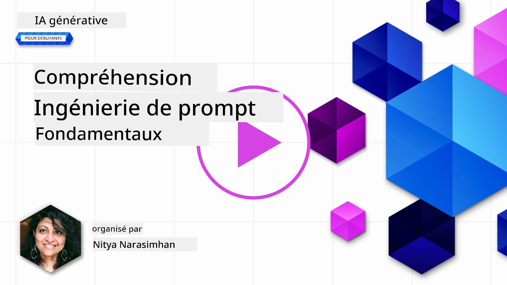
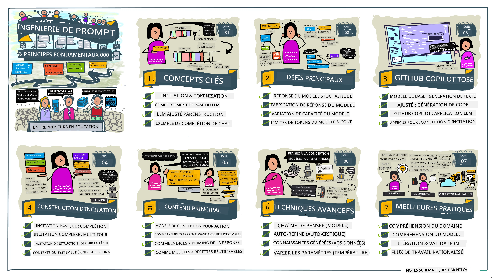
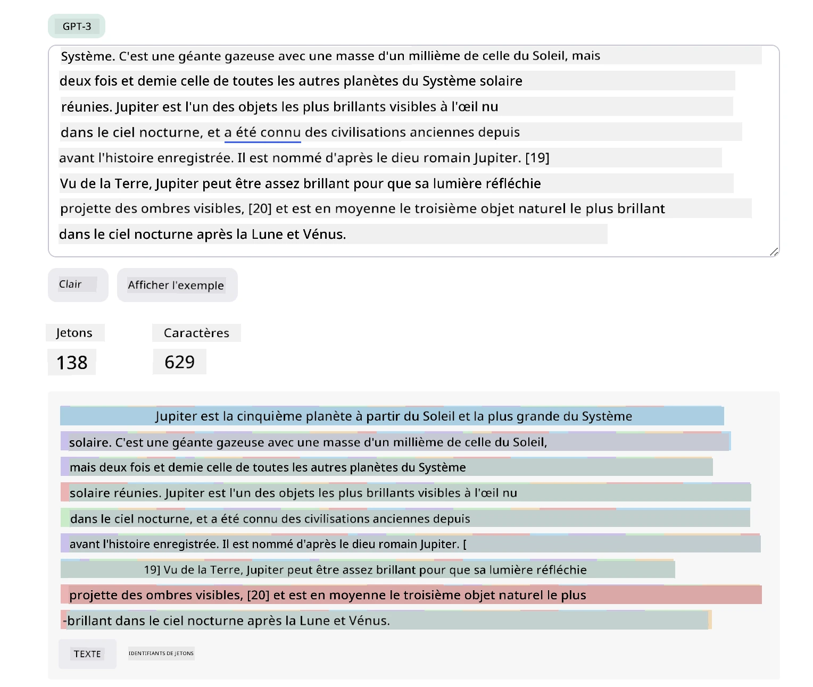
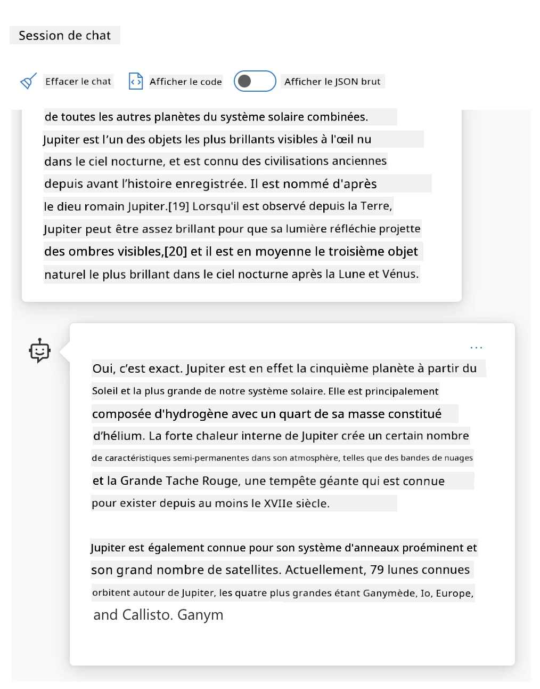
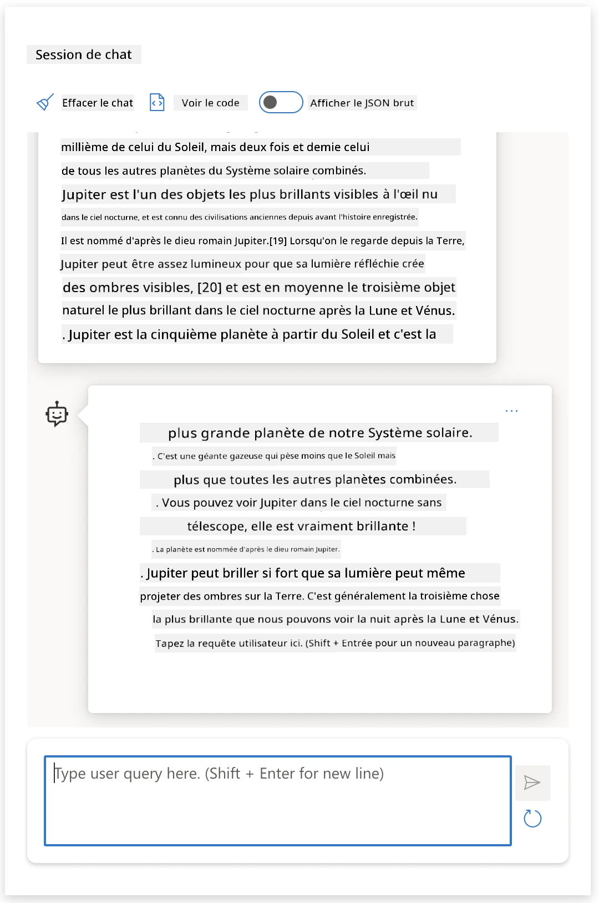
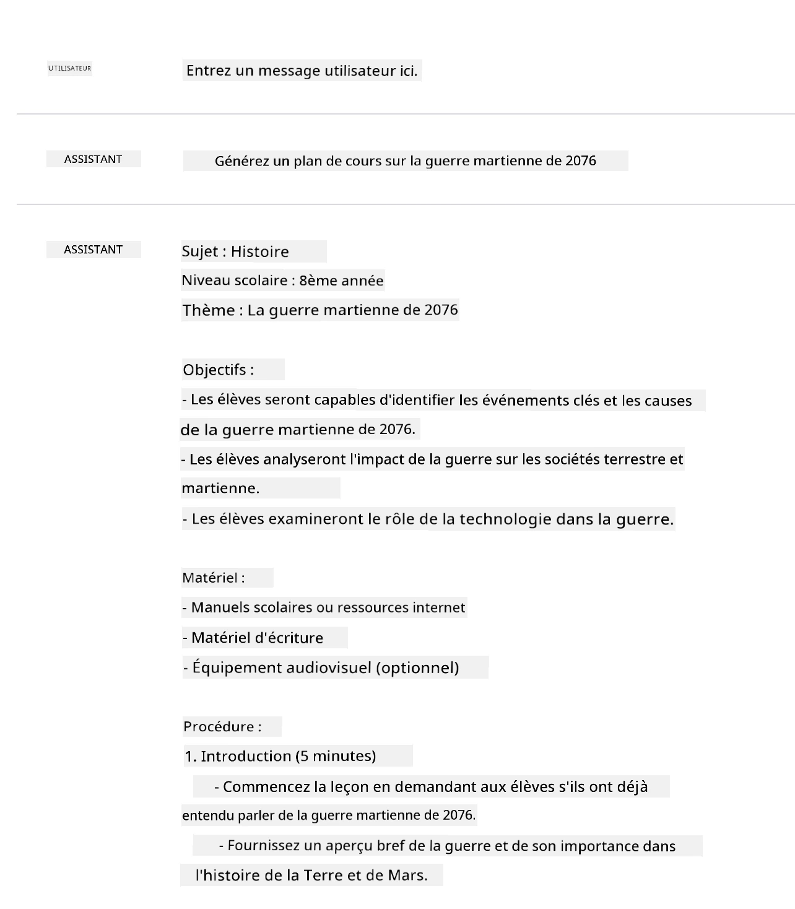
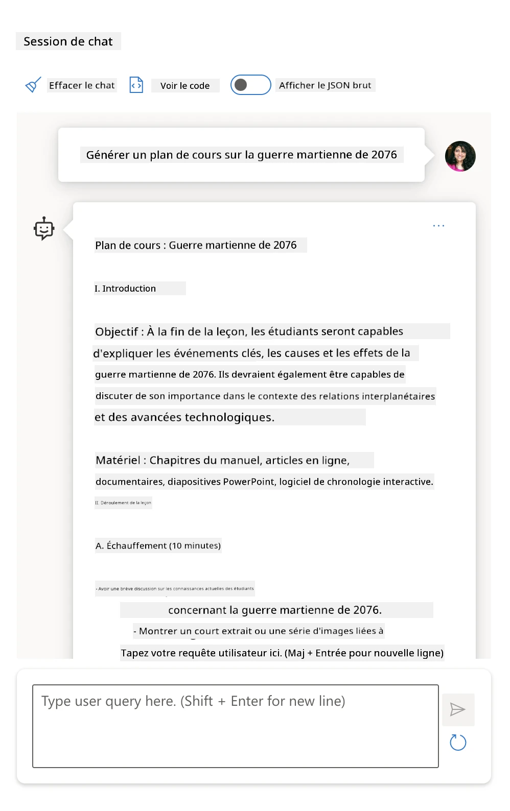
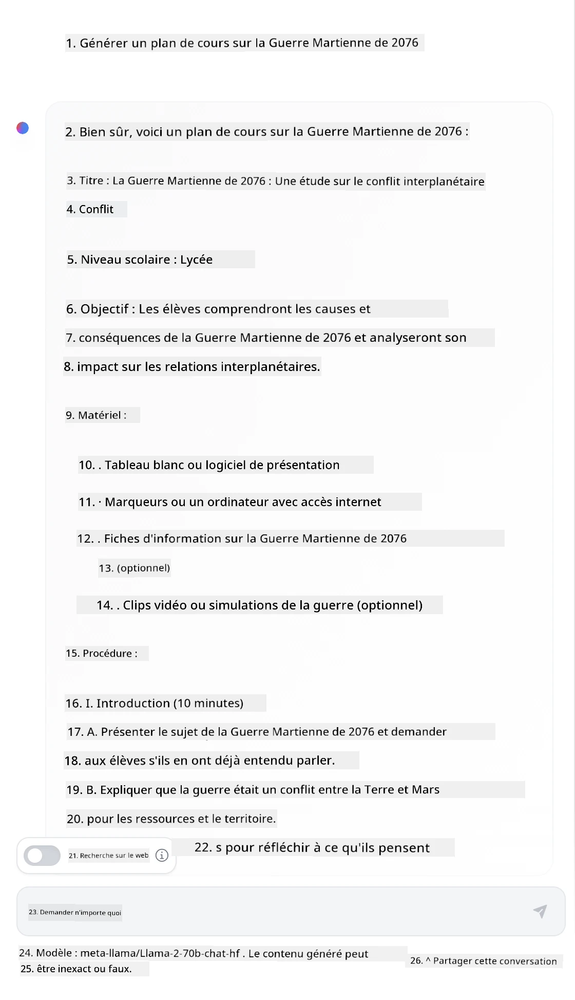

# Fondamentaux de l'Ingénierie des Prompts

[](https://youtu.be/GElCu2kUlRs?si=qrXsBvXnCW12epb8)

## Introduction
Ce module couvre les concepts et techniques essentiels pour créer des prompts efficaces dans les modèles d'IA générative. La manière dont vous rédigez votre prompt à un LLM importe également. Un prompt soigneusement élaboré peut obtenir une meilleure qualité de réponse. Mais que signifient exactement des termes comme _prompt_ et _ingénierie des prompts_ ? Et comment améliorer le _texte du prompt_ que j’envoie au LLM ? Ce sont les questions auxquelles nous allons essayer de répondre dans ce chapitre et le suivant.

_L’IA générative_ est capable de créer de nouveaux contenus (par exemple, texte, images, audio, code, etc.) en réponse aux requêtes des utilisateurs. Elle y parvient en utilisant des _grands modèles de langage_ comme la série GPT d'OpenAI ("Generative Pre-trained Transformer") qui sont entraînés pour utiliser le langage naturel et le code.

Les utilisateurs peuvent désormais interagir avec ces modèles en utilisant des paradigmes familiers comme le chat, sans nécessiter d’expertise technique ni de formation. Les modèles sont _basés sur des prompts_ - les utilisateurs envoient un texte (prompt) et reçoivent la réponse de l’IA (complétion). Ils peuvent ensuite "dialoguer avec l’IA" de façon itérative, dans des conversations à plusieurs tours, affinant leur prompt jusqu’à ce que la réponse corresponde à leurs attentes.

Les "prompts" deviennent désormais la principale _interface de programmation_ pour les applications d’IA générative, indiquant aux modèles ce qu’ils doivent faire et influençant la qualité des réponses retournées. L’"ingénierie des prompts" est un domaine d’étude en forte croissance, axé sur la _conception et l’optimisation_ des prompts afin de fournir des réponses cohérentes et de qualité à grande échelle.

## Objectifs d’apprentissage

Dans cette leçon, nous apprendrons ce qu’est l’ingénierie des prompts, pourquoi elle est importante, et comment concevoir des prompts plus efficaces pour un modèle donné et un objectif applicatif. Nous comprendrons les concepts clés et les bonnes pratiques de l’ingénierie des prompts - et découvrirons un environnement "bac à sable" interactif Jupyter Notebook où nous pourrons voir ces concepts appliqués à des exemples concrets.

À la fin de cette leçon, nous serons capables de :

1. Expliquer ce qu’est l’ingénierie des prompts et pourquoi elle est importante.
2. Décrire les composants d’un prompt et comment ils sont utilisés.
3. Apprendre les meilleures pratiques et techniques pour l’ingénierie des prompts.
4. Appliquer les techniques apprises à des exemples réels, en utilisant un point de terminaison OpenAI.

## Termes Clés

Ingénierie des Prompts : La pratique de concevoir et affiner les entrées pour guider les modèles d’IA à produire des sorties désirées.  
Tokenisation : Le processus de conversion du texte en unités plus petites, appelées tokens, qu’un modèle peut comprendre et traiter.  
LLMs Ajustés par Instruction : Grands modèles de langage (LLMs) qui ont été affinés avec des instructions spécifiques pour améliorer la précision et la pertinence de leurs réponses.

## Bac à sable d’apprentissage

L’ingénierie des prompts est aujourd’hui plus un art qu’une science. La meilleure façon d’améliorer notre intuition est de _pratiquer davantage_ et d’adopter une approche d’essais-erreurs qui combine expertise du domaine applicatif avec les techniques recommandées et les optimisations spécifiques au modèle.

Le Jupyter Notebook accompagné de cette leçon fournit un environnement _bac à sable_ où vous pouvez expérimenter ce que vous apprenez - au fur et à mesure ou dans le cadre du défi de code à la fin. Pour exécuter les exercices, vous aurez besoin de :

1. **Une clé API Azure OpenAI** - le point de terminaison du service pour un LLM déployé.  
2. **Un environnement d’exécution Python** - dans lequel le Notebook peut être exécuté.  
3. **Variables d’environnement locales** - _complétez les étapes [SETUP](./../00-course-setup/02-setup-local.md?WT.mc_id=academic-105485-koreyst) maintenant pour être prêt_.

Le notebook propose des exercices _initiaux_ - mais vous êtes encouragé à ajouter vos propres sections _Markdown_ (description) et _Code_ (requêtes de prompt) pour tester plus d’exemples ou d’idées - et développer votre intuition pour la conception de prompts.

## Guide Illustré

Vous souhaitez avoir une vue d’ensemble de ce que couvre cette leçon avant de plonger dedans ? Découvrez ce guide illustré, qui vous donne une idée des principaux sujets abordés et des points clés à retenir pour chacun. La feuille de route de la leçon vous mène de la compréhension des concepts et défis fondamentaux à leur résolution avec les techniques et bonnes pratiques pertinentes d’ingénierie des prompts. Notez que la section "Techniques avancées" de ce guide fait référence au contenu traité dans le _chapitre suivant_ de ce cursus.



## Notre Startup

Maintenant, parlons de la façon dont _ce sujet_ se rapporte à la mission de notre startup visant à [apporter l’innovation IA à l’éducation](https://educationblog.microsoft.com/2023/06/collaborating-to-bring-ai-innovation-to-education?WT.mc_id=academic-105485-koreyst). Nous voulons créer des applications d’IA basées sur _l’apprentissage personnalisé_ – réfléchissons donc à la façon dont différents utilisateurs de notre application pourraient "concevoir" des prompts :

- **Les administrateurs** pourraient demander à l’IA d’_analyser les données du programme pour identifier les lacunes dans la couverture_. L’IA peut résumer les résultats ou les visualiser avec du code.  
- **Les enseignants** pourraient demander à l’IA de _générer un plan de cours pour un public cible et un sujet donné_. L’IA peut construire le plan personnalisé dans un format spécifié.  
- **Les étudiants** pourraient demander à l’IA _de les accompagner dans une matière difficile_. L’IA peut désormais guider les étudiants avec des leçons, des indices et des exemples adaptés à leur niveau.

Ce n’est que la partie émergée de l’iceberg. Consultez [Prompts For Education](https://github.com/microsoft/prompts-for-edu/tree/main?WT.mc_id=academic-105485-koreyst) - une bibliothèque open-source de prompts sélectionnée par des experts en éducation - pour avoir une idée plus large des possibilités ! _Essayez d’exécuter certains de ces prompts dans le bac à sable ou dans l’OpenAI Playground pour voir ce qui se passe !_

<!--
TEMPLATE DE LEÇON :
Cette unité doit couvrir le concept fondamental #1.
Renforcez le concept avec des exemples et références.

CONCEPT #1 :
Ingénierie des Prompts.
Définissez-le et expliquez pourquoi c’est nécessaire.
-->

## Qu’est-ce que l’Ingénierie des Prompts ?

Nous avons commencé cette leçon en définissant **l’Ingénierie des Prompts** comme le processus de _conception et d’optimisation_ des entrées textuelles (prompts) pour fournir des réponses cohérentes et de qualité (complétions) pour un objectif applicatif et un modèle donnés. Nous pouvons voir cela comme un processus en 2 étapes :

- _concevoir_ le prompt initial pour un modèle et un objectif donnés  
- _affiner_ le prompt de façon itérative pour améliorer la qualité de la réponse

C’est nécessairement un processus d’essais-et-erreurs qui nécessite intuition et efforts de la part de l’utilisateur pour obtenir des résultats optimaux. Alors pourquoi est-ce important ? Pour répondre à cette question, il faut d’abord comprendre trois concepts :

- _Tokenisation_ = comment le modèle "voit" le prompt  
- _LLMs de base_ = comment le modèle fondation "traite" un prompt  
- _LLMs ajustés par instruction_ = comment le modèle peut désormais "comprendre des tâches"

### Tokenisation

Un LLM voit les prompts comme une _séquence de tokens_ où différents modèles (ou versions d’un même modèle) peuvent tokeniser un même prompt de façons différentes. Comme les LLMs sont entraînés sur des tokens (et non sur du texte brut), la manière dont les prompts sont tokenisés a un impact direct sur la qualité de la réponse générée.

Pour comprendre intuitivement la tokenisation, essayez des outils comme le [OpenAI Tokenizer](https://platform.openai.com/tokenizer?WT.mc_id=academic-105485-koreyst) présenté ci-dessous. Copiez-y votre prompt - et voyez comment il est converti en tokens, en faisant attention à la gestion des espaces et des ponctuations. Notez que cet exemple montre un ancien LLM (GPT-3) - l’essayer avec un modèle plus récent peut donner un résultat différent.



### Concept : Modèles Fondation

Une fois un prompt tokenisé, la fonction première du ["LLM de base"](https://blog.gopenai.com/an-introduction-to-base-and-instruction-tuned-large-language-models-8de102c785a6?WT.mc_id=academic-105485-koreyst) (ou modèle fondation) est de prédire le token suivant dans cette séquence. Comme les LLMs sont entraînés sur d’immenses corpus textuels, ils ont une bonne connaissance des relations statistiques entre tokens et peuvent faire cette prédiction avec confiance. Notez qu’ils ne comprennent pas le _sens_ des mots dans le prompt ou le token ; ils perçoivent juste un schéma qu’ils peuvent "compléter" avec leur prédiction suivante. Ils peuvent continuer à prédire la suite jusqu’à interruption par l’utilisateur ou condition préétablie.

Vous voulez voir comment fonctionne la complétion basée sur prompt ? Saisissez le prompt ci-dessus dans le [_Chat Playground_](https://oai.azure.com/playground?WT.mc_id=academic-105485-koreyst) du Azure OpenAI Studio avec les réglages par défaut. Le système est configuré pour considérer les prompts comme des requêtes d’information - vous devriez donc voir une complétion qui respecte ce contexte.

Mais que se passe-t-il si l’utilisateur souhaite voir quelque chose de spécifique répondant à certains critères ou objectifs de tâche ? C’est là qu’entrent en jeu les LLMs _ajustés par instruction_.



### Concept : LLMs Ajustés par Instruction

Un [LLM ajusté par instruction](https://blog.gopenai.com/an-introduction-to-base-and-instruction-tuned-large-language-models-8de102c785a6?WT.mc_id=academic-105485-koreyst) commence avec le modèle fondation et l’affine en utilisant des exemples ou paires entrée/sortie (par exemple, des "messages" à plusieurs tours) qui contiennent des consignes claires - et la réponse de l’IA s’efforce de suivre ces consignes.

Cela utilise des techniques telles que le Reinforcement Learning with Human Feedback (RLHF) qui permettent au modèle de _suivre des instructions_ et _d’apprendre des retours_ pour produire des réponses mieux adaptées aux applications pratiques et plus pertinentes pour les objectifs utilisateurs.

Essayons - reprenez le prompt précédent mais modifiez le _message système_ pour fournir l’instruction suivante en contexte :

> _Résumez le contenu fourni pour un élève de CE1. Limitez le résultat à un paragraphe avec 3-5 points clés._

Voyez comment le résultat est désormais ajusté pour refléter l’objectif et le format désirés ? Un enseignant peut désormais utiliser directement cette réponse dans ses diapositives pour cette classe.



## Pourquoi avons-nous besoin de l’ingénierie des prompts ?

Maintenant que nous savons comment les prompts sont traités par les LLMs, parlons de _pourquoi_ nous avons besoin de l’ingénierie des prompts. La réponse tient au fait que les LLMs actuels posent plusieurs défis qui rendent les _complétions fiables et cohérentes_ plus difficiles à obtenir sans effort de construction et optimisation de prompts. Par exemple :

1. **Les réponses des modèles sont stochastiques.** Le _même prompt_ produira probablement des réponses différentes selon les modèles ou versions de modèle. Et il peut même produire des résultats différents avec le _même modèle_ à différents moments. _Les techniques d’ingénierie des prompts peuvent aider à minimiser ces variations en fournissant de meilleures limites_.

1. **Les modèles peuvent inventer des réponses.** Les modèles sont pré-entraînés avec des ensembles de données _grands mais finis_, ce qui signifie qu’ils manquent de connaissances sur des concepts hors de ce périmètre. En conséquence, ils peuvent produire des complétions inexactes, imaginaires, ou directement contradictoires à des faits connus. _Les techniques d’ingénierie des prompts aident les utilisateurs à identifier et atténuer ces fabrications, par exemple en demandant des citations ou un raisonnement à l’IA_.

1. **Les capacités des modèles varient.** Les modèles plus récents ou de nouvelles générations ont des capacités plus riches mais apportent aussi des singularités et compromis uniques en coût et complexité. _L’ingénierie des prompts peut nous aider à développer des bonnes pratiques et flux de travail qui abstraient ces différences et s’adaptent aux exigences spécifiques des modèles de façon évolutive et fluide_.

Voyons cela en action dans l’OpenAI ou Azure OpenAI Playground :

- Utilisez le même prompt avec différents déploiements de LLM (par exemple OpenAI, Azure OpenAI, Hugging Face) - avez-vous constaté des variations ?  
- Utilisez le même prompt plusieurs fois avec le _même_ déploiement LLM (par exemple Azure OpenAI playground) - comment ces variations diffèrent-elles ?

### Exemple de fabrications

Dans ce cours, nous utilisons le terme **"fabrication"** pour désigner le phénomène où les LLMs génèrent parfois des informations factuellement incorrectes à cause des limites de leur entraînement ou autres contraintes. Vous avez peut-être aussi entendu ce phénomène nommé _"hallucinations"_ dans certains articles ou travaux de recherche. Cependant, nous recommandons fortement d’utiliser _"fabrication"_ afin d’éviter d’anthropomorphiser ce comportement en attribuant un trait humain à un résultat généré par une machine. Cela renforce aussi les [directives d’IA responsable](https://www.microsoft.com/ai/responsible-ai?WT.mc_id=academic-105485-koreyst) du point de vue terminologique, en supprimant des termes pouvant être considérés offensants ou non inclusifs dans certains contextes.

Vous voulez comprendre comment fonctionnent les fabrications ? Pensez à un prompt qui demande à l’IA de générer du contenu sur un sujet inexistant (pour s’assurer qu’il ne figure pas dans les données d’entraînement). Par exemple - j’ai essayé ce prompt :

> **Prompt :** générer un plan de cours sur la guerre martienne de 2076.
Une recherche sur le web m’a montré qu’il existait des récits fictifs (par exemple, des séries télévisées ou des livres) sur des guerres martiennes – mais aucun en 2076. Le bon sens nous dit aussi que 2076 est _dans le futur_ et ne peut donc pas être associé à un événement réel.

Alors, que se passe-t-il lorsque nous soumettons cette requête à différents fournisseurs de LLM ?

> **Réponse 1** : OpenAI Playground (GPT-35)



> **Réponse 2** : Azure OpenAI Playground (GPT-35)



> **Réponse 3** : : Hugging Face Chat Playground (LLama-2)



Comme prévu, chaque modèle (ou version de modèle) produit des réponses légèrement différentes grâce au comportement stochastique et aux variations de capacité des modèles. Par exemple, un modèle cible un public de niveau 8e tandis qu’un autre suppose un lycéen. Mais les trois modèles ont généré des réponses qui pourraient convaincre un utilisateur non informé que l’événement était réel.

Les techniques d’ingénierie de prompt comme le _metaprompting_ et la _configuration de la température_ peuvent réduire quelque peu les fabrications des modèles. De nouvelles _architectures_ d’ingénierie de prompt intègrent aussi de nouveaux outils et techniques de manière fluide dans le flux du prompt, pour atténuer ou réduire certains de ces effets.

## Étude de cas : GitHub Copilot

Terminons cette section en ayant une idée de la façon dont l’ingénierie de prompt est utilisée dans des solutions réelles en regardant une étude de cas : [GitHub Copilot](https://github.com/features/copilot?WT.mc_id=academic-105485-koreyst).

GitHub Copilot est votre « Programmeur IA en binôme » – il convertit des requêtes textuelles en complétions de code et est intégré dans votre environnement de développement (par exemple, Visual Studio Code) pour une expérience utilisateur fluide. Comme documenté dans la série de blogs ci-dessous, la première version reposait sur le modèle OpenAI Codex – les ingénieurs réalisant rapidement la nécessité d’affiner le modèle et de développer de meilleures techniques d’ingénierie de prompt, pour améliorer la qualité du code. En juillet, ils ont [lancé un modèle IA amélioré qui dépasse Codex](https://github.blog/2023-07-28-smarter-more-efficient-coding-github-copilot-goes-beyond-codex-with-improved-ai-model/?WT.mc_id=academic-105485-koreyst) pour des suggestions encore plus rapides.

Lisez les articles dans l’ordre pour suivre leur parcours d’apprentissage.

- **Mai 2023** | [GitHub Copilot s’améliore dans la compréhension de votre code](https://github.blog/2023-05-17-how-github-copilot-is-getting-better-at-understanding-your-code/?WT.mc_id=academic-105485-koreyst)
- **Mai 2023** | [À l’intérieur de GitHub : Travailler avec les LLMs derrière GitHub Copilot](https://github.blog/2023-05-17-inside-github-working-with-the-llms-behind-github-copilot/?WT.mc_id=academic-105485-koreyst)
- **Juin 2023** | [Comment écrire de meilleurs prompts pour GitHub Copilot](https://github.blog/2023-06-20-how-to-write-better-prompts-for-github-copilot/?WT.mc_id=academic-105485-koreyst)
- **Juillet 2023** | [.. GitHub Copilot dépasse Codex avec un modèle IA amélioré](https://github.blog/2023-07-28-smarter-more-efficient-coding-github-copilot-goes-beyond-codex-with-improved-ai-model/?WT.mc_id=academic-105485-koreyst)
- **Juillet 2023** | [Guide du développeur pour l’ingénierie de prompt et les LLMs](https://github.blog/2023-07-17-prompt-engineering-guide-generative-ai-llms/?WT.mc_id=academic-105485-koreyst)
- **Septembre 2023** | [Comment construire une application LLM d’entreprise : leçons de GitHub Copilot](https://github.blog/2023-09-06-how-to-build-an-enterprise-llm-application-lessons-from-github-copilot/?WT.mc_id=academic-105485-koreyst)

Vous pouvez aussi parcourir leur [blog sur l’ingénierie](https://github.blog/category/engineering/?WT.mc_id=academic-105485-koreyst) pour d’autres articles comme [celui-ci](https://github.blog/2023-09-27-how-i-used-github-copilot-chat-to-build-a-reactjs-gallery-prototype/?WT.mc_id=academic-105485-koreyst) qui montre comment ces modèles et techniques sont _appliqués_ pour piloter des applications concrètes.

---

<!--
LESSON TEMPLATE:
This unit should cover core concept #2.
Reinforce the concept with examples and references.

CONCEPT #2:
Prompt Design.
Illustrated with examples.
-->

## Construction de Prompt

Nous avons vu pourquoi l’ingénierie de prompt est importante – maintenant comprenons comment les prompts sont _construits_ pour que nous puissions évaluer différentes techniques pour concevoir des prompts plus efficaces.

### Prompt basique

Commençons par le prompt basique : une saisie textuelle envoyée au modèle sans autre contexte. Voici un exemple – lorsque nous envoyons les premiers mots de l’hymne national américain à l’[API de complétion OpenAI](https://platform.openai.com/docs/api-reference/completions?WT.mc_id=academic-105485-koreyst) il complète instantanément la réponse avec les lignes suivantes, illustrant le comportement de prédiction basique.

| Prompt (Entrée)     | Complétion (Sortie)                                                                                                                         |
| :----------------- | :----------------------------------------------------------------------------------------------------------------------------------------- |
| Oh say can you see | On dirait que vous commencez les paroles de « The Star-Spangled Banner », l’hymne national des États-Unis. Les paroles complètes sont ... |

### Prompt complexe

Maintenant, ajoutons contexte et instructions à ce prompt basique. L’[API de chat completions](https://learn.microsoft.com/azure/ai-services/openai/how-to/chatgpt?WT.mc_id=academic-105485-koreyst) nous permet de construire un prompt complexe comme une collection de _messages_ avec :

- Paires entrée/sortie reflétant l’entrée _utilisateur_ et la réponse _assistant_.
- Message système fixant le contexte pour le comportement ou la personnalité de l’assistant.

La requête est maintenant sous la forme ci-dessous, où la _tokenisation_ capture efficacement les informations pertinentes du contexte et de la conversation. Maintenant, changer le contexte système peut être aussi impactant sur la qualité des complétions, que les entrées utilisateur fournies.

```python
response = openai.chat.completions.create(
    model="gpt-3.5-turbo",
    messages=[
        {"role": "system", "content": "You are a helpful assistant."},
        {"role": "user", "content": "Who won the world series in 2020?"},
        {"role": "assistant", "content": "The Los Angeles Dodgers won the World Series in 2020."},
        {"role": "user", "content": "Where was it played?"}
    ]
)
```

### Prompt d’instruction

Dans les exemples ci-dessus, le prompt utilisateur était une simple requête texte pouvant être interprétée comme une demande d’information. Avec les prompts _d’instruction_, nous pouvons utiliser ce texte pour spécifier une tâche plus en détail, fournissant ainsi une meilleure orientation à l’IA. Voici un exemple :

| Prompt (Entrée)                                                                                                                                                                                                                         | Complétion (Sortie)                                                                                                         | Type d’instruction |
| :------------------------------------------------------------------------------------------------------------------------------------------------------------------------------------------------------------------------------------- | :-------------------------------------------------------------------------------------------------------------------------- | :------------------ |
| Écris une description de la Guerre Civile                                                                                                                                                                                             | _a retourné un paragraphe simple_                                                                                           | Simple              |
| Écris une description de la Guerre Civile. Fournis les dates et événements clés et décris leur importance                                                                                                                                 | _a retourné un paragraphe suivi d’une liste des dates clés avec descriptions_                                               | Complexe            |
| Écris une description de la Guerre Civile en 1 paragraphe. Fournis 3 points à puces avec les dates clés et leur importance. Fournis 3 autres points à puces avec des figures historiques clés et leurs contributions. Renvoie le résultat sous forme de fichier JSON | _retourne plus de détails dans une zone de texte, formatée en JSON que vous pouvez copier-coller dans un fichier et valider_ | Complexe. Formaté.   |

## Contenu principal

Dans les exemples ci-dessus, le prompt restait assez ouvert afin de laisser le LLM décider quelle partie de son ensemble de données pré-entraînées était pertinente. Avec le patron de conception _contenu principal_, le texte d’entrée est divisé en deux parties :

- une consigne (action)
- contenu pertinent (qui influence l’action)

Voici un exemple où la consigne est « résume ceci en 2 phrases ».

| Prompt (Entrée)                                                                                                                                                                                                                                                                                                                                                                                                                                                                                                                                                                                                                                                                                     | Complétion (Sortie)                                                                                                                                                                                                                                                                           |
| :------------------------------------------------------------------------------------------------------------------------------------------------------------------------------------------------------------------------------------------------------------------------------------------------------------------------------------------------------------------------------------------------------------------------------------------------------------------------------------------------------------------------------------------------------------------------------------------------------------------------------------------------------------------------------------------------- | :-------------------------------------------------------------------------------------------------------------------------------------------------------------------------------------------------------------------------------------------------------------------------------------------- |
| Jupiter est la cinquième planète à partir du Soleil et la plus grande du Système solaire. C’est une géante gazeuse avec une masse mille fois inférieure à celle du Soleil, mais deux fois et demie celle de toutes les autres planètes du Système solaire réunies. Jupiter est l’un des objets les plus brillants visibles à l’œil nu dans le ciel nocturne, et était connu des civilisations anciennes bien avant l’histoire écrite. Il tire son nom du dieu romain Jupiter.[19] Vu depuis la Terre, Jupiter peut être assez lumineux pour que sa lumière réfléchie projette des ombres visibles,[20] et est en moyenne le troisième objet naturel le plus brillant du ciel nocturne, après la Lune et Vénus. <br/> **Résume ceci en 2 courtes phrases** | Jupiter, cinquième planète à partir du Soleil, est la plus grande du Système solaire et est connue pour être l’un des objets les plus brillants du ciel nocturne. Nommée d’après le dieu romain Jupiter, c’est une géante gazeuse dont la masse est deux fois et demie celle de toutes les autres planètes du Système solaire réunies. |

Le segment de contenu principal peut être utilisé de différentes façons pour générer des instructions plus efficaces :

- **Exemples** – au lieu de dire explicitement au modèle quoi faire par une instruction claire, donnez-lui des exemples de ce qu’il doit faire et laissez-le déduire le schéma.
- **Indices** – suivez la consigne avec un « indice » qui amorce la complétion, guidant le modèle vers des réponses plus pertinentes.
- **Modèles** – ce sont des « recettes » répétables pour les prompts avec des espaces réservés (variables) que l’on peut personnaliser avec des données pour des cas d’usage spécifiques.

Explorons tout cela en pratique.

### Utiliser des exemples

C’est une méthode où vous utilisez le contenu principal pour « nourrir le modèle » avec des exemples de la sortie souhaitée pour une tâche donnée, et laissez-le déduire le schéma de sortie attendu. Selon le nombre d’exemples fournis, on peut avoir du zero-shot prompting, one-shot prompting, few-shot prompting, etc.

Le prompt comporte maintenant trois composants :

- Une description de la tâche
- Quelques exemples de la sortie souhaitée
- Le début d’un nouvel exemple (qui devient une description implicite de la tâche)

| Type d’apprentissage | Prompt (Entrée)                                                                                                                                        | Complétion (Sortie)      |
| :-------------------- | :---------------------------------------------------------------------------------------------------------------------------------------------------- | :----------------------- |
| Zero-shot             | « The Sun is Shining ». Traduire en espagnol                                                                                                          | « El Sol está brillando. » |
| One-shot              | « The Sun is Shining » => « El Sol está brillando. » <br> « It’s a Cold and Windy Day » =>                                                           | « Es un día frío y ventoso. » |
| Few-shot              | The player ran the bases => Baseball <br/> The player hit an ace => Tennis <br/> The player hit a six => Cricket <br/> The player made a slam-dunk =>     | Basketball               |
|                       |                                                                                                                                                       |                          |

Notez comment on a dû fournir une instruction explicite (« Traduire en espagnol ») dans le zero-shot prompting, mais qu’elle est déduite dans l’exemple one-shot. L’exemple few-shot montre comment ajouter plus d’exemples permet aux modèles de faire des inférences plus précises sans instructions supplémentaires.

### Indices de prompt

Une autre technique pour utiliser le contenu principal est de fournir des _indices_ plutôt que des exemples. Dans ce cas, on donne au modèle un coup de pouce dans la bonne direction en _le démarrant_ par un extrait qui reflète le format de réponse souhaité. Le modèle « prend l’indice » pour continuer dans cette veine.

| Nombre d’indices | Prompt (Entrée)                                                                                                                                                                                                                                                                                                                                                                                          | Complétion (Sortie)                                                                                                                                                                                                                                                                             |
| :---------------- | :-------------------------------------------------------------------------------------------------------------------------------------------------------------------------------------------------------------------------------------------------------------------------------------------------------------------------------------------------------------------------------------------------------- | :---------------------------------------------------------------------------------------------------------------------------------------------------------------------------------------------------------------------------------------------------------------------------------------------- |
| 0                | Jupiter est la cinquième planète à partir du Soleil et la plus grande du Système solaire. C’est une géante gazeuse avec une masse mille fois inférieure à celle du Soleil, mais deux fois et demie celle de toutes les autres planètes du Système solaire réunies. Jupiter est l’un des objets les plus brillants visibles à l’œil nu dans le ciel nocturne, et était connu des civilisations anciennes bien avant l’histoire écrite. <br/>**Résume ceci**             | Jupiter est la plus grande planète de notre Système solaire et la cinquième à partir du Soleil. C’est une géante gazeuse dont la masse est 1/1000 de celle du Soleil, mais elle est plus lourde que toutes les autres planètes réunies. Les civilisations anciennes connaissent Jupiter depuis longtemps, et il est facilement visible dans le ciel nocturne. |
| 1              | Jupiter est la cinquième planète à partir du Soleil et la plus grande du Système solaire. C'est une géante gazeuse dont la masse est un millième de celle du Soleil, mais deux fois et demie celle de toutes les autres planètes du Système solaire réunies. Jupiter est l’un des objets les plus brillants visibles à l'œil nu dans le ciel nocturne, et elle est connue des civilisations anciennes depuis avant l’histoire enregistrée. <br/>**Résumez ceci** <br/> Ce que nous avons appris, c’est que Jupiter | est la cinquième planète à partir du Soleil et la plus grande du Système solaire. C'est une géante gazeuse dont la masse est un millième de celle du Soleil, mais deux fois et demie celle de toutes les autres planètes réunies. Elle est facilement visible à l'œil nu et est connue depuis l’antiquité.                        |
| 2              | Jupiter est la cinquième planète à partir du Soleil et la plus grande du Système solaire. C'est une géante gazeuse dont la masse est un millième de celle du Soleil, mais deux fois et demie celle de toutes les autres planètes du Système solaire réunies. Jupiter est l’un des objets les plus brillants visibles à l'œil nu dans le ciel nocturne, et elle est connue des civilisations anciennes depuis avant l’histoire enregistrée. <br/>**Résumez ceci** <br/> Top 3 des faits que nous avons appris :         | 1. Jupiter est la cinquième planète à partir du Soleil et la plus grande du Système solaire. <br/> 2. C'est une géante gazeuse dont la masse est un millième de celle du Soleil...<br/> 3. Jupiter est visible à l'œil nu depuis l’antiquité ...                                                                       |
|                |                                                                                                                                                                                                                                                                                                                                                                                                                                                              |                                                                                                                                                                                                                                                                                                           |

### Modèles de prompt

Un modèle de prompt est une _recette pré-définie pour un prompt_ qui peut être stockée et réutilisée selon les besoins, afin de garantir des expériences utilisateurs plus cohérentes à grande échelle. Dans sa forme la plus simple, il s'agit simplement d'une collection d'exemples de prompt comme [celui-ci d'OpenAI](https://platform.openai.com/examples?WT.mc_id=academic-105485-koreyst) qui fournit à la fois les composants interactifs du prompt (messages utilisateur et système) et le format de requête piloté par API – pour supporter la réutilisation.

Dans sa forme plus complexe comme [cet exemple de LangChain](https://python.langchain.com/docs/concepts/prompt_templates/?WT.mc_id=academic-105485-koreyst), il contient des _espaces réservés_ qui peuvent être remplacés par des données issues de diverses sources (entrée utilisateur, contexte système, sources de données externes, etc.) pour générer un prompt dynamiquement. Cela nous permet de créer une bibliothèque de prompts réutilisables qui peuvent être utilisés pour offrir des expériences utilisateurs cohérentes **programmatiquement** à grande échelle.

Enfin, la vraie valeur des modèles réside dans la capacité à créer et publier des _bibliothèques de prompts_ pour des domaines d'application verticaux – où le modèle de prompt est désormais _optimisé_ pour refléter un contexte spécifique à l'application ou des exemples qui rendent les réponses plus pertinentes et précises pour le public cible. Le référentiel [Prompts For Edu](https://github.com/microsoft/prompts-for-edu?WT.mc_id=academic-105485-koreyst) est un excellent exemple de cette approche, regroupant une bibliothèque de prompts pour le domaine de l’éducation avec un accent sur les objectifs clés tels que la planification des leçons, la conception des programmes, le tutorat des étudiants, etc.

## Contenu de soutien

Si l’on considère la construction d’un prompt comme ayant une instruction (tâche) et un contenu cible (contenu principal), alors le _contenu secondaire_ est comme un contexte supplémentaire que nous fournissons pour **influencer la sortie d’une certaine manière**. Ce peuvent être des paramètres d’ajustement, des instructions de mise en forme, des taxonomies de sujets, etc. qui aident le modèle à _adapter_ sa réponse pour correspondre aux objectifs ou attentes souhaités de l’utilisateur.

Par exemple : étant donné un catalogue de cours avec des métadonnées étendues (nom, description, niveau, étiquettes de métadonnées, enseignant, etc.) sur tous les cours disponibles dans le programme :

- on peut définir une instruction pour « résumer le catalogue de cours de l’automne 2023 »
- on peut utiliser le contenu principal pour fournir quelques exemples du résultat attendu
- on peut utiliser le contenu secondaire pour identifier les 5 principales « étiquettes » d’intérêt.

Le modèle peut alors fournir un résumé dans le format montré par les exemples – mais si un résultat contient plusieurs étiquettes, il peut prioriser les 5 étiquettes identifiées dans le contenu secondaire.

---

<!--
MODÈLE DE LEÇON :
Cette unité devrait couvrir le concept principal #1.
Renforcer le concept avec des exemples et des références.

CONCEPT #3 :
Techniques de prompt engineering.
Quelles sont quelques techniques de base pour le prompt engineering ?
Illustrer avec des exercices.
-->

## Bonnes pratiques de prompt

Maintenant que nous savons comment les prompts peuvent être _construits_, nous pouvons commencer à réfléchir à leur _conception_ pour refléter les meilleures pratiques. On peut y réfléchir en deux parties – adopter le bon _état d’esprit_ et appliquer les bonnes _techniques_.

### État d’esprit pour le prompt engineering

Le prompt engineering est un processus par essais et erreurs, gardez donc à l’esprit trois grands facteurs directeurs :

1. **La compréhension du domaine est importante.** La précision et la pertinence des réponses dépendent du _domaine_ dans lequel l’application ou l’utilisateur opère. Appliquez votre intuition et votre expertise de domaine pour **personnaliser davantage les techniques**. Par exemple, définissez des _personnalités spécifiques au domaine_ dans vos prompts système, ou utilisez des _modèles spécifiques au domaine_ dans les prompts utilisateurs. Fournissez un contenu secondaire qui reflète les contextes spécifiques au domaine, ou utilisez des _indices et exemples spécifiques au domaine_ pour guider le modèle vers des usages familiers.

2. **La compréhension du modèle compte.** Nous savons que les modèles sont stochastiques par nature. Mais les implémentations peuvent aussi varier selon le jeu de données d’entraînement utilisé (connaissances pré-entraînées), les capacités disponibles (API ou SDK) et le type de contenu pour lequel ils sont optimisés (par exemple, code vs images vs texte). Comprenez les forces et limites du modèle que vous utilisez, et utilisez ces connaissances pour _prioriser les tâches_ ou construire des _modèles personnalisés_ optimisés pour les capacités du modèle.

3. **L’itération et la validation sont essentielles.** Les modèles évoluent rapidement, tout comme les techniques de prompt engineering. En tant qu’expert du domaine, vous pouvez avoir un autre contexte ou des critères propres à _votre_ application spécifique, qui peuvent ne pas s’appliquer à la communauté plus large. Utilisez les outils et techniques de prompt engineering pour « démarrer » la construction des prompts, puis itérez et validez les résultats avec votre propre intuition et expertise du domaine. Enregistrez vos idées et créez une **base de connaissances** (ex. bibliothèques de prompts) qui pourra servir de nouvelle référence pour d’autres, pour accélérer les itérations futures.

## Bonnes pratiques

Examinons maintenant les bonnes pratiques recommandées par les praticiens de [OpenAI](https://help.openai.com/en/articles/6654000-best-practices-for-prompt-engineering-with-openai-api?WT.mc_id=academic-105485-koreyst) et [Azure OpenAI](https://learn.microsoft.com/azure/ai-services/openai/concepts/prompt-engineering#best-practices?WT.mc_id=academic-105485-koreyst).

| Quoi                              | Pourquoi                                                                                                                                                                                                                                               |
| :-------------------------------- | :------------------------------------------------------------------------------------------------------------------------------------------------------------------------------------------------------------------------------------------------ |
| Évaluer les modèles récents.       | Les nouvelles générations de modèles ont probablement des fonctionnalités et qualités améliorées – mais peuvent aussi engendrer des coûts plus élevés. Évaluez-les pour leur impact, puis prenez des décisions de migration.                                                                               |
| Séparer instructions & contexte   | Vérifiez si votre modèle/fournisseur définit des _délimiteurs_ pour distinguer plus clairement les instructions, le contenu principal et le contenu secondaire. Cela aide les modèles à attribuer plus précisément les poids aux tokens.                                      |
| Soyez précis et clair             | Fournissez plus de détails sur le contexte, le résultat, la longueur, le format, le style souhaités, etc. Cela améliore à la fois la qualité et la cohérence des réponses. Capturez les recettes dans des modèles réutilisables.                                                       |
| Soyez descriptif, utilisez des exemples | Les modèles peuvent mieux répondre à une approche de type "montrer et expliquer". Commencez avec une approche `zero-shot` où vous donnez une instruction (sans exemple), puis essayez `few-shot` comme raffinement, en fournissant quelques exemples du résultat attendu. Utilisez des analogies. |
| Utilisez des indices pour amorcer les complétions | Orientez le modèle vers le résultat souhaité en lui fournissant quelques mots ou phrases d’amorce qu’il pourra utiliser comme point de départ pour la réponse.                                                                                                               |
| Renforcez                        | Parfois, vous devrez peut-être vous répéter auprès du modèle. Donnez des instructions avant et après votre contenu principal, utilisez une instruction et un indice, etc. Itérez et validez pour voir ce qui fonctionne.                                                         |
| L’ordre compte                   | L’ordre dans lequel vous présentez l’information au modèle peut influencer la sortie, même dans les exemples d’apprentissage, à cause du biais de récence. Essayez différentes options pour trouver ce qui fonctionne le mieux.                                                               |
| Donnez une "issue de secours" au modèle  | Donnez au modèle une réponse de _repli_ qu’il peut fournir s’il ne peut pas accomplir la tâche pour une raison quelconque. Cela réduit les chances que le modèle génère des réponses fausses ou inventées.                                                         |
|                                   |                                                                                                                                                                                                                                                   |

Comme pour toute bonne pratique, rappelez-vous que _vos résultats peuvent varier_ selon le modèle, la tâche et le domaine. Utilisez-les comme point de départ et itérez pour trouver ce qui convient le mieux pour vous. Réévaluez continuellement votre processus de prompt engineering à mesure que de nouveaux modèles et outils apparaissent, en mettant l’accent sur la montée en échelle du processus et la qualité des réponses.

<!--
MODÈLE DE LEÇON :
Cette unité devrait fournir un défi de code si applicable

DÉFI :
Lien vers un Jupyter Notebook avec seulement les commentaires dans le code (sections de code vides).

SOLUTION :
Lien vers une copie de ce Notebook avec les prompts remplis et exécutés, montrant un exemple de sortie.
-->

## Devoir

Félicitations ! Vous êtes arrivé à la fin de la leçon ! Il est temps de mettre certains de ces concepts et techniques à l’épreuve avec des exemples concrets !

Pour notre devoir, nous utiliserons un Jupyter Notebook avec des exercices que vous pouvez compléter de manière interactive. Vous pouvez aussi étendre le Notebook avec vos propres cellules Markdown et Code pour explorer des idées et techniques par vous-même.

### Pour commencer, forkez le dépôt, puis

- (Recommandé) Lancez GitHub Codespaces
- (Alternativement) Clonez le dépôt sur votre appareil local et utilisez-le avec Docker Desktop
- (Alternativement) Ouvrez le Notebook avec l’environnement de Notebook de votre choix.

### Ensuite, configurez vos variables d’environnement

- Copiez le fichier `.env.copy` à la racine du dépôt dans `.env` puis remplissez les valeurs `AZURE_OPENAI_API_KEY`, `AZURE_OPENAI_ENDPOINT` et `AZURE_OPENAI_DEPLOYMENT`. Revenez à la [section Learning Sandbox](../../../04-prompt-engineering-fundamentals) pour apprendre comment faire.

### Ensuite, ouvrez le Jupyter Notebook

- Sélectionnez le kernel d’exécution. Si vous utilisez les options 1 ou 2, sélectionnez simplement le kernel Python 3.10.x par défaut fourni par le conteneur de développement.

Vous êtes prêt à exécuter les exercices. Notez qu’il n’y a pas de réponses _justes ou fausses_ ici – il s’agit d’explorer des options par essais et erreurs et de construire une intuition sur ce qui fonctionne pour un modèle donné et un domaine d’application.

_Pour cette raison, il n’y a pas de segments de solution de code dans cette leçon. À la place, le Notebook comportera des cellules Markdown intitulées "Ma Solution :" qui montrent un exemple de sortie pour référence._

 <!--
MODÈLE DE LEÇON :
Concluez la section avec un résumé et des ressources pour l’auto-apprentissage.
-->

## Vérification des connaissances

Lequel des prompts suivants est un bon exemple respectant quelques bonnes pratiques raisonnables ?

1. Montre-moi une image d’une voiture rouge
2. Montre-moi une image d’une voiture rouge de marque Volvo et modèle XC90 garée au bord d’une falaise avec le soleil couchant
3. Montre-moi une image d’une voiture rouge de marque Volvo et modèle XC90

R : 2, c’est le meilleur prompt car il fournit des détails sur le "quoi" et entre dans les spécificités (pas n’importe quelle voiture mais une marque et modèle précis) et décrit aussi le cadre général. 3 est le deuxième meilleur car il contient également beaucoup de description.

## 🚀 Défi

Voyez si vous pouvez exploiter la technique de "l’indice" avec le prompt : Complétez la phrase "Montre-moi une image d’une voiture rouge de marque Volvo et ". Que répond-il, et comment l’amélioreriez-vous ?

## Excellent travail ! Continuez votre apprentissage

Vous souhaitez en savoir plus sur les différents concepts de prompt engineering ? Rendez-vous sur la [page d’apprentissage continu](https://aka.ms/genai-collection?WT.mc_id=academic-105485-koreyst) pour trouver d’autres excellentes ressources sur ce sujet.

Dirigez-vous vers la leçon 5 où nous aborderons les [techniques avancées de prompting](../05-advanced-prompts/README.md?WT.mc_id=academic-105485-koreyst) !

---

<!-- CO-OP TRANSLATOR DISCLAIMER START -->
**Avis de non-responsabilité** :
Ce document a été traduit à l’aide du service de traduction automatique [Co-op Translator](https://github.com/Azure/co-op-translator). Bien que nous nous efforçons d’assurer l’exactitude, veuillez noter que les traductions automatisées peuvent contenir des erreurs ou des inexactitudes. Le document original dans sa langue d’origine doit être considéré comme la source faisant autorité. Pour les informations critiques, il est recommandé de recourir à une traduction professionnelle humaine. Nous ne saurions être tenus responsables des malentendus ou des mauvaises interprétations résultant de l’utilisation de cette traduction.
<!-- CO-OP TRANSLATOR DISCLAIMER END -->