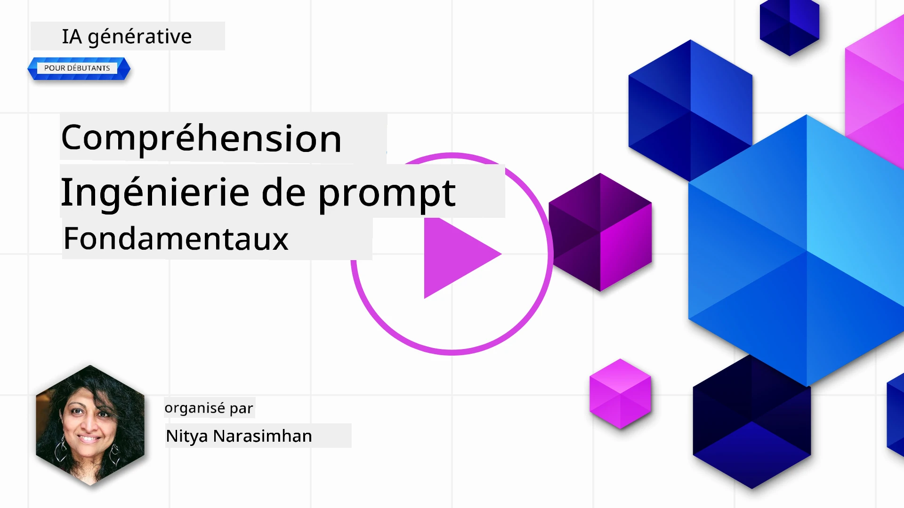
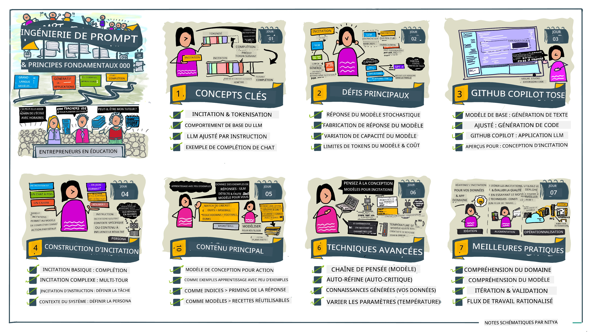
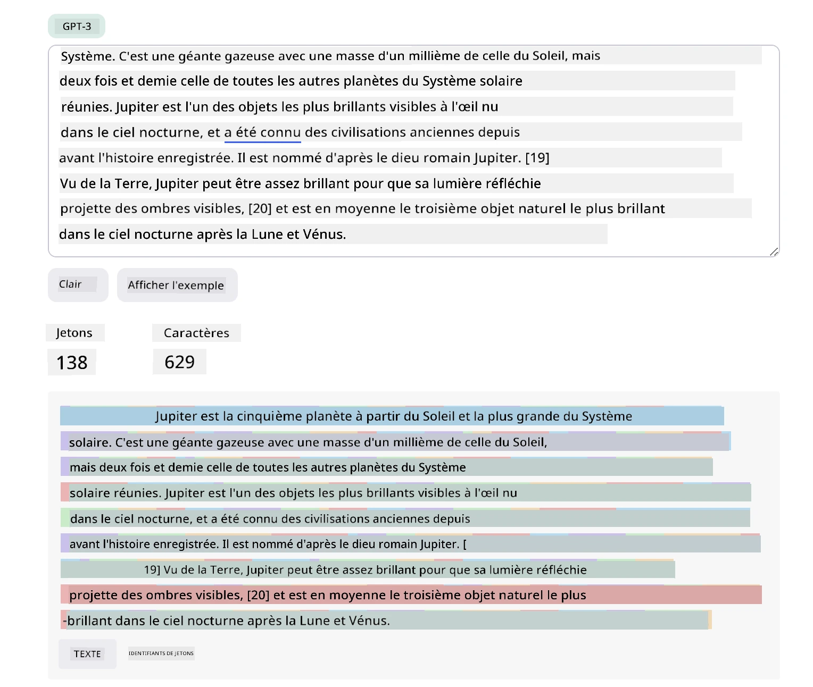
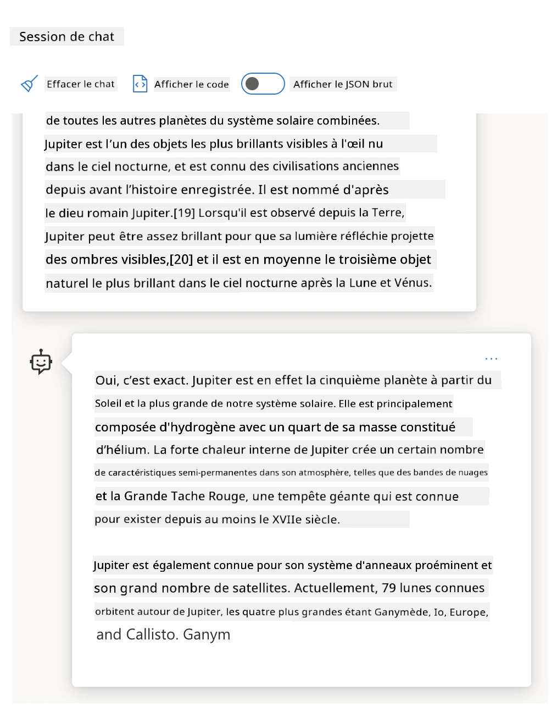
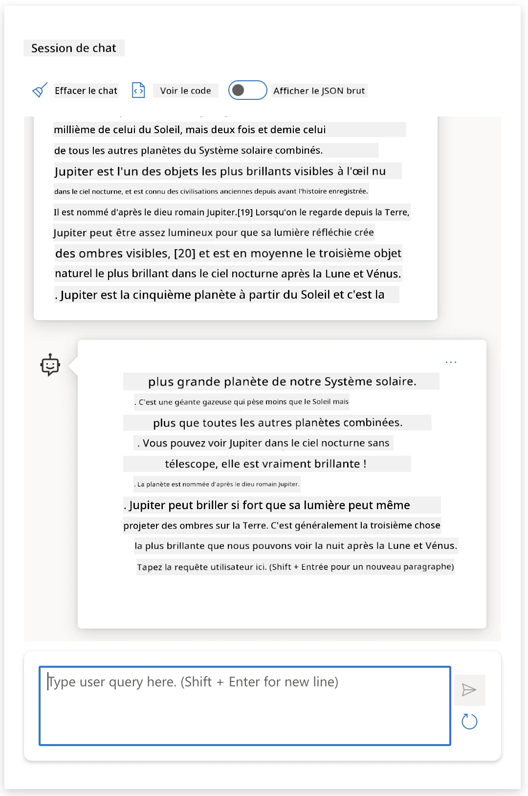
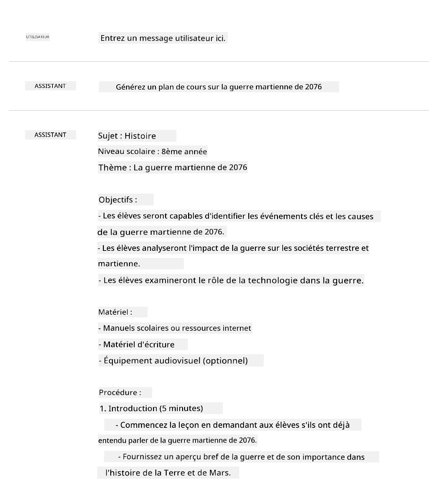
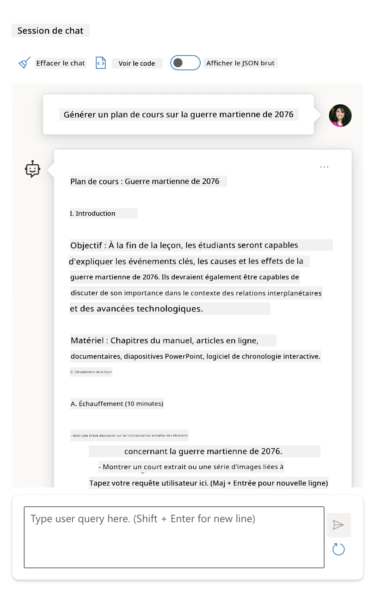
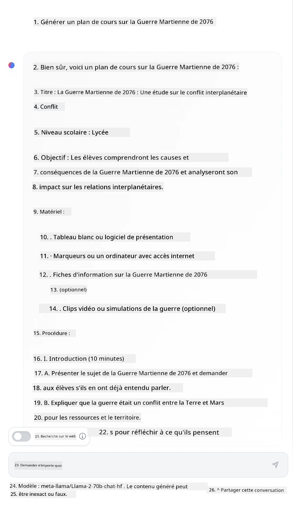

# Fondamentaux de l'Ingénierie des Prompts

[](https://youtu.be/GElCu2kUlRs?si=qrXsBvXnCW12epb8)

## Introduction
Ce module couvre les concepts essentiels et les techniques pour créer des prompts efficaces dans les modèles d'IA générative. La façon dont vous rédigez votre prompt à un LLM est également importante. Un prompt soigneusement élaboré peut obtenir une meilleure qualité de réponse. Mais que signifient exactement les termes _prompt_ et _ingénierie des prompts_ ? Et comment améliorer le _prompt_ en entrée que j'envoie au LLM ? Ce sont les questions auxquelles nous essaierons de répondre dans ce chapitre et le suivant.

_L'IA générative_ est capable de créer du contenu nouveau (par exemple, texte, images, audio, code, etc.) en réponse aux demandes des utilisateurs. Elle y parvient en utilisant des _Grands Modèles de Langage_ comme la série GPT d'OpenAI ("Generative Pre-trained Transformer") qui sont entraînés à utiliser le langage naturel et le code.

Les utilisateurs peuvent désormais interagir avec ces modèles via des paradigmes familiers comme le chat, sans nécessiter d'expertise technique ni de formation. Les modèles sont _basés sur des prompts_ - les utilisateurs envoient une entrée textuelle (prompt) et reçoivent en retour la réponse de l'IA (complétion). Ils peuvent ensuite "dialoguer avec l'IA" de manière itérative, dans des conversations à plusieurs tours, affinant leur prompt jusqu'à ce que la réponse corresponde à leurs attentes.

Les "prompts" deviennent désormais l'interface de programmation principale des applications d'IA générative, indiquant aux modèles ce qu'ils doivent faire et influençant la qualité des réponses retournées. L'"Ingénierie des Prompts" est un domaine d'étude en forte croissance qui se concentre sur la _conception et l'optimisation_ des prompts pour fournir des réponses cohérentes et de qualité à grande échelle.

## Objectifs d'Apprentissage

Dans cette leçon, nous apprendrons ce qu'est l'ingénierie des prompts, pourquoi elle est importante, et comment créer des prompts plus efficaces pour un modèle donné et un objectif d'application. Nous comprendrons les concepts clés et les bonnes pratiques d'ingénierie des prompts - et découvrirons un environnement "bac à sable" interactif avec des notebooks Jupyter où nous pourrons voir ces concepts appliqués à des exemples concrets.

À la fin de cette leçon, nous serons capables de :

1. Expliquer ce qu'est l'ingénierie des prompts et pourquoi elle est importante.
2. Décrire les composants d'un prompt et leur utilisation.
3. Apprendre les bonnes pratiques et techniques de l'ingénierie des prompts.
4. Appliquer les techniques apprises à des exemples concrets, en utilisant un point de terminaison OpenAI.

## Termes Clés

Ingénierie des Prompts : La pratique de concevoir et d'affiner les entrées pour guider les modèles d'IA vers la production de sorties désirées.
Tokenisation : Le processus de conversion du texte en unités plus petites, appelées tokens, qu'un modèle peut comprendre et traiter.
LLMs Ajustés par Instructions : Grands modèles de langage (LLMs) affinés avec des instructions spécifiques pour améliorer leur précision et pertinence de réponse.

## Bac à Sable d'Apprentissage

L'ingénierie des prompts est actuellement plus un art qu'une science. La meilleure façon d'améliorer notre intuition est de _pratiquer davantage_ et d'adopter une approche par essais-erreurs qui combine expertise domaine d'application avec les techniques recommandées et les optimisations spécifiques au modèle.

Le notebook Jupyter qui accompagne cette leçon offre un environnement _bac à sable_ où vous pouvez essayer ce que vous apprenez - au fur et à mesure ou dans le cadre du défi de code à la fin. Pour exécuter les exercices, vous aurez besoin de :

1. **Une clé API Azure OpenAI** - le point de terminaison du service pour un LLM déployé.
2. **Un Runtime Python** - dans lequel le Notebook peut être exécuté.
3. **Variables d'environnement locales** - _complétez les étapes [SETUP](./../00-course-setup/02-setup-local.md?WT.mc_id=academic-105485-koreyst) dès maintenant pour être prêt_.

Le notebook propose des exercices _initiaux_ - mais vous êtes encouragés à ajouter vos propres sections _Markdown_ (description) et _Code_ (requêtes de prompts) pour essayer plus d'exemples ou d'idées - et développer votre intuition pour la conception de prompts.

## Guide Illustré

Vous souhaitez avoir une vue d'ensemble de ce que couvre cette leçon avant de vous plonger dedans ? Consultez ce guide illustré, qui vous donne une idée des principaux sujets abordés et des points clés à considérer pour chacun. La feuille de route de la leçon vous emmène de la compréhension des concepts et défis fondamentaux à leur traitement avec des techniques et bonnes pratiques d'ingénierie des prompts pertinentes. Notez que la section « Techniques Avancées » dans ce guide fait référence au contenu du _chapitre suivant_ de ce cursus.



## Notre Startup

Maintenant, parlons de la manière dont _ce sujet_ se rapporte à la mission de notre startup visant à [apporter l'innovation IA à l'éducation](https://educationblog.microsoft.com/2023/06/collaborating-to-bring-ai-innovation-to-education?WT.mc_id=academic-105485-koreyst). Nous voulons construire des applications IA axées sur _l'apprentissage personnalisé_ - réfléchissons donc à comment différents utilisateurs de notre application pourraient "concevoir" des prompts :

- **Les administrateurs** pourraient demander à l'IA d'_analyser les données du programme pour identifier les lacunes dans la couverture_. L'IA peut résumer les résultats ou les visualiser avec du code.
- **Les enseignants** pourraient demander à l'IA de _générer un plan de cours pour un public cible et un sujet_. L'IA peut construire le plan personnalisé dans un format spécifié.
- **Les étudiants** pourraient demander à l'IA de _les tutoriser dans un sujet difficile_. L'IA peut désormais guider les étudiants avec des leçons, des indices et des exemples adaptés à leur niveau.

Ce n'est qu'un début. Consultez [Prompts For Education](https://github.com/microsoft/prompts-for-edu/tree/main?WT.mc_id=academic-105485-koreyst) - une bibliothèque de prompts open source sélectionnée par des experts en éducation - pour avoir une idée plus large des possibilités ! _Essayez d'exécuter certains de ces prompts dans le bac à sable ou en utilisant le OpenAI Playground pour voir ce qui se passe !_

<!--
MODÈLE DE LEÇON :
Cette unité doit couvrir le concept clé n°1.
Renforcer le concept avec des exemples et des références.

CONCEPT N°1 :
Ingénierie des Prompts.
Le définir et expliquer pourquoi il est nécessaire.
-->

## Qu'est-ce que l'Ingénierie des Prompts ?

Nous avons commencé cette leçon en définissant **l'Ingénierie des Prompts** comme le processus de _conception et d'optimisation_ des entrées textuelles (prompts) pour fournir des réponses (complétions) cohérentes et de qualité selon un objectif d'application et un modèle donnés. On peut penser à cela comme un processus en deux étapes :

- _concevoir_ le prompt initial pour un modèle et un objectif donnés
- _affiner_ le prompt de manière itérative pour améliorer la qualité de la réponse

Cela est nécessairement un processus d'essais-erreurs qui demande intuition et effort de la part de l'utilisateur pour obtenir des résultats optimaux. Alors pourquoi est-ce important ? Pour répondre à cette question, il faut d'abord comprendre trois concepts :

- _Tokenisation_ = comment le modèle "voit" le prompt
- _LLMs de base_ = comment le modèle fondation "traite" un prompt
- _LLMs Ajustés par Instructions_ = comment le modèle peut désormais voir les "tâches"

### Tokenisation

Un LLM voit les prompts comme une _séquence de tokens_ où différents modèles (ou versions d'un modèle) peuvent tokeniser un même prompt de différentes manières. Puisque les LLMs sont entraînés sur des tokens (et non sur du texte brut), la façon dont les prompts sont tokenisés a un impact direct sur la qualité de la réponse générée.

Pour se faire une idée de comment fonctionne la tokenisation, essayez des outils comme le [OpenAI Tokenizer](https://platform.openai.com/tokenizer?WT.mc_id=academic-105485-koreyst) montré ci-dessous. Copiez votre prompt - et voyez comment il est converti en tokens, en prêtant attention à la gestion des espaces blancs et des signes de ponctuation. Notez que cet exemple montre un LLM plus ancien (GPT-3) - donc l'essayer avec un modèle plus récent peut produire un résultat différent.



### Concept : Modèles Fondation

Une fois un prompt tokenisé, la fonction principale du ["LLM de base"](https://blog.gopenai.com/an-introduction-to-base-and-instruction-tuned-large-language-models-8de102c785a6?WT.mc_id=academic-105485-koreyst) (ou modèle fondation) est de prédire le token suivant dans cette séquence. Étant donné que les LLMs sont entraînés sur d'immenses bases de données textuelles, ils ont une bonne connaissance des relations statistiques entre tokens et peuvent faire cette prédiction avec un certain degré de confiance. Notez qu'ils ne comprennent pas le _sens_ des mots dans le prompt ou le token ; ils voient juste un motif qu'ils peuvent "compléter" avec leur prochaine prédiction. Ils peuvent continuer à prédire la séquence jusqu'à ce qu'une intervention utilisateur ou une condition préétablie mette fin au processus.

Vous voulez voir comment fonctionne la complétion basée sur un prompt ? Entrez le prompt ci-dessus dans le [playground Microsoft Foundry](https://ai.azure.com?WT.mc_id=academic-105485-koreyst) avec les paramètres par défaut. Le système est configuré pour traiter les prompts comme des requêtes d'information - vous devriez donc voir une complétion qui satisfait ce contexte.

Mais que se passe-t-il si l'utilisateur souhaite voir quelque chose de spécifique répondant à certains critères ou objectifs de tâches ? C'est là que les LLMs _ajustés par instructions_ entrent en jeu.



### Concept : LLMs Ajustés par Instructions

Un [LLM Ajusté par Instructions](https://blog.gopenai.com/an-introduction-to-base-and-instruction-tuned-large-language-models-8de102c785a6?WT.mc_id=academic-105485-koreyst) commence avec le modèle fondation et l'affine avec des exemples ou paires entrée/sortie (par exemple, des "messages" à plusieurs tours) qui peuvent contenir des instructions claires - et la réponse de l'IA tente de suivre cette instruction.

Cela utilise des techniques comme l'apprentissage par renforcement avec retour humain (RLHF) qui peuvent entraîner le modèle à _suivre les instructions_ et _apprendre des retours_ pour produire des réponses mieux adaptées aux applications pratiques et plus pertinentes pour les objectifs utilisateurs.

Essayons - revisitez le prompt ci-dessus, mais changez maintenant le _message système_ pour fournir l'instruction suivante en contexte :

> _Résumez le contenu que vous recevez pour un élève de CE1. Gardez le résultat en un paragraphe avec 3-5 points sous forme de liste._

Voyez comme le résultat est maintenant ajusté pour refléter l'objectif et le format désirés ? Un enseignant peut désormais utiliser directement cette réponse dans ses diapositives pour ce cours.



## Pourquoi avons-nous besoin de l'Ingénierie des Prompts ?

Maintenant que nous savons comment les prompts sont traités par les LLMs, parlons de _pourquoi_ nous avons besoin de l'ingénierie des prompts. La réponse réside dans le fait que les LLMs actuels posent un certain nombre de défis qui rendent l'obtention de _complétions fiables et cohérentes_ plus difficile sans effort dans la construction et l'optimisation du prompt. Par exemple :

1. **Les réponses du modèle sont stochastiques.** Le _même prompt_ produira probablement des réponses différentes selon les modèles ou versions de modèle. Et il peut même produire des résultats différents avec le _même modèle_ à différents moments. _Les techniques d'ingénierie des prompts peuvent nous aider à minimiser ces variations en fournissant de meilleures limites_.

1. **Les modèles peuvent fabriquer des réponses.** Les modèles sont pré-entraînés avec des ensembles de données _larges mais finis_, ce qui signifie qu'ils manquent de connaissances sur des concepts hors de ce périmètre d'entraînement. En conséquence, ils peuvent produire des complétions inexactes, imaginaires ou directement contradictoires aux faits connus. _Les techniques d'ingénierie des prompts aident les utilisateurs à identifier et atténuer ces fabrications, par exemple en demandant à l'IA des citations ou un raisonnement_.

1. **Les capacités des modèles varieront.** Les modèles ou générations plus récents auront des capacités plus riches mais introduisent aussi des spécificités et compromis uniques en termes de coût et complexité. _L'ingénierie des prompts peut nous aider à développer des bonnes pratiques et des workflows qui abstraient ces différences et s'adaptent aux exigences spécifiques du modèle de façon évolutive et transparente_.

Voyons cela en action dans le OpenAI ou Azure OpenAI Playground :

- Utilisez le même prompt avec différents déploiements LLM (par exemple, OpenAI, Azure OpenAI, Hugging Face) - avez-vous vu les variations ?
- Utilisez le même prompt de manière répétée avec le _même_ déploiement LLM (par exemple, Azure OpenAI playground) - comment ces variations ont-elles différé ?

### Exemple de Fabrications

Dans ce cours, nous utilisons le terme **"fabrication"** pour désigner le phénomène où les LLMs génèrent parfois des informations factuellement incorrectes en raison de limitations dans leur entraînement ou autres contraintes. Vous avez peut-être entendu le terme _"hallucinations"_ dans des articles populaires ou des publications de recherche. Cependant, nous recommandons vivement d'utiliser _"fabrication"_ afin de ne pas anthropomorphiser par inadvertance ce comportement en lui attribuant une caractéristique humaine. Cela renforce également les [directives d'IA responsable](https://www.microsoft.com/ai/responsible-ai?WT.mc_id=academic-105485-koreyst) du point de vue terminologique, en supprimant des termes pouvant être considérés comme offensants ou non inclusifs dans certains contextes.

Vous voulez avoir une idée de comment fonctionnent les fabrications ? Pensez à un prompt qui ordonne à l'IA de générer du contenu sur un sujet inexistant (pour s'assurer qu'il n'est pas trouvé dans le jeu d'entraînement). Par exemple - j'ai essayé ce prompt :

> **Prompt :** générez un plan de cours sur la Guerre martienne de 2076.

Une recherche web m'a montré qu'il existait des récits fictifs (par exemple, séries télévisées ou livres) sur des guerres martiennes - mais aucune en 2076. Le bon sens nous dit aussi que 2076 est _dans le futur_ et ne peut donc être associé à un événement réel.


Que se passe-t-il lorsque nous exécutons cette invite avec différents fournisseurs de LLM ?

> **Réponse 1** : OpenAI Playground (GPT-35)



> **Réponse 2** : Azure OpenAI Playground (GPT-35)



> **Réponse 3** : Hugging Face Chat Playground (LLama-2)



Comme prévu, chaque modèle (ou version du modèle) produit des réponses légèrement différentes grâce au comportement stochastique et aux variations de capacité des modèles. Par exemple, un modèle cible un public de 4ème alors que l'autre s'adresse à un lycéen. Mais les trois modèles ont généré des réponses qui pourraient convaincre un utilisateur non informé que l’événement était réel.

Des techniques de prompt engineering telles que le _metaprompting_ et la _configuration de la température_ peuvent réduire dans une certaine mesure les fabrications des modèles. De nouvelles _architectures_ de prompt engineering intègrent également de nouveaux outils et techniques de manière transparente dans le flux de l’invite, pour atténuer ou réduire certains de ces effets.

## Étude de cas : GitHub Copilot

Terminons cette section en prenant la mesure de l’utilisation du prompt engineering dans des solutions réelles en examinant une étude de cas : [GitHub Copilot](https://github.com/features/copilot?WT.mc_id=academic-105485-koreyst).

GitHub Copilot est votre « programmeur IA en binôme » – il convertit des prompts textuels en complétions de code et est intégré dans votre environnement de développement (par exemple, Visual Studio Code) pour une expérience utilisateur fluide. Comme documenté dans la série de blogs ci-dessous, la première version était basée sur le modèle OpenAI Codex – les ingénieurs ont rapidement réalisé la nécessité de peaufiner le modèle et de développer de meilleures techniques de prompt engineering pour améliorer la qualité du code. En juillet, ils ont [lancé un modèle IA amélioré qui va au-delà de Codex](https://github.blog/2023-07-28-smarter-more-efficient-coding-github-copilot-goes-beyond-codex-with-improved-ai-model/?WT.mc_id=academic-105485-koreyst) pour des suggestions encore plus rapides.

Lisez les articles dans l’ordre pour suivre leur parcours d’apprentissage.

- **Mai 2023** | [GitHub Copilot s’améliore pour comprendre votre code](https://github.blog/2023-05-17-how-github-copilot-is-getting-better-at-understanding-your-code/?WT.mc_id=academic-105485-koreyst)
- **Mai 2023** | [Dans GitHub : Travailler avec les LLM derrière GitHub Copilot](https://github.blog/2023-05-17-inside-github-working-with-the-llms-behind-github-copilot/?WT.mc_id=academic-105485-koreyst).
- **Juin 2023** | [Comment écrire de meilleurs prompts pour GitHub Copilot](https://github.blog/2023-06-20-how-to-write-better-prompts-for-github-copilot/?WT.mc_id=academic-105485-koreyst).
- **Juil 2023** | [.. GitHub Copilot dépasse Codex avec un modèle IA amélioré](https://github.blog/2023-07-28-smarter-more-efficient-coding-github-copilot-goes-beyond-codex-with-improved-ai-model/?WT.mc_id=academic-105485-koreyst)
- **Juil 2023** | [Guide du développeur sur le prompt engineering et les LLM](https://github.blog/2023-07-17-prompt-engineering-guide-generative-ai-llms/?WT.mc_id=academic-105485-koreyst)
- **Sep 2023** | [Comment construire une application LLM d’entreprise : Leçons de GitHub Copilot](https://github.blog/2023-09-06-how-to-build-an-enterprise-llm-application-lessons-from-github-copilot/?WT.mc_id=academic-105485-koreyst)

Vous pouvez aussi consulter leur [blog Engineering](https://github.blog/category/engineering/?WT.mc_id=academic-105485-koreyst) pour plus d’articles comme [celui-ci](https://github.blog/2023-09-27-how-i-used-github-copilot-chat-to-build-a-reactjs-gallery-prototype/?WT.mc_id=academic-105485-koreyst) qui montre comment ces modèles et techniques sont _appliqués_ pour propulser des applications du monde réel.

---

<!--
MODÈLE DE LEÇON :
Cette unité doit couvrir le concept de base n° 2.
Renforcer le concept avec des exemples et des références.

CONCEPT N° 2 :
Conception de prompt.
Illustré avec des exemples.
-->

## Construction du prompt

Nous avons vu pourquoi le prompt engineering est important — maintenant comprenons comment les prompts sont _construits_ pour pouvoir évaluer différentes techniques pour une conception de prompt plus efficace.

### Prompt simple

Commençons par le prompt simple : une entrée textuelle envoyée au modèle sans autre contexte. Voici un exemple — lorsque nous envoyons les premiers mots de l’hymne national américain à l’[API Completion](https://platform.openai.com/docs/api-reference/completions?WT.mc_id=academic-105485-koreyst) d’OpenAI, il _complète_ instantanément la réponse avec les prochaines lignes, illustrant le comportement de prédiction de base.

| Prompt (Entrée)     | Complétion (Sortie)                                                                                                                        |
| :----------------- | :----------------------------------------------------------------------------------------------------------------------------------------- |
| Oh say can you see | On dirait que vous commencez les paroles de « The Star-Spangled Banner », l’hymne national des États-Unis. Les paroles complètes sont ... |

### Prompt complexe

Maintenant ajoutons du contexte et des instructions à ce prompt simple. L’[API Chat Completion](https://learn.microsoft.com/azure/ai-foundry/openai/how-to/chatgpt?WT.mc_id=academic-105485-koreyst) nous permet de construire un prompt complexe comme une collection de _messages_ avec :

- Des paires saisie/sortie reflétant l’entrée de l’_utilisateur_ et la réponse de l’_assistant_.
- Un message système définissant le contexte pour le comportement ou la personnalité de l’assistant.

La requête se présente maintenant sous la forme ci-dessous, où la _tokenisation_ capture efficacement les informations pertinentes du contexte et de la conversation. Maintenant, changer le contexte système peut avoir un impact aussi important sur la qualité des complétions que les saisies utilisateur fournies.

```python
response = client.responses.create(
    model="gpt-5-mini",
    input=[
        {"role": "system", "content": "You are a helpful assistant."},
        {"role": "user", "content": "Who won the world series in 2020?"},
        {"role": "assistant", "content": "The Los Angeles Dodgers won the World Series in 2020."},
        {"role": "user", "content": "Where was it played?"}
    ]
)
```

### Prompt d’instructions

Dans les exemples ci-dessus, le prompt utilisateur était une simple requête textuelle pouvant être interprétée comme une demande d’informations. Avec les prompts _d’instructions_, nous pouvons utiliser ce texte pour spécifier une tâche plus en détail, fournissant une meilleure orientation à l’IA. Voici un exemple :

| Prompt (Entrée)                                                                                                                                                                                                                         | Complétion (Sortie)                                                                                                        | Type d’instruction  |
| :------------------------------------------------------------------------------------------------------------------------------------------------------------------------------------------------------------------------------------- | :------------------------------------------------------------------------------------------------------------------------- | :------------------ |
| Write a description of the Civil War                                                                                                                                                                                                   | _a retourné un paragraphe simple_                                                                                          | Simple              |
| Write a description of the Civil War. Provide key dates and events and describe their significance                                                                                                                                     | _a retourné un paragraphe suivi d’une liste de dates clés avec descriptions_                                               | Complexe            |
| Write a description of the Civil War in 1 paragraph. Provide 3 bullet points with key dates and their significance. Provide 3 more bullet points with key historical figures and their contributions. Return the output as a JSON file | _retourne des détails plus étendus dans une zone de texte, formatée en JSON que vous pouvez copier-coller dans un fichier et valider si besoin_ | Complexe. Formaté.   |

## Contenu principal

Dans les exemples ci-dessus, le prompt était encore assez ouvert, laissant le LLM décider quelle partie de son jeu de données pré-entraîné était pertinente. Avec le modèle de conception _contenu principal_, le texte d’entrée est divisé en deux parties :

- une instruction (action)
- un contenu pertinent (qui influence l’action)

Voici un exemple où l’instruction est de « résumer ceci en 2 phrases ».

| Prompt (Entrée)                                                                                                                                                                                                                                                                                                                                                                                                                                                                                                                                                                                                                                                                                      | Complétion (Sortie)                                                                                                                                                                                                                                                                             |
| :-------------------------------------------------------------------------------------------------------------------------------------------------------------------------------------------------------------------------------------------------------------------------------------------------------------------------------------------------------------------------------------------------------------------------------------------------------------------------------------------------------------------------------------------------------------------------------------------------------------------------------------------------------------------------------------------------- | :---------------------------------------------------------------------------------------------------------------------------------------------------------------------------------------------------------------------------------------------------------------------------------------------- |
| Jupiter est la cinquième planète à partir du Soleil et la plus grande du Système solaire. C’est une géante gazeuse avec une masse mille fois inférieure à celle du Soleil, mais deux fois et demie celle de toutes les autres planètes du Système solaire réunies. Jupiter est l’un des objets les plus brillants visibles à l’œil nu dans le ciel nocturne, et est connue des civilisations anciennes depuis avant l’histoire enregistrée. Elle porte le nom du dieu romain Jupiter. [19] Vue de la Terre, Jupiter peut être assez lumineuse pour que sa lumière réfléchie projette des ombres visibles, [20] et est en moyenne le troisième objet naturel le plus brillant du ciel nocturne après la Lune et Vénus. <br/> **Résumez cela en 2 phrases courtes** | Jupiter, cinquième planète à partir du Soleil, est la plus grande du Système solaire et est connue pour être l’un des objets les plus brillants du ciel nocturne. Nommée d’après le dieu romain Jupiter, c’est une géante gazeuse dont la masse est deux fois et demie celle de toutes les autres planètes du Système solaire réunies. |

Le segment de contenu principal peut être utilisé de différentes manières pour conduire des instructions plus efficaces :

- **Exemples** - au lieu de dire explicitement au modèle ce qu’il doit faire par une instruction claire, donnez-lui des exemples de ce qu’il doit faire et laissez-le en déduire le modèle.
- **Indices** - suivez l’instruction avec un « indice » qui prépare la complétion, guidant le modèle vers des réponses plus pertinentes.
- **Modèles** - ce sont des « recettes » répétables pour des prompts avec des espaces réservés (variables) personnalisables avec des données pour des cas d’usage spécifiques.

Explorons ces techniques en action.

### Utilisation des exemples

C’est une approche où vous utilisez le contenu principal pour « nourrir le modèle » avec des exemples de la sortie souhaitée pour une instruction donnée, et le laisser déduire le modèle de sortie souhaité. Selon le nombre d’exemples fournis, on peut avoir du zéro-shot prompting, one-shot prompting, few-shot prompting, etc.

Le prompt consiste maintenant en trois composants :

- Une description de la tâche
- Quelques exemples de la sortie souhaitée
- Le début d’un nouvel exemple (qui devient une description implicite de la tâche)

| Type d’apprentissage | Prompt (Entrée)                                                                                                                                        | Complétion (Sortie)       |
| :------------------ | :-------------------------------------------------------------------------------------------------------------------------------------------------- | :------------------------ |
| Zéro-shot           | "The Sun is Shining". Translate to Spanish                                                                                                        | "El Sol está brillando".  |
| One-shot            | "The Sun is Shining" => ""El Sol está brillando". <br> "It's a Cold and Windy Day" =>                                                               | "Es un día frío y ventoso". |
| Few-shot            | The player ran the bases => Baseball <br/> The player hit an ace => Tennis <br/> The player hit a six => Cricket <br/> The player made a slam-dunk => | Basketball                |
|                     |                                                                                                                                                     |                           |

Notez comment nous avons dû fournir une instruction explicite (« Traduire en espagnol ») en zéro-shot, mais elle est déduite dans l’exemple one-shot. L’exemple few-shot montre comment l’ajout de plusieurs exemples permet aux modèles de faire des inférences plus précises sans instructions ajoutées.

### Indices de prompt

Une autre technique pour utiliser le contenu principal est de fournir des _indices_ plutôt que des exemples. Dans ce cas, nous donnons au modèle une impulsion dans la bonne direction en _commençant_ par un extrait qui reflète le format de réponse souhaité. Le modèle « prend l’indice » pour continuer dans cette veine.

| Nombre d’indices | Prompt (Entrée)                                                                                                                                                                                                                                                                                                                                                                                                                                               | Complétion (Sortie)                                                                                                                                                                                                                                                                                     |
| :--------------- | :----------------------------------------------------------------------------------------------------------------------------------------------------------------------------------------------------------------------------------------------------------------------------------------------------------------------------------------------------------------------------------------------------------------------------------------------------------- | :------------------------------------------------------------------------------------------------------------------------------------------------------------------------------------------------------------------------------------------------------------------------------------------------------ |
| 0                | Jupiter est la cinquième planète à partir du Soleil et la plus grande du Système solaire. C’est une géante gazeuse avec une masse mille fois inférieure à celle du Soleil, mais deux fois et demie celle de toutes les autres planètes du Système solaire réunies. Jupiter est l’un des objets les plus brillants visibles à l’œil nu dans le ciel nocturne, et est connue des civilisations anciennes depuis avant l’histoire enregistrée. <br/>**Résumez Cela**                                       | Jupiter est la plus grande planète de notre Système solaire et la cinquième à partir du Soleil. C’est une géante gazeuse avec une masse égale à 1/1000 de celle du Soleil, mais plus lourde que toutes les autres planètes réunies. Les civilisations anciennes connaissent Jupiter depuis longtemps, et elle est facilement visible dans le ciel nocturne.        |
| 1                | Jupiter est la cinquième planète à partir du Soleil et la plus grande du Système solaire. C’est une géante gazeuse avec une masse mille fois inférieure à celle du Soleil, mais deux fois et demie celle de toutes les autres planètes du Système solaire réunies. Jupiter est l’un des objets les plus brillants visibles à l’œil nu dans le ciel nocturne, et est connue des civilisations anciennes depuis avant l’histoire enregistrée. <br/>**Résumez Cela** <br/> Ce que nous avons appris est que Jupiter | est la cinquième planète à partir du Soleil et la plus grande du Système solaire. C’est une géante gazeuse avec une masse mille fois inférieure à celle du Soleil, mais deux fois et demie celle de toutes les autres planètes réunies. Elle est facilement visible à l’œil nu et connue depuis l’Antiquité.                          |

| 2              | Jupiter est la cinquième planète à partir du Soleil et la plus grande du Système solaire. C’est une géante gazeuse ayant une masse égale au millième de celle du Soleil, mais deux fois et demie celle de toutes les autres planètes du Système solaire réunies. Jupiter est l’un des objets les plus brillants visibles à l’œil nu dans le ciel nocturne, et est connue des civilisations anciennes depuis avant l’histoire enregistrée. <br/>**Résumé** <br/> Top 3 des faits appris :         | 1. Jupiter est la cinquième planète à partir du Soleil et la plus grande du Système solaire. <br/> 2. C’est une géante gazeuse ayant une masse égale au millième de celle du Soleil...<br/> 3. Jupiter est visible à l’œil nu depuis les temps anciens ...                                                                       |
|                |                                                                                                                                                                                                                                                                                                                                                                                                                                                              |                                                                                                                                                                                                                                                                                                           |

### Modèles de prompt

Un modèle de prompt est une _formule pré-définie pour un prompt_ qui peut être stockée et réutilisée selon les besoins, pour garantir des expériences utilisateur plus cohérentes à grande échelle. Dans sa forme la plus simple, c’est simplement un ensemble d’exemples de prompt comme [celui-ci provenant d’OpenAI](https://cookbook.openai.com/examples/gpt4-1_prompting_guide?WT.mc_id=academic-105485-koreyst) qui fournit à la fois les composants interactifs du prompt (messages utilisateur et système) et le format de requête piloté par l’API - pour soutenir la réutilisation.

Sous une forme plus complexe comme [cet exemple de LangChain](https://python.langchain.com/docs/concepts/prompt_templates/?WT.mc_id=academic-105485-koreyst), il contient des _espaces réservés_ pouvant être remplacés par des données provenant de diverses sources (saisie utilisateur, contexte système, sources de données externes, etc.) pour générer un prompt dynamiquement. Cela nous permet de créer une bibliothèque de prompts réutilisables pouvant être utilisés pour garantir des expériences utilisateur cohérentes **programmatiquement** à grande échelle.

Enfin, la véritable valeur des modèles réside dans la capacité à créer et publier des _bibliothèques de prompts_ pour des domaines d’application verticaux - où le modèle de prompt est désormais _optimisé_ pour refléter un contexte ou des exemples spécifiques à l’application, rendant les réponses plus pertinentes et précises pour le public ciblé. Le dépôt [Prompts For Edu](https://github.com/microsoft/prompts-for-edu?WT.mc_id=academic-105485-koreyst) est un excellent exemple de cette approche, assemblant une bibliothèque de prompts pour le domaine de l’éducation avec un accent sur des objectifs clés comme la planification de cours, la conception de programmes, le tutorat des étudiants, etc.

## Contenu de soutien

Si l’on considère la construction d’un prompt comme ayant une instruction (tâche) et un contenu principal (contenu primaire), alors le _contenu secondaire_ est comme un contexte supplémentaire que nous fournissons pour **influencer la sortie d’une certaine manière**. Il peut s’agir de paramètres d’ajustement, d’instructions de formatage, de taxonomies de sujets, etc., qui peuvent aider le modèle à _adapter_ sa réponse pour correspondre aux objectifs ou attentes visés par l’utilisateur.

Par exemple : Étant donné un catalogue de cours avec des métadonnées étendues (nom, description, niveau, étiquettes méta, enseignant, etc.) sur tous les cours disponibles dans le programme :

- nous pouvons définir une instruction pour "résumer le catalogue de cours du semestre d’automne 2023"
- nous pouvons utiliser le contenu primaire pour fournir quelques exemples du résultat désiré
- nous pouvons utiliser le contenu secondaire pour identifier les 5 « tags » d’intérêt principaux.

Ensuite, le modèle peut fournir un résumé dans le format montré par les exemples donnés - mais si un résultat comporte plusieurs tags, il peut prioriser les 5 tags identifiés dans le contenu secondaire.

---

<!--
MODÈLE DE LEÇON :
Cette unité doit couvrir le concept de base #1.
Renforcez le concept avec des exemples et des références.

CONCEPT #3 :
Techniques d’ingénierie de prompt.
Quelles sont quelques techniques de base pour l’ingénierie de prompt ?
Illustrez cela avec des exercices.
-->

## Bonnes pratiques de prompt

Maintenant que nous savons comment les prompts peuvent être _construits_, nous pouvons commencer à penser à comment les _concevoir_ pour refléter les meilleures pratiques. Nous pouvons envisager cela en deux parties - avoir le bon _état d’esprit_ et appliquer les bonnes _techniques_.

### État d’esprit pour l’ingénierie de prompt

L’ingénierie de prompt est un processus d’essais-erreurs, gardez donc à l’esprit trois facteurs directeurs généraux :

1. **La compréhension du domaine est importante.** La précision et la pertinence des réponses dépendent du _domaine_ dans lequel cette application ou cet utilisateur opère. Appliquez votre intuition et votre expertise du domaine pour **personnaliser davantage les techniques**. Par exemple, définissez des _personnalités spécifiques au domaine_ dans vos prompts système, ou utilisez des _modèles spécifiques au domaine_ dans vos prompts utilisateur. Fournissez du contenu secondaire qui reflète des contextes spécifiques au domaine, ou utilisez des _indices et exemples spécifiques au domaine_ pour orienter le modèle vers des usages familiers.

2. **La compréhension du modèle est importante.** Nous savons que les modèles sont par nature stochastiques. Mais les implémentations de modèle peuvent aussi varier en fonction de l’ensemble de données d’entraînement utilisé (connaissances pré-entraînées), des capacités qu’ils offrent (par exemple, via API ou SDK) et du type de contenu pour lequel ils sont optimisés (par exemple, code vs images vs texte). Comprenez les forces et limites du modèle que vous utilisez et utilisez ces connaissances pour _prioriser les tâches_ ou construire des _modèles personnalisés_ optimisés selon les capacités du modèle.

3. **L’itération et la validation sont importantes.** Les modèles évoluent rapidement, tout comme les techniques pour l’ingénierie de prompt. En tant qu’expert du domaine, vous pouvez avoir un autre contexte ou des critères propres à votre application spécifique qui ne s’appliquent pas à la communauté plus large. Utilisez les outils et techniques d’ingénierie de prompt pour démarrer rapidement la construction de prompts, puis itérez et validez les résultats en utilisant votre propre intuition et expertise du domaine. Enregistrez vos connaissances et créez une **base de savoir** (par exemple, des bibliothèques de prompts) qui peut servir de nouvelle base pour d’autres, afin d’accélérer les itérations futures.

## Bonnes pratiques

Voyons maintenant les bonnes pratiques courantes recommandées par les praticiens d’[OpenAI](https://help.openai.com/en/articles/6654000-best-practices-for-prompt-engineering-with-openai-api?WT.mc_id=academic-105485-koreyst) et d’[Azure OpenAI](https://learn.microsoft.com/azure/ai-foundry/openai/concepts/prompt-engineering#best-practices?WT.mc_id=academic-105485-koreyst).

| Quoi                              | Pourquoi                                                                                                                                                                                                                                               |
| :-------------------------------- | :------------------------------------------------------------------------------------------------------------------------------------------------------------------------------------------------------------------------------------------------ |
| Évaluer les derniers modèles.     | Les nouvelles générations de modèles ont probablement des fonctionnalités et une qualité améliorées - mais peuvent aussi entraîner des coûts plus élevés. Évaluez-les pour mesurer l’impact, puis prenez des décisions de migration.                                                                       |
| Séparer instructions et contexte  | Vérifiez si votre modèle/fournisseur définit des _délimiteurs_ pour distinguer plus clairement instructions, contenu primaire et contenu secondaire. Cela peut aider les modèles à attribuer plus précisément les poids aux tokens.                                                                      |
| Soyez spécifique et clair          | Donnez plus de détails sur le contexte désiré, le résultat, la longueur, le format, le style, etc. Cela améliorera à la fois la qualité et la cohérence des réponses. Capturez les recettes dans des modèles réutilisables.                                                                              |
| Soyez descriptif, utilisez des exemples      | Les modèles peuvent mieux répondre à une approche « montrer et expliquer ». Commencez par une approche `zero-shot` où vous donnez une instruction (mais pas d’exemples) puis essayez `few-shot` en affinant, fournissant quelques exemples du résultat désiré. Utilisez des analogies. |
| Utilisez des indices pour amorcer les complétions | Orientez-le vers un résultat désiré en lui donnant quelques mots ou phrases initiales qu’il peut utiliser comme point de départ pour la réponse.                                                                                                               |
| Insistez                        | Parfois, vous devrez peut-être vous répéter pour le modèle. Donnez des instructions avant et après votre contenu principal, utilisez une instruction et un indice, etc. Itérez et validez pour voir ce qui fonctionne.                                                                         |
| L’ordre importe                  | L’ordre dans lequel vous présentez les informations au modèle peut impacter la sortie, même dans les exemples d’apprentissage, à cause du biais de récence. Essayez différentes options pour voir ce qui fonctionne le mieux.                                                               |
| Donnez au modèle une “porte de sortie”           | Donnez au modèle une réponse de complétion _de secours_ qu’il peut fournir s’il ne peut accomplir la tâche pour une raison quelconque. Cela peut réduire les chances que le modèle génère des réponses fausses ou fabriquées.                                                           |
|                                   |                                                                                                                                                                                                                                                   |

Comme pour toute bonne pratique, rappelez-vous que _votre expérience peut varier_ selon le modèle, la tâche et le domaine. Utilisez ces conseils comme point de départ, et itérez pour trouver ce qui vous convient le mieux. Réévaluez constamment votre processus d’ingénierie de prompt à mesure que de nouveaux modèles et outils deviennent disponibles, en mettant l’accent sur l’évolutivité du processus et la qualité des réponses.

<!--
MODÈLE DE LEÇON :
Cette unité devrait fournir un défi de codage si applicable.

DÉFI :
Lien vers un Jupyter Notebook avec uniquement les commentaires dans le code (sections de code vides).

SOLUTION :
Lien vers une copie de ce Notebook avec les prompts remplis et exécutés, montrant un exemple possible.
-->

## Devoir

Félicitations ! Vous êtes arrivé à la fin de la leçon ! Il est temps de mettre certains de ces concepts et techniques à l’épreuve avec des exemples concrets !

Pour notre devoir, nous utiliserons un Jupyter Notebook avec des exercices que vous pouvez compléter de manière interactive. Vous pouvez également étendre le Notebook avec vos propres cellules Markdown et Code pour explorer des idées et techniques par vous-même.

### Pour commencer, forkez le dépôt, puis

- (Recommandé) Lancez GitHub Codespaces
- (Alternative) Clonez le dépôt sur votre appareil local et utilisez-le avec Docker Desktop
- (Alternative) Ouvrez le Notebook avec votre environnement de runtime préféré.

### Ensuite, configurez vos variables d’environnement

- Copiez le fichier `.env.copy` à la racine du dépôt en `.env` et remplissez les valeurs `AZURE_OPENAI_API_KEY`, `AZURE_OPENAI_ENDPOINT` et `AZURE_OPENAI_DEPLOYMENT`. Revenez à la [section Learning Sandbox](#bac-à-sable-dapprentissage) pour apprendre comment.

### Ensuite, ouvrez le Jupyter Notebook

- Sélectionnez le noyau d’exécution. Si vous utilisez les options 1 ou 2, sélectionnez simplement le noyau Python 3.10.x par défaut fourni par le conteneur de développement.

Vous êtes prêt à exécuter les exercices. Notez qu’il n’y a pas de réponses _justes ou fausses_ ici - il s’agit simplement d’explorer des options par essais-erreurs et de développer l’intuition pour ce qui fonctionne selon un modèle et un domaine d’application donnés.

_C’est pourquoi il n’y a pas de segments de solution en code dans cette leçon. À la place, le Notebook contiendra des cellules Markdown intitulées « Ma solution : » qui montrent un exemple de sortie à titre de référence._

 <!--
MODÈLE DE LEÇON :
Encadrez la section avec un résumé et des ressources pour un apprentissage autonome.
-->

## Contrôle des connaissances

Lequel des prompts suivants est un bon prompt suivant des bonnes pratiques raisonnables ?

1. Montre-moi une image de voiture rouge
2. Montre-moi une image d’une voiture rouge de marque Volvo et modèle XC90 garée près d’une falaise avec le soleil couchant
3. Montre-moi une image d’une voiture rouge de marque Volvo et modèle XC90

R : 2, c’est le meilleur prompt car il fournit des détails sur le « quoi » et va dans le spécifique (pas juste n’importe quelle voiture, mais une marque et un modèle spécifiques) et décrit également le cadre général. 3 est la suivante meilleure option car elle contient aussi beaucoup de description.

## 🚀 Défi

Voyez si vous pouvez exploiter la technique de « cue » avec le prompt : Complète la phrase "Montre-moi une image de voiture rouge de marque Volvo et ". Que répond-il, et comment l’amélioreriez-vous ?

## Très bon travail ! Continuez votre apprentissage

Vous souhaitez en savoir plus sur différents concepts d’ingénierie de prompt ? Rendez-vous sur la [page d’apprentissage continu](https://aka.ms/genai-collection?WT.mc_id=academic-105485-koreyst) pour trouver d’autres excellentes ressources sur ce sujet.

Dirigez-vous vers la leçon 5 où nous aborderons les [techniques avancées de prompting](../05-advanced-prompts/README.md?WT.mc_id=academic-105485-koreyst) !

---

<!-- CO-OP TRANSLATOR DISCLAIMER START -->
**Avertissement** :
Ce document a été traduit à l'aide du service de traduction automatique [Co-op Translator](https://github.com/Azure/co-op-translator). Bien que nous nous efforçions d'assurer l'exactitude, veuillez noter que les traductions automatisées peuvent contenir des erreurs ou des inexactitudes. Le document original dans sa langue native doit être considéré comme la source faisant autorité. Pour les informations critiques, il est recommandé de recourir à une traduction professionnelle réalisée par un humain. Nous ne saurions être tenus responsables des malentendus ou erreurs d'interprétation découlant de l'utilisation de cette traduction.
<!-- CO-OP TRANSLATOR DISCLAIMER END -->