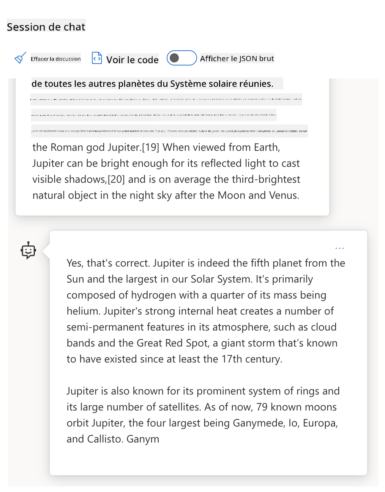
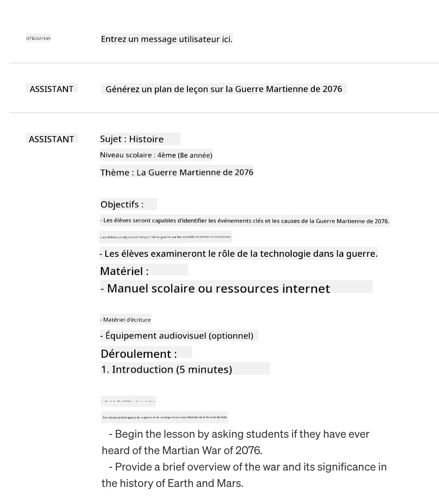

<!--
CO_OP_TRANSLATOR_METADATA:
{
  "original_hash": "8b3cb38518cf4fe7714d2f5e74dfa3eb",
  "translation_date": "2025-10-03T08:06:06+00:00",
  "source_file": "04-prompt-engineering-fundamentals/README.md",
  "language_code": "fr"
}
-->
# Fondamentaux de l'ingénierie des invites

[](https://aka.ms/gen-ai-lesson4-gh?WT.mc_id=academic-105485-koreyst)

## Introduction
Ce module couvre les concepts essentiels et les techniques pour créer des invites efficaces dans les modèles d'IA générative. La manière dont vous rédigez votre invite pour un LLM est également importante. Une invite soigneusement conçue peut améliorer la qualité des réponses. Mais que signifient exactement des termes comme _invite_ et _ingénierie des invites_ ? Et comment améliorer l'_entrée_ de l'invite que j'envoie au LLM ? Ce sont les questions auxquelles nous tenterons de répondre dans ce chapitre et le suivant.

L'_IA générative_ est capable de créer du contenu nouveau (par exemple, texte, images, audio, code, etc.) en réponse aux demandes des utilisateurs. Elle y parvient grâce à des _modèles de langage étendus_ comme la série GPT ("Generative Pre-trained Transformer") d'OpenAI, qui sont entraînés à utiliser le langage naturel et le code.

Les utilisateurs peuvent désormais interagir avec ces modèles via des paradigmes familiers comme le chat, sans nécessiter de compétences techniques ou de formation. Les modèles sont basés sur des _invites_ : les utilisateurs envoient une entrée textuelle (invite) et reçoivent une réponse de l'IA (complétion). Ils peuvent ensuite "dialoguer avec l'IA" de manière itérative, dans des conversations à plusieurs tours, en affinant leur invite jusqu'à ce que la réponse corresponde à leurs attentes.

Les "invites" deviennent ainsi l'interface de _programmation principale_ pour les applications d'IA générative, indiquant aux modèles ce qu'ils doivent faire et influençant la qualité des réponses obtenues. L'"ingénierie des invites" est un domaine d'étude en pleine croissance qui se concentre sur la _conception et l'optimisation_ des invites pour fournir des réponses cohérentes et de qualité à grande échelle.

## Objectifs d'apprentissage

Dans cette leçon, nous apprenons ce qu'est l'ingénierie des invites, pourquoi elle est importante et comment nous pouvons concevoir des invites plus efficaces pour un modèle donné et un objectif d'application. Nous comprendrons les concepts de base et les meilleures pratiques pour l'ingénierie des invites - et découvrirons un environnement interactif "sandbox" dans Jupyter Notebooks où nous pourrons appliquer ces concepts à des exemples concrets.

À la fin de cette leçon, nous serons capables de :

1. Expliquer ce qu'est l'ingénierie des invites et pourquoi elle est importante.
2. Décrire les composants d'une invite et leur utilisation.
3. Apprendre les meilleures pratiques et techniques pour l'ingénierie des invites.
4. Appliquer les techniques apprises à des exemples concrets, en utilisant un point de terminaison OpenAI.

## Termes clés

Ingénierie des invites : La pratique consistant à concevoir et affiner des entrées pour guider les modèles d'IA vers la production des résultats souhaités.  
Tokenisation : Le processus de conversion du texte en unités plus petites, appelées tokens, que le modèle peut comprendre et traiter.  
LLMs ajustés par instructions : Modèles de langage étendus (LLMs) qui ont été ajustés avec des instructions spécifiques pour améliorer la précision et la pertinence de leurs réponses.

## Environnement d'apprentissage

L'ingénierie des invites est actuellement davantage un art qu'une science. La meilleure façon d'améliorer notre intuition à ce sujet est de _pratiquer davantage_ et d'adopter une approche par essais et erreurs qui combine expertise dans le domaine d'application avec techniques recommandées et optimisations spécifiques au modèle.

Le Jupyter Notebook accompagnant cette leçon fournit un environnement _sandbox_ où vous pouvez essayer ce que vous apprenez - au fur et à mesure ou dans le cadre du défi de code à la fin. Pour exécuter les exercices, vous aurez besoin de :

1. **Une clé API Azure OpenAI** - le point de terminaison du service pour un LLM déployé.  
2. **Un environnement Python** - dans lequel le Notebook peut être exécuté.  
3. **Variables d'environnement locales** - _complétez les étapes de [CONFIGURATION](./../00-course-setup/02-setup-local.md?WT.mc_id=academic-105485-koreyst) maintenant pour vous préparer_.  

Le notebook contient des exercices _de départ_ - mais vous êtes encouragé à ajouter vos propres sections _Markdown_ (description) et _Code_ (demandes d'invite) pour essayer davantage d'exemples ou d'idées - et développer votre intuition pour la conception des invites.

## Guide illustré

Vous voulez avoir une vue d'ensemble de ce que couvre cette leçon avant de plonger dedans ? Consultez ce guide illustré, qui vous donne une idée des principaux sujets abordés et des points clés à retenir pour chaque sujet. La feuille de route de la leçon vous emmène de la compréhension des concepts de base et des défis à leur résolution grâce à des techniques et des meilleures pratiques d'ingénierie des invites. Notez que la section "Techniques avancées" de ce guide fait référence au contenu abordé dans le _chapitre suivant_ de ce programme.


## Notre startup

Parlons maintenant de la manière dont _ce sujet_ est lié à notre mission de startup visant à [apporter l'innovation de l'IA à l'éducation](https://educationblog.microsoft.com/2023/06/collaborating-to-bring-ai-innovation-to-education?WT.mc_id=academic-105485-koreyst). Nous voulons créer des applications d'apprentissage _personnalisé_ alimentées par l'IA - alors réfléchissons à la manière dont différents utilisateurs de notre application pourraient "concevoir" des invites :

- **Administrateurs** pourraient demander à l'IA d'_analyser les données du programme pour identifier les lacunes dans la couverture_. L'IA peut résumer les résultats ou les visualiser avec du code.  
- **Éducateurs** pourraient demander à l'IA de _générer un plan de cours pour un public cible et un sujet_. L'IA peut créer un plan personnalisé dans un format spécifié.  
- **Étudiants** pourraient demander à l'IA de _les aider dans une matière difficile_. L'IA peut alors guider les étudiants avec des leçons, des indices et des exemples adaptés à leur niveau.  

Ce n'est que la partie émergée de l'iceberg. Consultez [Prompts For Education](https://github.com/microsoft/prompts-for-edu/tree/main?WT.mc_id=academic-105485-koreyst) - une bibliothèque d'invites open-source organisée par des experts en éducation - pour avoir une idée plus large des possibilités ! _Essayez d'exécuter certaines de ces invites dans le sandbox ou en utilisant le OpenAI Playground pour voir ce qui se passe !_

<!--
MODÈLE DE LEÇON :
Cette unité devrait couvrir le concept de base #1.
Renforcez le concept avec des exemples et des références.

CONCEPT #1 :
Ingénierie des invites.
Définissez-le et expliquez pourquoi il est nécessaire.
-->

## Qu'est-ce que l'ingénierie des invites ?

Nous avons commencé cette leçon en définissant **l'ingénierie des invites** comme le processus de _conception et d'optimisation_ des entrées textuelles (invites) pour fournir des réponses cohérentes et de qualité (complétions) pour un objectif d'application donné et un modèle. Nous pouvons considérer cela comme un processus en deux étapes :

- _concevoir_ l'invite initiale pour un modèle et un objectif donnés  
- _affiner_ l'invite de manière itérative pour améliorer la qualité de la réponse  

C'est nécessairement un processus par essais et erreurs qui exige de l'intuition et des efforts de la part de l'utilisateur pour obtenir des résultats optimaux. Alors pourquoi est-ce important ? Pour répondre à cette question, nous devons d'abord comprendre trois concepts :

- _Tokenisation_ = comment le modèle "voit" l'invite  
- _Base LLMs_ = comment le modèle de base "traite" une invite  
- _LLMs ajustés par instructions_ = comment le modèle peut désormais voir des "tâches"  

### Tokenisation

Un LLM voit les invites comme une _séquence de tokens_ où différents modèles (ou versions d'un modèle) peuvent tokeniser la même invite de différentes manières. Étant donné que les LLMs sont entraînés sur des tokens (et non sur du texte brut), la manière dont les invites sont tokenisées a un impact direct sur la qualité de la réponse générée.

Pour avoir une intuition sur le fonctionnement de la tokenisation, essayez des outils comme le [Tokeniseur OpenAI](https://platform.openai.com/tokenizer?WT.mc_id=academic-105485-koreyst) montré ci-dessous. Copiez votre invite - et voyez comment elle est convertie en tokens, en prêtant attention à la manière dont les caractères d'espacement et les signes de ponctuation sont traités. Notez que cet exemple montre un ancien LLM (GPT-3) - donc essayer cela avec un modèle plus récent peut produire un résultat différent.


### Concept : Modèles de base

Une fois qu'une invite est tokenisée, la fonction principale du ["Base LLM"](https://blog.gopenai.com/an-introduction-to-base-and-instruction-tuned-large-language-models-8de102c785a6?WT.mc_id=academic-105485-koreyst) (ou modèle de base) est de prédire le token suivant dans cette séquence. Étant donné que les LLMs sont entraînés sur des ensembles de données textuelles massifs, ils ont une bonne compréhension des relations statistiques entre les tokens et peuvent faire cette prédiction avec une certaine confiance. Notez qu'ils ne comprennent pas la _signification_ des mots dans l'invite ou le token ; ils voient simplement un motif qu'ils peuvent "compléter" avec leur prochaine prédiction. Ils peuvent continuer à prédire la séquence jusqu'à ce qu'elle soit terminée par une intervention de l'utilisateur ou une condition préétablie.

Vous voulez voir comment fonctionne la complétion basée sur les invites ? Entrez l'invite ci-dessus dans le [_Chat Playground_](https://oai.azure.com/playground?WT.mc_id=academic-105485-koreyst) d'Azure OpenAI Studio avec les paramètres par défaut. Le système est configuré pour traiter les invites comme des demandes d'information - vous devriez donc voir une complétion qui satisfait ce contexte.

Mais que se passe-t-il si l'utilisateur souhaite voir quelque chose de spécifique répondant à certains critères ou objectifs de tâche ? C'est là que les LLMs _ajustés par instructions_ entrent en jeu.



### Concept : LLMs ajustés par instructions

Un [LLM ajusté par instructions](https://blog.gopenai.com/an-introduction-to-base-and-instruction-tuned-large-language-models-8de102c785a6?WT.mc_id=academic-105485-koreyst) commence avec le modèle de base et le perfectionne avec des exemples ou des paires entrée/sortie (par exemple, des "messages" à plusieurs tours) qui peuvent contenir des instructions claires - et la réponse de l'IA tente de suivre cette instruction.

Cela utilise des techniques comme l'apprentissage par renforcement avec retour humain (RLHF) qui peuvent entraîner le modèle à _suivre des instructions_ et _apprendre des retours_ afin qu'il produise des réponses mieux adaptées aux applications pratiques et plus pertinentes pour les objectifs des utilisateurs.

Essayons-le - revenez à l'invite ci-dessus, mais modifiez maintenant le _message système_ pour fournir l'instruction suivante comme contexte :

> _Résumez le contenu fourni pour un élève de deuxième année. Limitez le résultat à un paragraphe avec 3 à 5 points clés._

Voyez comment le résultat est maintenant ajusté pour refléter l'objectif et le format souhaités ? Un éducateur peut désormais utiliser directement cette réponse dans ses diapositives pour cette classe.


## Pourquoi avons-nous besoin de l'ingénierie des invites ?

Maintenant que nous savons comment les invites sont traitées par les LLMs, parlons de _pourquoi_ nous avons besoin de l'ingénierie des invites. La réponse réside dans le fait que les LLMs actuels posent un certain nombre de défis qui rendent les _complétions fiables et cohérentes_ plus difficiles à obtenir sans effort dans la construction et l'optimisation des invites. Par exemple :

1. **Les réponses des modèles sont stochastiques.** La _même invite_ produira probablement des réponses différentes avec différents modèles ou versions de modèles. Et elle peut même produire des résultats différents avec le _même modèle_ à différents moments. _Les techniques d'ingénierie des invites peuvent nous aider à minimiser ces variations en fournissant de meilleures balises_.  

1. **Les modèles peuvent fabriquer des réponses.** Les modèles sont pré-entraînés avec des ensembles de données _grands mais finis_, ce qui signifie qu'ils manquent de connaissances sur les concepts en dehors de ce champ d'entraînement. En conséquence, ils peuvent produire des complétions qui sont inexactes, imaginaires ou directement contradictoires avec des faits connus. _Les techniques d'ingénierie des invites aident les utilisateurs à identifier et à atténuer ces fabrications, par exemple en demandant à l'IA des citations ou un raisonnement_.  

1. **Les capacités des modèles varient.** Les modèles plus récents ou les générations de modèles auront des capacités plus riches mais apporteront également des particularités uniques et des compromis en termes de coût et de complexité. _L'ingénierie des invites peut nous aider à développer des meilleures pratiques et des flux de travail qui abstraient les différences et s'adaptent aux exigences spécifiques des modèles de manière évolutive et transparente_.  

Voyons cela en action dans le OpenAI ou Azure OpenAI Playground :

- Utilisez la même invite avec différents déploiements de LLM (par exemple, OpenAI, Azure OpenAI, Hugging Face) - avez-vous remarqué les variations ?  
- Utilisez la même invite à plusieurs reprises avec le _même_ déploiement de LLM (par exemple, le playground Azure OpenAI) - comment ces variations diffèrent-elles ?  

### Exemple de fabrications

Dans ce cours, nous utilisons le terme **"fabrication"** pour désigner le phénomène où les LLMs génèrent parfois des informations factuellement incorrectes en raison de limitations dans leur entraînement ou d'autres contraintes. Vous avez peut-être également entendu parler de ce phénomène sous le terme de _"hallucinations"_ dans des articles populaires ou des publications de recherche. Cependant, nous recommandons fortement d'utiliser le terme _"fabrication"_ afin de ne pas anthropomorphiser le comportement en attribuant une caractéristique humaine à un résultat généré par une machine. Cela renforce également les [directives d'IA responsable](https://www.microsoft.com/ai/responsible-ai?WT.mc_id=academic-105485-koreyst) d'un point de vue terminologique, en supprimant les termes qui pourraient également être considérés comme offensants ou non inclusifs dans certains contextes.

Vous voulez comprendre comment fonctionnent les fabrications ? Pensez à une invite qui demande à l'IA de générer du contenu sur un sujet inexistant (pour s'assurer qu'il ne figure pas dans l'ensemble de données d'entraînement). Par exemple - j'ai essayé cette invite :

> **Invite :** générez un plan de cours sur la Guerre Martienne de 2076.
Une recherche sur le web m'a montré qu'il existait des récits fictifs (par exemple, des séries télévisées ou des livres) sur des guerres martiennes - mais aucun en 2076. Le bon sens nous dit également que 2076 est _dans le futur_ et ne peut donc pas être associé à un événement réel.

Alors, que se passe-t-il lorsque nous utilisons cette invite avec différents fournisseurs de modèles de langage ?

> **Réponse 1** : OpenAI Playground (GPT-35)



> **Réponse 2** : Azure OpenAI Playground (GPT-35)


> **Réponse 3** : Hugging Face Chat Playground (LLama-2)


Comme prévu, chaque modèle (ou version de modèle) produit des réponses légèrement différentes en raison du comportement stochastique et des variations de capacités des modèles. Par exemple, un modèle cible un public de niveau collège, tandis qu'un autre suppose un étudiant de lycée. Mais les trois modèles ont généré des réponses qui pourraient convaincre un utilisateur non informé que l'événement était réel.

Les techniques d'ingénierie des invites, comme le _metaprompting_ et la _configuration de température_, peuvent réduire les fabrications des modèles dans une certaine mesure. De nouvelles architectures d'ingénierie des invites intègrent également de nouveaux outils et techniques de manière transparente dans le flux des invites, afin d'atténuer ou de réduire certains de ces effets.

## Étude de cas : GitHub Copilot

Terminons cette section en examinant comment l'ingénierie des invites est utilisée dans des solutions réelles, en étudiant une étude de cas : [GitHub Copilot](https://github.com/features/copilot?WT.mc_id=academic-105485-koreyst).

GitHub Copilot est votre "programmeur pair IA" - il convertit des invites textuelles en complétions de code et est intégré dans votre environnement de développement (par exemple, Visual Studio Code) pour une expérience utilisateur fluide. Comme documenté dans la série de blogs ci-dessous, la première version était basée sur le modèle OpenAI Codex - les ingénieurs ont rapidement réalisé la nécessité d'affiner le modèle et de développer de meilleures techniques d'ingénierie des invites pour améliorer la qualité du code. En juillet, ils ont [lancé un modèle IA amélioré qui va au-delà de Codex](https://github.blog/2023-07-28-smarter-more-efficient-coding-github-copilot-goes-beyond-codex-with-improved-ai-model/?WT.mc_id=academic-105485-koreyst) pour des suggestions encore plus rapides.

Lisez les articles dans l'ordre pour suivre leur parcours d'apprentissage.

- **Mai 2023** | [GitHub Copilot comprend mieux votre code](https://github.blog/2023-05-17-how-github-copilot-is-getting-better-at-understanding-your-code/?WT.mc_id=academic-105485-koreyst)
- **Mai 2023** | [Dans les coulisses de GitHub : Travailler avec les modèles de langage derrière GitHub Copilot](https://github.blog/2023-05-17-inside-github-working-with-the-llms-behind-github-copilot/?WT.mc_id=academic-105485-koreyst).
- **Juin 2023** | [Comment écrire de meilleures invites pour GitHub Copilot](https://github.blog/2023-06-20-how-to-write-better-prompts-for-github-copilot/?WT.mc_id=academic-105485-koreyst).
- **Juillet 2023** | [.. GitHub Copilot va au-delà de Codex avec un modèle IA amélioré](https://github.blog/2023-07-28-smarter-more-efficient-coding-github-copilot-goes-beyond-codex-with-improved-ai-model/?WT.mc_id=academic-105485-koreyst)
- **Juillet 2023** | [Guide du développeur sur l'ingénierie des invites et les modèles de langage](https://github.blog/2023-07-17-prompt-engineering-guide-generative-ai-llms/?WT.mc_id=academic-105485-koreyst)
- **Septembre 2023** | [Comment créer une application d'entreprise basée sur les modèles de langage : Leçons tirées de GitHub Copilot](https://github.blog/2023-09-06-how-to-build-an-enterprise-llm-application-lessons-from-github-copilot/?WT.mc_id=academic-105485-koreyst)

Vous pouvez également parcourir leur [blog d'ingénierie](https://github.blog/category/engineering/?WT.mc_id=academic-105485-koreyst) pour plus d'articles comme [celui-ci](https://github.blog/2023-09-27-how-i-used-github-copilot-chat-to-build-a-reactjs-gallery-prototype/?WT.mc_id=academic-105485-koreyst) qui montre comment ces modèles et techniques sont _appliqués_ pour alimenter des applications réelles.

---

## Construction des invites

Nous avons vu pourquoi l'ingénierie des invites est importante - maintenant, comprenons comment les invites sont _construites_ afin de pouvoir évaluer différentes techniques pour concevoir des invites plus efficaces.

### Invite de base

Commençons par l'invite de base : une entrée textuelle envoyée au modèle sans autre contexte. Voici un exemple - lorsque nous envoyons les premiers mots de l'hymne national des États-Unis à l'[API Completion d'OpenAI](https://platform.openai.com/docs/api-reference/completions?WT.mc_id=academic-105485-koreyst), elle complète instantanément la réponse avec les lignes suivantes, illustrant le comportement de prédiction de base.

| Invite (Entrée)     | Complétion (Sortie)                                                                                                                        |
| :------------------ | :----------------------------------------------------------------------------------------------------------------------------------------- |
| Oh say can you see  | On dirait que vous commencez les paroles de "The Star-Spangled Banner", l'hymne national des États-Unis. Les paroles complètes sont ...    |

### Invite complexe

Ajoutons maintenant du contexte et des instructions à cette invite de base. L'[API Chat Completion](https://learn.microsoft.com/azure/ai-services/openai/how-to/chatgpt?WT.mc_id=academic-105485-koreyst) nous permet de construire une invite complexe sous forme de collection de _messages_ avec :

- Des paires entrée/sortie reflétant l'entrée de l'utilisateur et la réponse de l'assistant.
- Un message système définissant le contexte pour le comportement ou la personnalité de l'assistant.

La requête prend maintenant la forme ci-dessous, où la _tokenisation_ capture efficacement les informations pertinentes du contexte et de la conversation. Désormais, changer le contexte du système peut avoir autant d'impact sur la qualité des complétions que les entrées utilisateur fournies.

```python
response = openai.chat.completions.create(
    model="gpt-3.5-turbo",
    messages=[
        {"role": "system", "content": "You are a helpful assistant."},
        {"role": "user", "content": "Who won the world series in 2020?"},
        {"role": "assistant", "content": "The Los Angeles Dodgers won the World Series in 2020."},
        {"role": "user", "content": "Where was it played?"}
    ]
)
```


### Invite d'instruction

Dans les exemples ci-dessus, l'invite utilisateur était une simple requête textuelle pouvant être interprétée comme une demande d'information. Avec les invites _d'instruction_, nous pouvons utiliser ce texte pour spécifier une tâche plus en détail, offrant une meilleure orientation à l'IA. Voici un exemple :

| Invite (Entrée)                                                                                                                                                                                                                         | Complétion (Sortie)                                                                                                        | Type d'instruction  |
| :------------------------------------------------------------------------------------------------------------------------------------------------------------------------------------------------------------------------------------- | :------------------------------------------------------------------------------------------------------------------------- | :------------------ |
| Écrivez une description de la guerre civile                                                                                                                                                                                             | _retourne un simple paragraphe_                                                                                           | Simple              |
| Écrivez une description de la guerre civile. Fournissez les dates et événements clés et décrivez leur importance                                                                                                                       | _retourne un paragraphe suivi d'une liste de dates clés avec descriptions_                                                | Complexe            |
| Écrivez une description de la guerre civile en 1 paragraphe. Fournissez 3 points clés avec les dates et leur importance. Fournissez 3 autres points clés avec les figures historiques et leurs contributions. Retournez le tout en JSON | _retourne des détails plus étendus dans une boîte de texte, formatés en JSON que vous pouvez copier-coller dans un fichier_ | Complexe. Formaté.  |

## Contenu principal

Dans les exemples ci-dessus, l'invite était encore assez ouverte, permettant au modèle de langage de décider quelle partie de son ensemble de données pré-entraîné était pertinente. Avec le modèle de conception _contenu principal_, le texte d'entrée est divisé en deux parties :

- une instruction (action)
- un contenu pertinent (qui influence l'action)

Voici un exemple où l'instruction est de "résumer ceci en 2 phrases".

| Invite (Entrée)                                                                                                                                                                                                                                                                                                                                                                                                                                                                                                                                                                                                                                                                                      | Complétion (Sortie)                                                                                                                                                                                                                                                                             |
| :-------------------------------------------------------------------------------------------------------------------------------------------------------------------------------------------------------------------------------------------------------------------------------------------------------------------------------------------------------------------------------------------------------------------------------------------------------------------------------------------------------------------------------------------------------------------------------------------------------------------------------------------------------------------------------------------------- | :---------------------------------------------------------------------------------------------------------------------------------------------------------------------------------------------------------------------------------------------------------------------------------------------- |
| Jupiter est la cinquième planète du Soleil et la plus grande du système solaire. C'est une géante gazeuse avec une masse équivalente à un millième de celle du Soleil, mais deux fois et demie celle de toutes les autres planètes du système solaire réunies. Jupiter est l'un des objets les plus brillants visibles à l'œil nu dans le ciel nocturne, et est connue des civilisations anciennes depuis avant l'histoire enregistrée. Elle porte le nom du dieu romain Jupiter. [19] Vue depuis la Terre, Jupiter peut être suffisamment brillante pour que sa lumière réfléchie projette des ombres visibles, [20] et est en moyenne le troisième objet naturel le plus brillant dans le ciel nocturne après la Lune et Vénus. <br/> **Résumez ceci en 2 phrases courtes** | Jupiter, la cinquième planète du Soleil, est la plus grande du système solaire et est connue pour être l'un des objets les plus brillants dans le ciel nocturne. Nommée d'après le dieu romain Jupiter, c'est une géante gazeuse dont la masse est deux fois et demie celle de toutes les autres planètes réunies. |

Le segment de contenu principal peut être utilisé de diverses manières pour rendre les instructions plus efficaces :

- **Exemples** - au lieu de dire explicitement au modèle quoi faire avec une instruction explicite, donnez-lui des exemples de ce qu'il doit faire et laissez-le en déduire le modèle.
- **Indices** - suivez l'instruction avec un "indice" qui amorce la complétion, guidant le modèle vers des réponses plus pertinentes.
- **Modèles** - ce sont des "recettes" répétables pour les invites avec des espaces réservés (variables) qui peuvent être personnalisés avec des données pour des cas d'utilisation spécifiques.

Explorons ces techniques en action.

### Utilisation d'exemples

C'est une approche où vous utilisez le contenu principal pour "nourrir le modèle" avec des exemples du résultat souhaité pour une instruction donnée, et laissez-le en déduire le modèle pour le résultat souhaité. En fonction du nombre d'exemples fournis, nous pouvons avoir des invites zéro-shot, one-shot, few-shot, etc.

L'invite se compose maintenant de trois éléments :

- Une description de la tâche
- Quelques exemples du résultat souhaité
- Le début d'un nouvel exemple (qui devient une description implicite de la tâche)

| Type d'apprentissage | Invite (Entrée)                                                                                                                                        | Complétion (Sortie)         |
| :------------------- | :---------------------------------------------------------------------------------------------------------------------------------------------------- | :-------------------------- |
| Zéro-shot           | "Le soleil brille". Traduisez en espagnol                                                                                                            | "El Sol está brillando".    |
| One-shot            | "Le soleil brille" => ""El Sol está brillando". <br> "C'est une journée froide et venteuse" =>                                                       | "Es un día frío y ventoso". |
| Few-shot            | Le joueur a couru les bases => Baseball <br/> Le joueur a frappé un ace => Tennis <br/> Le joueur a frappé un six => Cricket <br/> Le joueur a fait un slam-dunk => | Basketball                  |
|                     |                                                                                                                                                       |                             |

Notez comment nous avons dû fournir une instruction explicite ("Traduisez en espagnol") dans l'exemple zéro-shot, mais elle est déduite dans l'exemple one-shot. L'exemple few-shot montre comment ajouter plus d'exemples permet aux modèles de faire des inférences plus précises sans instructions supplémentaires.

### Indices d'invite

Une autre technique pour utiliser le contenu principal est de fournir des _indices_ plutôt que des exemples. Dans ce cas, nous donnons au modèle une impulsion dans la bonne direction en _commençant_ avec un extrait qui reflète le format de réponse souhaité. Le modèle "prend l'indice" pour continuer dans cette veine.

| Nombre d'indices | Invite (Entrée)                                                                                                                                                                                                                                                                                                                                                                                                                                               | Complétion (Sortie)                                                                                                                                                                                                                                                                                       |
| :-------------- | :----------------------------------------------------------------------------------------------------------------------------------------------------------------------------------------------------------------------------------------------------------------------------------------------------------------------------------------------------------------------------------------------------------------------------------------------------------- | :-------------------------------------------------------------------------------------------------------------------------------------------------------------------------------------------------------------------------------------------------------------------------------------------------------- |
| 0               | Jupiter est la cinquième planète du Soleil et la plus grande du système solaire. C'est une géante gazeuse avec une masse équivalente à un millième de celle du Soleil, mais deux fois et demie celle de toutes les autres planètes du système solaire réunies. Jupiter est l'un des objets les plus brillants visibles à l'œil nu dans le ciel nocturne, et est connue des civilisations anciennes depuis avant l'histoire enregistrée. <br/>**Résumez ceci**                                       | Jupiter est la plus grande planète de notre système solaire et la cinquième depuis le Soleil. C'est une géante gazeuse avec une masse équivalente à 1/1000e de celle du Soleil, mais elle est plus lourde que toutes les autres planètes réunies. Les civilisations anciennes connaissent Jupiter depuis longtemps, et elle est facilement visible dans le ciel nocturne. |
| 1              | Jupiter est la cinquième planète à partir du Soleil et la plus grande du Système solaire. C'est une géante gazeuse avec une masse équivalente à un millième de celle du Soleil, mais deux fois et demie celle de toutes les autres planètes du Système solaire réunies. Jupiter est l'un des objets les plus brillants visibles à l'œil nu dans le ciel nocturne, et elle est connue des civilisations anciennes depuis avant l'histoire écrite. <br/>**Résumé** <br/> Ce que nous avons appris, c'est que Jupiter | est la cinquième planète à partir du Soleil et la plus grande du Système solaire. C'est une géante gazeuse avec une masse équivalente à un millième de celle du Soleil, mais deux fois et demie celle de toutes les autres planètes réunies. Elle est facilement visible à l'œil nu et connue depuis l'Antiquité.                        |
| 2              | Jupiter est la cinquième planète à partir du Soleil et la plus grande du Système solaire. C'est une géante gazeuse avec une masse équivalente à un millième de celle du Soleil, mais deux fois et demie celle de toutes les autres planètes du Système solaire réunies. Jupiter est l'un des objets les plus brillants visibles à l'œil nu dans le ciel nocturne, et elle est connue des civilisations anciennes depuis avant l'histoire écrite. <br/>**Résumé** <br/> Les 3 faits principaux que nous avons appris :         | 1. Jupiter est la cinquième planète à partir du Soleil et la plus grande du Système solaire. <br/> 2. C'est une géante gazeuse avec une masse équivalente à un millième de celle du Soleil...<br/> 3. Jupiter est visible à l'œil nu depuis l'Antiquité ...                                                                       |
|                |                                                                                                                                                                                                                                                                                                                                                                                                                                                              |                                                                                                                                                                                                                                                                                                           |

### Modèles de prompts

Un modèle de prompt est une _recette pré-définie pour un prompt_ qui peut être stockée et réutilisée selon les besoins, afin de garantir des expériences utilisateur plus cohérentes à grande échelle. Dans sa forme la plus simple, il s'agit simplement d'une collection d'exemples de prompts comme [celui-ci de OpenAI](https://platform.openai.com/examples?WT.mc_id=academic-105485-koreyst) qui fournit à la fois les composants interactifs du prompt (messages utilisateur et système) et le format de requête piloté par API - pour permettre la réutilisation.

Dans sa forme plus complexe, comme [cet exemple de LangChain](https://python.langchain.com/docs/concepts/prompt_templates/?WT.mc_id=academic-105485-koreyst), il contient des _placeholders_ qui peuvent être remplacés par des données provenant de diverses sources (saisie utilisateur, contexte système, sources de données externes, etc.) pour générer un prompt dynamiquement. Cela nous permet de créer une bibliothèque de prompts réutilisables qui peuvent être utilisés pour garantir des expériences utilisateur cohérentes **programmatiquement** à grande échelle.

Enfin, la véritable valeur des modèles réside dans la capacité à créer et publier des _bibliothèques de prompts_ pour des domaines d'application spécifiques - où le modèle de prompt est maintenant _optimisé_ pour refléter un contexte ou des exemples spécifiques à l'application, rendant les réponses plus pertinentes et précises pour le public cible. Le dépôt [Prompts For Edu](https://github.com/microsoft/prompts-for-edu?WT.mc_id=academic-105485-koreyst) est un excellent exemple de cette approche, en proposant une bibliothèque de prompts pour le domaine de l'éducation avec un accent sur des objectifs clés tels que la planification des cours, la conception des programmes, le tutorat des étudiants, etc.

## Contenu complémentaire

Si nous considérons la construction de prompts comme ayant une instruction (tâche) et un objectif (contenu principal), alors le _contenu secondaire_ est comme un contexte supplémentaire que nous fournissons pour **influencer la sortie d'une certaine manière**. Cela pourrait inclure des paramètres de réglage, des instructions de formatage, des taxonomies de sujets, etc., qui peuvent aider le modèle à _adapter_ sa réponse pour répondre aux objectifs ou attentes de l'utilisateur.

Par exemple : Étant donné un catalogue de cours avec des métadonnées détaillées (nom, description, niveau, balises de métadonnées, instructeur, etc.) sur tous les cours disponibles dans le programme :

- nous pouvons définir une instruction pour "résumer le catalogue de cours pour l'automne 2023"
- nous pouvons utiliser le contenu principal pour fournir quelques exemples du format de sortie souhaité
- nous pouvons utiliser le contenu secondaire pour identifier les 5 principales "balises" d'intérêt.

Ainsi, le modèle peut fournir un résumé dans le format montré par les quelques exemples - mais si un résultat contient plusieurs balises, il peut prioriser les 5 balises identifiées dans le contenu secondaire.

---

<!--
MODÈLE DE LEÇON :
Cette unité devrait couvrir le concept clé #1.
Renforcez le concept avec des exemples et des références.

CONCEPT #3 :
Techniques d'ingénierie des prompts.
Quelles sont les techniques de base pour l'ingénierie des prompts ?
Illustrez avec des exercices.
-->

## Bonnes pratiques pour les prompts

Maintenant que nous savons comment les prompts peuvent être _construits_, nous pouvons commencer à réfléchir à la manière de les _concevoir_ pour refléter les meilleures pratiques. Nous pouvons envisager cela en deux parties - adopter le bon _état d'esprit_ et appliquer les bonnes _techniques_.

### État d'esprit pour l'ingénierie des prompts

L'ingénierie des prompts est un processus d'essais et d'erreurs, alors gardez trois grands facteurs directeurs à l'esprit :

1. **La compréhension du domaine est importante.** La précision et la pertinence des réponses dépendent du _domaine_ dans lequel cette application ou cet utilisateur opère. Appliquez votre intuition et votre expertise du domaine pour **personnaliser davantage les techniques**. Par exemple, définissez des _personnalités spécifiques au domaine_ dans vos prompts système, ou utilisez des _modèles spécifiques au domaine_ dans vos prompts utilisateur. Fournissez un contenu secondaire qui reflète des contextes spécifiques au domaine, ou utilisez des _indices et des exemples spécifiques au domaine_ pour guider le modèle vers des schémas d'utilisation familiers.

2. **La compréhension du modèle est importante.** Nous savons que les modèles sont de nature stochastique. Mais les implémentations de modèles peuvent également varier en fonction du jeu de données d'entraînement qu'ils utilisent (connaissances pré-entraînées), des capacités qu'ils offrent (par exemple, via API ou SDK) et du type de contenu pour lequel ils sont optimisés (par exemple, code vs. images vs. texte). Comprenez les forces et les limites du modèle que vous utilisez, et utilisez ces connaissances pour _prioriser les tâches_ ou créer des _modèles personnalisés_ optimisés pour les capacités du modèle.

3. **L'itération et la validation sont importantes.** Les modèles évoluent rapidement, tout comme les techniques d'ingénierie des prompts. En tant qu'expert du domaine, vous pouvez avoir d'autres contextes ou critères spécifiques à _votre_ application, qui peuvent ne pas s'appliquer à la communauté en général. Utilisez les outils et techniques d'ingénierie des prompts pour "accélérer" la construction des prompts, puis itérez et validez les résultats en utilisant votre propre intuition et expertise du domaine. Enregistrez vos idées et créez une **base de connaissances** (par exemple, des bibliothèques de prompts) qui peuvent être utilisées comme nouveau point de départ par d'autres, pour des itérations plus rapides à l'avenir.

## Bonnes pratiques

Examinons maintenant les bonnes pratiques courantes recommandées par les praticiens de [OpenAI](https://help.openai.com/en/articles/6654000-best-practices-for-prompt-engineering-with-openai-api?WT.mc_id=academic-105485-koreyst) et [Azure OpenAI](https://learn.microsoft.com/azure/ai-services/openai/concepts/prompt-engineering#best-practices?WT.mc_id=academic-105485-koreyst).

| Quoi                              | Pourquoi                                                                                                                                                                                                                                               |
| :-------------------------------- | :------------------------------------------------------------------------------------------------------------------------------------------------------------------------------------------------------------------------------------------------ |
| Évaluer les derniers modèles.     | Les nouvelles générations de modèles sont susceptibles d'avoir des fonctionnalités et une qualité améliorées - mais peuvent également entraîner des coûts plus élevés. Évaluez leur impact, puis prenez des décisions de migration.                                                        |
| Séparer les instructions et le contexte | Vérifiez si votre modèle/fournisseur définit des _délimiteurs_ pour distinguer plus clairement les instructions, le contenu principal et le contenu secondaire. Cela peut aider les modèles à attribuer des poids plus précis aux tokens.                                                         |
| Soyez spécifique et clair         | Donnez plus de détails sur le contexte souhaité, le résultat, la longueur, le format, le style, etc. Cela améliorera à la fois la qualité et la cohérence des réponses. Capturez les recettes dans des modèles réutilisables.                                                          |
| Soyez descriptif, utilisez des exemples | Les modèles peuvent mieux répondre à une approche "montrer et raconter". Commencez par une approche `zero-shot` où vous donnez une instruction (mais pas d'exemples), puis essayez `few-shot` comme raffinement, en fournissant quelques exemples du résultat souhaité. Utilisez des analogies. |
| Utilisez des indices pour démarrer les complétions | Orientez-le vers un résultat souhaité en lui donnant quelques mots ou phrases de départ qu'il peut utiliser comme point de départ pour la réponse.                                                                                                               |
| Insistez                          | Parfois, vous devrez peut-être vous répéter auprès du modèle. Donnez des instructions avant et après votre contenu principal, utilisez une instruction et un indice, etc. Itérez et validez pour voir ce qui fonctionne.                                                         |
| L'ordre compte                     | L'ordre dans lequel vous présentez les informations au modèle peut avoir un impact sur la sortie, même dans les exemples d'apprentissage, grâce au biais de récence. Essayez différentes options pour voir ce qui fonctionne le mieux.                                                               |
| Donnez au modèle une "porte de sortie" | Donnez au modèle une réponse de _repli_ qu'il peut fournir s'il ne peut pas accomplir la tâche pour une raison quelconque. Cela peut réduire les chances que les modèles génèrent des réponses fausses ou fabriquées.                                                         |
|                                   |                                                                                                                                                                                                                                                   |

Comme pour toute bonne pratique, rappelez-vous que _votre expérience peut varier_ en fonction du modèle, de la tâche et du domaine. Utilisez ces pratiques comme point de départ, et itérez pour trouver ce qui fonctionne le mieux pour vous. Réévaluez constamment votre processus d'ingénierie des prompts à mesure que de nouveaux modèles et outils deviennent disponibles, en mettant l'accent sur l'évolutivité du processus et la qualité des réponses.

<!--
MODÈLE DE LEÇON :
Cette unité devrait fournir un défi de code si applicable.

DÉFI :
Lien vers un Jupyter Notebook avec uniquement les commentaires de code dans les instructions (les sections de code sont vides).

SOLUTION :
Lien vers une copie de ce Notebook avec les prompts remplis et exécutés, montrant ce qu'un exemple pourrait être.
-->

## Devoir

Félicitations ! Vous êtes arrivé à la fin de la leçon ! Il est temps de mettre certains de ces concepts et techniques à l'épreuve avec des exemples concrets !

Pour notre devoir, nous utiliserons un Jupyter Notebook avec des exercices que vous pouvez compléter de manière interactive. Vous pouvez également étendre le Notebook avec vos propres cellules Markdown et Code pour explorer des idées et des techniques par vous-même.

### Pour commencer, forkez le dépôt, puis

- (Recommandé) Lancez GitHub Codespaces
- (Alternativement) Clonez le dépôt sur votre appareil local et utilisez-le avec Docker Desktop
- (Alternativement) Ouvrez le Notebook avec votre environnement d'exécution préféré.

### Ensuite, configurez vos variables d'environnement

- Copiez le fichier `.env.copy` à la racine du dépôt en `.env` et remplissez les valeurs `AZURE_OPENAI_API_KEY`, `AZURE_OPENAI_ENDPOINT` et `AZURE_OPENAI_DEPLOYMENT`. Revenez à la section [Learning Sandbox](../../../04-prompt-engineering-fundamentals/04-prompt-engineering-fundamentals) pour apprendre comment.

### Ensuite, ouvrez le Jupyter Notebook

- Sélectionnez le kernel d'exécution. Si vous utilisez les options 1 ou 2, sélectionnez simplement le kernel Python 3.10.x par défaut fourni par le conteneur de développement.

Vous êtes prêt à exécuter les exercices. Notez qu'il n'y a pas de réponses _justes ou fausses_ ici - il s'agit simplement d'explorer des options par essais et erreurs et de développer une intuition sur ce qui fonctionne pour un modèle et un domaine d'application donnés.

_Pour cette raison, il n'y a pas de segments de solution de code dans cette leçon. À la place, le Notebook contiendra des cellules Markdown intitulées "Ma solution :" qui montrent un exemple de sortie pour référence._

 <!--
MODÈLE DE LEÇON :
Concluez la section avec un résumé et des ressources pour un apprentissage autonome.
-->

## Vérification des connaissances

Lequel des prompts suivants suit des bonnes pratiques raisonnables ?

1. Montre-moi une image de voiture rouge
2. Montre-moi une image de voiture rouge de marque Volvo et modèle XC90 garée près d'une falaise avec le soleil couchant
3. Montre-moi une image de voiture rouge de marque Volvo et modèle XC90

R : 2, c'est le meilleur prompt car il fournit des détails sur "quoi" et entre dans les spécificités (pas n'importe quelle voiture mais une marque et un modèle spécifiques) et il décrit également le cadre général. 3 est le deuxième meilleur car il contient également beaucoup de description.

## 🚀 Défi

Essayez d'utiliser la technique de "l'indice" avec le prompt : Complétez la phrase "Montre-moi une image de voiture rouge de marque Volvo et ". Que répond-il, et comment l'amélioreriez-vous ?

## Excellent travail ! Continuez votre apprentissage

Vous voulez en savoir plus sur les différents concepts d'ingénierie des prompts ? Rendez-vous sur la [page d'apprentissage continu](https://aka.ms/genai-collection?WT.mc_id=academic-105485-koreyst) pour trouver d'autres excellentes ressources sur ce sujet.

Passez à la leçon 5 où nous examinerons [les techniques avancées de prompts](../05-advanced-prompts/README.md?WT.mc_id=academic-105485-koreyst) !

---

**Avertissement** :  
Ce document a été traduit à l'aide du service de traduction automatique [Co-op Translator](https://github.com/Azure/co-op-translator). Bien que nous nous efforcions d'assurer l'exactitude, veuillez noter que les traductions automatisées peuvent contenir des erreurs ou des inexactitudes. Le document original dans sa langue d'origine doit être considéré comme la source faisant autorité. Pour des informations critiques, il est recommandé de recourir à une traduction humaine professionnelle. Nous déclinons toute responsabilité en cas de malentendus ou d'interprétations erronées résultant de l'utilisation de cette traduction.