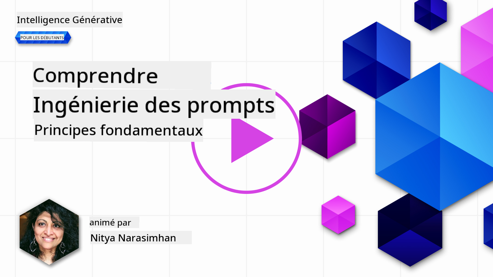
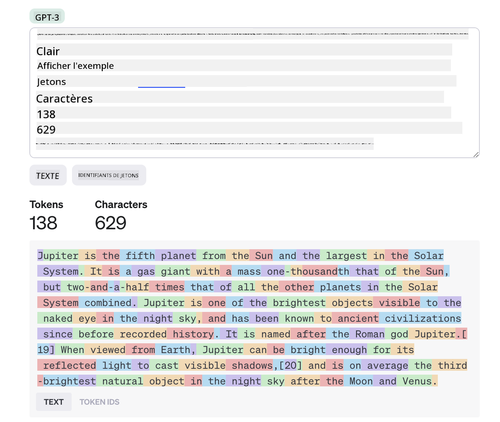
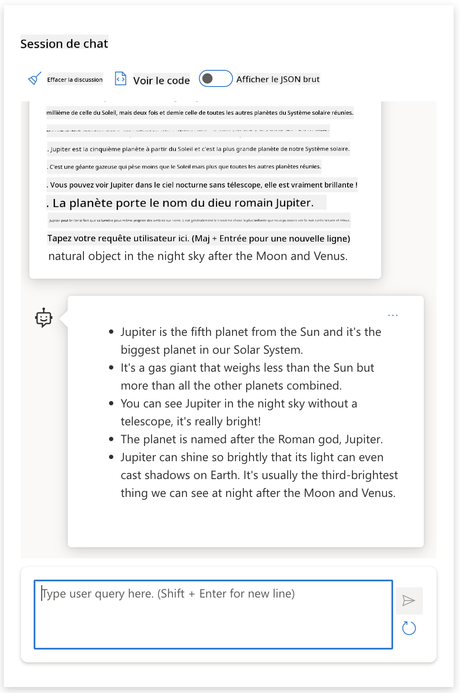
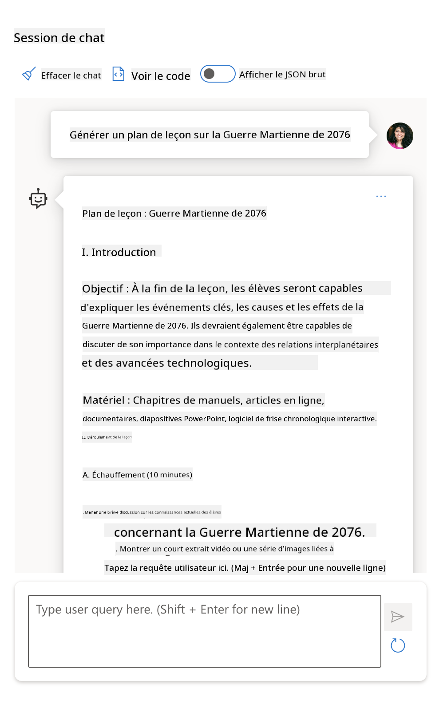

<!--
CO_OP_TRANSLATOR_METADATA:
{
  "original_hash": "dcbaaae026cb50fee071e690685b5843",
  "translation_date": "2025-08-26T13:29:12+00:00",
  "source_file": "04-prompt-engineering-fundamentals/README.md",
  "language_code": "fr"
}
-->
# Fondamentaux de l’Ingénierie des Prompts

[](https://aka.ms/gen-ai-lesson4-gh?WT.mc_id=academic-105485-koreyst)

## Introduction
Ce module aborde les concepts et techniques essentiels pour créer des prompts efficaces dans les modèles d’IA générative. La façon dont vous rédigez votre prompt pour un LLM est également importante. Un prompt soigneusement conçu peut permettre d’obtenir une réponse de meilleure qualité. Mais que signifient exactement des termes comme _prompt_ et _ingénierie des prompts_ ? Et comment améliorer l’_entrée_ du prompt que j’envoie au LLM ? Ce sont les questions auxquelles nous allons tenter de répondre dans ce chapitre et le suivant.

L’_IA générative_ est capable de créer de nouveaux contenus (par exemple, texte, images, audio, code, etc.) en réponse à des demandes des utilisateurs. Elle y parvient grâce à des _modèles de langage de grande taille_ comme la série GPT ("Generative Pre-trained Transformer") d’OpenAI, entraînés à utiliser le langage naturel et le code.

Les utilisateurs peuvent désormais interagir avec ces modèles via des paradigmes familiers comme le chat, sans avoir besoin de compétences techniques ou de formation. Les modèles sont _basés sur des prompts_ : les utilisateurs envoient une entrée textuelle (prompt) et reçoivent la réponse de l’IA (complétion). Ils peuvent ensuite "discuter avec l’IA" de façon itérative, dans des conversations à plusieurs tours, en affinant leur prompt jusqu’à ce que la réponse corresponde à leurs attentes.

Les "prompts" deviennent ainsi la principale _interface de programmation_ pour les applications d’IA générative, indiquant aux modèles ce qu’ils doivent faire et influençant la qualité des réponses obtenues. L’"ingénierie des prompts" est un domaine d’étude en plein essor qui se concentre sur la _conception et l’optimisation_ des prompts afin d’obtenir des réponses cohérentes et de qualité à grande échelle.

## Objectifs d’apprentissage

Dans cette leçon, nous allons découvrir ce qu’est l’ingénierie des prompts, pourquoi elle est importante, et comment concevoir des prompts plus efficaces pour un modèle et un objectif d’application donnés. Nous allons comprendre les concepts clés et les bonnes pratiques de l’ingénierie des prompts – et découvrir un environnement interactif "bac à sable" Jupyter Notebooks où nous pourrons voir ces concepts appliqués à des exemples concrets.

À la fin de cette leçon, nous serons capables de :

1. Expliquer ce qu’est l’ingénierie des prompts et pourquoi elle est importante.
2. Décrire les composants d’un prompt et leur utilisation.
3. Découvrir les bonnes pratiques et techniques pour l’ingénierie des prompts.
4. Appliquer les techniques apprises à des exemples concrets, en utilisant un endpoint OpenAI.

## Termes clés

Ingénierie des prompts : Pratique consistant à concevoir et affiner les entrées pour guider les modèles d’IA vers la production des résultats souhaités.
Tokenisation : Processus de conversion d’un texte en unités plus petites, appelées tokens, qu’un modèle peut comprendre et traiter.
LLMs ajustés par instructions : Modèles de langage de grande taille (LLMs) qui ont été ajustés avec des instructions spécifiques pour améliorer la précision et la pertinence de leurs réponses.

## Bac à sable d’apprentissage

L’ingénierie des prompts relève aujourd’hui davantage de l’art que de la science. La meilleure façon d’améliorer notre intuition est de _pratiquer davantage_ et d’adopter une approche d’essais et d’erreurs qui combine expertise métier et techniques recommandées, ainsi qu’optimisations spécifiques au modèle.

Le Jupyter Notebook qui accompagne cette leçon fournit un environnement _bac à sable_ où vous pouvez tester ce que vous apprenez – au fil de l’eau ou dans le cadre du défi de code à la fin. Pour réaliser les exercices, vous aurez besoin de :

1. **Une clé API Azure OpenAI** – le point de terminaison du service pour un LLM déployé.
2. **Un environnement Python** – dans lequel exécuter le Notebook.
3. **Variables d’environnement locales** – _complétez dès maintenant les étapes du [SETUP](./../00-course-setup/02-setup-local.md?WT.mc_id=academic-105485-koreyst) pour vous préparer_.

Le notebook propose des exercices _de démarrage_ – mais vous êtes encouragé à ajouter vos propres sections _Markdown_ (description) et _Code_ (demandes de prompts) pour tester d’autres exemples ou idées – et développer votre intuition pour la conception de prompts.

## Guide illustré

Vous souhaitez avoir une vue d’ensemble de ce que couvre cette leçon avant de vous lancer ? Consultez ce guide illustré, qui vous donne une idée des principaux sujets abordés et des points clés à retenir pour chacun. La feuille de route de la leçon vous emmène de la compréhension des concepts et défis fondamentaux à leur résolution grâce à des techniques et bonnes pratiques d’ingénierie des prompts. Notez que la section "Techniques avancées" de ce guide fait référence à des contenus abordés dans le _prochain_ chapitre de ce cursus.


## Notre startup

Voyons maintenant comment _ce sujet_ s’inscrit dans la mission de notre startup visant à [apporter l’innovation de l’IA à l’éducation](https://educationblog.microsoft.com/2023/06/collaborating-to-bring-ai-innovation-to-education?WT.mc_id=academic-105485-koreyst). Nous voulons créer des applications d’apprentissage _personnalisé_ basées sur l’IA – réfléchissons donc à la façon dont différents utilisateurs de notre application pourraient "concevoir" des prompts :

- **Les administrateurs** pourraient demander à l’IA _d’analyser les données du programme pour identifier les lacunes de couverture_. L’IA peut résumer les résultats ou les visualiser avec du code.
- **Les enseignants** pourraient demander à l’IA _de générer un plan de cours pour un public cible et un sujet donné_. L’IA peut construire le plan personnalisé dans un format spécifié.
- **Les étudiants** pourraient demander à l’IA _de les aider dans une matière difficile_. L’IA peut alors guider les élèves avec des leçons, des indices et des exemples adaptés à leur niveau.

Ce n’est que la partie émergée de l’iceberg. Découvrez [Prompts For Education](https://github.com/microsoft/prompts-for-edu/tree/main?WT.mc_id=academic-105485-koreyst) – une bibliothèque open-source de prompts sélectionnés par des experts de l’éducation – pour avoir une idée plus large des possibilités ! _Essayez d’exécuter certains de ces prompts dans le bac à sable ou dans l’OpenAI Playground pour voir ce qui se passe !_

<!--
MODÈLE DE LEÇON :
Cette unité doit couvrir le concept clé n°1.
Renforcez le concept avec des exemples et des références.

CONCEPT N°1 :
Ingénierie des prompts.
Définissez-la et expliquez pourquoi elle est nécessaire.
-->

## Qu’est-ce que l’ingénierie des prompts ?

Nous avons commencé cette leçon en définissant l’**ingénierie des prompts** comme le processus de _conception et d’optimisation_ des entrées textuelles (prompts) pour obtenir des réponses cohérentes et de qualité (complétions) pour un objectif d’application et un modèle donnés. On peut voir cela comme un processus en 2 étapes :

- _concevoir_ le prompt initial pour un modèle et un objectif donnés
- _affiner_ le prompt de façon itérative pour améliorer la qualité de la réponse

C’est nécessairement un processus d’essais et d’erreurs qui demande de l’intuition et des efforts de la part de l’utilisateur pour obtenir des résultats optimaux. Mais pourquoi est-ce important ? Pour répondre à cette question, il faut d’abord comprendre trois concepts :

- _Tokenisation_ = comment le modèle "voit" le prompt
- _LLMs de base_ = comment le modèle fondation "traite" un prompt
- _LLMs ajustés par instructions_ = comment le modèle peut désormais voir des "tâches"

### Tokenisation

Un LLM voit les prompts comme une _séquence de tokens_ où différents modèles (ou versions d’un modèle) peuvent tokeniser le même prompt de différentes manières. Puisque les LLMs sont entraînés sur des tokens (et non sur du texte brut), la façon dont les prompts sont tokenisés a un impact direct sur la qualité de la réponse générée.

Pour mieux comprendre comment fonctionne la tokenisation, essayez des outils comme le [OpenAI Tokenizer](https://platform.openai.com/tokenizer?WT.mc_id=academic-105485-koreyst) présenté ci-dessous. Copiez votre prompt – et observez comment il est converti en tokens, en prêtant attention à la gestion des espaces et de la ponctuation. Notez que cet exemple montre un ancien LLM (GPT-3) – donc l’essayer avec un modèle plus récent peut donner un résultat différent.



### Concept : Modèles fondation

Une fois le prompt tokenisé, la fonction principale du ["LLM de base"](https://blog.gopenai.com/an-introduction-to-base-and-instruction-tuned-large-language-models-8de102c785a6?WT.mc_id=academic-105485-koreyst) (ou modèle fondation) est de prédire le token suivant dans cette séquence. Les LLMs étant entraînés sur d’immenses jeux de données textuelles, ils ont une bonne perception des relations statistiques entre les tokens et peuvent faire cette prédiction avec un certain degré de confiance. Notez qu’ils ne comprennent pas le _sens_ des mots du prompt ou du token ; ils voient simplement un motif qu’ils peuvent "compléter" avec leur prochaine prédiction. Ils peuvent continuer à prédire la séquence jusqu’à ce que l’utilisateur intervienne ou qu’une condition préétablie mette fin au processus.

Vous voulez voir comment fonctionne la complétion basée sur un prompt ? Saisissez le prompt ci-dessus dans le [_Chat Playground_](https://oai.azure.com/playground?WT.mc_id=academic-105485-koreyst) d’Azure OpenAI Studio avec les paramètres par défaut. Le système est configuré pour traiter les prompts comme des demandes d’information – vous devriez donc voir une complétion qui répond à ce contexte.

Mais que se passe-t-il si l’utilisateur souhaite voir quelque chose de spécifique qui répond à certains critères ou objectifs de tâche ? C’est là que les LLMs _ajustés par instructions_ entrent en jeu.


### Concept : LLMs ajustés par instructions

Un [LLM ajusté par instructions](https://blog.gopenai.com/an-introduction-to-base-and-instruction-tuned-large-language-models-8de102c785a6?WT.mc_id=academic-105485-koreyst) part du modèle fondation et l’ajuste avec des exemples ou des paires entrée/sortie (par exemple, des "messages" à plusieurs tours) qui peuvent contenir des instructions claires – et la réponse de l’IA tente de suivre cette instruction.

Cela utilise des techniques comme l’apprentissage par renforcement avec retour humain (RLHF) qui permettent d’entraîner le modèle à _suivre des instructions_ et _apprendre des retours_ afin qu’il produise des réponses mieux adaptées aux applications pratiques et plus pertinentes pour les objectifs des utilisateurs.

Essayons – reprenez le prompt ci-dessus, mais modifiez maintenant le _message système_ pour fournir l’instruction suivante comme contexte :

> _Résume le contenu fourni pour un élève de CE1. Limite le résultat à un paragraphe avec 3 à 5 points clés._

Voyez comment le résultat est maintenant adapté à l’objectif et au format souhaités ? Un enseignant peut désormais utiliser directement cette réponse dans ses diapositives pour ce cours.



## Pourquoi avons-nous besoin de l’ingénierie des prompts ?

Maintenant que nous savons comment les prompts sont traités par les LLMs, parlons de _pourquoi_ nous avons besoin de l’ingénierie des prompts. La réponse réside dans le fait que les LLMs actuels présentent un certain nombre de défis qui rendent l’obtention de _complétions fiables et cohérentes_ plus difficile sans effort de construction et d’optimisation des prompts. Par exemple :

1. **Les réponses des modèles sont stochastiques.** Le _même prompt_ produira probablement des réponses différentes selon les modèles ou les versions de modèles. Et il peut même produire des résultats différents avec le _même modèle_ à des moments différents. _Les techniques d’ingénierie des prompts peuvent nous aider à minimiser ces variations en fournissant de meilleurs garde-fous_.

1. **Les modèles peuvent inventer des réponses.** Les modèles sont pré-entraînés avec des jeux de données _grands mais finis_, ce qui signifie qu’ils n’ont pas de connaissances sur des concepts en dehors de ce périmètre d’entraînement. En conséquence, ils peuvent produire des complétions inexactes, imaginaires ou directement contradictoires avec des faits connus. _Les techniques d’ingénierie des prompts aident les utilisateurs à identifier et à atténuer ces inventions, par exemple en demandant à l’IA des citations ou un raisonnement_.

1. **Les capacités des modèles varient.** Les modèles plus récents ou les nouvelles générations de modèles offrent des capacités plus riches mais apportent aussi leurs propres particularités et compromis en termes de coût et de complexité. _L’ingénierie des prompts peut nous aider à développer des bonnes pratiques et des workflows qui masquent ces différences et s’adaptent aux exigences spécifiques des modèles de manière évolutive et fluide_.

Voyons cela en action dans l’OpenAI ou Azure OpenAI Playground :

- Utilisez le même prompt avec différents déploiements de LLM (par exemple, OpenAI, Azure OpenAI, Hugging Face) – avez-vous constaté des variations ?
- Utilisez le même prompt plusieurs fois avec le _même_ déploiement LLM (par exemple, Azure OpenAI playground) – comment ces variations diffèrent-elles ?

### Exemple d’inventions

Dans ce cours, nous utilisons le terme **"invention"** pour désigner le phénomène où les LLMs génèrent parfois des informations factuellement incorrectes en raison de limites dans leur entraînement ou d’autres contraintes. Vous avez peut-être aussi entendu parler de _"hallucinations"_ dans des articles ou publications scientifiques. Cependant, nous recommandons fortement d’utiliser le terme _"invention"_ afin de ne pas attribuer par erreur un trait humain à un résultat produit par une machine. Cela renforce également les [principes d’IA responsable](https://www.microsoft.com/ai/responsible-ai?WT.mc_id=academic-105485-koreyst) d’un point de vue terminologique, en supprimant des termes qui pourraient aussi être considérés comme offensants ou non inclusifs dans certains contextes.

Vous voulez comprendre comment fonctionnent les inventions ? Imaginez un prompt qui demande à l’IA de générer du contenu sur un sujet inexistant (pour s’assurer qu’il ne figure pas dans le jeu de données d’entraînement). Par exemple – j’ai essayé ce prompt :
# Plan de leçon : La Guerre martienne de 2076

## Objectifs d'apprentissage

- Comprendre les causes principales de la Guerre martienne de 2076
- Analyser les conséquences de la guerre sur Mars et la Terre
- Examiner les stratégies militaires et diplomatiques utilisées pendant le conflit
- Discuter de l'impact de la guerre sur la société martienne

## Introduction

La Guerre martienne de 2076 a marqué un tournant majeur dans l’histoire de la colonisation spatiale. Ce conflit a opposé les colonies martiennes nouvellement indépendantes à la Terre, bouleversant l’équilibre politique et social du système solaire.

## Activité 1 : Contexte historique

- Présenter un résumé des événements ayant mené à la tension entre Mars et la Terre.
- Discuter des ressources martiennes et de leur importance stratégique.
- Analyser les revendications d’indépendance des colons martiens.

## Activité 2 : Les grandes batailles

- Étudier les principales batailles de la guerre, telles que la bataille du Dôme Rouge et le siège de Valles Marineris.
- Examiner les tactiques militaires innovantes utilisées par les deux camps.
- Débattre de l’utilisation de la technologie avancée dans le conflit.

## Activité 3 : Conséquences et reconstruction

- Identifier les pertes humaines et matérielles causées par la guerre.
- Discuter des accords de paix et de la création du Conseil martien.
- Analyser les changements sociaux et politiques sur Mars après la guerre.

## Discussion en classe

- Les élèves débattent : la guerre était-elle inévitable ?
- Quels enseignements peut-on tirer de la Guerre martienne de 2076 pour les conflits futurs ?

## Devoirs

- Rédiger un essai sur le rôle des ressources naturelles dans le déclenchement de la guerre.
- Préparer une présentation sur un personnage clé du conflit.

## Ressources supplémentaires

- Chronologie de la Guerre martienne de 2076
- Articles de journaux martiens de l’époque
- Documentaires sur la colonisation de Mars

## Évaluation

- Participation aux discussions
- Qualité de l’essai et de la présentation
- Compréhension des enjeux du conflit

---

*Remarque : Cette leçon s’appuie sur des événements fictifs pour encourager la réflexion critique et la créativité des élèves.*
Une recherche sur le web m’a montré qu’il existe des récits fictifs (par exemple, des séries télévisées ou des livres) sur des guerres martiennes – mais aucun en 2076. Le bon sens nous dit aussi que 2076 est _dans le futur_ et ne peut donc pas être associé à un événement réel.

Que se passe-t-il si on lance cette requête auprès de différents fournisseurs de LLM ?

> **Réponse 1** : OpenAI Playground (GPT-35)


> **Réponse 2** : Azure OpenAI Playground (GPT-35)



> **Réponse 3** : Hugging Face Chat Playground (LLama-2)


Comme on pouvait s’y attendre, chaque modèle (ou version de modèle) produit des réponses légèrement différentes en raison du comportement stochastique et des variations de capacités. Par exemple, un modèle cible un public de niveau collège alors qu’un autre s’adresse à des lycéens. Mais les trois modèles ont généré des réponses qui pourraient convaincre un utilisateur non averti que l’événement était réel.

Des techniques d’ingénierie de prompt comme le _métaprompting_ et la _configuration de la température_ peuvent réduire dans une certaine mesure les hallucinations des modèles. De nouvelles _architectures_ d’ingénierie de prompt intègrent également de nouveaux outils et techniques dans le flux de prompt pour atténuer ou réduire certains de ces effets.

## Étude de cas : GitHub Copilot

Terminons cette section en découvrant comment l’ingénierie de prompt est utilisée dans des solutions concrètes, à travers une étude de cas : [GitHub Copilot](https://github.com/features/copilot?WT.mc_id=academic-105485-koreyst).

GitHub Copilot est votre « pair programmeur IA » : il convertit des instructions textuelles en complétions de code et s’intègre à votre environnement de développement (par exemple, Visual Studio Code) pour une expérience fluide. Comme documenté dans la série de blogs ci-dessous, la première version était basée sur le modèle OpenAI Codex – les ingénieurs ont rapidement compris la nécessité d’affiner le modèle et de développer de meilleures techniques d’ingénierie de prompt pour améliorer la qualité du code. En juillet, ils [ont lancé un modèle d’IA amélioré qui va au-delà de Codex](https://github.blog/2023-07-28-smarter-more-efficient-coding-github-copilot-goes-beyond-codex-with-improved-ai-model/?WT.mc_id=academic-105485-koreyst) pour des suggestions encore plus rapides.

Lisez les articles dans l’ordre pour suivre leur parcours d’apprentissage.

- **Mai 2023** | [GitHub Copilot comprend de mieux en mieux votre code](https://github.blog/2023-05-17-how-github-copilot-is-getting-better-at-understanding-your-code/?WT.mc_id=academic-105485-koreyst)
- **Mai 2023** | [Dans les coulisses de GitHub : travailler avec les LLM derrière GitHub Copilot](https://github.blog/2023-05-17-inside-github-working-with-the-llms-behind-github-copilot/?WT.mc_id=academic-105485-koreyst).
- **Juin 2023** | [Comment écrire de meilleurs prompts pour GitHub Copilot](https://github.blog/2023-06-20-how-to-write-better-prompts-for-github-copilot/?WT.mc_id=academic-105485-koreyst).
- **Juil. 2023** | [.. GitHub Copilot va au-delà de Codex avec un modèle d’IA amélioré](https://github.blog/2023-07-28-smarter-more-efficient-coding-github-copilot-goes-beyond-codex-with-improved-ai-model/?WT.mc_id=academic-105485-koreyst)
- **Juil. 2023** | [Guide du développeur sur l’ingénierie de prompt et les LLM](https://github.blog/2023-07-17-prompt-engineering-guide-generative-ai-llms/?WT.mc_id=academic-105485-koreyst)
- **Sep. 2023** | [Comment créer une application LLM d’entreprise : leçons de GitHub Copilot](https://github.blog/2023-09-06-how-to-build-an-enterprise-llm-application-lessons-from-github-copilot/?WT.mc_id=academic-105485-koreyst)

Vous pouvez aussi parcourir leur [blog Engineering](https://github.blog/category/engineering/?WT.mc_id=academic-105485-koreyst) pour d’autres articles comme [celui-ci](https://github.blog/2023-09-27-how-i-used-github-copilot-chat-to-build-a-reactjs-gallery-prototype/?WT.mc_id=academic-105485-koreyst) qui montre comment ces modèles et techniques sont _appliqués_ pour alimenter des applications concrètes.

---

## Construction de prompt

Nous avons vu pourquoi l’ingénierie de prompt est importante – voyons maintenant comment les prompts sont _construits_ afin d’évaluer différentes techniques pour concevoir des prompts plus efficaces.

### Prompt de base

Commençons par le prompt de base : une entrée textuelle envoyée au modèle sans autre contexte. Voici un exemple : si l’on envoie les premiers mots de l’hymne national américain à l’[API Completion d’OpenAI](https://platform.openai.com/docs/api-reference/completions?WT.mc_id=academic-105485-koreyst), elle _complète_ instantanément la réponse avec les lignes suivantes, illustrant le comportement prédictif de base.

| Prompt (Entrée)     | Complétion (Sortie)                                                                                                                        |
| :------------------ | :----------------------------------------------------------------------------------------------------------------------------------------- |
| Oh say can you see  | On dirait que vous commencez les paroles de « The Star-Spangled Banner », l’hymne national des États-Unis. Les paroles complètes sont ...  |

### Prompt complexe

Ajoutons maintenant du contexte et des instructions à ce prompt de base. L’[API Chat Completion](https://learn.microsoft.com/azure/ai-services/openai/how-to/chatgpt?WT.mc_id=academic-105485-koreyst) permet de construire un prompt complexe sous forme d’une collection de _messages_ comprenant :

- Des paires entrée/sortie reflétant l’entrée de l’_utilisateur_ et la réponse de l’_assistant_.
- Un message système qui définit le contexte du comportement ou de la personnalité de l’assistant.

La requête prend maintenant la forme ci-dessous, où la _tokenisation_ capture efficacement les informations pertinentes du contexte et de la conversation. Désormais, modifier le contexte système peut avoir autant d’impact sur la qualité des complétions que les entrées utilisateur fournies.

```python
response = openai.chat.completions.create(
    model="gpt-3.5-turbo",
    messages=[
        {"role": "system", "content": "You are a helpful assistant."},
        {"role": "user", "content": "Who won the world series in 2020?"},
        {"role": "assistant", "content": "The Los Angeles Dodgers won the World Series in 2020."},
        {"role": "user", "content": "Where was it played?"}
    ]
)
```

### Prompt d’instruction

Dans les exemples ci-dessus, le prompt utilisateur était une simple requête textuelle pouvant être interprétée comme une demande d’information. Avec les prompts _d’instruction_, on peut utiliser ce texte pour spécifier une tâche de façon plus détaillée, offrant ainsi de meilleures indications à l’IA. Voici un exemple :

| Prompt (Entrée)                                                                                                                                                                                                                         | Complétion (Sortie)                                                                                                        | Type d’instruction  |
| :-------------------------------------------------------------------------------------------------------------------------------------------------------------------------------------------------------------------------------------- | :------------------------------------------------------------------------------------------------------------------------- | :------------------ |
| Rédige une description de la guerre de Sécession                                                                                                                                                                                        | _retourne un simple paragraphe_                                                                                            | Simple              |
| Rédige une description de la guerre de Sécession. Indique les dates et événements clés et explique leur importance                                                                                                                      | _retourne un paragraphe suivi d’une liste de dates clés avec descriptions_                                                 | Complexe            |
| Rédige une description de la guerre de Sécession en 1 paragraphe. Donne 3 points clés avec les dates importantes et leur signification. Donne 3 autres points clés avec les figures historiques majeures et leurs contributions. Retourne le tout au format JSON | _retourne des détails plus complets dans une boîte de texte, formatés en JSON que l’on peut copier-coller et valider_      | Complexe. Formaté.  |

## Contenu principal

Dans les exemples précédents, le prompt restait assez ouvert, laissant au LLM le choix de la partie de son jeu de données pré-entraîné à utiliser. Avec le modèle de conception _contenu principal_, le texte d’entrée est divisé en deux parties :

- une instruction (action)
- un contenu pertinent (qui influence l’action)

Voici un exemple où l’instruction est « résume ceci en 2 phrases ».

| Prompt (Entrée)                                                                                                                                                                                                                                                                                                                                                                                                                                                                                                                                                                                                                                                                                      | Complétion (Sortie)                                                                                                                                                                                                                                                                             |
| :-------------------------------------------------------------------------------------------------------------------------------------------------------------------------------------------------------------------------------------------------------------------------------------------------------------------------------------------------------------------------------------------------------------------------------------------------------------------------------------------------------------------------------------------------------------------------------------------------------------------------------------------------------------------------------------------------- | :---------------------------------------------------------------------------------------------------------------------------------------------------------------------------------------------------------------------------------------------------------------------------------------------- |
| Jupiter est la cinquième planète à partir du Soleil et la plus grande du Système solaire. C’est une géante gazeuse dont la masse représente un millième de celle du Soleil, mais deux fois et demie celle de toutes les autres planètes réunies. Jupiter est l’un des objets les plus brillants visibles à l’œil nu dans le ciel nocturne, et est connue des civilisations anciennes depuis la préhistoire. Elle porte le nom du dieu romain Jupiter.[19] Vue de la Terre, Jupiter peut être suffisamment brillante pour que sa lumière réfléchie projette des ombres visibles,[20] et elle est en moyenne le troisième objet naturel le plus brillant du ciel nocturne après la Lune et Vénus. <br/> **Résume ceci en 2 phrases courtes** | Jupiter, cinquième planète à partir du Soleil, est la plus grande du Système solaire et l’un des objets les plus brillants du ciel nocturne. Nommée d’après le dieu romain Jupiter, c’est une géante gazeuse dont la masse est deux fois et demie celle de toutes les autres planètes réunies. |

Le segment de contenu principal peut être utilisé de différentes façons pour rendre les instructions plus efficaces :

- **Exemples** – au lieu de dire explicitement au modèle quoi faire, on lui donne des exemples de ce qu’il doit produire et il en déduit le schéma.
- **Indications** – on suit l’instruction d’un « indice » qui amorce la complétion, guidant le modèle vers des réponses plus pertinentes.
- **Modèles** – ce sont des « recettes » réutilisables pour les prompts, avec des espaces réservés (variables) à personnaliser selon les cas d’usage.

Voyons cela en pratique.

### Utilisation d’exemples

Cette approche consiste à « nourrir le modèle » avec des exemples du résultat attendu pour une instruction donnée, et à le laisser en déduire le schéma de sortie. Selon le nombre d’exemples fournis, on parle de zero-shot, one-shot, few-shot prompting, etc.

Le prompt comporte alors trois éléments :

- Une description de la tâche
- Quelques exemples du résultat attendu
- Le début d’un nouvel exemple (qui sert d’instruction implicite)

| Type d’apprentissage | Prompt (Entrée)                                                                                                                                        | Complétion (Sortie)         |
| :------------------- | :----------------------------------------------------------------------------------------------------------------------------------------------------- | :-------------------------- |
| Zero-shot            | "The Sun is Shining". Translate to Spanish                                                                                                             | "El Sol está brillando".    |
| One-shot             | "The Sun is Shining" => ""El Sol está brillando". <br> "It's a Cold and Windy Day" =>                                                                  | "Es un día frío y ventoso". |
| Few-shot             | The player ran the bases => Baseball <br/> The player hit an ace => Tennis <br/> The player hit a six => Cricket <br/> The player made a slam-dunk => | Basketball                  |
|                      |                                                                                                                                                        |                             |

Remarquez qu’il a fallu donner une instruction explicite (« Translate to Spanish ») dans l’exemple zero-shot, mais qu’elle est déduite dans l’exemple one-shot. L’exemple few-shot montre que fournir plus d’exemples permet au modèle de faire des inférences plus précises sans instructions supplémentaires.

### Indices dans le prompt

Une autre technique d’utilisation du contenu principal consiste à fournir des _indices_ plutôt que des exemples. Ici, on donne au modèle un coup de pouce en _commençant_ la réponse avec un extrait qui reflète le format souhaité. Le modèle « prend l’indice » et poursuit dans la même veine.

| Nombre d’indices | Prompt (Entrée)                                                                                                                                                                                                                                                                                                                                                                                                                                               | Complétion (Sortie)                                                                                                                                                                                                                                                                                       |
| :--------------- | :----------------------------------------------------------------------------------------------------------------------------------------------------------------------------------------------------------------------------------------------------------------------------------------------------------------------------------------------------------------------------------------------------------------------------------------------------------- | :-------------------------------------------------------------------------------------------------------------------------------------------------------------------------------------------------------------------------------------------------------------------------------------------------------- |
| 0                | Jupiter est la cinquième planète à partir du Soleil et la plus grande du Système solaire. C’est une géante gazeuse dont la masse représente un millième de celle du Soleil, mais deux fois et demie celle de toutes les autres planètes réunies. Jupiter est l’un des objets les plus brillants visibles à l’œil nu dans le ciel nocturne, et est connue des civilisations anciennes depuis la préhistoire.

**Résumez ceci**                                       | Jupiter est la plus grande planète de notre système solaire et la cinquième à partir du Soleil. C’est une géante gazeuse dont la masse représente 1/1000e de celle du Soleil, mais elle est plus lourde que toutes les autres planètes réunies. Les civilisations anciennes connaissent Jupiter depuis longtemps, et elle est facilement visible dans le ciel nocturne. |
| 1              | Jupiter est la cinquième planète à partir du Soleil et la plus grande du système solaire. C’est une géante gazeuse dont la masse équivaut à un millième de celle du Soleil, mais à deux fois et demie celle de toutes les autres planètes du système solaire réunies. Jupiter est l’un des objets les plus brillants visibles à l’œil nu dans le ciel nocturne, et elle est connue des civilisations anciennes depuis la préhistoire. <br/>**Résumez ceci** <br/> Ce que nous avons appris, c’est que Jupiter | est la cinquième planète à partir du Soleil et la plus grande du système solaire. C’est une géante gazeuse dont la masse équivaut à un millième de celle du Soleil, mais à deux fois et demie celle de toutes les autres planètes réunies. Elle est facilement visible à l’œil nu et connue depuis l’Antiquité.                        |
| 2              | Jupiter est la cinquième planète à partir du Soleil et la plus grande du système solaire. C’est une géante gazeuse dont la masse équivaut à un millième de celle du Soleil, mais à deux fois et demie celle de toutes les autres planètes du système solaire réunies. Jupiter est l’un des objets les plus brillants visibles à l’œil nu dans le ciel nocturne, et elle est connue des civilisations anciennes depuis la préhistoire. <br/>**Résumez ceci** <br/> Top 3 des faits appris :         | 1. Jupiter est la cinquième planète à partir du Soleil et la plus grande du système solaire. <br/> 2. C’est une géante gazeuse dont la masse équivaut à un millième de celle du Soleil...<br/> 3. Jupiter est visible à l’œil nu depuis l’Antiquité ...                                                                       |
|                |                                                                                                                                                                                                                                                                                                                                                                                                                                                              |                                                                                                                                                                                                                                                                                                           |

### Modèles de prompts

Un modèle de prompt est une _recette prédéfinie pour un prompt_ qui peut être stockée et réutilisée selon les besoins, afin d’assurer des expériences utilisateur plus cohérentes à grande échelle. Dans sa forme la plus simple, il s’agit simplement d’une collection d’exemples de prompts comme [celui-ci d’OpenAI](https://platform.openai.com/examples?WT.mc_id=academic-105485-koreyst) qui fournit à la fois les composants interactifs du prompt (messages utilisateur et système) et le format de requête piloté par API – pour faciliter la réutilisation.

Dans une forme plus complexe, comme [cet exemple de LangChain](https://python.langchain.com/docs/concepts/prompt_templates/?WT.mc_id=academic-105485-koreyst), il contient des _espaces réservés_ qui peuvent être remplacés par des données provenant de diverses sources (saisie utilisateur, contexte système, sources de données externes, etc.) pour générer dynamiquement un prompt. Cela permet de créer une bibliothèque de prompts réutilisables pour garantir des expériences utilisateur cohérentes **de façon programmatique** à grande échelle.

Enfin, la véritable valeur des modèles réside dans la capacité à créer et publier des _bibliothèques de prompts_ pour des domaines d’application verticaux – où le modèle de prompt est désormais _optimisé_ pour refléter le contexte ou les exemples spécifiques à l’application, rendant les réponses plus pertinentes et précises pour le public cible. Le dépôt [Prompts For Edu](https://github.com/microsoft/prompts-for-edu?WT.mc_id=academic-105485-koreyst) en est un excellent exemple, proposant une bibliothèque de prompts pour le domaine de l’éducation, avec un accent sur des objectifs clés comme la planification de cours, la conception de programmes, le tutorat des élèves, etc.

## Contenu d’accompagnement

Si l’on considère la construction d’un prompt comme composée d’une instruction (tâche) et d’un objectif (contenu principal), alors le _contenu secondaire_ correspond à un contexte supplémentaire que l’on fournit pour **influencer la sortie d’une certaine manière**. Il peut s’agir de paramètres d’ajustement, d’instructions de formatage, de taxonomies de sujets, etc., qui aident le modèle à _adapter_ sa réponse pour répondre aux objectifs ou attentes de l’utilisateur.

Par exemple : Étant donné un catalogue de cours avec de nombreuses métadonnées (nom, description, niveau, balises, enseignant, etc.) sur tous les cours disponibles dans le programme :

- on peut définir une instruction pour « résumer le catalogue de cours pour l’automne 2023 »
- on peut utiliser le contenu principal pour fournir quelques exemples du résultat souhaité
- on peut utiliser le contenu secondaire pour identifier les 5 principales « balises » d’intérêt.

Le modèle peut alors fournir un résumé au format montré par les exemples – mais si un résultat comporte plusieurs balises, il peut donner la priorité aux 5 balises identifiées dans le contenu secondaire.

---

<!--
MODÈLE DE LEÇON :
Cette unité doit couvrir le concept clé n°1.
Renforcez le concept avec des exemples et des références.

CONCEPT N°3 :
Techniques d’ingénierie de prompt.
Quelles sont les techniques de base pour l’ingénierie de prompt ?
Illustrez-les avec des exercices.
-->

## Bonnes pratiques pour les prompts

Maintenant que nous savons comment les prompts peuvent être _construits_, nous pouvons réfléchir à la façon de les _concevoir_ pour appliquer les meilleures pratiques. On peut aborder cela en deux parties : adopter le bon _état d’esprit_ et appliquer les bonnes _techniques_.

### L’état d’esprit de l’ingénierie de prompt

L’ingénierie de prompt est un processus d’essais et d’erreurs, donc gardez trois grands principes à l’esprit :

1. **La compréhension du domaine est essentielle.** La précision et la pertinence des réponses dépendent du _domaine_ dans lequel l’application ou l’utilisateur opère. Utilisez votre intuition et votre expertise pour **adapter les techniques**. Par exemple, définissez des _personnalités spécifiques au domaine_ dans vos prompts système, ou utilisez des _modèles spécifiques au domaine_ dans vos prompts utilisateur. Fournissez du contenu secondaire qui reflète le contexte du domaine, ou utilisez des _indices et exemples spécifiques au domaine_ pour guider le modèle vers des usages familiers.

2. **La compréhension du modèle est importante.** Nous savons que les modèles sont de nature stochastique. Mais leur implémentation peut aussi varier selon le jeu de données d’entraînement utilisé (connaissances pré-entraînées), les capacités offertes (par exemple via API ou SDK) et le type de contenu pour lequel ils sont optimisés (code, images, texte, etc.). Comprenez les forces et limites du modèle que vous utilisez, et servez-vous-en pour _prioriser les tâches_ ou construire des _modèles personnalisés_ adaptés aux capacités du modèle.

3. **L’itération et la validation comptent.** Les modèles évoluent rapidement, tout comme les techniques d’ingénierie de prompt. En tant qu’expert du domaine, vous pouvez avoir d’autres contextes ou critères propres à _votre_ application, qui ne s’appliquent pas à la communauté au sens large. Utilisez les outils et techniques d’ingénierie de prompt pour « démarrer » la construction de prompts, puis itérez et validez les résultats avec votre intuition et expertise. Notez vos observations et créez une **base de connaissances** (par exemple, des bibliothèques de prompts) qui pourra servir de référence à d’autres pour accélérer les itérations futures.

## Bonnes pratiques

Voyons maintenant les bonnes pratiques courantes recommandées par les praticiens d’[OpenAI](https://help.openai.com/en/articles/6654000-best-practices-for-prompt-engineering-with-openai-api?WT.mc_id=academic-105485-koreyst) et d’[Azure OpenAI](https://learn.microsoft.com/azure/ai-services/openai/concepts/prompt-engineering#best-practices?WT.mc_id=academic-105485-koreyst).

| Quoi                              | Pourquoi                                                                                                                                                                                                                                               |
| :-------------------------------- | :------------------------------------------------------------------------------------------------------------------------------------------------------------------------------------------------------------------------------------------------ |
| Évaluer les modèles les plus récents.       | Les nouvelles générations de modèles offrent probablement de meilleures fonctionnalités et une meilleure qualité – mais peuvent aussi coûter plus cher. Évaluez leur impact, puis décidez d’une éventuelle migration.                                                                                |
| Séparer instructions et contexte   | Vérifiez si votre modèle/fournisseur définit des _délimiteurs_ pour distinguer plus clairement instructions, contenu principal et contenu secondaire. Cela peut aider les modèles à mieux pondérer les tokens.                                                         |
| Soyez précis et clair             | Donnez plus de détails sur le contexte souhaité, le résultat, la longueur, le format, le style, etc. Cela améliorera la qualité et la cohérence des réponses. Capturez vos recettes dans des modèles réutilisables.                                                          |
| Soyez descriptif, utilisez des exemples      | Les modèles réagissent souvent mieux à une approche « montrer et expliquer ». Commencez par une approche `zero-shot` (instruction seule, sans exemple), puis essayez le `few-shot` en fournissant quelques exemples du résultat attendu. Utilisez des analogies. |
| Utilisez des indices pour lancer la complétion | Orientez le modèle vers le résultat souhaité en lui donnant des mots ou phrases de départ qu’il pourra utiliser comme point de départ pour la réponse.                                                                                                               |
| Doublez la consigne                       | Parfois, il faut répéter l’instruction au modèle. Donnez des instructions avant et après le contenu principal, utilisez une instruction et un indice, etc. Itérez et validez pour voir ce qui fonctionne.                                                         |
| L’ordre compte                     | L’ordre dans lequel vous présentez l’information au modèle peut influencer la sortie, même dans les exemples d’apprentissage, à cause du biais de récence. Essayez différentes options pour voir ce qui marche le mieux.                                                               |
| Donnez une « porte de sortie » au modèle           | Donnez au modèle une réponse de _repli_ qu’il pourra fournir s’il ne peut pas accomplir la tâche pour une raison quelconque. Cela peut réduire le risque de réponses fausses ou inventées.                                                         |
|                                   |                                                                                                                                                                                                                                                   |

Comme pour toute bonne pratique, gardez à l’esprit que _votre expérience peut varier_ selon le modèle, la tâche et le domaine. Utilisez ces conseils comme point de départ, puis itérez pour trouver ce qui fonctionne le mieux pour vous. Réévaluez régulièrement votre processus d’ingénierie de prompt à mesure que de nouveaux modèles et outils apparaissent, en gardant à l’esprit l’évolutivité du processus et la qualité des réponses.

<!--
MODÈLE DE LEÇON :
Cette unité doit proposer un défi de code si applicable

DÉFI :
Lien vers un Jupyter Notebook avec uniquement les commentaires dans les instructions (sections de code vides).

SOLUTION :
Lien vers une copie de ce Notebook avec les prompts remplis et exécutés, montrant un exemple de résultat.
-->

## Exercice

Félicitations ! Vous êtes arrivé à la fin de la leçon ! Il est temps de mettre en pratique certains de ces concepts et techniques avec des exemples concrets !

Pour cet exercice, nous utiliserons un Jupyter Notebook avec des exercices à compléter de façon interactive. Vous pouvez aussi enrichir le Notebook avec vos propres cellules Markdown et Code pour explorer d’autres idées et techniques.

### Pour commencer, forkez le dépôt, puis

- (Recommandé) Lancez GitHub Codespaces
- (Sinon) Clonez le dépôt sur votre appareil local et utilisez-le avec Docker Desktop
- (Sinon) Ouvrez le Notebook avec votre environnement d’exécution préféré.

### Ensuite, configurez vos variables d’environnement

- Copiez le fichier `.env.copy` à la racine du dépôt en `.env` et renseignez les valeurs `AZURE_OPENAI_API_KEY`, `AZURE_OPENAI_ENDPOINT` et `AZURE_OPENAI_DEPLOYMENT`. Revenez à la section [Learning Sandbox](../../../04-prompt-engineering-fundamentals/04-prompt-engineering-fundamentals) pour en savoir plus.

### Ensuite, ouvrez le Jupyter Notebook

- Sélectionnez le noyau d’exécution. Si vous utilisez les options 1 ou 2, sélectionnez simplement le noyau Python 3.10.x par défaut fourni par le conteneur de développement.

Vous êtes prêt à lancer les exercices. Notez qu’il n’y a pas de _bonnes ou mauvaises_ réponses ici – il s’agit d’explorer par essais et erreurs et de développer une intuition sur ce qui fonctionne pour un modèle et un domaine d’application donnés.

_Pour cette raison, il n’y a pas de section Solution de code dans cette leçon. À la place, le Notebook contiendra des cellules Markdown intitulées « Ma solution : » qui montrent un exemple de sortie à titre de référence._

 <!--
MODÈLE DE LEÇON :
Terminez la section par un résumé et des ressources pour l’auto-apprentissage.
-->

## Vérification des connaissances

Lequel des prompts suivants suit de bonnes pratiques raisonnables ?

1. Montre-moi une image de voiture rouge
2. Montre-moi une image de voiture rouge de marque Volvo et modèle XC90 garée au bord d’une falaise avec le soleil couchant
3. Montre-moi une image de voiture rouge de marque Volvo et modèle XC90

R : 2, c’est le meilleur prompt car il donne des détails sur le « quoi » et va dans la précision (pas n’importe quelle voiture mais une marque et un modèle précis) et il décrit aussi le cadre général. Le 3 est le suivant car il contient aussi beaucoup de description.

## 🚀 Défi

Essayez d’utiliser la technique de « l’indice » avec le prompt : Complétez la phrase « Montre-moi une image de voiture rouge de marque Volvo et ». Que propose le modèle, et comment pourriez-vous l’améliorer ?

## Bravo ! Continuez votre apprentissage

Vous souhaitez en savoir plus sur les différents concepts d’ingénierie de prompt ? Rendez-vous sur la [page d’apprentissage continu](https://aka.ms/genai-collection?WT.mc_id=academic-105485-koreyst) pour découvrir d’autres ressources sur ce sujet.

Passez à la leçon 5 où nous aborderons les [techniques avancées de prompt](../05-advanced-prompts/README.md?WT.mc_id=academic-105485-koreyst) !

---

**Avertissement** :  
Ce document a été traduit à l’aide du service de traduction IA [Co-op Translator](https://github.com/Azure/co-op-translator). Bien que nous nous efforcions d’assurer l’exactitude, veuillez noter que les traductions automatisées peuvent comporter des erreurs ou des imprécisions. Le document original dans sa langue d’origine doit être considéré comme la source faisant autorité. Pour les informations critiques, il est recommandé de recourir à une traduction humaine professionnelle. Nous déclinons toute responsabilité en cas de malentendus ou d’interprétations erronées résultant de l’utilisation de cette traduction.