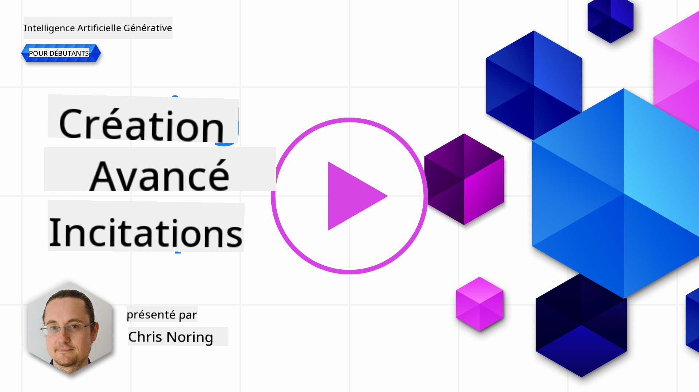

<!--
CO_OP_TRANSLATOR_METADATA:
{
  "original_hash": "b2651fb16bcfbc62b8e518751ed90fdb",
  "translation_date": "2025-10-17T22:36:12+00:00",
  "source_file": "05-advanced-prompts/README.md",
  "language_code": "fr"
}
-->
# Créer des invites avancées

[](https://youtu.be/BAjzkaCdRok?si=NmUIyRf7-cDgbjtt)

Reprenons quelques notions du chapitre précédent :

> L'**ingénierie des invites** est le processus par lequel nous **guidons le modèle vers des réponses plus pertinentes** en fournissant des instructions ou un contexte plus utiles.

Il y a également deux étapes pour rédiger des invites : construire l'invite en fournissant un contexte pertinent, et **l'optimisation**, c'est-à-dire comment améliorer progressivement l'invite.

À ce stade, nous avons une compréhension de base de la rédaction des invites, mais nous devons aller plus loin. Dans ce chapitre, vous passerez de l'essai de diverses invites à la compréhension des raisons pour lesquelles une invite est meilleure qu'une autre. Vous apprendrez à construire des invites en suivant quelques techniques de base applicables à tout LLM.

## Introduction

Dans ce chapitre, nous aborderons les sujets suivants :

- Approfondir vos connaissances en ingénierie des invites en appliquant différentes techniques à vos invites.
- Configurer vos invites pour varier les résultats.

## Objectifs d'apprentissage

Après avoir terminé cette leçon, vous serez capable de :

- Appliquer des techniques d'ingénierie des invites qui améliorent les résultats de vos invites.
- Réaliser des invites qui sont soit variées, soit déterministes.

## Ingénierie des invites

L'ingénierie des invites est le processus de création d'invites qui produiront le résultat souhaité. L'ingénierie des invites ne se limite pas à écrire un texte d'invite. Ce n'est pas une discipline d'ingénierie, mais plutôt un ensemble de techniques que vous pouvez appliquer pour obtenir le résultat souhaité.

### Exemple d'une invite

Prenons une invite de base comme celle-ci :

> Générer 10 questions sur la géographie.

Dans cette invite, vous appliquez en réalité un ensemble de techniques différentes.

Analysons cela.

- **Contexte**, vous précisez qu'il doit s'agir de "géographie".
- **Limiter le résultat**, vous souhaitez obtenir au maximum 10 questions.

### Limites des invites simples

Vous pourriez obtenir ou non le résultat souhaité. Vous obtiendrez vos questions générées, mais la géographie est un sujet vaste et vous pourriez ne pas obtenir ce que vous voulez pour les raisons suivantes :

- **Sujet vaste**, vous ne savez pas si cela portera sur les pays, les capitales, les fleuves, etc.
- **Format**, que se passe-t-il si vous souhaitez que les questions soient formatées d'une certaine manière ?

Comme vous pouvez le constater, il y a beaucoup à prendre en compte lors de la création d'invites.

Jusqu'à présent, nous avons vu un exemple d'invite simple, mais l'IA générative est capable de bien plus pour aider les personnes dans divers rôles et industries. Explorons quelques techniques de base.

### Techniques pour créer des invites

Tout d'abord, nous devons comprendre que la création d'invites est une propriété **émergente** d'un LLM, ce qui signifie que ce n'est pas une fonctionnalité intégrée au modèle, mais plutôt quelque chose que nous découvrons en utilisant le modèle.

Il existe quelques techniques de base que nous pouvons utiliser pour créer des invites pour un LLM. Explorons-les.

- **Invites sans contexte (Zero-shot prompting)**, c'est la forme la plus basique d'invite. C'est une seule invite demandant une réponse au LLM uniquement basée sur ses données d'entraînement.
- **Invites avec quelques exemples (Few-shot prompting)**, ce type d'invite guide le LLM en fournissant un ou plusieurs exemples sur lesquels il peut s'appuyer pour générer sa réponse.
- **Raisonnement par étapes (Chain-of-thought)**, ce type d'invite indique au LLM comment décomposer un problème en étapes.
- **Connaissances générées**, pour améliorer la réponse d'une invite, vous pouvez fournir des faits ou des connaissances générés en complément de votre invite.
- **Du plus simple au plus complexe (Least to most)**, comme le raisonnement par étapes, cette technique consiste à décomposer un problème en une série d'étapes et à demander que ces étapes soient effectuées dans l'ordre.
- **Auto-amélioration (Self-refine)**, cette technique consiste à critiquer la réponse du LLM et à lui demander de l'améliorer.
- **Invites maïeutiques (Maieutic prompting)**. Ici, vous voulez vous assurer que la réponse du LLM est correcte et vous lui demandez d'expliquer diverses parties de la réponse. C'est une forme d'auto-amélioration.

### Invites sans contexte (Zero-shot prompting)

Ce style d'invite est très simple, il consiste en une seule invite. Cette technique est probablement celle que vous utilisez lorsque vous commencez à apprendre sur les LLM. Voici un exemple :

- Invite : "Qu'est-ce que l'algèbre ?"
- Réponse : "L'algèbre est une branche des mathématiques qui étudie les symboles mathématiques et les règles pour manipuler ces symboles."

### Invites avec quelques exemples (Few-shot prompting)

Ce style d'invite aide le modèle en fournissant quelques
Comme vous pouvez le voir, les résultats ne pourraient pas être plus variés.

> Notez qu'il existe d'autres paramètres que vous pouvez modifier pour varier les résultats, comme top-k, top-p, pénalité de répétition, pénalité de longueur et pénalité de diversité, mais ceux-ci ne sont pas abordés dans ce programme.

## Bonnes pratiques

Il existe de nombreuses pratiques que vous pouvez appliquer pour essayer d'obtenir ce que vous souhaitez. Vous développerez votre propre style à mesure que vous utiliserez davantage les invites.

En plus des techniques que nous avons abordées, voici quelques bonnes pratiques à prendre en compte lors de l'utilisation d'un LLM :

- **Spécifiez le contexte**. Le contexte est important, plus vous pouvez préciser comme le domaine, le sujet, etc., mieux c'est.
- Limitez la sortie. Si vous souhaitez un nombre spécifique d'éléments ou une longueur spécifique, précisez-le.
- **Spécifiez à la fois quoi et comment**. N'oubliez pas de mentionner à la fois ce que vous voulez et comment vous le voulez, par exemple "Créez une API Web Python avec des routes pour les produits et les clients, divisez-la en 3 fichiers".
- **Utilisez des modèles**. Souvent, vous voudrez enrichir vos invites avec des données de votre entreprise. Utilisez des modèles pour cela. Les modèles peuvent contenir des variables que vous remplacez par des données réelles.
- **Écrivez correctement**. Les LLM peuvent vous fournir une réponse correcte, mais si vous écrivez correctement, vous obtiendrez une réponse encore meilleure.

## Exercice

Voici un code en Python montrant comment créer une API simple avec Flask :

```python
from flask import Flask, request

app = Flask(__name__)

@app.route('/')
def hello():
    name = request.args.get('name', 'World')
    return f'Hello, {name}!'

if __name__ == '__main__':
    app.run()
```

Utilisez un assistant IA comme GitHub Copilot ou ChatGPT et appliquez la technique de "self-refine" pour améliorer le code.

## Solution

Veuillez tenter de résoudre l'exercice en ajoutant des invites appropriées au code.

> [!TIP]
> Formulez une invite pour demander une amélioration, il est judicieux de limiter le nombre d'améliorations. Vous pouvez également demander une amélioration dans un domaine spécifique, par exemple l'architecture, les performances, la sécurité, etc.

[Solution](../../../05-advanced-prompts/python/aoai-solution.py)

## Vérification des connaissances

Pourquoi utiliserais-je l'invite de raisonnement en chaîne ? Donnez-moi une réponse correcte et deux réponses incorrectes.

1. Pour apprendre au LLM comment résoudre un problème.
1. B, Pour apprendre au LLM à trouver des erreurs dans le code.
1. C, Pour demander au LLM de proposer différentes solutions.

A : 1, car le raisonnement en chaîne consiste à montrer au LLM comment résoudre un problème en lui fournissant une série d'étapes, ainsi que des problèmes similaires et comment ils ont été résolus.

## 🚀 Défi

Vous venez d'utiliser la technique de "self-refine" dans l'exercice. Prenez un programme que vous avez créé et réfléchissez aux améliorations que vous souhaiteriez y apporter. Utilisez maintenant la technique de "self-refine" pour appliquer les changements proposés. Que pensez-vous du résultat, meilleur ou pire ?

## Excellent travail ! Continuez votre apprentissage

Après avoir terminé cette leçon, consultez notre [collection d'apprentissage sur l'IA générative](https://aka.ms/genai-collection?WT.mc_id=academic-105485-koreyst) pour continuer à approfondir vos connaissances sur l'IA générative !

Rendez-vous à la leçon 6 où nous appliquerons nos connaissances en ingénierie des invites en [créant des applications de génération de texte](../06-text-generation-apps/README.md?WT.mc_id=academic-105485-koreyst)

---

**Avertissement** :  
Ce document a été traduit à l'aide du service de traduction automatique [Co-op Translator](https://github.com/Azure/co-op-translator). Bien que nous nous efforcions d'assurer l'exactitude, veuillez noter que les traductions automatisées peuvent contenir des erreurs ou des inexactitudes. Le document original dans sa langue d'origine doit être considéré comme la source faisant autorité. Pour des informations critiques, il est recommandé de recourir à une traduction humaine professionnelle. Nous ne sommes pas responsables des malentendus ou des interprétations erronées résultant de l'utilisation de cette traduction.