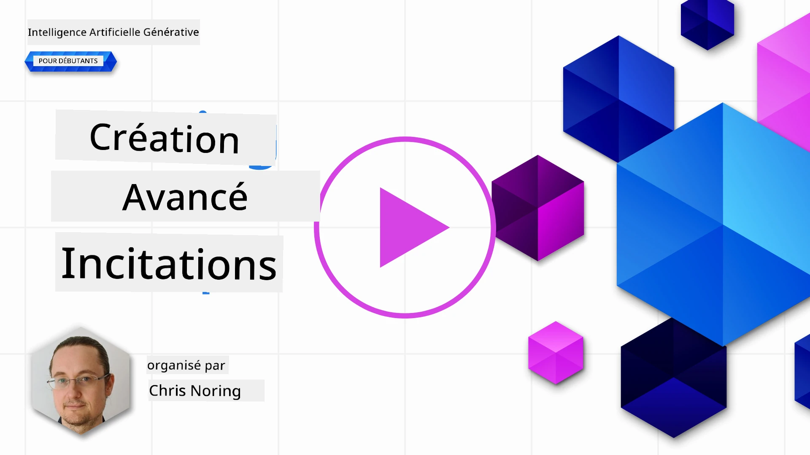

# Création de prompts avancés

[](https://youtu.be/BAjzkaCdRok?si=NmUIyRf7-cDgbjtt)

Récapitulons quelques apprentissages du chapitre précédent :

> Le _prompt engineering_ est le processus par lequel nous **guidons le modèle vers des réponses plus pertinentes** en fournissant des instructions ou un contexte plus utiles.

Il y a aussi deux étapes dans la rédaction de prompts : construire le prompt en fournissant un contexte pertinent, et l’_optimisation_, comment améliorer progressivement le prompt.

À ce stade, nous avons une compréhension de base sur comment rédiger des prompts, mais il faut aller plus loin. Dans ce chapitre, vous passerez de l’essai de différents prompts à comprendre pourquoi un prompt est meilleur qu’un autre. Vous apprendrez à construire des prompts en suivant des techniques de base qui peuvent s’appliquer à n’importe quel LLM.

## Introduction

Dans ce chapitre, nous couvrons les sujets suivants :

- Étendre vos connaissances en prompt engineering en appliquant différentes techniques à vos prompts.
- Configurer vos prompts pour varier les sorties.

## Objectifs d’apprentissage

Après avoir terminé cette leçon, vous saurez :

- Appliquer des techniques de prompt engineering qui améliorent les résultats de vos prompts.
- Réaliser des prompts avec des sorties soit variées soit déterministes.

## Prompt engineering

Le prompt engineering est le processus de création de prompts qui produisent le résultat souhaité. Ce processus va au-delà de la simple écriture d’un prompt texte. Le prompt engineering n’est pas une discipline d’ingénierie, c’est plutôt un ensemble de techniques que vous pouvez appliquer pour obtenir le résultat désiré.

### Un exemple de prompt

Prenons un prompt basique comme celui-ci :

> Génère 10 questions sur la géographie.

Dans ce prompt, vous appliquez en réalité un ensemble de différentes techniques de prompt.

Décomposons cela.

- **Contexte**, vous spécifiez que cela doit porter sur la "géographie".
- **Limitation de la sortie**, vous voulez au plus 10 questions.

### Limitations d’un prompt simple

Le résultat souhaité peut être obtenu ou non. Vous obtiendrez des questions, mais la géographie est un sujet vaste et vous n’obtiendrez peut-être pas ce que vous voulez pour les raisons suivantes :

- **Sujet large**, vous ne savez pas si ça portera sur les pays, les capitales, les rivières, etc.
- **Format**, que faire si vous vouliez que les questions soient formatées d’une certaine manière ?

Comme vous le voyez, il y a beaucoup à considérer lors de la création de prompts.

Jusqu’à présent, nous avons vu un exemple simple de prompt, mais l’IA générative est capable de bien plus pour aider les personnes dans différents rôles et secteurs. Explorons maintenant quelques techniques de base.

### Techniques de prompting

Premièrement, il faut comprendre que le prompting est une propriété _émergente_ d’un LLM, ce qui signifie que ce n’est pas une fonctionnalité intégrée au modèle mais plutôt quelque chose que l’on découvre en l’utilisant.

Il existe quelques techniques de base pour faire du prompt à un LLM. Explorons-les.

- **Prompting zero-shot**, c’est la forme la plus basique de prompting. Il s’agit d’un prompt unique demandant une réponse basée uniquement sur les données d’entraînement du LLM.
- **Prompting few-shot**, ce type de prompt guide le LLM en fournissant un ou plusieurs exemples dont il peut se servir pour générer sa réponse.
- **Chain-of-thought**, ce type de prompt indique au LLM comment décomposer un problème en étapes.
- **Savoir généré**, pour améliorer la réponse d’un prompt, vous pouvez fournir des faits ou des connaissances générées en plus de votre prompt.
- **Least to most**, comme chain-of-thought, cette technique consiste à décomposer un problème en une série d’étapes et demander que ces étapes soient effectuées dans l’ordre.
- **Auto-affinement (self-refine)**, cette technique consiste à critiquer la sortie du LLM puis à lui demander de l’améliorer.
- **Prompting maïeutique**. Ici, vous voulez vous assurer que la réponse du LLM est correcte et vous lui demandez d’expliquer différentes parties de la réponse. C’est une forme d’auto-affinement.

### Prompting zero-shot

Ce style de prompting est très simple, il consiste en un prompt unique. C’est probablement la technique que vous utilisez en commençant à apprendre à utiliser les LLM. Voici un exemple :

- Prompt : "Qu’est-ce que l’algèbre ?"
- Réponse : "L’algèbre est une branche des mathématiques qui étudie les symboles mathématiques et les règles pour manipuler ces symboles."

### Prompting few-shot

Ce style de prompting aide le modèle en fournissant quelques exemples avec la demande. Il s’agit d’un seul prompt avec des données supplémentaires spécifiques à la tâche. Voici un exemple :

- Prompt : "Écris un poème dans le style de Shakespeare. Voici quelques exemples de sonnets shakespearien :
  Sonnet 18 : 'Dois-je te comparer à un jour d’été ? Tu es plus charmant et plus tempéré...'
  Sonnet 116 : 'Ne permets point au mariage des esprits vrais d’entrer d’empêchements. L’amour n’est pas amour qui change quand le changement le trouve...'
  Sonnet 132 : 'Tes yeux que j’aime, et eux, en me plaignant, sachant ton cœur me tourmente avec mépris,...'
  Maintenant, écris un sonnet sur la beauté de la lune."
- Réponse : "Sur le ciel, la lune luit doucement, Dans une lumière argentée qui jette sa douce grâce,..."

Les exemples fournissent au LLM le contexte, le format ou le style de la sortie désirée. Ils aident le modèle à comprendre la tâche spécifique et à générer des réponses plus précises et pertinentes.

### Chain-of-thought

Chain-of-thought est une technique très intéressante car elle consiste à faire passer le LLM par une série d’étapes. L’idée est d’instruire le LLM de façon à ce qu’il comprenne comment faire quelque chose. Considérez l’exemple suivant, avec et sans chain-of-thought :

    - Prompt : "Alice a 5 pommes, jette 3 pommes, donne 2 à Bob et Bob en rend une, combien de pommes Alice a-t-elle ?"
    - Réponse : 5

Le LLM répond 5, ce qui est incorrect. La bonne réponse est 1 pomme, selon le calcul (5 -3 -2 + 1 = 1).

Alors comment apprendre au LLM à faire cela correctement ?

Essayons la chain-of-thought. Appliquer cette technique signifie :

1. Donner au LLM un exemple similaire.
1. Montrer le calcul, et comment le faire correctement.
1. Fournir le prompt original.

Voici comment faire :

- Prompt : "Lisa a 7 pommes, jette 1 pomme, donne 4 pommes à Bart et Bart en rend une :
  7 -1 = 6
  6 -4 = 2
  2 +1 = 3  
  Alice a 5 pommes, jette 3 pommes, donne 2 à Bob et Bob en rend une, combien de pommes Alice a-t-elle ?"
  Réponse : 1

Remarquez comment nous écrivons des prompts beaucoup plus longs avec un autre exemple, un calcul, puis le prompt original et nous obtenons la bonne réponse 1.

Comme vous le voyez, la chain-of-thought est une technique très puissante.

### Savoir généré

Souvent, lorsque vous souhaitez construire un prompt, vous voulez le faire en utilisant les données de votre propre entreprise. Vous voulez qu’une partie du prompt provienne de l’entreprise et que l’autre partie soit le prompt proprement dit qui vous intéresse.

Par exemple, voici à quoi votre prompt peut ressembler si vous êtes dans le secteur des assurances :

```text
{{company}}: {{company_name}}
{{products}}:
{{products_list}}
Please suggest an insurance given the following budget and requirements:
Budget: {{budget}}
Requirements: {{requirements}}
```

Ci-dessus, vous voyez comment le prompt est construit avec un template. Dans le template, plusieurs variables, notées `{{variable}}`, seront remplacées par des valeurs réelles provenant d’une API d’entreprise.

Voici un exemple de ce à quoi le prompt pourrait ressembler une fois les variables remplacées par le contenu de votre entreprise :

```text
Insurance company: ACME Insurance
Insurance products (cost per month):
- Car, cheap, 500 USD
- Car, expensive, 1100 USD
- Home, cheap, 600 USD
- Home, expensive, 1200 USD
- Life, cheap, 100 USD

Please suggest an insurance given the following budget and requirements:
Budget: $1000
Requirements: Car, Home, and Life insurance
```

Exécuter ce prompt dans un LLM produira une réponse comme celle-ci :

```output
Given the budget and requirements, we suggest the following insurance package from ACME Insurance:
- Car, cheap, 500 USD
- Home, cheap, 600 USD
- Life, cheap, 100 USD
Total cost: $1,200 USD
```

Comme vous le voyez, il suggère aussi l’assurance vie, ce qu’il ne devrait pas faire. Ce résultat indique que nous devons optimiser le prompt en le rendant plus clair sur ce qu’il doit autoriser. Après quelques _essais-erreurs_, nous obtenons le prompt suivant :

```text
Insurance company: ACME Insurance
Insurance products (cost per month):
- type: Car, cheap, cost: 500 USD
- type: Car, expensive, cost: 1100 USD
- type: Home, cheap, cost: 600 USD
- type: Home, expensive, cost: 1200 USD
- type: Life, cheap, cost: 100 USD

Please suggest an insurance given the following budget and requirements:
Budget: $1000 restrict choice to types: Car, Home
```

Remarquez comment l’ajout de _type_ et _coût_ ainsi que l’utilisation du mot-clé _restreindre_ aide le LLM à comprendre ce que nous voulons.

Maintenant nous obtenons la réponse suivante :

```output
Given the budget and requirements, we suggest the Car, Cheap insurance product which costs 500 USD per month.
```

Le but de cet exemple est de montrer que même si nous utilisons une technique basique comme le _savoir généré_, nous devons souvent optimiser le prompt pour obtenir le résultat souhaité.

### Least-to-most

L’idée du prompting Least-to-most est de décomposer un problème plus large en sous-problèmes. De cette façon, vous guidez le LLM sur comment "conquérir" le problème plus complexe. Un bon exemple pourrait être en science des données où vous pouvez demander au LLM de diviser un problème ainsi :

> Prompt : Comment réaliser une science des données en 5 étapes ?

Avec votre assistant IA répondant :

1. Collecter les données
1. Nettoyer les données
1. Analyser les données
1. Visualiser les données
1. Présenter les données

### Auto-affinement, critique des résultats

Avec les IA génératives et les LLM, on ne peut pas faire confiance aux résultats. Il faut les vérifier. Après tout, le LLM ne fait que présenter ce qu’il estime être la chose la plus probable à dire, pas forcément ce qui est correct. Par conséquent, une bonne idée est de demander au LLM de se critiquer lui-même, ce qui nous amène à la technique d’auto-affinement.

Voici comment cela fonctionne en suivant ces étapes :

1. Prompt initial demandant au LLM de résoudre un problème
1. Le LLM répond
1. Vous critiquez la réponse et demandez à l’IA d’améliorer
1. Le LLM répond à nouveau, cette fois en tenant compte de la critique et suggère des solutions

Vous pouvez répéter ce processus autant de fois que vous le souhaitez.

Voici un exemple utilisant cette technique :

> Prompt : "Créer une API Web Python avec les routes produits et clients"

Réponse IA :

```python
import flask
app = Flask(__name__)

@app.route('/products')
def products():
    return 'Products'

@app.route('/customers')
def customers():
    return 'Customers'
```

> Prompt : suggère 3 améliorations du code ci-dessus

Réponse IA :

```text
Sure, here are three suggestions to improve the code:

Import the correct module: The first line should import Flask instead of flask. The correct import statement should be from flask import Flask.

Add a main function: Add a if __name__ == '__main__': block to the end of the file to run the application when the file is executed.

Use f-strings: Use f-strings to format the return statements in the route functions. For example, return 'Products' can be changed to return f'This is the {request.path} page'.
```

```python
from flask import Flask, request

app = Flask(__name__)

@app.route('/products')
def products():
    return f'This is the {request.path} page'

@app.route('/customers')
def customers():
    return f'This is the {request.path} page'

if __name__ == '__main__':
    app.run()
```

Comme vous le voyez, la réponse IA ci-dessus améliore le premier code suggéré grâce à la critique de la première réponse.

### Prompting maïeutique

Le prompting maïeutique est une technique similaire à l’auto-affinement mais concerne davantage le fait de demander au LLM de s’expliquer lui-même. L’objectif est de réduire les incohérences dans la sortie du LLM afin de s’assurer qu’il arrive à la bonne réponse. Le flux de travail à suivre est :

1. Demander au LLM de répondre à une question
1. Pour chaque partie de la réponse, demander au LLM de l’expliquer plus en détail.
1. S’il y a des incohérences, écarter les parties incohérentes.

Répéter les étapes 2 et 3 jusqu’à avoir passé en revue toutes les parties et être satisfait de la réponse.

Voici un exemple de prompt :

> prompt : Comment puis-je créer un plan de crise pour atténuer une pandémie en 5 étapes ?
> Réponse LLM :

```text
1. Identify the risks
1. Identify the stakeholders
1. Identify the resources
1. Identify the actions
1. Identify the communication channels
```

Cinq étapes sont identifiées, mais peut-on déterminer si c’est correct ? Demandons au LLM d’expliquer chaque étape :

> prompt : Explique la première étape en plus de détail, quels sont les risques en détail avec une pandémie ?

```text
The risks are the following:

- Loss of life
- Loss of business
- Loss of reputation
- Loss of customers
- Loss of employees
```

À ce stade, nous voulons nous assurer que le LLM est correct, alors nous lui demandons d’expliquer le premier risque plus en détail en espérant qu’il soit cohérent avec la réponse précédente :

> prompt : Dans une pandémie, quel est le plus grand risque et pourquoi ?

```text
The biggest risk is loss of life because it's the most important thing to protect.
```

> Quels sont les deux plus grands risques dans une pandémie ?

```text
The two biggest risks are loss of life and loss of business.
```

À ce stade, le LLM est cohérent et mentionne "la vie" et "l’entreprise" comme les deux principaux risques. Nous pouvons maintenant passer à l’étape suivante avec une confiance raisonnable. Cependant, nous ne devons jamais faire confiance aveuglément au LLM, il faut toujours vérifier la sortie.

## Variez votre sortie

Les LLM sont par nature non déterministes, ce qui signifie que vous obtiendrez des résultats différents à chaque fois que vous exécutez le même prompt. Essayez le prompt suivant par exemple :

> "Génère du code pour une API Web Python"

```python
# Importer les modules nécessaires
import flask
from flask import request, jsonify

# Créer une application Flask
app = flask.Flask(__name__)

# Créer une route pour l'API
@app.route('/api', methods=['GET'])
def api():
    # Obtenir les données de la requête
    data = request.args

    # Traiter les données
    result = process_data(data)

    # Retourner le résultat au format JSON
    return jsonify(result)

# Fonction pour traiter les données
def process_data(data):
    # Faire quelque chose avec les données
    result = data + 1

    # Retourner le résultat
    return result

# Exécuter l'application
if __name__ == '__main__':
    app.run()

```

Exécuter le même prompt à nouveau génère une réponse légèrement différente :

```python
#importer les packages nécessaires
import flask
from flask import request, jsonify

#créer l'application Flask
app = flask.Flask(__name__)
app.config["DEBUG"] = True

#créer une liste de livres
books = [
    {'id': 0,
     'title': 'A Fire Upon the Deep',
     'author': 'Vernor Vinge',
     'first_sentence': 'The coldsleep itself was dreamless.',
     'year_published': '1992'},
    {'id': 1,
     'title': 'The Ones Who Walk Away From Omelas',
     'author': 'Ursula K. Le Guin',
     'first_sentence': 'With a clamor of bells that set the swallows soaring, the Festival of Summer came to the city Omelas, bright-towered by the sea.',
     'published': '1973'},
    {'id': 2,
     'title': 'Dhalgren',
     'author': 'Samuel R. Delany',
     'first_sentence': 'to wound the autumnal city.',
     'published': '1975'}
]

#créer un point de terminaison pour l'API
@app.route('/', methods=['GET'])
def home():
    return '''<h1>Books API</h1>
<p>A prototype API for retrieving books.</p>'''

#créer un point de terminaison pour retourner tous les livres
@app.route('/api/v1/resources/books/all', methods=['GET'])
def api_all():
    return jsonify(books)

#créer un point de terminaison pour retourner un seul livre
@app.route('/api/v1/resources/books', methods=['GET'])
def api_id():
    #vérifier si un ID a été fourni dans l'URL
    #si l'ID est fourni, l'assigner à une variable
    #si aucun ID n'est fourni, afficher une erreur
    if 'id' in request.args:
        id = int(request.args['id'])
    else:
        return "Error: No id field provided. Please specify an id."

    #créer une liste vide pour nos résultats
    results = []

    #parcourir les données et correspondre aux résultats qui conviennent à l'ID demandé
    #les IDs sont uniques, mais d'autres champs peuvent retourner plusieurs résultats
    for book in books:
        if book['id'] == id:
            results.append(book)

    #utiliser la fonction jsonify de Flask pour convertir notre liste de
    #dictionnaires Python au format JSON
    return jsonify(results)

app.run()
```

> Est-ce que la sortie variée est un problème ?

Cela dépend de ce que vous essayez de faire. Si vous voulez une réponse spécifique, alors c’est un problème. Si vous êtes d’accord avec une sortie variée comme "Génère n’importe quelles 3 questions sur la géographie", alors ce n’en est pas un.

### Utiliser la température pour varier votre sortie

D’accord, nous avons décidé de limiter la sortie afin d’avoir quelque chose de plus prévisible, donc plus déterministe. Comment faire cela ?

La température est une valeur comprise entre 0 et 1, où 0 est la valeur la plus déterministe et 1 la plus variée. La valeur par défaut est 0,7. Voyons ce qui se passe avec deux exécutions du même prompt avec la température réglée à 0,1 :

> "Génère du code pour une API Web Python"

```python
#importer les bibliothèques nécessaires
import flask
from flask import request, jsonify

#créer une instance de la classe Flask
app = flask.Flask(__name__)

#créer un point de terminaison pour l'API
@app.route('/api/v1/endpoint', methods=['GET'])
def api_endpoint():
    #obtenir les données de la requête
    data = request.get_json()

    #traiter les données
    result = process_data(data)

    #retourner le résultat
    return jsonify(result)

#fonction pour traiter les données
def process_data(data):
    #traiter les données
    result = {'result': 'success'}

    #retourner le résultat
    return result

#exécuter l'application Flask
if __name__ == '__main__':
    app.run()

```

Une nouvelle exécution du prompt donne ce résultat :

```python
#importer les bibliothèques nécessaires
import flask
from flask import request, jsonify

#créer une application Flask
app = flask.Flask(__name__)

#créer une route pour l'API
@app.route('/api', methods=['GET'])
def api_call():
    #obtenir les données de la requête
    data = request.get_json()

    #traiter les données
    result = process_data(data)

    #retourner le résultat
    return jsonify(result)

#définir la fonction process_data
def process_data(data):
    #faire quelque chose avec les données
    result = data + 1

    #retourner le résultat
    return result

#exécuter l'application
if __name__ == '__main__':
    app.run()

```

Il n’y a qu’une toute petite différence entre ces deux sorties. Faisons l’inverse cette fois et réglons la température à 0,9 :

```python
# Importer les bibliothèques nécessaires
import flask
from flask import request, jsonify

# Créer une application Flask
app = flask.Flask(__name__)

# Créer une route pour l'API
@app.route('/api', methods=['GET'])
def api_call():
    # Obtenir les données de la requête
    data = request.args

    # Traiter les données
    result = process_data(data)

    # Retourner le résultat
    return jsonify(result)

# Fonction pour traiter les données
def process_data(data):
    # Faire quelque chose avec les données
    result = data + 1

    # Retourner le résultat
    return result

# Exécuter l'application
if __name__ == '__main__':
    app.run()

```

et la deuxième tentative à 0,9 comme valeur de température :

```python
import flask
from flask import request, jsonify

# créer l'application Flask
app = flask.Flask(__name__)
app.config['DEBUG'] = True

# créer quelques données de test
books = [
    {'id': 0, 'title': 'A Fire Upon The Deep', 'author': 'Vernor Vinge', 'first_sentence': 'The coldsleep itself was dreamless.', 'year_published': '1992'},
    {'id': 1, 'title': 'The Ones Who Walk Away From Omelas', 'author': 'Ursula K. Le Guin', 'first_sentence': 'With a clamor of bells that set the swallows soaring, the Festival of Summer came to the city Omelas, bright-towered by the sea.', 'published': '1973'},
    {'id': 2, 'title': 'Dhalgren', 'author': 'Samuel R. Delany', 'first_sentence': 'to wound the autumnal city.', 'published': '1975'}
]

# créer un point de terminaison
@app.route('/', methods=['GET'])
def home():
    return '''<h1>Welcome to our book API!</h1>'''

@app.route('/api/v1/resources/books

```

Comme vous le voyez, les résultats ne pourraient pas être plus variés.


> Notez qu'il existe plus de paramètres que vous pouvez modifier pour varier la sortie, comme top-k, top-p, la pénalité de répétition, la pénalité de longueur et la pénalité de diversité, mais ceux-ci sont hors du cadre de ce programme.

## Bonnes pratiques

Il existe de nombreuses pratiques que vous pouvez appliquer pour essayer d'obtenir ce que vous voulez. Vous trouverez votre propre style au fur et à mesure que vous utiliserez le prompting de plus en plus.

En plus des techniques que nous avons couvertes, il y a quelques bonnes pratiques à considérer lors du prompting d'un LLM.

Voici quelques bonnes pratiques à considérer :

- **Spécifiez le contexte**. Le contexte importe, plus vous pouvez spécifier comme le domaine, le sujet, etc., mieux c'est.
- Limitez la sortie. Si vous souhaitez un nombre spécifique d'éléments ou une longueur spécifique, précisez-le.
- **Spécifiez à la fois quoi et comment**. N'oubliez pas de mentionner à la fois ce que vous voulez et comment vous le voulez, par exemple « Créez une API Web Python avec les routes products et customers, divisez-la en 3 fichiers ».
- **Utilisez des modèles**. Souvent, vous voudrez enrichir vos prompts avec des données de votre entreprise. Utilisez des modèles pour cela. Les modèles peuvent avoir des variables que vous remplacez par les données réelles.
- **Épelez correctement**. Les LLM peuvent vous fournir une réponse correcte, mais si vous vous exprimez correctement, vous obtiendrez une meilleure réponse.

## Exercice

Voici un code en Python montrant comment créer une API simple avec Flask :

```python
from flask import Flask, request

app = Flask(__name__)

@app.route('/')
def hello():
    name = request.args.get('name', 'World')
    return f'Hello, {name}!'

if __name__ == '__main__':
    app.run()
```

Utilisez un assistant IA comme GitHub Copilot ou ChatGPT et appliquez la technique de « self-refine » pour améliorer le code.

## Solution

Veuillez essayer de résoudre l'exercice en ajoutant des prompts appropriés au code.

> [!TIP]
> Formulez un prompt pour demander à l'améliorer, il est judicieux de limiter le nombre d'améliorations. Vous pouvez aussi demander une amélioration dans un certain domaine, par exemple architecture, performance, sécurité, etc.

[Solution](../../../05-advanced-prompts/python/aoai-solution.py)

## Vérification des connaissances

Pourquoi utiliserais-je le prompting en chaîne de pensée ? Montrez-moi 1 réponse correcte et 2 réponses incorrectes.

1. Pour enseigner au LLM comment résoudre un problème.
1. B, Pour apprendre au LLM à trouver des erreurs dans le code.
1. C, Pour instruire le LLM à proposer différentes solutions.

A : 1, parce que le chaînage de pensée consiste à montrer au LLM comment résoudre un problème en lui fournissant une série d’étapes, ainsi que des problèmes similaires et la manière dont ils ont été résolus.

## 🚀 Challenge

Vous venez d'utiliser la technique de self-refine dans l'exercice. Prenez un programme que vous avez construit et réfléchissez aux améliorations que vous souhaiteriez y apporter. Utilisez maintenant la technique de self-refine pour appliquer les changements proposés. Quel a été, selon vous, le résultat, meilleur ou pire ?

## Excellent travail ! Continuez votre apprentissage

Après avoir terminé cette leçon, consultez notre [collection d’apprentissage de l’IA générative](https://aka.ms/genai-collection?WT.mc_id=academic-105485-koreyst) pour continuer à progresser dans votre connaissance de l’IA générative !

Rendez-vous à la Leçon 6 où nous appliquerons nos connaissances en Prompt Engineering en [créant des applications de génération de texte](../06-text-generation-apps/README.md?WT.mc_id=academic-105485-koreyst)

---

<!-- CO-OP TRANSLATOR DISCLAIMER START -->
**Avertissement** :
Ce document a été traduit à l'aide du service de traduction automatique [Co-op Translator](https://github.com/Azure/co-op-translator). Bien que nous nous efforçions d'assurer l'exactitude, veuillez noter que les traductions automatisées peuvent contenir des erreurs ou des inexactitudes. Le document original dans sa langue native doit être considéré comme la source faisant autorité. Pour les informations critiques, il est recommandé de recourir à une traduction professionnelle réalisée par un humain. Nous ne saurions être tenus responsables des malentendus ou erreurs d'interprétation découlant de l'utilisation de cette traduction.
<!-- CO-OP TRANSLATOR DISCLAIMER END -->