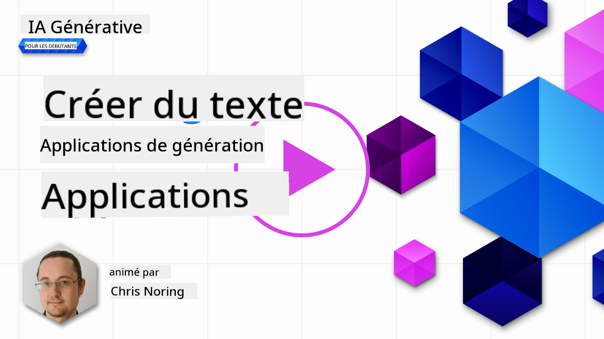

<!--
CO_OP_TRANSLATOR_METADATA:
{
  "original_hash": "5ec6c92b629564538ef397c550adb73e",
  "translation_date": "2025-06-25T13:51:53+00:00",
  "source_file": "06-text-generation-apps/README.md",
  "language_code": "fr"
}
-->
# Construire des applications de génération de texte

[](https://aka.ms/gen-ai-lesson6-gh?WT.mc_id=academic-105485-koreyst)

> _(Cliquez sur l'image ci-dessus pour voir la vidéo de cette leçon)_

Vous avez vu jusqu'à présent dans ce programme que des concepts clés comme les invites et même une discipline entière appelée "ingénierie des invites" sont essentiels. De nombreux outils avec lesquels vous pouvez interagir, comme ChatGPT, Office 365, Microsoft Power Platform et plus encore, vous permettent d'utiliser des invites pour accomplir quelque chose.

Pour ajouter une telle expérience à une application, vous devez comprendre des concepts comme les invites, les complétions et choisir une bibliothèque avec laquelle travailler. C'est exactement ce que vous apprendrez dans ce chapitre.

## Introduction

Dans ce chapitre, vous allez :

- Découvrir la bibliothèque openai et ses concepts fondamentaux.
- Construire une application de génération de texte en utilisant openai.
- Comprendre comment utiliser des concepts tels que l'invite, la température et les jetons pour créer une application de génération de texte.

## Objectifs d'apprentissage

À la fin de cette leçon, vous serez capable de :

- Expliquer ce qu'est une application de génération de texte.
- Construire une application de génération de texte en utilisant openai.
- Configurer votre application pour utiliser plus ou moins de jetons et également modifier la température pour un résultat varié.

## Qu'est-ce qu'une application de génération de texte ?

Normalement, lorsque vous construisez une application, elle possède une sorte d'interface comme les suivantes :

- Basée sur des commandes. Les applications de console sont des applications typiques où vous tapez une commande et elle effectue une tâche. Par exemple, `git` est une application basée sur des commandes.
- Interface utilisateur (UI). Certaines applications ont des interfaces graphiques (GUI) où vous cliquez sur des boutons, saisissez du texte, sélectionnez des options et plus encore.

### Les applications de console et UI sont limitées

Comparez cela à une application basée sur des commandes où vous tapez une commande :

- **C'est limité**. Vous ne pouvez pas taper n'importe quelle commande, seulement celles que l'application prend en charge.
- **Spécifique à une langue**. Certaines applications prennent en charge de nombreuses langues, mais par défaut, l'application est conçue pour une langue spécifique, même si vous pouvez ajouter un support pour d'autres langues.

### Avantages des applications de génération de texte

Alors, en quoi une application de génération de texte est-elle différente ?

Dans une application de génération de texte, vous avez plus de flexibilité, vous n'êtes pas limité à un ensemble de commandes ou à une langue d'entrée spécifique. Au lieu de cela, vous pouvez utiliser le langage naturel pour interagir avec l'application. Un autre avantage est que vous interagissez déjà avec une source de données qui a été entraînée sur un vaste corpus d'informations, alors qu'une application traditionnelle pourrait être limitée à ce qui se trouve dans une base de données.

### Que puis-je construire avec une application de génération de texte ?

Il y a beaucoup de choses que vous pouvez construire. Par exemple :

- **Un chatbot**. Un chatbot répondant à des questions sur des sujets, comme votre entreprise et ses produits, pourrait être un bon choix.
- **Assistant**. Les LLMs sont excellents pour des tâches telles que résumer du texte, obtenir des insights à partir de texte, produire du texte comme des CV et plus encore.
- **Assistant de code**. En fonction du modèle de langage que vous utilisez, vous pouvez construire un assistant de code qui vous aide à écrire du code. Par exemple, vous pouvez utiliser un produit comme GitHub Copilot ainsi que ChatGPT pour vous aider à écrire du code.

## Comment puis-je commencer ?

Eh bien, vous devez trouver un moyen de vous intégrer à un LLM, ce qui implique généralement les deux approches suivantes :

- Utiliser une API. Ici, vous construisez des requêtes web avec votre invite et obtenez du texte généré en retour.
- Utiliser une bibliothèque. Les bibliothèques aident à encapsuler les appels API et à les rendre plus faciles à utiliser.

## Bibliothèques/SDKs

Il existe quelques bibliothèques bien connues pour travailler avec les LLMs comme :

- **openai**, cette bibliothèque facilite la connexion à votre modèle et l'envoi d'invites.

Puis il y a des bibliothèques qui fonctionnent à un niveau supérieur comme :

- **Langchain**. Langchain est bien connu et prend en charge Python.
- **Semantic Kernel**. Semantic Kernel est une bibliothèque de Microsoft prenant en charge les langages C#, Python et Java.

## Première application utilisant openai

Voyons comment nous pouvons construire notre première application, quelles bibliothèques nous avons besoin, combien est nécessaire et ainsi de suite.

### Installer openai

Il existe de nombreuses bibliothèques pour interagir avec OpenAI ou Azure OpenAI. Il est possible d'utiliser de nombreux langages de programmation comme C#, Python, JavaScript, Java et plus encore. Nous avons choisi d'utiliser la bibliothèque `openai` Python, donc nous utiliserons `pip` pour l'installer.

```bash
pip install openai
```

### Créer une ressource

Vous devez effectuer les étapes suivantes :

- Créer un compte sur Azure [https://azure.microsoft.com/free/](https://azure.microsoft.com/free/?WT.mc_id=academic-105485-koreyst).
- Obtenir l'accès à Azure OpenAI. Allez sur [https://learn.microsoft.com/azure/ai-services/openai/overview#how-do-i-get-access-to-azure-openai](https://learn.microsoft.com/azure/ai-services/openai/overview#how-do-i-get-access-to-azure-openai?WT.mc_id=academic-105485-koreyst) et demandez l'accès.

  > [!NOTE]
  > Au moment de la rédaction, vous devez demander l'accès à Azure OpenAI.

- Installer Python <https://www.python.org/>
- Avoir créé une ressource de service Azure OpenAI. Voir ce guide pour savoir [créer une ressource](https://learn.microsoft.com/azure/ai-services/openai/how-to/create-resource?pivots=web-portal?WT.mc_id=academic-105485-koreyst).

### Localiser la clé API et le point de terminaison

À ce stade, vous devez indiquer à votre bibliothèque `openai` quelle clé API utiliser. Pour trouver votre clé API, allez à la section "Clés et point de terminaison" de votre ressource Azure OpenAI et copiez la valeur "Key 1".


Maintenant que vous avez copié ces informations, allons instruire les bibliothèques pour les utiliser.

> [!NOTE]
> Il vaut la peine de séparer votre clé API de votre code. Vous pouvez le faire en utilisant des variables d'environnement.
>
> - Définissez la variable d'environnement `OPENAI_API_KEY` to your API key.
>   `export OPENAI_API_KEY='sk-...'`

### Configurer Azure

Si vous utilisez Azure OpenAI, voici comment vous configurez :

```python
openai.api_type = 'azure'
openai.api_key = os.environ["OPENAI_API_KEY"]
openai.api_version = '2023-05-15'
openai.api_base = os.getenv("API_BASE")
```

Ci-dessus, nous configurons les éléments suivants :

- `api_type` to `azure`. This tells the library to use Azure OpenAI and not OpenAI.
- `api_key`, this is your API key found in the Azure Portal.
- `api_version`, this is the version of the API you want to use. At the time of writing, the latest version is `2023-05-15`.
- `api_base`, this is the endpoint of the API. You can find it in the Azure Portal next to your API key.

> [!NOTE] > `os.getenv` is a function that reads environment variables. You can use it to read environment variables like `OPENAI_API_KEY` and `API_BASE`. Set these environment variables in your terminal or by using a library like `dotenv`.

## Generate text

The way to generate text is to use the `Completion` class. Voici un exemple :

```python
prompt = "Complete the following: Once upon a time there was a"

completion = openai.Completion.create(model="davinci-002", prompt=prompt)
print(completion.choices[0].text)
```

Dans le code ci-dessus, nous créons un objet de complétion et passons le modèle que nous voulons utiliser et l'invite. Ensuite, nous imprimons le texte généré.

### Complétions de chat

Jusqu'à présent, vous avez vu comment nous avons utilisé `Completion` to generate text. But there's another class called `ChatCompletion` qui est plus adapté aux chatbots. Voici un exemple d'utilisation :

```python
import openai

openai.api_key = "sk-..."

completion = openai.ChatCompletion.create(model="gpt-3.5-turbo", messages=[{"role": "user", "content": "Hello world"}])
print(completion.choices[0].message.content)
```

Plus d'informations sur cette fonctionnalité dans un prochain chapitre.

## Exercice - votre première application de génération de texte

Maintenant que nous avons appris à configurer et à configurer openai, il est temps de construire votre première application de génération de texte. Pour construire votre application, suivez ces étapes :

1. Créez un environnement virtuel et installez openai :

   ```bash
   python -m venv venv
   source venv/bin/activate
   pip install openai
   ```

   > [!NOTE]
   > Si vous utilisez Windows, tapez `venv\Scripts\activate` instead of `source venv/bin/activate`.

   > [!NOTE]
   > Locate your Azure OpenAI key by going to [https://portal.azure.com/](https://portal.azure.com/?WT.mc_id=academic-105485-koreyst) and search for `Open AI` and select the `Open AI resource` and then select `Keys and Endpoint` and copy the `Key 1` value.

1. Créez un fichier _app.py_ et donnez-lui le code suivant :

   ```python
   import openai

   openai.api_key = "<replace this value with your open ai key or Azure OpenAI key>"

   openai.api_type = 'azure'
   openai.api_version = '2023-05-15'
   openai.api_base = "<endpoint found in Azure Portal where your API key is>"
   deployment_name = "<deployment name>"

   # add your completion code
   prompt = "Complete the following: Once upon a time there was a"
   messages = [{"role": "user", "content": prompt}]

   # make completion
   completion = openai.chat.completions.create(model=deployment_name, messages=messages)

   # print response
   print(completion.choices[0].message.content)
   ```

   > [!NOTE]
   > Si vous utilisez Azure OpenAI, vous devez définir `api_type` to `azure` and set the `api_key` sur votre clé Azure OpenAI.

   Vous devriez voir une sortie comme celle-ci :

   ```output
    very unhappy _____.

   Once upon a time there was a very unhappy mermaid.
   ```

## Différents types d'invites, pour différentes choses

Maintenant, vous avez vu comment générer du texte à l'aide d'une invite. Vous avez même un programme en cours d'exécution que vous pouvez modifier et changer pour générer différents types de texte.

Les invites peuvent être utilisées pour toutes sortes de tâches. Par exemple :

- **Générer un type de texte**. Par exemple, vous pouvez générer un poème, des questions pour un quiz, etc.
- **Rechercher des informations**. Vous pouvez utiliser des invites pour rechercher des informations comme l'exemple suivant 'Que signifie CORS dans le développement web ?'.
- **Générer du code**. Vous pouvez utiliser des invites pour générer du code, par exemple développer une expression régulière utilisée pour valider des e-mails ou pourquoi ne pas générer un programme entier, comme une application web ?

## Un cas d'utilisation plus pratique : un générateur de recettes

Imaginez que vous avez des ingrédients à la maison et que vous voulez cuisiner quelque chose. Pour cela, vous avez besoin d'une recette. Un moyen de trouver des recettes est d'utiliser un moteur de recherche ou vous pourriez utiliser un LLM.

Vous pourriez écrire une invite comme ceci :

> "Montrez-moi 5 recettes pour un plat avec les ingrédients suivants : poulet, pommes de terre et carottes. Par recette, listez tous les ingrédients utilisés"

Étant donné l'invite ci-dessus, vous pourriez obtenir une réponse similaire à :

```output
1. Roasted Chicken and Vegetables:
Ingredients:
- 4 chicken thighs
- 2 potatoes, cut into cubes
- 2 carrots, cut into cubes
- 2 tablespoons olive oil
- 2 cloves garlic, minced
- 1 teaspoon dried thyme
- 1 teaspoon dried oregano
- Salt and pepper, to taste

2. Chicken and Potato Stew:
Ingredients:
- 2 tablespoons olive oil
- 1 onion, diced
- 2 cloves garlic, minced
- 2 chicken breasts, cut into cubes
- 2 potatoes, cut into cubes
- 2 carrots, cut into cubes
- 1 teaspoon dried oregano
- 1 teaspoon dried thyme
- 1 cup chicken broth
- Salt and pepper, to taste

3. Chicken and Potato Bake:
Ingredients:
- 2 tablespoons olive oil
- 2 chicken breasts, cut into cubes
- 2 potatoes, cut into cubes
- 2 carrots, cut into cubes
- 1 onion, diced
- 2 cloves garlic, minced
- 1 teaspoon dried oregano
- 1 teaspoon dried thyme
- 1 cup chicken broth
- Salt and pepper, to taste

4. Chicken and Potato Soup:
Ingredients:
- 2 tablespoons olive oil
- 1 onion, diced
- 2 cloves garlic, minced
- 2 chicken breasts, cut into cubes
- 2 potatoes, cut into cubes
- 2 carrots, cut into cubes
- 1 teaspoon dried oregano
- 1 teaspoon dried thyme
- 4 cups chicken broth
- Salt and pepper, to taste

5. Chicken and Potato Hash:
Ingredients:
- 2 tablespoons olive oil
- 2 chicken breasts, cut into cubes
- 2 potatoes, cut into cubes
- 2 carrots, cut into cubes
- 1 onion, diced
- 2 cloves garlic, minced
- 1 teaspoon dried oregano
```

Ce résultat est excellent, je sais quoi cuisiner. À ce stade, ce qui pourrait être utile comme améliorations sont :

- Filtrer les ingrédients que je n'aime pas ou auxquels je suis allergique.
- Produire une liste de courses, au cas où je n'aurais pas tous les ingrédients à la maison.

Pour les cas ci-dessus, ajoutons une invite supplémentaire :

> "Veuillez supprimer les recettes contenant de l'ail car je suis allergique et remplacez-le par autre chose. Également, veuillez produire une liste de courses pour les recettes, en considérant que j'ai déjà du poulet, des pommes de terre et des carottes à la maison."

Maintenant, vous avez un nouveau résultat, à savoir :

```output
1. Roasted Chicken and Vegetables:
Ingredients:
- 4 chicken thighs
- 2 potatoes, cut into cubes
- 2 carrots, cut into cubes
- 2 tablespoons olive oil
- 1 teaspoon dried thyme
- 1 teaspoon dried oregano
- Salt and pepper, to taste

2. Chicken and Potato Stew:
Ingredients:
- 2 tablespoons olive oil
- 1 onion, diced
- 2 chicken breasts, cut into cubes
- 2 potatoes, cut into cubes
- 2 carrots, cut into cubes
- 1 teaspoon dried oregano
- 1 teaspoon dried thyme
- 1 cup chicken broth
- Salt and pepper, to taste

3. Chicken and Potato Bake:
Ingredients:
- 2 tablespoons olive oil
- 2 chicken breasts, cut into cubes
- 2 potatoes, cut into cubes
- 2 carrots, cut into cubes
- 1 onion, diced
- 1 teaspoon dried oregano
- 1 teaspoon dried thyme
- 1 cup chicken broth
- Salt and pepper, to taste

4. Chicken and Potato Soup:
Ingredients:
- 2 tablespoons olive oil
- 1 onion, diced
- 2 chicken breasts, cut into cubes
- 2 potatoes, cut into cubes
- 2 carrots, cut into cubes
- 1 teaspoon dried oregano
- 1 teaspoon dried thyme
- 4 cups chicken broth
- Salt and pepper, to taste

5. Chicken and Potato Hash:
Ingredients:
- 2 tablespoons olive oil
- 2 chicken breasts, cut into cubes
- 2 potatoes, cut into cubes
- 2 carrots, cut into cubes
- 1 onion, diced
- 1 teaspoon dried oregano

Shopping List:
- Olive oil
- Onion
- Thyme
- Oregano
- Salt
- Pepper
```

Ce sont vos cinq recettes, sans mention d'ail et vous avez également une liste de courses en tenant compte de ce que vous avez déjà à la maison.

## Exercice - construire un générateur de recettes

Maintenant que nous avons simulé un scénario, écrivons du code pour correspondre au scénario démontré. Pour ce faire, suivez ces étapes :

1. Utilisez le fichier _app.py_ existant comme point de départ
1. Localisez la variable `prompt` et changez son code pour le suivant :

   ```python
   prompt = "Show me 5 recipes for a dish with the following ingredients: chicken, potatoes, and carrots. Per recipe, list all the ingredients used"
   ```

   Si vous exécutez maintenant le code, vous devriez voir une sortie similaire à :

   ```output
   -Chicken Stew with Potatoes and Carrots: 3 tablespoons oil, 1 onion, chopped, 2 cloves garlic, minced, 1 carrot, peeled and chopped, 1 potato, peeled and chopped, 1 bay leaf, 1 thyme sprig, 1/2 teaspoon salt, 1/4 teaspoon black pepper, 1 1/2 cups chicken broth, 1/2 cup dry white wine, 2 tablespoons chopped fresh parsley, 2 tablespoons unsalted butter, 1 1/2 pounds boneless, skinless chicken thighs, cut into 1-inch pieces
   -Oven-Roasted Chicken with Potatoes and Carrots: 3 tablespoons extra-virgin olive oil, 1 tablespoon Dijon mustard, 1 tablespoon chopped fresh rosemary, 1 tablespoon chopped fresh thyme, 4 cloves garlic, minced, 1 1/2 pounds small red potatoes, quartered, 1 1/2 pounds carrots, quartered lengthwise, 1/2 teaspoon salt, 1/4 teaspoon black pepper, 1 (4-pound) whole chicken
   -Chicken, Potato, and Carrot Casserole: cooking spray, 1 large onion, chopped, 2 cloves garlic, minced, 1 carrot, peeled and shredded, 1 potato, peeled and shredded, 1/2 teaspoon dried thyme leaves, 1/4 teaspoon salt, 1/4 teaspoon black pepper, 2 cups fat-free, low-sodium chicken broth, 1 cup frozen peas, 1/4 cup all-purpose flour, 1 cup 2% reduced-fat milk, 1/4 cup grated Parmesan cheese

   -One Pot Chicken and Potato Dinner: 2 tablespoons olive oil, 1 pound boneless, skinless chicken thighs, cut into 1-inch pieces, 1 large onion, chopped, 3 cloves garlic, minced, 1 carrot, peeled and chopped, 1 potato, peeled and chopped, 1 bay leaf, 1 thyme sprig, 1/2 teaspoon salt, 1/4 teaspoon black pepper, 2 cups chicken broth, 1/2 cup dry white wine

   -Chicken, Potato, and Carrot Curry: 1 tablespoon vegetable oil, 1 large onion, chopped, 2 cloves garlic, minced, 1 carrot, peeled and chopped, 1 potato, peeled and chopped, 1 teaspoon ground coriander, 1 teaspoon ground cumin, 1/2 teaspoon ground turmeric, 1/2 teaspoon ground ginger, 1/4 teaspoon cayenne pepper, 2 cups chicken broth, 1/2 cup dry white wine, 1 (15-ounce) can chickpeas, drained and rinsed, 1/2 cup raisins, 1/2 cup chopped fresh cilantro
   ```

   > NOTE, votre LLM est non déterministe, donc vous pourriez obtenir des résultats différents chaque fois que vous exécutez le programme.

   Super, voyons comment nous pouvons améliorer les choses. Pour améliorer les choses, nous voulons nous assurer que le code est flexible, donc les ingrédients et le nombre de recettes peuvent être améliorés et modifiés.

1. Changeons le code de la manière suivante :

   ```python
   no_recipes = input("No of recipes (for example, 5): ")

   ingredients = input("List of ingredients (for example, chicken, potatoes, and carrots): ")

   # interpolate the number of recipes into the prompt an ingredients
   prompt = f"Show me {no_recipes} recipes for a dish with the following ingredients: {ingredients}. Per recipe, list all the ingredients used"
   ```

   Prendre le code pour un test pourrait ressembler à ceci :

   ```output
   No of recipes (for example, 5): 3
   List of ingredients (for example, chicken, potatoes, and carrots): milk,strawberries

   -Strawberry milk shake: milk, strawberries, sugar, vanilla extract, ice cubes
   -Strawberry shortcake: milk, flour, baking powder, sugar, salt, unsalted butter, strawberries, whipped cream
   -Strawberry milk: milk, strawberries, sugar, vanilla extract
   ```

### Améliorer en ajoutant un filtre et une liste de courses

Nous avons maintenant une application fonctionnelle capable de produire des recettes et elle est flexible car elle repose sur des entrées de l'utilisateur, à la fois sur le nombre de recettes mais aussi les ingrédients utilisés.

Pour l'améliorer davantage, nous voulons ajouter les éléments suivants :

- **Filtrer les ingrédients**. Nous voulons pouvoir filtrer les ingrédients que nous n'aimons pas ou auxquels nous sommes allergiques. Pour réaliser ce changement, nous pouvons modifier notre invite existante et ajouter une condition de filtre à la fin comme ceci :

  ```python
  filter = input("Filter (for example, vegetarian, vegan, or gluten-free): ")

  prompt = f"Show me {no_recipes} recipes for a dish with the following ingredients: {ingredients}. Per recipe, list all the ingredients used, no {filter}"
  ```

  Ci-dessus, nous ajoutons `{filter}` à la fin de l'invite et nous capturons également la valeur du filtre de l'utilisateur.

  Un exemple d'entrée lors de l'exécution du programme pourrait maintenant ressembler à ceci :

  ```output
  No of recipes (for example, 5): 3
  List of ingredients (for example, chicken, potatoes, and carrots): onion,milk
  Filter (for example, vegetarian, vegan, or gluten-free): no milk

  1. French Onion Soup

  Ingredients:

  -1 large onion, sliced
  -3 cups beef broth
  -1 cup milk
  -6 slices french bread
  -1/4 cup shredded Parmesan cheese
  -1 tablespoon butter
  -1 teaspoon dried thyme
  -1/4 teaspoon salt
  -1/4 teaspoon black pepper

  Instructions:

  1. In a large pot, sauté onions in butter until golden brown.
  2. Add beef broth, milk, thyme, salt, and pepper. Bring to a boil.
  3. Reduce heat and simmer for 10 minutes.
  4. Place french bread slices on soup bowls.
  5. Ladle soup over bread.
  6. Sprinkle with Parmesan cheese.

  2. Onion and Potato Soup

  Ingredients:

  -1 large onion, chopped
  -2 cups potatoes, diced
  -3 cups vegetable broth
  -1 cup milk
  -1/4 teaspoon black pepper

  Instructions:

  1. In a large pot, sauté onions in butter until golden brown.
  2. Add potatoes, vegetable broth, milk, and pepper. Bring to a boil.
  3. Reduce heat and simmer for 10 minutes.
  4. Serve hot.

  3. Creamy Onion Soup

  Ingredients:

  -1 large onion, chopped
  -3 cups vegetable broth
  -1 cup milk
  -1/4 teaspoon black pepper
  -1/4 cup all-purpose flour
  -1/2 cup shredded Parmesan cheese

  Instructions:

  1. In a large pot, sauté onions in butter until golden brown.
  2. Add vegetable broth, milk, and pepper. Bring to a boil.
  3. Reduce heat and simmer for 10 minutes.
  4. In a small bowl, whisk together flour and Parmesan cheese until smooth.
  5. Add to soup and simmer for an additional 5 minutes, or until soup has thickened.
  ```

  Comme vous pouvez le voir, toutes les recettes contenant du lait ont été filtrées. Mais, si vous êtes intolérant au lactose, vous pourriez vouloir filtrer les recettes contenant du fromage également, donc il est nécessaire d'être clair.

- **Produire une liste de courses**. Nous voulons produire une liste de courses, en tenant compte de ce que nous avons déjà à la maison.

  Pour cette fonctionnalité, nous pourrions essayer de tout résoudre dans une seule invite ou nous pourrions la diviser en deux invites. Essayons l'approche suivante. Ici, nous suggérons d'ajouter une invite supplémentaire, mais pour que cela fonctionne, nous devons ajouter le résultat de la première invite comme contexte à la seconde invite.

  Localisez la partie du code qui imprime le résultat de la première invite et ajoutez le code suivant ci-dessous :

  ```python
  old_prompt_result = completion.choices[0].message.content
  prompt = "Produce a shopping list for the generated recipes and please don't include ingredients that I already have."

  new_prompt = f"{old_prompt_result} {prompt}"
  messages = [{"role": "user", "content": new_prompt}]
  completion = openai.Completion.create(engine=deployment_name, messages=messages, max_tokens=1200)

  # print response
  print("Shopping list:")
  print(completion.choices[0].message.content)
  ```

  Notez les éléments suivants :

  1. Nous construisons une nouvelle invite en ajoutant le résultat de la première invite à la nouvelle invite :

     ```python
     new_prompt = f"{old_prompt_result} {prompt}"
     ```

  1. Nous faisons une nouvelle requête, mais en tenant compte du nombre de jetons que nous avons demandé dans la première invite, donc cette fois nous disons `max_tokens` est 1200.

     ```python
     completion = openai.Completion.create(engine=deployment_name, prompt=new_prompt, max_tokens=1200)
     ```

     En testant ce code, nous arrivons maintenant au résultat suivant :

     ```output
     No of recipes (for example, 5): 2
     List of ingredients (for example, chicken, potatoes, and carrots): apple,flour
     Filter (for example, vegetarian, vegan, or gluten-free): sugar


     -Apple and flour pancakes: 1 cup flour, 1/2 tsp baking powder, 1/2 tsp baking soda, 1/4 tsp salt, 1 tbsp sugar, 1 egg, 1 cup buttermilk or sour milk, 1/4 cup melted butter, 1 Granny Smith apple, peeled and grated
     -Apple fritters: 1-1/2 cups flour, 1 tsp baking powder, 1/4 tsp salt, 1/4 tsp baking soda, 1/4 tsp nutmeg, 1/4 tsp cinnamon, 1/4 tsp allspice, 1/4 cup sugar, 1/4 cup vegetable shortening, 1/4 cup milk, 1 egg, 2 cups shredded, peeled apples
     Shopping list:
     -Flour, baking powder, baking soda, salt, sugar, egg, buttermilk, butter, apple, nutmeg, cinnamon, allspice
     ```

## Améliorer votre configuration

Ce que nous avons jusqu'à présent est du code qui fonctionne, mais il y a quelques ajustements que nous devrions faire pour améliorer les choses davantage. Certaines choses que nous devrions faire sont :

- **Séparer les secrets du code**, comme la clé API. Les secrets n'appartiennent pas au code et devraient être stockés dans un endroit sécurisé. Pour séparer les secrets du code, nous pouvons utiliser des variables d'environnement et des bibliothèques comme `python-dotenv` to load them from a file. Here's how that would look like in code:

  1. Create a `.env` file with the following content:

     ```bash
     OPENAI_API_KEY=sk-...
     ```

     > Note, pour Azure, vous devez définir les variables d'environnement suivantes :

     ```bash
     OPENAI_API_TYPE=azure
     OPENAI_API_VERSION=2023-05-15
     OPENAI_API_BASE=<replace>
     ```

     Dans le code, vous chargeriez les variables d'environnement comme ceci :

     ```python
     from dotenv import load_dotenv

     load_dotenv()

     openai.api_key = os.environ["OPENAI_API_KEY"]
     ```

- **Un mot sur la longueur des jetons**. Nous devrions considérer combien de jetons nous avons besoin pour générer le texte que nous voulons. Les jetons coûtent de l'argent, donc lorsque cela est possible, nous devrions essayer d'être économiques avec le nombre de jetons que nous utilisons. Par exemple, pouvons-nous formuler l'invite de manière à utiliser moins de jetons ?

  Pour changer les jetons utilisés, vous pouvez utiliser le paramètre `max_tokens`. Par exemple, si vous voulez utiliser 100 jetons, vous feriez :

  ```python
  completion = client.chat.completions.create(model=deployment, messages=messages, max_tokens=100)
  ```

- **Expérimenter avec la température**. La température est quelque chose que nous n'avons pas mentionné jusqu'à présent, mais elle est un contexte important pour la performance de notre programme. Plus la valeur de la température est élevée, plus le résultat sera aléatoire. Inversement, plus la valeur de la température est basse, plus le résultat sera prévisible. Considérez si vous voulez de la variation dans votre résultat ou non.

  Pour modifier la température, vous pouvez utiliser le paramètre `temperature`. Par exemple, si vous voulez utiliser une température de 0.5, vous feriez :

  ```python
  completion = client.chat.completions.create(model=deployment, messages=messages, temperature=0.5)
  ```

  > Note, plus près de 1.0, plus le résultat sera varié.

## Assignment

Pour cette tâche, vous pouvez choisir quoi construire.

Voici quelques suggestions :

- Ajustez l'application génératrice de recettes pour l'améliorer davantage. Jouez avec les valeurs de température et les invites pour voir ce que vous pouvez inventer.
- Construisez un "compagnon d'étude". Cette application devrait pouvoir répondre à des questions sur un sujet, par exemple Python, vous pourriez avoir des invites comme "Qu'est-ce qu'un certain sujet en Python ?", ou vous pourriez avoir une invite qui dit, montrez-moi du code pour un certain sujet, etc.
- Bot d'histoire, faites revivre l'histoire, demandez au bot de jouer un personnage historique et posez-lui des questions sur sa vie et son époque.

## Solution

### Compagnon d'étude

Voici une invite de départ, voyez comment vous pouvez l'utiliser et l'ajuster à votre convenance.

```text
- "You're an expert on the Python language

    Suggest a beginner lesson for Python in the following format:

    Format:
    - concepts:
    - brief explanation of the lesson:
    - exercise in code with solutions"
```

### Bot d'histoire

Voici quelques invites que vous pourriez utiliser :

```text
- "You are Abe Lincoln, tell me about yourself in 3 sentences, and respond using grammar and words like Abe would have used"
- "You are Abe Lincoln, respond using grammar and words like Abe would have used:

   Tell me about your greatest accomplishments, in 300 words"
```

## Vérification des connaissances

Que fait le concept de température ?

1. Il contrôle à quel point le résultat est aléatoire.
1. Il contrôle la taille de la réponse.
1. Il contrôle combien de jetons sont utilisés.

## 🚀 Challenge

En travaillant sur la tâche, essayez de varier la température, essayez de la régler à 0, 0.5 et 1. Rappelez-vous que 0 est le moins varié et 1 est le plus varié, quelle valeur fonctionne le mieux pour votre application ?

## Excellent travail ! Continuez votre apprentissage

Après avoir terminé cette leçon, consultez notre [collection d'apprentissage sur l'IA générative](https://aka.ms/genai-collection?WT.mc_id=academic-105485-koreyst) pour continuer à approfondir vos connaissances en IA générative !

Rendez-vous à

**Avertissement** :  
Ce document a été traduit à l'aide du service de traduction IA [Co-op Translator](https://github.com/Azure/co-op-translator). Bien que nous nous efforcions d'assurer l'exactitude, veuillez noter que les traductions automatisées peuvent contenir des erreurs ou des inexactitudes. Le document original dans sa langue native doit être considéré comme la source faisant autorité. Pour des informations critiques, une traduction professionnelle humaine est recommandée. Nous ne sommes pas responsables des malentendus ou des interprétations erronées résultant de l'utilisation de cette traduction.