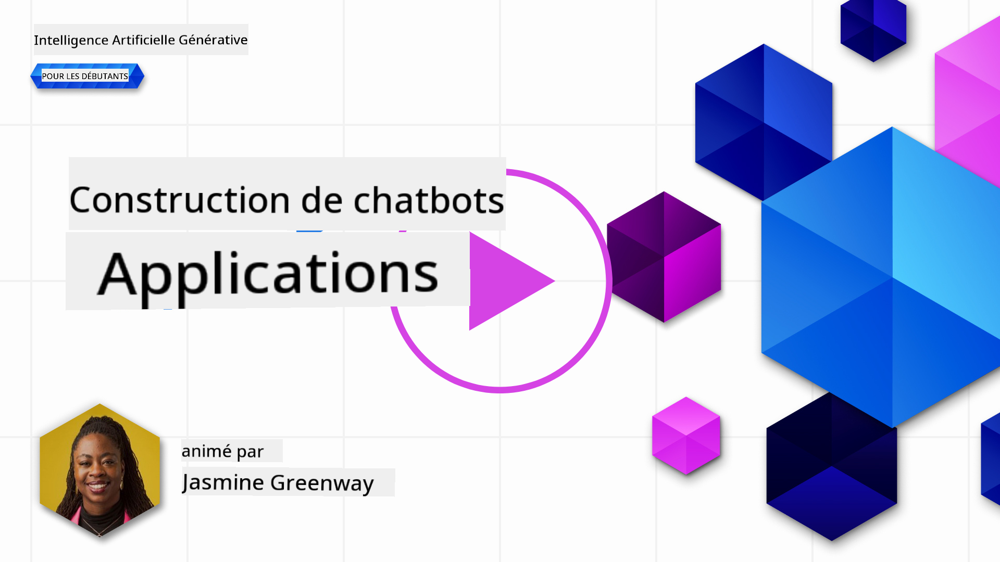
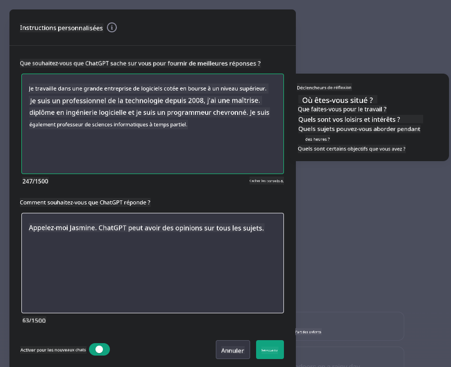

<!--
CO_OP_TRANSLATOR_METADATA:
{
  "original_hash": "ea4bbe640847aafbbba14dae4625e9af",
  "translation_date": "2025-05-19T10:09:39+00:00",
  "source_file": "07-building-chat-applications/README.md",
  "language_code": "fr"
}
-->
# Création d'applications de chat alimentées par l'IA générative

[](https://aka.ms/gen-ai-lessons7-gh?WT.mc_id=academic-105485-koreyst)

> _(Cliquez sur l'image ci-dessus pour voir la vidéo de cette leçon)_

Maintenant que nous avons vu comment créer des applications de génération de texte, penchons-nous sur les applications de chat.

Les applications de chat sont devenues intégrées dans notre vie quotidienne, offrant bien plus qu'un simple moyen de conversation informelle. Elles sont des éléments essentiels du service client, du support technique, et même des systèmes de conseil sophistiqués. Il est probable que vous ayez reçu de l'aide d'une application de chat il n'y a pas si longtemps. Alors que nous intégrons des technologies plus avancées comme l'IA générative dans ces plateformes, la complexité augmente et les défis aussi.

Quelques questions auxquelles nous devons répondre sont :

- **Créer l'application**. Comment construire efficacement et intégrer harmonieusement ces applications alimentées par l'IA pour des cas d'utilisation spécifiques ?
- **Surveillance**. Une fois déployées, comment pouvons-nous surveiller et garantir que les applications fonctionnent au plus haut niveau de qualité, tant en termes de fonctionnalité qu'en respectant les [six principes de l'IA responsable](https://www.microsoft.com/ai/responsible-ai?WT.mc_id=academic-105485-koreyst) ?

Alors que nous avançons dans une ère définie par l'automatisation et les interactions fluides homme-machine, comprendre comment l'IA générative transforme la portée, la profondeur et l'adaptabilité des applications de chat devient essentiel. Cette leçon va explorer les aspects de l'architecture qui soutiennent ces systèmes complexes, examiner les méthodologies pour les ajuster pour des tâches spécifiques à un domaine, et évaluer les métriques et considérations pertinentes pour garantir un déploiement responsable de l'IA.

## Introduction

Cette leçon couvre :

- Techniques pour construire et intégrer efficacement des applications de chat.
- Comment appliquer la personnalisation et le réglage fin aux applications.
- Stratégies et considérations pour surveiller efficacement les applications de chat.

## Objectifs d'apprentissage

À la fin de cette leçon, vous serez capable de :

- Décrire les considérations pour construire et intégrer des applications de chat dans des systèmes existants.
- Personnaliser les applications de chat pour des cas d'utilisation spécifiques.
- Identifier les métriques clés et les considérations pour surveiller et maintenir efficacement la qualité des applications de chat alimentées par l'IA.
- Garantir que les applications de chat utilisent l'IA de manière responsable.

## Intégrer l'IA générative dans les applications de chat

Élever les applications de chat grâce à l'IA générative ne consiste pas seulement à les rendre plus intelligentes ; il s'agit d'optimiser leur architecture, leur performance et leur interface utilisateur pour offrir une expérience utilisateur de qualité. Cela implique d'examiner les fondations architecturales, les intégrations API, et les considérations d'interface utilisateur. Cette section vise à vous offrir une feuille de route complète pour naviguer dans ces paysages complexes, que vous les connectiez à des systèmes existants ou que vous les construisiez en tant que plateformes autonomes.

À la fin de cette section, vous serez équipé de l'expertise nécessaire pour construire et incorporer efficacement des applications de chat.

### Chatbot ou application de chat ?

Avant de plonger dans la construction d'applications de chat, comparons les "chatbots" aux "applications de chat alimentées par l'IA," qui servent des rôles et des fonctionnalités distincts. Le principal objectif d'un chatbot est d'automatiser des tâches conversationnelles spécifiques, comme répondre à des questions fréquemment posées ou suivre un colis. Il est généralement gouverné par une logique basée sur des règles ou des algorithmes d'IA complexes. En revanche, une application de chat alimentée par l'IA est un environnement bien plus vaste conçu pour faciliter diverses formes de communication numérique, telles que les chats texte, voix et vidéo entre utilisateurs humains. Sa caractéristique distinctive est l'intégration d'un modèle d'IA générative qui simule des conversations nuancées, semblables à celles des humains, générant des réponses basées sur une grande variété d'entrées et de signaux contextuels. Une application de chat alimentée par l'IA générative peut s'engager dans des discussions en domaine ouvert, s'adapter à des contextes conversationnels évolutifs, et même produire des dialogues créatifs ou complexes.

Le tableau ci-dessous décrit les principales différences et similitudes pour nous aider à comprendre leurs rôles uniques dans la communication numérique.

| Chatbot                               | Application de chat alimentée par l'IA générative |
| ------------------------------------- | ------------------------------------------------- |
| Axé sur les tâches et basé sur des règles | Sensible au contexte                              |
| Souvent intégré dans des systèmes plus vastes | Peut héberger un ou plusieurs chatbots            |
| Limité à des fonctions programmées    | Intègre des modèles d'IA générative               |
| Interactions spécialisées et structurées | Capable de discussions en domaine ouvert          |

### Tirer parti des fonctionnalités pré-construites avec les SDK et les API

Lors de la création d'une application de chat, une excellente première étape consiste à évaluer ce qui existe déjà. Utiliser des SDK et des API pour construire des applications de chat est une stratégie avantageuse pour plusieurs raisons. En intégrant des SDK et des API bien documentés, vous positionnez stratégiquement votre application pour un succès à long terme, en abordant les préoccupations de scalabilité et de maintenance.

- **Accélère le processus de développement et réduit les frais généraux** : S'appuyer sur des fonctionnalités pré-construites au lieu du processus coûteux de les construire vous-même vous permet de vous concentrer sur d'autres aspects de votre application que vous pourriez trouver plus importants, tels que la logique métier.
- **Meilleure performance** : Lorsque vous construisez des fonctionnalités à partir de zéro, vous vous demanderez finalement "Comment cela se scale-t-il ? Cette application est-elle capable de gérer un afflux soudain d'utilisateurs ?" Les SDK et API bien maintenus ont souvent des solutions intégrées pour ces préoccupations.
- **Maintenance plus facile** : Les mises à jour et les améliorations sont plus faciles à gérer car la plupart des API et SDK nécessitent simplement une mise à jour d'une bibliothèque lorsque une nouvelle version est publiée.
- **Accès à la technologie de pointe** : Tirer parti des modèles qui ont été ajustés et entraînés sur des ensembles de données étendus fournit à votre application des capacités de langage naturel.

Accéder à la fonctionnalité d'un SDK ou d'une API implique généralement d'obtenir l'autorisation d'utiliser les services fournis, souvent par l'utilisation d'une clé unique ou d'un jeton d'authentification. Nous utiliserons la bibliothèque Python OpenAI pour explorer à quoi cela ressemble. Vous pouvez également l'essayer par vous-même dans le [notebook pour OpenAI](../../../07-building-chat-applications/python/oai-assignment.ipynb) ou le [notebook pour Azure OpenAI Services](../../../07-building-chat-applications/python/aoai-assignment.ipynb) pour cette leçon.

```python
import os
from openai import OpenAI

API_KEY = os.getenv("OPENAI_API_KEY","")

client = OpenAI(
    api_key=API_KEY
    )

chat_completion = client.chat.completions.create(model="gpt-3.5-turbo", messages=[{"role": "user", "content": "Suggest two titles for an instructional lesson on chat applications for generative AI."}])
```

L'exemple ci-dessus utilise le modèle GPT-3.5 Turbo pour compléter l'invite, mais notez que la clé API est définie avant de le faire. Vous recevriez une erreur si vous ne définissiez pas la clé.

## Expérience utilisateur (UX)

Les principes généraux de l'UX s'appliquent aux applications de chat, mais voici quelques considérations supplémentaires qui deviennent particulièrement importantes en raison des composants d'apprentissage automatique impliqués.

- **Mécanisme pour traiter l'ambiguïté** : Les modèles d'IA générative génèrent parfois des réponses ambiguës. Une fonctionnalité permettant aux utilisateurs de demander des clarifications peut être utile s'ils rencontrent ce problème.
- **Rétention du contexte** : Les modèles d'IA générative avancés ont la capacité de se souvenir du contexte dans une conversation, ce qui peut être un atout nécessaire à l'expérience utilisateur. Donner aux utilisateurs la possibilité de contrôler et de gérer le contexte améliore l'expérience utilisateur, mais introduit le risque de conserver des informations sensibles de l'utilisateur. Les considérations sur la durée de stockage de ces informations, telles que l'introduction d'une politique de rétention, peuvent équilibrer le besoin de contexte contre la confidentialité.
- **Personnalisation** : Avec la capacité d'apprendre et de s'adapter, les modèles d'IA offrent une expérience individualisée pour un utilisateur. Adapter l'expérience utilisateur à travers des fonctionnalités comme des profils utilisateurs non seulement permet à l'utilisateur de se sentir compris, mais cela aide aussi dans sa quête de réponses spécifiques, créant une interaction plus efficace et satisfaisante.

Un exemple de personnalisation est les paramètres "Instructions personnalisées" dans ChatGPT d'OpenAI. Cela vous permet de fournir des informations sur vous-même qui peuvent être un contexte important pour vos invites. Voici un exemple d'instruction personnalisée.



Ce "profil" invite ChatGPT à créer un plan de leçon sur les listes chaînées. Notez que ChatGPT prend en compte que l'utilisateur peut vouloir un plan de leçon plus approfondi basé sur son expérience.


### Cadre de messages système de Microsoft pour les modèles de langage large

[Microsoft a fourni des conseils](https://learn.microsoft.com/azure/ai-services/openai/concepts/system-message#define-the-models-output-format?WT.mc_id=academic-105485-koreyst) pour rédiger des messages système efficaces lors de la génération de réponses à partir de LLM, décomposés en 4 domaines :

1. Définir pour qui est le modèle, ainsi que ses capacités et ses limitations.
2. Définir le format de sortie du modèle.
3. Fournir des exemples spécifiques qui démontrent le comportement souhaité du modèle.
4. Fournir des garde-fous comportementaux supplémentaires.

### Accessibilité

Qu'un utilisateur ait des déficiences visuelles, auditives, motrices ou cognitives, une application de chat bien conçue doit être utilisable par tous. La liste suivante décompose des fonctionnalités spécifiques visant à améliorer l'accessibilité pour divers handicaps utilisateurs.

- **Fonctionnalités pour les déficiences visuelles** : Thèmes à contraste élevé et texte redimensionnable, compatibilité avec les lecteurs d'écran.
- **Fonctionnalités pour les déficiences auditives** : Fonctions de texte à parole et parole à texte, indices visuels pour les notifications audio.
- **Fonctionnalités pour les déficiences motrices** : Support de navigation au clavier, commandes vocales.
- **Fonctionnalités pour les déficiences cognitives** : Options de langage simplifié.

## Personnalisation et ajustement pour les modèles de langage spécifiques au domaine

Imaginez une application de chat qui comprend le jargon de votre entreprise et anticipe les requêtes spécifiques que ses utilisateurs posent fréquemment. Il existe quelques approches qui valent la peine d'être mentionnées :

- **Tirer parti des modèles DSL**. DSL signifie langage spécifique au domaine. Vous pouvez tirer parti d'un modèle DSL soi-disant entraîné sur un domaine spécifique pour comprendre ses concepts et scénarios.
- **Appliquer le réglage fin**. Le réglage fin est le processus d'entraînement supplémentaire de votre modèle avec des données spécifiques.

## Personnalisation : Utiliser un DSL

Tirer parti des modèles de langage spécifiques au domaine (modèles DSL) peut améliorer l'engagement des utilisateurs en fournissant des interactions spécialisées et contextuellement pertinentes. C'est un modèle qui est entraîné ou ajusté pour comprendre et générer du texte lié à un domaine, une industrie ou un sujet spécifique. Les options pour utiliser un modèle DSL peuvent varier de l'entraînement d'un modèle à partir de zéro à l'utilisation de modèles préexistants via des SDK et des API. Une autre option est le réglage fin, qui consiste à prendre un modèle pré-entraîné existant et à l'adapter à un domaine spécifique.

## Personnalisation : Appliquer le réglage fin

Le réglage fin est souvent envisagé lorsque un modèle pré-entraîné échoue dans un domaine spécialisé ou une tâche spécifique.

Par exemple, les requêtes médicales sont complexes et nécessitent beaucoup de contexte. Lorsqu'un professionnel médical diagnostique un patient, cela repose sur une variété de facteurs tels que le mode de vie ou les conditions préexistantes, et peut même s'appuyer sur des journaux médicaux récents pour valider leur diagnostic. Dans de tels scénarios nuancés, une application de chat IA généraliste ne peut pas être une source fiable.

### Scénario : une application médicale

Considérez une application de chat conçue pour aider les praticiens médicaux en fournissant des références rapides aux directives de traitement, aux interactions médicamenteuses ou aux découvertes de recherche récentes.

Un modèle à usage général pourrait être adéquat pour répondre à des questions médicales de base ou fournir des conseils généraux, mais il pourrait avoir du mal avec les éléments suivants :

- **Cas hautement spécifiques ou complexes**. Par exemple, un neurologue pourrait demander à l'application, "Quelles sont les meilleures pratiques actuelles pour gérer l'épilepsie résistante aux médicaments chez les patients pédiatriques ?"
- **Manque d'avancées récentes**. Un modèle à usage général pourrait avoir du mal à fournir une réponse actuelle qui incorpore les avancées les plus récentes en neurologie et pharmacologie.

Dans de tels cas, ajuster le modèle avec un ensemble de données médicales spécialisées peut améliorer considérablement sa capacité à gérer ces requêtes médicales complexes plus précisément et de manière fiable. Cela nécessite un accès à un ensemble de données large et pertinent qui représente les défis et questions spécifiques au domaine qui doivent être abordés.

## Considérations pour une expérience de chat de haute qualité pilotée par l'IA

Cette section décrit les critères pour des applications de chat de "haute qualité", qui incluent la capture de métriques exploitables et l'adhésion à un cadre qui utilise de manière responsable la technologie IA.

### Métriques clés

Pour maintenir la performance de haute qualité d'une application, il est essentiel de suivre des métriques clés et des considérations. Ces mesures garantissent non seulement la fonctionnalité de l'application, mais évaluent également la qualité du modèle d'IA et de l'expérience utilisateur. Voici une liste qui couvre les métriques de base, d'IA et d'expérience utilisateur à prendre en compte.

| Métrique                      | Définition                                                                                                             | Considérations pour le développeur de chat                                 |
| ----------------------------- | ---------------------------------------------------------------------------------------------------------------------- | ------------------------------------------------------------------------- |
| **Temps de disponibilité**    | Mesure le temps pendant lequel l'application est opérationnelle et accessible par les utilisateurs.                    | Comment minimiserez-vous les temps d'arrêt ?                              |
| **Temps de réponse**          | Le temps pris par l'application pour répondre à la requête d'un utilisateur.                                           | Comment pouvez-vous optimiser le traitement des requêtes pour améliorer le temps de réponse ? |
| **Précision**                 | Le ratio des prédictions positives vraies par rapport au nombre total de prédictions positives                         | Comment validerez-vous la précision de votre modèle ?                     |
| **Rappel (Sensibilité)**      | Le ratio des prédictions positives vraies par rapport au nombre réel de positifs                                      | Comment mesurerez-vous et améliorerez-vous le rappel ?                    |
| **Score F1**                  | La moyenne harmonique de la précision et du rappel, qui équilibre le compromis entre les deux.                         | Quel est votre score F1 cible ? Comment équilibrerez-vous la précision et le rappel ? |
| **Perplexité**                | Mesure dans quelle mesure la distribution de probabilité prédite par le modèle s'aligne avec la distribution réelle des données. | Comment minimiserez-vous la perplexité ?                                  |
| **Métriques de satisfaction utilisateur** | Mesure la perception de l'utilisateur de l'application. Souvent capturé par des enquêtes.                     | À quelle fréquence collecterez-vous les commentaires des utilisateurs ? Comment vous adapterez-vous en fonction de ceux-ci ? |
| **Taux d'erreur**             | Le taux auquel le modèle fait des erreurs de compréhension ou de sortie.                                               | Quelles stratégies avez-vous en place pour réduire les taux d'erreur ?    |
| **Cycles de réentraînement**  | La fréquence à laquelle le modèle est mis à jour pour incorporer de nouvelles données et idées.                        | À quelle fréquence réentraînerez-vous le modèle ? Qu'est-ce qui déclenche un cycle de réentraînement ? |
| **Détection d'anomalies**     | Outils et techniques pour identifier des modèles inhabituels qui ne se conforment pas au comportement attendu.         | Comment réagirez-vous aux anomalies ?                                     |

### Mettre en œuvre des pratiques d'IA responsable dans les applications de chat

L'approche de Microsoft pour l'IA responsable a identifié six principes qui devraient guider le développement et l'utilisation de l'IA. Voici les principes, leur définition, et les éléments que le développeur de chat devrait considérer et pourquoi ils devraient les prendre au sérieux.

| Principes               | Définition de Microsoft                               | Considérations pour le développeur de chat                                | Pourquoi c'est important                                                                  |
| ----------------------- | ----------------------------------------------------- | ------------------------------------------------------------------------ | ---------------------------------------------------------------------------------------- |
| Équité                  | Les systèmes d'IA devraient traiter toutes les personnes équitablement. | Assurez-vous que l'application de chat ne discrimine pas sur la base des données utilisateur. | Pour établir la confiance et l'inclusivité parmi les utilisateurs ; évite les ramifications légales. |
| Fiabilité et sécurité   | Les systèmes d'IA devraient fonctionner de manière fiable et sécurisée. | Mettre en œuvre des tests et des sécurités pour minimiser les erreurs et les risques. | Assure la satisfaction des utilisateurs et prévient les dommages potentiels.              |
| Confidentialité et sécurité | Les systèmes d'IA devraient être sécurisés et respecter la confidentialité. | Mettre en œuvre des mesures de protection des données et de cryptage robustes. | Pour protéger les données sensibles des utilisateurs et se conformer aux lois sur la confidentialité. |
| Inclusivité             | Les systèmes d'IA devraient habiliter tout le monde et engager les gens. | Concevoir une interface utilisateur qui est accessible et facile à utiliser pour divers publics. | Assure qu'un large éventail de personnes peut utiliser l'application efficacement.       |
| Transparence            | Les systèmes d'IA devraient être compréhensibles.     | Fournir une documentation claire et une justification pour les réponses de l'IA. | Les utilisateurs sont plus susceptibles de faire confiance à un système s'ils peuvent comprendre comment les décisions sont prises. |
| Responsabilité

**Avertissement** :  
Ce document a été traduit à l'aide du service de traduction automatique [Co-op Translator](https://github.com/Azure/co-op-translator). Bien que nous nous efforcions d'assurer l'exactitude, veuillez noter que les traductions automatiques peuvent contenir des erreurs ou des inexactitudes. Le document original dans sa langue d'origine doit être considéré comme la source faisant autorité. Pour des informations critiques, une traduction humaine professionnelle est recommandée. Nous ne sommes pas responsables des malentendus ou des mauvaises interprétations résultant de l'utilisation de cette traduction.