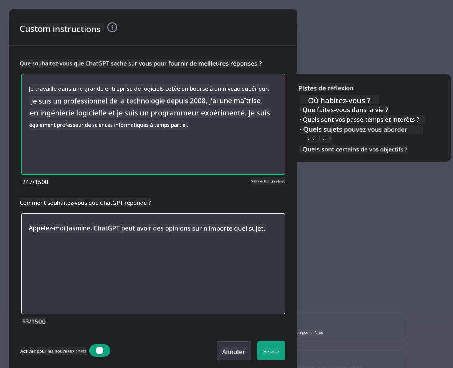

<!--
CO_OP_TRANSLATOR_METADATA:
{
  "original_hash": "ea4bbe640847aafbbba14dae4625e9af",
  "translation_date": "2025-07-09T12:13:59+00:00",
  "source_file": "07-building-chat-applications/README.md",
  "language_code": "fr"
}
-->
# Création d’applications de chat alimentées par l’IA générative

[](https://aka.ms/gen-ai-lessons7-gh?WT.mc_id=academic-105485-koreyst)

> _(Cliquez sur l’image ci-dessus pour visionner la vidéo de cette leçon)_

Maintenant que nous avons vu comment créer des applications de génération de texte, intéressons-nous aux applications de chat.

Les applications de chat sont devenues partie intégrante de notre quotidien, offrant bien plus qu’un simple moyen de conversation informelle. Elles jouent un rôle clé dans le service client, le support technique, voire dans des systèmes de conseil sophistiqués. Il est probable que vous ayez récemment bénéficié de l’aide d’une application de chat. À mesure que nous intégrons des technologies avancées comme l’IA générative dans ces plateformes, la complexité augmente, tout comme les défis.

Voici quelques questions auxquelles il faut répondre :

- **Création de l’application**. Comment construire efficacement ces applications alimentées par l’IA et les intégrer de manière fluide pour des cas d’usage spécifiques ?
- **Surveillance**. Une fois déployées, comment surveiller et garantir que ces applications fonctionnent avec la meilleure qualité possible, tant en termes de fonctionnalités que de respect des [six principes de l’IA responsable](https://www.microsoft.com/ai/responsible-ai?WT.mc_id=academic-105485-koreyst) ?

À l’ère de l’automatisation et des interactions homme-machine fluides, comprendre comment l’IA générative transforme la portée, la profondeur et l’adaptabilité des applications de chat devient essentiel. Cette leçon explorera les aspects architecturaux qui soutiennent ces systèmes complexes, les méthodes de fine-tuning pour des tâches spécifiques à un domaine, ainsi que les métriques et considérations pour assurer un déploiement responsable de l’IA.

## Introduction

Cette leçon couvre :

- Les techniques pour construire et intégrer efficacement des applications de chat.
- Comment personnaliser et affiner ces applications.
- Les stratégies et considérations pour surveiller efficacement les applications de chat.

## Objectifs d’apprentissage

À la fin de cette leçon, vous serez capable de :

- Décrire les points à considérer pour construire et intégrer des applications de chat dans des systèmes existants.
- Personnaliser des applications de chat pour des cas d’usage spécifiques.
- Identifier les métriques clés et les considérations pour surveiller et maintenir la qualité des applications de chat alimentées par l’IA.
- Veiller à ce que les applications de chat utilisent l’IA de manière responsable.

## Intégrer l’IA générative dans les applications de chat

Améliorer les applications de chat grâce à l’IA générative ne consiste pas seulement à les rendre plus intelligentes ; il s’agit d’optimiser leur architecture, leurs performances et leur interface utilisateur pour offrir une expérience de qualité. Cela implique d’examiner les fondations architecturales, les intégrations API et les aspects liés à l’interface utilisateur. Cette section a pour but de vous fournir une feuille de route complète pour naviguer dans ces environnements complexes, que vous les connectiez à des systèmes existants ou que vous les développiez en tant que plateformes autonomes.

À la fin de cette section, vous aurez les compétences nécessaires pour construire et intégrer efficacement des applications de chat.

### Chatbot ou application de chat ?

Avant de plonger dans la création d’applications de chat, comparons les « chatbots » aux « applications de chat alimentées par l’IA », qui ont des rôles et fonctionnalités distincts. Un chatbot a pour but principal d’automatiser des tâches conversationnelles spécifiques, comme répondre aux questions fréquentes ou suivre un colis. Il est généralement régi par une logique basée sur des règles ou des algorithmes d’IA complexes. En revanche, une application de chat alimentée par l’IA est un environnement beaucoup plus vaste, conçu pour faciliter diverses formes de communication numérique, telles que les échanges textuels, vocaux ou vidéo entre utilisateurs humains. Sa caractéristique principale est l’intégration d’un modèle d’IA générative qui simule des conversations nuancées et humaines, générant des réponses basées sur une grande variété d’entrées et d’indices contextuels. Une application de chat alimentée par l’IA générative peut engager des discussions en domaine ouvert, s’adapter à l’évolution du contexte conversationnel, et même produire des dialogues créatifs ou complexes.

Le tableau ci-dessous présente les principales différences et similitudes pour mieux comprendre leurs rôles uniques dans la communication digitale.

| Chatbot                               | Application de chat alimentée par l’IA générative |
| ------------------------------------- | -------------------------------------- |
| Orienté tâches et basé sur des règles | Sensible au contexte                    |
| Souvent intégré dans des systèmes plus larges | Peut héberger un ou plusieurs chatbots |
| Limité aux fonctions programmées      | Intègre des modèles d’IA générative    |
| Interactions spécialisées et structurées | Capable de discussions en domaine ouvert |

### Tirer parti des fonctionnalités préconstruites avec les SDK et API

Lors de la création d’une application de chat, une bonne première étape est d’évaluer ce qui existe déjà. Utiliser des SDK et API pour construire des applications de chat est une stratégie avantageuse pour plusieurs raisons. En intégrant des SDK et API bien documentés, vous positionnez stratégiquement votre application pour un succès à long terme, en répondant aux enjeux de scalabilité et de maintenance.

- **Accélère le développement et réduit la charge** : S’appuyer sur des fonctionnalités préconstruites plutôt que de les développer soi-même permet de se concentrer sur d’autres aspects de l’application, comme la logique métier.
- **Meilleure performance** : En développant une fonctionnalité de zéro, on finit par se demander « Comment cela évolue-t-il ? L’application peut-elle gérer un afflux soudain d’utilisateurs ? » Les SDK et API bien maintenus intègrent souvent des solutions à ces problématiques.
- **Maintenance facilitée** : Les mises à jour et améliorations sont plus simples à gérer, car la plupart des API et SDK nécessitent simplement une mise à jour de la bibliothèque lors de la sortie d’une nouvelle version.
- **Accès à la technologie de pointe** : Utiliser des modèles affinés et entraînés sur de vastes ensembles de données offre à votre application des capacités avancées en traitement du langage naturel.

L’accès aux fonctionnalités d’un SDK ou d’une API implique généralement d’obtenir une autorisation via une clé unique ou un jeton d’authentification. Nous utiliserons la bibliothèque Python OpenAI pour illustrer cela. Vous pouvez également l’essayer vous-même dans le [notebook OpenAI](../../../07-building-chat-applications/python/oai-assignment.ipynb) ou le [notebook Azure OpenAI Services](../../../07-building-chat-applications/python/aoai-assignment.ipynb) de cette leçon.

```python
import os
from openai import OpenAI

API_KEY = os.getenv("OPENAI_API_KEY","")

client = OpenAI(
    api_key=API_KEY
    )

chat_completion = client.chat.completions.create(model="gpt-3.5-turbo", messages=[{"role": "user", "content": "Suggest two titles for an instructional lesson on chat applications for generative AI."}])
```

L’exemple ci-dessus utilise le modèle GPT-3.5 Turbo pour compléter l’invite, mais remarquez que la clé API est définie avant cela. Vous obtiendriez une erreur si vous ne la configuriez pas.

## Expérience utilisateur (UX)

Les principes généraux d’UX s’appliquent aux applications de chat, mais voici quelques considérations supplémentaires qui deviennent particulièrement importantes en raison des composants d’apprentissage automatique impliqués.

- **Mécanisme pour gérer l’ambiguïté** : Les modèles d’IA générative peuvent parfois produire des réponses ambiguës. Une fonctionnalité permettant aux utilisateurs de demander des clarifications peut être utile en cas de problème.
- **Rétention du contexte** : Les modèles avancés d’IA générative ont la capacité de se souvenir du contexte au sein d’une conversation, ce qui peut être un atout essentiel pour l’expérience utilisateur. Donner aux utilisateurs la possibilité de contrôler et gérer ce contexte améliore l’expérience, mais introduit le risque de conserver des informations sensibles. Des politiques de conservation, comme une durée limitée de stockage, peuvent équilibrer le besoin de contexte et la confidentialité.
- **Personnalisation** : Grâce à leur capacité d’apprentissage et d’adaptation, les modèles d’IA offrent une expérience individualisée. Adapter l’expérience utilisateur via des fonctionnalités comme les profils utilisateurs permet non seulement à l’utilisateur de se sentir compris, mais facilite aussi la recherche de réponses spécifiques, rendant l’interaction plus efficace et satisfaisante.

Un exemple de personnalisation est le paramètre « Custom instructions » dans ChatGPT d’OpenAI. Il vous permet de fournir des informations sur vous-même qui peuvent constituer un contexte important pour vos requêtes. Voici un exemple d’instruction personnalisée.



Ce « profil » invite ChatGPT à créer un plan de cours sur les listes chaînées. Notez que ChatGPT prend en compte que l’utilisateur souhaite un plan plus approfondi en fonction de son expérience.


### Le cadre des messages système de Microsoft pour les grands modèles de langage

[Microsoft a fourni des recommandations](https://learn.microsoft.com/azure/ai-services/openai/concepts/system-message#define-the-models-output-format?WT.mc_id=academic-105485-koreyst) pour rédiger des messages système efficaces lors de la génération de réponses par les LLM, décomposées en 4 axes :

1. Définir à qui s’adresse le modèle, ainsi que ses capacités et limites.
2. Définir le format de sortie du modèle.
3. Fournir des exemples spécifiques illustrant le comportement attendu du modèle.
4. Ajouter des garde-fous comportementaux supplémentaires.

### Accessibilité

Qu’un utilisateur ait des déficiences visuelles, auditives, motrices ou cognitives, une application de chat bien conçue doit être utilisable par tous. La liste suivante détaille des fonctionnalités spécifiques visant à améliorer l’accessibilité selon différents types de handicaps.

- **Fonctionnalités pour déficience visuelle** : Thèmes à contraste élevé, texte redimensionnable, compatibilité avec les lecteurs d’écran.
- **Fonctionnalités pour déficience auditive** : Fonctions de synthèse vocale et reconnaissance vocale, signaux visuels pour les notifications audio.
- **Fonctionnalités pour déficience motrice** : Support de la navigation au clavier, commandes vocales.
- **Fonctionnalités pour déficience cognitive** : Options de langage simplifié.

## Personnalisation et fine-tuning pour les modèles de langage spécifiques à un domaine

Imaginez une application de chat qui comprend le jargon de votre entreprise et anticipe les questions spécifiques que ses utilisateurs posent fréquemment. Deux approches méritent d’être mentionnées :

- **Exploiter des modèles DSL**. DSL signifie domain specific language (langage spécifique à un domaine). Vous pouvez utiliser un modèle DSL entraîné sur un domaine particulier pour comprendre ses concepts et scénarios.
- **Appliquer le fine-tuning**. Le fine-tuning est le processus d’entraînement supplémentaire de votre modèle avec des données spécifiques.

## Personnalisation : utiliser un DSL

Exploiter des modèles de langage spécifiques à un domaine (DSL) peut améliorer l’engagement utilisateur en fournissant des interactions spécialisées et contextuellement pertinentes. Il s’agit d’un modèle entraîné ou affiné pour comprendre et générer du texte lié à un domaine, une industrie ou un sujet particulier. Les options pour utiliser un modèle DSL vont de l’entraînement complet à partir de zéro à l’utilisation de modèles préexistants via SDK et API. Une autre option est le fine-tuning, qui consiste à prendre un modèle pré-entraîné existant et à l’adapter à un domaine spécifique.

## Personnalisation : appliquer le fine-tuning

Le fine-tuning est souvent envisagé lorsqu’un modèle pré-entraîné ne suffit pas dans un domaine spécialisé ou pour une tâche précise.

Par exemple, les questions médicales sont complexes et nécessitent beaucoup de contexte. Lorsqu’un professionnel de santé pose un diagnostic, il se base sur divers facteurs comme le mode de vie ou des conditions préexistantes, et peut même s’appuyer sur des revues médicales récentes pour valider son diagnostic. Dans de tels scénarios nuancés, une application de chat IA généraliste ne peut pas être une source fiable.

### Scénario : une application médicale

Considérons une application de chat conçue pour aider les praticiens médicaux en fournissant des références rapides sur les protocoles de traitement, les interactions médicamenteuses ou les dernières recherches.

Un modèle généraliste peut suffire pour répondre à des questions médicales basiques ou donner des conseils généraux, mais il pourrait avoir des difficultés avec :

- **Des cas très spécifiques ou complexes**. Par exemple, un neurologue pourrait demander à l’application : « Quelles sont les meilleures pratiques actuelles pour gérer l’épilepsie pharmacorésistante chez les patients pédiatriques ? »
- **L’absence des avancées récentes**. Un modèle généraliste pourrait peiner à fournir une réponse à jour intégrant les dernières avancées en neurologie et pharmacologie.

Dans ces cas, affiner le modèle avec un jeu de données médical spécialisé peut grandement améliorer sa capacité à traiter ces questions complexes de manière plus précise et fiable. Cela nécessite l’accès à un ensemble de données large et pertinent, représentant les défis et questions spécifiques au domaine.

## Considérations pour une expérience de chat IA de haute qualité

Cette section décrit les critères d’une application de chat « haute qualité », incluant la collecte de métriques exploitables et le respect d’un cadre garantissant une utilisation responsable de l’IA.

### Métriques clés

Pour maintenir une performance de haute qualité, il est essentiel de suivre des métriques et considérations clés. Ces mesures garantissent non seulement la fonctionnalité de l’application, mais évaluent aussi la qualité du modèle IA et l’expérience utilisateur. Voici une liste couvrant les métriques de base, IA et UX à prendre en compte.

| Métrique                      | Définition                                                                                                             | Considérations pour le développeur de chat                         |
| ----------------------------- | ---------------------------------------------------------------------------------------------------------------------- | ----------------------------------------------------------------- |
| **Disponibilité (Uptime)**    | Mesure le temps pendant lequel l’application est opérationnelle et accessible par les utilisateurs.                    | Comment minimiser les interruptions ?                             |
| **Temps de réponse**           | Durée prise par l’application pour répondre à une requête utilisateur.                                                 | Comment optimiser le traitement des requêtes pour améliorer ce temps ? |
| **Précision**                 | Rapport entre les vraies prédictions positives et le nombre total de prédictions positives.                            | Comment valider la précision de votre modèle ?                    |
| **Rappel (Sensibilité)**      | Rapport entre les vraies prédictions positives et le nombre réel de cas positifs.                                      | Comment mesurer et améliorer le rappel ?                          |
| **Score F1**                  | Moyenne harmonique entre précision et rappel, équilibrant le compromis entre les deux.                                 | Quel est votre objectif de score F1 ? Comment équilibrer précision et rappel ? |
| **Perplexité**                | Mesure à quel point la distribution de probabilité prédite par le modèle correspond à la distribution réelle des données. | Comment minimiser la perplexité ?                                 |
| **Métriques de satisfaction utilisateur** | Mesure la perception de l’application par l’utilisateur, souvent recueillie via des enquêtes.                      | À quelle fréquence collecterez-vous les retours utilisateurs ? Comment vous adapterez-vous ? |
| **Taux d’erreur**             | Taux auquel le modèle fait des erreurs dans la compréhension ou la production.                                         | Quelles stratégies avez-vous pour réduire les erreurs ?          |
| **Cycles de réentraînement** | Fréquence à laquelle le modèle est mis à jour pour intégrer de nouvelles données et connaissances.                    | À quelle fréquence réentraînerez-vous le modèle ? Qu’est-ce qui déclenche un cycle de réentraînement ? |
| **Détection d’anomalies**    | Outils et techniques pour identifier des schémas inhabituels qui ne correspondent pas au comportement attendu.           | Comment allez-vous réagir face aux anomalies ?                                  |

### Mettre en œuvre des pratiques d’IA responsable dans les applications de chat

L’approche de Microsoft en matière d’IA responsable a identifié six principes qui doivent guider le développement et l’utilisation de l’IA. Voici ces principes, leur définition, ainsi que les points à considérer par un développeur de chat et pourquoi il est important de les prendre au sérieux.

| Principes              | Définition selon Microsoft                            | Considérations pour le développeur de chat                              | Pourquoi c’est important                                                               |
| ---------------------- | ----------------------------------------------------- | ---------------------------------------------------------------------- | -------------------------------------------------------------------------------------- |
| Équité                 | Les systèmes d’IA doivent traiter toutes les personnes de manière équitable. | Veiller à ce que l’application de chat ne discrimine pas en fonction des données utilisateur. | Pour instaurer la confiance et l’inclusion parmi les utilisateurs ; éviter des conséquences juridiques. |
| Fiabilité et sécurité  | Les systèmes d’IA doivent fonctionner de manière fiable et sécurisée. | Mettre en place des tests et des dispositifs de sécurité pour minimiser les erreurs et les risques. | Garantit la satisfaction des utilisateurs et prévient les dommages potentiels.         |
| Confidentialité et sécurité | Les systèmes d’IA doivent être sécurisés et respecter la vie privée. | Appliquer un chiffrement robuste et des mesures de protection des données. | Pour protéger les données sensibles des utilisateurs et respecter les lois sur la confidentialité. |
| Inclusion              | Les systèmes d’IA doivent donner du pouvoir à tous et engager les personnes. | Concevoir une interface utilisateur accessible et facile à utiliser pour des publics variés. | Permet à un plus large public d’utiliser efficacement l’application.                   |
| Transparence           | Les systèmes d’IA doivent être compréhensibles.       | Fournir une documentation claire et expliquer les raisons des réponses de l’IA. | Les utilisateurs font davantage confiance à un système dont ils comprennent le fonctionnement. |
| Responsabilité         | Les personnes doivent être responsables des systèmes d’IA. | Mettre en place un processus clair d’audit et d’amélioration des décisions de l’IA. | Permet une amélioration continue et des mesures correctives en cas d’erreurs.          |

## Exercice

Consultez [assignment](../../../07-building-chat-applications/python) qui vous guidera à travers une série d’exercices, depuis l’exécution de vos premières requêtes de chat, jusqu’à la classification et le résumé de texte, et plus encore. Notez que les exercices sont disponibles dans différents langages de programmation !

## Excellent travail ! Poursuivez votre parcours

Après avoir terminé cette leçon, découvrez notre [collection d’apprentissage sur l’IA générative](https://aka.ms/genai-collection?WT.mc_id=academic-105485-koreyst) pour continuer à approfondir vos connaissances en IA générative !

Rendez-vous à la leçon 8 pour voir comment commencer à [construire des applications de recherche](../08-building-search-applications/README.md?WT.mc_id=academic-105485-koreyst) !

**Avertissement** :  
Ce document a été traduit à l’aide du service de traduction automatique [Co-op Translator](https://github.com/Azure/co-op-translator). Bien que nous nous efforcions d’assurer l’exactitude, veuillez noter que les traductions automatiques peuvent contenir des erreurs ou des inexactitudes. Le document original dans sa langue d’origine doit être considéré comme la source faisant foi. Pour les informations critiques, une traduction professionnelle réalisée par un humain est recommandée. Nous déclinons toute responsabilité en cas de malentendus ou de mauvaises interprétations résultant de l’utilisation de cette traduction.