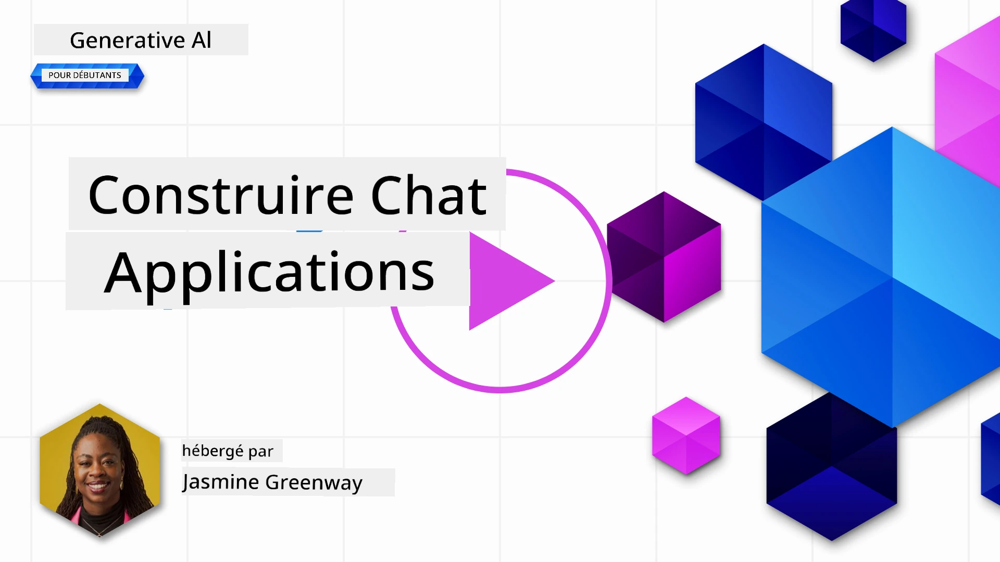
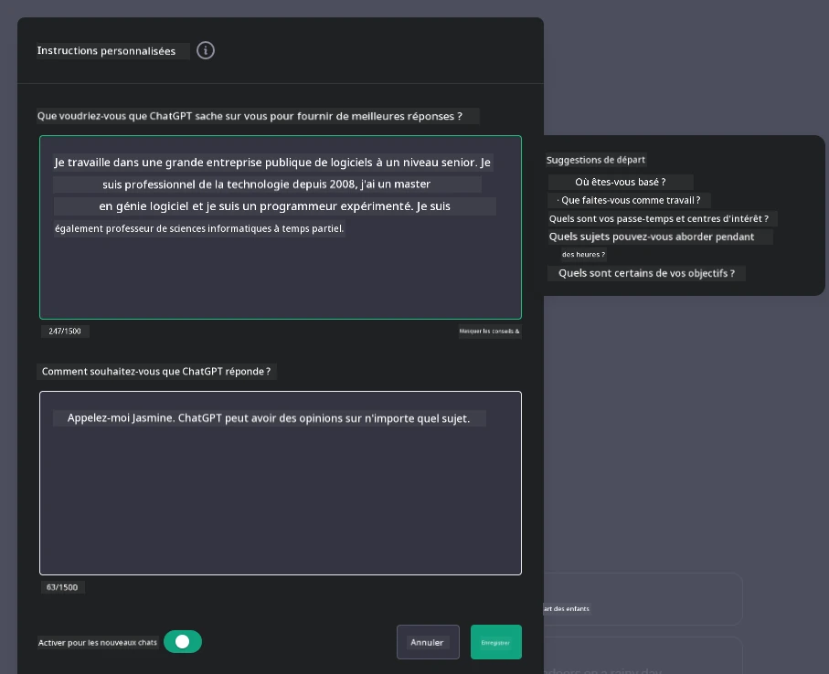

# Construire des applications de chat alimentées par l'IA générative

[](https://youtu.be/R9V0ZY1BEQo?si=IHuU-fS9YWT8s4sA)

> _(Cliquez sur l'image ci-dessus pour voir la vidéo de cette leçon)_

Maintenant que nous avons vu comment construire des applications de génération de texte, intéressons-nous aux applications de chat.

Les applications de chat sont devenues intégrées dans notre quotidien, offrant bien plus qu’un simple moyen de conversation informelle. Elles jouent un rôle essentiel dans le service client, le support technique, voire même des systèmes de conseil sophistiqués. Il est probable que vous ayez déjà reçu de l’aide via une application de chat récemment. À mesure que nous intégrons des technologies plus avancées comme l’IA générative dans ces plateformes, la complexité augmente, ainsi que les défis associés.

Certaines questions doivent recevoir une réponse :

- **Construire l'application**. Comment construire efficacement et intégrer sans faille ces applications alimentées par l'IA pour des cas d’usage spécifiques ?
- **Surveillance**. Une fois déployées, comment surveiller et garantir que les applications fonctionnent au plus haut niveau de qualité, tant en termes de fonctionnalité que de respect des [six principes de l’IA responsable](https://www.microsoft.com/ai/responsible-ai?WT.mc_id=academic-105485-koreyst) ?

À mesure que nous avançons dans une ère définie par l'automatisation et les interactions homme-machine fluides, comprendre comment l'IA générative transforme la portée, la profondeur et l'adaptabilité des applications de chat devient essentiel. Cette leçon étudiera les aspects architecturaux qui soutiennent ces systèmes complexes, explorera les méthodologies pour les ajuster à des tâches spécifiques à un domaine, et évaluera les métriques et considérations pertinentes pour assurer un déploiement responsable de l’IA.

## Introduction

Cette leçon couvre :

- Techniques pour construire et intégrer efficacement les applications de chat.
- Comment appliquer la personnalisation et le fine-tuning aux applications.
- Stratégies et considérations pour surveiller efficacement les applications de chat.

## Objectifs d’apprentissage

À la fin de cette leçon, vous serez capable de :

- Décrire les considérations pour construire et intégrer des applications de chat dans des systèmes existants.
- Personnaliser les applications de chat pour des cas d’usage spécifiques.
- Identifier les métriques clés et considérations pour surveiller et maintenir efficacement la qualité des applications de chat alimentées par l’IA.
- Assurer que les applications de chat exploitent l’IA de manière responsable.

## Intégrer l’IA générative dans les applications de chat

Élever les applications de chat grâce à l’IA générative ne consiste pas uniquement à les rendre plus intelligentes ; il s’agit d’optimiser leur architecture, leurs performances, et leur interface utilisateur pour offrir une expérience utilisateur de qualité. Cela implique d’étudier les fondations architecturales, les intégrations API, et les considérations liées à l’interface utilisateur. Cette section a pour but de vous fournir une feuille de route complète pour naviguer dans ces paysages complexes, que vous les branchiez à des systèmes existants ou que vous les construisiez comme plateformes autonomes.

À la fin de cette section, vous aurez les compétences nécessaires pour construire et intégrer efficacement des applications de chat.

### Chatbot ou application de chat ?

Avant de plonger dans la construction d’applications de chat, comparons les « chatbots » aux « applications de chat alimentées par IA », qui remplissent des rôles et fonctionnalités distincts. Le but principal d’un chatbot est d’automatiser des tâches conversationnelles spécifiques, comme répondre aux questions fréquemment posées ou suivre un colis. Il est généralement régi par une logique basée sur des règles ou des algorithmes d’IA complexes. En revanche, une application de chat alimentée par IA est un environnement beaucoup plus vaste conçu pour faciliter diverses formes de communication numérique, telles que le chat textuel, vocal, et vidéo entre utilisateurs humains. Sa caractéristique principale est l’intégration d’un modèle d’IA générative qui simule des conversations nuancées, semblables à celles d’un humain, en générant des réponses basées sur une large variété d’entrées et d’indices contextuels. Une application de chat alimentée par IA générative peut engager des discussions à domaine ouvert, s’adapter à des contextes conversationnels évolutifs, et même produire des dialogues créatifs ou complexes.

Le tableau ci-dessous présente les principales différences et similitudes pour nous aider à comprendre leurs rôles uniques dans la communication numérique.

| Chatbot                               | Application de chat alimentée par IA générative |
| ------------------------------------- | -------------------------------------- |
| Orienté tâches et basé sur des règles | Conscient du contexte                 |
| Souvent intégré dans des systèmes plus larges | Peut héberger un ou plusieurs chatbots    |
| Limité aux fonctions programmées       | Intègre des modèles d’IA générative       |
| Interactions spécialisées et structurées | Capable de discussions à domaine ouvert    |

### Exploiter des fonctionnalités préconstruites avec SDKs et APIs

Lors de la construction d’une application de chat, un excellent premier pas est d’évaluer ce qui existe déjà. Utiliser des SDKs et APIs pour créer des applications de chat est une stratégie avantageuse pour plusieurs raisons. En intégrant des SDKs et APIs bien documentés, vous positionnez stratégiquement votre application pour un succès à long terme, en prenant en compte l’évolutivité et la maintenance.

- **Accélère le processus de développement et réduit la charge** : S’appuyer sur des fonctionnalités préconstruites au lieu de les construire vous-même, coûteux en temps et ressources, vous permet de vous concentrer sur d’autres aspects plus importants de votre application, comme la logique métier.
- **Meilleures performances** : En construisant une fonctionnalité à partir de zéro, vous vous demanderez un jour « Comment cela évolue-t-il ? Cette application peut-elle gérer un afflux soudain d’utilisateurs ? » Les SDKs et APIs bien maintenus ont souvent des solutions intégrées pour ces préoccupations.
- **Maintenance facilitée** : Les mises à jour et améliorations sont plus faciles à gérer car la plupart des APIs et SDKs nécessitent simplement la mise à jour d’une bibliothèque lorsqu’une nouvelle version est publiée.
- **Accès à la technologie de pointe** : Exploiter des modèles finement ajustés et entraînés sur des ensembles de données étendus offre à votre application des capacités avancées en langage naturel.

Accéder aux fonctionnalités d’un SDK ou API implique généralement d’obtenir la permission d’utiliser les services fournis, souvent via une clé unique ou un token d’authentification. Nous utiliserons la bibliothèque OpenAI Python pour explorer ce à quoi cela ressemble. Vous pouvez aussi l’essayer vous-même dans le [notebook OpenAI](./python/oai-assignment.ipynb?WT.mc_id=academic-105485-koreyst) ou le [notebook Azure OpenAI Services](./python/aoai-assignment.ipynb?WT.mc_id=academic-105485-koreys) pour cette leçon.

```python
import os
from openai import OpenAI

API_KEY = os.getenv("OPENAI_API_KEY","")

client = OpenAI(
    api_key=API_KEY
    )

response = client.responses.create(model="gpt-5-mini", input="Suggest two titles for an instructional lesson on chat applications for generative AI.", store=False)
print(response.output_text)
```

L’exemple ci-dessus utilise le modèle GPT-5 mini avec l’API Responses pour compléter l’invite, mais notez que la clé API est définie avant cela. Vous recevrez une erreur si vous ne définissez pas la clé.

## Expérience utilisateur (UX)

Les principes généraux d’UX s’appliquent aux applications de chat, mais voici quelques considérations supplémentaires qui deviennent particulièrement importantes à cause des composantes d’apprentissage automatique impliquées.

- **Mécanisme pour traiter l’ambiguïté** : Les modèles d’IA générative génèrent parfois des réponses ambiguës. Une fonctionnalité permettant aux utilisateurs de demander des clarifications peut être utile s’ils rencontrent ce problème.
- **Rétention du contexte** : Les modèles avancés d’IA générative ont la capacité de mémoriser le contexte au sein d’une conversation, ce qui peut être un atout nécessaire pour l’expérience utilisateur. Donner aux utilisateurs la possibilité de contrôler et gérer le contexte améliore l’expérience, mais introduit le risque de conserver des informations sensibles. Des considérations sur la durée de conservation de ces informations, telles que l’introduction d’une politique de rétention, peuvent équilibrer le besoin de contexte et la confidentialité.
- **Personnalisation** : Avec la capacité d’apprendre et de s’adapter, les modèles IA offrent une expérience individualisée à l’utilisateur. Adapter l’expérience utilisateur via des fonctionnalités comme les profils utilisateurs non seulement fait sentir l’utilisateur compris, mais aide aussi dans sa recherche de réponses spécifiques, créant une interaction plus efficace et satisfaisante.

Un exemple de personnalisation est les paramètres « Instructions personnalisées » dans ChatGPT d’OpenAI. Ils permettent de fournir des informations sur vous qui peuvent constituer un contexte important pour vos invites. Voici un exemple d’instruction personnalisée.



Ce « profil » invite ChatGPT à créer un plan de cours sur les listes chaînées. Notez que ChatGPT prend en compte que l’utilisateur peut vouloir un plan de cours plus détaillé basé sur son expérience.


### Cadre de message système de Microsoft pour les grands modèles de langage

[Microsoft a fourni des directives](https://learn.microsoft.com/azure/ai-foundry/openai/concepts/system-message#define-the-models-output-format?WT.mc_id=academic-105485-koreyst) pour rédiger des messages système efficaces lors de la génération de réponses avec les LLMs, réparties en 4 axes :

1. Définir à qui s’adresse le modèle, ainsi que ses capacités et ses limitations.
2. Définir le format de sortie du modèle.
3. Fournir des exemples spécifiques qui démontrent le comportement attendu du modèle.
4. Fournir des garde-fous comportementaux supplémentaires.

### Accessibilité

Que l’utilisateur ait des déficiences visuelles, auditives, motrices ou cognitives, une application de chat bien conçue doit être utilisable par tous. La liste suivante détaille des fonctionnalités spécifiques visant à améliorer l’accessibilité selon divers handicaps.

- **Fonctionnalités pour déficience visuelle** : Thèmes à contraste élevé et texte redimensionnable, compatibilité avec les lecteurs d’écran.
- **Fonctionnalités pour déficience auditive** : Fonctionnalités de synthèse vocale et reconnaissance vocale, indicateurs visuels pour notifications audio.
- **Fonctionnalités pour déficience motrice** : Support de la navigation clavier, commandes vocales.
- **Fonctionnalités pour déficience cognitive** : Options de langage simplifié.

## Personnalisation et fine-tuning pour modèles linguistiques spécifiques à un domaine

Imaginez une application de chat qui comprend le jargon de votre entreprise et anticipe les questions spécifiques fréquemment posées par ses utilisateurs. Quelques approches méritent d’être mentionnées :

- **Exploiter des modèles DSL**. DSL signifie langage spécifique au domaine. Vous pouvez exploiter un modèle DSL entraîné sur un domaine spécifique pour comprendre ses concepts et scénarios.
- **Appliquer un fine-tuning**. Le fine-tuning est le processus d’entraîner davantage votre modèle avec des données spécifiques.

## Personnalisation : Utiliser un DSL

Exploiter des modèles linguistiques spécifiques à un domaine (modèles DSL) peut renforcer l’engagement utilisateur en fournissant des interactions spécialisées et contextuellement pertinentes. C'est un modèle entraîné ou ajusté pour comprendre et générer du texte lié à un domaine particulier, une industrie ou un sujet. Les options pour utiliser un modèle DSL peuvent aller de l’entraînement complet à partir de zéro, à l’utilisation de modèles préexistants via SDKs et APIs. Une autre option est le fine-tuning, qui consiste à prendre un modèle pré-entraîné existant et l’adapter à un domaine spécifique.

## Personnalisation : Appliquer le fine-tuning

Le fine-tuning est souvent envisagé lorsqu’un modèle pré-entraîné ne répond pas suffisamment pour un domaine spécialisé ou une tâche spécifique.

Par exemple, les questions médicales sont complexes et nécessitent beaucoup de contexte. Lorsqu’un professionnel médical diagnostique un patient, cela repose sur une variété de facteurs tels que le mode de vie ou des conditions préexistantes, et peut même s’appuyer sur des revues médicales récentes pour valider le diagnostic. Dans ces scénarios nuancés, une application de chat IA à usage général ne peut être une source fiable.

### Scénario : une application médicale

Envisagez une application de chat conçue pour aider les praticiens médicaux en fournissant rapidement des références aux lignes directrices de traitement, interactions médicamenteuses, ou résultats de recherches récentes.

Un modèle général pourrait suffire pour répondre à des questions médicales de base ou fournir des conseils généraux, mais il pourrait avoir du mal dans les cas suivants :

- **Cas très spécifiques ou complexes**. Par exemple, un neurologue pourrait demander à l’application : « Quelles sont les meilleures pratiques actuelles pour gérer l’épilepsie résistante aux médicaments chez les patients pédiatriques ? »
- **Absence des avancées récentes**. Un modèle général pourrait avoir du mal à fournir une réponse à jour intégrant les dernières avancées en neurologie et pharmacologie.

Dans de tels cas, le fine-tuning du modèle avec un ensemble de données médical spécifique peut considérablement améliorer sa capacité à gérer ces questions médicales complexes de manière plus précise et fiable. Cela nécessite l’accès à un ensemble de données large et pertinent qui représente les défis et questions spécifiques du domaine à traiter.

## Considérations pour une expérience de chat IA de haute qualité

Cette section décrit les critères pour des applications de chat « haute qualité », incluant la capture de métriques exploitables et l’adhésion à un cadre utilisant l’IA de manière responsable.

### Principales métriques

Pour maintenir la performance de haute qualité d’une application, il est essentiel de suivre des métriques clés et des considérations. Ces mesures assurent non seulement la fonctionnalité de l’application mais aussi évaluent la qualité du modèle IA et l’expérience utilisateur. Voici une liste couvrant les métriques de base, d’IA, et d’expérience utilisateur à considérer.

| Métrique                      | Définition                                                                                                            | Considérations pour le développeur de chat                           |
| -----------------------------| --------------------------------------------------------------------------------------------------------------------- | ------------------------------------------------------------------- |
| **Disponibilité (Uptime)**   | Mesure la durée pendant laquelle l’application est opérationnelle et accessible aux utilisateurs.                     | Comment minimiserez-vous les interruptions ?                        |
| **Temps de réponse**          | Le temps pris par l’application pour répondre à une requête utilisateur.                                              | Comment optimiser le traitement des requêtes pour améliorer ce temps ? |
| **Précision**                | Le ratio des prédictions vraies positives par rapport au nombre total de prédictions positives.                        | Comment validerez-vous la précision de votre modèle ?               |
| **Rappel (Sensibilité)**      | Le ratio des prédictions vraies positives par rapport au nombre réel de positifs.                                      | Comment mesurerez-vous et améliorerez-vous le rappel ?              |
| **Score F1**                 | La moyenne harmonique de la précision et du rappel, équilibrant le compromis entre les deux.                          | Quel est votre objectif pour le score F1 ? Comment équilibrerez-vous précision et rappel ? |
| **Perplexité**                | Mesure à quel point la distribution de probabilité prédite par le modèle correspond à la distribution réelle des données. | Comment minimiserez-vous la perplexité ?                             |
| **Métriques de satisfaction utilisateur** | Mesure la perception de l’application par les utilisateurs. Souvent recueillie par des enquêtes.                   | À quelle fréquence recueillerez-vous les retours utilisateurs ? Comment vous adapterez-vous ? |
| **Taux d’erreur**             | Le taux auquel le modèle fait des erreurs dans la compréhension ou la sortie.                                         | Quelles stratégies avez-vous pour réduire les taux d’erreur ?        |
| **Cycles de réentraînement** | La fréquence à laquelle le modèle est mis à jour pour incorporer de nouvelles données et insights.                   | À quelle fréquence réentrainerez-vous le modèle ? Qu’est-ce qui déclenche un cycle de réentraînement ? |

| **Détection d'anomalies**         | Outils et techniques pour identifier les motifs inhabituels qui ne correspondent pas au comportement attendu.                        | Comment répondrez-vous aux anomalies ?                                        |

### Mise en œuvre de pratiques d'IA responsable dans les applications de chat

L'approche de Microsoft en matière d'IA responsable a identifié six principes qui doivent guider le développement et l'utilisation de l'IA. Voici les principes, leur définition, et les éléments qu'un développeur de chat doit considérer ainsi que l'importance de les prendre au sérieux.

| Principes             | Définition de Microsoft                                | Considérations pour le développeur de chat                                      | Pourquoi c'est important                                                                     |
| ---------------------- | ----------------------------------------------------- | ----------------------------------------------------------------------------- | --------------------------------------------------------------------------------------------- |
| Équité               | Les systèmes d'IA doivent traiter toutes les personnes équitablement.            | Assurez-vous que l'application de chat ne discrimine pas en fonction des données utilisateurs.  | Pour instaurer la confiance et l'inclusivité parmi les utilisateurs ; évite des ramifications juridiques.                |
| Fiabilité et sécurité | Les systèmes d'IA doivent fonctionner de manière fiable et sûre.        | Mettez en place des tests et des dispositifs de sécurité pour minimiser les erreurs et les risques.         | Garantie la satisfaction des utilisateurs et prévient les dommages potentiels.                                 |
| Confidentialité et sécurité   | Les systèmes d'IA doivent être sécurisés et respecter la vie privée.      | Mettez en œuvre un chiffrement fort et des mesures de protection des données.              | Pour protéger les données sensibles des utilisateurs et se conformer aux lois sur la vie privée.                         |
| Inclusion          | Les systèmes d'IA doivent autonomiser tout le monde et engager les personnes. | Concevez une UI/UX accessible et facile à utiliser pour des publics divers. | Assure qu'un plus grand nombre de personnes peuvent utiliser efficacement l'application.                   |
| Transparence           | Les systèmes d'IA doivent être compréhensibles.                  | Fournissez une documentation claire et la justification des réponses de l'IA.            | Les utilisateurs sont plus enclins à faire confiance à un système s'ils peuvent comprendre comment les décisions sont prises. |
| Responsabilité         | Les personnes doivent être responsables des systèmes d'IA.          | Établissez un processus clair pour auditer et améliorer les décisions de l'IA.     | Permet une amélioration continue et des mesures correctives en cas d'erreurs.               |

## Exercice

Consultez [assignment](../../../07-building-chat-applications/python). Il vous guidera à travers une série d'exercices allant de l'exécution de vos premières invites de chat, à la classification et au résumé de texte, et plus encore. Notez que les exercices sont disponibles dans différents langages de programmation !

## Excellent travail ! Continuez le parcours

Après avoir terminé cette leçon, consultez notre [collection d'apprentissage Générative AI](https://aka.ms/genai-collection?WT.mc_id=academic-105485-koreyst) pour continuer à approfondir vos connaissances en IA générative !

Rendez-vous à la leçon 8 pour voir comment vous pouvez commencer à [construire des applications de recherche](../08-building-search-applications/README.md?WT.mc_id=academic-105485-koreyst) !

---

<!-- CO-OP TRANSLATOR DISCLAIMER START -->
**Avertissement** :
Ce document a été traduit à l'aide du service de traduction automatique [Co-op Translator](https://github.com/Azure/co-op-translator). Bien que nous nous efforçions d'assurer l'exactitude, veuillez noter que les traductions automatisées peuvent contenir des erreurs ou des inexactitudes. Le document original dans sa langue native doit être considéré comme la source faisant autorité. Pour les informations critiques, il est recommandé de recourir à une traduction professionnelle réalisée par un humain. Nous ne saurions être tenus responsables des malentendus ou erreurs d'interprétation découlant de l'utilisation de cette traduction.
<!-- CO-OP TRANSLATOR DISCLAIMER END -->