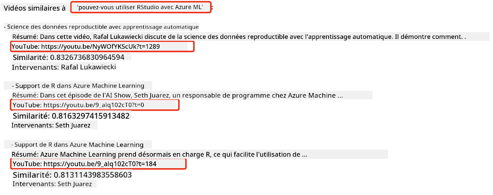
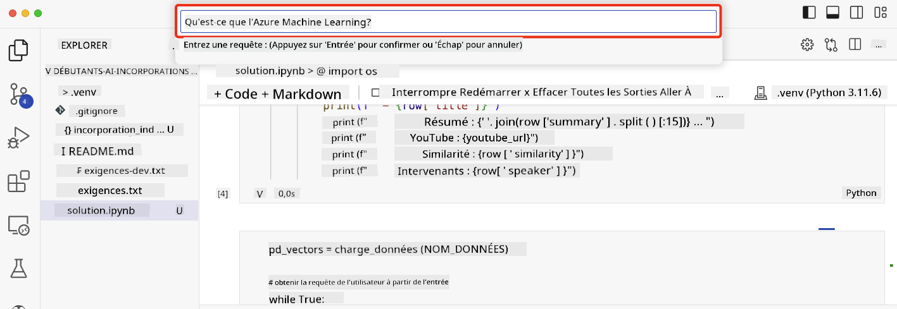

<!--
CO_OP_TRANSLATOR_METADATA:
{
  "original_hash": "d46aad0917a1a342d613e2c13d457da5",
  "translation_date": "2025-05-19T10:20:00+00:00",
  "source_file": "08-building-search-applications/README.md",
  "language_code": "fr"
}
-->
# Construire des applications de recherche

[](https://aka.ms/gen-ai-lesson8-gh?WT.mc_id=academic-105485-koreyst)

> > _Cliquez sur l'image ci-dessus pour voir la vidéo de cette leçon_

Les LLM ne se limitent pas aux chatbots et à la génération de texte. Il est également possible de créer des applications de recherche en utilisant les Embeddings. Les Embeddings sont des représentations numériques de données également appelées vecteurs, et peuvent être utilisés pour la recherche sémantique de données.

Dans cette leçon, vous allez construire une application de recherche pour notre startup éducative. Notre startup est une organisation à but non lucratif qui fournit une éducation gratuite aux étudiants des pays en développement. Notre startup possède un grand nombre de vidéos YouTube que les étudiants peuvent utiliser pour apprendre l'IA. Notre startup souhaite créer une application de recherche permettant aux étudiants de rechercher une vidéo YouTube en tapant une question.

Par exemple, un étudiant pourrait taper 'Qu'est-ce que les Jupyter Notebooks ?' ou 'Qu'est-ce qu'Azure ML' et l'application de recherche renverra une liste de vidéos YouTube pertinentes pour la question, et mieux encore, l'application de recherche renverra un lien vers l'endroit dans la vidéo où se trouve la réponse à la question.

## Introduction

Dans cette leçon, nous couvrirons :

- Recherche sémantique vs recherche par mots-clés.
- Qu'est-ce que les Text Embeddings.
- Créer un Index de Text Embeddings.
- Rechercher dans un Index de Text Embeddings.

## Objectifs d'apprentissage

Après avoir terminé cette leçon, vous serez capable de :

- Distinguer la recherche sémantique de la recherche par mots-clés.
- Expliquer ce que sont les Text Embeddings.
- Créer une application utilisant les Embeddings pour rechercher des données.

## Pourquoi construire une application de recherche ?

Créer une application de recherche vous aidera à comprendre comment utiliser les Embeddings pour rechercher des données. Vous apprendrez également à construire une application de recherche que les étudiants pourront utiliser pour trouver rapidement des informations.

La leçon inclut un Index d'Embedding des transcriptions YouTube de la chaîne [AI Show](https://www.youtube.com/playlist?list=PLlrxD0HtieHi0mwteKBOfEeOYf0LJU4O1) de Microsoft. L'AI Show est une chaîne YouTube qui vous apprend l'IA et le machine learning. L'Index d'Embedding contient les Embeddings pour chacune des transcriptions YouTube jusqu'à octobre 2023. Vous utiliserez l'Index d'Embedding pour créer une application de recherche pour notre startup. L'application de recherche renvoie un lien vers l'endroit dans la vidéo où se trouve la réponse à la question. C'est un excellent moyen pour les étudiants de trouver rapidement les informations dont ils ont besoin.

Voici un exemple de requête sémantique pour la question 'pouvez-vous utiliser rstudio avec azure ml ?'. Consultez l'url YouTube, vous verrez que l'url contient un timestamp qui vous emmène à l'endroit dans la vidéo où se trouve la réponse à la question.



## Qu'est-ce que la recherche sémantique ?

Maintenant, vous vous demandez peut-être, qu'est-ce que la recherche sémantique ? La recherche sémantique est une technique de recherche qui utilise la sémantique, ou le sens, des mots dans une requête pour renvoyer des résultats pertinents.

Voici un exemple de recherche sémantique. Disons que vous cherchiez à acheter une voiture, vous pourriez rechercher 'ma voiture de rêve', la recherche sémantique comprend que vous ne parlez pas `dreaming` d'une voiture, mais plutôt que vous cherchez à acheter votre `ideal` voiture. La recherche sémantique comprend votre intention et renvoie des résultats pertinents. L'alternative est `keyword search` qui rechercherait littéralement des rêves sur les voitures et renverrait souvent des résultats non pertinents.

## Qu'est-ce que les Text Embeddings ?

[Les Text embeddings](https://en.wikipedia.org/wiki/Word_embedding?WT.mc_id=academic-105485-koreyst) sont une technique de représentation de texte utilisée dans le [traitement du langage naturel](https://en.wikipedia.org/wiki/Natural_language_processing?WT.mc_id=academic-105485-koreyst). Les Text embeddings sont des représentations numériques sémantiques du texte. Les Embeddings sont utilisés pour représenter les données d'une manière facile à comprendre pour une machine. Il existe de nombreux modèles pour construire des Text embeddings, dans cette leçon, nous nous concentrerons sur la génération d'Embeddings en utilisant le modèle d'Embedding d'OpenAI.

Voici un exemple, imaginez que le texte suivant se trouve dans une transcription d'un des épisodes de la chaîne YouTube AI Show :

```text
Today we are going to learn about Azure Machine Learning.
```

Nous passerions le texte à l'API d'Embedding d'OpenAI et elle renverrait l'Embedding suivant composé de 1536 nombres, également appelé vecteur. Chaque nombre dans le vecteur représente un aspect différent du texte. Pour plus de concision, voici les 10 premiers nombres du vecteur.

```python
[-0.006655829958617687, 0.0026128944009542465, 0.008792596869170666, -0.02446001023054123, -0.008540431968867779, 0.022071078419685364, -0.010703742504119873, 0.003311325330287218, -0.011632772162556648, -0.02187200076878071, ...]
```

## Comment l'index d'Embedding est-il créé ?

L'index d'Embedding pour cette leçon a été créé avec une série de scripts Python. Vous trouverez les scripts avec des instructions dans le [README](./scripts/README.md?WT.mc_id=academic-105485-koreyst) dans le dossier 'scripts' pour cette leçon. Vous n'avez pas besoin d'exécuter ces scripts pour terminer cette leçon car l'Index d'Embedding est fourni pour vous.

Les scripts effectuent les opérations suivantes :

1. La transcription de chaque vidéo YouTube dans la playlist [AI Show](https://www.youtube.com/playlist?list=PLlrxD0HtieHi0mwteKBOfEeOYf0LJU4O1) est téléchargée.
2. En utilisant les [fonctions OpenAI](https://learn.microsoft.com/azure/ai-services/openai/how-to/function-calling?WT.mc_id=academic-105485-koreyst), une tentative est faite pour extraire le nom de l'orateur des 3 premières minutes de la transcription YouTube. Le nom de l'orateur pour chaque vidéo est stocké dans l'index d'Embedding nommé `embedding_index_3m.json`.
3. Le texte de la transcription est ensuite découpé en **segments de texte de 3 minutes**. Le segment inclut environ 20 mots qui se chevauchent avec le segment suivant pour s'assurer que l'Embedding pour le segment n'est pas coupé et pour fournir un meilleur contexte de recherche.
4. Chaque segment de texte est ensuite passé à l'API Chat d'OpenAI pour résumer le texte en 60 mots. Le résumé est également stocké dans l'index d'Embedding `embedding_index_3m.json`.
5. Enfin, le texte du segment est passé à l'API d'Embedding d'OpenAI. L'API d'Embedding renvoie un vecteur de 1536 nombres qui représente le sens sémantique du segment. Le segment avec le vecteur d'Embedding d'OpenAI est stocké dans un index d'Embedding `embedding_index_3m.json`.

### Bases de données vectorielles

Pour simplifier la leçon, l'index d'Embedding est stocké dans un fichier JSON nommé `embedding_index_3m.json` et chargé dans un DataFrame Pandas. Cependant, en production, l'index d'Embedding serait stocké dans une base de données vectorielle telle que [Azure Cognitive Search](https://learn.microsoft.com/training/modules/improve-search-results-vector-search?WT.mc_id=academic-105485-koreyst), [Redis](https://cookbook.openai.com/examples/vector_databases/redis/readme?WT.mc_id=academic-105485-koreyst), [Pinecone](https://cookbook.openai.com/examples/vector_databases/pinecone/readme?WT.mc_id=academic-105485-koreyst), [Weaviate](https://cookbook.openai.com/examples/vector_databases/weaviate/readme?WT.mc_id=academic-105485-koreyst), pour n'en nommer que quelques-unes.

## Comprendre la similarité cosinus

Nous avons appris ce que sont les Text embeddings, l'étape suivante est d'apprendre comment utiliser les Text embeddings pour rechercher des données et en particulier trouver les Embeddings les plus similaires à une requête donnée en utilisant la similarité cosinus.

### Qu'est-ce que la similarité cosinus ?

La similarité cosinus est une mesure de similarité entre deux vecteurs, vous entendrez également parler de `nearest neighbor search`. Pour effectuer une recherche de similarité cosinus, vous devez _vectoriser_ le texte de _requête_ en utilisant l'API d'Embedding d'OpenAI. Ensuite, calculez la _similarité cosinus_ entre le vecteur de requête et chaque vecteur dans l'index d'Embedding. Rappelez-vous, l'index d'Embedding a un vecteur pour chaque segment de texte de transcription YouTube. Enfin, triez les résultats par similarité cosinus et les segments de texte avec la plus haute similarité cosinus sont les plus similaires à la requête.

D'un point de vue mathématique, la similarité cosinus mesure le cosinus de l'angle entre deux vecteurs projetés dans un espace multidimensionnel. Cette mesure est bénéfique, car si deux documents sont éloignés par distance euclidienne en raison de leur taille, ils pourraient encore avoir un angle plus petit entre eux et donc une plus grande similarité cosinus. Pour plus d'informations sur les équations de similarité cosinus, consultez [Similarité cosinus](https://en.wikipedia.org/wiki/Cosine_similarity?WT.mc_id=academic-105485-koreyst).

## Construire votre première application de recherche

Ensuite, nous allons apprendre à construire une application de recherche en utilisant les Embeddings. L'application de recherche permettra aux étudiants de rechercher une vidéo en tapant une question. L'application de recherche renverra une liste de vidéos pertinentes pour la question. L'application de recherche renverra également un lien vers l'endroit dans la vidéo où se trouve la réponse à la question.

Cette solution a été construite et testée sur Windows 11, macOS et Ubuntu 22.04 en utilisant Python 3.10 ou une version ultérieure. Vous pouvez télécharger Python depuis [python.org](https://www.python.org/downloads/?WT.mc_id=academic-105485-koreyst).

## Mission - construire une application de recherche, pour permettre aux étudiants

Nous avons présenté notre startup au début de cette leçon. Il est maintenant temps de permettre aux étudiants de construire une application de recherche pour leurs évaluations.

Dans cette mission, vous allez créer les Services Azure OpenAI qui seront utilisés pour construire l'application de recherche. Vous allez créer les Services Azure OpenAI suivants. Vous aurez besoin d'un abonnement Azure pour compléter cette mission.

### Démarrer le Cloud Shell Azure

1. Connectez-vous au [portail Azure](https://portal.azure.com/?WT.mc_id=academic-105485-koreyst).
2. Sélectionnez l'icône Cloud Shell dans le coin supérieur droit du portail Azure.
3. Sélectionnez **Bash** pour le type d'environnement.

#### Créer un groupe de ressources

> Pour ces instructions, nous utilisons le groupe de ressources nommé "semantic-video-search" dans l'Est des États-Unis.
> Vous pouvez changer le nom du groupe de ressources, mais lorsque vous changez l'emplacement des ressources,
> vérifiez le [tableau de disponibilité des modèles](https://aka.ms/oai/models?WT.mc_id=academic-105485-koreyst).

```shell
az group create --name semantic-video-search --location eastus
```

#### Créer une ressource de service Azure OpenAI

Depuis le Cloud Shell Azure, exécutez la commande suivante pour créer une ressource de service Azure OpenAI.

```shell
az cognitiveservices account create --name semantic-video-openai --resource-group semantic-video-search \
    --location eastus --kind OpenAI --sku s0
```

#### Obtenir le point de terminaison et les clés pour l'utilisation dans cette application

Depuis le Cloud Shell Azure, exécutez les commandes suivantes pour obtenir le point de terminaison et les clés pour la ressource de service Azure OpenAI.

```shell
az cognitiveservices account show --name semantic-video-openai \
   --resource-group  semantic-video-search | jq -r .properties.endpoint
az cognitiveservices account keys list --name semantic-video-openai \
   --resource-group semantic-video-search | jq -r .key1
```

#### Déployer le modèle d'Embedding OpenAI

Depuis le Cloud Shell Azure, exécutez la commande suivante pour déployer le modèle d'Embedding OpenAI.

```shell
az cognitiveservices account deployment create \
    --name semantic-video-openai \
    --resource-group  semantic-video-search \
    --deployment-name text-embedding-ada-002 \
    --model-name text-embedding-ada-002 \
    --model-version "2"  \
    --model-format OpenAI \
    --sku-capacity 100 --sku-name "Standard"
```

## Solution

Ouvrez le [cahier de solution](../../../08-building-search-applications/python/aoai-solution.ipynb) dans GitHub Codespaces et suivez les instructions dans le Jupyter Notebook.

Lorsque vous exécutez le notebook, vous serez invité à entrer une requête. La boîte de saisie ressemblera à ceci :



## Bon travail ! Continuez votre apprentissage

Après avoir terminé cette leçon, consultez notre [collection d'apprentissage sur l'IA générative](https://aka.ms/genai-collection?WT.mc_id=academic-105485-koreyst) pour continuer à améliorer vos connaissances en IA générative !

Rendez-vous à la leçon 9 où nous verrons comment [construire des applications de génération d'images](../09-building-image-applications/README.md?WT.mc_id=academic-105485-koreyst) !

**Avertissement** :  
Ce document a été traduit en utilisant le service de traduction IA [Co-op Translator](https://github.com/Azure/co-op-translator). Bien que nous nous efforcions d'assurer l'exactitude, veuillez noter que les traductions automatisées peuvent contenir des erreurs ou des inexactitudes. Le document original dans sa langue d'origine doit être considéré comme la source faisant autorité. Pour des informations critiques, une traduction humaine professionnelle est recommandée. Nous ne sommes pas responsables des malentendus ou des interprétations erronées résultant de l'utilisation de cette traduction.