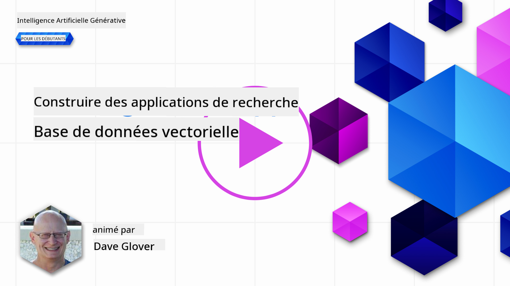
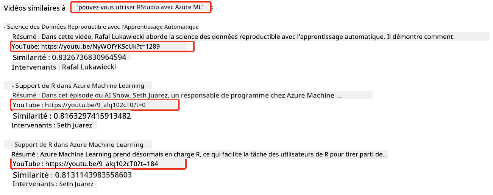

<!--
CO_OP_TRANSLATOR_METADATA:
{
  "original_hash": "d46aad0917a1a342d613e2c13d457da5",
  "translation_date": "2025-07-09T12:45:38+00:00",
  "source_file": "08-building-search-applications/README.md",
  "language_code": "fr"
}
-->
# Construire des applications de recherche

[](https://aka.ms/gen-ai-lesson8-gh?WT.mc_id=academic-105485-koreyst)

> > _Cliquez sur l'image ci-dessus pour voir la vidéo de cette leçon_

Les LLM ne se limitent pas aux chatbots et à la génération de texte. Il est également possible de créer des applications de recherche en utilisant les Embeddings. Les Embeddings sont des représentations numériques des données, aussi appelées vecteurs, et peuvent être utilisés pour la recherche sémantique dans les données.

Dans cette leçon, vous allez construire une application de recherche pour notre startup éducative. Notre startup est une organisation à but non lucratif qui offre une éducation gratuite aux étudiants des pays en développement. Nous disposons d’un grand nombre de vidéos YouTube que les étudiants peuvent utiliser pour apprendre l’IA. Notre startup souhaite créer une application de recherche permettant aux étudiants de trouver une vidéo YouTube en tapant une question.

Par exemple, un étudiant pourrait taper « Qu’est-ce qu’un Jupyter Notebook ? » ou « Qu’est-ce qu’Azure ML ? » et l’application de recherche renverra une liste de vidéos YouTube pertinentes par rapport à la question, et mieux encore, elle fournira un lien vers l’endroit précis dans la vidéo où se trouve la réponse.

## Introduction

Dans cette leçon, nous aborderons :

- Recherche sémantique vs recherche par mots-clés.
- Qu’est-ce que les Text Embeddings.
- Création d’un index d’Embeddings textuels.
- Recherche dans un index d’Embeddings textuels.

## Objectifs d’apprentissage

À la fin de cette leçon, vous serez capable de :

- Faire la différence entre recherche sémantique et recherche par mots-clés.
- Expliquer ce que sont les Text Embeddings.
- Créer une application utilisant les Embeddings pour rechercher des données.

## Pourquoi créer une application de recherche ?

Créer une application de recherche vous aidera à comprendre comment utiliser les Embeddings pour rechercher des données. Vous apprendrez également à construire une application de recherche que les étudiants pourront utiliser pour trouver rapidement des informations.

La leçon inclut un index d’Embeddings des transcriptions YouTube de la chaîne Microsoft [AI Show](https://www.youtube.com/playlist?list=PLlrxD0HtieHi0mwteKBOfEeOYf0LJU4O1). AI Show est une chaîne YouTube qui vous enseigne l’IA et le machine learning. L’index d’Embeddings contient les Embeddings pour chaque transcription YouTube jusqu’en octobre 2023. Vous utiliserez cet index pour construire une application de recherche pour notre startup. L’application renvoie un lien vers l’endroit précis dans la vidéo où se trouve la réponse à la question. C’est un excellent moyen pour les étudiants de trouver rapidement l’information dont ils ont besoin.

Voici un exemple de requête sémantique pour la question « peut-on utiliser rstudio avec azure ml ? ». Regardez l’URL YouTube, vous verrez qu’elle contient un horodatage qui vous amène directement à l’endroit dans la vidéo où se trouve la réponse.



## Qu’est-ce que la recherche sémantique ?

Vous vous demandez peut-être ce qu’est la recherche sémantique ? La recherche sémantique est une technique qui utilise la signification des mots dans une requête pour retourner des résultats pertinents.

Voici un exemple de recherche sémantique. Supposons que vous cherchiez à acheter une voiture, vous pourriez taper « ma voiture de rêve ». La recherche sémantique comprend que vous ne rêvez pas littéralement d’une voiture, mais que vous cherchez votre voiture idéale. Elle comprend votre intention et renvoie des résultats pertinents. L’alternative est la recherche par mots-clés qui chercherait littéralement des rêves liés aux voitures et renverrait souvent des résultats hors sujet.

## Qu’est-ce que les Text Embeddings ?

[Les Text Embeddings](https://en.wikipedia.org/wiki/Word_embedding?WT.mc_id=academic-105485-koreyst) sont une technique de représentation textuelle utilisée en [traitement automatique du langage naturel](https://en.wikipedia.org/wiki/Natural_language_processing?WT.mc_id=academic-105485-koreyst). Les Text Embeddings sont des représentations numériques sémantiques du texte. Ils servent à représenter les données d’une manière compréhensible par une machine. Il existe de nombreux modèles pour générer des embeddings textuels, dans cette leçon, nous nous concentrerons sur la génération d’Embeddings avec le modèle OpenAI Embedding.

Voici un exemple, imaginez que le texte suivant provienne d’une transcription d’un épisode de la chaîne AI Show sur YouTube :

```text
Today we are going to learn about Azure Machine Learning.
```

Nous transmettrions ce texte à l’API OpenAI Embedding qui retournerait l’Embedding suivant, composé de 1536 nombres, autrement dit un vecteur. Chaque nombre dans ce vecteur représente un aspect différent du texte. Pour plus de simplicité, voici les 10 premiers nombres du vecteur.

```python
[-0.006655829958617687, 0.0026128944009542465, 0.008792596869170666, -0.02446001023054123, -0.008540431968867779, 0.022071078419685364, -0.010703742504119873, 0.003311325330287218, -0.011632772162556648, -0.02187200076878071, ...]
```

## Comment est créé l’index d’Embeddings ?

L’index d’Embeddings pour cette leçon a été créé à l’aide d’une série de scripts Python. Vous trouverez ces scripts ainsi que les instructions dans le [README](./scripts/README.md?WT.mc_id=academic-105485-koreyst) du dossier `scripts` de cette leçon. Vous n’avez pas besoin d’exécuter ces scripts pour suivre la leçon car l’index d’Embeddings est déjà fourni.

Les scripts effectuent les opérations suivantes :

1. La transcription de chaque vidéo YouTube de la playlist [AI Show](https://www.youtube.com/playlist?list=PLlrxD0HtieHi0mwteKBOfEeOYf0LJU4O1) est téléchargée.
2. En utilisant les [fonctions OpenAI](https://learn.microsoft.com/azure/ai-services/openai/how-to/function-calling?WT.mc_id=academic-105485-koreyst), une tentative est faite pour extraire le nom du locuteur à partir des 3 premières minutes de la transcription YouTube. Le nom du locuteur pour chaque vidéo est stocké dans l’index d’Embeddings nommé `embedding_index_3m.json`.
3. Le texte de la transcription est ensuite découpé en segments de texte de **3 minutes**. Chaque segment inclut environ 20 mots en chevauchement avec le segment suivant pour éviter que l’Embedding soit tronqué et pour offrir un meilleur contexte de recherche.
4. Chaque segment de texte est ensuite envoyé à l’API OpenAI Chat pour résumer le texte en 60 mots. Le résumé est également stocké dans l’index d’Embeddings `embedding_index_3m.json`.
5. Enfin, le texte du segment est envoyé à l’API OpenAI Embedding. L’API retourne un vecteur de 1536 nombres représentant la signification sémantique du segment. Le segment ainsi que le vecteur OpenAI Embedding sont stockés dans l’index d’Embeddings `embedding_index_3m.json`.

### Bases de données vectorielles

Pour simplifier la leçon, l’index d’Embeddings est stocké dans un fichier JSON nommé `embedding_index_3m.json` et chargé dans un DataFrame Pandas. Cependant, en production, l’index d’Embeddings serait stocké dans une base de données vectorielle telle que [Azure Cognitive Search](https://learn.microsoft.com/training/modules/improve-search-results-vector-search?WT.mc_id=academic-105485-koreyst), [Redis](https://cookbook.openai.com/examples/vector_databases/redis/readme?WT.mc_id=academic-105485-koreyst), [Pinecone](https://cookbook.openai.com/examples/vector_databases/pinecone/readme?WT.mc_id=academic-105485-koreyst), [Weaviate](https://cookbook.openai.com/examples/vector_databases/weaviate/readme?WT.mc_id=academic-105485-koreyst), pour n’en citer que quelques-unes.

## Comprendre la similarité cosinus

Nous avons vu les Text Embeddings, l’étape suivante est d’apprendre à les utiliser pour rechercher des données, et en particulier à trouver les embeddings les plus proches d’une requête donnée en utilisant la similarité cosinus.

### Qu’est-ce que la similarité cosinus ?

La similarité cosinus est une mesure de similarité entre deux vecteurs, on parle aussi de `recherche du plus proche voisin`. Pour effectuer une recherche par similarité cosinus, vous devez _vectoriser_ le texte de la _requête_ en utilisant l’API OpenAI Embedding. Ensuite, calculez la _similarité cosinus_ entre le vecteur de la requête et chaque vecteur de l’index d’Embeddings. Rappelez-vous, l’index contient un vecteur pour chaque segment de texte de la transcription YouTube. Enfin, triez les résultats par similarité cosinus, les segments de texte avec la similarité la plus élevée sont les plus proches de la requête.

D’un point de vue mathématique, la similarité cosinus mesure le cosinus de l’angle entre deux vecteurs projetés dans un espace multidimensionnel. Cette mesure est utile car deux documents peuvent être éloignés en distance euclidienne à cause de leur taille, mais avoir un angle plus petit entre eux et donc une similarité cosinus plus élevée. Pour plus d’informations sur les équations de la similarité cosinus, consultez [Similarité cosinus](https://en.wikipedia.org/wiki/Cosine_similarity?WT.mc_id=academic-105485-koreyst).

## Construire votre première application de recherche

Nous allons maintenant apprendre à construire une application de recherche utilisant les Embeddings. Cette application permettra aux étudiants de rechercher une vidéo en tapant une question. L’application renverra une liste de vidéos pertinentes par rapport à la question. Elle fournira également un lien vers l’endroit précis dans la vidéo où se trouve la réponse.

Cette solution a été développée et testée sous Windows 11, macOS et Ubuntu 22.04 avec Python 3.10 ou version ultérieure. Vous pouvez télécharger Python sur [python.org](https://www.python.org/downloads/?WT.mc_id=academic-105485-koreyst).

## Exercice - construire une application de recherche pour aider les étudiants

Nous avons présenté notre startup au début de cette leçon. Il est maintenant temps de permettre aux étudiants de construire une application de recherche pour leurs évaluations.

Dans cet exercice, vous allez créer les services Azure OpenAI qui seront utilisés pour construire l’application de recherche. Vous créerez les services Azure OpenAI suivants. Un abonnement Azure est nécessaire pour réaliser cet exercice.

### Démarrer Azure Cloud Shell

1. Connectez-vous au [portail Azure](https://portal.azure.com/?WT.mc_id=academic-105485-koreyst).
2. Sélectionnez l’icône Cloud Shell en haut à droite du portail Azure.
3. Choisissez **Bash** comme type d’environnement.

#### Créer un groupe de ressources

> Pour ces instructions, nous utilisons le groupe de ressources nommé "semantic-video-search" dans la région East US.
> Vous pouvez changer le nom du groupe de ressources, mais si vous modifiez la localisation des ressources,
> vérifiez le [tableau de disponibilité des modèles](https://aka.ms/oai/models?WT.mc_id=academic-105485-koreyst).

```shell
az group create --name semantic-video-search --location eastus
```

#### Créer une ressource Azure OpenAI Service

Depuis Azure Cloud Shell, exécutez la commande suivante pour créer une ressource Azure OpenAI Service.

```shell
az cognitiveservices account create --name semantic-video-openai --resource-group semantic-video-search \
    --location eastus --kind OpenAI --sku s0
```

#### Obtenir l’endpoint et les clés pour l’utilisation dans cette application

Depuis Azure Cloud Shell, exécutez les commandes suivantes pour récupérer l’endpoint et les clés de la ressource Azure OpenAI Service.

```shell
az cognitiveservices account show --name semantic-video-openai \
   --resource-group  semantic-video-search | jq -r .properties.endpoint
az cognitiveservices account keys list --name semantic-video-openai \
   --resource-group semantic-video-search | jq -r .key1
```

#### Déployer le modèle OpenAI Embedding

Depuis Azure Cloud Shell, exécutez la commande suivante pour déployer le modèle OpenAI Embedding.

```shell
az cognitiveservices account deployment create \
    --name semantic-video-openai \
    --resource-group  semantic-video-search \
    --deployment-name text-embedding-ada-002 \
    --model-name text-embedding-ada-002 \
    --model-version "2"  \
    --model-format OpenAI \
    --sku-capacity 100 --sku-name "Standard"
```

## Solution

Ouvrez le [notebook solution](../../../08-building-search-applications/python/aoai-solution.ipynb) dans GitHub Codespaces et suivez les instructions dans le Jupyter Notebook.

Lorsque vous lancez le notebook, une invite vous demandera de saisir une requête. La zone de saisie ressemblera à ceci :


## Bravo ! Continuez à apprendre

Après avoir terminé cette leçon, consultez notre [collection d’apprentissage sur l’IA générative](https://aka.ms/genai-collection?WT.mc_id=academic-105485-koreyst) pour continuer à approfondir vos connaissances en IA générative !

Rendez-vous à la leçon 9 où nous verrons comment [construire des applications de génération d’images](../09-building-image-applications/README.md?WT.mc_id=academic-105485-koreyst) !

**Avertissement** :  
Ce document a été traduit à l’aide du service de traduction automatique [Co-op Translator](https://github.com/Azure/co-op-translator). Bien que nous nous efforcions d’assurer l’exactitude, veuillez noter que les traductions automatiques peuvent contenir des erreurs ou des inexactitudes. Le document original dans sa langue d’origine doit être considéré comme la source faisant foi. Pour les informations critiques, une traduction professionnelle réalisée par un humain est recommandée. Nous déclinons toute responsabilité en cas de malentendus ou de mauvaises interprétations résultant de l’utilisation de cette traduction.