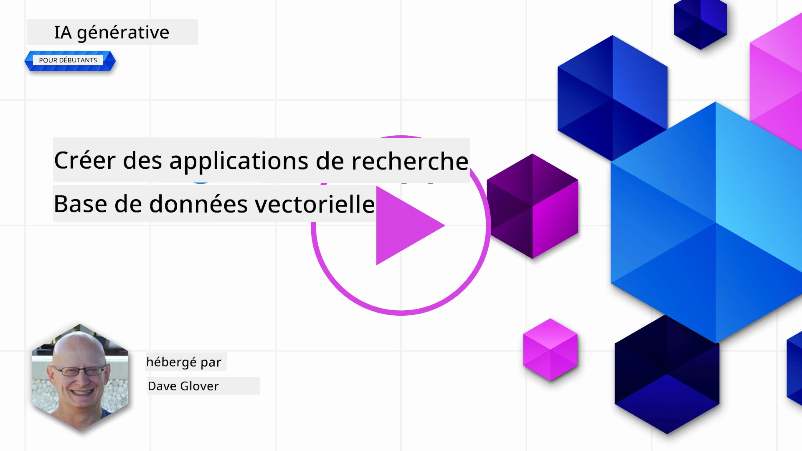
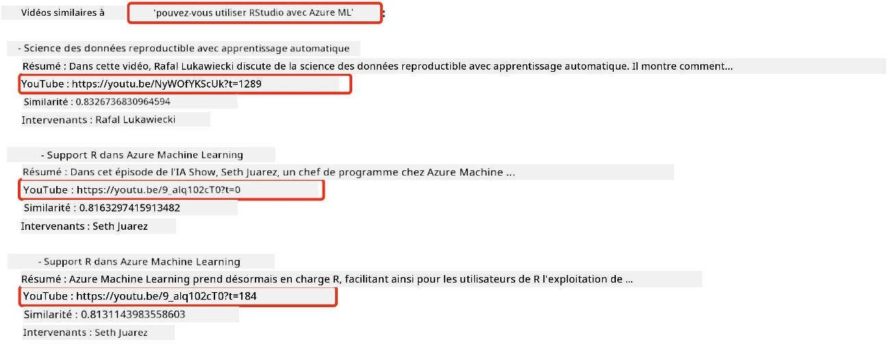
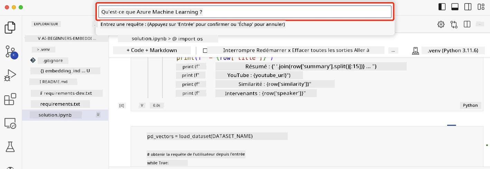

# Construire des applications de recherche

[](https://youtu.be/W0-nzXjOjr0?si=GcsqiTTvd7RKbo7V)

> > _Cliquez sur l’image ci-dessus pour voir la vidéo de cette leçon_

Les grands modèles de langage ne se limitent pas aux chatbots et à la génération de texte. Il est également possible de construire des applications de recherche en utilisant les Embeddings. Les Embeddings sont des représentations numériques des données également appelées vecteurs, et peuvent être utilisés pour la recherche sémantique des données.

Dans cette leçon, vous allez construire une application de recherche pour notre startup éducative. Notre startup est une organisation à but non lucratif qui fournit une éducation gratuite aux étudiants des pays en développement. Notre startup dispose d’un grand nombre de vidéos YouTube que les étudiants peuvent utiliser pour apprendre l’IA. Notre startup souhaite construire une application de recherche qui permet aux étudiants de rechercher une vidéo YouTube en tapant une question.

Par exemple, un étudiant pourrait taper « Qu’est-ce que les Jupyter Notebooks ? » ou « Qu’est-ce qu’Azure ML » et l’application de recherche retournera une liste de vidéos YouTube pertinentes par rapport à la question, et mieux encore, l’application de recherche fournira un lien vers l’endroit dans la vidéo où la réponse à la question se trouve.

## Introduction

Dans cette leçon, nous aborderons :

- Recherche sémantique vs recherche par mot-clé.
- Qu’est-ce que les Text Embeddings.
- Création d’un index d’Embeddings textuels.
- Recherche dans un index d’Embeddings textuels.

## Objectifs d’apprentissage

Après avoir terminé cette leçon, vous serez capable de :

- Faire la différence entre recherche sémantique et recherche par mot-clé.
- Expliquer ce que sont les Text Embeddings.
- Créer une application utilisant les Embeddings pour rechercher des données.

## Pourquoi construire une application de recherche ?

Construire une application de recherche vous aidera à comprendre comment utiliser les Embeddings pour rechercher des données. Vous apprendrez également à construire une application de recherche qui peut être utilisée par les étudiants pour trouver rapidement des informations.

La leçon inclut un index d’Embeddings des transcriptions YouTube de la chaîne [AI Show](https://www.youtube.com/playlist?list=PLlrxD0HtieHi0mwteKBOfEeOYf0LJU4O1) de Microsoft. L’AI Show est une chaîne YouTube qui vous enseigne l’IA et l’apprentissage automatique. L’index d’Embeddings contient les Embeddings pour chacune des transcriptions YouTube jusqu’en octobre 2023. Vous utiliserez l’index d’Embeddings pour construire une application de recherche pour notre startup. L’application de recherche retourne un lien vers l’endroit dans la vidéo où la réponse à la question est située. C’est un excellent moyen pour les étudiants de trouver rapidement l’information dont ils ont besoin.

Voici un exemple de requête sémantique pour la question « peut-on utiliser rstudio avec Azure ML ? ». Regardez l’URL YouTube, vous verrez que l’URL contient un horodatage qui vous amène à l’endroit dans la vidéo où la réponse à la question est située.



## Qu’est-ce que la recherche sémantique ?

Vous vous demandez peut-être ce qu’est la recherche sémantique ? La recherche sémantique est une technique de recherche qui utilise la sémantique, ou le sens, des mots dans une requête pour retourner des résultats pertinents.

Voici un exemple de recherche sémantique. Supposons que vous cherchiez à acheter une voiture, vous pourriez chercher « ma voiture de rêve », la recherche sémantique comprend que vous ne `rêvez` pas d’une voiture, mais que vous cherchez à acheter votre voiture `idéale`. La recherche sémantique comprend votre intention et retourne des résultats pertinents. L’alternative est la `recherche par mot-clé` qui chercherait littéralement des rêves de voitures et retourne souvent des résultats hors sujet.

## Qu’est-ce que les Text Embeddings ?

Les [text embeddings](https://en.wikipedia.org/wiki/Word_embedding?WT.mc_id=academic-105485-koreyst) sont une technique de représentation textuelle utilisée dans le [traitement du langage naturel](https://en.wikipedia.org/wiki/Natural_language_processing?WT.mc_id=academic-105485-koreyst). Les text embeddings sont des représentations numériques sémantiques du texte. Les embeddings sont utilisés pour représenter les données d’une manière facile à comprendre pour une machine. Il existe de nombreux modèles pour construire des text embeddings, dans cette leçon, nous allons nous concentrer sur la génération d’Embeddings en utilisant le modèle OpenAI Embedding.

Voici un exemple, imaginez que le texte suivant se trouve dans une transcription d’un épisode de la chaîne AI Show sur YouTube :

```text
Today we are going to learn about Azure Machine Learning.
```

Nous passerions ce texte à l’API OpenAI Embedding qui retournerait l’Embedding suivant composé de 1536 nombres aka un vecteur. Chaque nombre dans le vecteur représente un aspect différent du texte. Par souci de brièveté, voici les 10 premiers nombres du vecteur.

```python
[-0.006655829958617687, 0.0026128944009542465, 0.008792596869170666, -0.02446001023054123, -0.008540431968867779, 0.022071078419685364, -0.010703742504119873, 0.003311325330287218, -0.011632772162556648, -0.02187200076878071, ...]
```

## Comment l’index d’Embedding est-il créé ?

L’index d’Embedding pour cette leçon a été créé avec une série de scripts Python. Vous trouverez les scripts ainsi que les instructions dans le [README](./scripts/README.md?WT.mc_id=academic-105485-koreyst) dans le dossier `scripts` pour cette leçon. Vous n’avez pas besoin d’exécuter ces scripts pour terminer cette leçon car l’index d’Embedding vous est fourni.

Les scripts effectuent les opérations suivantes :

1. La transcription de chaque vidéo YouTube de la playlist [AI Show](https://www.youtube.com/playlist?list=PLlrxD0HtieHi0mwteKBOfEeOYf0LJU4O1) est téléchargée.
2. À l’aide des [Fonctions OpenAI](https://learn.microsoft.com/azure/ai-foundry/openai/how-to/function-calling?WT.mc_id=academic-105485-koreyst), une tentative est faite pour extraire le nom du locuteur des 3 premières minutes de la transcription YouTube. Le nom du locuteur pour chaque vidéo est stocké dans l’index d’Embedding nommé `embedding_index_3m.json`.
3. Le texte de la transcription est ensuite segmenté en **segments de texte de 3 minutes**. Le segment comprend environ 20 mots en chevauchement avec le segment suivant afin de garantir que l’Embedding du segment ne soit pas coupé et pour fournir un meilleur contexte de recherche.
4. Chaque segment de texte est ensuite passé à l’API Chat d’OpenAI pour résumer le texte en 60 mots. Le résumé est également stocké dans l’index d’Embedding `embedding_index_3m.json`.
5. Enfin, le texte du segment est envoyé à l’API OpenAI Embedding. L’API Embedding retourne un vecteur de 1536 nombres qui représentent la signification sémantique du segment. Le segment ainsi que le vecteur d’Embedding OpenAI sont stockés dans un index d’Embedding `embedding_index_3m.json`.

### Bases de données vectorielles

Pour simplifier la leçon, l’index d’Embedding est stocké dans un fichier JSON nommé `embedding_index_3m.json` et chargé dans un DataFrame Pandas. Cependant, en production, l’index d’Embedding serait stocké dans une base de données vectorielle telle que [Azure Cognitive Search](https://learn.microsoft.com/training/modules/improve-search-results-vector-search?WT.mc_id=academic-105485-koreyst), [Redis](https://cookbook.openai.com/examples/vector_databases/redis/readme?WT.mc_id=academic-105485-koreyst), [Pinecone](https://cookbook.openai.com/examples/vector_databases/pinecone/readme?WT.mc_id=academic-105485-koreyst), [Weaviate](https://cookbook.openai.com/examples/vector_databases/weaviate/readme?WT.mc_id=academic-105485-koreyst), pour n’en nommer que quelques-unes.

## Comprendre la similarité cosinus

Nous avons appris ce que sont les text embeddings, l’étape suivante est d’apprendre à utiliser les text embeddings pour rechercher des données et en particulier trouver les embeddings les plus similaires à une requête donnée en utilisant la similarité cosinus.

### Qu’est-ce que la similarité cosinus ?

La similarité cosinus est une mesure de similarité entre deux vecteurs, vous entendrez aussi parler de cela sous le terme de `recherche du plus proche voisin`. Pour effectuer une recherche par similarité cosinus, vous devez _vectoriser_ le texte de la _requête_ en utilisant l’API OpenAI Embedding. Ensuite, calculez la _similarité cosinus_ entre le vecteur de la requête et chaque vecteur dans l’index d’Embedding. N’oubliez pas que l’index d’Embedding possède un vecteur pour chaque segment de texte de la transcription YouTube. Enfin, triez les résultats par similarité cosinus et les segments de texte avec la similarité cosinus la plus élevée sont les plus similaires à la requête.

D’un point de vue mathématique, la similarité cosinus mesure le cosinus de l’angle entre deux vecteurs projetés dans un espace multidimensionnel. Cette mesure est utile, car si deux documents sont éloignés par la distance euclidienne en raison de leur taille, ils peuvent encore avoir un angle plus petit entre eux et donc une similarité cosinus plus élevée. Pour plus d’informations sur les équations de similarité cosinus, consultez [Similarité cosinus](https://en.wikipedia.org/wiki/Cosine_similarity?WT.mc_id=academic-105485-koreyst).

## Construire votre première application de recherche

Ensuite, nous allons apprendre à construire une application de recherche utilisant les Embeddings. L’application de recherche permettra aux étudiants de rechercher une vidéo en tapant une question. L’application de recherche retournera une liste de vidéos pertinentes par rapport à cette question. L’application de recherche retournera également un lien vers l’endroit dans la vidéo où la réponse à la question se trouve.

Cette solution a été construite et testée sous Windows 11, macOS, et Ubuntu 22.04 en utilisant Python 3.10 ou une version ultérieure. Vous pouvez télécharger Python depuis [python.org](https://www.python.org/downloads/?WT.mc_id=academic-105485-koreyst).

## Exercice - construire une application de recherche, pour permettre aux étudiants

Nous avons présenté notre startup au début de cette leçon. Il est maintenant temps de permettre aux étudiants de construire une application de recherche pour leurs évaluations.

Dans cet exercice, vous allez créer les services Azure OpenAI qui seront utilisés pour construire l’application de recherche. Vous créerez les services Azure OpenAI suivants. Vous aurez besoin d’un abonnement Azure pour compléter cet exercice.

### Démarrer Azure Cloud Shell

1. Connectez-vous au [portail Azure](https://portal.azure.com/?WT.mc_id=academic-105485-koreyst).
2. Sélectionnez l’icône Cloud Shell dans le coin supérieur droit du portail Azure.
3. Sélectionnez **Bash** comme type d’environnement.

#### Créer un groupe de ressources

> Pour ces instructions, nous utilisons le groupe de ressources nommé "semantic-video-search" dans East US.
> Vous pouvez changer le nom du groupe de ressources, mais si vous changez l’emplacement des ressources,
> vérifiez le [tableau de disponibilité des modèles](https://aka.ms/oai/models?WT.mc_id=academic-105485-koreyst).

```shell
az group create --name semantic-video-search --location eastus
```

#### Créer une ressource Azure OpenAI Service

Depuis Azure Cloud Shell, exécutez la commande suivante pour créer une ressource Azure OpenAI Service.

```shell
az cognitiveservices account create --name semantic-video-openai --resource-group semantic-video-search \
    --location eastus --kind OpenAI --sku s0
```

#### Obtenir le point de terminaison et les clés pour l'utilisation dans cette application

Depuis Azure Cloud Shell, exécutez les commandes suivantes pour obtenir le point de terminaison et les clés pour la ressource Azure OpenAI Service.

```shell
az cognitiveservices account show --name semantic-video-openai \
   --resource-group  semantic-video-search | jq -r .properties.endpoint
az cognitiveservices account keys list --name semantic-video-openai \
   --resource-group semantic-video-search | jq -r .key1
```

#### Déployer le modèle OpenAI Embedding

Depuis Azure Cloud Shell, exécutez la commande suivante pour déployer le modèle OpenAI Embedding.

```shell
az cognitiveservices account deployment create \
    --name semantic-video-openai \
    --resource-group  semantic-video-search \
    --deployment-name text-embedding-ada-002 \
    --model-name text-embedding-ada-002 \
    --model-version "2"  \
    --model-format OpenAI \
    --sku-capacity 100 --sku-name "Standard"
```

## Solution

Ouvrez le [notebook solution](./python/aoai-solution.ipynb?WT.mc_id=academic-105485-koreyst) dans GitHub Codespaces et suivez les instructions dans le Jupyter Notebook.

Lorsque vous exécutez le notebook, il vous sera demandé d’entrer une requête. La zone de saisie ressemblera à ceci :



## Excellent travail ! Continuez votre apprentissage

Après avoir terminé cette leçon, consultez notre [collection d’apprentissage sur l’IA générative](https://aka.ms/genai-collection?WT.mc_id=academic-105485-koreyst) pour continuer à améliorer vos connaissances en IA générative !

Rendez-vous à la Leçon 9 où nous verrons comment [construire des applications de génération d’image](../09-building-image-applications/README.md?WT.mc_id=academic-105485-koreyst) !

---

<!-- CO-OP TRANSLATOR DISCLAIMER START -->
**Avertissement** :
Ce document a été traduit à l'aide du service de traduction automatique [Co-op Translator](https://github.com/Azure/co-op-translator). Bien que nous nous efforçions d'assurer l'exactitude, veuillez noter que les traductions automatisées peuvent contenir des erreurs ou des inexactitudes. Le document original dans sa langue native doit être considéré comme la source faisant autorité. Pour les informations critiques, il est recommandé de recourir à une traduction professionnelle réalisée par un humain. Nous ne saurions être tenus responsables des malentendus ou erreurs d'interprétation découlant de l'utilisation de cette traduction.
<!-- CO-OP TRANSLATOR DISCLAIMER END -->