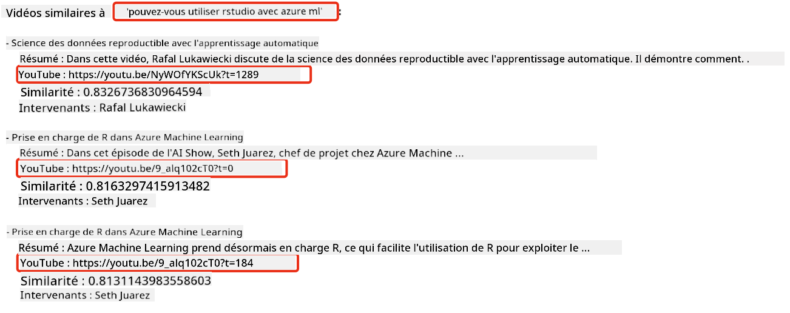

<!--
CO_OP_TRANSLATOR_METADATA:
{
  "original_hash": "58953c08b8ba7073b836d4270ea0fe86",
  "translation_date": "2025-10-17T22:37:30+00:00",
  "source_file": "08-building-search-applications/README.md",
  "language_code": "fr"
}
-->
# Construire des applications de recherche

[](https://youtu.be/W0-nzXjOjr0?si=GcsqiTTvd7RKbo7V)

> > _Cliquez sur l'image ci-dessus pour visionner la vidéo de cette leçon_

Les grands modèles de langage (LLMs) ne se limitent pas aux chatbots et à la génération de texte. Il est également possible de créer des applications de recherche en utilisant des embeddings. Les embeddings sont des représentations numériques de données, également appelées vecteurs, et peuvent être utilisés pour effectuer des recherches sémantiques sur des données.

Dans cette leçon, vous allez construire une application de recherche pour notre startup éducative. Notre startup est une organisation à but non lucratif qui offre une éducation gratuite aux étudiants des pays en développement. Elle dispose d'un grand nombre de vidéos YouTube que les étudiants peuvent utiliser pour apprendre sur l'IA. Notre startup souhaite créer une application de recherche permettant aux étudiants de trouver une vidéo YouTube en tapant une question.

Par exemple, un étudiant pourrait taper "Qu'est-ce que les Jupyter Notebooks ?" ou "Qu'est-ce qu'Azure ML ?" et l'application de recherche renverra une liste de vidéos YouTube pertinentes pour la question. Mieux encore, l'application de recherche fournira un lien vers l'endroit précis de la vidéo où se trouve la réponse à la question.

## Introduction

Dans cette leçon, nous aborderons :

- Recherche sémantique vs recherche par mots-clés.
- Qu'est-ce que les embeddings de texte.
- Création d'un index d'embeddings de texte.
- Recherche dans un index d'embeddings de texte.

## Objectifs d'apprentissage

Après avoir terminé cette leçon, vous serez capable de :

- Différencier la recherche sémantique de la recherche par mots-clés.
- Expliquer ce que sont les embeddings de texte.
- Créer une application utilisant des embeddings pour rechercher des données.

## Pourquoi créer une application de recherche ?

Créer une application de recherche vous aidera à comprendre comment utiliser les embeddings pour rechercher des données. Vous apprendrez également à construire une application de recherche que les étudiants pourront utiliser pour trouver rapidement des informations.

La leçon inclut un index d'embeddings des transcriptions YouTube de la chaîne [AI Show de Microsoft](https://www.youtube.com/playlist?list=PLlrxD0HtieHi0mwteKBOfEeOYf0LJU4O1). L'AI Show est une chaîne YouTube qui enseigne l'IA et l'apprentissage automatique. L'index d'embeddings contient les embeddings de chaque transcription YouTube jusqu'en octobre 2023. Vous utiliserez cet index pour construire une application de recherche pour notre startup. L'application de recherche renvoie un lien vers l'endroit précis de la vidéo où se trouve la réponse à la question. C'est un excellent moyen pour les étudiants de trouver rapidement les informations dont ils ont besoin.

Voici un exemple de requête sémantique pour la question "peut-on utiliser rstudio avec azure ml ?". Consultez l'URL YouTube, vous verrez qu'elle contient un timestamp qui vous mène directement à l'endroit de la vidéo où se trouve la réponse à la question.



## Qu'est-ce que la recherche sémantique ?

Vous vous demandez peut-être ce qu'est la recherche sémantique. La recherche sémantique est une technique de recherche qui utilise la sémantique, ou le sens des mots dans une requête, pour renvoyer des résultats pertinents.

Voici un exemple de recherche sémantique. Disons que vous cherchez à acheter une voiture, vous pourriez rechercher "ma voiture de rêve". La recherche sémantique comprend que vous ne rêvez pas littéralement d'une voiture, mais que vous cherchez à acheter votre voiture "idéale". La recherche sémantique comprend votre intention et renvoie des résultats pertinents. L'alternative est la "recherche par mots-clés", qui chercherait littéralement des rêves sur les voitures et renverrait souvent des résultats non pertinents.

## Qu'est-ce que les embeddings de texte ?

[Les embeddings de texte](https://en.wikipedia.org/wiki/Word_embedding?WT.mc_id=academic-105485-koreyst) sont une technique de représentation de texte utilisée en [traitement du langage naturel](https://en.wikipedia.org/wiki/Natural_language_processing?WT.mc_id=academic-105485-koreyst). Les embeddings de texte sont des représentations numériques sémantiques du texte. Les embeddings sont utilisés pour représenter les données d'une manière compréhensible pour une machine. Il existe de nombreux modèles pour créer des embeddings de texte. Dans cette leçon, nous nous concentrerons sur la génération d'embeddings en utilisant le modèle d'embedding d'OpenAI.

Voici un exemple : imaginez que le texte suivant provienne de la transcription d'un des épisodes de la chaîne YouTube AI Show :

```text
Today we are going to learn about Azure Machine Learning.
```

Nous transmettons le texte à l'API d'embedding d'OpenAI, qui renvoie l'embedding suivant composé de 1536 nombres, également appelé vecteur. Chaque nombre dans le vecteur représente un aspect différent du texte. Pour simplifier, voici les 10 premiers nombres du vecteur.

```python
[-0.006655829958617687, 0.0026128944009542465, 0.008792596869170666, -0.02446001023054123, -0.008540431968867779, 0.022071078419685364, -0.010703742504119873, 0.003311325330287218, -0.011632772162556648, -0.02187200076878071, ...]
```

## Comment l'index d'embeddings est-il créé ?

L'index d'embeddings pour cette leçon a été créé à l'aide d'une série de scripts Python. Vous trouverez les scripts ainsi que les instructions dans le fichier [README](./scripts/README.md?WT.mc_id=academic-105485-koreyst) du dossier 'scripts' de cette leçon. Vous n'avez pas besoin d'exécuter ces scripts pour terminer cette leçon, car l'index d'embeddings est fourni.

Les scripts effectuent les opérations suivantes :

1. La transcription de chaque vidéo YouTube de la playlist [AI Show](https://www.youtube.com/playlist?list=PLlrxD0HtieHi0mwteKBOfEeOYf0LJU4O1) est téléchargée.
2. À l'aide des [fonctions OpenAI](https://learn.microsoft.com/azure/ai-services/openai/how-to/function-calling?WT.mc_id=academic-105485-koreyst), une tentative est faite pour extraire le nom du locuteur des trois premières minutes de la transcription YouTube. Le nom du locuteur pour chaque vidéo est stocké dans l'index d'embeddings nommé `embedding_index_3m.json`.
3. Le texte de la transcription est ensuite divisé en **segments de texte de 3 minutes**. Chaque segment inclut environ 20 mots qui se chevauchent avec le segment suivant pour garantir que l'embedding du segment n'est pas tronqué et pour fournir un meilleur contexte de recherche.
4. Chaque segment de texte est ensuite transmis à l'API Chat d'OpenAI pour résumer le texte en 60 mots. Le résumé est également stocké dans l'index d'embeddings `embedding_index_3m.json`.
5. Enfin, le texte du segment est transmis à l'API d'embedding d'OpenAI. L'API d'embedding renvoie un vecteur de 1536 nombres représentant la signification sémantique du segment. Le segment, ainsi que le vecteur d'embedding d'OpenAI, sont stockés dans un index d'embeddings `embedding_index_3m.json`.

### Bases de données vectorielles

Pour simplifier la leçon, l'index d'embeddings est stocké dans un fichier JSON nommé `embedding_index_3m.json` et chargé dans un DataFrame Pandas. Cependant, en production, l'index d'embeddings serait stocké dans une base de données vectorielle telle que [Azure Cognitive Search](https://learn.microsoft.com/training/modules/improve-search-results-vector-search?WT.mc_id=academic-105485-koreyst), [Redis](https://cookbook.openai.com/examples/vector_databases/redis/readme?WT.mc_id=academic-105485-koreyst), [Pinecone](https://cookbook.openai.com/examples/vector_databases/pinecone/readme?WT.mc_id=academic-105485-koreyst), [Weaviate](https://cookbook.openai.com/examples/vector_databases/weaviate/readme?WT.mc_id=academic-105485-koreyst), pour n'en citer que quelques-unes.

## Comprendre la similarité cosinus

Nous avons appris ce que sont les embeddings de texte. L'étape suivante consiste à apprendre à utiliser les embeddings pour rechercher des données et, en particulier, à trouver les embeddings les plus similaires à une requête donnée en utilisant la similarité cosinus.

### Qu'est-ce que la similarité cosinus ?

La similarité cosinus est une mesure de la similitude entre deux vecteurs. Vous entendrez également parler de "recherche du voisin le plus proche". Pour effectuer une recherche par similarité cosinus, vous devez _vectoriser_ le texte de la _requête_ à l'aide de l'API d'embedding d'OpenAI. Ensuite, vous calculez la _similarité cosinus_ entre le vecteur de la requête et chaque vecteur de l'index d'embeddings. Rappelez-vous que l'index d'embeddings contient un vecteur pour chaque segment de texte de transcription YouTube. Enfin, vous classez les résultats par similarité cosinus, et les segments de texte avec la similarité cosinus la plus élevée sont les plus similaires à la requête.

D'un point de vue mathématique, la similarité cosinus mesure le cosinus de l'angle entre deux vecteurs projetés dans un espace multidimensionnel. Cette mesure est utile, car si deux documents sont éloignés en distance euclidienne en raison de leur taille, ils peuvent néanmoins avoir un angle plus petit entre eux et donc une similarité cosinus plus élevée. Pour plus d'informations sur les équations de similarité cosinus, consultez [Similarité cosinus](https://en.wikipedia.org/wiki/Cosine_similarity?WT.mc_id=academic-105485-koreyst).

## Construire votre première application de recherche

Ensuite, nous allons apprendre à construire une application de recherche en utilisant des embeddings. Cette application permettra aux étudiants de rechercher une vidéo en tapant une question. L'application renverra une liste de vidéos pertinentes pour la question. Elle fournira également un lien vers l'endroit précis de la vidéo où se trouve la réponse.

Cette solution a été développée et testée sur Windows 11, macOS et Ubuntu 22.04 en utilisant Python 3.10 ou une version ultérieure. Vous pouvez télécharger Python depuis [python.org](https://www.python.org/downloads/?WT.mc_id=academic-105485-koreyst).

## Exercice - créer une application de recherche pour aider les étudiants

Nous avons présenté notre startup au début de cette leçon. Il est maintenant temps d'aider les étudiants à créer une application de recherche pour leurs évaluations.

Dans cet exercice, vous allez créer les services Azure OpenAI qui seront utilisés pour construire l'application de recherche. Vous allez créer les services Azure OpenAI suivants. Vous aurez besoin d'un abonnement Azure pour réaliser cet exercice.

### Démarrer le Cloud Shell Azure

1. Connectez-vous au [portail Azure](https://portal.azure.com/?WT.mc_id=academic-105485-koreyst).
2. Sélectionnez l'icône Cloud Shell dans le coin supérieur droit du portail Azure.
3. Sélectionnez **Bash** comme type d'environnement.

#### Créer un groupe de ressources

> Pour ces instructions, nous utilisons le groupe de ressources nommé "semantic-video-search" dans East US.
> Vous pouvez changer le nom du groupe de ressources, mais en modifiant l'emplacement des ressources,
> vérifiez le [tableau de disponibilité des modèles](https://aka.ms/oai/models?WT.mc_id=academic-105485-koreyst).

```shell
az group create --name semantic-video-search --location eastus
```

#### Créer une ressource Azure OpenAI Service

Depuis le Cloud Shell Azure, exécutez la commande suivante pour créer une ressource Azure OpenAI Service.

```shell
az cognitiveservices account create --name semantic-video-openai --resource-group semantic-video-search \
    --location eastus --kind OpenAI --sku s0
```

#### Obtenir l'endpoint et les clés pour l'utilisation dans cette application

Depuis le Cloud Shell Azure, exécutez les commandes suivantes pour obtenir l'endpoint et les clés de la ressource Azure OpenAI Service.

```shell
az cognitiveservices account show --name semantic-video-openai \
   --resource-group  semantic-video-search | jq -r .properties.endpoint
az cognitiveservices account keys list --name semantic-video-openai \
   --resource-group semantic-video-search | jq -r .key1
```

#### Déployer le modèle d'embedding OpenAI

Depuis le Cloud Shell Azure, exécutez la commande suivante pour déployer le modèle d'embedding OpenAI.

```shell
az cognitiveservices account deployment create \
    --name semantic-video-openai \
    --resource-group  semantic-video-search \
    --deployment-name text-embedding-ada-002 \
    --model-name text-embedding-ada-002 \
    --model-version "2"  \
    --model-format OpenAI \
    --sku-capacity 100 --sku-name "Standard"
```

## Solution

Ouvrez le [notebook de solution](./python/aoai-solution.ipynb?WT.mc_id=academic-105485-koreyst) dans GitHub Codespaces et suivez les instructions dans le Jupyter Notebook.

Lorsque vous exécutez le notebook, vous serez invité à entrer une requête. La boîte de saisie ressemblera à ceci :


## Excellent travail ! Continuez votre apprentissage

Après avoir terminé cette leçon, consultez notre [collection d'apprentissage sur l'IA générative](https://aka.ms/genai-collection?WT.mc_id=academic-105485-koreyst) pour continuer à approfondir vos connaissances sur l'IA générative !

Rendez-vous à la leçon 9 où nous examinerons comment [créer des applications de génération d'images](../09-building-image-applications/README.md?WT.mc_id=academic-105485-koreyst) !

---

**Avertissement** :  
Ce document a été traduit à l'aide du service de traduction automatique [Co-op Translator](https://github.com/Azure/co-op-translator). Bien que nous nous efforcions d'assurer l'exactitude, veuillez noter que les traductions automatisées peuvent contenir des erreurs ou des inexactitudes. Le document original dans sa langue d'origine doit être considéré comme la source faisant autorité. Pour des informations critiques, il est recommandé de recourir à une traduction humaine professionnelle. Nous ne sommes pas responsables des malentendus ou des interprétations erronées résultant de l'utilisation de cette traduction.