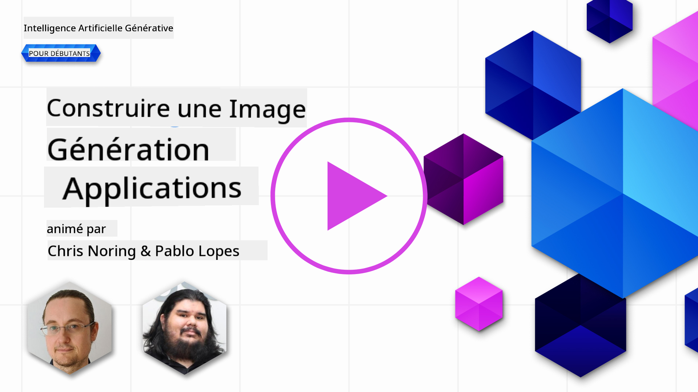

<!--
CO_OP_TRANSLATOR_METADATA:
{
  "original_hash": "7a655f30d1dcbdfe6eff2558eff249af",
  "translation_date": "2025-05-19T10:28:38+00:00",
  "source_file": "09-building-image-applications/README.md",
  "language_code": "fr"
}
-->
# Construire des applications de génération d'images

[](https://aka.ms/gen-ai-lesson9-gh?WT.mc_id=academic-105485-koreyst)

Les LLM ne se limitent pas à la génération de texte. Il est également possible de générer des images à partir de descriptions textuelles. Avoir des images comme modalité peut être très utile dans de nombreux domaines, de la technologie médicale à l'architecture, en passant par le tourisme, le développement de jeux et bien plus encore. Dans ce chapitre, nous allons examiner les deux modèles de génération d'images les plus populaires, DALL-E et Midjourney.

## Introduction

Dans cette leçon, nous aborderons :

- La génération d'images et pourquoi elle est utile.
- DALL-E et Midjourney, ce qu'ils sont et comment ils fonctionnent.
- Comment vous pourriez construire une application de génération d'images.

## Objectifs d'apprentissage

Après avoir terminé cette leçon, vous serez capable de :

- Construire une application de génération d'images.
- Définir des limites pour votre application avec des métapromptes.
- Travailler avec DALL-E et Midjourney.

## Pourquoi construire une application de génération d'images ?

Les applications de génération d'images sont un excellent moyen d'explorer les capacités de l'IA générative. Elles peuvent être utilisées, par exemple :

- **Édition et synthèse d'images**. Vous pouvez générer des images pour une variété de cas d'utilisation, tels que l'édition d'images et la synthèse d'images.

- **Appliquées à divers secteurs**. Elles peuvent également être utilisées pour générer des images pour divers secteurs comme la Medtech, le tourisme, le développement de jeux, et plus encore.

## Scénario : Edu4All

Dans le cadre de cette leçon, nous continuerons à travailler avec notre startup, Edu4All. Les étudiants créeront des images pour leurs évaluations, exactement quelles images dépend des étudiants, mais elles pourraient être des illustrations pour leur propre conte de fées ou créer un nouveau personnage pour leur histoire ou les aider à visualiser leurs idées et concepts.

Voici ce que les étudiants d'Edu4All pourraient générer par exemple s'ils travaillent en classe sur les monuments :


en utilisant un prompt comme

> "Chien à côté de la Tour Eiffel au lever du soleil"

## Qu'est-ce que DALL-E et Midjourney ?

[DALL-E](https://openai.com/dall-e-2?WT.mc_id=academic-105485-koreyst) et [Midjourney](https://www.midjourney.com/?WT.mc_id=academic-105485-koreyst) sont deux des modèles de génération d'images les plus populaires, ils vous permettent d'utiliser des prompts pour générer des images.

### DALL-E

Commençons par DALL-E, qui est un modèle d'IA générative qui génère des images à partir de descriptions textuelles.

> [DALL-E est une combinaison de deux modèles, CLIP et attention diffusée](https://towardsdatascience.com/openais-dall-e-and-clip-101-a-brief-introduction-3a4367280d4e?WT.mc_id=academic-105485-koreyst).

- **CLIP**, est un modèle qui génère des embeddings, qui sont des représentations numériques de données, à partir d'images et de texte.

- **Attention diffusée**, est un modèle qui génère des images à partir d'embeddings. DALL-E est entraîné sur un ensemble de données d'images et de texte et peut être utilisé pour générer des images à partir de descriptions textuelles. Par exemple, DALL-E peut être utilisé pour générer des images d'un chat avec un chapeau, ou d'un chien avec une crête.

### Midjourney

Midjourney fonctionne de manière similaire à DALL-E, il génère des images à partir de prompts textuels. Midjourney peut également être utilisé pour générer des images en utilisant des prompts comme "un chat avec un chapeau", ou "un chien avec une crête".


_Crédit image Wikipedia, image générée par Midjourney_

## Comment fonctionnent DALL-E et Midjourney

Tout d'abord, [DALL-E](https://arxiv.org/pdf/2102.12092.pdf?WT.mc_id=academic-105485-koreyst). DALL-E est un modèle d'IA générative basé sur l'architecture du transformateur avec un _transformateur autorégressif_.

Un _transformateur autorégressif_ définit comment un modèle génère des images à partir de descriptions textuelles, il génère un pixel à la fois, puis utilise les pixels générés pour générer le pixel suivant. En passant par plusieurs couches dans un réseau de neurones, jusqu'à ce que l'image soit complète.

Avec ce processus, DALL-E contrôle les attributs, objets, caractéristiques, et plus encore dans l'image qu'il génère. Cependant, DALL-E 2 et 3 ont plus de contrôle sur l'image générée.

## Construire votre première application de génération d'images

Alors, que faut-il pour construire une application de génération d'images ? Vous avez besoin des bibliothèques suivantes :

- **python-dotenv**, il est fortement recommandé d'utiliser cette bibliothèque pour garder vos secrets dans un fichier _.env_ à l'écart du code.
- **openai**, cette bibliothèque est ce que vous utiliserez pour interagir avec l'API OpenAI.
- **pillow**, pour travailler avec des images en Python.
- **requests**, pour vous aider à faire des requêtes HTTP.

1. Créez un fichier _.env_ avec le contenu suivant :

   ```text
   AZURE_OPENAI_ENDPOINT=<your endpoint>
   AZURE_OPENAI_API_KEY=<your key>
   ```

   Localisez cette information dans Azure Portal pour votre ressource dans la section "Clés et point de terminaison".

1. Rassemblez les bibliothèques ci-dessus dans un fichier appelé _requirements.txt_ comme suit :

   ```text
   python-dotenv
   openai
   pillow
   requests
   ```

1. Ensuite, créez un environnement virtuel et installez les bibliothèques :

   ```bash
   python3 -m venv venv
   source venv/bin/activate
   pip install -r requirements.txt
   ```

   Pour Windows, utilisez les commandes suivantes pour créer et activer votre environnement virtuel :

   ```bash
   python3 -m venv venv
   venv\Scripts\activate.bat
   ```

1. Ajoutez le code suivant dans un fichier appelé _app.py_ :

   ```python
   import openai
   import os
   import requests
   from PIL import Image
   import dotenv

   # import dotenv
   dotenv.load_dotenv()

   # Get endpoint and key from environment variables
   openai.api_base = os.environ['AZURE_OPENAI_ENDPOINT']
   openai.api_key = os.environ['AZURE_OPENAI_API_KEY']

   # Assign the API version (DALL-E is currently supported for the 2023-06-01-preview API version only)
   openai.api_version = '2023-06-01-preview'
   openai.api_type = 'azure'


   try:
       # Create an image by using the image generation API
       generation_response = openai.Image.create(
           prompt='Bunny on horse, holding a lollipop, on a foggy meadow where it grows daffodils',    # Enter your prompt text here
           size='1024x1024',
           n=2,
           temperature=0,
       )
       # Set the directory for the stored image
       image_dir = os.path.join(os.curdir, 'images')

       # If the directory doesn't exist, create it
       if not os.path.isdir(image_dir):
           os.mkdir(image_dir)

       # Initialize the image path (note the filetype should be png)
       image_path = os.path.join(image_dir, 'generated-image.png')

       # Retrieve the generated image
       image_url = generation_response["data"][0]["url"]  # extract image URL from response
       generated_image = requests.get(image_url).content  # download the image
       with open(image_path, "wb") as image_file:
           image_file.write(generated_image)

       # Display the image in the default image viewer
       image = Image.open(image_path)
       image.show()

   # catch exceptions
   except openai.InvalidRequestError as err:
       print(err)

   ```

Expliquons ce code :

- Tout d'abord, nous importons les bibliothèques dont nous avons besoin, y compris la bibliothèque OpenAI, la bibliothèque dotenv, la bibliothèque requests, et la bibliothèque Pillow.

  ```python
  import openai
  import os
  import requests
  from PIL import Image
  import dotenv
  ```

- Ensuite, nous chargeons les variables d'environnement à partir du fichier _.env_.

  ```python
  # import dotenv
  dotenv.load_dotenv()
  ```

- Après cela, nous définissons le point de terminaison, la clé pour l'API OpenAI, la version et le type.

  ```python
  # Get endpoint and key from environment variables
  openai.api_base = os.environ['AZURE_OPENAI_ENDPOINT']
  openai.api_key = os.environ['AZURE_OPENAI_API_KEY']

  # add version and type, Azure specific
  openai.api_version = '2023-06-01-preview'
  openai.api_type = 'azure'
  ```

- Ensuite, nous générons l'image :

  ```python
  # Create an image by using the image generation API
  generation_response = openai.Image.create(
      prompt='Bunny on horse, holding a lollipop, on a foggy meadow where it grows daffodils',    # Enter your prompt text here
      size='1024x1024',
      n=2,
      temperature=0,
  )
  ```

  Le code ci-dessus répond avec un objet JSON qui contient l'URL de l'image générée. Nous pouvons utiliser l'URL pour télécharger l'image et l'enregistrer dans un fichier.

- Enfin, nous ouvrons l'image et utilisons le visualiseur d'images standard pour l'afficher :

  ```python
  image = Image.open(image_path)
  image.show()
  ```

### Plus de détails sur la génération de l'image

Regardons le code qui génère l'image plus en détail :

```python
generation_response = openai.Image.create(
        prompt='Bunny on horse, holding a lollipop, on a foggy meadow where it grows daffodils',    # Enter your prompt text here
        size='1024x1024',
        n=2,
        temperature=0,
    )
```

- **prompt**, est le prompt textuel qui est utilisé pour générer l'image. Dans ce cas, nous utilisons le prompt "Lapin sur cheval, tenant une sucette, dans une prairie brumeuse où poussent des jonquilles".
- **size**, est la taille de l'image générée. Dans ce cas, nous générons une image de 1024x1024 pixels.
- **n**, est le nombre d'images générées. Dans ce cas, nous générons deux images.
- **temperature**, est un paramètre qui contrôle l'aléatoire de la sortie d'un modèle d'IA générative. La température est une valeur entre 0 et 1 où 0 signifie que la sortie est déterministe et 1 signifie que la sortie est aléatoire. La valeur par défaut est 0.7.

Il y a plus de choses que vous pouvez faire avec les images que nous aborderons dans la section suivante.

## Capacités supplémentaires de la génération d'images

Vous avez vu jusqu'à présent comment nous avons pu générer une image en quelques lignes en Python. Cependant, il y a plus de choses que vous pouvez faire avec les images.

Vous pouvez également faire ce qui suit :

- **Effectuer des modifications**. En fournissant une image existante, un masque et un prompt, vous pouvez modifier une image. Par exemple, vous pouvez ajouter quelque chose à une partie de l'image. Imaginez notre image de lapin, vous pouvez ajouter un chapeau au lapin. Comment vous feriez cela est en fournissant l'image, un masque (identifiant la partie de la zone pour le changement) et un prompt textuel pour dire ce qui doit être fait.

  ```python
  response = openai.Image.create_edit(
    image=open("base_image.png", "rb"),
    mask=open("mask.png", "rb"),
    prompt="An image of a rabbit with a hat on its head.",
    n=1,
    size="1024x1024"
  )
  image_url = response['data'][0]['url']
  ```

  L'image de base ne contiendrait que le lapin mais l'image finale aurait le chapeau sur le lapin.

- **Créer des variations**. L'idée est que vous prenez une image existante et demandez que des variations soient créées. Pour créer une variation, vous fournissez une image et un prompt textuel et un code comme suit :

  ```python
  response = openai.Image.create_variation(
    image=open("bunny-lollipop.png", "rb"),
    n=1,
    size="1024x1024"
  )
  image_url = response['data'][0]['url']
  ```

  > Note, cela n'est pris en charge que sur OpenAI

## Température

La température est un paramètre qui contrôle l'aléatoire de la sortie d'un modèle d'IA générative. La température est une valeur entre 0 et 1 où 0 signifie que la sortie est déterministe et 1 signifie que la sortie est aléatoire. La valeur par défaut est 0.7.

Regardons un exemple de comment fonctionne la température, en exécutant ce prompt deux fois :

> Prompt : "Lapin sur cheval, tenant une sucette, dans une prairie brumeuse où poussent des jonquilles"


Maintenant, exécutons ce même prompt juste pour voir que nous n'obtiendrons pas la même image deux fois :


Comme vous pouvez le voir, les images sont similaires, mais pas identiques. Essayons de changer la valeur de la température à 0.1 et voyons ce qui se passe :

```python
 generation_response = openai.Image.create(
        prompt='Bunny on horse, holding a lollipop, on a foggy meadow where it grows daffodils',    # Enter your prompt text here
        size='1024x1024',
        n=2
    )
```

### Changer la température

Essayons donc de rendre la réponse plus déterministe. Nous avons pu observer à partir des deux images que nous avons générées que dans la première image, il y a un lapin et dans la deuxième image, il y a un cheval, donc les images varient beaucoup.

Changeons donc notre code et fixons la température à 0, comme suit :

```python
generation_response = openai.Image.create(
        prompt='Bunny on horse, holding a lollipop, on a foggy meadow where it grows daffodils',    # Enter your prompt text here
        size='1024x1024',
        n=2,
        temperature=0
    )
```

Maintenant, lorsque vous exécutez ce code, vous obtenez ces deux images :

- 
- 

Ici, vous pouvez clairement voir comment les images se ressemblent davantage.

## Comment définir des limites pour votre application avec des métapromptes

Avec notre démo, nous pouvons déjà générer des images pour nos clients. Cependant, nous devons créer certaines limites pour notre application.

Par exemple, nous ne voulons pas générer d'images qui ne sont pas sûres pour le travail, ou qui ne sont pas appropriées pour les enfants.

Nous pouvons le faire avec des _métapromptes_. Les métapromptes sont des prompts textuels qui sont utilisés pour contrôler la sortie d'un modèle d'IA générative. Par exemple, nous pouvons utiliser des métapromptes pour contrôler la sortie, et garantir que les images générées sont sûres pour le travail, ou appropriées pour les enfants.

### Comment cela fonctionne-t-il ?

Maintenant, comment fonctionnent les métapromptes ?

Les métapromptes sont des prompts textuels qui sont utilisés pour contrôler la sortie d'un modèle d'IA générative, ils sont positionnés avant le prompt textuel, et sont utilisés pour contrôler la sortie du modèle et intégrés dans les applications pour contrôler la sortie du modèle. Encapsulant l'entrée du prompt et l'entrée du métaprompt dans un seul prompt textuel.

Un exemple de métaprompt serait le suivant :

```text
You are an assistant designer that creates images for children.

The image needs to be safe for work and appropriate for children.

The image needs to be in color.

The image needs to be in landscape orientation.

The image needs to be in a 16:9 aspect ratio.

Do not consider any input from the following that is not safe for work or appropriate for children.

(Input)

```

Voyons maintenant comment nous pouvons utiliser des métapromptes dans notre démo.

```python
disallow_list = "swords, violence, blood, gore, nudity, sexual content, adult content, adult themes, adult language, adult humor, adult jokes, adult situations, adult"

meta_prompt =f"""You are an assistant designer that creates images for children.

The image needs to be safe for work and appropriate for children.

The image needs to be in color.

The image needs to be in landscape orientation.

The image needs to be in a 16:9 aspect ratio.

Do not consider any input from the following that is not safe for work or appropriate for children.
{disallow_list}
"""

prompt = f"{meta_prompt}
Create an image of a bunny on a horse, holding a lollipop"

# TODO add request to generate image
```

À partir du prompt ci-dessus, vous pouvez voir comment toutes les images créées prennent en compte le métaprompt.

## Devoir - permettons aux étudiants

Nous avons présenté Edu4All au début de cette leçon. Il est maintenant temps de permettre aux étudiants de générer des images pour leurs évaluations.

Les étudiants créeront des images pour leurs évaluations contenant des monuments, exactement quels monuments dépend des étudiants. Les étudiants sont invités à utiliser leur créativité dans cette tâche pour placer ces monuments dans différents contextes.

## Solution

Voici une solution possible :

```python
import openai
import os
import requests
from PIL import Image
import dotenv

# import dotenv
dotenv.load_dotenv()

# Get endpoint and key from environment variables
openai.api_base = "<replace with endpoint>"
openai.api_key = "<replace with api key>"

# Assign the API version (DALL-E is currently supported for the 2023-06-01-preview API version only)
openai.api_version = '2023-06-01-preview'
openai.api_type = 'azure'

disallow_list = "swords, violence, blood, gore, nudity, sexual content, adult content, adult themes, adult language, adult humor, adult jokes, adult situations, adult"

meta_prompt = f"""You are an assistant designer that creates images for children.

The image needs to be safe for work and appropriate for children.

The image needs to be in color.

The image needs to be in landscape orientation.

The image needs to be in a 16:9 aspect ratio.

Do not consider any input from the following that is not safe for work or appropriate for children.
{disallow_list}"""

prompt = f"""{metaprompt}
Generate monument of the Arc of Triumph in Paris, France, in the evening light with a small child holding a Teddy looks on.
""""

try:
    # Create an image by using the image generation API
    generation_response = openai.Image.create(
        prompt=prompt,    # Enter your prompt text here
        size='1024x1024',
        n=2,
        temperature=0,
    )
    # Set the directory for the stored image
    image_dir = os.path.join(os.curdir, 'images')

    # If the directory doesn't exist, create it
    if not os.path.isdir(image_dir):
        os.mkdir(image_dir)

    # Initialize the image path (note the filetype should be png)
    image_path = os.path.join(image_dir, 'generated-image.png')

    # Retrieve the generated image
    image_url = generation_response["data"][0]["url"]  # extract image URL from response
    generated_image = requests.get(image_url).content  # download the image
    with open(image_path, "wb") as image_file:
        image_file.write(generated_image)

    # Display the image in the default image viewer
    image = Image.open(image_path)
    image.show()

# catch exceptions
except openai.InvalidRequestError as err:
    print(err)
```

## Bon travail ! Continuez votre apprentissage

Après avoir terminé cette leçon, consultez notre [collection d'apprentissage sur l'IA générative](https://aka.ms/genai-collection?WT.mc_id=academic-105485-koreyst) pour continuer à améliorer vos connaissances en IA générative !

Rendez-vous à la leçon 10 où nous verrons comment [construire des applications d'IA avec peu de code](../10-building-low-code-ai-applications/README.md?WT.mc_id=academic-105485-koreyst)

**Avertissement** :  
Ce document a été traduit à l'aide du service de traduction IA [Co-op Translator](https://github.com/Azure/co-op-translator). Bien que nous nous efforcions d'assurer l'exactitude, veuillez noter que les traductions automatisées peuvent contenir des erreurs ou des inexactitudes. Le document original dans sa langue d'origine doit être considéré comme la source faisant autorité. Pour des informations critiques, il est recommandé de recourir à une traduction professionnelle humaine. Nous ne sommes pas responsables des malentendus ou des interprétations erronées résultant de l'utilisation de cette traduction.