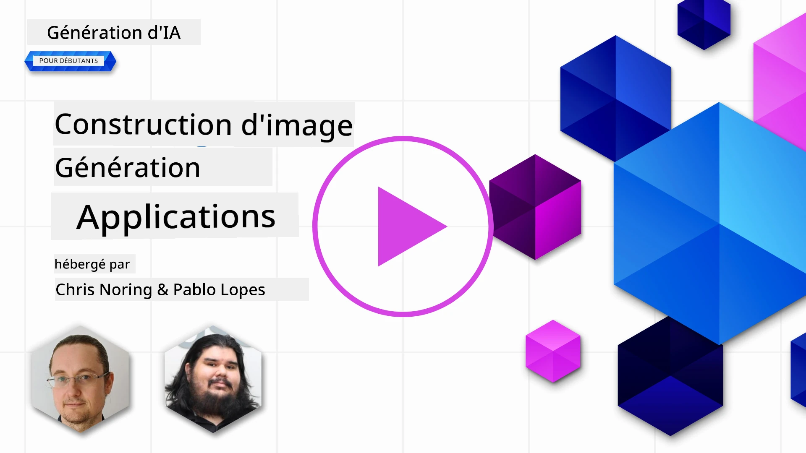

# Création d'applications de génération d'images

[](https://aka.ms/gen-ai-lesson9-gh?WT.mc_id=academic-105485-koreyst)

Les LLM ne se limitent pas à la génération de texte. Vous pouvez également générer des images à partir de descriptions textuelles. Les images en tant que modalité sont utiles dans divers secteurs comme la MedTech, l’architecture, le tourisme, le développement de jeux, le marketing, et plus encore. Dans cette leçon, nous examinons les modèles **GPT Image** actuels et construisons une application de génération d’images.

## Introduction

La génération d’images vous permet de transformer une invite en langage naturel en une image. Dans cette leçon, nous utilisons la famille de modèles **`gpt-image`** d’OpenAI - la génération actuelle de modèles d’images disponibles sur **[Microsoft Foundry](https://ai.azure.com?WT.mc_id=academic-105485-koreyst)** et la plateforme OpenAI. Ces modèles remplacent les anciens modèles DALL·E (DALL·E 2/3 sont considérés comme hérités).

Tout au long de la leçon, nous utilisons une startup fictive, **Edu4All**, qui crée des outils d’apprentissage. L’équipe souhaite générer des illustrations pour les devoirs et les supports d’étude.

## Objectifs d'apprentissage

À la fin de cette leçon, vous serez capable de :

- Expliquer ce qu’est la génération d’images et dans quels cas elle est utile.
- Comprendre la famille de modèles `gpt-image` et en quoi elle diffère des modèles DALL·E hérités.
- Construire une application de génération d’images en Python (et TypeScript / .NET).
- Modifier des images et appliquer des garde-fous grâce à des métaprompts.

## Qu’est-ce que la génération d’images ?

Les modèles de génération d’images créent des images à partir d’une invite textuelle. Les modèles modernes comme `gpt-image` sont basés sur des techniques de transformateurs + diffusion : le modèle apprend la relation entre texte et images pendant l’entraînement, puis, donné une invite, il "dénoyaute" itérativement un bruit aléatoire pour produire une image correspondant à la description.

Deux familles bien connues de modèles d’images sont :

- **`gpt-image` (OpenAI)** - la génération actuelle, utilisée dans cette leçon. Elle prend en charge la génération texte-vers-image et l’édition d’images (inpainting avec masque).
- **Midjourney** - un modèle tiers populaire avec son propre service et un workflow basé sur Discord.

> Les anciens modèles d’images OpenAI - **DALL·E 2** et **DALL·E 3** - sont hérités. DALL·E 3 n’est plus disponible pour de nouveaux déploiements, et des fonctionnalités comme `create_variation` existaient uniquement dans DALL·E 2. Utilisez les modèles `gpt-image` pour les nouvelles applications.

### Quel modèle `gpt-image` devrais-je utiliser ?

Sur Microsoft Foundry, les modèles suivants sont **Généralement disponibles** :

| Modèle | Notes |
| --- | --- |
| **`gpt-image-2`** | Le modèle d’image le plus récent et le plus performant - recommandé par défaut. |
| `gpt-image-1.5` | Généralement disponible ; bonne qualité à moindre coût. |
| `gpt-image-1-mini` | Généralement disponible ; le plus rapide / le moins coûteux. |
| `gpt-image-1` | Aperçu uniquement. |

Vérifiez toujours la liste actuelle des [modèles Foundry d’images](https://learn.microsoft.com/azure/ai-foundry/openai/concepts/models?WT.mc_id=academic-105485-koreyst) pour la disponibilité et les régions.

> **Important :** les modèles `gpt-image` renvoient l’image générée en **base64** (`b64_json`), pas sous forme d’URL. Votre code décode la chaîne base64 en octets et la sauvegarde - il n’y a pas d’URL d’image à télécharger.

## Configuration

Vous pouvez exécuter les exemples avec **Azure OpenAI dans Microsoft Foundry** (les exemples `aoai-*`) ou la **plateforme OpenAI** (les exemples `oai-*`).

### 1. Créez et déployez un modèle

Suivez le guide [créer une ressource](https://learn.microsoft.com/azure/ai-foundry/openai/how-to/create-resource?pivots=web-portal&WT.mc_id=academic-105485-koreyst) pour créer une ressource Microsoft Foundry, puis déployez un modèle d’image - **`gpt-image-2`** est recommandé.

### 2. Configurez votre fichier `.env`

```text
AZURE_OPENAI_ENDPOINT=<your endpoint>
AZURE_OPENAI_API_KEY=<your key>
AZURE_OPENAI_DEPLOYMENT="gpt-image-2"
```

Trouvez ces valeurs sur la page **Déploiements** de votre ressource dans le [portail Foundry](https://ai.azure.com?WT.mc_id=academic-105485-koreyst).

### 3. Installez les bibliothèques

Créez un fichier `requirements.txt` :

```text
python-dotenv
openai
pillow
```

Ensuite, créez et activez un environnement virtuel et installez :

```bash
python3 -m venv venv
source venv/bin/activate        # Windows : venv\Scripts\activate
pip install -r requirements.txt
```

## Construire l’application

Créez `app.py` avec le code suivant. Il génère une image et la sauvegarde en PNG.

```python
import os
import base64
from openai import AzureOpenAI
from PIL import Image
import dotenv

dotenv.load_dotenv()

# Pointez le client vers votre ressource Azure OpenAI (Microsoft Foundry).
# Les modèles d'images nécessitent une version récente de l'API - consultez la documentation de Foundry pour celle requise par votre modèle.
client = AzureOpenAI(
    api_key=os.environ["AZURE_OPENAI_API_KEY"],
    api_version="2025-04-01-preview",
    azure_endpoint=os.environ["AZURE_OPENAI_ENDPOINT"],
)

deployment = os.environ["AZURE_OPENAI_DEPLOYMENT"]  # par exemple "gpt-image-2"

result = client.images.generate(
    model=deployment,
    prompt='Bunny on a horse, holding a lollipop, on a foggy meadow where it grows daffodils',
    size="1024x1024",   # aussi 1536x1024 (paysage), 1024x1536 (portrait), ou "auto"
    n=1,
)

# les modèles gpt-image renvoient du base64 (b64_json), pas une URL - décodez-le en octets.
image_bytes = base64.b64decode(result.data[0].b64_json)

os.makedirs("images", exist_ok=True)
image_path = os.path.join("images", "generated-image.png")
with open(image_path, "wb") as f:
    f.write(image_bytes)

Image.open(image_path).show()
```

Exécutez-le avec `python app.py`. Vous obtiendrez un PNG sauvegardé dans `images/`.

> Chaque appel à `images.generate` produit une image différente pour la même invite - les modèles d’images ne prennent pas de paramètre `temperature` (ce contrôle est spécifique à la génération de texte). Pour obtenir de la diversité, appelez simplement l’API à nouveau ; pour réduire la diversité, rendez votre invite plus spécifique.

## Édition d’images

Les modèles `gpt-image` peuvent **modifier** une image existante : fournissez l’image, un **masque** optionnel (marquant la zone à modifier), et une invite décrivant le changement. Comme pour la génération, les modifications sont retournées en base64.

```python
result = client.images.edit(
    model=deployment,
    image=open("sunlit_lounge.png", "rb"),
    mask=open("mask.png", "rb"),
    prompt="A sunlit indoor lounge area with a pool containing a flamingo",
)
image_bytes = base64.b64decode(result.data[0].b64_json)
with open("images/edited-image.png", "wb") as f:
    f.write(image_bytes)
```

<div style="display: flex; justify-content: space-between; align-items: center; margin: 20px 0;">
  
  
  
</div>

## Fixer des limites avec des métaprompts

Une fois que vous pouvez générer des images, vous avez besoin de garde-fous pour que votre application ne produise pas de contenu dangereux ou non conforme à la marque. Un **métaprompt** est un texte que vous préfixez à l’invite utilisateur pour restreindre la sortie du modèle.

```python
disallow_list = "swords, violence, blood, gore, nudity, sexual content, adult content, adult themes, adult language"

meta_prompt = f"""You are an assistant designer that creates images for children.

The image needs to be safe for work and appropriate for children.
The image needs to be in color, in landscape orientation, and in a 16:9 aspect ratio.

Do not consider any input that is not safe for work or appropriate for children, including:
{disallow_list}
"""

prompt = f"{meta_prompt}\nCreate an image of a bunny on a horse, holding a lollipop"
# passer `prompt` à client.images.generate(...)
```

Chaque image est désormais générée dans les limites fixées par le métaprompt. Combinez cela avec les filtres de contenu intégrés dans Microsoft Foundry pour une défense en profondeur.

## Devoir - aidons les étudiants

Les étudiants d’Edu4All ont besoin d’images pour leurs évaluations. Construisez une application qui génère des images de **monuments** (les monuments choisis restent à votre discrétion) placés dans des contextes différents et créatifs - par exemple, un monument célèbre au coucher du soleil avec un enfant qui regarde.

Essayez par vous-même, puis comparez avec les solutions de référence :

- Python (Azure) : [aoai-solution.py](../../../09-building-image-applications/python/aoai-solution.py)
- Python (Azure) application complète de génération : [aoai-app.py](../../../09-building-image-applications/python/aoai-app.py)
- Python (OpenAI) : [oai-app.py](../../../09-building-image-applications/python/oai-app.py)
- TypeScript (Azure) : [typescript/image-generation-app](../../../09-building-image-applications/typescript/image-generation-app)
- .NET (Azure) : [dotnet/notebook-azure-openai.dib](../../../09-building-image-applications/dotnet/notebook-azure-openai.dib)

Travaillez aussi les notebooks dans [python/](../../../09-building-image-applications/python) (`aoai-assignment.ipynb` pour Azure, `oai-assignment.ipynb` pour OpenAI).

## Excellent travail ! Continuez votre apprentissage

Après avoir terminé cette leçon, consultez notre [collection d’apprentissage en IA générative](https://aka.ms/genai-collection?WT.mc_id=academic-105485-koreyst) pour continuer à approfondir vos connaissances en IA générative !

Rendez-vous à la leçon 10 pour continuer à apprendre.

---

<!-- CO-OP TRANSLATOR DISCLAIMER START -->
**Avertissement** :
Ce document a été traduit à l'aide du service de traduction automatique [Co-op Translator](https://github.com/Azure/co-op-translator). Bien que nous nous efforçions d'assurer l'exactitude, veuillez noter que les traductions automatisées peuvent contenir des erreurs ou des inexactitudes. Le document original dans sa langue native doit être considéré comme la source faisant autorité. Pour les informations critiques, il est recommandé de recourir à une traduction professionnelle réalisée par un humain. Nous ne saurions être tenus responsables des malentendus ou erreurs d'interprétation découlant de l'utilisation de cette traduction.
<!-- CO-OP TRANSLATOR DISCLAIMER END -->