<!--
CO_OP_TRANSLATOR_METADATA:
{
  "original_hash": "f5ff3b6204a695a117d6f452403c95f7",
  "translation_date": "2025-06-25T17:44:50+00:00",
  "source_file": "10-building-low-code-ai-applications/README.md",
  "language_code": "fr"
}
-->
# Construire des applications IA à faible code

[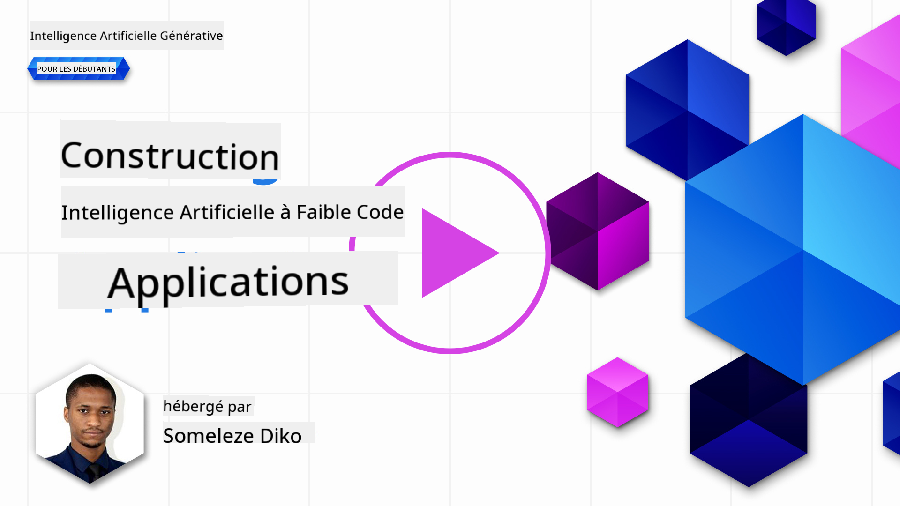](https://aka.ms/gen-ai-lesson10-gh?WT.mc_id=academic-105485-koreyst)

> _(Cliquez sur l'image ci-dessus pour voir la vidéo de cette leçon)_

## Introduction

Maintenant que nous avons appris à construire des applications de génération d'images, parlons du faible code. L'IA générative peut être utilisée dans divers domaines, y compris le faible code, mais qu'est-ce que le faible code et comment pouvons-nous y ajouter de l'IA ?

La construction d'applications et de solutions est devenue plus facile pour les développeurs traditionnels et les non-développeurs grâce à l'utilisation de plateformes de développement à faible code. Ces plateformes permettent de créer des applications et des solutions avec peu ou pas de code, en fournissant un environnement de développement visuel qui vous permet de glisser-déposer des composants pour construire des applications et des solutions. Cela vous permet de créer des applications et des solutions plus rapidement et avec moins de ressources. Dans cette leçon, nous approfondirons comment utiliser le faible code et comment améliorer le développement à faible code avec l'IA en utilisant Power Platform.

Power Platform offre aux organisations la possibilité de donner à leurs équipes les moyens de créer leurs propres solutions grâce à un environnement intuitif à faible code ou sans code. Cet environnement simplifie le processus de création de solutions. Avec Power Platform, les solutions peuvent être construites en jours ou en semaines au lieu de mois ou d'années. Power Platform se compose de cinq produits clés : Power Apps, Power Automate, Power BI, Power Pages et Copilot Studio.

Cette leçon couvre :

- Introduction à l'IA générative dans Power Platform
- Introduction à Copilot et comment l'utiliser
- Utilisation de l'IA générative pour créer des applications et des flux dans Power Platform
- Comprendre les modèles d'IA dans Power Platform avec AI Builder

## Objectifs d'apprentissage

À la fin de cette leçon, vous serez capable de :

- Comprendre comment fonctionne Copilot dans Power Platform.

- Construire une application de suivi des devoirs pour notre startup éducative.

- Construire un flux de traitement de factures qui utilise l'IA pour extraire des informations des factures.

- Appliquer les meilleures pratiques lors de l'utilisation du modèle d'IA GPT pour créer du texte.

Les outils et technologies que vous utiliserez dans cette leçon sont :

- **Power Apps**, pour l'application de suivi des devoirs, qui fournit un environnement de développement à faible code pour créer des applications afin de suivre, gérer et interagir avec les données.

- **Dataverse**, pour stocker les données de l'application de suivi des devoirs où Dataverse fournira une plateforme de données à faible code pour stocker les données de l'application.

- **Power Automate**, pour le flux de traitement de factures où vous aurez un environnement de développement à faible code pour créer des workflows pour automatiser le processus de traitement de factures.

- **AI Builder**, pour le modèle d'IA de traitement de factures où vous utiliserez des modèles d'IA préconstruits pour traiter les factures de notre startup.

## L'IA générative dans Power Platform

Améliorer le développement et l'application à faible code avec l'IA générative est un domaine clé pour Power Platform. L'objectif est de permettre à chacun de créer des applications, des sites, des tableaux de bord et d'automatiser des processus avec l'IA, _sans nécessiter d'expertise en science des données_. Cet objectif est atteint en intégrant l'IA générative dans l'expérience de développement à faible code dans Power Platform sous forme de Copilot et AI Builder.

### Comment cela fonctionne-t-il ?

Copilot est un assistant IA qui vous permet de créer des solutions Power Platform en décrivant vos besoins dans une série d'étapes conversationnelles utilisant le langage naturel. Vous pouvez par exemple demander à votre assistant IA de préciser quels champs votre application utilisera, et il créera à la fois l'application et le modèle de données sous-jacent, ou vous pourriez spécifier comment configurer un flux dans Power Automate.

Vous pouvez utiliser les fonctionnalités pilotées par Copilot comme une caractéristique dans vos écrans d'application pour permettre aux utilisateurs de découvrir des insights à travers des interactions conversationnelles.

AI Builder est une capacité d'IA à faible code disponible dans Power Platform qui vous permet d'utiliser des modèles d'IA pour vous aider à automatiser des processus et prédire des résultats. Avec AI Builder, vous pouvez intégrer l'IA dans vos applications et flux qui se connectent à vos données dans Dataverse ou dans diverses sources de données cloud, telles que SharePoint, OneDrive ou Azure.

Copilot est disponible dans tous les produits Power Platform : Power Apps, Power Automate, Power BI, Power Pages et Power Virtual Agents. AI Builder est disponible dans Power Apps et Power Automate. Dans cette leçon, nous nous concentrerons sur l'utilisation de Copilot et AI Builder dans Power Apps et Power Automate pour créer une solution pour notre startup éducative.

### Copilot dans Power Apps

Dans le cadre de Power Platform, Power Apps fournit un environnement de développement à faible code pour créer des applications afin de suivre, gérer et interagir avec les données. C'est une suite de services de développement d'applications avec une plateforme de données évolutive et la capacité de se connecter à des services cloud et à des données sur site. Power Apps vous permet de créer des applications qui s'exécutent sur des navigateurs, des tablettes et des téléphones, et peuvent être partagées avec des collègues. Power Apps facilite le développement d'applications avec une interface simple, de sorte que chaque utilisateur professionnel ou développeur professionnel peut créer des applications personnalisées. L'expérience de développement d'applications est également améliorée avec l'IA générative grâce à Copilot.

La fonctionnalité d'assistant IA Copilot dans Power Apps vous permet de décrire le type d'application dont vous avez besoin et les informations que vous souhaitez que votre application suive, collecte ou affiche. Copilot génère ensuite une application Canvas réactive basée sur votre description. Vous pouvez ensuite personnaliser l'application pour répondre à vos besoins. L'AI Copilot génère également et suggère une table Dataverse avec les champs nécessaires pour stocker les données que vous souhaitez suivre et quelques données d'exemple. Nous verrons ce qu'est Dataverse et comment vous pouvez l'utiliser dans Power Apps plus tard dans cette leçon. Vous pouvez ensuite personnaliser la table pour répondre à vos besoins en utilisant la fonctionnalité d'assistant AI Copilot à travers des étapes conversationnelles. Cette fonctionnalité est facilement accessible depuis l'écran d'accueil de Power Apps.

### Copilot dans Power Automate

Dans le cadre de Power Platform, Power Automate permet aux utilisateurs de créer des workflows automatisés entre applications et services. Il aide à automatiser des processus métier répétitifs tels que la communication, la collecte de données et les approbations de décisions. Son interface simple permet aux utilisateurs de toutes compétences techniques (des débutants aux développeurs chevronnés) d'automatiser des tâches de travail. L'expérience de développement de workflow est également améliorée avec l'IA générative grâce à Copilot.

La fonctionnalité d'assistant IA Copilot dans Power Automate vous permet de décrire le type de flux dont vous avez besoin et les actions que vous souhaitez que votre flux effectue. Copilot génère ensuite un flux basé sur votre description. Vous pouvez ensuite personnaliser le flux pour répondre à vos besoins. L'AI Copilot génère également et suggère les actions nécessaires pour effectuer la tâche que vous souhaitez automatiser. Nous verrons ce que sont les flux et comment vous pouvez les utiliser dans Power Automate plus tard dans cette leçon. Vous pouvez ensuite personnaliser les actions pour répondre à vos besoins en utilisant la fonctionnalité d'assistant AI Copilot à travers des étapes conversationnelles. Cette fonctionnalité est facilement accessible depuis l'écran d'accueil de Power Automate.

## Mission : Gérer les devoirs des étudiants et les factures pour notre startup, en utilisant Copilot

Notre startup propose des cours en ligne aux étudiants. La startup a connu une croissance rapide et a maintenant du mal à répondre à la demande pour ses cours. La startup vous a engagé en tant que développeur Power Platform pour les aider à créer une solution à faible code pour les aider à gérer leurs devoirs étudiants et leurs factures. Leur solution devrait pouvoir les aider à suivre et à gérer les devoirs des étudiants à travers une application et à automatiser le processus de traitement des factures à travers un workflow. On vous a demandé d'utiliser l'IA générative pour développer la solution.

Lorsque vous commencez à utiliser Copilot, vous pouvez utiliser la [bibliothèque de prompts Copilot Power Platform](https://github.com/pnp/powerplatform-prompts?WT.mc_id=academic-109639-somelezediko) pour commencer avec les prompts. Cette bibliothèque contient une liste de prompts que vous pouvez utiliser pour créer des applications et des flux avec Copilot. Vous pouvez également utiliser les prompts de la bibliothèque pour avoir une idée de la façon de décrire vos besoins à Copilot.

### Construire une application de suivi des devoirs pour notre startup

Les éducateurs de notre startup ont du mal à suivre les devoirs des étudiants. Ils ont utilisé un tableur pour suivre les devoirs, mais cela est devenu difficile à gérer à mesure que le nombre d'étudiants a augmenté. Ils vous ont demandé de créer une application qui les aidera à suivre et à gérer les devoirs des étudiants. L'application devrait leur permettre d'ajouter de nouveaux devoirs, de voir les devoirs, de mettre à jour les devoirs et de supprimer les devoirs. L'application devrait également permettre aux éducateurs et aux étudiants de voir les devoirs qui ont été notés et ceux qui n'ont pas été notés.

Vous construirez l'application en utilisant Copilot dans Power Apps en suivant les étapes ci-dessous :

1. Accédez à l'écran d'accueil de [Power Apps](https://make.powerapps.com?WT.mc_id=academic-105485-koreyst).

1. Utilisez la zone de texte sur l'écran d'accueil pour décrire l'application que vous souhaitez créer. Par exemple, **_Je veux créer une application pour suivre et gérer les devoirs des étudiants_**. Cliquez sur le bouton **Envoyer** pour envoyer le prompt à l'AI Copilot.

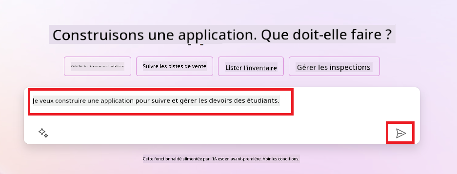

1. L'AI Copilot suggérera une table Dataverse avec les champs nécessaires pour stocker les données que vous souhaitez suivre et quelques données d'exemple. Vous pouvez ensuite personnaliser la table pour répondre à vos besoins en utilisant la fonctionnalité d'assistant AI Copilot à travers des étapes conversationnelles.

   > **Important** : Dataverse est la plateforme de données sous-jacente pour Power Platform. C'est une plateforme de données à faible code pour stocker les données de l'application. C'est un service entièrement géré qui stocke les données de manière sécurisée dans le cloud Microsoft et est provisionné dans votre environnement Power Platform. Il est doté de capacités de gouvernance des données intégrées, telles que la classification des données, la traçabilité des données, le contrôle d'accès granulaire, et plus encore. Vous pouvez en savoir plus sur Dataverse [ici](https://docs.microsoft.com/powerapps/maker/data-platform/data-platform-intro?WT.mc_id=academic-109639-somelezediko).

   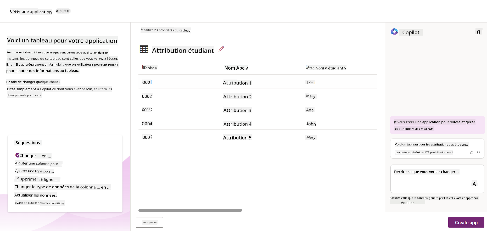

1. Les éducateurs veulent envoyer des emails aux étudiants qui ont soumis leurs devoirs pour les tenir informés de l'avancement de leurs devoirs. Vous pouvez utiliser Copilot pour ajouter un nouveau champ à la table pour stocker l'email de l'étudiant. Par exemple, vous pouvez utiliser le prompt suivant pour ajouter un nouveau champ à la table : **_Je veux ajouter une colonne pour stocker l'email de l'étudiant_**. Cliquez sur le bouton **Envoyer** pour envoyer le prompt à l'AI Copilot.

1. L'AI Copilot générera un nouveau champ et vous pourrez ensuite personnaliser le champ pour répondre à vos besoins.

1. Une fois que vous avez terminé avec la table, cliquez sur le bouton **Créer une application** pour créer l'application.

1. L'AI Copilot générera une application Canvas réactive basée sur votre description. Vous pouvez ensuite personnaliser l'application pour répondre à vos besoins.

1. Pour que les éducateurs puissent envoyer des emails aux étudiants, vous pouvez utiliser Copilot pour ajouter un nouvel écran à l'application. Par exemple, vous pouvez utiliser le prompt suivant pour ajouter un nouvel écran à l'application : **_Je veux ajouter un écran pour envoyer des emails aux étudiants_**. Cliquez sur le bouton **Envoyer** pour envoyer le prompt à l'AI Copilot.

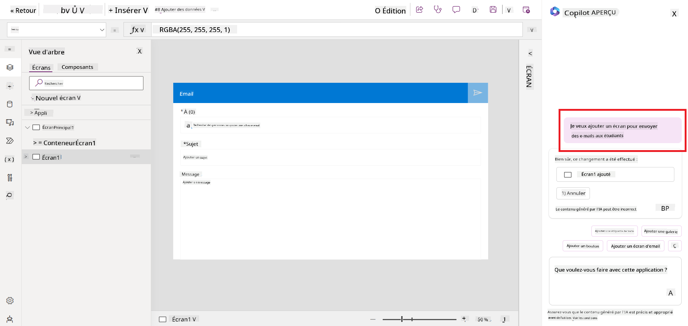

1. L'AI Copilot générera un nouvel écran et vous pourrez ensuite personnaliser l'écran pour répondre à vos besoins.

1. Une fois que vous avez terminé avec l'application, cliquez sur le bouton **Enregistrer** pour enregistrer l'application.

1. Pour partager l'application avec les éducateurs, cliquez sur le bouton **Partager** puis cliquez à nouveau sur le bouton **Partager**. Vous pouvez ensuite partager l'application avec les éducateurs en saisissant leurs adresses email.

> **Votre devoir** : L'application que vous venez de créer est un bon début mais peut être améliorée. Avec la fonctionnalité d'email, les éducateurs ne peuvent envoyer des emails aux étudiants que manuellement en devant saisir leurs emails. Pouvez-vous utiliser Copilot pour créer une automatisation qui permettra aux éducateurs d'envoyer des emails aux étudiants automatiquement lorsqu'ils soumettent leurs devoirs ? Votre indice est qu'avec le bon prompt, vous pouvez utiliser Copilot dans Power Automate pour le faire.

### Construire une table d'informations sur les factures pour notre startup

L'équipe financière de notre startup a du mal à suivre les factures. Ils ont utilisé un tableur pour suivre les factures, mais cela est devenu difficile à gérer à mesure que le nombre de factures a augmenté. Ils vous ont demandé de créer une table qui les aidera à stocker, suivre et gérer les informations des factures qu'ils reçoivent. La table devrait être utilisée pour créer une automatisation qui extraira toutes les informations des factures et les stockera dans la table. La table devrait également permettre à l'équipe financière de voir les factures qui ont été payées et celles qui ne l'ont pas été.

Power Platform dispose d'une plateforme de données sous-jacente appelée Dataverse qui vous permet de stocker les données de vos applications et solutions. Dataverse fournit une plateforme de données à faible code pour stocker les données de l'application. C'est un service entièrement géré qui stocke les données de manière sécurisée dans le cloud Microsoft et est provisionné dans votre environnement Power Platform. Il est doté de capacités de gouvernance des données intégrées, telles que la classification des données, la traçabilité des données, le contrôle d'accès granulaire, et plus encore. Vous pouvez en savoir plus [sur Dataverse ici](https://docs.microsoft.com/powerapps/maker/data-platform/data-platform-intro?WT.mc_id=academic-109639-somelezediko).

Pourquoi devrions-nous utiliser Dataverse pour notre startup ? Les tables standard et personnalisées au sein de Dataverse offrent une option de stockage sécurisée et basée sur le cloud pour vos données. Les tables vous permettent de stocker différents types de données, similaires à la façon dont vous pourriez utiliser plusieurs feuilles de calcul dans un seul classeur Excel. Vous pouvez utiliser des tables pour stocker des données spécifiques à votre organisation ou à vos besoins commerciaux. Certains des avantages que notre startup obtiendra en utilisant Dataverse incluent mais ne sont pas limités à :

- **Facile à gérer** : Les métadonnées et les données sont stockées dans le cloud, vous n'avez donc pas à vous soucier des détails de leur stockage ou de leur gestion. Vous pouvez vous concentrer sur la création de vos applications et solutions.

- **Sécurisé** : Dataverse offre une option de stockage sécurisée et basée sur le cloud pour vos données. Vous pouvez contrôler qui a accès aux données de vos tables et comment ils peuvent y accéder en utilisant la sécurité basée sur les rôles.

- **Richesse des métadonnées** : Les types de données et les relations sont utilisés directement dans Power Apps.

- **Logique et validation** : Vous pouvez utiliser des règles métier, des champs calculés et des règles de validation pour appliquer la logique métier et maintenir l'exactitude des données.

Maintenant que vous savez ce qu'est Dataverse et pourquoi vous devriez l'utiliser, voyons comment vous pouvez utiliser Copilot pour créer une table dans Dataverse pour répondre aux besoins de notre équipe financière.

> **Note** : Vous utiliserez cette table dans la section suivante pour créer une automatisation qui extraira toutes les informations des factures et les stockera dans la table.
Pour créer une table dans Dataverse en utilisant Copilot, suivez les étapes ci-dessous : 1. Accédez à l'écran d'accueil de [Power Apps](https://make.powerapps.com?WT.mc_id=academic-105485-koreyst). 2. Dans la barre de navigation à gauche, sélectionnez **Tables** puis cliquez sur **Décrire la nouvelle table**. 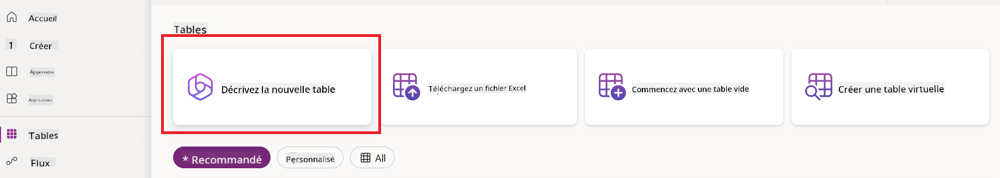 1. Sur l'écran **Décrire la nouvelle table**, utilisez la zone de texte pour décrire la table que vous souhaitez créer. Par exemple, **_Je veux créer une table pour stocker les informations des factures_**. Cliquez sur le bouton **Envoyer** pour envoyer le prompt à l'AI Copilot. 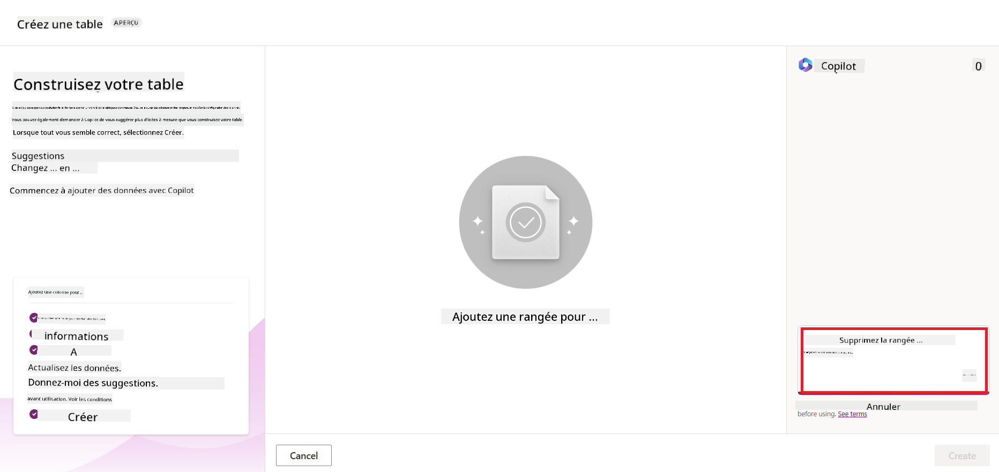 1. L'AI Copilot suggérera une table Dataverse avec les champs nécessaires pour stocker les données que vous souhaitez suivre et quelques données d'exemple. Vous pouvez ensuite personnaliser la table pour répondre à vos besoins en utilisant la fonctionnalité d'assistant AI Copilot à travers des étapes conversationnelles. 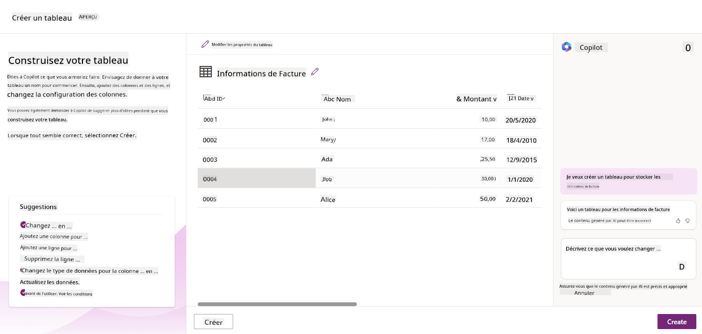 1. L'équipe financière souhaite envoyer un email au fournisseur pour les tenir informés de l'état actuel de leur facture. Vous pouvez utiliser Copilot pour ajouter un nouveau champ à la table pour stocker l'email du fournisseur. Par exemple, vous pouvez utiliser le prompt suivant pour ajouter un nouveau champ à la table : **_Je veux ajouter une colonne pour stocker l'email du fournisseur_**. Cliquez sur le bouton **Envoyer** pour envoyer le prompt à l'AI Copilot. 
un texte. - **Analyse de Sentiments** : Ce modèle détecte les sentiments positifs, négatifs, neutres ou mixtes dans le texte. - **Lecteur de Cartes de Visite** : Ce modèle extrait des informations à partir de cartes de visite. - **Reconnaissance de Texte** : Ce modèle extrait le texte des images. - **Détection d'Objets** : Ce modèle détecte et extrait des objets à partir d'images. - **Traitement de Documents** : Ce modèle extrait des informations à partir de formulaires. - **Traitement de Factures** : Ce modèle extrait des informations à partir de factures. Avec les Modèles IA Personnalisés, vous pouvez intégrer votre propre modèle dans AI Builder afin qu'il fonctionne comme n'importe quel modèle personnalisé AI Builder, vous permettant d'entraîner le modèle avec vos propres données. Vous pouvez utiliser ces modèles pour automatiser des processus et prédire des résultats dans Power Apps et Power Automate. Lorsque vous utilisez votre propre modèle, certaines limitations s'appliquent. Lisez-en plus sur ces [limitations](https://learn.microsoft.com/ai-builder/byo-model#limitations?WT.mc_id=academic-105485-koreyst). 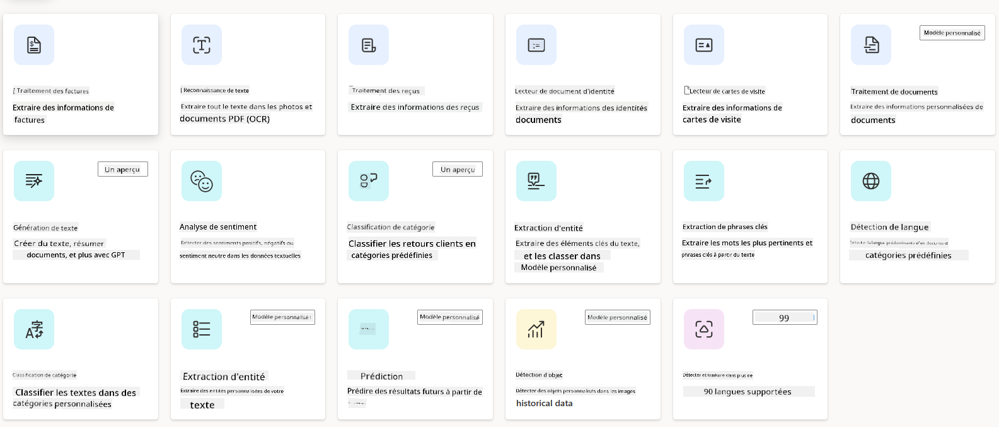

## Tâche #2 - Construire un Flux de Traitement de Factures pour Notre Startup

L'équipe financière a du mal à traiter les factures. Ils utilisaient une feuille de calcul pour suivre les factures, mais cela est devenu difficile à gérer à mesure que le nombre de factures a augmenté. Ils vous ont demandé de créer un flux de travail qui les aidera à traiter les factures en utilisant l'IA. Le flux de travail devrait leur permettre d'extraire des informations des factures et de stocker ces informations dans une table Dataverse. Le flux de travail devrait également leur permettre d'envoyer un e-mail à l'équipe financière avec les informations extraites.

Maintenant que vous savez ce qu'est AI Builder et pourquoi vous devriez l'utiliser, voyons comment vous pouvez utiliser le Modèle de Traitement de Factures d'AI Builder, que nous avons couvert plus tôt, pour construire un flux de travail qui aidera l'équipe financière à traiter les factures.

Pour construire un flux de travail qui aidera l'équipe financière à traiter les factures en utilisant le Modèle de Traitement de Factures dans AI Builder, suivez les étapes ci-dessous :

1. Accédez à l'écran d'accueil de [Power Automate](https://make.powerautomate.com?WT.mc_id=academic-105485-koreyst).
2. Utilisez la zone de texte sur l'écran d'accueil pour décrire le flux de travail que vous souhaitez créer. Par exemple, **_Traiter une facture lorsqu'elle arrive dans ma boîte de réception_**. Cliquez sur le bouton **Envoyer** pour envoyer l'invite à l'AI Copilot. 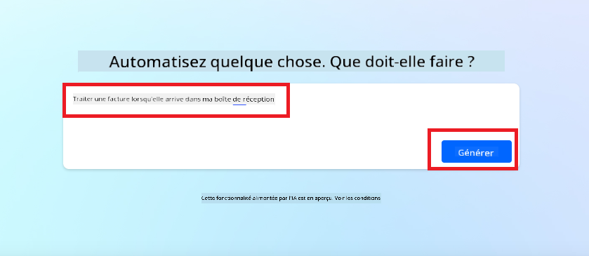
3. L'AI Copilot suggérera les actions nécessaires pour effectuer la tâche que vous souhaitez automatiser. Vous pouvez cliquer sur le bouton **Suivant** pour passer aux étapes suivantes.
4. À l'étape suivante, Power Automate vous demandera de configurer les connexions requises pour le flux. Une fois que vous avez terminé, cliquez sur le bouton **Créer un flux** pour créer le flux.
5. L'AI Copilot générera un flux et vous pourrez ensuite personnaliser le flux pour répondre à vos besoins.
6. Mettez à jour le déclencheur du flux et définissez le **Dossier** sur le dossier où les factures seront stockées. Par exemple, vous pouvez définir le dossier sur **Boîte de réception**. Cliquez sur **Afficher les options avancées** et réglez le **Uniquement avec Pièces Jointes** sur **Oui**. Cela garantira que le flux ne s'exécute que lorsqu'un e-mail avec une pièce jointe est reçu dans le dossier.
7. Supprimez les actions suivantes du flux : **HTML en texte**, **Composer**, **Composer 2**, **Composer 3** et **Composer 4** car vous ne les utiliserez pas.
8. Supprimez l'action **Condition** du flux car vous ne l'utiliserez pas. Cela devrait ressembler à la capture d'écran suivante : 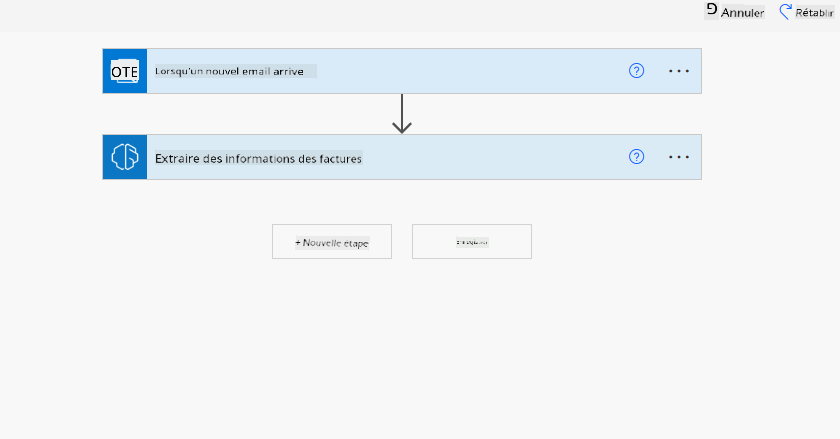
9. Cliquez sur le bouton **Ajouter une action** et recherchez **Dataverse**. Sélectionnez l'action **Ajouter une nouvelle ligne**.
10. Sur l'action **Extraire les Informations des factures**, mettez à jour le **Fichier de Facture** pour pointer vers le **Contenu de la Pièce Jointe** de l'e-mail. Cela garantira que le flux extrait des informations de la pièce jointe de la facture.
11. Sélectionnez la **Table** que vous avez créée plus tôt. Par exemple, vous pouvez sélectionner la table **Informations de Facture**. Choisissez le contenu dynamique de l'action précédente pour remplir les champs suivants :
   - ID
   - Montant
   - Date
   - Nom
   - Statut
   - Définissez le **Statut** sur **En attente**.
   - E-mail du Fournisseur
   - Utilisez le contenu dynamique **De** du déclencheur **Lorsqu'un nouvel e-mail arrive**. 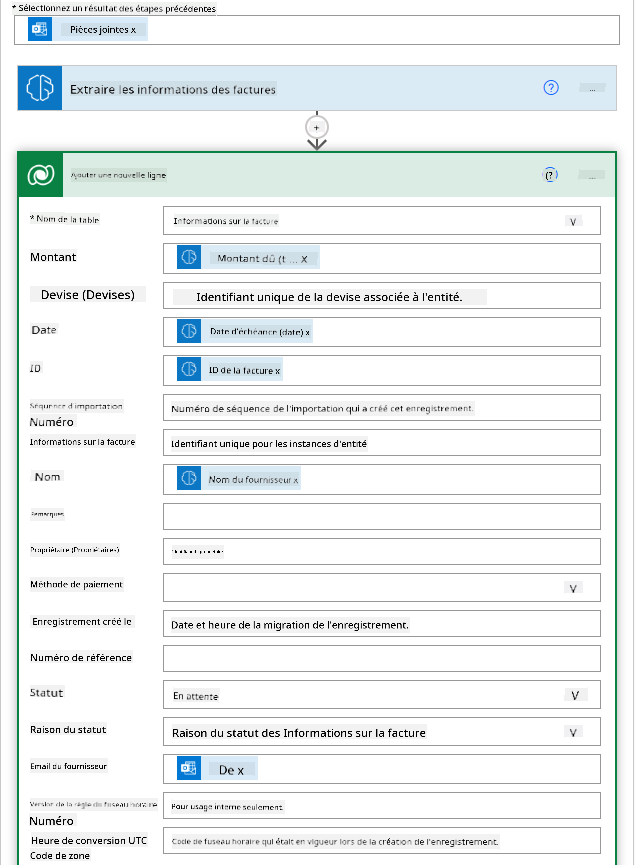
12. Une fois que vous avez terminé avec le flux, cliquez sur le bouton **Enregistrer** pour enregistrer le flux. Vous pouvez ensuite tester le flux en envoyant un e-mail avec une facture au dossier que vous avez spécifié dans le déclencheur.

> **Votre devoir** : Le flux que vous venez de créer est un bon début, maintenant vous devez réfléchir à comment vous pouvez construire une automatisation qui permettra à notre équipe financière d'envoyer un e-mail au fournisseur pour les informer de l'état actuel de leur facture. Votre indice : le flux doit s'exécuter lorsque le statut de la facture change.

## Utiliser un Modèle d'IA de Génération de Texte dans Power Automate

Le modèle Créer du Texte avec GPT dans AI Builder vous permet de générer du texte basé sur une invite et est alimenté par le Microsoft Azure OpenAI Service. Avec cette capacité, vous pouvez intégrer la technologie GPT (Generative Pre-Trained Transformer) dans vos applications et flux pour construire une variété de flux automatisés et d'applications perspicaces.

Les modèles GPT subissent un entraînement intensif sur de vastes quantités de données, leur permettant de produire un texte qui ressemble de près au langage humain lorsqu'une invite leur est fournie. Lorsqu'ils sont intégrés à l'automatisation des flux de travail, les modèles d'IA comme GPT peuvent être exploités pour rationaliser et automatiser une large gamme de tâches.

Par exemple, vous pouvez créer des flux pour générer automatiquement du texte pour une variété de cas d'utilisation, tels que : brouillons d'e-mails, descriptions de produits, et plus encore. Vous pouvez également utiliser le modèle pour générer du texte pour diverses applications, telles que les chatbots et les applications de service client qui permettent aux agents de service client de répondre efficacement et rapidement aux demandes des clients.

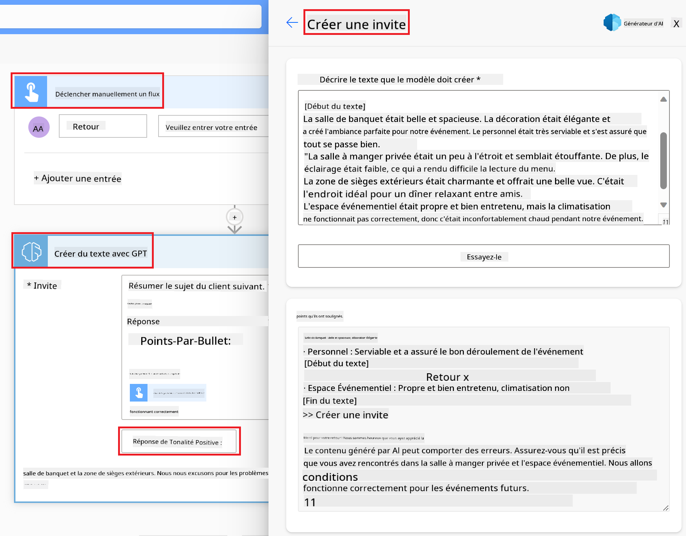

Pour apprendre à utiliser ce modèle d'IA dans Power Automate, parcourez le module [Ajouter de l'intelligence avec AI Builder et GPT](https://learn.microsoft.com/training/modules/ai-builder-text-generation/?WT.mc_id=academic-109639-somelezediko).

## Bon Travail ! Continuez Votre Apprentissage

Après avoir terminé cette leçon, consultez notre [collection d'apprentissage sur l'IA Générative](https://aka.ms/genai-collection?WT.mc_id=academic-105485-koreyst) pour continuer à approfondir vos connaissances en IA Générative !

Rendez-vous à la leçon 11 où nous verrons comment [intégrer l'IA Générative avec les Appels de Fonction](../11-integrating-with-function-calling/README.md?WT.mc_id=academic-105485-koreyst) !

**Avertissement** :  
Ce document a été traduit à l'aide du service de traduction IA [Co-op Translator](https://github.com/Azure/co-op-translator). Bien que nous nous efforcions d'assurer l'exactitude, veuillez noter que les traductions automatisées peuvent contenir des erreurs ou des inexactitudes. Le document original dans sa langue d'origine doit être considéré comme la source faisant autorité. Pour des informations critiques, une traduction humaine professionnelle est recommandée. Nous ne sommes pas responsables des malentendus ou des interprétations erronées résultant de l'utilisation de cette traduction.