# Construire des applications IA Low Code

> _(Cliquez sur l'image ci-dessus pour visionner la vidéo de cette leçon)_

## Introduction

Maintenant que nous avons appris à construire des applications génératrices d'images, parlons du low code. L'IA générative peut être utilisée dans divers domaines, y compris le low code, mais qu'est-ce que le low code et comment y intégrer l'IA ?

Construire des applications et solutions est devenu plus facile pour les développeurs traditionnels et non développeurs grâce à l'utilisation des plateformes de développement Low Code. Ces plateformes permettent de construire des applications et solutions avec peu ou pas de code. Cela est réalisé en fournissant un environnement de développement visuel qui permet de glisser-déposer des composants pour créer des applications et solutions. Cela vous permet de construire des applications et solutions plus rapidement et avec moins de ressources. Dans cette leçon, nous plongeons en profondeur dans l'utilisation du Low Code et comment l'améliorer avec l'IA en utilisant Power Platform.

Power Platform offre aux organisations l'opportunité d'habiliter leurs équipes à créer leurs propres solutions via un environnement intuitif low-code ou no-code. Cet environnement aide à simplifier le processus de construction des solutions. Avec Power Platform, les solutions peuvent être créées en jours ou semaines au lieu de mois ou années. Power Platform est composé de cinq produits clés : Power Apps, Power Automate, Power BI, Power Pages et Copilot Studio.

Cette leçon couvre :

- Introduction à l'IA générative dans Power Platform
- Introduction à Copilot et comment l'utiliser
- Utiliser l'IA générative pour construire des applications et flux dans Power Platform
- Comprendre les modèles d'IA dans Power Platform avec AI Builder
- Construire des agents intelligents avec Microsoft Copilot Studio

## Objectifs d'apprentissage

À la fin de cette leçon, vous serez capable de :

- Comprendre comment fonctionne Copilot dans Power Platform.

- Construire une application de suivi des devoirs étudiants pour notre startup éducative.

- Construire un flux de traitement des factures utilisant l'IA pour extraire les informations des factures.

- Appliquer les meilleures pratiques lors de l'utilisation du modèle d'IA Create Text avec GPT.

- Comprendre ce qu'est Microsoft Copilot Studio et comment construire des agents intelligents avec.

Les outils et technologies que vous utiliserez dans cette leçon sont :

- **Power Apps**, pour l'application de suivi des devoirs étudiants, qui offre un environnement de développement low-code pour créer des applications permettant de suivre, gérer et interagir avec les données.

- **Dataverse**, pour stocker les données de l'application de suivi des devoirs étudiants, où Dataverse fournit une plateforme de données low-code pour stocker les données de l'application.

- **Power Automate**, pour le flux de traitement des factures où vous disposerez d’un environnement de développement low-code pour créer des flux de travail afin d'automatiser le processus de traitement des factures.

- **AI Builder**, pour le modèle d'IA de traitement des factures où vous utiliserez des modèles d'IA préconstruits pour traiter les factures de notre startup.

## IA générative dans Power Platform

Améliorer le développement low-code et les applications avec l'IA générative est un axe essentiel pour Power Platform. L'objectif est de permettre à tout le monde de construire des applications, sites, tableaux de bord alimentés par l'IA, et d'automatiser des processus avec l'IA, _sans nécessiter aucune expertise en science des données_. Cet objectif est atteint en intégrant l'IA générative dans l'expérience low-code de développement dans Power Platform sous forme de Copilot et AI Builder.

### Comment cela fonctionne-t-il ?

Copilot est un assistant IA qui vous permet de construire des solutions Power Platform en décrivant vos besoins à travers une série d'étapes conversationnelles en langage naturel. Par exemple, vous pouvez indiquer à votre assistant IA quels champs votre application utilisera et il créera aussi bien l'application que le modèle de données sous-jacent, ou bien spécifier comment configurer un flux dans Power Automate.

Vous pouvez utiliser les fonctionnalités pilotées par Copilot comme une fonctionnalité intégrée dans vos écrans d'applications pour permettre aux utilisateurs de découvrir des insights via des interactions conversationnelles.

AI Builder est une capacité low-code d'IA disponible dans Power Platform qui vous permet d'utiliser des modèles d'IA afin d'aider à automatiser des processus et prédire des résultats. Avec AI Builder, vous pouvez intégrer l'IA dans vos applications et flux qui se connectent à vos données dans Dataverse ou dans diverses sources de données cloud, telles que SharePoint, OneDrive ou Azure.

Copilot est disponible dans tous les produits Power Platform : Power Apps, Power Automate, Power BI, Power Pages et Copilot Studio (anciennement Power Virtual Agents). AI Builder est disponible dans Power Apps et Power Automate. Dans cette leçon, nous nous concentrerons sur l'utilisation de Copilot et AI Builder dans Power Apps et Power Automate pour bâtir une solution pour notre startup éducative.

### Copilot dans Power Apps

Dans Power Platform, Power Apps fournit un environnement de développement low-code pour construire des applications afin de suivre, gérer et interagir avec les données. C’est une suite de services de développement d’applications avec une plateforme de données évolutive et la capacité de se connecter à des services cloud et à des données sur site. Power Apps vous permet de créer des applications qui s'exécutent sur navigateurs, tablettes et téléphones, et peuvent être partagées avec des collègues. Power Apps facilite le développement pour les utilisateurs avec une interface simple, afin que tout utilisateur métier ou développeur professionnel puisse créer des applications personnalisées. L'expérience de développement est aussi améliorée avec l’IA générative via Copilot.

La fonctionnalité d’assistant IA Copilot dans Power Apps vous permet de décrire quel type d’application vous souhaitez et quelles informations votre application doit suivre, collecter ou afficher. Copilot génère alors une application Canvas responsive basée sur votre description. Vous pouvez ensuite personnaliser l’application selon vos besoins. L’assistant IA Copilot génère aussi et suggère une table Dataverse avec les champs nécessaires pour stocker les données à suivre ainsi que certaines données d'exemple. Nous verrons plus tard dans cette leçon ce qu’est Dataverse et comment l’utiliser dans Power Apps. Vous pouvez ensuite personnaliser la table selon vos besoins via l’assistant IA Copilot à travers des étapes conversationnelles. Cette fonctionnalité est facilement accessible depuis l'écran d'accueil de Power Apps.

### Copilot dans Power Automate

Dans Power Platform, Power Automate permet aux utilisateurs de créer des flux de travail automatisés entre applications et services. Il aide à automatiser les processus métier répétitifs tels que les communications, la collecte de données et l’approbation des décisions. Son interface simple permet aux utilisateurs de tous niveaux techniques (des débutants aux développeurs confirmés) d’automatiser des tâches de travail. L'expérience de développement des flux est également améliorée avec l’IA générative via Copilot.

La fonctionnalité d’assistant IA Copilot dans Power Automate vous permet de décrire quel type de flux vous souhaitez et quelles actions doit effectuer votre flux. Copilot génère alors un flux basé sur votre description. Vous pouvez ensuite personnaliser ce flux selon vos besoins. L’assistant IA Copilot génère aussi et suggère les actions nécessaires pour réaliser la tâche que vous souhaitez automatiser. Nous verrons plus tard dans cette leçon ce que sont les flux et comment les utiliser dans Power Automate. Vous pouvez ensuite personnaliser les actions conformément à vos besoins via l’assistant IA Copilot à travers des étapes conversationnelles. Cette fonctionnalité est facilement accessible depuis l'écran d'accueil de Power Automate.

## Construire des agents intelligents avec Microsoft Copilot Studio

[Microsoft Copilot Studio](https://learn.microsoft.com/microsoft-copilot-studio/fundamentals-what-is-copilot-studio?WT.mc_id=academic-105485-koreyst) (anciennement Power Virtual Agents) est le membre low-code de Power Platform pour construire des **agents IA** — des copilotes conversationnels qui peuvent répondre aux questions, effectuer des actions et automatiser des tâches au nom de vos utilisateurs. Comme pour le reste de Power Platform, vous construisez ces agents dans une expérience visuelle, axée sur le langage naturel : vous décrivez ce que vous voulez que l’agent fasse, et Copilot Studio aide à structurer ses instructions, connaissances et actions.

Pour notre startup éducative, vous pourriez construire un agent qui répond aux questions des étudiants sur les cours, vérifie les échéances des devoirs, voire envoie des emails à un instructeur — tout cela sans écrire de code.

Voici quelques-unes des dernières capacités qui rendent Copilot Studio puissant :

- **Réponses génératives à partir de vos connaissances**. Au lieu de rédiger chaque conversation manuellement, vous pouvez connecter **des sources de connaissances** — sites web publics, SharePoint, OneDrive, Dataverse, fichiers téléchargés ou données d'entreprise via des connecteurs — et l’agent génère des réponses fondées sur ces sources.

- **Orchestration générative**. Plutôt que de se fier à des phrases déclencheuses rigides, l’agent utilise l’IA pour comprendre une demande et décider dynamiquement quelles connaissances, sujets et actions combiner pour la satisfaire, y compris en enchaînant plusieurs étapes.

- **Actions et connecteurs**. Les agents peuvent *agir*, pas seulement discuter. Vous pouvez fournir à un agent des actions soutenues par plus de 1 500 connecteurs préconstruits Power Platform, des flux Power Automate, des API REST personnalisées, des prompts, ou des serveurs **Model Context Protocol (MCP)**.

- **Agents autonomes**. Les agents ne se limitent pas à répondre dans une fenêtre de chat. Vous pouvez construire des **agents autonomes** déclenchés par des événements — comme un nouvel email, un nouvel enregistrement dans Dataverse, ou un fichier téléchargé — qui agissent en arrière-plan pour accomplir une tâche.

- **Orchestration multi-agent**. Les agents peuvent appeler d’autres agents. Un agent Copilot Studio peut déléguer à, ou être étendu par, d’autres agents, y compris des agents publiés dans Microsoft 365 Copilot et des agents construits dans Microsoft Foundry.

- **Choix du modèle**. Au-delà des modèles intégrés, vous pouvez apporter des modèles du catalogue Microsoft Foundry pour personnaliser la manière dont votre agent raisonne et répond.

- **Publier partout**. Une fois construit, un agent peut être publié sur plusieurs canaux — Microsoft Teams, Microsoft 365 Copilot, un site web ou application personnalisée, et plus — avec la gestion de la sécurité, de l'authentification et des analyses via l’expérience d’administration Power Platform.

Vous pouvez commencer à construire votre premier agent sur [copilotstudio.microsoft.com](https://copilotstudio.microsoft.com?WT.mc_id=academic-105485-koreyst) et en apprendre plus dans la [documentation Microsoft Copilot Studio](https://learn.microsoft.com/microsoft-copilot-studio/?WT.mc_id=academic-105485-koreyst).

## Exercice : Gérer les devoirs étudiants et les factures pour notre startup, avec Copilot

Notre startup propose des cours en ligne aux étudiants. La startup a connu une croissance rapide et a maintenant du mal à suivre la demande pour ses cours. Elle vous a embauché en tant que développeur Power Platform pour l’aider à construire une solution low code afin de gérer les devoirs étudiants et les factures. Leur solution devrait permettre de suivre et gérer les devoirs étudiants via une application et d’automatiser le processus de traitement des factures via un flux de travail. Il vous est demandé d’utiliser l’IA générative pour développer la solution.

Lorsque vous commencez à utiliser Copilot, vous pouvez utiliser la [bibliothèque de prompts Power Platform Copilot](https://github.com/pnp/powerplatform-prompts?WT.mc_id=academic-109639-somelezediko) pour démarrer avec les prompts. Cette bibliothèque contient une liste de prompts que vous pouvez utiliser pour construire des applications et flux avec Copilot. Vous pouvez également utiliser les prompts de la bibliothèque pour avoir une idée de la manière de décrire vos besoins à Copilot.

### Construire une application de suivi des devoirs étudiants pour notre startup

Les éducateurs de notre startup ont eu du mal à suivre les devoirs étudiants. Ils utilisaient une feuille de calcul pour cela, mais c’est devenu difficile à gérer avec l’augmentation du nombre d’étudiants. Ils vous ont demandé de construire une application qui les aidera à suivre et gérer les devoirs étudiants. L’application doit leur permettre d’ajouter de nouveaux devoirs, de les consulter, de les mettre à jour et de les supprimer. L’application doit aussi permettre aux éducateurs et étudiants de voir les devoirs qui ont été notés, et ceux qui ne l’ont pas été.

Vous construirez l’application en utilisant Copilot dans Power Apps en suivant les étapes ci-dessous :

1. Accédez à l’écran d’accueil de [Power Apps](https://make.powerapps.com?WT.mc_id=academic-105485-koreyst).

1. Utilisez la zone de texte sur l’écran d’accueil pour décrire l’application que vous souhaitez construire. Par exemple, **_Je souhaite construire une application pour suivre et gérer les devoirs étudiants_**. Cliquez sur le bouton **Envoyer** pour transmettre le prompt à l’IA Copilot.

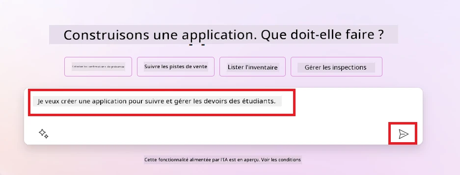

1. L’IA Copilot suggérera une table Dataverse avec les champs nécessaires pour stocker les données à suivre ainsi que certaines données d’exemple. Vous pouvez ensuite personnaliser la table selon vos besoins en utilisant la fonctionnalité d’assistance IA Copilot via des étapes conversationnelles.

   > **Important** : Dataverse est la plateforme de données sous-jacente pour Power Platform. C’est une plateforme de données low-code pour stocker les données de l’application. C’est un service entièrement géré qui stocke les données en toute sécurité dans le cloud Microsoft et est provisionné dans votre environnement Power Platform. Il est doté de fonctionnalités intégrées de gouvernance des données, telles que classification des données, traçabilité, contrôle d’accès granulaire, et plus encore. Vous pouvez en apprendre plus sur Dataverse [ici](https://learn.microsoft.com/power-apps/maker/data-platform/data-platform-intro?WT.mc_id=academic-109639-somelezediko).

   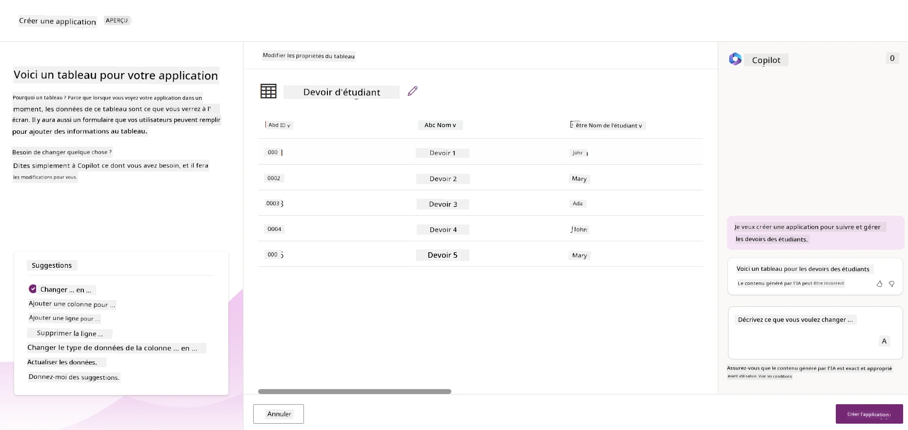

1. Les éducateurs souhaitent envoyer des emails aux étudiants ayant soumis leurs devoirs pour les tenir informés de l’avancement. Vous pouvez utiliser Copilot pour ajouter un nouveau champ à la table pour stocker l’email de l’étudiant. Par exemple, vous pouvez utiliser le prompt suivant pour ajouter un champ : **_Je souhaite ajouter une colonne pour stocker l’email étudiant_**. Cliquez sur le bouton **Envoyer** pour transmettre le prompt à l’IA Copilot.

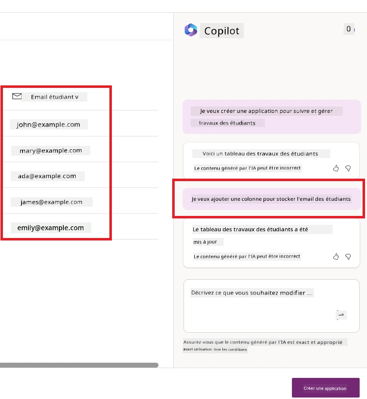

1. L’IA Copilot générera un nouveau champ et vous pourrez ensuite personnaliser ce champ selon vos besoins.

1. Une fois que vous avez terminé avec le tableau, cliquez sur le bouton **Créer l'application** pour créer l'application.

1. L'Assistant IA générera une application Canvas responsive basée sur votre description. Vous pouvez ensuite personnaliser l'application pour qu'elle réponde à vos besoins.

1. Pour que les enseignants envoient des e-mails aux étudiants, vous pouvez utiliser l'Assistant pour ajouter un nouvel écran à l'application. Par exemple, vous pouvez utiliser l'invite suivante pour ajouter un nouvel écran à l'application : **_Je veux ajouter un écran pour envoyer des e-mails aux étudiants_**. Cliquez sur le bouton **Envoyer** pour envoyer l'invite à l'Assistant IA.

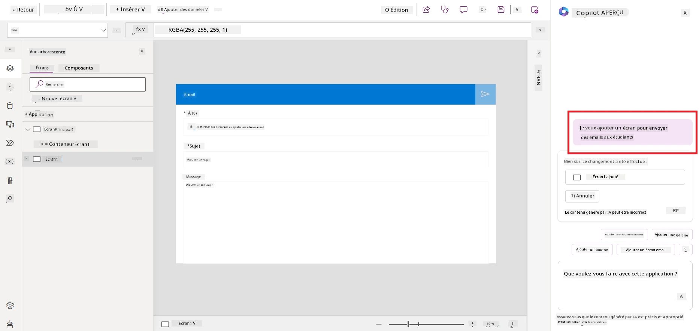

1. L'Assistant IA générera un nouvel écran et vous pourrez ensuite personnaliser cet écran selon vos besoins.

1. Une fois que vous avez terminé avec l'application, cliquez sur le bouton **Enregistrer** pour enregistrer l'application.

1. Pour partager l'application avec les enseignants, cliquez sur le bouton **Partager** puis cliquez à nouveau sur le bouton **Partager**. Vous pouvez ensuite partager l'application avec les enseignants en saisissant leurs adresses e-mail.

> **Votre devoir** : L'application que vous venez de créer est un bon début mais peut être améliorée. Avec la fonctionnalité d'e-mail, les enseignants ne peuvent envoyer des e-mails aux étudiants que manuellement en devant taper leurs adresses e-mails. Pouvez-vous utiliser l'Assistant pour construire une automatisation qui permettra aux enseignants d'envoyer automatiquement des e-mails aux étudiants lorsqu'ils soumettent leurs devoirs ? Votre indice est qu'avec la bonne invite vous pouvez utiliser l'Assistant dans Power Automate pour construire cela.

### Créez un tableau d’informations sur les factures pour notre startup

L'équipe financière de notre startup a eu des difficultés à suivre les factures. Ils utilisaient un tableur pour suivre les factures, mais cela est devenu difficile à gérer à mesure que le nombre de factures a augmenté. Ils vous ont demandé de créer un tableau qui les aidera à stocker, suivre et gérer les informations des factures reçues. Le tableau devra être utilisé pour construire une automatisation qui extraira toutes les informations des factures et les stockera dans le tableau. Le tableau devra également permettre à l'équipe financière de visualiser les factures qui ont été payées et celles qui ne l'ont pas été.

La Power Platform dispose d'une plateforme de données sous-jacente appelée Dataverse qui vous permet de stocker les données pour vos applications et solutions. Dataverse fournit une plateforme de données low-code pour stocker les données de l'application. C'est un service entièrement géré qui stocke les données en toute sécurité dans le Cloud Microsoft et est provisionné au sein de votre environnement Power Platform. Il est doté de fonctionnalités intégrées de gouvernance des données, telles que la classification des données, la traçabilité des données, un contrôle d’accès granulaire, et plus encore. Vous pouvez en apprendre plus [sur Dataverse ici](https://learn.microsoft.com/power-apps/maker/data-platform/data-platform-intro?WT.mc_id=academic-109639-somelezediko).

Pourquoi devrions-nous utiliser Dataverse pour notre startup ? Les tables standards et personnalisées dans Dataverse offrent une option de stockage sécurisée dans le cloud pour vos données. Les tables vous permettent de stocker différents types de données, semblable à comment vous utiliseriez plusieurs feuilles de calcul dans un seul classeur Excel. Vous pouvez utiliser les tables pour stocker des données spécifiques à votre organisation ou vos besoins métier. Certains des avantages que notre startup tirera de l’utilisation de Dataverse incluent, mais ne sont pas limités à :

- **Facile à gérer** : Les métadonnées et les données sont stockées dans le cloud, donc vous n’avez pas à vous soucier des détails de leur stockage ou gestion. Vous pouvez vous concentrer sur la construction de vos applications et solutions.

- **Sécurisé** : Dataverse offre une option de stockage sécurisée dans le cloud pour vos données. Vous pouvez contrôler qui a accès aux données dans vos tables et comment ils peuvent y accéder en utilisant la sécurité basée sur les rôles.

- **Métadonnées riches** : Les types de données et les relations sont utilisés directement dans Power Apps

- **Logique et validation** : Vous pouvez utiliser des règles métier, des champs calculés et des règles de validation pour appliquer la logique métier et maintenir la précision des données.

Maintenant que vous savez ce qu’est Dataverse et pourquoi vous devriez l’utiliser, regardons comment vous pouvez utiliser l’Assistant pour créer une table dans Dataverse répondant aux besoins de notre équipe financière.

> **Note** : Vous utiliserez ce tableau dans la section suivante pour créer une automatisation qui extraira toutes les informations des factures et les stockera dans le tableau.

Pour créer une table dans Dataverse avec l’Assistant, suivez les étapes ci-dessous :

1. Rendez-vous à l’écran d’accueil de [Power Apps](https://make.powerapps.com?WT.mc_id=academic-105485-koreyst).

2. Dans la barre de navigation à gauche, sélectionnez **Tables** puis cliquez sur **Décrire la nouvelle table**.

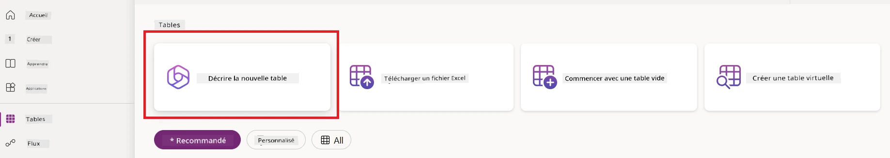

1. Sur l’écran **Décrire la nouvelle table**, utilisez la zone de texte pour décrire la table que vous souhaitez créer. Par exemple, **_Je veux créer une table pour stocker les informations des factures_**. Cliquez sur le bouton **Envoyer** pour transmettre l’invite à l’Assistant IA.

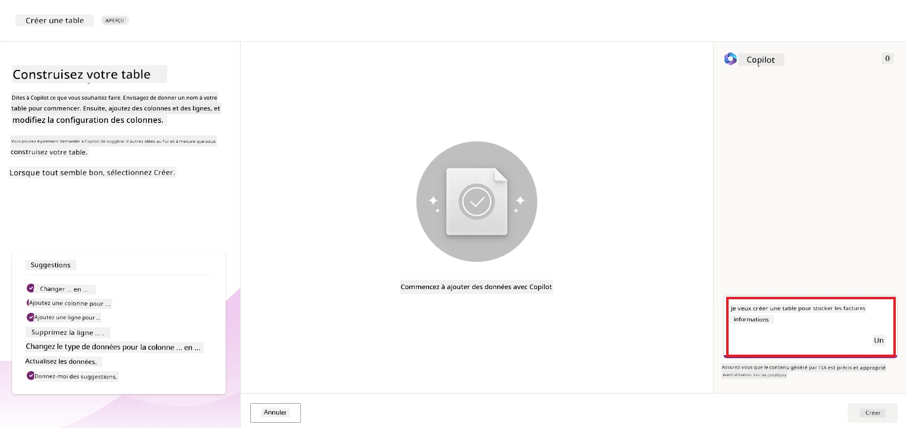

1. L’Assistant IA suggérera une table Dataverse avec les champs nécessaires pour stocker les données que vous voulez suivre ainsi que des données d’exemple. Vous pourrez ensuite personnaliser la table selon vos besoins en utilisant la fonction d’assistant de l’Assistant IA par étapes conversationnelles.

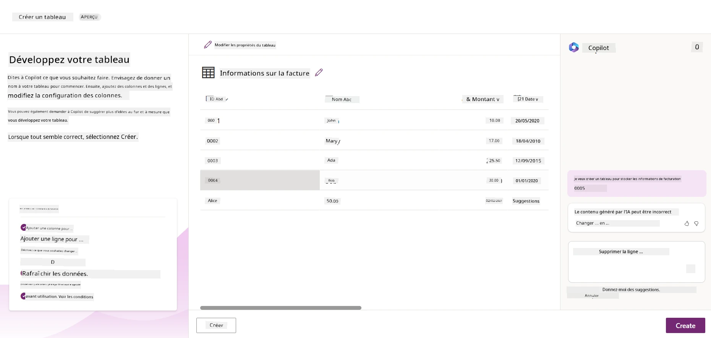

1. L’équipe financière souhaite envoyer un e-mail au fournisseur pour le tenir informé du statut actuel de leur facture. Vous pouvez utiliser l’Assistant pour ajouter un nouveau champ dans la table pour stocker l’email du fournisseur. Par exemple, vous pouvez utiliser l’invite suivante pour ajouter une nouvelle colonne à la table : **_Je veux ajouter une colonne pour stocker l’email du fournisseur_**. Cliquez sur le bouton **Envoyer** pour transmettre l’invite à l’Assistant IA.

1. L’Assistant IA générera un nouveau champ et vous pourrez ensuite personnaliser ce champ selon vos besoins.

1. Une fois que vous avez terminé avec le tableau, cliquez sur le bouton **Créer** pour créer la table.

## Modèles IA dans Power Platform avec AI Builder

AI Builder est une capacité IA low-code disponible dans Power Platform qui vous permet d’utiliser des modèles IA pour automatiser des processus et prédire des résultats. Avec AI Builder, vous pouvez intégrer l’IA dans vos applications et flux qui se connectent à vos données dans Dataverse ou dans diverses sources de données cloud, telles que SharePoint, OneDrive ou Azure.

## Modèles IA préconstruits vs Modèles IA personnalisés

AI Builder propose deux types de modèles IA : les modèles IA préconstruits et les modèles IA personnalisés. Les modèles IA préconstruits sont des modèles prêts à l’emploi formés par Microsoft et disponibles dans Power Platform. Ils vous aident à ajouter de l’intelligence à vos applications et flux sans avoir à collecter des données puis construire, entraîner et publier vos propres modèles. Vous pouvez utiliser ces modèles pour automatiser des processus et prédire des résultats.

Certains des modèles IA préconstruits disponibles dans Power Platform incluent :

- **Extraction de phrases clés** : Ce modèle extrait des phrases clés d’un texte.
- **Détection de la langue** : Ce modèle détecte la langue d’un texte.
- **Analyse de sentiment** : Ce modèle détecte si le sentiment dans un texte est positif, négatif, neutre ou mixte.
- **Lecteur de cartes de visite** : Ce modèle extrait les informations des cartes de visite.
- **Reconnaissance de texte** : Ce modèle extrait du texte à partir d’images.
- **Détection d’objets** : Ce modèle détecte et extrait des objets d’images.
- **Traitement de documents** : Ce modèle extrait des informations à partir de formulaires.
- **Traitement de factures** : Ce modèle extrait des informations à partir de factures.

Avec les modèles IA personnalisés, vous pouvez apporter votre propre modèle dans AI Builder afin qu’il puisse fonctionner comme n’importe quel modèle personnalisé AI Builder, vous permettant d’entraîner le modèle avec vos propres données. Vous pouvez utiliser ces modèles pour automatiser des processus et prédire des résultats dans Power Apps et Power Automate. Lorsque vous utilisez votre propre modèle, certaines limitations s’appliquent. En savoir plus sur ces [limitations](https://learn.microsoft.com/ai-builder/byo-model#limitations?WT.mc_id=academic-105485-koreyst).

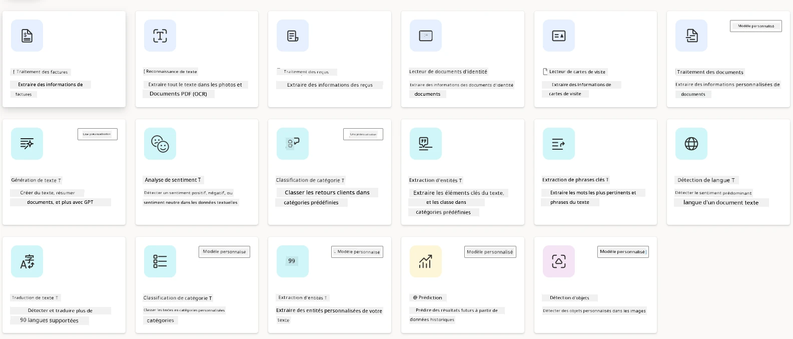

## Exercice #2 - Créez un flux de traitement de factures pour notre startup

L’équipe financière a eu des difficultés à traiter les factures. Ils utilisaient un tableur pour suivre les factures, mais cela est devenu difficile à gérer avec l’augmentation du nombre de factures. Ils vous ont demandé de construire un workflow qui les aidera à traiter les factures en utilisant l’IA. Le workflow doit leur permettre d’extraire les informations des factures et de stocker ces informations dans une table Dataverse. Le workflow doit également leur permettre d’envoyer un e-mail à l’équipe financière avec les informations extraites.

Maintenant que vous savez ce qu’est AI Builder et pourquoi vous devriez l’utiliser, voyons comment vous pouvez utiliser le modèle IA de traitement des factures dans AI Builder, que nous avons couvert précédemment, pour construire un workflow qui aidera l’équipe financière à traiter les factures.

Pour construire un workflow qui aidera l’équipe financière à traiter les factures en utilisant le modèle IA de traitement des factures dans AI Builder, suivez les étapes ci-dessous :

1. Rendez-vous à l’écran d’accueil de [Power Automate](https://make.powerautomate.com?WT.mc_id=academic-105485-koreyst).

2. Utilisez la zone de texte sur l’écran d’accueil pour décrire le workflow que vous voulez construire. Par exemple, **_Traiter une facture lorsqu’elle arrive dans ma boîte mail_**. Cliquez sur le bouton **Envoyer** pour transmettre l’invite à l’Assistant IA.

   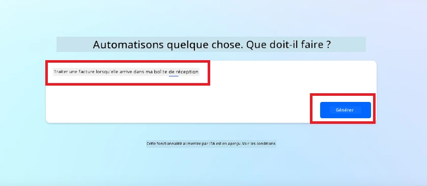

3. L’Assistant IA suggérera les actions nécessaires pour accomplir la tâche que vous souhaitez automatiser. Vous pouvez cliquer sur le bouton **Suivant** pour passer aux étapes suivantes.

4. À l’étape suivante, Power Automate vous demandera de configurer les connexions requises pour le flux. Une fois terminé, cliquez sur le bouton **Créer un flux** pour créer le flux.

5. L’Assistant IA générera un flux et vous pourrez ensuite personnaliser ce flux selon vos besoins.

6. Mettez à jour le déclencheur du flux et définissez le **Dossier** sur le dossier où les factures seront stockées. Par exemple, vous pouvez définir le dossier sur **Boîte de réception**. Cliquez sur **Afficher les options avancées** et réglez l’option **Uniquement avec pièces jointes** sur **Oui**. Cela garantira que le flux ne s’exécutera que lorsqu’un e-mail avec pièce jointe est reçu dans le dossier.

7. Supprimez les actions suivantes du flux : **HTML vers texte**, **Composer**, **Composer 2**, **Composer 3** et **Composer 4** car vous ne les utiliserez pas.

8. Supprimez l’action **Condition** du flux car vous ne l’utiliserez pas. Le flux devrait ressembler à la capture d’écran suivante :

   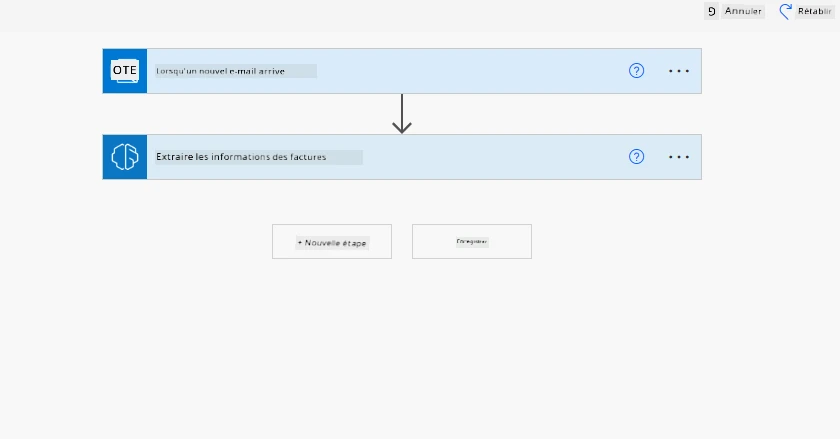

9. Cliquez sur le bouton **Ajouter une action** et recherchez **Dataverse**. Sélectionnez l’action **Ajouter une nouvelle ligne**.

10. Dans l’action **Extraire des informations des factures**, mettez à jour le champ **Fichier de la facture** pour qu’il pointe vers le **Contenu de la pièce jointe** de l’e-mail. Cela garantira que le flux extrait les informations de la pièce jointe de la facture.

11. Sélectionnez la **Table** que vous avez créée précédemment. Par exemple, vous pouvez sélectionner la table **Informations sur les factures**. Choisissez le contenu dynamique de l’action précédente pour remplir les champs suivants :

    - ID
    - Montant
    - Date
    - Nom
    - Statut - Mettez le **Statut** à **En attente**.
    - E-mail du fournisseur - Utilisez le contenu dynamique **De** du déclencheur **Lorsqu’un nouvel e-mail arrive**.

    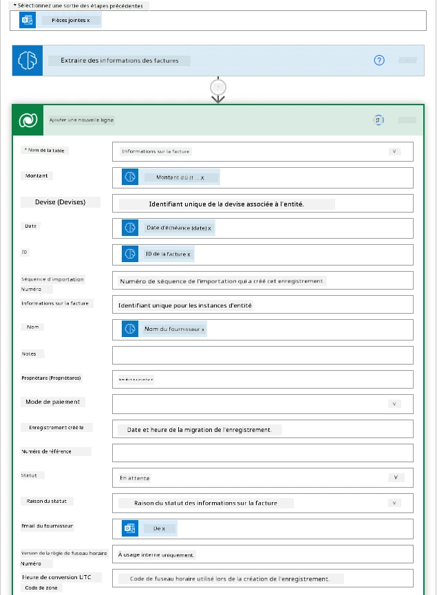

12. Une fois que vous avez terminé avec le flux, cliquez sur le bouton **Enregistrer** pour enregistrer le flux. Vous pouvez ensuite tester le flux en envoyant un e-mail avec une facture vers le dossier que vous avez spécifié dans le déclencheur.

> **Votre devoir** : Le flux que vous venez de créer est un bon début, maintenant vous devez réfléchir à la manière de construire une automatisation qui permettra à notre équipe financière d’envoyer un e-mail au fournisseur pour le tenir informé du statut actuel de leur facture. Votre indice : le flux doit s’exécuter lorsque le statut de la facture change.

## Utiliser un modèle IA de génération de texte dans Power Automate

Le modèle IA Create Text with GPT dans AI Builder vous permet de générer du texte basé sur une invite et est propulsé par le service Microsoft Azure OpenAI. Avec cette capacité, vous pouvez intégrer la technologie GPT (Generative Pre-Trained Transformer) dans vos applications et flux pour construire une variété de flux automatisés et d’applications intelligentes.

Les modèles GPT subissent un entraînement approfondi sur de vastes quantités de données, leur permettant de produire un texte qui ressemble de très près au langage humain lorsqu'une invite leur est donnée. Lorsqu’ils sont intégrés à l’automatisation de flux de travail, les modèles IA comme GPT peuvent être exploités pour rationaliser et automatiser un large éventail de tâches.

Par exemple, vous pouvez construire des flux pour générer automatiquement du texte pour une variété de cas d’usage, tels que : brouillons d’e-mails, descriptions de produits, et plus. Vous pouvez aussi utiliser le modèle pour générer du texte pour diverses applications, comme des chatbots et des applications de service client permettant aux agents de répondre efficacement et rapidement aux demandes des clients.

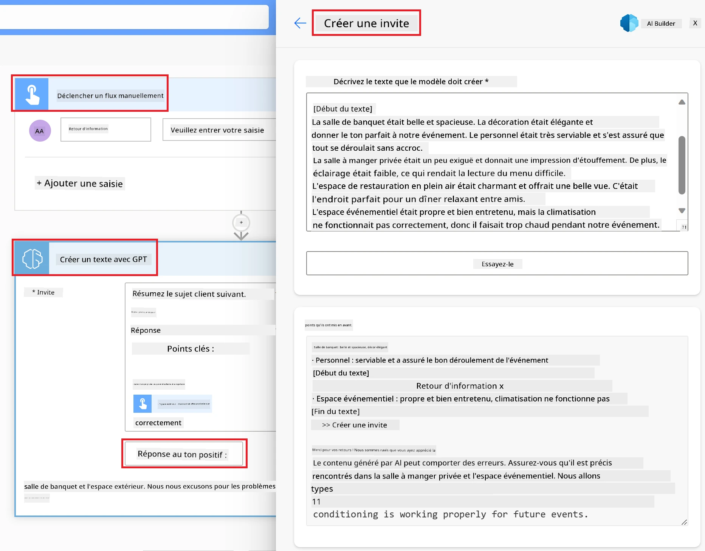

Pour apprendre à utiliser ce modèle d'IA dans Power Automate, parcourez le module [Ajouter de l'intelligence avec AI Builder et GPT](https://learn.microsoft.com/training/modules/ai-builder-text-generation/?WT.mc_id=academic-109639-somelezediko).

## Excellent travail ! Continuez votre apprentissage

Après avoir terminé cette leçon, consultez notre [collection d'apprentissage sur l'IA générative](https://aka.ms/genai-collection?WT.mc_id=academic-105485-koreyst) pour continuer à approfondir vos connaissances en IA générative !

Vous souhaitez personnaliser et tirer davantage parti de Copilot ? Découvrez [Awesome Copilot](https://github.com/github/awesome-copilot?WT.mc_id=academic-105485-koreyst) — une collection communautaire d'instructions, d'agents, de compétences et de configurations pour vous aider à exploiter au mieux GitHub Copilot.

Rendez-vous à la leçon 11 où nous verrons comment [intégrer l'IA générative avec les appels de fonction](../11-integrating-with-function-calling/README.md?WT.mc_id=academic-105485-koreyst) !

---

<!-- CO-OP TRANSLATOR DISCLAIMER START -->
**Avertissement** :
Ce document a été traduit à l'aide du service de traduction automatique [Co-op Translator](https://github.com/Azure/co-op-translator). Bien que nous nous efforçions d'assurer l'exactitude, veuillez noter que les traductions automatisées peuvent contenir des erreurs ou des inexactitudes. Le document original dans sa langue native doit être considéré comme la source faisant autorité. Pour les informations critiques, il est recommandé de recourir à une traduction professionnelle réalisée par un humain. Nous ne saurions être tenus responsables des malentendus ou erreurs d'interprétation découlant de l'utilisation de cette traduction.
<!-- CO-OP TRANSLATOR DISCLAIMER END -->