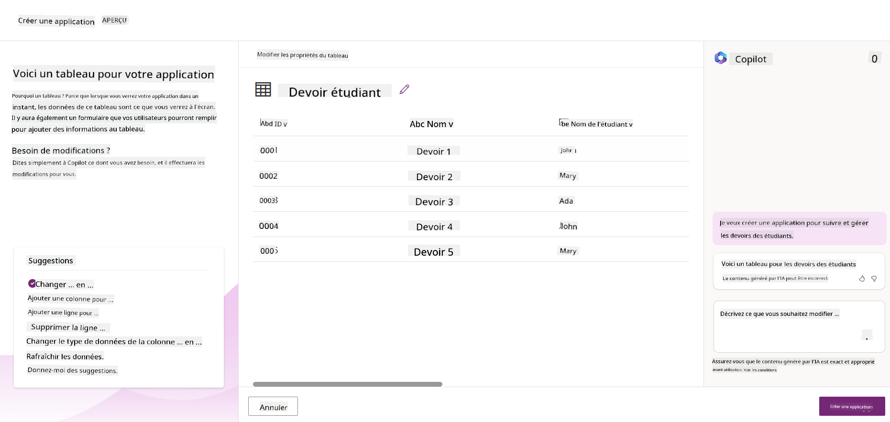
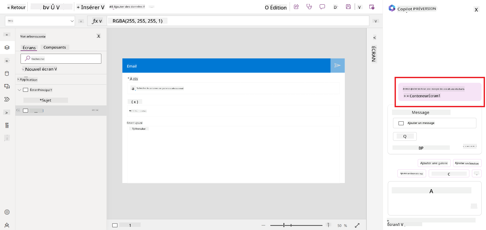
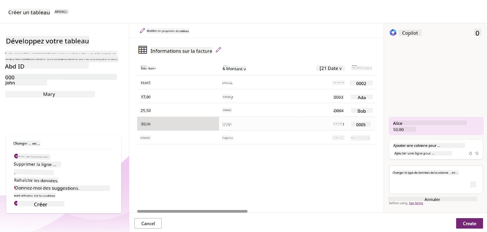
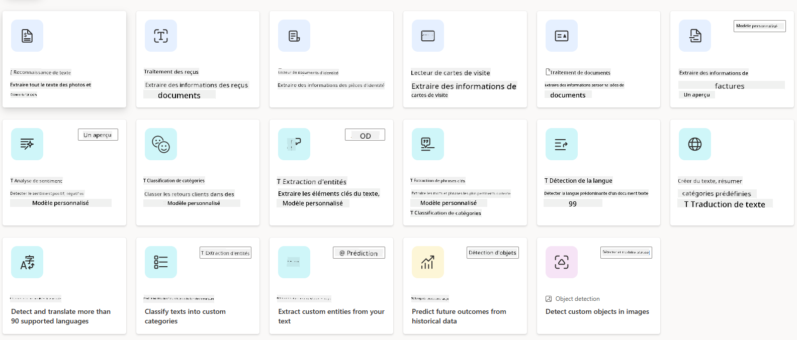
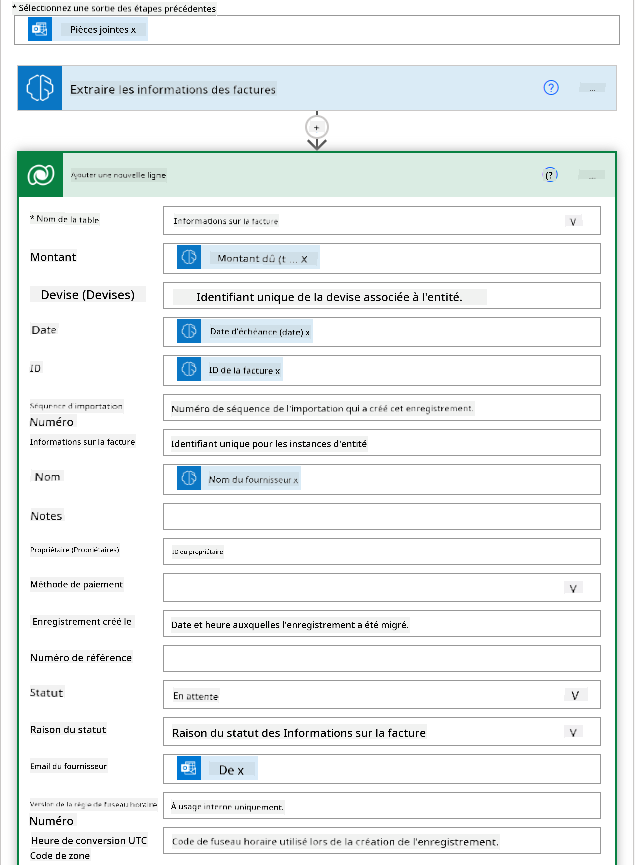

<!--
CO_OP_TRANSLATOR_METADATA:
{
  "original_hash": "846ac8e3b7dcfb697d3309fec05f0fea",
  "translation_date": "2025-10-17T22:40:30+00:00",
  "source_file": "10-building-low-code-ai-applications/README.md",
  "language_code": "fr"
}
-->
# Construire des applications IA à faible code

> _(Cliquez sur l'image ci-dessus pour visionner la vidéo de cette leçon)_

## Introduction

Maintenant que nous avons appris à créer des applications de génération d'images, parlons du faible code. L'IA générative peut être utilisée dans divers domaines, y compris le faible code, mais qu'est-ce que le faible code et comment pouvons-nous y intégrer l'IA ?

La création d'applications et de solutions est devenue plus facile pour les développeurs traditionnels et les non-développeurs grâce aux plateformes de développement à faible code. Ces plateformes permettent de créer des applications et des solutions avec peu ou pas de code. Cela est rendu possible grâce à un environnement de développement visuel qui permet de glisser-déposer des composants pour construire des applications et des solutions. Cela permet de créer des applications et des solutions plus rapidement et avec moins de ressources. Dans cette leçon, nous approfondirons l'utilisation du faible code et comment améliorer le développement à faible code avec l'IA en utilisant Power Platform.

Power Platform offre aux organisations la possibilité de permettre à leurs équipes de créer leurs propres solutions grâce à un environnement intuitif à faible code ou sans code. Cet environnement simplifie le processus de création de solutions. Avec Power Platform, les solutions peuvent être développées en quelques jours ou semaines au lieu de plusieurs mois ou années. Power Platform se compose de cinq produits clés : Power Apps, Power Automate, Power BI, Power Pages et Copilot Studio.

Cette leçon couvre :

- Introduction à l'IA générative dans Power Platform
- Introduction à Copilot et son utilisation
- Utilisation de l'IA générative pour créer des applications et des flux dans Power Platform
- Compréhension des modèles IA dans Power Platform avec AI Builder

## Objectifs d'apprentissage

À la fin de cette leçon, vous serez capable de :

- Comprendre le fonctionnement de Copilot dans Power Platform.

- Créer une application de suivi des devoirs des étudiants pour notre startup éducative.

- Créer un flux de traitement des factures utilisant l'IA pour extraire des informations des factures.

- Appliquer les meilleures pratiques lors de l'utilisation du modèle IA "Créer du texte avec GPT".

Les outils et technologies que vous utiliserez dans cette leçon sont :

- **Power Apps**, pour l'application de suivi des devoirs des étudiants, qui offre un environnement de développement à faible code pour créer des applications permettant de suivre, gérer et interagir avec des données.

- **Dataverse**, pour stocker les données de l'application de suivi des devoirs des étudiants, où Dataverse fournira une plateforme de données à faible code pour stocker les données de l'application.

- **Power Automate**, pour le flux de traitement des factures, où vous disposerez d'un environnement de développement à faible code pour créer des workflows afin d'automatiser le processus de traitement des factures.

- **AI Builder**, pour le modèle IA de traitement des factures, où vous utiliserez des modèles IA préconstruits pour traiter les factures de notre startup.

## L'IA générative dans Power Platform

Améliorer le développement et les applications à faible code avec l'IA générative est un domaine clé pour Power Platform. L'objectif est de permettre à tout le monde de créer des applications, des sites, des tableaux de bord et d'automatiser des processus avec l'IA, _sans nécessiter d'expertise en science des données_. Cet objectif est atteint en intégrant l'IA générative dans l'expérience de développement à faible code de Power Platform sous forme de Copilot et AI Builder.

### Comment cela fonctionne-t-il ?

Copilot est un assistant IA qui vous permet de créer des solutions Power Platform en décrivant vos besoins à travers une série d'étapes conversationnelles en langage naturel. Par exemple, vous pouvez demander à votre assistant IA de spécifier les champs que votre application utilisera, et il créera à la fois l'application et le modèle de données sous-jacent, ou vous pourriez indiquer comment configurer un flux dans Power Automate.

Vous pouvez utiliser les fonctionnalités pilotées par Copilot comme une option dans les écrans de votre application pour permettre aux utilisateurs de découvrir des informations via des interactions conversationnelles.

AI Builder est une capacité IA à faible code disponible dans Power Platform qui vous permet d'utiliser des modèles IA pour vous aider à automatiser des processus et prédire des résultats. Avec AI Builder, vous pouvez intégrer l'IA à vos applications et flux qui se connectent à vos données dans Dataverse ou dans diverses sources de données cloud, telles que SharePoint, OneDrive ou Azure.

Copilot est disponible dans tous les produits Power Platform : Power Apps, Power Automate, Power BI, Power Pages et Power Virtual Agents. AI Builder est disponible dans Power Apps et Power Automate. Dans cette leçon, nous nous concentrerons sur l'utilisation de Copilot et AI Builder dans Power Apps et Power Automate pour créer une solution pour notre startup éducative.

### Copilot dans Power Apps

Dans le cadre de Power Platform, Power Apps offre un environnement de développement à faible code pour créer des applications permettant de suivre, gérer et interagir avec des données. C'est une suite de services de développement d'applications avec une plateforme de données évolutive et la capacité de se connecter à des services cloud et des données sur site. Power Apps permet de créer des applications qui fonctionnent sur des navigateurs, des tablettes et des téléphones, et peuvent être partagées avec des collègues. Power Apps simplifie le développement d'applications grâce à une interface intuitive, permettant à tout utilisateur professionnel ou développeur expérimenté de créer des applications personnalisées. L'expérience de développement d'applications est également améliorée avec l'IA générative via Copilot.

La fonctionnalité d'assistant IA Copilot dans Power Apps vous permet de décrire le type d'application dont vous avez besoin et les informations que vous souhaitez que votre application suive, collecte ou affiche. Copilot génère ensuite une application Canvas réactive basée sur votre description. Vous pouvez ensuite personnaliser l'application selon vos besoins. L'assistant IA Copilot génère également et suggère une table Dataverse avec les champs nécessaires pour stocker les données que vous souhaitez suivre, ainsi que des données d'exemple. Nous examinerons ce qu'est Dataverse et comment vous pouvez l'utiliser dans Power Apps plus tard dans cette leçon. Vous pouvez ensuite personnaliser la table selon vos besoins en utilisant la fonctionnalité d'assistant IA Copilot à travers des étapes conversationnelles. Cette fonctionnalité est disponible directement depuis l'écran d'accueil de Power Apps.

### Copilot dans Power Automate

Dans le cadre de Power Platform, Power Automate permet aux utilisateurs de créer des workflows automatisés entre applications et services. Il aide à automatiser les processus métier répétitifs tels que la communication, la collecte de données et les approbations de décisions. Son interface simple permet aux utilisateurs de tous niveaux techniques (des débutants aux développeurs expérimentés) d'automatiser les tâches professionnelles. L'expérience de développement de workflows est également améliorée avec l'IA générative via Copilot.

La fonctionnalité d'assistant IA Copilot dans Power Automate vous permet de décrire le type de flux dont vous avez besoin et les actions que vous souhaitez que votre flux exécute. Copilot génère ensuite un flux basé sur votre description. Vous pouvez ensuite personnaliser le flux selon vos besoins. L'assistant IA Copilot génère également et suggère les actions nécessaires pour effectuer la tâche que vous souhaitez automatiser. Nous examinerons ce que sont les flux et comment vous pouvez les utiliser dans Power Automate plus tard dans cette leçon. Vous pouvez ensuite personnaliser les actions selon vos besoins en utilisant la fonctionnalité d'assistant IA Copilot à travers des étapes conversationnelles. Cette fonctionnalité est disponible directement depuis l'écran d'accueil de Power Automate.

## Mission : Gérer les devoirs des étudiants et les factures pour notre startup, en utilisant Copilot

Notre startup propose des cours en ligne aux étudiants. La startup a connu une croissance rapide et a maintenant du mal à répondre à la demande pour ses cours. La startup vous a embauché en tant que développeur Power Platform pour les aider à créer une solution à faible code pour gérer les devoirs des étudiants et les factures. La solution doit permettre de suivre et de gérer les devoirs des étudiants via une application et d'automatiser le processus de traitement des factures via un workflow. Vous avez été chargé d'utiliser l'IA générative pour développer la solution.

Lorsque vous commencez à utiliser Copilot, vous pouvez utiliser la [bibliothèque de prompts Copilot de Power Platform](https://github.com/pnp/powerplatform-prompts?WT.mc_id=academic-109639-somelezediko) pour vous familiariser avec les prompts. Cette bibliothèque contient une liste de prompts que vous pouvez utiliser pour créer des applications et des flux avec Copilot. Vous pouvez également utiliser les prompts de la bibliothèque pour avoir une idée de la manière de décrire vos besoins à Copilot.

### Créer une application de suivi des devoirs des étudiants pour notre startup

Les enseignants de notre startup ont du mal à suivre les devoirs des étudiants. Ils utilisent un tableur pour suivre les devoirs, mais cela devient difficile à gérer avec l'augmentation du nombre d'étudiants. Ils vous ont demandé de créer une application qui les aidera à suivre et gérer les devoirs des étudiants. L'application doit leur permettre d'ajouter de nouveaux devoirs, de consulter les devoirs, de les mettre à jour et de les supprimer. L'application doit également permettre aux enseignants et aux étudiants de voir les devoirs qui ont été notés et ceux qui ne l'ont pas été.

Vous allez créer l'application en utilisant Copilot dans Power Apps en suivant les étapes ci-dessous :

1. Accédez à l'écran d'accueil de [Power Apps](https://make.powerapps.com?WT.mc_id=academic-105485-koreyst).

1. Utilisez la zone de texte sur l'écran d'accueil pour décrire l'application que vous souhaitez créer. Par exemple, **_Je veux créer une application pour suivre et gérer les devoirs des étudiants_**. Cliquez sur le bouton **Envoyer** pour envoyer le prompt à l'assistant IA Copilot.

1. L'assistant IA Copilot suggérera une table Dataverse avec les champs nécessaires pour stocker les données que vous souhaitez suivre, ainsi que des données d'exemple. Vous pouvez ensuite personnaliser la table selon vos besoins en utilisant la fonctionnalité d'assistant IA Copilot à travers des étapes conversationnelles.

   > **Important** : Dataverse est la plateforme de données sous-jacente de Power Platform. C'est une plateforme de données à faible code pour stocker les données de l'application. C'est un service entièrement géré qui stocke les données de manière sécurisée dans le cloud Microsoft et est provisionné dans votre environnement Power Platform. Il est doté de capacités intégrées de gouvernance des données, telles que la classification des données, la traçabilité des données, un contrôle d'accès granulaire, et plus encore. Vous pouvez en apprendre davantage sur Dataverse [ici](https://docs.microsoft.com/powerapps/maker/data-platform/data-platform-intro?WT.mc_id=academic-109639-somelezediko).

   

1. Les enseignants souhaitent envoyer des e-mails aux étudiants qui ont soumis leurs devoirs pour les tenir informés de l'avancement de leurs devoirs. Vous pouvez utiliser Copilot pour ajouter un nouveau champ à la table afin de stocker l'adresse e-mail des étudiants. Par exemple, vous pouvez utiliser le prompt suivant pour ajouter un nouveau champ à la table : **_Je veux ajouter une colonne pour stocker l'adresse e-mail des étudiants_**. Cliquez sur le bouton **Envoyer** pour envoyer le prompt à l'assistant IA Copilot.

1. L'assistant IA Copilot générera un nouveau champ et vous pourrez ensuite personnaliser ce champ selon vos besoins.

1. Une fois que vous avez terminé avec la table, cliquez sur le bouton **Créer une application** pour créer l'application.

1. L'assistant IA Copilot générera une application Canvas réactive basée sur votre description. Vous pourrez ensuite personnaliser l'application selon vos besoins.

1. Pour permettre aux enseignants d'envoyer des e-mails aux étudiants, vous pouvez utiliser Copilot pour ajouter un nouvel écran à l'application. Par exemple, vous pouvez utiliser le prompt suivant pour ajouter un nouvel écran à l'application : **_Je veux ajouter un écran pour envoyer des e-mails aux étudiants_**. Cliquez sur le bouton **Envoyer** pour envoyer le prompt à l'assistant IA Copilot.

1. L'assistant IA Copilot générera un nouvel écran et vous pourrez ensuite personnaliser cet écran selon vos besoins.

1. Une fois que vous avez terminé avec l'application, cliquez sur le bouton **Enregistrer** pour enregistrer l'application.

1. Pour partager l'application avec les enseignants, cliquez sur le bouton **Partager**, puis cliquez à nouveau sur le bouton **Partager**. Vous pourrez ensuite partager l'application avec les enseignants en saisissant leurs adresses e-mail.

> **Votre devoir** : L'application que vous venez de créer est un bon début mais peut être améliorée. Avec la fonctionnalité d'e-mail, les enseignants ne peuvent envoyer des e-mails aux étudiants que manuellement en saisissant leurs adresses e-mail. Pouvez-vous utiliser Copilot pour créer une automatisation qui permettra aux enseignants d'envoyer des e-mails automatiquement aux étudiants lorsqu'ils soumettent leurs devoirs ? Votre indice : avec le bon prompt, vous pouvez utiliser Copilot dans Power Automate pour créer cela.

### Créer une table d'informations sur les factures pour notre startup

L'équipe financière de notre startup a du mal à suivre les factures. Ils utilisent un tableur pour suivre les factures, mais cela devient difficile à gérer avec l'augmentation du nombre de factures. Ils vous ont demandé de créer une table qui les aidera à stocker, suivre et gérer les informations des factures reçues. La table doit être utilisée pour créer une automatisation qui extraira toutes les informations des factures et les stockera dans la table. La table doit également permettre à l'équipe financière de consulter les factures qui ont été payées et celles qui ne l'ont pas été.

Power Platform dispose d'une plateforme de données sous-jacente appelée Dataverse qui vous permet de stocker les données de vos applications et solutions. Dataverse offre une plateforme de données à faible code pour stocker les données de l'application. C'est un service entièrement géré qui stocke les données de manière sécurisée dans le cloud Microsoft et est provisionné dans votre environnement Power Platform. Il est doté de capacités intégrées de gouvernance des données, telles que la classification des données, la traçabilité des données, un contrôle d'accès granulaire, et plus encore. Vous pouvez en apprendre davantage [sur Dataverse ici](https://docs.microsoft.com/powerapps/maker/data-platform/data-platform-intro?WT.mc_id=academic-109639-somelezediko).
Pourquoi utiliser Dataverse pour notre startup ? Les tables standard et personnalisées dans Dataverse offrent une option de stockage sécurisée et basée sur le cloud pour vos données. Les tables vous permettent de stocker différents types de données, de la même manière que vous pourriez utiliser plusieurs feuilles dans un seul classeur Excel. Vous pouvez utiliser les tables pour stocker des données spécifiques aux besoins de votre organisation ou de votre entreprise. Certains des avantages que notre startup peut tirer de l'utilisation de Dataverse incluent, mais ne se limitent pas à :

- **Facile à gérer** : Les métadonnées et les données sont stockées dans le cloud, vous n'avez donc pas à vous soucier des détails de leur stockage ou de leur gestion. Vous pouvez vous concentrer sur la création de vos applications et solutions.

- **Sécurisé** : Dataverse offre une option de stockage sécurisée et basée sur le cloud pour vos données. Vous pouvez contrôler qui a accès aux données dans vos tables et comment ils peuvent y accéder grâce à la sécurité basée sur les rôles.

- **Métadonnées riches** : Les types de données et les relations sont utilisés directement dans Power Apps.

- **Logique et validation** : Vous pouvez utiliser des règles métier, des champs calculés et des règles de validation pour appliquer une logique métier et maintenir l'exactitude des données.

Maintenant que vous savez ce qu'est Dataverse et pourquoi vous devriez l'utiliser, voyons comment vous pouvez utiliser Copilot pour créer une table dans Dataverse afin de répondre aux besoins de notre équipe financière.

> **Note** : Vous utiliserez cette table dans la section suivante pour créer une automatisation qui extraira toutes les informations des factures et les stockera dans la table.

Pour créer une table dans Dataverse à l'aide de Copilot, suivez les étapes ci-dessous :

1. Accédez à l'écran d'accueil de [Power Apps](https://make.powerapps.com?WT.mc_id=academic-105485-koreyst).

2. Dans la barre de navigation à gauche, sélectionnez **Tables**, puis cliquez sur **Décrire la nouvelle table**.

3. Sur l'écran **Décrire la nouvelle table**, utilisez la zone de texte pour décrire la table que vous souhaitez créer. Par exemple, **_Je veux créer une table pour stocker les informations des factures_**. Cliquez sur le bouton **Envoyer** pour envoyer l'invite à l'IA Copilot.

4. L'IA Copilot suggérera une table Dataverse avec les champs nécessaires pour stocker les données que vous souhaitez suivre ainsi que des données d'exemple. Vous pouvez ensuite personnaliser la table selon vos besoins à l'aide de la fonctionnalité d'assistant IA Copilot via des étapes conversationnelles.

5. L'équipe financière souhaite envoyer un e-mail au fournisseur pour l'informer de l'état actuel de sa facture. Vous pouvez utiliser Copilot pour ajouter un nouveau champ à la table afin de stocker l'e-mail du fournisseur. Par exemple, vous pouvez utiliser l'invite suivante pour ajouter un nouveau champ à la table : **_Je veux ajouter une colonne pour stocker l'e-mail du fournisseur_**. Cliquez sur le bouton **Envoyer** pour envoyer l'invite à l'IA Copilot.

6. L'IA Copilot générera un nouveau champ et vous pourrez ensuite personnaliser ce champ selon vos besoins.

7. Une fois que vous avez terminé avec la table, cliquez sur le bouton **Créer** pour créer la table.

## Modèles d'IA dans Power Platform avec AI Builder

AI Builder est une fonctionnalité d'IA low-code disponible dans Power Platform qui vous permet d'utiliser des modèles d'IA pour automatiser des processus et prédire des résultats. Avec AI Builder, vous pouvez intégrer l'IA dans vos applications et flux qui se connectent à vos données dans Dataverse ou dans diverses sources de données cloud, telles que SharePoint, OneDrive ou Azure.

## Modèles d'IA préconstruits vs modèles d'IA personnalisés

AI Builder propose deux types de modèles d'IA : les modèles d'IA préconstruits et les modèles d'IA personnalisés. Les modèles d'IA préconstruits sont des modèles prêts à l'emploi, formés par Microsoft et disponibles dans Power Platform. Ils vous aident à ajouter de l'intelligence à vos applications et flux sans avoir à collecter des données, puis à créer, former et publier vos propres modèles. Vous pouvez utiliser ces modèles pour automatiser des processus et prédire des résultats.

Certains des modèles d'IA préconstruits disponibles dans Power Platform incluent :

- **Extraction de phrases clés** : Ce modèle extrait les phrases clés d'un texte.
- **Détection de la langue** : Ce modèle détecte la langue d'un texte.
- **Analyse de sentiment** : Ce modèle détecte le sentiment positif, négatif, neutre ou mixte dans un texte.
- **Lecteur de cartes de visite** : Ce modèle extrait des informations des cartes de visite.
- **Reconnaissance de texte** : Ce modèle extrait du texte à partir d'images.
- **Détection d'objets** : Ce modèle détecte et extrait des objets à partir d'images.
- **Traitement de documents** : Ce modèle extrait des informations à partir de formulaires.
- **Traitement des factures** : Ce modèle extrait des informations à partir des factures.

Avec les modèles d'IA personnalisés, vous pouvez intégrer votre propre modèle dans AI Builder afin qu'il fonctionne comme n'importe quel modèle personnalisé d'AI Builder, vous permettant de former le modèle en utilisant vos propres données. Vous pouvez utiliser ces modèles pour automatiser des processus et prédire des résultats dans Power Apps et Power Automate. Lorsque vous utilisez votre propre modèle, certaines limitations s'appliquent. Lisez-en plus sur ces [limitations](https://learn.microsoft.com/ai-builder/byo-model#limitations?WT.mc_id=academic-105485-koreyst).

## Devoir #2 - Créer un flux de traitement des factures pour notre startup

L'équipe financière a du mal à traiter les factures. Elle utilise un tableur pour suivre les factures, mais cela devient difficile à gérer à mesure que le nombre de factures augmente. Elle vous a demandé de créer un flux de travail qui l'aidera à traiter les factures en utilisant l'IA. Le flux de travail doit permettre d'extraire des informations des factures et de les stocker dans une table Dataverse. Le flux de travail doit également permettre d'envoyer un e-mail à l'équipe financière avec les informations extraites.

Maintenant que vous savez ce qu'est AI Builder et pourquoi vous devriez l'utiliser, voyons comment utiliser le modèle d'IA de traitement des factures dans AI Builder, que nous avons abordé précédemment, pour créer un flux de travail qui aidera l'équipe financière à traiter les factures.

Pour créer un flux de travail qui aidera l'équipe financière à traiter les factures à l'aide du modèle d'IA de traitement des factures dans AI Builder, suivez les étapes ci-dessous :

1. Accédez à l'écran d'accueil de [Power Automate](https://make.powerautomate.com?WT.mc_id=academic-105485-koreyst).

2. Utilisez la zone de texte sur l'écran d'accueil pour décrire le flux de travail que vous souhaitez créer. Par exemple, **_Traiter une facture lorsqu'elle arrive dans ma boîte de réception_**. Cliquez sur le bouton **Envoyer** pour envoyer l'invite à l'IA Copilot.

   

3. L'IA Copilot suggérera les actions nécessaires pour effectuer la tâche que vous souhaitez automatiser. Vous pouvez cliquer sur le bouton **Suivant** pour passer aux étapes suivantes.

4. À l'étape suivante, Power Automate vous demandera de configurer les connexions nécessaires pour le flux. Une fois terminé, cliquez sur le bouton **Créer un flux** pour créer le flux.

5. L'IA Copilot générera un flux et vous pourrez ensuite personnaliser le flux selon vos besoins.

6. Mettez à jour le déclencheur du flux et définissez le **Dossier** sur le dossier où les factures seront stockées. Par exemple, vous pouvez définir le dossier sur **Boîte de réception**. Cliquez sur **Afficher les options avancées** et définissez **Uniquement avec pièces jointes** sur **Oui**. Cela garantira que le flux ne s'exécute que lorsqu'un e-mail avec une pièce jointe est reçu dans le dossier.

7. Supprimez les actions suivantes du flux : **HTML vers texte**, **Composer**, **Composer 2**, **Composer 3** et **Composer 4**, car vous ne les utiliserez pas.

8. Supprimez l'action **Condition** du flux, car vous ne l'utiliserez pas. Cela devrait ressembler à la capture d'écran suivante :

   

9. Cliquez sur le bouton **Ajouter une action** et recherchez **Dataverse**. Sélectionnez l'action **Ajouter une nouvelle ligne**.

10. Sur l'action **Extraire des informations des factures**, mettez à jour le **Fichier de facture** pour pointer vers le **Contenu de la pièce jointe** de l'e-mail. Cela garantira que le flux extrait les informations de la pièce jointe de la facture.

11. Sélectionnez la **Table** que vous avez créée précédemment. Par exemple, vous pouvez sélectionner la table **Informations sur les factures**. Choisissez le contenu dynamique de l'action précédente pour remplir les champs suivants :

    - ID
    - Montant
    - Date
    - Nom
    - Statut - Définissez le **Statut** sur **En attente**.
    - E-mail du fournisseur - Utilisez le contenu dynamique **De** du déclencheur **Lorsqu'un nouvel e-mail arrive**.

    

12. Une fois que vous avez terminé avec le flux, cliquez sur le bouton **Enregistrer** pour enregistrer le flux. Vous pouvez ensuite tester le flux en envoyant un e-mail avec une facture au dossier que vous avez spécifié dans le déclencheur.

> **Votre devoir** : Le flux que vous venez de créer est un bon début, maintenant vous devez réfléchir à la manière dont vous pouvez créer une automatisation qui permettra à notre équipe financière d'envoyer un e-mail au fournisseur pour l'informer de l'état actuel de sa facture. Votre indice : le flux doit s'exécuter lorsque l'état de la facture change.

## Utiliser un modèle d'IA de génération de texte dans Power Automate

Le modèle Créer un texte avec GPT dans AI Builder permet de générer du texte en fonction d'une invite et est alimenté par le service Microsoft Azure OpenAI. Avec cette fonctionnalité, vous pouvez intégrer la technologie GPT (Generative Pre-Trained Transformer) dans vos applications et flux pour créer une variété de flux automatisés et d'applications perspicaces.

Les modèles GPT subissent une formation approfondie sur de vastes quantités de données, ce qui leur permet de produire un texte qui ressemble de près au langage humain lorsqu'ils reçoivent une invite. Lorsqu'ils sont intégrés à l'automatisation des flux de travail, les modèles d'IA comme GPT peuvent être exploités pour rationaliser et automatiser une large gamme de tâches.

Par exemple, vous pouvez créer des flux pour générer automatiquement du texte pour divers cas d'utilisation, tels que : des brouillons d'e-mails, des descriptions de produits, et plus encore. Vous pouvez également utiliser le modèle pour générer du texte pour diverses applications, telles que des chatbots et des applications de service client qui permettent aux agents du service client de répondre efficacement et rapidement aux demandes des clients.

Pour apprendre à utiliser ce modèle d'IA dans Power Automate, consultez le module [Ajouter de l'intelligence avec AI Builder et GPT](https://learn.microsoft.com/training/modules/ai-builder-text-generation/?WT.mc_id=academic-109639-somelezediko).

## Excellent travail ! Continuez votre apprentissage

Après avoir terminé cette leçon, consultez notre [collection d'apprentissage sur l'IA générative](https://aka.ms/genai-collection?WT.mc_id=academic-105485-koreyst) pour continuer à approfondir vos connaissances sur l'IA générative !

Rendez-vous à la leçon 11 où nous examinerons comment [intégrer l'IA générative avec l'appel de fonction](../11-integrating-with-function-calling/README.md?WT.mc_id=academic-105485-koreyst) !

---

**Avertissement** :  
Ce document a été traduit à l'aide du service de traduction automatique [Co-op Translator](https://github.com/Azure/co-op-translator). Bien que nous nous efforcions d'assurer l'exactitude, veuillez noter que les traductions automatisées peuvent contenir des erreurs ou des inexactitudes. Le document original dans sa langue d'origine doit être considéré comme la source faisant autorité. Pour des informations critiques, il est recommandé de recourir à une traduction humaine professionnelle. Nous ne sommes pas responsables des malentendus ou des interprétations erronées résultant de l'utilisation de cette traduction.