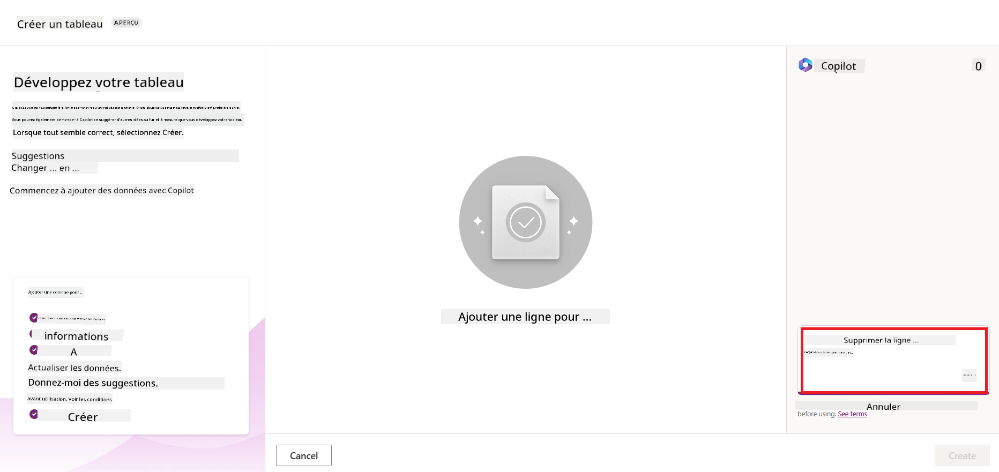
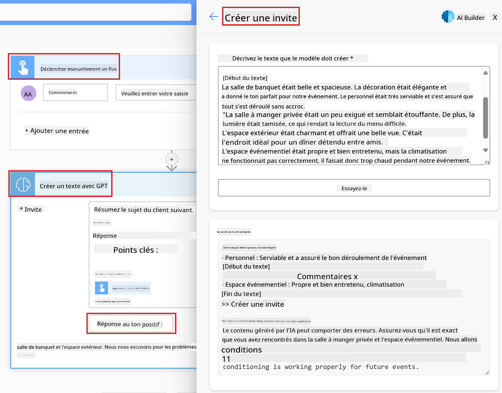

<!--
CO_OP_TRANSLATOR_METADATA:
{
  "original_hash": "f5ff3b6204a695a117d6f452403c95f7",
  "translation_date": "2025-07-09T13:38:17+00:00",
  "source_file": "10-building-low-code-ai-applications/README.md",
  "language_code": "fr"
}
-->
# Créer des applications IA Low Code

> _(Cliquez sur l’image ci-dessus pour voir la vidéo de cette leçon)_

## Introduction

Maintenant que nous avons appris à créer des applications générant des images, parlons du low code. L’IA générative peut être utilisée dans de nombreux domaines, y compris le low code, mais qu’est-ce que le low code et comment y intégrer l’IA ?

La création d’applications et de solutions est devenue plus simple pour les développeurs traditionnels comme pour les non-développeurs grâce aux plateformes de développement Low Code. Ces plateformes permettent de créer des applications et des solutions avec peu ou pas de code. Cela est rendu possible grâce à un environnement de développement visuel qui permet de glisser-déposer des composants pour construire des applications et des solutions. Cela permet de développer plus rapidement et avec moins de ressources. Dans cette leçon, nous explorons en profondeur comment utiliser le Low Code et comment enrichir le développement low code avec l’IA via Power Platform.

Power Platform offre aux organisations la possibilité de donner à leurs équipes les moyens de créer leurs propres solutions via un environnement intuitif low-code ou no-code. Cet environnement simplifie le processus de création de solutions. Avec Power Platform, les solutions peuvent être développées en quelques jours ou semaines au lieu de plusieurs mois ou années. Power Platform se compose de cinq produits clés : Power Apps, Power Automate, Power BI, Power Pages et Copilot Studio.

Cette leçon couvre :

- Introduction à l’IA générative dans Power Platform  
- Introduction à Copilot et son utilisation  
- Utiliser l’IA générative pour créer des applications et des flux dans Power Platform  
- Comprendre les modèles IA dans Power Platform avec AI Builder  

## Objectifs d’apprentissage

À la fin de cette leçon, vous serez capable de :

- Comprendre le fonctionnement de Copilot dans Power Platform.

- Créer une application de suivi des devoirs étudiants pour notre startup éducative.

- Construire un flux de traitement des factures utilisant l’IA pour extraire les informations des factures.

- Appliquer les bonnes pratiques lors de l’utilisation du modèle IA Create Text with GPT.

Les outils et technologies que vous utiliserez dans cette leçon sont :

- **Power Apps**, pour l’application de suivi des devoirs étudiants, qui offre un environnement de développement low-code pour créer des applications permettant de suivre, gérer et interagir avec les données.

- **Dataverse**, pour stocker les données de l’application de suivi des devoirs étudiants, fournissant une plateforme de données low-code pour héberger les données de l’application.

- **Power Automate**, pour le flux de traitement des factures, offrant un environnement low-code pour créer des workflows automatisant le processus de traitement des factures.

- **AI Builder**, pour le modèle IA de traitement des factures, utilisant des modèles IA préconstruits pour traiter les factures de notre startup.

## IA générative dans Power Platform

L’amélioration du développement low-code et des applications avec l’IA générative est un axe majeur pour Power Platform. L’objectif est de permettre à chacun de créer des applications, sites, tableaux de bord alimentés par l’IA et d’automatiser des processus avec l’IA, _sans nécessiter de compétences en data science_. Cet objectif est atteint en intégrant l’IA générative dans l’expérience de développement low-code de Power Platform sous la forme de Copilot et AI Builder.

### Comment cela fonctionne-t-il ?

Copilot est un assistant IA qui vous permet de créer des solutions Power Platform en décrivant vos besoins à travers une série d’étapes conversationnelles en langage naturel. Par exemple, vous pouvez demander à votre assistant IA de définir les champs que votre application utilisera, et il créera à la fois l’application et le modèle de données sous-jacent, ou vous pouvez spécifier comment configurer un flux dans Power Automate.

Vous pouvez utiliser les fonctionnalités pilotées par Copilot comme une option dans vos écrans d’application pour permettre aux utilisateurs de découvrir des insights via des interactions conversationnelles.

AI Builder est une capacité IA low-code disponible dans Power Platform qui vous permet d’utiliser des modèles IA pour automatiser des processus et prédire des résultats. Avec AI Builder, vous pouvez intégrer l’IA dans vos applications et flux connectés à vos données dans Dataverse ou dans diverses sources cloud comme SharePoint, OneDrive ou Azure.

Copilot est disponible dans tous les produits Power Platform : Power Apps, Power Automate, Power BI, Power Pages et Power Virtual Agents. AI Builder est disponible dans Power Apps et Power Automate. Dans cette leçon, nous nous concentrerons sur l’utilisation de Copilot et AI Builder dans Power Apps et Power Automate pour créer une solution pour notre startup éducative.

### Copilot dans Power Apps

Dans Power Platform, Power Apps offre un environnement de développement low-code pour créer des applications permettant de suivre, gérer et interagir avec des données. C’est une suite de services de développement d’applications avec une plateforme de données évolutive et la capacité de se connecter à des services cloud et des données locales. Power Apps permet de créer des applications fonctionnant sur navigateurs, tablettes et téléphones, partageables avec des collègues. Power Apps facilite la création d’applications grâce à une interface simple, permettant à tout utilisateur métier ou développeur expérimenté de créer des applications personnalisées. L’expérience de développement est aussi enrichie par l’IA générative via Copilot.

La fonction d’assistant IA Copilot dans Power Apps vous permet de décrire le type d’application dont vous avez besoin et les informations que votre application doit suivre, collecter ou afficher. Copilot génère alors une application Canvas responsive basée sur votre description. Vous pouvez ensuite personnaliser l’application selon vos besoins. L’IA Copilot génère aussi et suggère une table Dataverse avec les champs nécessaires pour stocker les données à suivre ainsi que des données d’exemple. Nous verrons plus tard dans cette leçon ce qu’est Dataverse et comment l’utiliser dans Power Apps. Vous pouvez ensuite personnaliser la table selon vos besoins grâce à l’assistant IA Copilot via des étapes conversationnelles. Cette fonctionnalité est accessible directement depuis l’écran d’accueil de Power Apps.

### Copilot dans Power Automate

Dans Power Platform, Power Automate permet aux utilisateurs de créer des workflows automatisés entre applications et services. Il aide à automatiser les processus métier répétitifs tels que la communication, la collecte de données et les approbations de décisions. Son interface simple permet à des utilisateurs de tous niveaux techniques (du débutant au développeur confirmé) d’automatiser leurs tâches. L’expérience de création de workflows est également enrichie par l’IA générative via Copilot.

La fonction d’assistant IA Copilot dans Power Automate vous permet de décrire le type de flux dont vous avez besoin et les actions que vous souhaitez que votre flux réalise. Copilot génère alors un flux basé sur votre description. Vous pouvez ensuite personnaliser ce flux selon vos besoins. L’IA Copilot génère et suggère aussi les actions nécessaires pour accomplir la tâche que vous souhaitez automatiser. Nous verrons plus tard dans cette leçon ce qu’est un flux et comment l’utiliser dans Power Automate. Vous pouvez ensuite personnaliser les actions selon vos besoins grâce à l’assistant IA Copilot via des étapes conversationnelles. Cette fonctionnalité est accessible directement depuis l’écran d’accueil de Power Automate.

## Exercice : Gérer les devoirs étudiants et les factures pour notre startup, avec Copilot

Notre startup propose des cours en ligne aux étudiants. Elle a connu une croissance rapide et peine désormais à suivre la demande pour ses cours. Elle vous a engagé en tant que développeur Power Platform pour l’aider à créer une solution low code afin de gérer les devoirs étudiants et les factures. Leur solution doit permettre de suivre et gérer les devoirs via une application et d’automatiser le traitement des factures via un workflow. Vous devez utiliser l’IA générative pour développer cette solution.

Pour commencer avec Copilot, vous pouvez utiliser la [bibliothèque de prompts Power Platform Copilot](https://github.com/pnp/powerplatform-prompts?WT.mc_id=academic-109639-somelezediko). Cette bibliothèque contient une liste de prompts que vous pouvez utiliser pour créer des applications et des flux avec Copilot. Vous pouvez aussi vous en inspirer pour savoir comment décrire vos besoins à Copilot.

### Créer une application de suivi des devoirs étudiants pour notre startup

Les enseignants de notre startup ont du mal à suivre les devoirs des étudiants. Ils utilisaient un tableur pour cela, mais la gestion est devenue compliquée avec l’augmentation du nombre d’étudiants. Ils vous ont demandé de créer une application qui les aidera à suivre et gérer les devoirs. L’application doit permettre d’ajouter, consulter, modifier et supprimer des devoirs. Elle doit aussi permettre aux enseignants et aux étudiants de voir les devoirs notés et ceux qui ne le sont pas.

Vous allez créer l’application avec Copilot dans Power Apps en suivant les étapes ci-dessous :

1. Rendez-vous sur l’écran d’accueil de [Power Apps](https://make.powerapps.com?WT.mc_id=academic-105485-koreyst).

1. Utilisez la zone de texte sur l’écran d’accueil pour décrire l’application que vous souhaitez créer. Par exemple, **_Je veux créer une application pour suivre et gérer les devoirs étudiants_**. Cliquez sur le bouton **Envoyer** pour transmettre le prompt à l’IA Copilot.

1. L’IA Copilot proposera une table Dataverse avec les champs nécessaires pour stocker les données à suivre ainsi que des données d’exemple. Vous pourrez ensuite personnaliser la table selon vos besoins grâce à l’assistant IA Copilot via des étapes conversationnelles.

   > **Important** : Dataverse est la plateforme de données sous-jacente de Power Platform. C’est une plateforme low-code pour stocker les données de l’application. C’est un service entièrement géré qui stocke les données en toute sécurité dans le cloud Microsoft et est provisionné dans votre environnement Power Platform. Il intègre des fonctionnalités de gouvernance des données, telles que la classification des données, la traçabilité, un contrôle d’accès fin, et plus encore. Vous pouvez en apprendre davantage sur Dataverse [ici](https://docs.microsoft.com/powerapps/maker/data-platform/data-platform-intro?WT.mc_id=academic-109639-somelezediko).

   

1. Les enseignants souhaitent envoyer des emails aux étudiants ayant soumis leurs devoirs pour les tenir informés de l’avancement. Vous pouvez utiliser Copilot pour ajouter un nouveau champ dans la table pour stocker l’email des étudiants. Par exemple, vous pouvez utiliser le prompt suivant pour ajouter une colonne : **_Je veux ajouter une colonne pour stocker l’email des étudiants_**. Cliquez sur le bouton **Envoyer** pour transmettre le prompt à l’IA Copilot.

1. L’IA Copilot générera un nouveau champ que vous pourrez personnaliser selon vos besoins.

1. Une fois la table terminée, cliquez sur le bouton **Créer l’application** pour générer l’application.

1. L’IA Copilot créera une application Canvas responsive basée sur votre description. Vous pourrez ensuite personnaliser l’application selon vos besoins.

1. Pour permettre aux enseignants d’envoyer des emails aux étudiants, vous pouvez utiliser Copilot pour ajouter un nouvel écran à l’application. Par exemple, utilisez le prompt suivant : **_Je veux ajouter un écran pour envoyer des emails aux étudiants_**. Cliquez sur le bouton **Envoyer** pour transmettre le prompt à l’IA Copilot.

1. L’IA Copilot générera un nouvel écran que vous pourrez personnaliser selon vos besoins.

1. Une fois l’application terminée, cliquez sur le bouton **Enregistrer** pour sauvegarder l’application.

1. Pour partager l’application avec les enseignants, cliquez sur le bouton **Partager** puis à nouveau sur **Partager**. Vous pourrez alors partager l’application en saisissant leurs adresses email.

> **Votre devoir** : L’application que vous venez de créer est un bon début mais peut être améliorée. Avec la fonction email, les enseignants ne peuvent envoyer des emails aux étudiants que manuellement en tapant leurs adresses. Pouvez-vous utiliser Copilot pour créer une automatisation permettant aux enseignants d’envoyer automatiquement des emails aux étudiants dès qu’ils soumettent leurs devoirs ? Indice : avec le bon prompt, vous pouvez utiliser Copilot dans Power Automate pour créer cela.

### Créer une table d’informations sur les factures pour notre startup

L’équipe financière de notre startup a du mal à suivre les factures. Elle utilisait un tableur pour cela, mais la gestion est devenue compliquée avec l’augmentation du nombre de factures. Elle vous a demandé de créer une table pour stocker, suivre et gérer les informations des factures reçues. Cette table servira à construire une automatisation qui extraira toutes les informations des factures et les stockera dans la table. La table doit aussi permettre à l’équipe financière de voir les factures payées et celles qui ne le sont pas.

Power Platform dispose d’une plateforme de données sous-jacente appelée Dataverse qui vous permet de stocker les données de vos applications et solutions. Dataverse offre une plateforme de données low-code pour stocker les données de l’application. C’est un service entièrement géré qui stocke les données en toute sécurité dans le cloud Microsoft et est provisionné dans votre environnement Power Platform. Il intègre des fonctionnalités de gouvernance des données, telles que la classification des données, la traçabilité, un contrôle d’accès fin, et plus encore. Vous pouvez en apprendre davantage [sur Dataverse ici](https://docs.microsoft.com/powerapps/maker/data-platform/data-platform-intro?WT.mc_id=academic-109639-somelezediko).

Pourquoi utiliser Dataverse pour notre startup ? Les tables standard et personnalisées dans Dataverse offrent une option de stockage sécurisée et cloud pour vos données. Les tables vous permettent de stocker différents types de données, un peu comme vous utiliseriez plusieurs feuilles dans un même classeur Excel. Vous pouvez utiliser les tables pour stocker des données spécifiques à votre organisation ou à vos besoins métier. Parmi les avantages que notre startup tirera de l’utilisation de Dataverse, on peut citer, sans s’y limiter :
- **Facile à gérer** : Les métadonnées et les données sont toutes deux stockées dans le cloud, vous n’avez donc pas à vous soucier des détails liés à leur stockage ou gestion. Vous pouvez vous concentrer sur la création de vos applications et solutions.

- **Sécurisé** : Dataverse offre une option de stockage sécurisée et basée sur le cloud pour vos données. Vous pouvez contrôler qui a accès aux données de vos tables et comment ils peuvent y accéder grâce à la sécurité basée sur les rôles.

- **Métadonnées riches** : Les types de données et les relations sont utilisés directement dans Power Apps.

- **Logique et validation** : Vous pouvez utiliser des règles métier, des champs calculés et des règles de validation pour appliquer la logique métier et garantir la précision des données.

Maintenant que vous savez ce qu’est Dataverse et pourquoi l’utiliser, voyons comment vous pouvez utiliser Copilot pour créer une table dans Dataverse répondant aux besoins de notre équipe financière.

> **Note** : Vous utiliserez cette table dans la section suivante pour créer une automatisation qui extraira toutes les informations des factures et les stockera dans la table.

Pour créer une table dans Dataverse avec Copilot, suivez les étapes ci-dessous :

1. Rendez-vous sur l’écran d’accueil de [Power Apps](https://make.powerapps.com?WT.mc_id=academic-105485-koreyst).

2. Dans la barre de navigation à gauche, sélectionnez **Tables** puis cliquez sur **Décrire la nouvelle Table**.

3. Sur l’écran **Décrire la nouvelle Table**, utilisez la zone de texte pour décrire la table que vous souhaitez créer. Par exemple, **_Je veux créer une table pour stocker les informations des factures_**. Cliquez sur le bouton **Envoyer** pour transmettre la requête à l’IA Copilot.

4. L’IA Copilot proposera une table Dataverse avec les champs nécessaires pour stocker les données que vous souhaitez suivre ainsi que quelques données d’exemple. Vous pourrez ensuite personnaliser la table selon vos besoins grâce à la fonction d’assistant conversationnel de l’IA Copilot.

5. L’équipe financière souhaite envoyer un email au fournisseur pour le tenir informé du statut actuel de sa facture. Vous pouvez utiliser Copilot pour ajouter un nouveau champ à la table afin de stocker l’email du fournisseur. Par exemple, vous pouvez utiliser la requête suivante pour ajouter une colonne : **_Je veux ajouter une colonne pour stocker l’email du fournisseur_**. Cliquez sur le bouton **Envoyer** pour transmettre la requête à l’IA Copilot.

6. L’IA Copilot générera un nouveau champ que vous pourrez ensuite personnaliser selon vos besoins.

7. Une fois la table finalisée, cliquez sur le bouton **Créer** pour créer la table.

## Modèles IA dans Power Platform avec AI Builder

AI Builder est une fonctionnalité IA low-code disponible dans Power Platform qui vous permet d’utiliser des modèles IA pour automatiser des processus et prédire des résultats. Avec AI Builder, vous pouvez intégrer l’IA dans vos applications et flux connectés à vos données dans Dataverse ou dans diverses sources de données cloud, telles que SharePoint, OneDrive ou Azure.

## Modèles IA préconstruits vs Modèles IA personnalisés

AI Builder propose deux types de modèles IA : les modèles IA préconstruits et les modèles IA personnalisés. Les modèles IA préconstruits sont des modèles prêts à l’emploi, entraînés par Microsoft et disponibles dans Power Platform. Ils vous aident à ajouter de l’intelligence à vos applications et flux sans avoir à collecter des données, ni à construire, entraîner et publier vos propres modèles. Vous pouvez utiliser ces modèles pour automatiser des processus et prédire des résultats.

Parmi les modèles IA préconstruits disponibles dans Power Platform, on trouve :

- **Extraction de phrases clés** : Ce modèle extrait les phrases clés d’un texte.
- **Détection de langue** : Ce modèle détecte la langue d’un texte.
- **Analyse de sentiment** : Ce modèle détecte un sentiment positif, négatif, neutre ou mixte dans un texte.
- **Lecteur de cartes de visite** : Ce modèle extrait les informations des cartes de visite.
- **Reconnaissance de texte** : Ce modèle extrait le texte des images.
- **Détection d’objets** : Ce modèle détecte et extrait des objets à partir d’images.
- **Traitement de documents** : Ce modèle extrait des informations à partir de formulaires.
- **Traitement de factures** : Ce modèle extrait des informations à partir de factures.

Avec les modèles IA personnalisés, vous pouvez intégrer votre propre modèle dans AI Builder pour qu’il fonctionne comme n’importe quel modèle personnalisé AI Builder, vous permettant d’entraîner le modèle avec vos propres données. Vous pouvez utiliser ces modèles pour automatiser des processus et prédire des résultats dans Power Apps et Power Automate. L’utilisation de votre propre modèle est soumise à certaines limitations. Pour en savoir plus, consultez ces [limitations](https://learn.microsoft.com/ai-builder/byo-model#limitations?WT.mc_id=academic-105485-koreyst).

## Exercice #2 - Créer un flux de traitement des factures pour notre startup

L’équipe financière rencontre des difficultés pour traiter les factures. Elle utilisait un tableur pour suivre les factures, mais cela devient difficile à gérer avec l’augmentation du nombre de factures. Elle vous a demandé de créer un workflow qui les aidera à traiter les factures en utilisant l’IA. Ce workflow doit leur permettre d’extraire les informations des factures et de les stocker dans une table Dataverse. Il doit également leur permettre d’envoyer un email à l’équipe financière avec les informations extraites.

Maintenant que vous savez ce qu’est AI Builder et pourquoi l’utiliser, voyons comment utiliser le modèle IA de traitement des factures dans AI Builder, que nous avons vu précédemment, pour créer un workflow qui aidera l’équipe financière à traiter les factures.

Pour créer un workflow qui aidera l’équipe financière à traiter les factures en utilisant le modèle IA de traitement des factures dans AI Builder, suivez les étapes ci-dessous :

1. Rendez-vous sur l’écran d’accueil de [Power Automate](https://make.powerautomate.com?WT.mc_id=academic-105485-koreyst).

2. Utilisez la zone de texte sur l’écran d’accueil pour décrire le workflow que vous souhaitez créer. Par exemple, **_Traiter une facture dès sa réception dans ma boîte mail_**. Cliquez sur le bouton **Envoyer** pour transmettre la requête à l’IA Copilot.

   

3. L’IA Copilot proposera les actions nécessaires pour automatiser la tâche souhaitée. Vous pouvez cliquer sur le bouton **Suivant** pour passer aux étapes suivantes.

4. À l’étape suivante, Power Automate vous invitera à configurer les connexions nécessaires au flux. Une fois terminé, cliquez sur le bouton **Créer un flux** pour créer le flux.

5. L’IA Copilot générera un flux que vous pourrez ensuite personnaliser selon vos besoins.

6. Mettez à jour le déclencheur du flux et définissez le **Dossier** sur celui où les factures seront stockées. Par exemple, vous pouvez définir le dossier sur **Boîte de réception**. Cliquez sur **Afficher les options avancées** et réglez **Uniquement avec pièces jointes** sur **Oui**. Cela garantira que le flux ne s’exécute que lorsqu’un email avec pièce jointe est reçu dans ce dossier.

7. Supprimez les actions suivantes du flux : **HTML vers texte**, **Composer**, **Composer 2**, **Composer 3** et **Composer 4** car vous ne les utiliserez pas.

8. Supprimez l’action **Condition** du flux car elle ne sera pas utilisée. Le flux devrait ressembler à la capture d’écran suivante :

   

9. Cliquez sur le bouton **Ajouter une action** et recherchez **Dataverse**. Sélectionnez l’action **Ajouter une nouvelle ligne**.

10. Dans l’action **Extraire les informations des factures**, mettez à jour le champ **Fichier de la facture** pour pointer vers le **Contenu de la pièce jointe** de l’email. Cela garantira que le flux extrait les informations de la pièce jointe de la facture.

11. Sélectionnez la **Table** que vous avez créée précédemment. Par exemple, vous pouvez choisir la table **Informations sur les factures**. Utilisez le contenu dynamique de l’action précédente pour remplir les champs suivants :

    - ID
    - Montant
    - Date
    - Nom
    - Statut - Définissez le **Statut** sur **En attente**.
    - Email du fournisseur - Utilisez le contenu dynamique **De** du déclencheur **Lorsqu’un nouvel email arrive**.

    

12. Une fois le flux terminé, cliquez sur le bouton **Enregistrer** pour sauvegarder le flux. Vous pouvez ensuite tester le flux en envoyant un email avec une facture dans le dossier que vous avez spécifié dans le déclencheur.

> **Votre devoir** : Le flux que vous venez de créer est un bon début, maintenant vous devez réfléchir à la manière de construire une automatisation qui permettra à notre équipe financière d’envoyer un email au fournisseur pour le tenir informé du statut actuel de sa facture. Indice : le flux doit s’exécuter lorsque le statut de la facture change.

## Utiliser un modèle IA de génération de texte dans Power Automate

Le modèle IA Create Text with GPT dans AI Builder vous permet de générer du texte à partir d’une requête et est alimenté par le service Microsoft Azure OpenAI. Grâce à cette fonctionnalité, vous pouvez intégrer la technologie GPT (Generative Pre-Trained Transformer) dans vos applications et flux pour créer une variété de flux automatisés et d’applications intelligentes.

Les modèles GPT sont entraînés sur d’énormes volumes de données, ce qui leur permet de produire un texte très proche du langage humain lorsqu’on leur fournit une requête. Lorsqu’ils sont intégrés à l’automatisation des workflows, des modèles IA comme GPT peuvent être utilisés pour simplifier et automatiser un large éventail de tâches.

Par exemple, vous pouvez créer des flux pour générer automatiquement du texte pour divers cas d’usage, tels que : des brouillons d’emails, des descriptions de produits, et plus encore. Vous pouvez également utiliser ce modèle pour générer du texte dans différentes applications, comme des chatbots ou des applications de service client qui permettent aux agents de répondre efficacement et rapidement aux demandes des clients.

Pour apprendre à utiliser ce modèle IA dans Power Automate, consultez le module [Ajouter de l’intelligence avec AI Builder et GPT](https://learn.microsoft.com/training/modules/ai-builder-text-generation/?WT.mc_id=academic-109639-somelezediko).

## Excellent travail ! Continuez votre apprentissage

Après avoir terminé cette leçon, découvrez notre [collection d’apprentissage sur l’IA générative](https://aka.ms/genai-collection?WT.mc_id=academic-105485-koreyst) pour continuer à approfondir vos connaissances en IA générative !

Rendez-vous à la leçon 11 où nous verrons comment [intégrer l’IA générative avec l’appel de fonctions](../11-integrating-with-function-calling/README.md?WT.mc_id=academic-105485-koreyst) !

**Avertissement** :  
Ce document a été traduit à l’aide du service de traduction automatique [Co-op Translator](https://github.com/Azure/co-op-translator). Bien que nous nous efforcions d’assurer l’exactitude, veuillez noter que les traductions automatiques peuvent contenir des erreurs ou des inexactitudes. Le document original dans sa langue d’origine doit être considéré comme la source faisant foi. Pour les informations critiques, une traduction professionnelle réalisée par un humain est recommandée. Nous déclinons toute responsabilité en cas de malentendus ou de mauvaises interprétations résultant de l’utilisation de cette traduction.