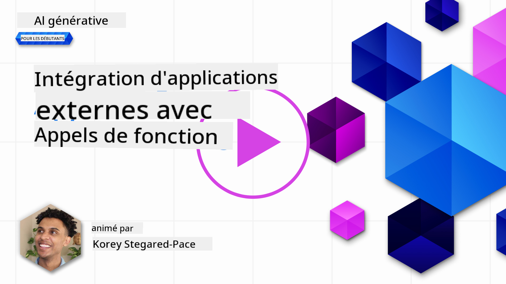
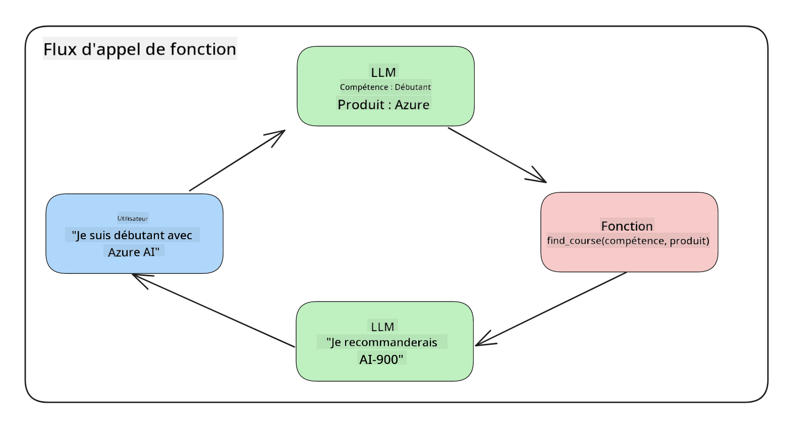
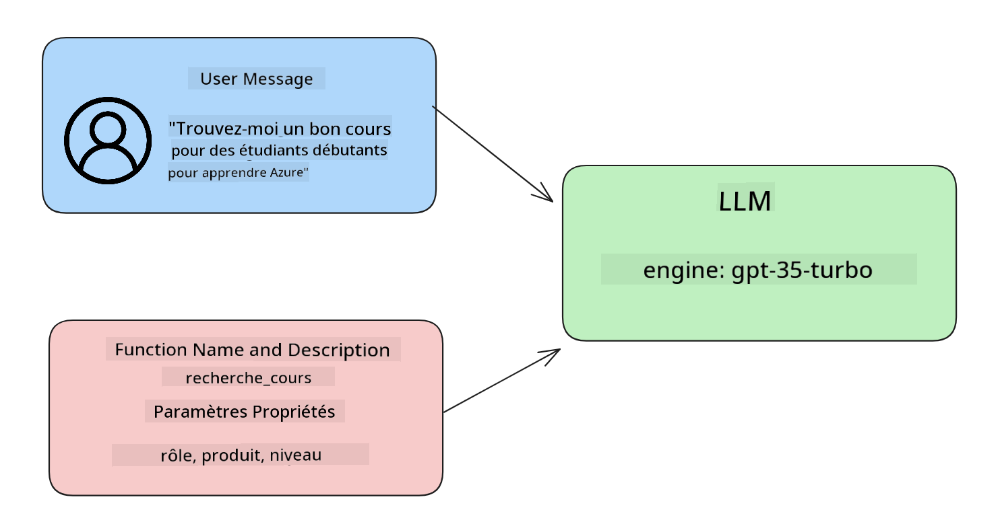

<!--
CO_OP_TRANSLATOR_METADATA:
{
  "original_hash": "77a48a201447be19aa7560706d6f93a0",
  "translation_date": "2025-05-19T21:18:15+00:00",
  "source_file": "11-integrating-with-function-calling/README.md",
  "language_code": "fr"
}
-->
# Intégration avec l'appel de fonction

[](https://aka.ms/gen-ai-lesson11-gh?WT.mc_id=academic-105485-koreyst)

Vous avez déjà appris pas mal de choses dans les leçons précédentes. Cependant, nous pouvons encore nous améliorer. Certaines choses que nous pouvons aborder sont la façon dont nous pouvons obtenir un format de réponse plus cohérent pour faciliter le travail avec la réponse en aval. De plus, nous pourrions vouloir ajouter des données provenant d'autres sources pour enrichir davantage notre application.

Les problèmes mentionnés ci-dessus sont ce que ce chapitre cherche à résoudre.

## Introduction

Cette leçon couvrira :

- Expliquer ce qu'est l'appel de fonction et ses cas d'utilisation.
- Créer un appel de fonction en utilisant Azure OpenAI.
- Comment intégrer un appel de fonction dans une application.

## Objectifs d'apprentissage

À la fin de cette leçon, vous serez capable de :

- Expliquer l'objectif de l'utilisation de l'appel de fonction.
- Configurer l'appel de fonction en utilisant le service Azure OpenAI.
- Concevoir des appels de fonction efficaces pour le cas d'utilisation de votre application.

## Scénario : Améliorer notre chatbot avec des fonctions

Pour cette leçon, nous voulons créer une fonctionnalité pour notre startup éducative qui permet aux utilisateurs d'utiliser un chatbot pour trouver des cours techniques. Nous recommanderons des cours qui correspondent à leur niveau de compétence, leur rôle actuel et la technologie qui les intéresse.

Pour compléter ce scénario, nous utiliserons une combinaison de :

- `Azure OpenAI` pour créer une expérience de chat pour l'utilisateur.
- `Microsoft Learn Catalog API` pour aider les utilisateurs à trouver des cours en fonction de leur demande.
- `Function Calling` pour prendre la requête de l'utilisateur et l'envoyer à une fonction pour faire la demande d'API.

Pour commencer, examinons pourquoi nous voudrions utiliser l'appel de fonction en premier lieu :

## Pourquoi l'appel de fonction

Avant l'appel de fonction, les réponses d'un LLM étaient non structurées et incohérentes. Les développeurs devaient écrire un code de validation complexe pour s'assurer qu'ils pouvaient gérer chaque variation d'une réponse. Les utilisateurs ne pouvaient pas obtenir des réponses comme "Quel est le temps actuel à Stockholm ?". Cela est dû au fait que les modèles étaient limités à la période pendant laquelle les données ont été formées.

L'appel de fonction est une fonctionnalité du service Azure OpenAI pour surmonter les limitations suivantes :

- **Format de réponse cohérent**. Si nous pouvons mieux contrôler le format de la réponse, nous pouvons plus facilement intégrer la réponse en aval dans d'autres systèmes.
- **Données externes**. Capacité à utiliser des données provenant d'autres sources d'une application dans un contexte de chat.

## Illustration du problème à travers un scénario

> Nous vous recommandons d'utiliser le [notebook inclus](../../../11-integrating-with-function-calling/python/aoai-assignment.ipynb) si vous souhaitez exécuter le scénario ci-dessous. Vous pouvez également simplement suivre la lecture alors que nous essayons d'illustrer un problème où les fonctions peuvent aider à résoudre le problème.

Regardons l'exemple qui illustre le problème de format de réponse :

Disons que nous voulons créer une base de données de données d'étudiants afin de pouvoir leur suggérer le bon cours. Ci-dessous, nous avons deux descriptions d'étudiants qui sont très similaires dans les données qu'elles contiennent.

1. Créer une connexion à notre ressource Azure OpenAI :

   ```python
   import os
   import json
   from openai import AzureOpenAI
   from dotenv import load_dotenv
   load_dotenv()

   client = AzureOpenAI(
   api_key=os.environ['AZURE_OPENAI_API_KEY'],  # this is also the default, it can be omitted
   api_version = "2023-07-01-preview"
   )

   deployment=os.environ['AZURE_OPENAI_DEPLOYMENT']
   ```

   Ci-dessous se trouve du code Python pour configurer notre connexion à Azure OpenAI où nous définissons `api_type`, `api_base`, `api_version` and `api_key`.

1. Creating two student descriptions using variables `student_1_description` and `student_2_description`.

   ```python
   student_1_description="Emily Johnson is a sophomore majoring in computer science at Duke University. She has a 3.7 GPA. Emily is an active member of the university's Chess Club and Debate Team. She hopes to pursue a career in software engineering after graduating."

   student_2_description = "Michael Lee is a sophomore majoring in computer science at Stanford University. He has a 3.8 GPA. Michael is known for his programming skills and is an active member of the university's Robotics Club. He hopes to pursue a career in artificial intelligence after finishing his studies."
   ```

   Nous voulons envoyer les descriptions d'étudiants ci-dessus à un LLM pour analyser les données. Ces données peuvent ensuite être utilisées dans notre application et être envoyées à une API ou stockées dans une base de données.

1. Créons deux invites identiques dans lesquelles nous instruisons le LLM sur les informations qui nous intéressent :

   ```python
   prompt1 = f'''
   Please extract the following information from the given text and return it as a JSON object:

   name
   major
   school
   grades
   club

   This is the body of text to extract the information from:
   {student_1_description}
   '''

   prompt2 = f'''
   Please extract the following information from the given text and return it as a JSON object:

   name
   major
   school
   grades
   club

   This is the body of text to extract the information from:
   {student_2_description}
   '''
   ```

   Les invites ci-dessus instruisent le LLM à extraire des informations et à retourner la réponse au format JSON.

1. Après avoir configuré les invites et la connexion à Azure OpenAI, nous allons maintenant envoyer les invites au LLM en utilisant `openai.ChatCompletion`. We store the prompt in the `messages` variable and assign the role to `user`. Cela imite un message d'un utilisateur écrit à un chatbot.

   ```python
   # response from prompt one
   openai_response1 = client.chat.completions.create(
   model=deployment,
   messages = [{'role': 'user', 'content': prompt1}]
   )
   openai_response1.choices[0].message.content

   # response from prompt two
   openai_response2 = client.chat.completions.create(
   model=deployment,
   messages = [{'role': 'user', 'content': prompt2}]
   )
   openai_response2.choices[0].message.content
   ```

Maintenant, nous pouvons envoyer les deux demandes au LLM et examiner la réponse que nous recevons en la trouvant comme suit `openai_response1['choices'][0]['message']['content']`.

1. Lastly, we can convert the response to JSON format by calling `json.loads` :

   ```python
   # Loading the response as a JSON object
   json_response1 = json.loads(openai_response1.choices[0].message.content)
   json_response1
   ```

   Réponse 1 :

   ```json
   {
     "name": "Emily Johnson",
     "major": "computer science",
     "school": "Duke University",
     "grades": "3.7",
     "club": "Chess Club"
   }
   ```

   Réponse 2 :

   ```json
   {
     "name": "Michael Lee",
     "major": "computer science",
     "school": "Stanford University",
     "grades": "3.8 GPA",
     "club": "Robotics Club"
   }
   ```

   Même si les invites sont les mêmes et les descriptions similaires, nous voyons des valeurs de `Grades` property formatted differently, as we can sometimes get the format `3.7` or `3.7 GPA` for example.

   This result is because the LLM takes unstructured data in the form of the written prompt and returns also unstructured data. We need to have a structured format so that we know what to expect when storing or using this data

So how do we solve the formatting problem then? By using functional calling, we can make sure that we receive structured data back. When using function calling, the LLM does not actually call or run any functions. Instead, we create a structure for the LLM to follow for its responses. We then use those structured responses to know what function to run in our applications.



We can then take what is returned from the function and send this back to the LLM. The LLM will then respond using natural language to answer the user's query.

## Use Cases for using function calls

There are many different use cases where function calls can improve your app like:

- **Calling External Tools**. Chatbots are great at providing answers to questions from users. By using function calling, the chatbots can use messages from users to complete certain tasks. For example, a student can ask the chatbot to "Send an email to my instructor saying I need more assistance with this subject". This can make a function call to `send_email(to: string, body: string)`

- **Create API or Database Queries**. Users can find information using natural language that gets converted into a formatted query or API request. An example of this could be a teacher who requests "Who are the students that completed the last assignment" which could call a function named `get_completed(student_name: string, assignment: int, current_status: string)`

- **Creating Structured Data**. Users can take a block of text or CSV and use the LLM to extract important information from it. For example, a student can convert a Wikipedia article about peace agreements to create AI flashcards. This can be done by using a function called `get_important_facts(agreement_name: string, date_signed: string, parties_involved: list)`

## Creating Your First Function Call

The process of creating a function call includes 3 main steps:

1. **Calling** the Chat Completions API with a list of your functions and a user message.
2. **Reading** the model's response to perform an action i.e. execute a function or API Call.
3. **Making** another call to Chat Completions API with the response from your function to use that information to create a response to the user.



### Step 1 - creating messages

The first step is to create a user message. This can be dynamically assigned by taking the value of a text input or you can assign a value here. If this is your first time working with the Chat Completions API, we need to define the `role` and the `content` of the message.

The `role` can be either `system` (creating rules), `assistant` (the model) or `user` (the end-user). For function calling, we will assign this as `user` et une question d'exemple.

```python
messages= [ {"role": "user", "content": "Find me a good course for a beginner student to learn Azure."} ]
```

En assignant différents rôles, il est clair pour le LLM si c'est le système qui dit quelque chose ou l'utilisateur, ce qui aide à construire un historique de conversation sur lequel le LLM peut se baser.

### Étape 2 - création de fonctions

Ensuite, nous allons définir une fonction et les paramètres de cette fonction. Nous utiliserons ici une seule fonction appelée `search_courses` but you can create multiple functions.

> **Important** : Functions are included in the system message to the LLM and will be included in the amount of available tokens you have available.

Below, we create the functions as an array of items. Each item is a function and has properties `name`, `description` and `parameters` :

```python
functions = [
   {
      "name":"search_courses",
      "description":"Retrieves courses from the search index based on the parameters provided",
      "parameters":{
         "type":"object",
         "properties":{
            "role":{
               "type":"string",
               "description":"The role of the learner (i.e. developer, data scientist, student, etc.)"
            },
            "product":{
               "type":"string",
               "description":"The product that the lesson is covering (i.e. Azure, Power BI, etc.)"
            },
            "level":{
               "type":"string",
               "description":"The level of experience the learner has prior to taking the course (i.e. beginner, intermediate, advanced)"
            }
         },
         "required":[
            "role"
         ]
      }
   }
]
```

Décrivons chaque instance de fonction plus en détail ci-dessous :

- `name` - The name of the function that we want to have called.
- `description` - This is the description of how the function works. Here it's important to be specific and clear.
- `parameters` - A list of values and format that you want the model to produce in its response. The parameters array consists of items where the items have the following properties:
  1.  `type` - The data type of the properties will be stored in.
  1.  `properties` - List of the specific values that the model will use for its response
      1. `name` - The key is the name of the property that the model will use in its formatted response, for example, `product`.
      1. `type` - The data type of this property, for example, `string`.
      1. `description` - Description of the specific property.

There's also an optional property `required` - required property for the function call to be completed.

### Step 3 - Making the function call

After defining a function, we now need to include it in the call to the Chat Completion API. We do this by adding `functions` to the request. In this case `functions=functions`.

There is also an option to set `function_call` to `auto`. This means we will let the LLM decide which function should be called based on the user message rather than assigning it ourselves.

Here's some code below where we call `ChatCompletion.create`, note how we set `functions=functions` and `function_call="auto"` et ainsi donner au LLM le choix de quand appeler les fonctions que nous lui fournissons :

```python
response = client.chat.completions.create(model=deployment,
                                        messages=messages,
                                        functions=functions,
                                        function_call="auto")

print(response.choices[0].message)
```

La réponse qui revient maintenant ressemble à ceci :

```json
{
  "role": "assistant",
  "function_call": {
    "name": "search_courses",
    "arguments": "{\n  \"role\": \"student\",\n  \"product\": \"Azure\",\n  \"level\": \"beginner\"\n}"
  }
}
```

Ici, nous pouvons voir comment la fonction `search_courses` was called and with what arguments, as listed in the `arguments` property in the JSON response.

The conclusion the LLM was able to find the data to fit the arguments of the function as it was extracting it from the value provided to the `messages` parameter in the chat completion call. Below is a reminder of the `messages` valeur :

```python
messages= [ {"role": "user", "content": "Find me a good course for a beginner student to learn Azure."} ]
```

Comme vous pouvez le voir, `student`, `Azure` and `beginner` was extracted from `messages` and set as input to the function. Using functions this way is a great way to extract information from a prompt but also to provide structure to the LLM and have reusable functionality.

Next, we need to see how we can use this in our app.

## Integrating Function Calls into an Application

After we have tested the formatted response from the LLM, we can now integrate this into an application.

### Managing the flow

To integrate this into our application, let's take the following steps:

1. First, let's make the call to the OpenAI services and store the message in a variable called `response_message`.

   ```python
   response_message = response.choices[0].message
   ```

1. Maintenant, nous allons définir la fonction qui appellera l'API Microsoft Learn pour obtenir une liste de cours :

   ```python
   import requests

   def search_courses(role, product, level):
     url = "https://learn.microsoft.com/api/catalog/"
     params = {
        "role": role,
        "product": product,
        "level": level
     }
     response = requests.get(url, params=params)
     modules = response.json()["modules"]
     results = []
     for module in modules[:5]:
        title = module["title"]
        url = module["url"]
        results.append({"title": title, "url": url})
     return str(results)
   ```

   Notez comment nous créons maintenant une véritable fonction Python qui correspond aux noms de fonctions introduits dans les `functions` variable. We're also making real external API calls to fetch the data we need. In this case, we go against the Microsoft Learn API to search for training modules.

Ok, so we created `functions` variables and a corresponding Python function, how do we tell the LLM how to map these two together so our Python function is called?

1. To see if we need to call a Python function, we need to look into the LLM response and see if `function_call` en fait partie et appelle la fonction indiquée. Voici comment vous pouvez effectuer la vérification mentionnée ci-dessous :

   ```python
   # Check if the model wants to call a function
   if response_message.function_call.name:
    print("Recommended Function call:")
    print(response_message.function_call.name)
    print()

    # Call the function.
    function_name = response_message.function_call.name

    available_functions = {
            "search_courses": search_courses,
    }
    function_to_call = available_functions[function_name]

    function_args = json.loads(response_message.function_call.arguments)
    function_response = function_to_call(**function_args)

    print("Output of function call:")
    print(function_response)
    print(type(function_response))


    # Add the assistant response and function response to the messages
    messages.append( # adding assistant response to messages
        {
            "role": response_message.role,
            "function_call": {
                "name": function_name,
                "arguments": response_message.function_call.arguments,
            },
            "content": None
        }
    )
    messages.append( # adding function response to messages
        {
            "role": "function",
            "name": function_name,
            "content":function_response,
        }
    )
   ```

   Ces trois lignes garantissent que nous extrayons le nom de la fonction, les arguments et effectuons l'appel :

   ```python
   function_to_call = available_functions[function_name]

   function_args = json.loads(response_message.function_call.arguments)
   function_response = function_to_call(**function_args)
   ```

   Ci-dessous se trouve le résultat de l'exécution de notre code :

   **Sortie**

   ```Recommended Function call:
   {
     "name": "search_courses",
     "arguments": "{\n  \"role\": \"student\",\n  \"product\": \"Azure\",\n  \"level\": \"beginner\"\n}"
   }

   Output of function call:
   [{'title': 'Describe concepts of cryptography', 'url': 'https://learn.microsoft.com/training/modules/describe-concepts-of-cryptography/?
   WT.mc_id=api_CatalogApi'}, {'title': 'Introduction to audio classification with TensorFlow', 'url': 'https://learn.microsoft.com/en-
   us/training/modules/intro-audio-classification-tensorflow/?WT.mc_id=api_CatalogApi'}, {'title': 'Design a Performant Data Model in Azure SQL
   Database with Azure Data Studio', 'url': 'https://learn.microsoft.com/training/modules/design-a-data-model-with-ads/?
   WT.mc_id=api_CatalogApi'}, {'title': 'Getting started with the Microsoft Cloud Adoption Framework for Azure', 'url':
   'https://learn.microsoft.com/training/modules/cloud-adoption-framework-getting-started/?WT.mc_id=api_CatalogApi'}, {'title': 'Set up the
   Rust development environment', 'url': 'https://learn.microsoft.com/training/modules/rust-set-up-environment/?WT.mc_id=api_CatalogApi'}]
   <class 'str'>
   ```

1. Maintenant, nous allons envoyer le message mis à jour, `messages` au LLM afin que nous puissions recevoir une réponse en langage naturel au lieu d'une réponse au format JSON d'API.

   ```python
   print("Messages in next request:")
   print(messages)
   print()

   second_response = client.chat.completions.create(
      messages=messages,
      model=deployment,
      function_call="auto",
      functions=functions,
      temperature=0
         )  # get a new response from GPT where it can see the function response


   print(second_response.choices[0].message)
   ```

   **Sortie**

   ```python
   {
     "role": "assistant",
     "content": "I found some good courses for beginner students to learn Azure:\n\n1. [Describe concepts of cryptography] (https://learn.microsoft.com/training/modules/describe-concepts-of-cryptography/?WT.mc_id=api_CatalogApi)\n2. [Introduction to audio classification with TensorFlow](https://learn.microsoft.com/training/modules/intro-audio-classification-tensorflow/?WT.mc_id=api_CatalogApi)\n3. [Design a Performant Data Model in Azure SQL Database with Azure Data Studio](https://learn.microsoft.com/training/modules/design-a-data-model-with-ads/?WT.mc_id=api_CatalogApi)\n4. [Getting started with the Microsoft Cloud Adoption Framework for Azure](https://learn.microsoft.com/training/modules/cloud-adoption-framework-getting-started/?WT.mc_id=api_CatalogApi)\n5. [Set up the Rust development environment](https://learn.microsoft.com/training/modules/rust-set-up-environment/?WT.mc_id=api_CatalogApi)\n\nYou can click on the links to access the courses."
   }

   ```

## Devoir

Pour continuer votre apprentissage de l'appel de fonction Azure OpenAI, vous pouvez créer :

- Plus de paramètres de la fonction qui pourraient aider les apprenants à trouver plus de cours.
- Créer un autre appel de fonction qui prend plus d'informations de l'apprenant comme sa langue maternelle.
- Créer une gestion des erreurs lorsque l'appel de fonction et/ou l'appel d'API ne renvoie pas de cours appropriés.

Indice : Suivez la page [documentation de référence API Learn](https://learn.microsoft.com/training/support/catalog-api-developer-reference?WT.mc_id=academic-105485-koreyst) pour voir comment et où ces données sont disponibles.

## Excellent travail ! Continuez votre parcours

Après avoir terminé cette leçon, consultez notre [collection d'apprentissage de l'IA générative](https://aka.ms/genai-collection?WT.mc_id=academic-105485-koreyst) pour continuer à développer vos connaissances en IA générative !

Rendez-vous à la leçon 12, où nous examinerons comment [concevoir l'UX pour les applications IA](../12-designing-ux-for-ai-applications/README.md?WT.mc_id=academic-105485-koreyst) !

**Avertissement** :  
Ce document a été traduit à l'aide du service de traduction IA [Co-op Translator](https://github.com/Azure/co-op-translator). Bien que nous nous efforcions d'assurer l'exactitude, veuillez noter que les traductions automatisées peuvent contenir des erreurs ou des inexactitudes. Le document original dans sa langue d'origine doit être considéré comme la source faisant autorité. Pour des informations critiques, une traduction humaine professionnelle est recommandée. Nous ne sommes pas responsables des malentendus ou des mauvaises interprétations résultant de l'utilisation de cette traduction.