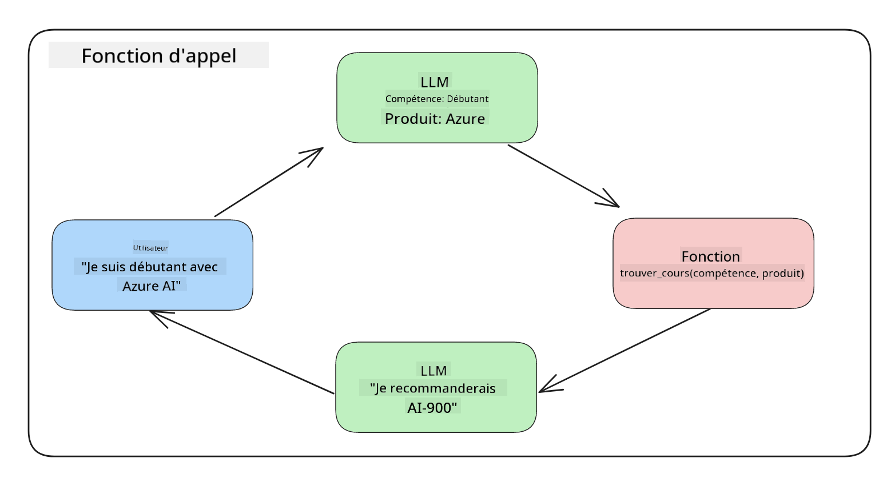
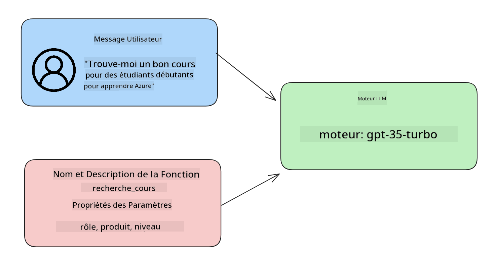

<!--
CO_OP_TRANSLATOR_METADATA:
{
  "original_hash": "77a48a201447be19aa7560706d6f93a0",
  "translation_date": "2025-07-09T14:21:28+00:00",
  "source_file": "11-integrating-with-function-calling/README.md",
  "language_code": "fr"
}
-->
# Intégration avec l’appel de fonctions

[](https://aka.ms/gen-ai-lesson11-gh?WT.mc_id=academic-105485-koreyst)

Vous avez déjà appris pas mal de choses dans les leçons précédentes. Cependant, nous pouvons encore nous améliorer. Certains points à aborder sont comment obtenir un format de réponse plus cohérent pour faciliter le traitement en aval. De plus, nous pourrions vouloir ajouter des données provenant d’autres sources pour enrichir davantage notre application.

Les problèmes mentionnés ci-dessus sont ceux que ce chapitre cherche à résoudre.

## Introduction

Cette leçon couvrira :

- Expliquer ce qu’est l’appel de fonction et ses cas d’utilisation.
- Créer un appel de fonction avec Azure OpenAI.
- Comment intégrer un appel de fonction dans une application.

## Objectifs d’apprentissage

À la fin de cette leçon, vous serez capable de :

- Expliquer l’intérêt d’utiliser l’appel de fonction.
- Configurer un appel de fonction avec le service Azure OpenAI.
- Concevoir des appels de fonction efficaces pour le cas d’usage de votre application.

## Scénario : Améliorer notre chatbot avec des fonctions

Pour cette leçon, nous souhaitons développer une fonctionnalité pour notre startup éducative qui permet aux utilisateurs d’utiliser un chatbot pour trouver des cours techniques. Nous recommanderons des cours adaptés à leur niveau de compétence, leur rôle actuel et la technologie qui les intéresse.

Pour réaliser ce scénario, nous utiliserons une combinaison de :

- `Azure OpenAI` pour créer une expérience de chat pour l’utilisateur.
- `Microsoft Learn Catalog API` pour aider les utilisateurs à trouver des cours selon leur demande.
- `Function Calling` pour prendre la requête de l’utilisateur et l’envoyer à une fonction qui effectuera la requête API.

Pour commencer, voyons pourquoi nous voudrions utiliser l’appel de fonction en premier lieu :

## Pourquoi l’appel de fonction

Avant l’appel de fonction, les réponses d’un LLM étaient non structurées et inconsistantes. Les développeurs devaient écrire du code de validation complexe pour gérer chaque variation de réponse. Les utilisateurs ne pouvaient pas obtenir de réponses précises comme « Quel temps fait-il actuellement à Stockholm ? ». Cela s’explique par le fait que les modèles étaient limités aux données sur lesquelles ils avaient été entraînés.

L’appel de fonction est une fonctionnalité du service Azure OpenAI qui permet de surmonter les limitations suivantes :

- **Format de réponse cohérent**. Si nous pouvons mieux contrôler le format de la réponse, il est plus facile d’intégrer cette réponse dans d’autres systèmes en aval.
- **Données externes**. Possibilité d’utiliser des données provenant d’autres sources d’une application dans un contexte de chat.

## Illustration du problème à travers un scénario

> Nous vous recommandons d’utiliser le [notebook inclus](../../../11-integrating-with-function-calling/python/aoai-assignment.ipynb) si vous souhaitez exécuter le scénario ci-dessous. Vous pouvez aussi simplement lire, car nous essayons d’illustrer un problème que les fonctions peuvent aider à résoudre.

Regardons l’exemple qui illustre le problème du format de réponse :

Supposons que nous voulions créer une base de données d’informations sur des étudiants afin de leur suggérer le bon cours. Ci-dessous, nous avons deux descriptions d’étudiants très similaires dans les données qu’elles contiennent.

1. Créez une connexion à notre ressource Azure OpenAI :

   ```python
   import os
   import json
   from openai import AzureOpenAI
   from dotenv import load_dotenv
   load_dotenv()

   client = AzureOpenAI(
   api_key=os.environ['AZURE_OPENAI_API_KEY'],  # this is also the default, it can be omitted
   api_version = "2023-07-01-preview"
   )

   deployment=os.environ['AZURE_OPENAI_DEPLOYMENT']
   ```

   Voici un extrait de code Python pour configurer notre connexion à Azure OpenAI où nous définissons `api_type`, `api_base`, `api_version` et `api_key`.

1. Création de deux descriptions d’étudiants avec les variables `student_1_description` et `student_2_description`.

   ```python
   student_1_description="Emily Johnson is a sophomore majoring in computer science at Duke University. She has a 3.7 GPA. Emily is an active member of the university's Chess Club and Debate Team. She hopes to pursue a career in software engineering after graduating."

   student_2_description = "Michael Lee is a sophomore majoring in computer science at Stanford University. He has a 3.8 GPA. Michael is known for his programming skills and is an active member of the university's Robotics Club. He hopes to pursue a career in artificial intelligence after finishing his studies."
   ```

   Nous voulons envoyer ces descriptions d’étudiants à un LLM pour analyser les données. Ces données pourront ensuite être utilisées dans notre application, envoyées à une API ou stockées dans une base de données.

1. Créons deux prompts identiques dans lesquels nous indiquons au LLM quelles informations nous souhaitons obtenir :

   ```python
   prompt1 = f'''
   Please extract the following information from the given text and return it as a JSON object:

   name
   major
   school
   grades
   club

   This is the body of text to extract the information from:
   {student_1_description}
   '''

   prompt2 = f'''
   Please extract the following information from the given text and return it as a JSON object:

   name
   major
   school
   grades
   club

   This is the body of text to extract the information from:
   {student_2_description}
   '''
   ```

   Les prompts ci-dessus demandent au LLM d’extraire les informations et de retourner la réponse au format JSON.

1. Après avoir configuré les prompts et la connexion à Azure OpenAI, nous allons maintenant envoyer les prompts au LLM en utilisant `openai.ChatCompletion`. Nous stockons le prompt dans la variable `messages` et attribuons le rôle `user`. Cela simule un message d’un utilisateur envoyé à un chatbot.

   ```python
   # response from prompt one
   openai_response1 = client.chat.completions.create(
   model=deployment,
   messages = [{'role': 'user', 'content': prompt1}]
   )
   openai_response1.choices[0].message.content

   # response from prompt two
   openai_response2 = client.chat.completions.create(
   model=deployment,
   messages = [{'role': 'user', 'content': prompt2}]
   )
   openai_response2.choices[0].message.content
   ```

Nous pouvons maintenant envoyer les deux requêtes au LLM et examiner la réponse reçue en la récupérant ainsi : `openai_response1['choices'][0]['message']['content']`.

1. Enfin, nous pouvons convertir la réponse au format JSON en appelant `json.loads` :

   ```python
   # Loading the response as a JSON object
   json_response1 = json.loads(openai_response1.choices[0].message.content)
   json_response1
   ```

   Réponse 1 :

   ```json
   {
     "name": "Emily Johnson",
     "major": "computer science",
     "school": "Duke University",
     "grades": "3.7",
     "club": "Chess Club"
   }
   ```

   Réponse 2 :

   ```json
   {
     "name": "Michael Lee",
     "major": "computer science",
     "school": "Stanford University",
     "grades": "3.8 GPA",
     "club": "Robotics Club"
   }
   ```

   Bien que les prompts soient identiques et que les descriptions soient similaires, nous constatons que les valeurs de la propriété `Grades` sont formatées différemment, car on peut parfois obtenir le format `3.7` ou `3.7 GPA` par exemple.

   Ce résultat s’explique par le fait que le LLM prend des données non structurées sous forme de prompt écrit et retourne également des données non structurées. Nous avons besoin d’un format structuré pour savoir à quoi nous attendre lors du stockage ou de l’utilisation de ces données.

Alors, comment résoudre ce problème de formatage ? En utilisant l’appel de fonction, nous pouvons nous assurer de recevoir des données structurées en retour. Lorsqu’on utilise l’appel de fonction, le LLM n’exécute pas réellement de fonctions. À la place, nous créons une structure que le LLM doit suivre pour ses réponses. Nous utilisons ensuite ces réponses structurées pour savoir quelle fonction exécuter dans nos applications.



Nous pouvons ensuite prendre ce qui est retourné par la fonction et le renvoyer au LLM. Le LLM répondra alors en langage naturel pour répondre à la requête de l’utilisateur.

## Cas d’utilisation des appels de fonction

Il existe de nombreux cas où les appels de fonction peuvent améliorer votre application, comme :

- **Appeler des outils externes**. Les chatbots sont excellents pour répondre aux questions des utilisateurs. En utilisant l’appel de fonction, les chatbots peuvent utiliser les messages des utilisateurs pour accomplir certaines tâches. Par exemple, un étudiant peut demander au chatbot « Envoie un email à mon instructeur pour lui dire que j’ai besoin de plus d’aide sur ce sujet ». Cela peut déclencher un appel de fonction `send_email(to: string, body: string)`.

- **Créer des requêtes API ou base de données**. Les utilisateurs peuvent trouver des informations en langage naturel qui sont converties en requête formatée ou requête API. Par exemple, un enseignant peut demander « Qui sont les étudiants qui ont terminé le dernier devoir » ce qui pourrait appeler une fonction nommée `get_completed(student_name: string, assignment: int, current_status: string)`.

- **Créer des données structurées**. Les utilisateurs peuvent prendre un bloc de texte ou un CSV et utiliser le LLM pour en extraire les informations importantes. Par exemple, un étudiant peut convertir un article Wikipedia sur les accords de paix pour créer des fiches de révision AI. Cela peut être fait en utilisant une fonction appelée `get_important_facts(agreement_name: string, date_signed: string, parties_involved: list)`.

## Créer votre premier appel de fonction

Le processus de création d’un appel de fonction comprend 3 étapes principales :

1. **Appeler** l’API Chat Completions avec une liste de vos fonctions et un message utilisateur.
2. **Lire** la réponse du modèle pour effectuer une action, c’est-à-dire exécuter une fonction ou un appel API.
3. **Faire** un autre appel à l’API Chat Completions avec la réponse de votre fonction pour utiliser cette information afin de créer une réponse à l’utilisateur.



### Étape 1 - créer les messages

La première étape est de créer un message utilisateur. Celui-ci peut être assigné dynamiquement en prenant la valeur d’un champ texte ou vous pouvez assigner une valeur ici. Si c’est la première fois que vous travaillez avec l’API Chat Completions, il faut définir le `role` et le `content` du message.

Le `role` peut être `system` (création de règles), `assistant` (le modèle) ou `user` (l’utilisateur final). Pour l’appel de fonction, nous assignerons `user` avec une question d’exemple.

```python
messages= [ {"role": "user", "content": "Find me a good course for a beginner student to learn Azure."} ]
```

En assignant différents rôles, il est clair pour le LLM si c’est le système ou l’utilisateur qui parle, ce qui aide à construire un historique de conversation sur lequel le LLM peut s’appuyer.

### Étape 2 - créer les fonctions

Ensuite, nous allons définir une fonction et ses paramètres. Nous utiliserons ici une seule fonction appelée `search_courses`, mais vous pouvez en créer plusieurs.

> **Important** : Les fonctions sont incluses dans le message système envoyé au LLM et comptent dans le nombre de tokens disponibles.

Ci-dessous, nous créons les fonctions sous forme d’un tableau d’éléments. Chaque élément est une fonction avec les propriétés `name`, `description` et `parameters` :

```python
functions = [
   {
      "name":"search_courses",
      "description":"Retrieves courses from the search index based on the parameters provided",
      "parameters":{
         "type":"object",
         "properties":{
            "role":{
               "type":"string",
               "description":"The role of the learner (i.e. developer, data scientist, student, etc.)"
            },
            "product":{
               "type":"string",
               "description":"The product that the lesson is covering (i.e. Azure, Power BI, etc.)"
            },
            "level":{
               "type":"string",
               "description":"The level of experience the learner has prior to taking the course (i.e. beginner, intermediate, advanced)"
            }
         },
         "required":[
            "role"
         ]
      }
   }
]
```

Décrivons chaque instance de fonction plus en détail :

- `name` - Le nom de la fonction que nous voulons appeler.
- `description` - Description du fonctionnement de la fonction. Il est important d’être précis et clair ici.
- `parameters` - Une liste des valeurs et du format que vous souhaitez que le modèle produise dans sa réponse. Le tableau `parameters` contient des éléments avec les propriétés suivantes :
  1.  `type` - Le type de données des propriétés.
  1.  `properties` - Liste des valeurs spécifiques que le modèle utilisera dans sa réponse
      1. `name` - La clé est le nom de la propriété que le modèle utilisera dans sa réponse formatée, par exemple `product`.
      1. `type` - Le type de données de cette propriété, par exemple `string`.
      1. `description` - Description de la propriété spécifique.

Il existe aussi une propriété optionnelle `required` - propriété obligatoire pour que l’appel de fonction soit complet.

### Étape 3 - Faire l’appel de fonction

Après avoir défini une fonction, il faut maintenant l’inclure dans l’appel à l’API Chat Completion. On fait cela en ajoutant `functions` à la requête. Ici, `functions=functions`.

Il est aussi possible de définir `function_call` à `auto`. Cela signifie que l’on laisse le LLM décider quelle fonction appeler en fonction du message utilisateur, plutôt que de l’assigner nous-mêmes.

Voici un extrait de code où nous appelons `ChatCompletion.create`, notez comment nous définissons `functions=functions` et `function_call="auto"`, laissant ainsi le choix au LLM de déclencher les fonctions que nous lui fournissons :

```python
response = client.chat.completions.create(model=deployment,
                                        messages=messages,
                                        functions=functions,
                                        function_call="auto")

print(response.choices[0].message)
```

La réponse reçue ressemble maintenant à ceci :

```json
{
  "role": "assistant",
  "function_call": {
    "name": "search_courses",
    "arguments": "{\n  \"role\": \"student\",\n  \"product\": \"Azure\",\n  \"level\": \"beginner\"\n}"
  }
}
```

On peut voir que la fonction `search_courses` a été appelée avec quels arguments, listés dans la propriété `arguments` de la réponse JSON.

La conclusion est que le LLM a pu trouver les données correspondant aux arguments de la fonction en les extrayant de la valeur fournie au paramètre `messages` dans l’appel de chat completion. Ci-dessous un rappel de la valeur `messages` :

```python
messages= [ {"role": "user", "content": "Find me a good course for a beginner student to learn Azure."} ]
```

Comme vous pouvez le voir, `student`, `Azure` et `beginner` ont été extraits de `messages` et utilisés comme entrée pour la fonction. Utiliser les fonctions de cette manière est un excellent moyen d’extraire des informations d’un prompt mais aussi de structurer le LLM et d’avoir des fonctionnalités réutilisables.

Voyons maintenant comment utiliser cela dans notre application.

## Intégrer les appels de fonction dans une application

Après avoir testé la réponse formatée du LLM, nous pouvons maintenant l’intégrer dans une application.

### Gérer le flux

Pour intégrer cela dans notre application, suivons les étapes suivantes :

1. Tout d’abord, faisons l’appel aux services OpenAI et stockons le message dans une variable appelée `response_message`.

   ```python
   response_message = response.choices[0].message
   ```

1. Maintenant, nous allons définir la fonction qui appellera l’API Microsoft Learn pour obtenir une liste de cours :

   ```python
   import requests

   def search_courses(role, product, level):
     url = "https://learn.microsoft.com/api/catalog/"
     params = {
        "role": role,
        "product": product,
        "level": level
     }
     response = requests.get(url, params=params)
     modules = response.json()["modules"]
     results = []
     for module in modules[:5]:
        title = module["title"]
        url = module["url"]
        results.append({"title": title, "url": url})
     return str(results)
   ```

   Notez que nous créons maintenant une fonction Python réelle qui correspond aux noms de fonctions introduits dans la variable `functions`. Nous effectuons aussi de vraies requêtes API externes pour récupérer les données nécessaires. Ici, nous interrogeons l’API Microsoft Learn pour rechercher des modules de formation.

Ok, nous avons créé la variable `functions` et une fonction Python correspondante, comment indiquer au LLM comment faire le lien entre les deux pour que notre fonction Python soit appelée ?

1. Pour savoir si nous devons appeler une fonction Python, il faut examiner la réponse du LLM et vérifier si `function_call` en fait partie, puis appeler la fonction indiquée. Voici comment faire cette vérification :

   ```python
   # Check if the model wants to call a function
   if response_message.function_call.name:
    print("Recommended Function call:")
    print(response_message.function_call.name)
    print()

    # Call the function.
    function_name = response_message.function_call.name

    available_functions = {
            "search_courses": search_courses,
    }
    function_to_call = available_functions[function_name]

    function_args = json.loads(response_message.function_call.arguments)
    function_response = function_to_call(**function_args)

    print("Output of function call:")
    print(function_response)
    print(type(function_response))


    # Add the assistant response and function response to the messages
    messages.append( # adding assistant response to messages
        {
            "role": response_message.role,
            "function_call": {
                "name": function_name,
                "arguments": response_message.function_call.arguments,
            },
            "content": None
        }
    )
    messages.append( # adding function response to messages
        {
            "role": "function",
            "name": function_name,
            "content":function_response,
        }
    )
   ```

   Ces trois lignes permettent d’extraire le nom de la fonction, les arguments et d’effectuer l’appel :

   ```python
   function_to_call = available_functions[function_name]

   function_args = json.loads(response_message.function_call.arguments)
   function_response = function_to_call(**function_args)
   ```

   Voici la sortie obtenue en exécutant notre code :

   **Sortie**

   ```Recommended Function call:
   {
     "name": "search_courses",
     "arguments": "{\n  \"role\": \"student\",\n  \"product\": \"Azure\",\n  \"level\": \"beginner\"\n}"
   }

   Output of function call:
   [{'title': 'Describe concepts of cryptography', 'url': 'https://learn.microsoft.com/training/modules/describe-concepts-of-cryptography/?
   WT.mc_id=api_CatalogApi'}, {'title': 'Introduction to audio classification with TensorFlow', 'url': 'https://learn.microsoft.com/en-
   us/training/modules/intro-audio-classification-tensorflow/?WT.mc_id=api_CatalogApi'}, {'title': 'Design a Performant Data Model in Azure SQL
   Database with Azure Data Studio', 'url': 'https://learn.microsoft.com/training/modules/design-a-data-model-with-ads/?
   WT.mc_id=api_CatalogApi'}, {'title': 'Getting started with the Microsoft Cloud Adoption Framework for Azure', 'url':
   'https://learn.microsoft.com/training/modules/cloud-adoption-framework-getting-started/?WT.mc_id=api_CatalogApi'}, {'title': 'Set up the
   Rust development environment', 'url': 'https://learn.microsoft.com/training/modules/rust-set-up-environment/?WT.mc_id=api_CatalogApi'}]
   <class 'str'>
   ```

1. Maintenant, nous allons envoyer le message mis à jour, `messages` au LLM pour recevoir une réponse en langage naturel au lieu d’une réponse JSON formatée par l’API.

   ```python
   print("Messages in next request:")
   print(messages)
   print()

   second_response = client.chat.completions.create(
      messages=messages,
      model=deployment,
      function_call="auto",
      functions=functions,
      temperature=0
         )  # get a new response from GPT where it can see the function response


   print(second_response.choices[0].message)
   ```

   **Sortie**

   ```python
   {
     "role": "assistant",
     "content": "I found some good courses for beginner students to learn Azure:\n\n1. [Describe concepts of cryptography] (https://learn.microsoft.com/training/modules/describe-concepts-of-cryptography/?WT.mc_id=api_CatalogApi)\n2. [Introduction to audio classification with TensorFlow](https://learn.microsoft.com/training/modules/intro-audio-classification-tensorflow/?WT.mc_id=api_CatalogApi)\n3. [Design a Performant Data Model in Azure SQL Database with Azure Data Studio](https://learn.microsoft.com/training/modules/design-a-data-model-with-ads/?WT.mc_id=api_CatalogApi)\n4. [Getting started with the Microsoft Cloud Adoption Framework for Azure](https://learn.microsoft.com/training/modules/cloud-adoption-framework-getting-started/?WT.mc_id=api_CatalogApi)\n5. [Set up the Rust development environment](https://learn.microsoft.com/training/modules/rust-set-up-environment/?WT.mc_id=api_CatalogApi)\n\nYou can click on the links to access the courses."
   }

   ```

## Exercice

Pour continuer votre apprentissage de l’appel de fonction Azure OpenAI, vous pouvez développer :

- Plus de paramètres pour la fonction afin d’aider les apprenants à trouver davantage de cours.
- Créer un autre appel de fonction qui prend plus d’informations sur l’apprenant, comme sa langue maternelle.
- Mettre en place une gestion des erreurs lorsque l’appel de fonction et/ou l’appel API ne retourne pas de cours adaptés.
## Excellent travail ! Continuez l'aventure

Après avoir terminé cette leçon, consultez notre [collection d'apprentissage sur l'IA générative](https://aka.ms/genai-collection?WT.mc_id=academic-105485-koreyst) pour continuer à approfondir vos connaissances en IA générative !

Rendez-vous à la Leçon 12, où nous verrons comment [concevoir l'UX pour les applications d'IA](../12-designing-ux-for-ai-applications/README.md?WT.mc_id=academic-105485-koreyst) !

**Avertissement** :  
Ce document a été traduit à l’aide du service de traduction automatique [Co-op Translator](https://github.com/Azure/co-op-translator). Bien que nous nous efforcions d’assurer l’exactitude, veuillez noter que les traductions automatiques peuvent contenir des erreurs ou des inexactitudes. Le document original dans sa langue d’origine doit être considéré comme la source faisant foi. Pour les informations critiques, une traduction professionnelle réalisée par un humain est recommandée. Nous déclinons toute responsabilité en cas de malentendus ou de mauvaises interprétations résultant de l’utilisation de cette traduction.