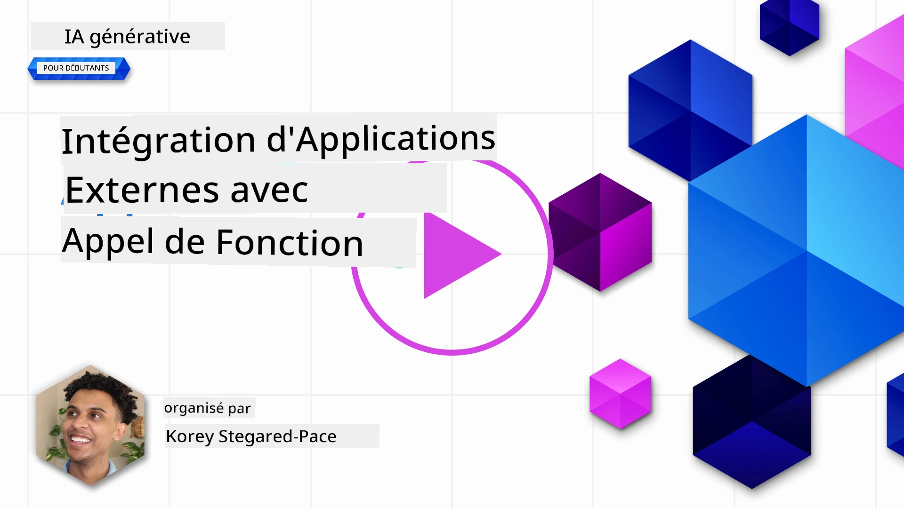
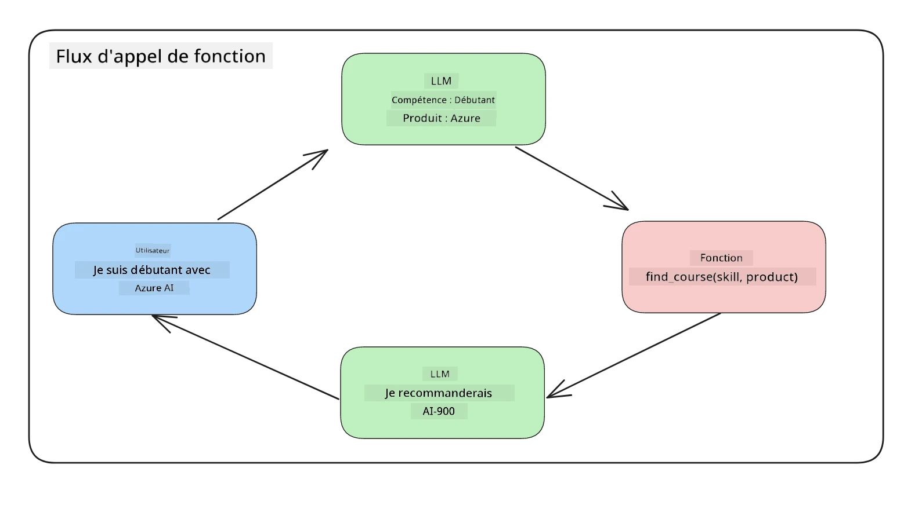
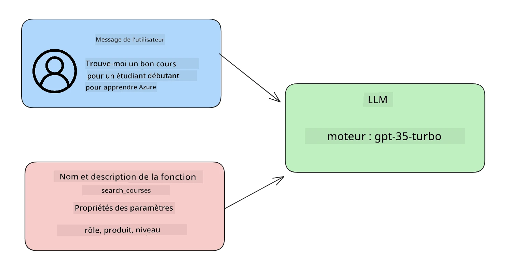

# Intégration avec l'appel de fonction

[](https://youtu.be/DgUdCLX8qYQ?si=f1ouQU5HQx6F8Gl2)

Vous avez déjà appris pas mal de choses dans les leçons précédentes. Cependant, nous pouvons encore améliorer. Certains points que nous pouvons aborder sont la manière d'obtenir un format de réponse plus cohérent pour faciliter le traitement de la réponse en aval. De plus, nous pourrions vouloir ajouter des données provenant d'autres sources pour enrichir davantage notre application.

Les problèmes mentionnés ci-dessus sont ceux que ce chapitre cherche à résoudre.

## Introduction

Cette leçon couvrira :

- Expliquer ce qu'est l'appel de fonction et ses cas d'utilisation.
- Créer un appel de fonction en utilisant Azure OpenAI.
- Comment intégrer un appel de fonction dans une application.

## Objectifs d'apprentissage

À la fin de cette leçon, vous serez capable de :

- Expliquer l'objectif de l'utilisation de l'appel de fonction.
- Configurer l'appel de fonction en utilisant le service Azure OpenAI.
- Concevoir des appels de fonction efficaces pour le cas d'utilisation de votre application.

## Scénario : Améliorer notre chatbot avec des fonctions

Pour cette leçon, nous souhaitons construire une fonctionnalité pour notre startup éducative qui permet aux utilisateurs d'utiliser un chatbot pour trouver des cours techniques. Nous recommanderons des cours adaptés à leur niveau de compétence, rôle actuel et technologie d'intérêt.

Pour compléter ce scénario, nous utiliserons une combinaison de :

- `Azure OpenAI` pour créer une expérience de chat pour l'utilisateur.
- `Microsoft Learn Catalog API` pour aider les utilisateurs à trouver des cours selon leur demande.
- `Function Calling` pour prendre la requête de l'utilisateur et l'envoyer à une fonction qui fera la requête API.

Pour commencer, voyons pourquoi nous voudrions utiliser l'appel de fonction en premier lieu :

## Pourquoi l'appel de fonction

Avant l'appel de fonction, les réponses d'un LLM étaient non structurées et inconsistantes. Les développeurs devaient écrire du code de validation complexe pour s'assurer de pouvoir gérer chaque variation de réponse. Les utilisateurs ne pouvaient pas obtenir des réponses comme "Quel temps fait-il actuellement à Stockholm ?". Cela est dû au fait que les modèles étaient limités à la période des données utilisées pour l'entraînement.

L'appel de fonction est une fonctionnalité du service Azure OpenAI pour dépasser les limitations suivantes :

- **Format de réponse cohérent**. Si nous pouvons mieux contrôler le format de réponse, nous pouvons plus facilement intégrer la réponse en aval à d'autres systèmes.
- **Données externes**. Possibilité d'utiliser des données provenant d'autres sources d'une application dans un contexte de chat.

## Illustrer le problème avec un scénario

> Nous vous recommandons d'utiliser le [notebook inclus](./python/aoai-assignment.ipynb?WT.mc_id=academic-105485-koreyst) si vous souhaitez exécuter le scénario ci-dessous. Vous pouvez aussi simplement lire en nous suivant alors que nous essayons d'illustrer un problème où les fonctions peuvent aider à le résoudre.

Voyons l'exemple qui illustre le problème du format de réponse :

Disons que nous voulons créer une base de données d'informations sur des étudiants afin de leur suggérer le bon cours. Ci-dessous, nous avons deux descriptions d'étudiants très similaires dans les données qu'elles contiennent.

1. Créer une connexion à notre ressource Azure OpenAI :

   ```python
   import os
   import json
   from openai import OpenAI
   from dotenv import load_dotenv
   load_dotenv()

   # L'API Responses est fournie depuis le point de terminaison Azure OpenAI (Microsoft Foundry) v1
   # , donc nous configurons le client OpenAI sur <votre-point-de-terminaison>/openai/v1/.
   endpoint = os.environ['AZURE_OPENAI_ENDPOINT']
   client = OpenAI(
   api_key=os.environ['AZURE_OPENAI_API_KEY'],
   base_url=f"{endpoint.rstrip('/')}/openai/v1/",
   )

   deployment=os.environ['AZURE_OPENAI_DEPLOYMENT']
   ```

   Voici un exemple de code Python pour configurer notre connexion à Azure OpenAI. Comme nous utilisons le point de terminaison v1, nous devons seulement définir `api_key` et `base_url` (aucune `api_version` n'est requise).

1. Créer deux descriptions d'étudiants en utilisant les variables `student_1_description` et `student_2_description`.

   ```python
   student_1_description="Emily Johnson is a sophomore majoring in computer science at Duke University. She has a 3.7 GPA. Emily is an active member of the university's Chess Club and Debate Team. She hopes to pursue a career in software engineering after graduating."

   student_2_description = "Michael Lee is a sophomore majoring in computer science at Stanford University. He has a 3.8 GPA. Michael is known for his programming skills and is an active member of the university's Robotics Club. He hopes to pursue a career in artificial intelligence after finishing his studies."
   ```

   Nous voulons envoyer les descriptions étudiants ci-dessus à un LLM pour analyser les données. Ces données peuvent ensuite être utilisées dans notre application et envoyées à une API ou stockées dans une base de données.

1. Créons deux prompts identiques où nous demandons au LLM quelles informations nous souhaitons extraire :

   ```python
   prompt1 = f'''
   Please extract the following information from the given text and return it as a JSON object:

   name
   major
   school
   grades
   club

   This is the body of text to extract the information from:
   {student_1_description}
   '''

   prompt2 = f'''
   Please extract the following information from the given text and return it as a JSON object:

   name
   major
   school
   grades
   club

   This is the body of text to extract the information from:
   {student_2_description}
   '''
   ```

   Les prompts ci-dessus indiquent au LLM d'extraire les informations et de retourner la réponse au format JSON.

1. Après avoir configuré les prompts et la connexion Azure OpenAI, nous allons maintenant envoyer les prompts au LLM en utilisant `client.responses.create`. Nous stockons le prompt dans la variable `input` et définissons le rôle à `user`. Ceci simule un message écrit par un utilisateur à un chatbot.

   ```python
   # réponse de l'invite un
   openai_response1 = client.responses.create(
   model=deployment,
   input = [{'role': 'user', 'content': prompt1}],
   store=False,
   )
   openai_response1.output_text

   # réponse de l'invite deux
   openai_response2 = client.responses.create(
   model=deployment,
   input = [{'role': 'user', 'content': prompt2}],
   store=False,
   )
   openai_response2.output_text
   ```

Nous pouvons maintenant envoyer les deux requêtes au LLM et examiner la réponse reçue en la trouvant ainsi `openai_response1.output_text`.

1. Enfin, nous pouvons convertir la réponse au format JSON en appelant `json.loads` :

   ```python
   # Chargement de la réponse en tant qu'objet JSON
   json_response1 = json.loads(openai_response1.output_text)
   json_response1
   ```

   Réponse 1 :

   ```json
   {
     "name": "Emily Johnson",
     "major": "computer science",
     "school": "Duke University",
     "grades": "3.7",
     "club": "Chess Club"
   }
   ```

   Réponse 2 :

   ```json
   {
     "name": "Michael Lee",
     "major": "computer science",
     "school": "Stanford University",
     "grades": "3.8 GPA",
     "club": "Robotics Club"
   }
   ```

   Même si les prompts sont identiques et que les descriptions sont similaires, nous voyons des valeurs de la propriété `Grades` formatées différemment, car parfois nous obtenons le format `3.7` ou `3.7 GPA` par exemple.

   Ce résultat est dû au fait que le LLM prend des données non structurées sous forme de prompt écrit et retourne également des données non structurées. Nous avons besoin d'un format structuré afin de savoir à quoi nous attendre lors du stockage ou de l'utilisation de ces données.

Alors comment résoudre le problème de formatage ? En utilisant l'appel fonctionnel, nous pouvons nous assurer de recevoir des données structurées en retour. Lors de l'appel de fonction, le LLM n'appelle ni n'exécute réellement de fonctions. À la place, nous créons une structure que le LLM doit suivre pour ses réponses. Nous utilisons ensuite ces réponses structurées pour savoir quelle fonction lancer dans nos applications.



Nous pouvons ensuite prendre ce qui est retourné de la fonction et le renvoyer au LLM. Le LLM répondra ensuite en langage naturel pour répondre à la requête de l'utilisateur.

## Cas d'utilisation des appels de fonction

Il existe de nombreux cas d'utilisation où les appels de fonction peuvent améliorer votre application, tels que :

- **Appeler des outils externes**. Les chatbots sont excellents pour fournir des réponses aux questions des utilisateurs. En utilisant l'appel de fonction, les chatbots peuvent utiliser les messages des utilisateurs pour accomplir certaines tâches. Par exemple, un étudiant peut demander au chatbot de "Envoyer un email à mon instructeur disant que j'ai besoin de plus d'aide sur ce sujet". Cela peut faire appel à une fonction `send_email(to: string, body: string)`

- **Créer des requêtes API ou de base de données**. Les utilisateurs peuvent trouver des informations en utilisant un langage naturel qui est converti en requête formatée ou requête API. Un exemple pourrait être un enseignant qui demande "Qui sont les étudiants qui ont terminé la dernière mission" ce qui pourrait appeler une fonction nommée `get_completed(student_name: string, assignment: int, current_status: string)`

- **Créer des données structurées**. Les utilisateurs peuvent prendre un bloc de texte ou CSV et utiliser le LLM pour en extraire les informations importantes. Par exemple, un étudiant peut convertir un article Wikipedia sur les accords de paix pour créer des fiches d'apprentissage IA. Cela peut être fait en utilisant une fonction appelée `get_important_facts(agreement_name: string, date_signed: string, parties_involved: list)`

## Créer votre premier appel de fonction

Le processus de création d'un appel de fonction comprend 3 étapes principales :

1. **Appeler** l'API Responses avec une liste de vos fonctions (outils) et un message utilisateur.
2. **Lire** la réponse du modèle pour effectuer une action, c'est-à-dire exécuter une fonction ou un appel API.
3. **Faire** un autre appel à l'API Responses avec la réponse de votre fonction pour utiliser cette information afin de créer une réponse à l'utilisateur.



### Étape 1 - créer les messages

La première étape est de créer un message utilisateur. Il peut être assigné dynamiquement en prenant la valeur d'un champ de texte ou vous pouvez assigner une valeur ici. Si c'est votre première fois avec l'API Responses, nous devons définir le `role` et le `content` du message.

Le `role` peut être soit `system` (création de règles), `assistant` (le modèle) ou `user` (l'utilisateur final). Pour l'appel de fonction, nous assignons cela en tant que `user` avec une question d'exemple.

```python
messages= [ {"role": "user", "content": "Find me a good course for a beginner student to learn Azure."} ]
```

En assignant des rôles différents, il est clair pour le LLM si c'est le système ou l'utilisateur qui parle, ce qui aide à construire un historique de conversation sur lequel le LLM peut s'appuyer.

### Étape 2 - créer les fonctions

Ensuite, nous définirons une fonction et ses paramètres. Nous utiliserons une seule fonction ici nommée `search_courses` mais vous pouvez en créer plusieurs.

> **Important** : Les fonctions sont incluses dans le message système envoyé au LLM et comptent dans le nombre total de tokens disponibles.

Ci-dessous, nous créons les fonctions sous forme d'un tableau d'éléments. Chaque élément est un outil au format plat de l'API Responses, avec les propriétés `type`, `name`, `description` et `parameters` :

```python
functions = [
   {
      "type":"function",
      "name":"search_courses",
      "description":"Retrieves courses from the search index based on the parameters provided",
      "parameters":{
         "type":"object",
         "properties":{
            "role":{
               "type":"string",
               "description":"The role of the learner (i.e. developer, data scientist, student, etc.)"
            },
            "product":{
               "type":"string",
               "description":"The product that the lesson is covering (i.e. Azure, Power BI, etc.)"
            },
            "level":{
               "type":"string",
               "description":"The level of experience the learner has prior to taking the course (i.e. beginner, intermediate, advanced)"
            }
         },
         "required":[
            "role"
         ]
      }
   }
]
```

Décrivons chaque instance de fonction plus en détail ci-dessous :

- `name` - Le nom de la fonction que nous souhaitons faire appeler.
- `description` - La description de comment la fonction fonctionne. Il est important ici d'être précis et clair.
- `parameters` - Une liste de valeurs et du format que vous souhaitez que le modèle produise dans sa réponse. Le tableau parameters consiste en des éléments où chaque élément a les propriétés suivantes :
  1.  `type` - Le type de données dans lequel les propriétés seront stockées.
  1.  `properties` - Liste des valeurs spécifiques que le modèle utilisera pour sa réponse
      1. `name` - La clé est le nom de la propriété que le modèle utilisera dans sa réponse formatée, par exemple `product`.
      1. `type` - Le type de données de cette propriété, par exemple `string`.
      1. `description` - Description spécifique de la propriété.

Il y a aussi une propriété optionnelle `required` - propriété obligatoire pour que l'appel de fonction soit complété.

### Étape 3 - Faire l'appel de fonction

Après avoir défini une fonction, nous devons maintenant l'inclure dans l'appel à l'API Responses. Nous faisons cela en ajoutant `tools` à la requête. Ici, `tools=functions`.

Il y a aussi une option pour définir `tool_choice` sur `auto`. Cela signifie que nous laissons le LLM décider quelle fonction doit être appelée selon le message utilisateur, au lieu de l'assigner nous-mêmes.

Voici un exemple de code ci-dessous où nous appelons `client.responses.create`, notez comment nous définissons `tools=functions` et `tool_choice="auto"` donnant ainsi le choix au LLM de quand appeler les fonctions que nous lui fournissons :

```python
response = client.responses.create(model=deployment,
                                        input=messages,
                                        tools=functions,
                                        tool_choice="auto",
                                        store=False)

print(response.output)
```

La réponse retournée inclut maintenant un élément `function_call` dans `response.output` qui ressemble à ceci :

```json
{
  "type": "function_call",
  "name": "search_courses",
  "call_id": "call_abc123",
  "arguments": "{\n  \"role\": \"student\",\n  \"product\": \"Azure\",\n  \"level\": \"beginner\"\n}"
}
```

Ici, nous pouvons voir comment la fonction `search_courses` a été appelée et avec quels arguments, comme listé dans la propriété `arguments` dans la réponse JSON.

La conclusion est que le LLM a pu trouver les données pour correspondre aux arguments de la fonction car il les extrayait de la valeur donnée au paramètre `input` dans l'appel API Responses. Ci-dessous, un rappel de la valeur de `messages` :

```python
messages= [ {"role": "user", "content": "Find me a good course for a beginner student to learn Azure."} ]
```

Comme vous le voyez, `student`, `Azure` et `beginner` ont été extraits des `messages` et utilisés en entrée pour la fonction. Utiliser les fonctions de cette manière est un excellent moyen d'extraire des informations d'un prompt mais aussi de fournir une structure au LLM et d'avoir une fonctionnalité réutilisable.

Ensuite, voyons comment utiliser cela dans notre application.

## Intégrer les appels de fonction dans une application

Après avoir testé la réponse formatée du LLM, nous pouvons maintenant l'intégrer dans une application.

### Gérer le flux

Pour intégrer cela dans notre application, procédons ainsi :

1. D'abord, faisons l'appel aux services OpenAI et extrayons les éléments d'appel de fonction de la réponse `output`.

   ```python
   response_items = response.output
   tool_calls = [item for item in response_items if item.type == "function_call"]
   ```

1. Maintenant, nous définirons la fonction qui appellera l'API Microsoft Learn pour obtenir une liste de cours :

   ```python
   import requests

   def search_courses(role, product, level):
     url = "https://learn.microsoft.com/api/catalog/"
     params = {
        "role": role,
        "product": product,
        "level": level
     }
     response = requests.get(url, params=params)
     modules = response.json()["modules"]
     results = []
     for module in modules[:5]:
        title = module["title"]
        url = module["url"]
        results.append({"title": title, "url": url})
     return str(results)
   ```

   Notez comment nous créons maintenant une véritable fonction Python qui correspond aux noms de fonctions définis dans la variable `functions`. Nous effectuons également de vraies requêtes API externes pour récupérer les données dont nous avons besoin. Ici, nous interrogeons l'API Microsoft Learn pour rechercher des modules de formation.

D'accord, nous avons créé la variable `functions` et une fonction Python correspondante, comment le LLM sait-il faire le lien pour appeler notre fonction Python ?

1. Pour vérifier si nous devons appeler une fonction Python, nous devons examiner la réponse du LLM et voir si un élément `function_call` en fait partie et appeler la fonction désignée. Voici comment effectuer cette vérification ci-dessous :

   ```python
   # Vérifiez si le modèle souhaite appeler une fonction
   if tool_calls:
    for tool_call in tool_calls:
     print("Recommended Function call:")
     print(tool_call.name)
     print()

     # Appelez la fonction.
     function_name = tool_call.name

     available_functions = {
             "search_courses": search_courses,
     }
     function_to_call = available_functions[function_name]

     function_args = json.loads(tool_call.arguments)
     function_response = function_to_call(**function_args)

     print("Output of function call:")
     print(function_response)
     print(type(function_response))

     # Ajoutez l'appel de fonction et son résultat à la conversation.
     # L'élément function_call du modèle doit être ajouté avant sa sortie.
     messages.append(tool_call)  # l'élément function_call de l'assistant
     messages.append( # le résultat de la fonction
         {
             "type": "function_call_output",
             "call_id": tool_call.call_id,
             "output": function_response,
         }
     )
   ```

   Ces trois lignes assurent que nous extrayons le nom de la fonction, les arguments et effectuons l'appel :

   ```python
   function_to_call = available_functions[function_name]

   function_args = json.loads(tool_call.arguments)
   function_response = function_to_call(**function_args)
   ```

   Ci-dessous la sortie de notre code :

   **Sortie**

   ```Recommended Function call:
   {
     "name": "search_courses",
     "arguments": "{\n  \"role\": \"student\",\n  \"product\": \"Azure\",\n  \"level\": \"beginner\"\n}"
   }

   Output of function call:
   [{'title': 'Describe concepts of cryptography', 'url': 'https://learn.microsoft.com/training/modules/describe-concepts-of-cryptography/?
   WT.mc_id=api_CatalogApi'}, {'title': 'Introduction to audio classification with TensorFlow', 'url': 'https://learn.microsoft.com/en-
   us/training/modules/intro-audio-classification-tensorflow/?WT.mc_id=api_CatalogApi'}, {'title': 'Design a Performant Data Model in Azure SQL
   Database with Azure Data Studio', 'url': 'https://learn.microsoft.com/training/modules/design-a-data-model-with-ads/?
   WT.mc_id=api_CatalogApi'}, {'title': 'Getting started with the Microsoft Cloud Adoption Framework for Azure', 'url':
   'https://learn.microsoft.com/training/modules/cloud-adoption-framework-getting-started/?WT.mc_id=api_CatalogApi'}, {'title': 'Set up the
   Rust development environment', 'url': 'https://learn.microsoft.com/training/modules/rust-set-up-environment/?WT.mc_id=api_CatalogApi'}]
   <class 'str'>
   ```

1. Maintenant, nous enverrons le message mis à jour, `messages` au LLM pour recevoir une réponse en langage naturel au lieu d’une réponse JSON formatée de l'API.

   ```python
   print("Messages in next request:")
   print(messages)
   print()

   second_response = client.responses.create(
      input=messages,
      model=deployment,
      tool_choice="auto",
      tools=functions,
      temperature=0,
      store=False,
         )  # obtenir une nouvelle réponse du modèle où il peut voir la réponse de la fonction


   print(second_response.output_text)
   ```

   **Sortie**

   ```text
   I found some good courses for beginner students to learn Azure:

   1. [Describe concepts of cryptography](https://learn.microsoft.com/training/modules/describe-concepts-of-cryptography/?WT.mc_id=api_CatalogApi)
   2. [Introduction to audio classification with TensorFlow](https://learn.microsoft.com/training/modules/intro-audio-classification-tensorflow/?WT.mc_id=api_CatalogApi)
   3. [Design a Performant Data Model in Azure SQL Database with Azure Data Studio](https://learn.microsoft.com/training/modules/design-a-data-model-with-ads/?WT.mc_id=api_CatalogApi)
   4. [Getting started with the Microsoft Cloud Adoption Framework for Azure](https://learn.microsoft.com/training/modules/cloud-adoption-framework-getting-started/?WT.mc_id=api_CatalogApi)
   5. [Set up the Rust development environment](https://learn.microsoft.com/training/modules/rust-set-up-environment/?WT.mc_id=api_CatalogApi)

   You can click on the links to access the courses.
   ```

## Exercice

Pour continuer votre apprentissage de l'appel de fonction Azure OpenAI, vous pouvez construire :

- Plus de paramètres de fonction qui pourraient aider les apprenants à trouver davantage de cours.

- Créez un autre appel de fonction qui prend plus d'informations de l'apprenant, comme sa langue maternelle
- Créez une gestion des erreurs lorsque l'appel de fonction et/ou l'appel API ne renvoie aucun cours adapté

Astuce : Suivez la page [Documentation de référence de l’API Learn](https://learn.microsoft.com/training/support/catalog-api-developer-reference?WT.mc_id=academic-105485-koreyst) pour voir comment et où ces données sont disponibles.

## Excellent travail ! Continuez le parcours

Après avoir terminé cette leçon, consultez notre [collection d’apprentissage sur l’IA générative](https://aka.ms/genai-collection?WT.mc_id=academic-105485-koreyst) pour continuer à améliorer vos connaissances en IA générative !

Rendez-vous à la leçon 12, où nous verrons comment [concevoir l’UX pour les applications d’IA](../12-designing-ux-for-ai-applications/README.md?WT.mc_id=academic-105485-koreyst) !

---

<!-- CO-OP TRANSLATOR DISCLAIMER START -->
**Avertissement** :
Ce document a été traduit à l'aide du service de traduction automatique [Co-op Translator](https://github.com/Azure/co-op-translator). Bien que nous nous efforçions d'assurer l'exactitude, veuillez noter que les traductions automatisées peuvent contenir des erreurs ou des inexactitudes. Le document original dans sa langue native doit être considéré comme la source faisant autorité. Pour les informations critiques, il est recommandé de recourir à une traduction professionnelle réalisée par un humain. Nous ne saurions être tenus responsables des malentendus ou erreurs d'interprétation découlant de l'utilisation de cette traduction.
<!-- CO-OP TRANSLATOR DISCLAIMER END -->