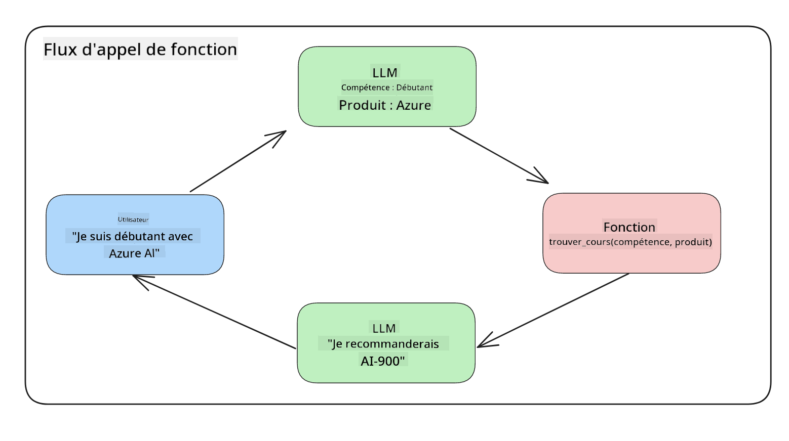
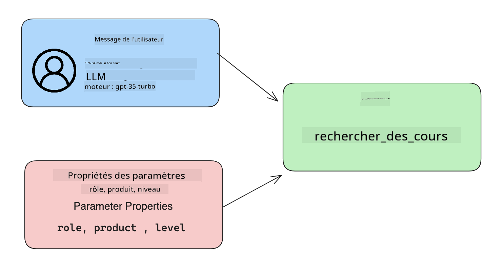

<!--
CO_OP_TRANSLATOR_METADATA:
{
  "original_hash": "f6f84f9ef2d066cd25850cab93580a50",
  "translation_date": "2025-10-17T22:37:50+00:00",
  "source_file": "11-integrating-with-function-calling/README.md",
  "language_code": "fr"
}
-->
# Intégration avec l'appel de fonction

[](https://youtu.be/DgUdCLX8qYQ?si=f1ouQU5HQx6F8Gl2)

Vous avez déjà appris pas mal de choses dans les leçons précédentes. Cependant, nous pouvons encore nous améliorer. Parmi les points à aborder, il y a la manière d'obtenir un format de réponse plus cohérent pour faciliter le traitement des réponses en aval. De plus, nous pourrions vouloir ajouter des données provenant d'autres sources pour enrichir davantage notre application.

Ce chapitre vise à résoudre les problèmes mentionnés ci-dessus.

## Introduction

Cette leçon couvrira :

- Expliquer ce qu'est l'appel de fonction et ses cas d'utilisation.
- Créer un appel de fonction en utilisant Azure OpenAI.
- Comment intégrer un appel de fonction dans une application.

## Objectifs d'apprentissage

À la fin de cette leçon, vous serez capable de :

- Expliquer l'objectif de l'utilisation de l'appel de fonction.
- Configurer un appel de fonction en utilisant le service Azure OpenAI.
- Concevoir des appels de fonction efficaces pour les cas d'utilisation de votre application.

## Scénario : Améliorer notre chatbot avec des fonctions

Pour cette leçon, nous souhaitons développer une fonctionnalité pour notre startup éducative permettant aux utilisateurs d'utiliser un chatbot pour trouver des cours techniques. Nous recommanderons des cours adaptés à leur niveau de compétence, leur rôle actuel et leur technologie d'intérêt.

Pour réaliser ce scénario, nous utiliserons une combinaison de :

- `Azure OpenAI` pour créer une expérience de chat pour l'utilisateur.
- `Microsoft Learn Catalog API` pour aider les utilisateurs à trouver des cours en fonction de leur demande.
- `Appel de fonction` pour prendre la requête de l'utilisateur et l'envoyer à une fonction afin de faire la requête API.

Pour commencer, examinons pourquoi nous voudrions utiliser l'appel de fonction en premier lieu :

## Pourquoi l'appel de fonction

Avant l'appel de fonction, les réponses d'un LLM étaient non structurées et incohérentes. Les développeurs devaient écrire un code de validation complexe pour s'assurer qu'ils pouvaient gérer chaque variation de réponse. Les utilisateurs ne pouvaient pas obtenir des réponses comme "Quel est le temps actuel à Stockholm ?". Cela est dû au fait que les modèles étaient limités aux données disponibles au moment de leur entraînement.

L'appel de fonction est une fonctionnalité du service Azure OpenAI qui permet de surmonter les limitations suivantes :

- **Format de réponse cohérent**. Si nous pouvons mieux contrôler le format de réponse, nous pouvons plus facilement intégrer la réponse en aval dans d'autres systèmes.
- **Données externes**. Capacité à utiliser des données provenant d'autres sources d'une application dans un contexte de chat.

## Illustrer le problème à travers un scénario

> Nous vous recommandons d'utiliser le [notebook inclus](./python/aoai-assignment.ipynb?WT.mc_id=academic-105485-koreyst) si vous souhaitez exécuter le scénario ci-dessous. Vous pouvez également simplement lire, car nous essayons d'illustrer un problème où les fonctions peuvent aider à le résoudre.

Examinons un exemple qui illustre le problème de format de réponse :

Disons que nous voulons créer une base de données d'informations sur les étudiants afin de leur suggérer le bon cours. Ci-dessous, nous avons deux descriptions d'étudiants qui sont très similaires dans les données qu'elles contiennent.

1. Créer une connexion à notre ressource Azure OpenAI :

   ```python
   import os
   import json
   from openai import AzureOpenAI
   from dotenv import load_dotenv
   load_dotenv()

   client = AzureOpenAI(
   api_key=os.environ['AZURE_OPENAI_API_KEY'],  # this is also the default, it can be omitted
   api_version = "2023-07-01-preview"
   )

   deployment=os.environ['AZURE_OPENAI_DEPLOYMENT']
   ```

   Ci-dessous, du code Python pour configurer notre connexion à Azure OpenAI où nous définissons `api_type`, `api_base`, `api_version` et `api_key`.

1. Créer deux descriptions d'étudiants en utilisant les variables `student_1_description` et `student_2_description`.

   ```python
   student_1_description="Emily Johnson is a sophomore majoring in computer science at Duke University. She has a 3.7 GPA. Emily is an active member of the university's Chess Club and Debate Team. She hopes to pursue a career in software engineering after graduating."

   student_2_description = "Michael Lee is a sophomore majoring in computer science at Stanford University. He has a 3.8 GPA. Michael is known for his programming skills and is an active member of the university's Robotics Club. He hopes to pursue a career in artificial intelligence after finishing his studies."
   ```

   Nous voulons envoyer les descriptions d'étudiants ci-dessus à un LLM pour analyser les données. Ces données peuvent ensuite être utilisées dans notre application et être envoyées à une API ou stockées dans une base de données.

1. Créons deux invites identiques dans lesquelles nous instruisons le LLM sur les informations que nous recherchons :

   ```python
   prompt1 = f'''
   Please extract the following information from the given text and return it as a JSON object:

   name
   major
   school
   grades
   club

   This is the body of text to extract the information from:
   {student_1_description}
   '''

   prompt2 = f'''
   Please extract the following information from the given text and return it as a JSON object:

   name
   major
   school
   grades
   club

   This is the body of text to extract the information from:
   {student_2_description}
   '''
   ```

   Les invites ci-dessus instruisent le LLM à extraire des informations et à retourner la réponse au format JSON.

1. Après avoir configuré les invites et la connexion à Azure OpenAI, nous allons maintenant envoyer les invites au LLM en utilisant `openai.ChatCompletion`. Nous stockons l'invite dans la variable `messages` et attribuons le rôle à `user`. Cela permet de simuler un message écrit par un utilisateur à un chatbot.

   ```python
   # response from prompt one
   openai_response1 = client.chat.completions.create(
   model=deployment,
   messages = [{'role': 'user', 'content': prompt1}]
   )
   openai_response1.choices[0].message.content

   # response from prompt two
   openai_response2 = client.chat.completions.create(
   model=deployment,
   messages = [{'role': 'user', 'content': prompt2}]
   )
   openai_response2.choices[0].message.content
   ```

Nous pouvons maintenant envoyer les deux requêtes au LLM et examiner la réponse que nous recevons en la trouvant comme suit : `openai_response1['choices'][0]['message']['content']`.

1. Enfin, nous pouvons convertir la réponse au format JSON en appelant `json.loads` :

   ```python
   # Loading the response as a JSON object
   json_response1 = json.loads(openai_response1.choices[0].message.content)
   json_response1
   ```

   Réponse 1 :

   ```json
   {
     "name": "Emily Johnson",
     "major": "computer science",
     "school": "Duke University",
     "grades": "3.7",
     "club": "Chess Club"
   }
   ```

   Réponse 2 :

   ```json
   {
     "name": "Michael Lee",
     "major": "computer science",
     "school": "Stanford University",
     "grades": "3.8 GPA",
     "club": "Robotics Club"
   }
   ```

   Bien que les invites soient les mêmes et que les descriptions soient similaires, nous voyons que les valeurs de la propriété `Grades` sont formatées différemment, car nous pouvons parfois obtenir le format `3.7` ou `3.7 GPA`, par exemple.

   Ce résultat est dû au fait que le LLM prend des données non structurées sous forme d'invite écrite et retourne également des données non structurées. Nous devons avoir un format structuré afin de savoir à quoi nous attendre lors du stockage ou de l'utilisation de ces données.

Alors, comment résoudre le problème de formatage ? En utilisant l'appel de fonction, nous pouvons nous assurer de recevoir des données structurées. Lors de l'utilisation de l'appel de fonction, le LLM n'appelle ni n'exécute réellement de fonctions. Au lieu de cela, nous créons une structure que le LLM doit suivre pour ses réponses. Nous utilisons ensuite ces réponses structurées pour savoir quelle fonction exécuter dans nos applications.



Nous pouvons ensuite prendre ce qui est retourné par la fonction et renvoyer cela au LLM. Le LLM répondra alors en utilisant un langage naturel pour répondre à la requête de l'utilisateur.

## Cas d'utilisation de l'appel de fonction

Il existe de nombreux cas d'utilisation où l'appel de fonction peut améliorer votre application, tels que :

- **Appeler des outils externes**. Les chatbots sont excellents pour fournir des réponses aux questions des utilisateurs. En utilisant l'appel de fonction, les chatbots peuvent utiliser les messages des utilisateurs pour accomplir certaines tâches. Par exemple, un étudiant peut demander au chatbot "Envoyez un email à mon professeur pour lui dire que j'ai besoin de plus d'aide sur ce sujet". Cela peut déclencher un appel de fonction à `send_email(to: string, body: string)`.

- **Créer des requêtes API ou des requêtes de base de données**. Les utilisateurs peuvent trouver des informations en utilisant un langage naturel qui est converti en une requête ou une demande API formatée. Un exemple pourrait être un enseignant qui demande "Quels sont les étudiants qui ont terminé le dernier devoir", ce qui pourrait appeler une fonction nommée `get_completed(student_name: string, assignment: int, current_status: string)`.

- **Créer des données structurées**. Les utilisateurs peuvent prendre un bloc de texte ou un fichier CSV et utiliser le LLM pour en extraire des informations importantes. Par exemple, un étudiant peut convertir un article de Wikipédia sur les accords de paix pour créer des fiches de révision. Cela peut être fait en utilisant une fonction appelée `get_important_facts(agreement_name: string, date_signed: string, parties_involved: list)`.

## Créer votre premier appel de fonction

Le processus de création d'un appel de fonction comprend 3 étapes principales :

1. **Appeler** l'API Chat Completions avec une liste de vos fonctions et un message utilisateur.
2. **Lire** la réponse du modèle pour effectuer une action, c'est-à-dire exécuter une fonction ou une requête API.
3. **Effectuer** un autre appel à l'API Chat Completions avec la réponse de votre fonction pour utiliser ces informations pour créer une réponse à l'utilisateur.



### Étape 1 - créer des messages

La première étape consiste à créer un message utilisateur. Cela peut être attribué dynamiquement en prenant la valeur d'une entrée texte ou vous pouvez attribuer une valeur ici. Si c'est votre première fois avec l'API Chat Completions, nous devons définir le `role` et le `content` du message.

Le `role` peut être soit `system` (création de règles), `assistant` (le modèle) ou `user` (l'utilisateur final). Pour l'appel de fonction, nous l'attribuerons comme `user` et une question d'exemple.

```python
messages= [ {"role": "user", "content": "Find me a good course for a beginner student to learn Azure."} ]
```

En attribuant différents rôles, il est clair pour le LLM si c'est le système qui parle ou l'utilisateur, ce qui aide à construire un historique de conversation sur lequel le LLM peut s'appuyer.

### Étape 2 - créer des fonctions

Ensuite, nous allons définir une fonction et les paramètres de cette fonction. Nous utiliserons une seule fonction ici appelée `search_courses`, mais vous pouvez en créer plusieurs.

> **Important** : Les fonctions sont incluses dans le message système au LLM et seront incluses dans le nombre de tokens disponibles.

Ci-dessous, nous créons les fonctions sous forme de tableau d'éléments. Chaque élément est une fonction et possède les propriétés `name`, `description` et `parameters` :

```python
functions = [
   {
      "name":"search_courses",
      "description":"Retrieves courses from the search index based on the parameters provided",
      "parameters":{
         "type":"object",
         "properties":{
            "role":{
               "type":"string",
               "description":"The role of the learner (i.e. developer, data scientist, student, etc.)"
            },
            "product":{
               "type":"string",
               "description":"The product that the lesson is covering (i.e. Azure, Power BI, etc.)"
            },
            "level":{
               "type":"string",
               "description":"The level of experience the learner has prior to taking the course (i.e. beginner, intermediate, advanced)"
            }
         },
         "required":[
            "role"
         ]
      }
   }
]
```

Décrivons chaque instance de fonction plus en détail ci-dessous :

- `name` - Le nom de la fonction que nous voulons appeler.
- `description` - C'est la description de la manière dont la fonction fonctionne. Ici, il est important d'être spécifique et clair.
- `parameters` - Une liste de valeurs et de formats que vous souhaitez que le modèle produise dans sa réponse. Le tableau des paramètres se compose d'éléments où les éléments ont les propriétés suivantes :
  1.  `type` - Le type de données dans lequel les propriétés seront stockées.
  1.  `properties` - Liste des valeurs spécifiques que le modèle utilisera pour sa réponse.
      1. `name` - La clé est le nom de la propriété que le modèle utilisera dans sa réponse formatée, par exemple, `product`.
      1. `type` - Le type de données de cette propriété, par exemple, `string`.
      1. `description` - Description de la propriété spécifique.

Il existe également une propriété optionnelle `required` - propriété requise pour que l'appel de fonction soit complété.

### Étape 3 - Effectuer l'appel de fonction

Après avoir défini une fonction, nous devons maintenant l'inclure dans l'appel à l'API Chat Completion. Nous le faisons en ajoutant `functions` à la requête. Dans ce cas, `functions=functions`.

Il est également possible de définir `function_call` sur `auto`. Cela signifie que nous laisserons le LLM décider quelle fonction doit être appelée en fonction du message utilisateur plutôt que de l'attribuer nous-mêmes.

Voici un code ci-dessous où nous appelons `ChatCompletion.create`, notez comment nous définissons `functions=functions` et `function_call="auto"`, permettant ainsi au LLM de choisir quand appeler les fonctions que nous lui fournissons :

```python
response = client.chat.completions.create(model=deployment,
                                        messages=messages,
                                        functions=functions,
                                        function_call="auto")

print(response.choices[0].message)
```

La réponse qui revient ressemble à ceci :

```json
{
  "role": "assistant",
  "function_call": {
    "name": "search_courses",
    "arguments": "{\n  \"role\": \"student\",\n  \"product\": \"Azure\",\n  \"level\": \"beginner\"\n}"
  }
}
```

Ici, nous pouvons voir comment la fonction `search_courses` a été appelée et avec quels arguments, comme indiqué dans la propriété `arguments` de la réponse JSON.

En conclusion, le LLM a pu trouver les données pour répondre aux arguments de la fonction en les extrayant de la valeur fournie au paramètre `messages` dans l'appel de complétion de chat. Ci-dessous, un rappel de la valeur `messages` :

```python
messages= [ {"role": "user", "content": "Find me a good course for a beginner student to learn Azure."} ]
```

Comme vous pouvez le voir, `student`, `Azure` et `beginner` ont été extraits de `messages` et définis comme entrée pour la fonction. Utiliser les fonctions de cette manière est un excellent moyen d'extraire des informations d'une invite, mais aussi de fournir une structure au LLM et d'avoir des fonctionnalités réutilisables.

Ensuite, nous devons voir comment nous pouvons utiliser cela dans notre application.

## Intégrer les appels de fonction dans une application

Après avoir testé la réponse formatée du LLM, nous pouvons maintenant intégrer cela dans une application.

### Gérer le flux

Pour intégrer cela dans notre application, suivons les étapes suivantes :

1. Tout d'abord, faisons l'appel aux services OpenAI et stockons le message dans une variable appelée `response_message`.

   ```python
   response_message = response.choices[0].message
   ```

1. Maintenant, nous allons définir la fonction qui appellera l'API Microsoft Learn pour obtenir une liste de cours :

   ```python
   import requests

   def search_courses(role, product, level):
     url = "https://learn.microsoft.com/api/catalog/"
     params = {
        "role": role,
        "product": product,
        "level": level
     }
     response = requests.get(url, params=params)
     modules = response.json()["modules"]
     results = []
     for module in modules[:5]:
        title = module["title"]
        url = module["url"]
        results.append({"title": title, "url": url})
     return str(results)
   ```

   Notez comment nous créons maintenant une véritable fonction Python qui correspond aux noms de fonctions introduits dans la variable `functions`. Nous effectuons également de véritables appels API externes pour récupérer les données dont nous avons besoin. Dans ce cas, nous utilisons l'API Microsoft Learn pour rechercher des modules de formation.

Ok, donc nous avons créé des variables `functions` et une fonction Python correspondante, comment dire au LLM comment les associer pour que notre fonction Python soit appelée ?

1. Pour voir si nous devons appeler une fonction Python, nous devons examiner la réponse du LLM et voir si `function_call` en fait partie, puis appeler la fonction indiquée. Voici comment vous pouvez effectuer la vérification mentionnée ci-dessous :

   ```python
   # Check if the model wants to call a function
   if response_message.function_call.name:
    print("Recommended Function call:")
    print(response_message.function_call.name)
    print()

    # Call the function.
    function_name = response_message.function_call.name

    available_functions = {
            "search_courses": search_courses,
    }
    function_to_call = available_functions[function_name]

    function_args = json.loads(response_message.function_call.arguments)
    function_response = function_to_call(**function_args)

    print("Output of function call:")
    print(function_response)
    print(type(function_response))


    # Add the assistant response and function response to the messages
    messages.append( # adding assistant response to messages
        {
            "role": response_message.role,
            "function_call": {
                "name": function_name,
                "arguments": response_message.function_call.arguments,
            },
            "content": None
        }
    )
    messages.append( # adding function response to messages
        {
            "role": "function",
            "name": function_name,
            "content":function_response,
        }
    )
   ```

   Ces trois lignes garantissent que nous extrayons le nom de la fonction, les arguments et effectuons l'appel :

   ```python
   function_to_call = available_functions[function_name]

   function_args = json.loads(response_message.function_call.arguments)
   function_response = function_to_call(**function_args)
   ```

   Ci-dessous, la sortie de l'exécution de notre code :

   **Sortie**

   ```Recommended Function call:
   {
     "name": "search_courses",
     "arguments": "{\n  \"role\": \"student\",\n  \"product\": \"Azure\",\n  \"level\": \"beginner\"\n}"
   }

   Output of function call:
   [{'title': 'Describe concepts of cryptography', 'url': 'https://learn.microsoft.com/training/modules/describe-concepts-of-cryptography/?
   WT.mc_id=api_CatalogApi'}, {'title': 'Introduction to audio classification with TensorFlow', 'url': 'https://learn.microsoft.com/en-
   us/training/modules/intro-audio-classification-tensorflow/?WT.mc_id=api_CatalogApi'}, {'title': 'Design a Performant Data Model in Azure SQL
   Database with Azure Data Studio', 'url': 'https://learn.microsoft.com/training/modules/design-a-data-model-with-ads/?
   WT.mc_id=api_CatalogApi'}, {'title': 'Getting started with the Microsoft Cloud Adoption Framework for Azure', 'url':
   'https://learn.microsoft.com/training/modules/cloud-adoption-framework-getting-started/?WT.mc_id=api_CatalogApi'}, {'title': 'Set up the
   Rust development environment', 'url': 'https://learn.microsoft.com/training/modules/rust-set-up-environment/?WT.mc_id=api_CatalogApi'}]
   <class 'str'>
   ```

1. Maintenant, nous allons envoyer le message mis à jour, `messages`, au LLM afin de recevoir une réponse en langage naturel au lieu d'une réponse formatée en JSON API.

   ```python
   print("Messages in next request:")
   print(messages)
   print()

   second_response = client.chat.completions.create(
      messages=messages,
      model=deployment,
      function_call="auto",
      functions=functions,
      temperature=0
         )  # get a new response from GPT where it can see the function response


   print(second_response.choices[0].message)
   ```

   **Sortie**

   ```python
   {
     "role": "assistant",
     "content": "I found some good courses for beginner students to learn Azure:\n\n1. [Describe concepts of cryptography] (https://learn.microsoft.com/training/modules/describe-concepts-of-cryptography/?WT.mc_id=api_CatalogApi)\n2. [Introduction to audio classification with TensorFlow](https://learn.microsoft.com/training/modules/intro-audio-classification-tensorflow/?WT.mc_id=api_CatalogApi)\n3. [Design a Performant Data Model in Azure SQL Database with Azure Data Studio](https://learn.microsoft.com/training/modules/design-a-data-model-with-ads/?WT.mc_id=api_CatalogApi)\n4. [Getting started with the Microsoft Cloud Adoption Framework for Azure](https://learn.microsoft.com/training/modules/cloud-adoption-framework-getting-started/?WT.mc_id=api_CatalogApi)\n5. [Set up the Rust development environment](https://learn.microsoft.com/training/modules/rust-set-up-environment/?WT.mc_id=api_CatalogApi)\n\nYou can click on the links to access the courses."
   }

   ```

## Exercice

Pour continuer votre apprentissage de l'appel de fonction Azure OpenAI, vous pouvez créer :

- Plus de paramètres pour la fonction qui pourraient aider les apprenants à trouver davantage de cours.
- Créer un autre appel de fonction qui prend plus d'informations de l'apprenant, comme sa langue maternelle.
- Créez une gestion des erreurs lorsque l'appel de fonction et/ou l'appel API ne renvoie aucun cours approprié.

Astuce : Consultez la page [documentation de référence de l'API Learn](https://learn.microsoft.com/training/support/catalog-api-developer-reference?WT.mc_id=academic-105485-koreyst) pour voir comment et où ces données sont disponibles.

## Excellent travail ! Continuez votre parcours

Après avoir terminé cette leçon, découvrez notre [collection d'apprentissage sur l'IA générative](https://aka.ms/genai-collection?WT.mc_id=academic-105485-koreyst) pour continuer à approfondir vos connaissances sur l'IA générative !

Rendez-vous à la leçon 12, où nous examinerons comment [concevoir l'UX pour les applications d'IA](../12-designing-ux-for-ai-applications/README.md?WT.mc_id=academic-105485-koreyst) !

---

**Avertissement** :  
Ce document a été traduit à l'aide du service de traduction automatique [Co-op Translator](https://github.com/Azure/co-op-translator). Bien que nous nous efforcions d'assurer l'exactitude, veuillez noter que les traductions automatisées peuvent contenir des erreurs ou des inexactitudes. Le document original dans sa langue d'origine doit être considéré comme la source faisant autorité. Pour des informations critiques, il est recommandé de recourir à une traduction professionnelle humaine. Nous ne sommes pas responsables des malentendus ou des interprétations erronées résultant de l'utilisation de cette traduction.