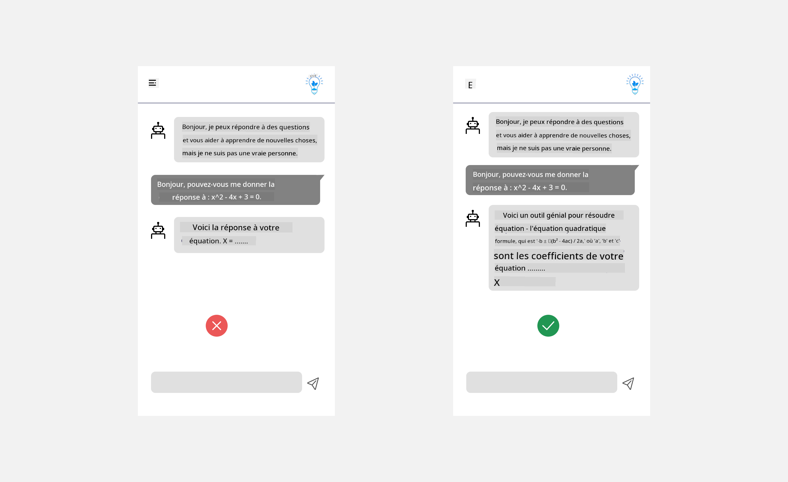
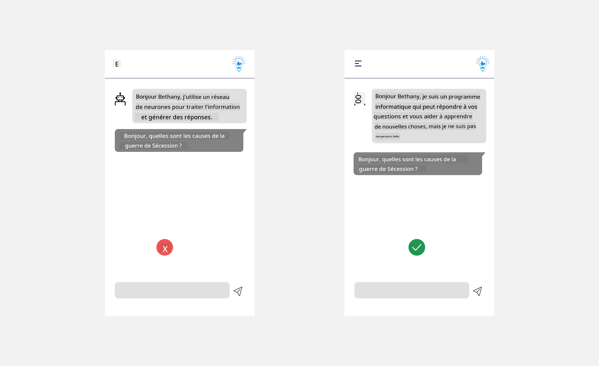
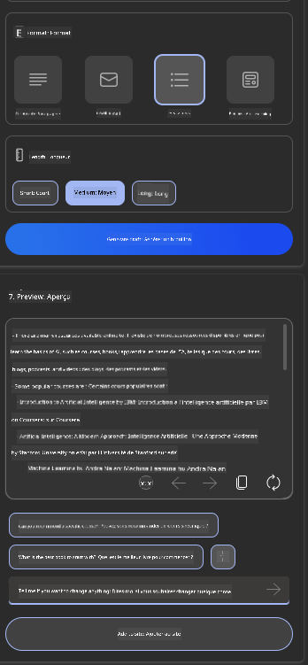

<!--
CO_OP_TRANSLATOR_METADATA:
{
  "original_hash": "ec385b41ee50579025d50cc03bfb3a25",
  "translation_date": "2025-05-19T21:40:48+00:00",
  "source_file": "12-designing-ux-for-ai-applications/README.md",
  "language_code": "fr"
}
-->
# Concevoir l'UX pour les applications d'IA

> _(Cliquez sur l'image ci-dessus pour voir la vidéo de cette leçon)_

L'expérience utilisateur est un aspect très important de la création d'applications. Les utilisateurs doivent pouvoir utiliser votre application de manière efficace pour accomplir des tâches. Être efficace est une chose, mais il faut aussi concevoir des applications pour qu'elles puissent être utilisées par tout le monde, afin de les rendre _accessibles_. Ce chapitre se concentrera sur cet aspect afin que vous puissiez concevoir une application que les gens peuvent et veulent utiliser.

## Introduction

L'expérience utilisateur est la façon dont un utilisateur interagit avec et utilise un produit ou un service spécifique, qu'il s'agisse d'un système, d'un outil ou d'un design. Lors du développement d'applications d'IA, les développeurs se concentrent non seulement sur l'efficacité de l'expérience utilisateur, mais aussi sur son aspect éthique. Dans cette leçon, nous abordons la création d'applications d'intelligence artificielle (IA) qui répondent aux besoins des utilisateurs.

La leçon couvrira les domaines suivants :

- Introduction à l'expérience utilisateur et compréhension des besoins des utilisateurs
- Concevoir des applications d'IA pour la confiance et la transparence
- Concevoir des applications d'IA pour la collaboration et le retour d'information

## Objectifs d'apprentissage

Après avoir suivi cette leçon, vous serez capable de :

- Comprendre comment créer des applications d'IA qui répondent aux besoins des utilisateurs.
- Concevoir des applications d'IA qui favorisent la confiance et la collaboration.

### Prérequis

Prenez le temps de lire davantage sur [l'expérience utilisateur et la pensée design.](https://learn.microsoft.com/training/modules/ux-design?WT.mc_id=academic-105485-koreyst)

## Introduction à l'expérience utilisateur et compréhension des besoins des utilisateurs

Dans notre startup fictive dans le domaine de l'éducation, nous avons deux utilisateurs principaux, les enseignants et les étudiants. Chacun de ces deux utilisateurs a des besoins uniques. Un design centré sur l'utilisateur donne la priorité à l'utilisateur en s'assurant que les produits sont pertinents et bénéfiques pour ceux auxquels ils sont destinés.

L'application doit être **utile, fiable, accessible et agréable** pour offrir une bonne expérience utilisateur.

### Utilité

Être utile signifie que l'application possède des fonctionnalités qui correspondent à son objectif prévu, comme automatiser le processus de notation ou générer des cartes mémoire pour la révision. Une application qui automatise le processus de notation doit pouvoir attribuer des scores de manière précise et efficace au travail des étudiants en fonction de critères prédéfinis. De même, une application qui génère des cartes mémoire de révision doit pouvoir créer des questions pertinentes et diversifiées basées sur ses données.

### Fiabilité

Être fiable signifie que l'application peut accomplir sa tâche de manière cohérente et sans erreurs. Cependant, l'IA, tout comme les humains, n'est pas parfaite et peut être sujette à des erreurs. Les applications peuvent rencontrer des erreurs ou des situations inattendues nécessitant une intervention ou une correction humaine. Comment gérez-vous les erreurs ? Dans la dernière section de cette leçon, nous aborderons comment les systèmes et applications d'IA sont conçus pour la collaboration et le retour d'information.

### Accessibilité

Être accessible signifie étendre l'expérience utilisateur aux utilisateurs ayant diverses capacités, y compris ceux ayant des handicaps, en veillant à ce que personne ne soit exclu. En suivant les directives et principes d'accessibilité, les solutions d'IA deviennent plus inclusives, utilisables et bénéfiques pour tous les utilisateurs.

### Agréable

Être agréable signifie que l'application est agréable à utiliser. Une expérience utilisateur attrayante peut avoir un impact positif sur l'utilisateur, l'encourageant à revenir à l'application et augmentant les revenus de l'entreprise.

Tous les défis ne peuvent pas être résolus avec l'IA. L'IA vient compléter votre expérience utilisateur, qu'il s'agisse d'automatiser des tâches manuelles ou de personnaliser des expériences utilisateur.

## Concevoir des applications d'IA pour la confiance et la transparence

Construire la confiance est essentiel lors de la conception d'applications d'IA. La confiance garantit qu'un utilisateur est confiant que l'application accomplira le travail, fournira des résultats de manière cohérente et que les résultats sont ce dont l'utilisateur a besoin. Un risque dans ce domaine est le manque de confiance et la confiance excessive. Le manque de confiance survient lorsqu'un utilisateur a peu ou pas de confiance dans un système d'IA, ce qui conduit l'utilisateur à rejeter votre application. La confiance excessive survient lorsqu'un utilisateur surestime la capacité d'un système d'IA, conduisant les utilisateurs à trop faire confiance au système d'IA. Par exemple, un système de notation automatisé dans le cas de la confiance excessive pourrait amener l'enseignant à ne pas vérifier certains des travaux pour s'assurer que le système de notation fonctionne bien. Cela pourrait entraîner des notes injustes ou inexactes pour les étudiants, ou des occasions manquées de retour d'information et d'amélioration.

Deux façons de s'assurer que la confiance est placée au centre de la conception sont l'explicabilité et le contrôle.

### Explicabilité

Lorsque l'IA aide à informer des décisions telles que transmettre des connaissances aux générations futures, il est essentiel pour les enseignants et les parents de comprendre comment les décisions de l'IA sont prises. C'est l'explicabilité - comprendre comment les applications d'IA prennent des décisions. Concevoir pour l'explicabilité inclut l'ajout de détails sur des exemples de ce qu'une application d'IA peut faire. Par exemple, au lieu de "Commencer avec l'enseignant d'IA", le système peut utiliser : "Résumez vos notes pour une révision plus facile grâce à l'IA."

Un autre exemple est la façon dont l'IA utilise les données utilisateur et personnelles. Par exemple, un utilisateur avec la persona étudiant peut avoir des limitations basées sur sa persona. L'IA peut ne pas être en mesure de révéler les réponses aux questions, mais peut aider à guider l'utilisateur à réfléchir à comment il peut résoudre un problème.

Une dernière partie clé de l'explicabilité est la simplification des explications. Les étudiants et les enseignants peuvent ne pas être des experts en IA, donc les explications de ce que l'application peut ou ne peut pas faire doivent être simplifiées et faciles à comprendre.

### Contrôle

L'IA générative crée une collaboration entre l'IA et l'utilisateur, où par exemple un utilisateur peut modifier des invites pour obtenir des résultats différents. De plus, une fois qu'un résultat est généré, les utilisateurs devraient pouvoir modifier les résultats, leur donnant un sentiment de contrôle. Par exemple, lors de l'utilisation de Bing, vous pouvez adapter votre invite en fonction du format, du ton et de la longueur. De plus, vous pouvez apporter des modifications à votre résultat et le modifier comme indiqué ci-dessous :

Une autre fonctionnalité de Bing qui permet à un utilisateur d'avoir le contrôle sur l'application est la possibilité de s'inscrire et de se désinscrire des données utilisées par l'IA. Pour une application scolaire, un étudiant pourrait vouloir utiliser ses notes ainsi que les ressources des enseignants comme matériel de révision.

> Lors de la conception d'applications d'IA, l'intentionnalité est essentielle pour s'assurer que les utilisateurs ne font pas trop confiance, ce qui crée des attentes irréalistes quant à ses capacités. Une façon de le faire est de créer une friction entre les invites et les résultats. Rappelant à l'utilisateur que c'est une IA et non un être humain

## Concevoir des applications d'IA pour la collaboration et le retour d'information

Comme mentionné précédemment, l'IA générative crée une collaboration entre l'utilisateur et l'IA. La plupart des interactions se font avec un utilisateur saisissant une invite et l'IA générant un résultat. Que se passe-t-il si le résultat est incorrect ? Comment l'application gère-t-elle les erreurs si elles se produisent ? L'IA blâme-t-elle l'utilisateur ou prend-elle le temps d'expliquer l'erreur ?

Les applications d'IA devraient être conçues pour recevoir et donner des retours d'information. Cela aide non seulement le système d'IA à s'améliorer, mais aussi à instaurer la confiance avec les utilisateurs. Une boucle de retour d'information devrait être incluse dans la conception, un exemple peut être un simple pouce levé ou baissé sur le résultat.

Une autre façon de gérer cela est de communiquer clairement les capacités et les limitations du système. Lorsqu'un utilisateur fait une erreur en demandant quelque chose au-delà des capacités de l'IA, il devrait également y avoir un moyen de gérer cela, comme montré ci-dessous.

Les erreurs système sont courantes avec les applications où l'utilisateur pourrait avoir besoin d'assistance avec des informations en dehors du champ d'application de l'IA ou l'application peut avoir une limite sur le nombre de questions/sujets qu'un utilisateur peut générer des résumés. Par exemple, une application d'IA formée avec des données sur des sujets limités, par exemple, l'Histoire et les Mathématiques, peut ne pas être en mesure de traiter des questions sur la Géographie. Pour atténuer cela, le système d'IA peut donner une réponse comme : "Désolé, notre produit a été formé avec des données dans les sujets suivants....., je ne peux pas répondre à la question que vous avez posée."

Les applications d'IA ne sont pas parfaites, donc elles sont susceptibles de faire des erreurs. Lors de la conception de vos applications, vous devez vous assurer de créer de la place pour les retours d'information des utilisateurs et la gestion des erreurs de manière simple et facilement explicable.

## Devoir

Prenez les applications d'IA que vous avez créées jusqu'à présent, envisagez de mettre en œuvre les étapes ci-dessous dans votre application :

- **Agréable :** Réfléchissez à la façon dont vous pouvez rendre votre application plus agréable. Ajoutez-vous des explications partout ? Encouragez-vous l'utilisateur à explorer ? Comment formulez-vous vos messages d'erreur ?

- **Utilité :** Construisez une application web. Assurez-vous que votre application est navigable à la fois par souris et clavier.

- **Confiance et transparence :** Ne faites pas entièrement confiance à l'IA et à son résultat, réfléchissez à la façon dont vous ajouteriez un humain au processus pour vérifier le résultat. Envisagez également et mettez en œuvre d'autres moyens d'atteindre la confiance et la transparence.

- **Contrôle :** Donnez à l'utilisateur le contrôle des données qu'il fournit à l'application. Mettez en œuvre un moyen pour un utilisateur de s'inscrire et de se désinscrire de la collecte de données dans l'application d'IA.

## Poursuivez votre apprentissage !

Après avoir terminé cette leçon, consultez notre [collection d'apprentissage sur l'IA générative](https://aka.ms/genai-collection?WT.mc_id=academic-105485-koreyst) pour continuer à approfondir vos connaissances sur l'IA générative !

Rendez-vous à la leçon 13, où nous examinerons comment [sécuriser les applications d'IA](../13-securing-ai-applications/README.md?WT.mc_id=academic-105485-koreyst) !

**Avertissement** :  
Ce document a été traduit à l'aide du service de traduction automatique [Co-op Translator](https://github.com/Azure/co-op-translator). Bien que nous nous efforcions d'assurer l'exactitude, veuillez noter que les traductions automatisées peuvent contenir des erreurs ou des inexactitudes. Le document original dans sa langue d'origine doit être considéré comme la source faisant autorité. Pour des informations critiques, il est recommandé de faire appel à une traduction professionnelle humaine. Nous ne sommes pas responsables des malentendus ou des interprétations erronées résultant de l'utilisation de cette traduction.