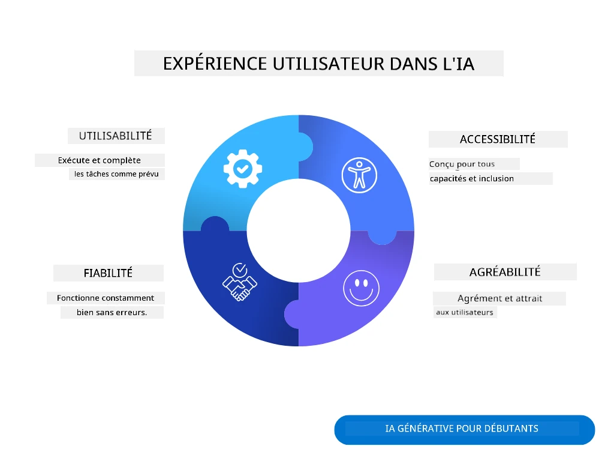
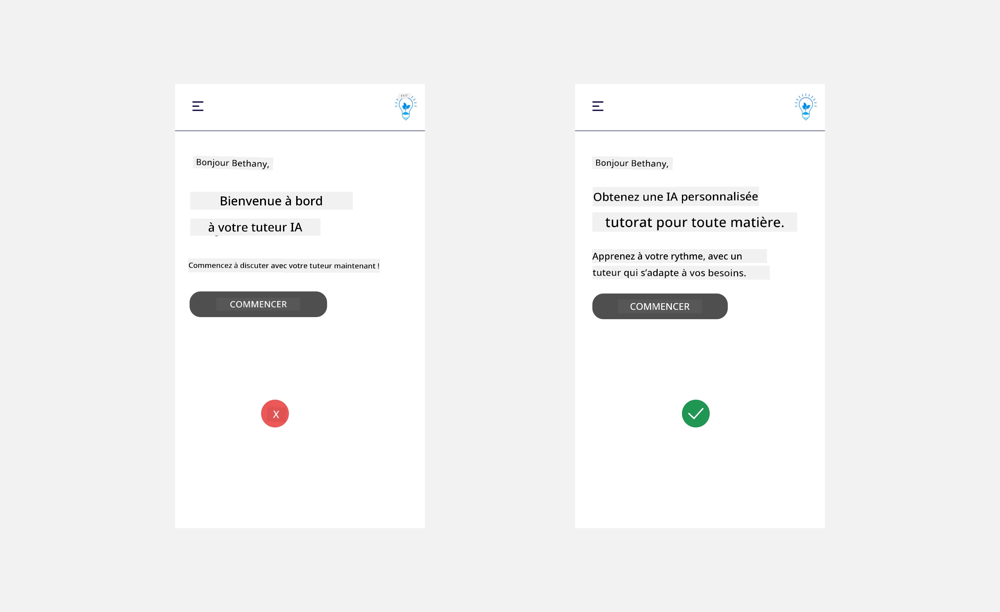
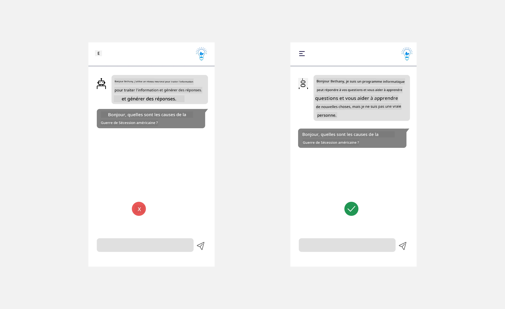
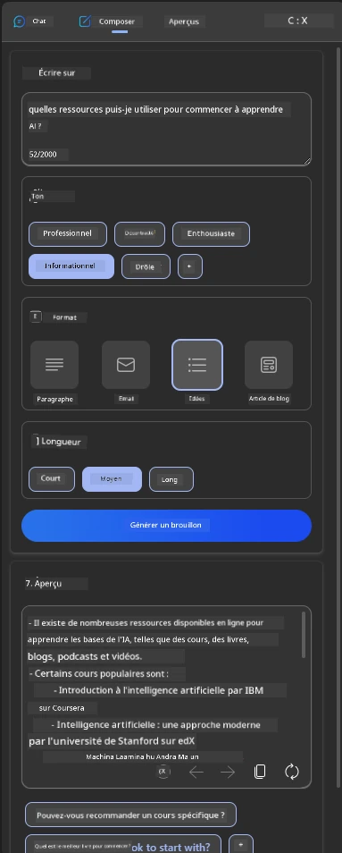
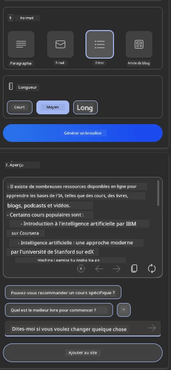

# Concevoir l’UX pour les applications d’IA

> _(Cliquez sur l’image ci-dessus pour regarder la vidéo de cette leçon)_

L’expérience utilisateur est un aspect très important de la création d’applications. Les utilisateurs doivent pouvoir utiliser votre application de manière efficace pour accomplir des tâches. Être efficace est une chose, mais vous devez aussi concevoir des applications pour qu’elles soient utilisables par tous, afin de les rendre _accessibles_. Ce chapitre se concentrera sur ce domaine afin que vous puissiez, espérons-le, concevoir une application que les gens peuvent et veulent utiliser.

## Introduction

L’expérience utilisateur désigne la manière dont un utilisateur interagit avec et utilise un produit ou service spécifique, qu’il s’agisse d’un système, d’un outil ou d’un design. Lors du développement d’applications d’IA, les développeurs ne se concentrent pas seulement sur l’efficacité de l’expérience utilisateur, mais aussi sur son éthique. Dans cette leçon, nous abordons comment construire des applications d’intelligence artificielle (IA) qui répondent aux besoins des utilisateurs.

La leçon couvrira les domaines suivants :

- Introduction à l’expérience utilisateur et compréhension des besoins des utilisateurs
- Concevoir des applications d’IA pour la confiance et la transparence
- Concevoir des applications d’IA pour la collaboration et les retours

## Objectifs d’apprentissage

Après avoir suivi cette leçon, vous serez capable de :

- Comprendre comment construire des applications d’IA qui répondent aux besoins des utilisateurs.
- Concevoir des applications d’IA qui favorisent la confiance et la collaboration.

### Prérequis

Prenez un moment pour lire davantage sur [l’expérience utilisateur et le design thinking](https://learn.microsoft.com/training/modules/ux-design?WT.mc_id=academic-105485-koreyst)

## Introduction à l’expérience utilisateur et compréhension des besoins des utilisateurs

Dans notre startup fictive d’éducation, nous avons deux utilisateurs principaux, les enseignants et les étudiants. Chacun de ces deux utilisateurs a des besoins uniques. Un design centré utilisateur priorise l’utilisateur en garantissant que les produits sont pertinents et bénéfiques pour ceux à qui ils sont destinés.

L’application doit être **utile, fiable, accessible et agréable** pour offrir une bonne expérience utilisateur.

### Utilisabilité

Être utile signifie que l’application dispose d’une fonctionnalité correspondant à son objectif, telle que l’automatisation du processus de notation ou la génération de flashcards pour la révision. Une application qui automatise la notation devrait pouvoir attribuer précisément et efficacement des notes au travail des étudiants selon des critères prédéfinis. De même, une application qui génère des flashcards de révision devrait être capable de créer des questions pertinentes et diverses basées sur ses données.

### Fiabilité

Être fiable signifie que l’application peut exécuter sa tâche de manière constante et sans erreurs. Cependant, l’IA, tout comme les humains, n’est pas parfaite et peut être sujette à des erreurs. Les applications peuvent rencontrer des erreurs ou des situations inattendues nécessitant une intervention ou correction humaine. Comment gérez-vous les erreurs ? Dans la dernière section de cette leçon, nous verrons comment les systèmes et applications d’IA sont conçus pour la collaboration et les retours.

### Accessibilité

Être accessible signifie étendre l’expérience utilisateur à des personnes aux capacités diverses, y compris celles en situation de handicap, en veillant à ce que personne ne soit laissé pour compte. En suivant les directives et principes d’accessibilité, les solutions d’IA deviennent plus inclusives, utilisables et bénéfiques pour tous.

### Agréable

Être agréable signifie que l’application est plaisante à utiliser. Une expérience utilisateur attrayante peut avoir un impact positif sur l’utilisateur, l’incitant à revenir sur l’application et augmentant les revenus de l’entreprise.

Tous les défis ne peuvent pas être résolus avec l’IA. L’IA vient pour augmenter votre expérience utilisateur, que ce soit en automatisant les tâches manuelles ou en personnalisant les expériences utilisateur.

## Concevoir des applications d’IA pour la confiance et la transparence

Construire la confiance est crucial lors de la conception d’applications d’IA. La confiance assure à l’utilisateur que l’application accomplira la tâche, fournira des résultats cohérents et que ces résultats correspondent à ses besoins. Un risque dans ce domaine est la méfiance ou la confiance excessive. La méfiance survient lorsqu’un utilisateur a peu ou pas de confiance dans un système d’IA, ce qui conduit à un rejet de votre application. La confiance excessive survient lorsqu’un utilisateur surestime les capacités d’un système d’IA, ce qui le conduit à lui faire trop confiance. Par exemple, un système de notation automatisé en cas de confiance excessive pourrait amener l’enseignant à ne pas relire certains devoirs pour vérifier que le système fonctionne bien. Cela pourrait entraîner des notes injustes ou inexactes pour les étudiants, ou des occasions manquées de retours et d’amélioration.

Deux manières de veiller à ce que la confiance soit au cœur du design sont l’explicabilité et le contrôle.

### Explicabilité

Lorsque l’IA aide à informer des décisions comme transmettre des connaissances aux générations futures, il est crucial que les enseignants et les parents comprennent comment sont prises les décisions d’IA. C’est l’explicabilité : comprendre comment les applications d’IA prennent des décisions. Concevoir pour l’explicabilité inclut l’ajout de détails qui montrent comment l’IA est arrivée au résultat. Le public doit savoir que le résultat est généré par une IA et non par un humain. Par exemple, au lieu de dire « Commencez à discuter avec votre tuteur maintenant », dites « Utilisez un tuteur IA qui s’adapte à vos besoins et vous aide à apprendre à votre rythme ».

Un autre exemple est la manière dont l’IA utilise les données utilisateur et personnelles. Par exemple, un utilisateur avec la persona étudiant peut avoir des limitations selon cette persona. L’IA ne pourra peut-être pas révéler les réponses aux questions mais peut aider à guider l’utilisateur pour réfléchir à comment résoudre un problème.

Une dernière partie clé de l’explicabilité est la simplification des explications. Les étudiants et enseignants ne sont pas forcément des experts en IA, donc les explications sur ce que peut ou ne peut pas faire l’application devraient être simplifiées et faciles à comprendre.

### Contrôle

L’IA générative crée une collaboration entre l’IA et l’utilisateur, où par exemple un utilisateur peut modifier les invites pour obtenir différents résultats. De plus, une fois qu’un résultat est généré, les utilisateurs devraient pouvoir modifier les résultats, leur donnant ainsi un sentiment de contrôle. Par exemple, avec Microsoft Copilot (anciennement Bing Chat), vous pouvez adapter votre invite selon le format, le ton et la longueur. En outre, vous pouvez ajouter des modifications à votre résultat et modifier celui-ci comme montré ci-dessous :

Une autre fonctionnalité de Microsoft Copilot permettant à un utilisateur de contrôler l’application est la possibilité d’accepter ou de refuser les données utilisées par l’IA. Pour une application scolaire, un étudiant pourrait vouloir utiliser ses notes ainsi que les ressources des enseignants comme matériel de révision.

> Lors de la conception d’applications d’IA, l’intentionnalité est essentielle pour que les utilisateurs ne fassent pas trop confiance en fixant des attentes irréalistes de ses capacités. Une manière d’y parvenir est de créer une friction entre les invites et les résultats. Rappelant à l’utilisateur que ceci est de l’IA et non un autre être humain.

## Concevoir des applications d’IA pour la collaboration et les retours

Comme mentionné plus tôt, l’IA générative crée une collaboration entre l’utilisateur et l’IA. La plupart des interactions consistent en un utilisateur saisissant une invite et l’IA générant un résultat. Que se passe-t-il si le résultat est incorrect ? Comment l’application gère-t-elle les erreurs si elles surviennent ? L’IA blâme-t-elle l’utilisateur ou prend-elle le temps d’expliquer l’erreur ?

Les applications d’IA devraient être conçues pour recevoir et donner des retours. Cela aide non seulement le système d’IA à s’améliorer, mais aussi à établir la confiance avec les utilisateurs. Une boucle de rétroaction devrait être incluse dans le design, un exemple peut être un simple pouce vers le haut ou vers le bas sur le résultat.

Une autre façon de gérer cela est de communiquer clairement les capacités et les limitations du système. Lorsqu’un utilisateur fait une erreur en demandant quelque chose au-delà des capacités de l’IA, il devrait aussi y avoir une manière de gérer cela, comme montré ci-dessous.

Les erreurs système sont courantes avec les applications où l’utilisateur peut avoir besoin d’aide sur des informations hors du champ de l’IA ou l’application peut limiter le nombre de questions/sujets pour lesquels un utilisateur peut générer des résumés. Par exemple, une application IA entraînée sur des données limitées à des sujets comme l’histoire et les mathématiques peut ne pas être capable de traiter des questions sur la géographie. Pour y remédier, le système d’IA peut répondre ainsi : « Désolé, notre produit a été entraîné avec des données dans les matières suivantes....., je ne suis pas en mesure de répondre à la question que vous avez posée. »

Les applications d’IA ne sont pas parfaites, elles sont donc susceptibles de faire des erreurs. Lors de la conception de vos applications, vous devez vous assurer de créer de la place pour les retours des utilisateurs et la gestion des erreurs de manière simple et facilement explicable.

## Exercice

Prenez n’importe quelle application d’IA que vous avez créée jusqu’ici, envisagez d’implémenter les étapes suivantes dans votre application :

- **Agréable :** Réfléchissez à comment rendre votre application plus agréable. Ajoutez-vous des explications partout ? Encouragez-vous l’utilisateur à explorer ? Comment formuler vos messages d’erreur ?

- **Utilisabilité :** Si vous construisez une application web, assurez-vous qu’elle soit navigable à la fois à la souris et au clavier.

- **Confiance et transparence :** Ne faites pas confiance à l’IA et à ses résultats de manière aveugle, réfléchissez à comment ajouter un humain dans le processus pour vérifier les résultats. Envisagez aussi de mettre en œuvre d’autres moyens d’instaurer confiance et transparence.

- **Contrôle :** Donnez à l’utilisateur le contrôle des données qu’il fournit à l’application. Implémentez un moyen pour un utilisateur d’accepter ou de refuser la collecte de données dans l’application IA.

<!-- ## [Quiz post-cours](../../../12-designing-ux-for-ai-applications/quiz-url) -->

## Continuez votre apprentissage !

Après avoir terminé cette leçon, consultez notre [Collection d’apprentissage sur l’IA générative](https://aka.ms/genai-collection?WT.mc_id=academic-105485-koreyst) pour continuer à approfondir vos connaissances en IA générative !

Passez à la leçon 13, où nous verrons comment [sécuriser les applications d’IA](../13-securing-ai-applications/README.md?WT.mc_id=academic-105485-koreyst) !

---

<!-- CO-OP TRANSLATOR DISCLAIMER START -->
**Avertissement** :
Ce document a été traduit à l'aide du service de traduction automatique [Co-op Translator](https://github.com/Azure/co-op-translator). Bien que nous nous efforçions d'assurer l'exactitude, veuillez noter que les traductions automatisées peuvent contenir des erreurs ou des inexactitudes. Le document original dans sa langue native doit être considéré comme la source faisant autorité. Pour les informations critiques, il est recommandé de recourir à une traduction professionnelle réalisée par un humain. Nous ne saurions être tenus responsables des malentendus ou erreurs d'interprétation découlant de l'utilisation de cette traduction.
<!-- CO-OP TRANSLATOR DISCLAIMER END -->