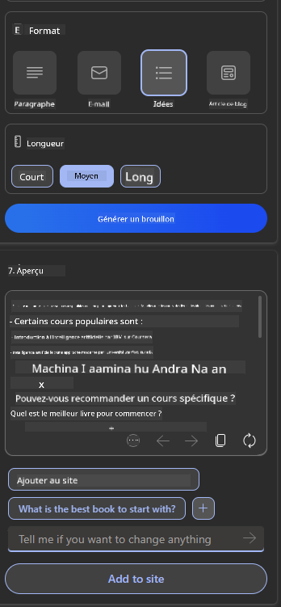

<!--
CO_OP_TRANSLATOR_METADATA:
{
  "original_hash": "747668e4c53d067369f06e9ec2e6313e",
  "translation_date": "2025-08-26T13:33:42+00:00",
  "source_file": "12-designing-ux-for-ai-applications/README.md",
  "language_code": "fr"
}
-->
# Concevoir l’UX pour les applications d’IA

> _(Cliquez sur l’image ci-dessus pour voir la vidéo de cette leçon)_

L’expérience utilisateur est un aspect essentiel dans la création d’applications. Les utilisateurs doivent pouvoir utiliser votre application efficacement pour accomplir leurs tâches. L’efficacité est importante, mais il faut aussi penser à la rendre accessible à tous. Ce chapitre se concentre sur ce sujet afin que vous puissiez concevoir une application que les gens peuvent utiliser et ont envie d’utiliser.

## Introduction

L’expérience utilisateur, c’est la façon dont une personne interagit avec un produit ou un service, que ce soit un système, un outil ou un design. Lorsqu’on développe des applications d’IA, il ne s’agit pas seulement de garantir une expérience efficace, mais aussi éthique. Dans cette leçon, nous verrons comment créer des applications d’Intelligence Artificielle (IA) qui répondent aux besoins des utilisateurs.

Voici les points abordés dans cette leçon :

- Introduction à l’expérience utilisateur et compréhension des besoins des utilisateurs
- Concevoir des applications d’IA pour la confiance et la transparence
- Concevoir des applications d’IA pour la collaboration et le feedback

## Objectifs d’apprentissage

Après cette leçon, vous serez capable de :

- Comprendre comment créer des applications d’IA qui répondent aux besoins des utilisateurs.
- Concevoir des applications d’IA qui favorisent la confiance et la collaboration.

### Prérequis

Prenez le temps de lire davantage sur [l’expérience utilisateur et le design thinking.](https://learn.microsoft.com/training/modules/ux-design?WT.mc_id=academic-105485-koreyst)

## Introduction à l’expérience utilisateur et compréhension des besoins des utilisateurs

Dans notre startup fictive dans l’éducation, nous avons deux utilisateurs principaux : les enseignants et les élèves. Chacun a des besoins spécifiques. Un design centré sur l’utilisateur met l’accent sur ses besoins pour garantir que les produits sont pertinents et utiles pour ceux à qui ils sont destinés.

L’application doit être **utile, fiable, accessible et agréable** pour offrir une bonne expérience utilisateur.

### Utilité

Être utile signifie que l’application propose des fonctionnalités adaptées à son objectif, comme automatiser la correction des devoirs ou générer des flashcards pour réviser. Une application qui automatise la correction doit pouvoir attribuer des notes de façon précise et efficace selon des critères définis. De même, une application qui génère des flashcards doit pouvoir créer des questions pertinentes et variées à partir de ses données.

### Fiabilité

Être fiable signifie que l’application accomplit sa tâche de façon constante et sans erreurs. Cependant, l’IA, comme les humains, n’est pas parfaite et peut faire des erreurs. Les applications peuvent rencontrer des problèmes ou des situations inattendues qui nécessitent une intervention ou une correction humaine. Comment gérer ces erreurs ? Dans la dernière partie de cette leçon, nous verrons comment les systèmes d’IA sont conçus pour la collaboration et le feedback.

### Accessibilité

Être accessible, c’est penser à tous les utilisateurs, y compris ceux en situation de handicap, pour que personne ne soit exclu. En suivant les principes et recommandations d’accessibilité, les solutions d’IA deviennent plus inclusives, utilisables et bénéfiques pour tous.

### Agréable

Être agréable, c’est rendre l’application plaisante à utiliser. Une expérience utilisateur attrayante peut encourager l’utilisateur à revenir et augmenter les revenus de l’entreprise.

L’IA ne résout pas tous les problèmes. Elle vient enrichir l’expérience utilisateur, que ce soit en automatisant des tâches ou en personnalisant l’expérience.

## Concevoir des applications d’IA pour la confiance et la transparence

La confiance est essentielle dans la conception d’applications d’IA. Elle garantit que l’utilisateur croit que l’application accomplira le travail, fournira des résultats fiables et adaptés à ses besoins. Le risque ici, c’est le manque de confiance ou l’excès de confiance. Le manque de confiance pousse l’utilisateur à rejeter l’application. L’excès de confiance amène l’utilisateur à surestimer les capacités de l’IA, ce qui peut poser problème. Par exemple, un système de correction automatisée trop fiable pourrait inciter l’enseignant à ne pas vérifier certains devoirs, ce qui peut entraîner des notes injustes ou des occasions manquées de donner du feedback.

Deux moyens de placer la confiance au cœur du design sont l’explicabilité et le contrôle.

### Explicabilité

Quand l’IA aide à prendre des décisions, comme transmettre des connaissances aux générations futures, il est crucial que les enseignants et les parents comprennent comment l’IA prend ses décisions. C’est l’explicabilité : comprendre comment l’application d’IA arrive à ses résultats. Concevoir pour l’explicabilité, c’est ajouter des détails qui expliquent comment l’IA a produit le résultat. Il faut que l’utilisateur sache que le résultat vient de l’IA et non d’un humain. Par exemple, au lieu de dire « Discutez avec votre tuteur maintenant », dites « Utilisez le tuteur IA qui s’adapte à vos besoins et vous aide à apprendre à votre rythme. »

Un autre exemple concerne l’utilisation des données personnelles par l’IA. Par exemple, un élève peut avoir des restrictions selon son profil. L’IA ne pourra pas donner directement les réponses, mais pourra guider l’utilisateur pour qu’il réfléchisse à la solution.

Un dernier point clé de l’explicabilité est la simplification des explications. Les élèves et enseignants ne sont pas forcément experts en IA, donc les explications sur ce que l’application peut ou ne peut pas faire doivent être simples et compréhensibles.

### Contrôle

L’IA générative crée une collaboration entre l’IA et l’utilisateur, par exemple en permettant à l’utilisateur de modifier les prompts pour obtenir différents résultats. Une fois le résultat généré, l’utilisateur doit pouvoir le modifier, ce qui lui donne un sentiment de contrôle. Par exemple, avec Bing, vous pouvez adapter votre prompt selon le format, le ton et la longueur. Vous pouvez aussi modifier le résultat comme ci-dessous :

Une autre fonctionnalité de Bing qui donne du contrôle à l’utilisateur est la possibilité d’accepter ou de refuser l’utilisation de ses données par l’IA. Pour une application scolaire, un élève pourrait vouloir utiliser ses propres notes et les ressources de l’enseignant pour réviser.

> Lors de la conception d’applications d’IA, il est important d’être intentionnel pour éviter que les utilisateurs aient une confiance excessive et des attentes irréalistes. Une façon d’y parvenir est de créer une certaine friction entre les prompts et les résultats, en rappelant à l’utilisateur qu’il s’agit d’une IA et non d’un humain.

## Concevoir des applications d’IA pour la collaboration et le feedback

Comme mentionné plus haut, l’IA générative crée une collaboration entre l’utilisateur et l’IA. La plupart du temps, l’utilisateur saisit un prompt et l’IA génère un résultat. Mais que faire si le résultat est incorrect ? Comment l’application gère-t-elle les erreurs ? L’IA rejette-t-elle la faute sur l’utilisateur ou prend-elle le temps d’expliquer l’erreur ?

Les applications d’IA doivent être conçues pour recevoir et donner du feedback. Cela aide non seulement le système à s’améliorer, mais aussi à renforcer la confiance des utilisateurs. Il faut intégrer une boucle de feedback dans le design, par exemple un simple pouce levé ou baissé sur le résultat.

Une autre façon de gérer cela est de communiquer clairement les capacités et limites du système. Si l’utilisateur fait une demande qui dépasse les capacités de l’IA, il doit y avoir un moyen de le gérer, comme ci-dessous.

Les erreurs système sont courantes, par exemple si l’utilisateur demande des informations hors du champ de l’IA ou si l’application limite le nombre de questions ou de matières pour lesquelles on peut générer des résumés. Par exemple, une application d’IA entraînée sur des matières limitées comme l’Histoire et les Mathématiques ne pourra pas répondre à des questions sur la Géographie. Pour éviter cela, le système peut répondre : « Désolé, notre produit a été entraîné sur les matières suivantes..., je ne peux pas répondre à votre question. »

Les applications d’IA ne sont pas parfaites, elles feront donc des erreurs. Lors de la conception, il faut prévoir des moyens simples et clairs pour recueillir le feedback des utilisateurs et gérer les erreurs.

## Exercice

Prenez une application d’IA que vous avez déjà créée et essayez d’y intégrer les points suivants :

- **Agréable :** Réfléchissez à comment rendre votre application plus agréable. Ajoutez-vous des explications partout ? Encouragez-vous l’utilisateur à explorer ? Comment formulez-vous vos messages d’erreur ?

- **Utilité :** Si vous créez une application web, assurez-vous qu’elle soit navigable à la fois à la souris et au clavier.

- **Confiance et transparence :** Ne faites pas une confiance aveugle à l’IA et à ses résultats, pensez à intégrer une vérification humaine. Réfléchissez et mettez en place d’autres moyens de garantir la confiance et la transparence.

- **Contrôle :** Donnez à l’utilisateur le contrôle sur les données qu’il fournit à l’application. Prévoyez un moyen pour qu’il puisse accepter ou refuser la collecte de ses données dans l’application d’IA.

## Continuez à apprendre !

Après cette leçon, découvrez notre [collection d’apprentissage sur l’IA générative](https://aka.ms/genai-collection?WT.mc_id=academic-105485-koreyst) pour continuer à progresser dans vos connaissances sur l’IA générative !

Rendez-vous à la leçon 13, où nous verrons comment [sécuriser les applications d’IA](../13-securing-ai-applications/README.md?WT.mc_id=academic-105485-koreyst) !

---

**Avertissement** :  
Ce document a été traduit à l’aide du service de traduction IA [Co-op Translator](https://github.com/Azure/co-op-translator). Bien que nous nous efforcions d’assurer l’exactitude, veuillez noter que les traductions automatisées peuvent comporter des erreurs ou des imprécisions. Le document original dans sa langue d’origine doit être considéré comme la source faisant autorité. Pour les informations critiques, il est recommandé de recourir à une traduction humaine professionnelle. Nous déclinons toute responsabilité en cas de malentendus ou d’interprétations erronées résultant de l’utilisation de cette traduction.