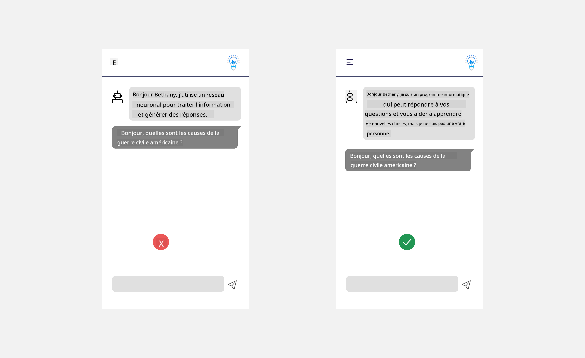
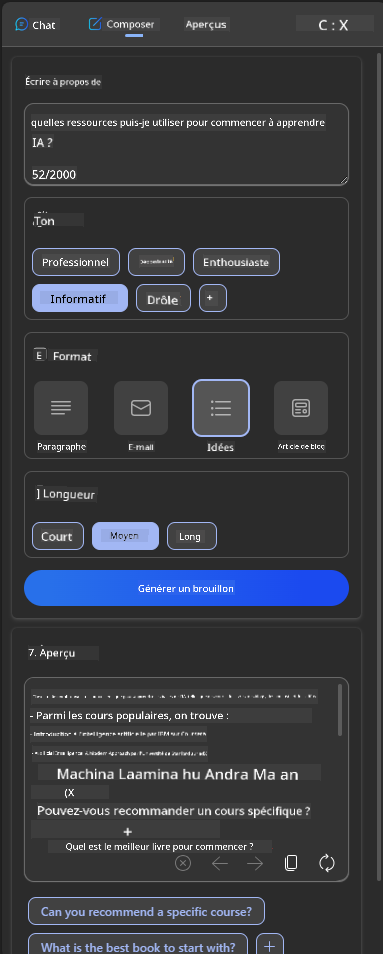
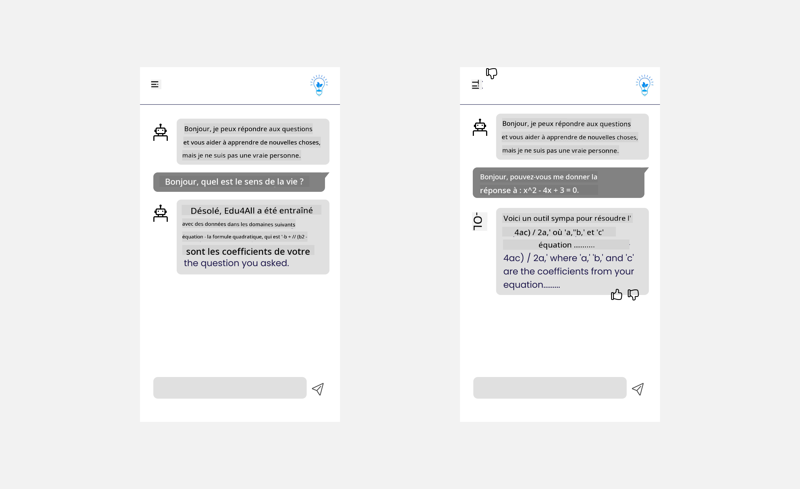

<!--
CO_OP_TRANSLATOR_METADATA:
{
  "original_hash": "ec385b41ee50579025d50cc03bfb3a25",
  "translation_date": "2025-07-09T14:48:04+00:00",
  "source_file": "12-designing-ux-for-ai-applications/README.md",
  "language_code": "fr"
}
-->
# Concevoir l’UX pour les applications d’IA

> _(Cliquez sur l’image ci-dessus pour voir la vidéo de cette leçon)_

L’expérience utilisateur est un aspect très important dans la création d’applications. Les utilisateurs doivent pouvoir utiliser votre application de manière efficace pour accomplir leurs tâches. Être efficace, c’est une chose, mais il faut aussi concevoir des applications accessibles à tous, pour les rendre _accessibles_. Ce chapitre se concentre sur cet aspect afin que vous puissiez concevoir une application que les gens peuvent et veulent utiliser.

## Introduction

L’expérience utilisateur désigne la manière dont un utilisateur interagit avec un produit ou service spécifique, qu’il s’agisse d’un système, d’un outil ou d’un design. Lors du développement d’applications d’IA, les développeurs ne se contentent pas de garantir une expérience utilisateur efficace, ils veillent aussi à ce qu’elle soit éthique. Dans cette leçon, nous abordons comment créer des applications d’Intelligence Artificielle (IA) qui répondent aux besoins des utilisateurs.

La leçon couvrira les domaines suivants :

- Introduction à l’expérience utilisateur et compréhension des besoins des utilisateurs
- Concevoir des applications d’IA pour la confiance et la transparence
- Concevoir des applications d’IA pour la collaboration et les retours

## Objectifs d’apprentissage

À l’issue de cette leçon, vous serez capable de :

- Comprendre comment créer des applications d’IA qui répondent aux besoins des utilisateurs.
- Concevoir des applications d’IA qui favorisent la confiance et la collaboration.

### Prérequis

Prenez un moment pour en apprendre davantage sur [l’expérience utilisateur et le design thinking.](https://learn.microsoft.com/training/modules/ux-design?WT.mc_id=academic-105485-koreyst)

## Introduction à l’expérience utilisateur et compréhension des besoins des utilisateurs

Dans notre startup fictive dédiée à l’éducation, nous avons deux utilisateurs principaux : les enseignants et les étudiants. Chacun a des besoins spécifiques. Une conception centrée sur l’utilisateur place ce dernier au cœur du processus, garantissant que les produits sont pertinents et bénéfiques pour ceux à qui ils sont destinés.

L’application doit être **utile, fiable, accessible et agréable** pour offrir une bonne expérience utilisateur.

### Utilisabilité

Être utile signifie que l’application propose des fonctionnalités adaptées à son objectif, comme automatiser la correction ou générer des fiches de révision. Une application qui automatise la correction doit pouvoir attribuer des notes précises et efficaces aux travaux des étudiants selon des critères prédéfinis. De même, une application qui crée des fiches de révision doit générer des questions pertinentes et variées à partir de ses données.

### Fiabilité

Être fiable signifie que l’application peut accomplir sa tâche de manière constante et sans erreur. Cependant, l’IA, tout comme les humains, n’est pas parfaite et peut commettre des erreurs. Les applications peuvent rencontrer des erreurs ou des situations inattendues nécessitant une intervention ou une correction humaine. Comment gérez-vous ces erreurs ? Dans la dernière partie de cette leçon, nous verrons comment les systèmes et applications d’IA sont conçus pour la collaboration et les retours.

### Accessibilité

Être accessible signifie étendre l’expérience utilisateur à des personnes aux capacités diverses, y compris celles en situation de handicap, afin que personne ne soit exclu. En suivant les directives et principes d’accessibilité, les solutions d’IA deviennent plus inclusives, utilisables et bénéfiques pour tous.

### Agréable

Être agréable signifie que l’application est plaisante à utiliser. Une expérience utilisateur attrayante peut avoir un impact positif, incitant l’utilisateur à revenir sur l’application et augmentant ainsi les revenus.

Tous les défis ne peuvent pas être résolus par l’IA. L’IA vient compléter votre expérience utilisateur, que ce soit en automatisant des tâches manuelles ou en personnalisant les expériences.

## Concevoir des applications d’IA pour la confiance et la transparence

La confiance est essentielle dans la conception d’applications d’IA. Elle garantit que l’utilisateur est sûr que l’application accomplira la tâche, fournira des résultats cohérents et que ces résultats correspondent à ses besoins. Un risque dans ce domaine est la méfiance ou la confiance excessive. La méfiance survient lorsque l’utilisateur a peu ou pas confiance dans un système d’IA, ce qui peut le conduire à rejeter votre application. La confiance excessive se produit lorsque l’utilisateur surestime les capacités de l’IA, ce qui peut l’amener à lui faire trop confiance. Par exemple, dans le cas d’un système de correction automatisé, une confiance excessive pourrait pousser l’enseignant à ne pas vérifier certains devoirs, ce qui pourrait entraîner des notes injustes ou inexactes, ou des occasions manquées de feedback et d’amélioration.

Deux moyens de placer la confiance au cœur de la conception sont l’explicabilité et le contrôle.

### Explicabilité

Lorsque l’IA aide à prendre des décisions, comme transmettre des connaissances aux générations futures, il est crucial que les enseignants et les parents comprennent comment ces décisions sont prises. C’est l’explicabilité : comprendre comment les applications d’IA prennent leurs décisions. Concevoir pour l’explicabilité inclut l’ajout d’exemples concrets de ce que l’application peut faire. Par exemple, au lieu de « Commencez avec AI teacher », le système peut dire : « Résumez vos notes pour une révision plus facile grâce à l’IA. »

Un autre exemple concerne l’utilisation des données personnelles et utilisateur par l’IA. Par exemple, un utilisateur avec le profil étudiant peut avoir des limitations liées à ce profil. L’IA ne pourra peut-être pas révéler les réponses aux questions, mais pourra guider l’utilisateur pour réfléchir à la manière de résoudre un problème.

Un dernier point clé de l’explicabilité est la simplification des explications. Les étudiants et enseignants ne sont pas forcément experts en IA, il faut donc que les explications sur ce que l’application peut ou ne peut pas faire soient simples et faciles à comprendre.

### Contrôle

L’IA générative crée une collaboration entre l’IA et l’utilisateur, où par exemple l’utilisateur peut modifier les requêtes pour obtenir différents résultats. De plus, une fois un résultat généré, l’utilisateur doit pouvoir le modifier, ce qui lui donne un sentiment de contrôle. Par exemple, avec Bing, vous pouvez adapter votre requête selon le format, le ton et la longueur. Vous pouvez aussi apporter des modifications au résultat comme illustré ci-dessous :

Une autre fonctionnalité de Bing qui permet à l’utilisateur de garder le contrôle est la possibilité de choisir d’autoriser ou non l’utilisation des données par l’IA. Dans une application scolaire, un étudiant pourrait vouloir utiliser ses notes ainsi que les ressources des enseignants comme matériel de révision.

> Lors de la conception d’applications d’IA, l’intentionnalité est essentielle pour éviter que les utilisateurs ne fassent une confiance excessive en fixant des attentes irréalistes quant aux capacités de l’IA. Une façon d’y parvenir est de créer une certaine friction entre les requêtes et les résultats, en rappelant à l’utilisateur qu’il s’agit d’une IA et non d’un être humain.

## Concevoir des applications d’IA pour la collaboration et les retours

Comme mentionné précédemment, l’IA générative crée une collaboration entre l’utilisateur et l’IA. La plupart du temps, l’utilisateur saisit une requête et l’IA génère un résultat. Que se passe-t-il si le résultat est incorrect ? Comment l’application gère-t-elle les erreurs ? L’IA rejette-t-elle la faute sur l’utilisateur ou prend-elle le temps d’expliquer l’erreur ?

Les applications d’IA doivent être conçues pour recevoir et fournir des retours. Cela aide non seulement à améliorer le système d’IA, mais aussi à renforcer la confiance des utilisateurs. Une boucle de feedback doit être intégrée dans la conception, par exemple un simple pouce levé ou baissé sur le résultat.

Une autre manière de gérer cela est de communiquer clairement les capacités et limites du système. Lorsqu’un utilisateur fait une demande dépassant les capacités de l’IA, il doit aussi y avoir un moyen de gérer cette situation, comme illustré ci-dessous.

Les erreurs système sont courantes dans les applications où l’utilisateur peut avoir besoin d’aide pour des informations hors du champ de l’IA, ou lorsque l’application limite le nombre de questions ou de sujets pour lesquels un résumé peut être généré. Par exemple, une application d’IA entraînée sur un nombre limité de matières, comme l’Histoire et les Mathématiques, ne pourra pas répondre à des questions sur la Géographie. Pour pallier cela, le système d’IA peut répondre : « Désolé, notre produit a été entraîné avec des données sur les matières suivantes..., je ne peux pas répondre à la question que vous avez posée. »

Les applications d’IA ne sont pas parfaites, elles feront donc des erreurs. Lors de la conception, vous devez prévoir un espace pour les retours des utilisateurs et la gestion des erreurs de manière simple et facilement compréhensible.

## Exercice

Prenez n’importe quelle application d’IA que vous avez développée jusqu’à présent et envisagez d’implémenter les étapes suivantes dans votre application :

- **Agréable :** Réfléchissez à comment rendre votre application plus plaisante. Ajoutez-vous des explications partout ? Encouragez-vous l’utilisateur à explorer ? Comment formulez-vous vos messages d’erreur ?

- **Utilisabilité :** Si vous créez une application web, assurez-vous qu’elle soit navigable à la fois à la souris et au clavier.

- **Confiance et transparence :** Ne faites pas une confiance aveugle à l’IA et à ses résultats. Réfléchissez à comment intégrer un humain dans le processus pour vérifier les résultats. Envisagez et mettez en œuvre d’autres moyens pour instaurer confiance et transparence.

- **Contrôle :** Donnez à l’utilisateur le contrôle sur les données qu’il fournit à l’application. Mettez en place un moyen pour que l’utilisateur puisse choisir d’autoriser ou non la collecte de données dans l’application d’IA.

## Poursuivez votre apprentissage !

Après avoir terminé cette leçon, consultez notre [collection d’apprentissage sur l’IA générative](https://aka.ms/genai-collection?WT.mc_id=academic-105485-koreyst) pour continuer à approfondir vos connaissances sur l’IA générative !

Rendez-vous à la leçon 13, où nous verrons comment [sécuriser les applications d’IA](../13-securing-ai-applications/README.md?WT.mc_id=academic-105485-koreyst) !

**Avertissement** :  
Ce document a été traduit à l’aide du service de traduction automatique [Co-op Translator](https://github.com/Azure/co-op-translator). Bien que nous nous efforcions d’assurer l’exactitude, veuillez noter que les traductions automatiques peuvent contenir des erreurs ou des inexactitudes. Le document original dans sa langue d’origine doit être considéré comme la source faisant foi. Pour les informations critiques, une traduction professionnelle réalisée par un humain est recommandée. Nous déclinons toute responsabilité en cas de malentendus ou de mauvaises interprétations résultant de l’utilisation de cette traduction.