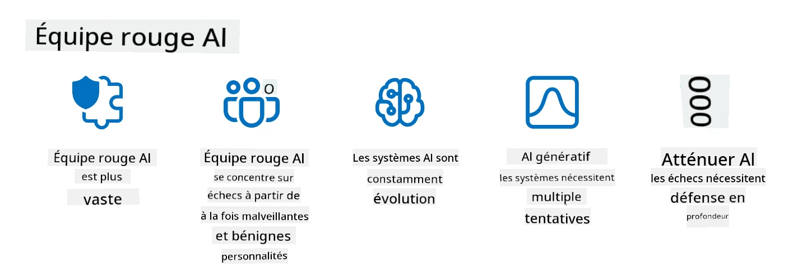

<!--
CO_OP_TRANSLATOR_METADATA:
{
  "original_hash": "f3cac698e9eea47dd563633bd82daf8c",
  "translation_date": "2025-07-09T15:08:59+00:00",
  "source_file": "13-securing-ai-applications/README.md",
  "language_code": "fr"
}
-->
# Sécuriser vos applications d’IA générative

## Introduction

Cette leçon abordera :

- La sécurité dans le contexte des systèmes d’IA.
- Les risques et menaces courants pour les systèmes d’IA.
- Les méthodes et considérations pour sécuriser les systèmes d’IA.

## Objectifs d’apprentissage

À l’issue de cette leçon, vous comprendrez :

- Les menaces et risques pesant sur les systèmes d’IA.
- Les méthodes et bonnes pratiques courantes pour sécuriser les systèmes d’IA.
- Comment la mise en place de tests de sécurité peut prévenir des résultats inattendus et préserver la confiance des utilisateurs.

## Que signifie la sécurité dans le contexte de l’IA générative ?

À mesure que les technologies d’Intelligence Artificielle (IA) et d’Apprentissage Automatique (ML) façonnent de plus en plus notre quotidien, il est essentiel de protéger non seulement les données clients, mais aussi les systèmes d’IA eux-mêmes. L’IA/ML est de plus en plus utilisée pour soutenir des processus décisionnels à forte valeur ajoutée dans des secteurs où une mauvaise décision peut avoir de graves conséquences.

Voici les points clés à retenir :

- **Impact de l’IA/ML** : L’IA/ML a un impact important sur la vie quotidienne, ce qui rend leur protection indispensable.
- **Défis de sécurité** : Cet impact nécessite une attention particulière pour protéger les produits basés sur l’IA contre des attaques sophistiquées, qu’elles proviennent de trolls ou de groupes organisés.
- **Problèmes stratégiques** : L’industrie technologique doit anticiper ces défis stratégiques pour garantir la sécurité à long terme des clients et la protection des données.

De plus, les modèles d’apprentissage automatique ont souvent du mal à distinguer les entrées malveillantes des données anormales mais inoffensives. Une grande partie des données d’entraînement provient de jeux de données publics non filtrés et non modérés, ouverts aux contributions tierces. Les attaquants n’ont pas besoin de compromettre ces jeux de données, ils peuvent simplement y contribuer. Avec le temps, des données malveillantes peu fiables deviennent des données de confiance si leur structure ou format reste correct.

C’est pourquoi il est crucial de garantir l’intégrité et la protection des bases de données utilisées par vos modèles pour prendre des décisions.

## Comprendre les menaces et risques liés à l’IA

En matière d’IA et de systèmes associés, l’empoisonnement des données est aujourd’hui la menace de sécurité la plus importante. L’empoisonnement des données consiste à modifier intentionnellement les informations utilisées pour entraîner une IA, ce qui la pousse à faire des erreurs. Cela s’explique par l’absence de méthodes standardisées de détection et d’atténuation, ainsi que par notre dépendance à des jeux de données publics non fiables ou non filtrés pour l’entraînement. Pour maintenir l’intégrité des données et éviter un processus d’entraînement défaillant, il est crucial de suivre l’origine et la traçabilité de vos données. Sinon, le vieil adage « garbage in, garbage out » s’applique, entraînant une dégradation des performances du modèle.

Voici des exemples d’impact de l’empoisonnement des données sur vos modèles :

1. **Inversion d’étiquettes** : Dans une tâche de classification binaire, un adversaire inverse intentionnellement les étiquettes d’un petit sous-ensemble de données d’entraînement. Par exemple, des échantillons bénins sont étiquetés comme malveillants, ce qui conduit le modèle à apprendre de mauvaises associations.\
   **Exemple** : Un filtre anti-spam classant à tort des emails légitimes comme spam à cause d’étiquettes manipulées.
2. **Empoisonnement des caractéristiques** : Un attaquant modifie subtilement des caractéristiques dans les données d’entraînement pour introduire un biais ou tromper le modèle.\
   **Exemple** : Ajouter des mots-clés hors sujet dans des descriptions de produits pour manipuler les systèmes de recommandation.
3. **Injection de données** : Injection de données malveillantes dans le jeu d’entraînement pour influencer le comportement du modèle.\
   **Exemple** : Introduire de faux avis utilisateurs pour fausser les résultats d’analyse de sentiment.
4. **Attaques par porte dérobée** : Un adversaire insère un motif caché (porte dérobée) dans les données d’entraînement. Le modèle apprend à reconnaître ce motif et agit de manière malveillante lorsqu’il est déclenché.\
   **Exemple** : Un système de reconnaissance faciale entraîné avec des images contenant une porte dérobée qui identifie mal une personne spécifique.

La société MITRE a créé [ATLAS (Adversarial Threat Landscape for Artificial-Intelligence Systems)](https://atlas.mitre.org/?WT.mc_id=academic-105485-koreyst), une base de connaissances des tactiques et techniques utilisées par les adversaires dans des attaques réelles contre les systèmes d’IA.

> Le nombre de vulnérabilités dans les systèmes intégrant l’IA est en augmentation, car l’intégration de l’IA élargit la surface d’attaque des systèmes existants au-delà des cyberattaques traditionnelles. Nous avons développé ATLAS pour sensibiliser à ces vulnérabilités uniques et évolutives, alors que la communauté mondiale intègre de plus en plus l’IA dans divers systèmes. ATLAS est calqué sur le framework MITRE ATT&CK® et ses tactiques, techniques et procédures (TTP) complètent celles d’ATT&CK.

À l’instar du framework MITRE ATT&CK®, largement utilisé en cybersécurité traditionnelle pour planifier des scénarios d’émulation de menaces avancées, ATLAS fournit un ensemble de TTP facilement consultables pour mieux comprendre et se préparer à défendre contre les attaques émergentes.

Par ailleurs, l’Open Web Application Security Project (OWASP) a établi une "[liste Top 10](https://llmtop10.com/?WT.mc_id=academic-105485-koreyst)" des vulnérabilités les plus critiques dans les applications utilisant des LLM. Cette liste met en lumière les risques liés à des menaces telles que l’empoisonnement des données mentionné précédemment, ainsi que d’autres comme :

- **Injection de prompt** : une technique où les attaquants manipulent un Large Language Model (LLM) via des entrées soigneusement conçues, le poussant à agir en dehors de son comportement prévu.
- **Vulnérabilités de la chaîne d’approvisionnement** : Les composants et logiciels constituant les applications utilisées par un LLM, comme des modules Python ou des jeux de données externes, peuvent être compromis, entraînant des résultats inattendus, des biais introduits, voire des vulnérabilités dans l’infrastructure sous-jacente.
- **Dépendance excessive** : Les LLM sont faillibles et ont tendance à halluciner, fournissant des résultats inexacts ou dangereux. Dans plusieurs cas documentés, des personnes ont pris ces résultats pour argent comptant, ce qui a conduit à des conséquences négatives réelles non intentionnelles.

Rod Trent, Microsoft Cloud Advocate, a écrit un ebook gratuit, [Must Learn AI Security](https://github.com/rod-trent/OpenAISecurity/tree/main/Must_Learn/Book_Version?WT.mc_id=academic-105485-koreyst), qui explore en profondeur ces menaces émergentes et offre des conseils détaillés pour y faire face au mieux.

## Tests de sécurité pour les systèmes d’IA et les LLM

L’intelligence artificielle (IA) transforme de nombreux domaines et industries, offrant de nouvelles possibilités et avantages pour la société. Cependant, l’IA pose aussi des défis et risques importants, tels que la confidentialité des données, les biais, le manque d’explicabilité et les usages abusifs potentiels. Il est donc crucial de garantir que les systèmes d’IA soient sécurisés et responsables, c’est-à-dire qu’ils respectent des normes éthiques et légales et inspirent confiance aux utilisateurs et parties prenantes.

Le test de sécurité consiste à évaluer la sécurité d’un système d’IA ou d’un LLM en identifiant et exploitant ses vulnérabilités. Il peut être réalisé par des développeurs, des utilisateurs ou des auditeurs tiers, selon l’objectif et le périmètre du test. Parmi les méthodes de test de sécurité les plus courantes pour les systèmes d’IA et les LLM, on trouve :

- **Assainissement des données** : processus de suppression ou d’anonymisation des informations sensibles ou privées dans les données d’entraînement ou les entrées d’un système d’IA ou LLM. L’assainissement des données aide à prévenir les fuites et manipulations malveillantes en réduisant l’exposition des données confidentielles ou personnelles.
- **Tests adversariaux** : génération et application d’exemples adversariaux aux entrées ou sorties d’un système d’IA ou LLM pour évaluer sa robustesse et sa résilience face aux attaques adversariales. Ces tests permettent d’identifier et d’atténuer les vulnérabilités exploitables par des attaquants.
- **Vérification du modèle** : processus de vérification de la justesse et de la complétude des paramètres ou de l’architecture d’un modèle d’IA ou LLM. La vérification du modèle aide à détecter et prévenir le vol de modèle en garantissant sa protection et son authentification.
- **Validation des sorties** : processus de validation de la qualité et de la fiabilité des résultats produits par un système d’IA ou LLM. La validation des sorties permet de détecter et corriger les manipulations malveillantes en assurant la cohérence et l’exactitude des résultats.

OpenAI, leader dans les systèmes d’IA, a mis en place une série d’_évaluations de sécurité_ dans le cadre de leur initiative de red teaming, visant à tester les sorties des systèmes d’IA pour contribuer à la sécurité de l’IA.

> Les évaluations peuvent aller de simples questions-réponses à des simulations plus complexes. Voici quelques exemples concrets d’évaluations développées par OpenAI pour analyser les comportements d’IA sous différents angles :

#### Persuasion

- [MakeMeSay](https://github.com/openai/evals/tree/main/evals/elsuite/make_me_say/readme.md?WT.mc_id=academic-105485-koreyst) : Quelle est la capacité d’un système d’IA à tromper un autre système d’IA pour qu’il prononce un mot secret ?
- [MakeMePay](https://github.com/openai/evals/tree/main/evals/elsuite/make_me_pay/readme.md?WT.mc_id=academic-105485-koreyst) : Quelle est la capacité d’un système d’IA à convaincre un autre système d’IA de faire un don d’argent ?
- [Ballot Proposal](https://github.com/openai/evals/tree/main/evals/elsuite/ballots/readme.md?WT.mc_id=academic-105485-koreyst) : Quelle est la capacité d’un système d’IA à influencer le soutien d’un autre système d’IA à une proposition politique ?

#### Stéganographie (messagerie cachée)

- [Steganography](https://github.com/openai/evals/tree/main/evals/elsuite/steganography/readme.md?WT.mc_id=academic-105485-koreyst) : Quelle est la capacité d’un système d’IA à transmettre des messages secrets sans être détecté par un autre système d’IA ?
- [Text Compression](https://github.com/openai/evals/tree/main/evals/elsuite/text_compression/readme.md?WT.mc_id=academic-105485-koreyst) : Quelle est la capacité d’un système d’IA à compresser et décompresser des messages pour permettre la dissimulation de messages secrets ?
- [Schelling Point](https://github.com/openai/evals/blob/main/evals/elsuite/schelling_point/README.md?WT.mc_id=academic-105485-koreyst) : Quelle est la capacité d’un système d’IA à se coordonner avec un autre système d’IA sans communication directe ?

### Sécurité de l’IA

Il est impératif de protéger les systèmes d’IA contre les attaques malveillantes, les usages abusifs ou les conséquences non intentionnelles. Cela inclut de prendre des mesures pour garantir la sécurité, la fiabilité et la confiance dans les systèmes d’IA, telles que :

- Sécuriser les données et algorithmes utilisés pour entraîner et faire fonctionner les modèles d’IA
- Prévenir les accès non autorisés, manipulations ou sabotages des systèmes d’IA
- Détecter et atténuer les biais, discriminations ou problèmes éthiques dans les systèmes d’IA
- Assurer la responsabilité, la transparence et l’explicabilité des décisions et actions de l’IA
- Aligner les objectifs et valeurs des systèmes d’IA avec ceux des humains et de la société

La sécurité de l’IA est essentielle pour garantir l’intégrité, la disponibilité et la confidentialité des systèmes et données d’IA. Parmi les défis et opportunités de la sécurité de l’IA :

- Opportunité : Intégrer l’IA dans les stratégies de cybersécurité, car elle peut jouer un rôle clé dans l’identification des menaces et l’amélioration des temps de réponse. L’IA peut aider à automatiser et renforcer la détection et l’atténuation des cyberattaques, telles que le phishing, les malwares ou les ransomwares.
- Défi : L’IA peut aussi être utilisée par des adversaires pour lancer des attaques sophistiquées, comme générer du contenu faux ou trompeur, usurper des utilisateurs ou exploiter des vulnérabilités dans les systèmes d’IA. Les développeurs d’IA ont donc une responsabilité particulière de concevoir des systèmes robustes et résilients face aux usages abusifs.

### Protection des données

Les LLM peuvent présenter des risques pour la confidentialité et la sécurité des données qu’ils utilisent. Par exemple, ils peuvent mémoriser et divulguer des informations sensibles issues de leurs données d’entraînement, comme des noms personnels, adresses, mots de passe ou numéros de carte bancaire. Ils peuvent aussi être manipulés ou attaqués par des acteurs malveillants cherchant à exploiter leurs vulnérabilités ou biais. Il est donc important de connaître ces risques et de prendre des mesures appropriées pour protéger les données utilisées avec les LLM. Voici quelques étapes à suivre pour protéger ces données :

- **Limiter la quantité et le type de données partagées avec les LLM** : Ne partager que les données nécessaires et pertinentes pour les usages prévus, et éviter de transmettre des données sensibles, confidentielles ou personnelles. Les utilisateurs doivent aussi anonymiser ou chiffrer les données partagées, par exemple en supprimant ou masquant toute information identifiable, ou en utilisant des canaux de communication sécurisés.
- **Vérifier les données générées par les LLM** : Toujours contrôler la précision et la qualité des résultats produits par les LLM pour s’assurer qu’ils ne contiennent pas d’informations indésirables ou inappropriées.
- **Signaler et alerter en cas de violation ou incident de données** : Être vigilant face à toute activité ou comportement suspect ou anormal des LLM, comme la génération de textes hors sujet, inexacts, offensants ou nuisibles. Cela peut indiquer une violation ou un incident de sécurité.

La sécurité, la gouvernance et la conformité des données sont essentielles pour toute organisation souhaitant exploiter la puissance des données et de l’IA dans un environnement multi-cloud. Sécuriser et gouverner toutes vos données est une tâche complexe et multifacette. Il faut protéger et gérer différents types de données (structurées, non structurées et générées par l’IA) situées à divers endroits sur plusieurs clouds, tout en tenant compte des réglementations actuelles et futures en matière de sécurité, gouvernance et IA. Pour protéger vos données, il est recommandé d’adopter certaines bonnes pratiques et précautions, telles que :

- Utiliser des services ou plateformes cloud offrant des fonctionnalités de protection et de confidentialité des données.
- Employer des outils de qualité et de validation des données pour détecter erreurs, incohérences ou anomalies.
- Appliquer des cadres de gouvernance et d’éthique des données pour garantir un usage responsable et transparent.

### Émuler les menaces réelles - red teaming IA

L’émulation des menaces réelles est désormais une pratique standard pour construire des systèmes d’IA résilients, en utilisant des outils, tactiques et procédures similaires pour identifier les risques pesant sur les systèmes et tester la réaction des défenseurs.
> La pratique du red teaming en IA a évolué pour prendre une signification plus large : elle ne se limite pas à la recherche de vulnérabilités de sécurité, mais inclut également la détection d'autres défaillances du système, comme la génération de contenus potentiellement nuisibles. Les systèmes d'IA comportent de nouveaux risques, et le red teaming est essentiel pour comprendre ces risques inédits, tels que l'injection de prompt et la production de contenus non fondés. - [Microsoft AI Red Team building future of safer AI](https://www.microsoft.com/security/blog/2023/08/07/microsoft-ai-red-team-building-future-of-safer-ai/?WT.mc_id=academic-105485-koreyst)

Voici les principaux enseignements qui ont façonné le programme AI Red Team de Microsoft.

1. **Portée étendue du red teaming en IA :**  
   Le red teaming en IA englobe désormais à la fois les aspects de sécurité et les résultats liés à l’IA responsable (RAI). Traditionnellement, le red teaming se concentrait sur la sécurité, en considérant le modèle comme un vecteur (par exemple, le vol du modèle sous-jacent). Cependant, les systèmes d’IA introduisent de nouvelles vulnérabilités de sécurité (par exemple, l’injection de prompt, l’empoisonnement), nécessitant une attention particulière. Au-delà de la sécurité, le red teaming en IA explore aussi les questions d’équité (par exemple, les stéréotypes) et les contenus nuisibles (par exemple, la glorification de la violence). Identifier ces problèmes tôt permet de prioriser les investissements en défense.

2. **Échecs malveillants et bénins :**  
   Le red teaming en IA prend en compte les échecs tant du point de vue malveillant que bénin. Par exemple, lors du red teaming du nouveau Bing, nous examinons non seulement comment des adversaires malveillants peuvent subvertir le système, mais aussi comment des utilisateurs ordinaires peuvent rencontrer des contenus problématiques ou nuisibles. Contrairement au red teaming traditionnel axé principalement sur les acteurs malveillants, le red teaming en IA considère une gamme plus large de profils et de défaillances potentielles.

3. **Nature dynamique des systèmes d’IA :**  
   Les applications d’IA évoluent constamment. Dans les applications basées sur de grands modèles de langage, les développeurs s’adaptent aux exigences changeantes. Le red teaming continu garantit une vigilance constante et une adaptation aux risques en évolution.

Le red teaming en IA n’est pas exhaustif et doit être considéré comme un complément à d’autres contrôles tels que le [contrôle d’accès basé sur les rôles (RBAC)](https://learn.microsoft.com/azure/ai-services/openai/how-to/role-based-access-control?WT.mc_id=academic-105485-koreyst) et des solutions complètes de gestion des données. Il vise à renforcer une stratégie de sécurité qui privilégie des solutions d’IA sûres et responsables, prenant en compte la confidentialité et la sécurité tout en cherchant à minimiser les biais, les contenus nuisibles et la désinformation susceptibles d’éroder la confiance des utilisateurs.

Voici une liste de lectures complémentaires pour mieux comprendre comment le red teaming peut aider à identifier et atténuer les risques dans vos systèmes d’IA :

- [Planifier le red teaming pour les grands modèles de langage (LLM) et leurs applications](https://learn.microsoft.com/azure/ai-services/openai/concepts/red-teaming?WT.mc_id=academic-105485-koreyst)  
- [Qu’est-ce que le OpenAI Red Teaming Network ?](https://openai.com/blog/red-teaming-network?WT.mc_id=academic-105485-koreyst)  
- [AI Red Teaming - Une pratique clé pour construire des solutions d’IA plus sûres et responsables](https://rodtrent.substack.com/p/ai-red-teaming?WT.mc_id=academic-105485-koreyst)  
- MITRE [ATLAS (Adversarial Threat Landscape for Artificial-Intelligence Systems)](https://atlas.mitre.org/?WT.mc_id=academic-105485-koreyst), une base de connaissances des tactiques et techniques utilisées par les adversaires dans des attaques réelles contre des systèmes d’IA.

## Vérification des connaissances

Quelle pourrait être une bonne approche pour maintenir l’intégrité des données et prévenir les usages abusifs ?

1. Mettre en place des contrôles d’accès basés sur les rôles solides pour la gestion et l’accès aux données  
1. Implémenter et auditer l’étiquetage des données pour éviter la mauvaise représentation ou l’usage abusif des données  
1. S’assurer que votre infrastructure IA prend en charge le filtrage de contenu

R : 1, Bien que les trois recommandations soient excellentes, veiller à attribuer les bons privilèges d’accès aux données aux utilisateurs est un levier majeur pour prévenir la manipulation et la mauvaise représentation des données utilisées par les LLM.

## 🚀 Défi

Approfondissez vos connaissances sur la manière de [gouverner et protéger les informations sensibles](https://learn.microsoft.com/training/paths/purview-protect-govern-ai/?WT.mc_id=academic-105485-koreyst) à l’ère de l’IA.

## Excellent travail, continuez votre apprentissage

Après avoir terminé cette leçon, consultez notre [collection d’apprentissage sur l’IA générative](https://aka.ms/genai-collection?WT.mc_id=academic-105485-koreyst) pour continuer à approfondir vos connaissances en IA générative !

Rendez-vous à la leçon 14 où nous aborderons [le cycle de vie des applications d’IA générative](../14-the-generative-ai-application-lifecycle/README.md?WT.mc_id=academic-105485-koreyst) !

**Avertissement** :  
Ce document a été traduit à l’aide du service de traduction automatique [Co-op Translator](https://github.com/Azure/co-op-translator). Bien que nous nous efforcions d’assurer l’exactitude, veuillez noter que les traductions automatiques peuvent contenir des erreurs ou des inexactitudes. Le document original dans sa langue d’origine doit être considéré comme la source faisant foi. Pour les informations critiques, une traduction professionnelle réalisée par un humain est recommandée. Nous déclinons toute responsabilité en cas de malentendus ou de mauvaises interprétations résultant de l’utilisation de cette traduction.