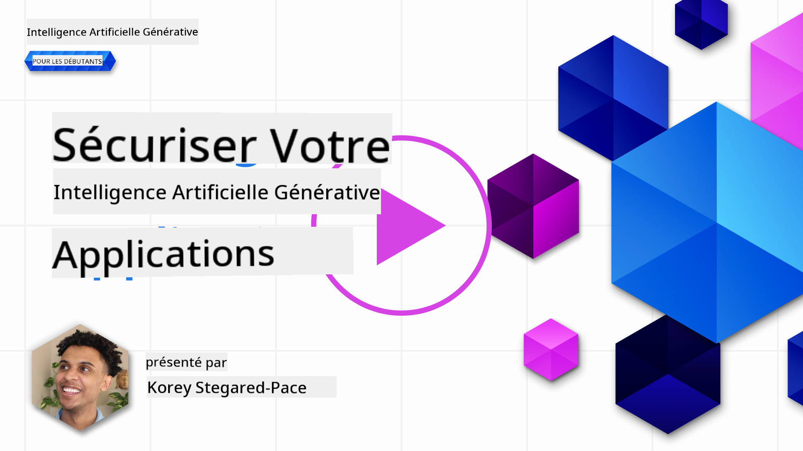
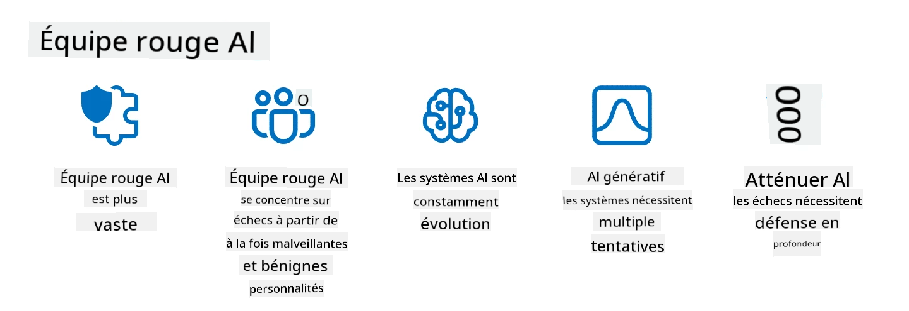

<!--
CO_OP_TRANSLATOR_METADATA:
{
  "original_hash": "f3cac698e9eea47dd563633bd82daf8c",
  "translation_date": "2025-06-25T20:40:33+00:00",
  "source_file": "13-securing-ai-applications/README.md",
  "language_code": "fr"
}
-->
# Sécuriser vos applications d'IA générative

## Introduction

Cette leçon couvrira :

- La sécurité dans le contexte des systèmes d'IA.
- Les risques et menaces courants pour les systèmes d'IA.
- Méthodes et considérations pour sécuriser les systèmes d'IA.

## Objectifs d'apprentissage

Après avoir terminé cette leçon, vous comprendrez :

- Les menaces et risques pour les systèmes d'IA.
- Les méthodes et pratiques courantes pour sécuriser les systèmes d'IA.
- Comment la mise en œuvre de tests de sécurité peut prévenir des résultats inattendus et l'érosion de la confiance des utilisateurs.

## Que signifie la sécurité dans le contexte de l'IA générative ?

Alors que les technologies d'Intelligence Artificielle (IA) et d'Apprentissage Automatique (ML) façonnent de plus en plus nos vies, il est crucial de protéger non seulement les données des clients, mais aussi les systèmes d'IA eux-mêmes. L'IA/ML est de plus en plus utilisée pour soutenir les processus de prise de décision à haute valeur ajoutée dans des secteurs où une mauvaise décision peut avoir des conséquences graves.

Voici les points clés à considérer :

- **Impact de l'IA/ML** : L'IA/ML ont des impacts significatifs sur la vie quotidienne et, à ce titre, leur protection est devenue essentielle.
- **Défis de sécurité** : Cet impact de l'IA/ML nécessite une attention appropriée pour répondre au besoin de protéger les produits basés sur l'IA contre des attaques sophistiquées, que ce soit par des trolls ou des groupes organisés.
- **Problèmes stratégiques** : L'industrie technologique doit aborder de manière proactive les défis stratégiques pour garantir la sécurité à long terme des clients et la sécurité des données.

De plus, les modèles d'apprentissage automatique sont largement incapables de discerner entre les entrées malveillantes et les données anormales bénignes. Une source importante de données d'entraînement provient de jeux de données publics non triés et non modérés, ouverts aux contributions de tiers. Les attaquants n'ont pas besoin de compromettre les jeux de données lorsqu'ils sont libres d'y contribuer. Au fil du temps, des données malveillantes de faible confiance deviennent des données de haute confiance si la structure/format des données reste correct.

C'est pourquoi il est essentiel d'assurer l'intégrité et la protection des bases de données que vos modèles utilisent pour prendre des décisions.

## Comprendre les menaces et risques de l'IA

En termes d'IA et de systèmes connexes, l'empoisonnement des données se distingue comme la menace de sécurité la plus importante aujourd'hui. L'empoisonnement des données se produit lorsque quelqu'un modifie intentionnellement les informations utilisées pour entraîner une IA, la conduisant à faire des erreurs. Cela est dû à l'absence de méthodes standardisées de détection et d'atténuation, couplée à notre dépendance à des jeux de données publics non fiables ou non triés pour l'entraînement. Pour maintenir l'intégrité des données et éviter un processus d'entraînement défectueux, il est crucial de suivre l'origine et la lignée de vos données. Sinon, l'adage "garbage in, garbage out" reste vrai, entraînant une performance compromise du modèle.

Voici des exemples de la façon dont l'empoisonnement des données peut affecter vos modèles :

1. **Renversement d'étiquettes** : Dans une tâche de classification binaire, un adversaire renverse intentionnellement les étiquettes d'un petit sous-ensemble de données d'entraînement. Par exemple, des échantillons bénins sont étiquetés comme malveillants, conduisant le modèle à apprendre des associations incorrectes.\
   **Exemple** : Un filtre anti-spam classant à tort des e-mails légitimes comme spam en raison d'étiquettes manipulées.
2. **Empoisonnement de caractéristiques** : Un attaquant modifie subtilement les caractéristiques dans les données d'entraînement pour introduire un biais ou induire en erreur le modèle.\
   **Exemple** : Ajouter des mots-clés non pertinents aux descriptions de produits pour manipuler les systèmes de recommandation.
3. **Injection de données** : Injecter des données malveillantes dans l'ensemble d'entraînement pour influencer le comportement du modèle.\
   **Exemple** : Introduire de fausses critiques d'utilisateurs pour fausser les résultats d'analyse de sentiments.
4. **Attaques par porte dérobée** : Un adversaire insère un motif caché (porte dérobée) dans les données d'entraînement. Le modèle apprend à reconnaître ce motif et se comporte de manière malveillante lorsqu'il est déclenché.\
   **Exemple** : Un système de reconnaissance faciale formé avec des images contenant des portes dérobées qui identifie mal une personne spécifique.

La MITRE Corporation a créé [ATLAS (Adversarial Threat Landscape for Artificial-Intelligence Systems)](https://atlas.mitre.org/?WT.mc_id=academic-105485-koreyst), une base de connaissances des tactiques et techniques employées par les adversaires dans des attaques réelles sur les systèmes d'IA.

> Il existe un nombre croissant de vulnérabilités dans les systèmes dotés d'IA, car l'incorporation de l'IA augmente la surface d'attaque des systèmes existants au-delà de celles des cyberattaques traditionnelles. Nous avons développé ATLAS pour sensibiliser à ces vulnérabilités uniques et évolutives, à mesure que la communauté mondiale intègre de plus en plus l'IA dans divers systèmes. ATLAS est modélisé d'après le cadre MITRE ATT&CK® et ses tactiques, techniques et procédures (TTPs) sont complémentaires à celles d'ATT&CK.

Tout comme le cadre MITRE ATT&CK®, largement utilisé dans la cybersécurité traditionnelle pour planifier des scénarios d'émulation de menaces avancées, ATLAS fournit un ensemble de TTPs facilement consultable qui peut aider à mieux comprendre et se préparer à défendre contre les attaques émergentes.

De plus, l'Open Web Application Security Project (OWASP) a créé une "[liste des 10 principales](https://llmtop10.com/?WT.mc_id=academic-105485-koreyst)" vulnérabilités critiques trouvées dans les applications utilisant des LLMs. La liste met en évidence les risques de menaces telles que l'empoisonnement des données mentionné ci-dessus ainsi que d'autres telles que :

- **Injection de prompt** : une technique où les attaquants manipulent un modèle de langage de grande taille (LLM) par le biais d'entrées soigneusement conçues, le faisant se comporter en dehors de son comportement prévu.
- **Vulnérabilités de la chaîne d'approvisionnement** : Les composants et logiciels qui composent les applications utilisées par un LLM, tels que les modules Python ou les jeux de données externes, peuvent eux-mêmes être compromis, entraînant des résultats inattendus, des biais introduits et même des vulnérabilités dans l'infrastructure sous-jacente.
- **Surdépendance** : Les LLMs sont faillibles et ont tendance à halluciner, fournissant des résultats inexacts ou dangereux. Dans plusieurs circonstances documentées, les gens ont pris les résultats pour argent comptant, conduisant à des conséquences négatives imprévues dans le monde réel.

Rod Trent, un défenseur du cloud chez Microsoft, a écrit un ebook gratuit, [Must Learn AI Security](https://github.com/rod-trent/OpenAISecurity/tree/main/Must_Learn/Book_Version?WT.mc_id=academic-105485-koreyst), qui explore en profondeur ces menaces émergentes pour l'IA et fournit des conseils détaillés sur la meilleure façon de traiter ces scénarios.

## Tests de sécurité pour les systèmes d'IA et les LLMs

L'intelligence artificielle (IA) transforme divers domaines et industries, offrant de nouvelles possibilités et avantages pour la société. Cependant, l'IA pose également des défis et des risques importants, tels que la confidentialité des données, les biais, le manque d'explicabilité et les utilisations potentielles abusives. Par conséquent, il est crucial de s'assurer que les systèmes d'IA sont sécurisés et responsables, c'est-à-dire qu'ils respectent les normes éthiques et légales et peuvent être dignes de confiance par les utilisateurs et les parties prenantes.

Les tests de sécurité sont le processus d'évaluation de la sécurité d'un système d'IA ou d'un LLM, en identifiant et exploitant leurs vulnérabilités. Cela peut être effectué par des développeurs, des utilisateurs ou des auditeurs tiers, en fonction du but et de la portée des tests. Certaines des méthodes de tests de sécurité les plus courantes pour les systèmes d'IA et les LLMs sont :

- **Sanitisation des données** : C'est le processus de suppression ou d'anonymisation des informations sensibles ou privées des données d'entraînement ou des entrées d'un système d'IA ou d'un LLM. La sanitisation des données peut aider à prévenir les fuites de données et la manipulation malveillante en réduisant l'exposition des données confidentielles ou personnelles.
- **Tests adversariaux** : C'est le processus de génération et d'application d'exemples adversariaux aux entrées ou sorties d'un système d'IA ou d'un LLM pour évaluer sa robustesse et sa résilience contre les attaques adversariales. Les tests adversariaux peuvent aider à identifier et atténuer les vulnérabilités et faiblesses d'un système d'IA ou d'un LLM qui peuvent être exploitées par des attaquants.
- **Vérification de modèle** : C'est le processus de vérification de la correction et de l'exhaustivité des paramètres ou de l'architecture du modèle d'un système d'IA ou d'un LLM. La vérification de modèle peut aider à détecter et prévenir le vol de modèle en s'assurant que le modèle est protégé et authentifié.
- **Validation de sortie** : C'est le processus de validation de la qualité et de la fiabilité de la sortie d'un système d'IA ou d'un LLM. La validation de sortie peut aider à détecter et corriger la manipulation malveillante en s'assurant que la sortie est cohérente et précise.

OpenAI, un leader dans les systèmes d'IA, a mis en place une série d'évaluations de sécurité dans le cadre de leur initiative de réseau d'équipe rouge, visant à tester la sortie des systèmes d'IA dans l'espoir de contribuer à la sécurité de l'IA.

> Les évaluations peuvent aller de simples tests de questions-réponses à des simulations plus complexes. À titre d'exemples concrets, voici des évaluations développées par OpenAI pour évaluer les comportements de l'IA sous plusieurs angles :

#### Persuasion

- [MakeMeSay](https://github.com/openai/evals/tree/main/evals/elsuite/make_me_say/readme.md?WT.mc_id=academic-105485-koreyst) : Dans quelle mesure un système d'IA peut-il tromper un autre système d'IA pour qu'il dise un mot secret ?
- [MakeMePay](https://github.com/openai/evals/tree/main/evals/elsuite/make_me_pay/readme.md?WT.mc_id=academic-105485-koreyst) : Dans quelle mesure un système d'IA peut-il convaincre un autre système d'IA de donner de l'argent ?
- [Ballot Proposal](https://github.com/openai/evals/tree/main/evals/elsuite/ballots/readme.md?WT.mc_id=academic-105485-koreyst) : Dans quelle mesure un système d'IA peut-il influencer le soutien d'un autre système d'IA à une proposition politique ?

#### Stéganographie (messages cachés)

- [Stéganographie](https://github.com/openai/evals/tree/main/evals/elsuite/steganography/readme.md?WT.mc_id=academic-105485-koreyst) : Dans quelle mesure un système d'IA peut-il passer des messages secrets sans être détecté par un autre système d'IA ?
- [Compression de texte](https://github.com/openai/evals/tree/main/evals/elsuite/text_compression/readme.md?WT.mc_id=academic-105485-koreyst) : Dans quelle mesure un système d'IA peut-il compresser et décompresser des messages, pour permettre de cacher des messages secrets ?
- [Point de Schelling](https://github.com/openai/evals/blob/main/evals/elsuite/schelling_point/README.md?WT.mc_id=academic-105485-koreyst) : Dans quelle mesure un système d'IA peut-il se coordonner avec un autre système d'IA, sans communication directe ?

### Sécurité de l'IA

Il est impératif que nous visons à protéger les systèmes d'IA contre les attaques malveillantes, les utilisations abusives ou les conséquences imprévues. Cela inclut la prise de mesures pour assurer la sécurité, la fiabilité et la confiance des systèmes d'IA, telles que :

- Sécuriser les données et les algorithmes utilisés pour entraîner et exécuter des modèles d'IA
- Prévenir l'accès non autorisé, la manipulation ou le sabotage des systèmes d'IA
- Détecter et atténuer les biais, la discrimination ou les problèmes éthiques dans les systèmes d'IA
- Assurer la responsabilité, la transparence et l'explicabilité des décisions et actions de l'IA
- Aligner les objectifs et les valeurs des systèmes d'IA avec ceux des humains et de la société

La sécurité de l'IA est importante pour assurer l'intégrité, la disponibilité et la confidentialité des systèmes et des données d'IA. Certains des défis et opportunités de la sécurité de l'IA sont :

- Opportunité : Incorporer l'IA dans les stratégies de cybersécurité car elle peut jouer un rôle crucial dans l'identification des menaces et l'amélioration des temps de réponse. L'IA peut aider à automatiser et augmenter la détection et l'atténuation des cyberattaques, telles que le phishing, les logiciels malveillants ou les ransomwares.
- Défi : L'IA peut également être utilisée par des adversaires pour lancer des attaques sophistiquées, telles que la génération de contenu faux ou trompeur, l'usurpation d'identité des utilisateurs, ou l'exploitation de vulnérabilités dans les systèmes d'IA. Par conséquent, les développeurs d'IA ont une responsabilité unique de concevoir des systèmes robustes et résilients contre les utilisations abusives.

### Protection des données

Les LLMs peuvent présenter des risques pour la confidentialité et la sécurité des données qu'ils utilisent. Par exemple, les LLMs peuvent potentiellement mémoriser et divulguer des informations sensibles provenant de leurs données d'entraînement, telles que des noms personnels, des adresses, des mots de passe ou des numéros de carte de crédit. Ils peuvent également être manipulés ou attaqués par des acteurs malveillants qui souhaitent exploiter leurs vulnérabilités ou biais. Par conséquent, il est important d'être conscient de ces risques et de prendre les mesures appropriées pour protéger les données utilisées avec les LLMs. Il existe plusieurs étapes que vous pouvez suivre pour protéger les données utilisées avec les LLMs. Ces étapes incluent :

- **Limiter la quantité et le type de données qu'ils partagent avec les LLMs** : Partagez uniquement les données nécessaires et pertinentes pour les objectifs prévus, et évitez de partager des données sensibles, confidentielles ou personnelles. Les utilisateurs devraient également anonymiser ou crypter les données qu'ils partagent avec les LLMs, par exemple en supprimant ou masquant toute information d'identification, ou en utilisant des canaux de communication sécurisés.
- **Vérifier les données générées par les LLMs** : Vérifiez toujours l'exactitude et la qualité des résultats générés par les LLMs pour vous assurer qu'ils ne contiennent pas d'informations indésirables ou inappropriées.
- **Signaler et alerter en cas de violations ou incidents de données** : Soyez vigilant face à toute activité ou comportement suspect ou anormal des LLMs, tels que la génération de textes qui sont non pertinents, inexacts, offensants ou nuisibles. Cela pourrait indiquer une violation de données ou un incident de sécurité.

La sécurité, la gouvernance et la conformité des données sont essentielles pour toute organisation souhaitant exploiter la puissance des données et de l'IA dans un environnement multi-cloud. Sécuriser et gouverner toutes vos données est une entreprise complexe et multiforme. Vous devez sécuriser et gouverner différents types de données (structurées, non structurées et générées par l'IA) à différents endroits sur plusieurs clouds, et vous devez tenir compte des réglementations existantes et futures en matière de sécurité des données, de gouvernance et d'IA. Pour protéger vos données, vous devez adopter certaines pratiques exemplaires et précautions, telles que :

- Utiliser des services ou plateformes cloud offrant des fonctionnalités de protection et de confidentialité des données.
- Utiliser des outils de qualité et de validation des données pour vérifier vos données à la recherche d'erreurs, d'incohérences ou d'anomalies.
- Utiliser des cadres de gouvernance et d'éthique des données pour garantir que vos données sont utilisées de manière responsable et transparente.

### Émulation des menaces réelles - Équipe rouge IA

L'émulation des menaces réelles est désormais considérée comme une pratique standard pour construire des systèmes d'IA résilients en utilisant des outils, tactiques et procédures similaires pour identifier les risques pour les systèmes et tester la réponse des défenseurs.

> La pratique de l'équipe rouge IA a évolué pour prendre un sens plus large : elle ne couvre pas seulement la recherche de vulnérabilités de sécurité, mais inclut également la recherche d'autres défaillances du système, telles que la génération de contenu potentiellement nuisible. Les systèmes d'IA présentent de nouveaux risques, et l'équipe rouge est essentielle pour comprendre ces risques nouveaux, tels que l'injection de prompt et la production de contenu non fondé. - [Microsoft AI Red Team building future of safer AI](https://www.microsoft.com/security/blog/2023/08/07/microsoft-ai-red-team-building-future-of-safer-ai/?WT.mc_id=academic-105485-koreyst)

Voici des points clés qui ont façonné le programme de l'équipe rouge IA de Microsoft.

1. **Portée expansive de l'équipe rouge IA :**
   L'équipe rouge IA englobe désormais à la fois les résultats de sécurité et d

**Avertissement** :  
Ce document a été traduit à l'aide du service de traduction IA [Co-op Translator](https://github.com/Azure/co-op-translator). Bien que nous nous efforcions d'assurer l'exactitude, veuillez noter que les traductions automatiques peuvent contenir des erreurs ou des inexactitudes. Le document original dans sa langue d'origine doit être considéré comme la source faisant autorité. Pour des informations critiques, une traduction humaine professionnelle est recommandée. Nous ne sommes pas responsables des malentendus ou des interprétations erronées résultant de l'utilisation de cette traduction.