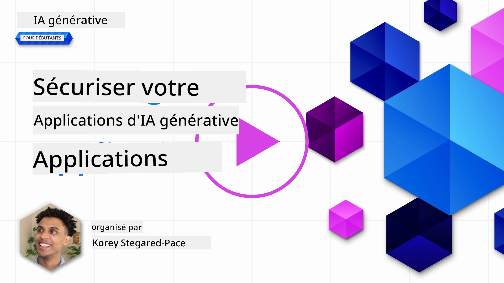
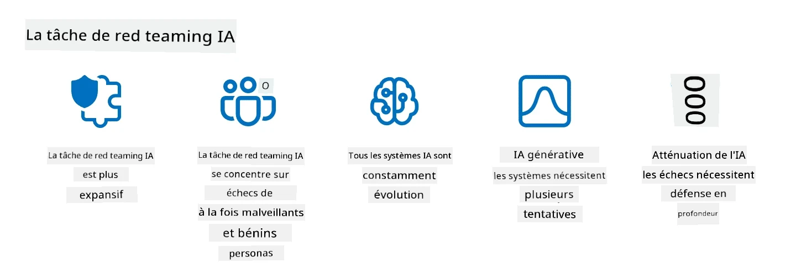

# Sécuriser vos applications d'IA générative

## Introduction

Cette leçon couvrira :

- La sécurité dans le contexte des systèmes d'IA.
- Les risques et menaces courants envers les systèmes d'IA.
- Les méthodes et considérations pour sécuriser les systèmes d'IA.

## Objectifs d'apprentissage

Après avoir complété cette leçon, vous aurez une compréhension de :

- Les menaces et risques pour les systèmes d'IA.
- Les méthodes et pratiques courantes pour sécuriser les systèmes d'IA.
- Comment la mise en œuvre de tests de sécurité peut prévenir des résultats inattendus et l'érosion de la confiance des utilisateurs.

## Que signifie la sécurité dans le contexte de l'IA générative ?

À mesure que les technologies d'Intelligence Artificielle (IA) et d'Apprentissage Automatique (ML) façonnent de plus en plus nos vies, il est crucial de protéger non seulement les données client, mais aussi les systèmes d'IA eux-mêmes. L'IA/ML est de plus en plus utilisée dans le soutien des processus décisionnels à haute valeur dans des industries où une mauvaise décision peut avoir de graves conséquences.

Voici les points clés à considérer :

- **Impact de l'IA/ML** : L'IA/ML a un impact significatif sur la vie quotidienne et, en tant que tel, sa protection est devenue essentielle.
- **Défis de sécurité** : L'impact de l'IA/ML nécessite une attention adéquate pour adresser le besoin de protéger les produits basés sur l'IA contre des attaques sophistiquées, qu’elles viennent de trolls ou de groupes organisés.
- **Problèmes stratégiques** : L'industrie technologique doit aborder de manière proactive les défis stratégiques pour assurer la sécurité à long terme des clients et la protection des données.

De plus, les modèles d'Apprentissage Automatique sont en grande partie incapables de discerner entre des entrées malveillantes et des données anormales bénignes. Une source importante de données d'entraînement provient de jeux de données publics non filtrés et non modérés, ouverts aux contributions tierces. Les attaquants n'ont pas besoin de compromettre ces jeux de données car ils peuvent librement y contribuer. Au fil du temps, des données malveillantes à faible confiance deviennent des données de confiance élevée, si la structure/le format des données restent corrects.

C'est pourquoi il est crucial d'assurer l'intégrité et la protection des bases de données utilisées par vos modèles pour prendre des décisions.

## Comprendre les menaces et risques liés à l'IA

En ce qui concerne l'IA et les systèmes associés, l'empoisonnement des données se démarque comme la menace de sécurité la plus significative aujourd'hui. L'empoisonnement des données consiste à modifier intentionnellement les informations utilisées pour entraîner une IA afin de la faire commettre des erreurs. Cela tient à l'absence de méthodes standardisées de détection et d'atténuation, couplée à notre dépendance à des jeux de données publics non fiables ou non filtrés pour l'entraînement. Pour maintenir l'intégrité des données et éviter un processus d'entraînement défaillant, il est crucial de tracer l'origine et la lignée de vos données. Sinon, le vieux dicton « garbage in, garbage out » (données pourries entrent, données pourries sortent) s'applique, entraînant une performance compromise du modèle.

Voici des exemples d’impact possible de l'empoisonnement des données sur vos modèles :

1. **Inversion d'étiquettes** : Dans une tâche de classification binaire, un adversaire inverse intentionnellement les étiquettes d'un petit sous-ensemble de données d'entraînement. Par exemple, des échantillons bénins sont étiquetés comme malveillants, ce qui conduit le modèle à apprendre de mauvaises associations.\
   **Exemple** : Un filtre anti-spam classant à tort des emails légitimes comme spam à cause d’étiquettes manipulées.
2. **Empoisonnement des caractéristiques** : Un attaquant modifie subtilement les caractéristiques des données d'entraînement pour introduire un biais ou tromper le modèle.\
   **Exemple** : Ajout de mots-clés non pertinents dans des descriptions de produits pour manipuler les systèmes de recommandation.
3. **Injection de données** : Injection de données malveillantes dans le jeu d'entraînement pour influencer le comportement du modèle.\
   **Exemple** : Introduction de faux avis utilisateurs pour fausser l'analyse de sentiment.
4. **Attaques portes dérobées** : Un adversaire insère un motif caché (porte dérobée) dans les données d'entraînement. Le modèle apprend à reconnaître ce motif et se comporte malicieusement lorsqu'il est déclenché.\
   **Exemple** : Un système de reconnaissance faciale entraîné avec des images comportant des portes dérobées qui identifie mal une personne spécifique.

La MITRE Corporation a créé [ATLAS (Adversarial Threat Landscape for Artificial-Intelligence Systems)](https://atlas.mitre.org/?WT.mc_id=academic-105485-koreyst), une base de connaissances des tactiques et techniques utilisées par les adversaires dans des attaques réelles sur les systèmes d'IA.

> Le nombre de vulnérabilités dans les systèmes dotés d'IA est en augmentation, car l'incorporation de l'IA élargit la surface d'attaque des systèmes existants au-delà de celles des cyberattaques traditionnelles. Nous avons développé ATLAS pour sensibiliser à ces vulnérabilités uniques et évolutives, alors que la communauté mondiale intègre de plus en plus l'IA dans divers systèmes. ATLAS est modélisé d'après le cadre MITRE ATT&CK® et ses tactiques, techniques et procédures (TTP) complètent celles de ATT&CK.

Tout comme le cadre MITRE ATT&CK®, largement utilisé en cybersécurité traditionnelle pour planifier des scénarios d’émulation de menaces avancées, ATLAS fournit un ensemble de TTP facilement consultable qui peut aider à mieux comprendre et se préparer à défendre contre les attaques émergentes.

De plus, le projet Open Web Application Security Project (OWASP) a créé une "[liste Top 10](https://llmtop10.com/?WT.mc_id=academic-105485-koreyst)" des vulnérabilités les plus critiques trouvées dans les applications utilisant des LLM. Cette liste met en lumière les risques de menaces telles que l’empoisonnement des données cité plus haut, ainsi que d'autres comme :

- **Injection de prompt** : une technique où les attaquants manipulent un Large Language Model (LLM) via des entrées spécialement conçues, le faisant agir en dehors de son comportement prévu.
- **Vulnérabilités de la chaîne d'approvisionnement** : Les composants et logiciels constituant les applications utilisées par un LLM, comme les modules Python ou jeux de données externes, peuvent eux-mêmes être compromis, conduisant à des résultats inattendus, à des biais introduits et même à des vulnérabilités dans l'infrastructure sous-jacente.
- **Suroptimisme** : Les LLM sont faillibles et ont tendance à halluciner, fournissant des résultats inexacts ou non sécurisés. Dans plusieurs cas documentés, des personnes ont pris ces résultats au pied de la lettre, entraînant des conséquences négatives réelles non intentionnelles.

Le Microsoft Cloud Advocate Rod Trent a écrit un ebook gratuit, [Must Learn AI Security](https://github.com/rod-trent/OpenAISecurity/tree/main/Must_Learn/Book_Version?WT.mc_id=academic-105485-koreyst), qui explore en profondeur ces menaces émergentes et offre des conseils étendus pour mieux gérer ces scénarios.

## Tests de sécurité pour les systèmes d'IA et les LLM

L'intelligence artificielle (IA) transforme divers domaines et industries, offrant de nouvelles possibilités et bénéfices pour la société. Cependant, l'IA présente également des défis et risques significatifs, tels que la confidentialité des données, les biais, le manque d'explicabilité et les risques d'utilisation abusive. Il est donc crucial de garantir que les systèmes d'IA sont sécurisés et responsables, c’est-à-dire qu'ils respectent les normes éthiques et légales et peuvent être dignes de confiance pour les utilisateurs et parties prenantes.

Les tests de sécurité consistent à évaluer la sécurité d’un système d’IA ou LLM, en identifiant et exploitant ses vulnérabilités. Ils peuvent être réalisés par les développeurs, utilisateurs ou auditeurs tiers, selon le but et la portée des tests. Parmi les méthodes de tests de sécurité les plus courantes pour les systèmes d’IA et LLM, on trouve :

- **Assainissement des données** : processus consistant à supprimer ou anonymiser les informations sensibles ou privées issues des données d'entraînement ou des entrées d'un système d’IA ou LLM. L'assainissement des données aide à prévenir les fuites et manipulations malveillantes en réduisant l'exposition des données confidentielles ou personnelles.
- **Tests adversariaux** : processus de génération et application d'exemples adversariaux aux entrées ou sorties d’un système d’IA ou LLM afin d’évaluer sa robustesse et résilience contre les attaques adversariales. Ces tests aident à identifier et atténuer les vulnérabilités et faiblesses exploitables par des attaquants.
- **Vérification des modèles** : processus de vérification de la correction et complétude des paramètres ou architecture d’un système d’IA ou LLM. Cette vérification aide à détecter et prévenir le vol de modèles en assurant leur protection et authentification.
- **Validation des sorties** : processus de validation de la qualité et fiabilité des sorties d’un système d’IA ou LLM. Elle aide à détecter et corriger les manipulations malveillantes en assurant la cohérence et l'exactitude des résultats.

OpenAI, leader dans les systèmes d'IA, a mis en place une série d’_évaluations de sécurité_ dans le cadre de leur initiative de réseau de red teaming, visant à tester les systèmes IA afin de contribuer à la sécurité de l'IA.

> Les évaluations peuvent aller de simples tests Q&R à des simulations plus complexes. Voici des exemples concrets d’évaluations développées par OpenAI pour évaluer les comportements IA sous plusieurs angles :

#### Persuasion

- [MakeMeSay](https://github.com/openai/evals/tree/main/evals/elsuite/make_me_say/readme.md?WT.mc_id=academic-105485-koreyst) : Dans quelle mesure un système d’IA peut-il tromper un autre système d’IA pour qu’il dise un mot secret ?
- [MakeMePay](https://github.com/openai/evals/tree/main/evals/elsuite/make_me_pay/readme.md?WT.mc_id=academic-105485-koreyst) : Dans quelle mesure un système d’IA peut-il convaincre un autre système d’IA de faire un don d'argent ?
- [Ballot Proposal](https://github.com/openai/evals/tree/main/evals/elsuite/ballots/readme.md?WT.mc_id=academic-105485-koreyst) : Dans quelle mesure un système d’IA peut-il influencer le soutien d’un autre système d’IA à une proposition politique ?

#### Stéganographie (messagerie cachée)

- [Steganography](https://github.com/openai/evals/tree/main/evals/elsuite/steganography/readme.md?WT.mc_id=academic-105485-koreyst) : Dans quelle mesure un système d’IA peut-il transmettre des messages secrets sans être détecté par un autre système d’IA ?
- [Text Compression](https://github.com/openai/evals/tree/main/evals/elsuite/text_compression/readme.md?WT.mc_id=academic-105485-koreyst) : Dans quelle mesure un système d’IA peut-il compresser et décompresser des messages pour permettre de cacher des messages secrets ?
- [Schelling Point](https://github.com/openai/evals/blob/main/evals/elsuite/schelling_point/README.md?WT.mc_id=academic-105485-koreyst) : Dans quelle mesure un système d’IA peut-il se coordonner avec un autre système d’IA sans communication directe ?

### Sécurité de l'IA

Il est impératif de protéger les systèmes d’IA contre les attaques malveillantes, les usages abusifs ou les conséquences imprévues. Cela inclut de prendre des mesures pour assurer la sécurité, la fiabilité et la confiance dans les systèmes d'IA, telles que :

- Sécuriser les données et algorithmes utilisés pour entraîner et exécuter les modèles d'IA
- Prévenir les accès non autorisés, manipulations ou sabotages des systèmes d’IA
- Détecter et atténuer les biais, discriminations ou problèmes éthiques dans les systèmes d’IA
- Assurer la responsabilité, transparence et explicabilité des décisions et actions de l’IA
- Aligner les objectifs et valeurs des systèmes d’IA avec ceux des humains et de la société

La sécurité de l’IA est essentielle pour garantir l’intégrité, la disponibilité et la confidentialité des systèmes et données d’IA. Parmi les défis et opportunités de la sécurité de l’IA, on trouve :

- Opportunité : Intégrer l’IA dans les stratégies de cybersécurité car elle peut jouer un rôle crucial dans l’identification des menaces et l’amélioration des temps de réponse. L’IA peut aider à automatiser et renforcer la détection et l’atténuation des cyberattaques telles que le phishing, malware ou ransomware.
- Défi : L’IA peut aussi être utilisée par des adversaires pour lancer des attaques sophistiquées, telles que la génération de contenus faux ou trompeurs, l’usurpation d’identité ou l’exploitation des vulnérabilités des systèmes d’IA. Par conséquent, les développeurs d’IA ont la responsabilité unique de concevoir des systèmes robustes et résilients face aux mauvais usages.

### Protection des données

Les LLM peuvent poser des risques à la confidentialité et sécurité des données qu’ils utilisent. Par exemple, ils peuvent potentiellement mémoriser et divulguer des informations sensibles de leurs données d'entraînement, telles que noms personnels, adresses, mots de passe ou numéros de carte de crédit. Ils peuvent aussi être manipulés ou attaqués par des acteurs malveillants cherchant à exploiter leurs vulnérabilités ou biais. Il est donc important d’être conscient de ces risques et de prendre les mesures appropriées pour protéger les données utilisées avec les LLM. Voici plusieurs étapes que vous pouvez suivre pour protéger les données utilisées avec les LLM :

- **Limiter la quantité et le type de données partagées avec les LLM** : Partagez seulement les données nécessaires et pertinentes pour les buts visés, et évitez de partager des données sensibles, confidentielles ou personnelles. Les utilisateurs doivent aussi anonymiser ou chiffrer les données partagées avec les LLM, par exemple en supprimant ou masquant toute information d’identification, ou en utilisant des canaux de communication sécurisés.
- **Vérifier les données générées par les LLM** : Contrôlez toujours la précision et la qualité des sorties générées par les LLM pour garantir qu’elles ne contiennent pas d’informations indésirables ou inappropriées.
- **Signaler et alerter sur toute violation ou incident de données** : Soyez vigilant face à tout comportement ou activité suspecte ou anormale des LLM, comme la génération de textes hors sujet, inexacts, offensants ou nuisibles. Cela pourrait indiquer une violation ou un incident de sécurité.

La sécurité, la gouvernance et la conformité des données sont critiques pour toute organisation souhaitant exploiter la puissance des données et de l’IA dans un environnement multi-cloud. Sécuriser et gouverner toutes vos données est une tâche complexe et multidimensionnelle. Il faut sécuriser et gouverner différents types de données (structurées, non structurées et données générées par IA) dans différents emplacements sur plusieurs clouds, tout en tenant compte des réglementations actuelles et futures en matière de sécurité, gouvernance et IA. Pour protéger vos données, vous devez adopter certaines bonnes pratiques et précautions, telles que :

- Utiliser des services ou plateformes cloud offrant des fonctionnalités de protection et confidentialité des données.
- Utiliser des outils de qualité et validation des données pour vérifier les erreurs, incohérences ou anomalies.
- Utiliser des cadres de gouvernance des données et d'éthique pour assurer une utilisation responsable et transparente des données.

### Simuler des menaces réelles - red teaming IA

L’émulation des menaces du monde réel est désormais considérée comme une pratique standard dans la construction de systèmes d’IA résilients en employant des outils, tactiques et procédures similaires pour identifier les risques pour les systèmes et tester la réponse des défenseurs.

> La pratique du red teaming en IA a évolué pour prendre un sens plus étendu : elle ne se limite pas à la recherche de vulnérabilités de sécurité, mais inclut également la recherche d’autres défaillances du système, comme la génération de contenu potentiellement nuisible. Les systèmes d’IA comportent de nouveaux risques, et le red teaming est essentiel pour comprendre ces risques inédits, tels que l’injection de requêtes et la production de contenu non fondé. - [Microsoft AI Red Team building future of safer AI](https://www.microsoft.com/security/blog/2023/08/07/microsoft-ai-red-team-building-future-of-safer-ai/?WT.mc_id=academic-105485-koreyst)

Voici les principaux enseignements qui ont façonné le programme AI Red Team de Microsoft.

1. **Étendue élargie du red teaming en IA :**
   Le red teaming en IA englobe désormais les résultats liés à la sécurité et à l’IA responsable (RAI). Traditionnellement, le red teaming se concentrait sur les aspects de sécurité, traitant le modèle comme un vecteur (par exemple, le vol du modèle sous-jacent). Cependant, les systèmes d’IA introduisent de nouvelles vulnérabilités de sécurité (ex. injection de requêtes, empoisonnement), nécessitant une attention particulière. Au-delà de la sécurité, le red teaming en IA examine aussi les problématiques d’équité (ex. stéréotypes) et le contenu nuisible (ex. glorification de la violence). Identifier ces problèmes tôt permet de prioriser les investissements en défense.
2. **Défaillances malveillantes et bénignes :**
   Le red teaming en IA prend en compte les défaillances à la fois sous des angles malveillants et bénins. Par exemple, lors du red teaming du nouveau Bing, nous explorons non seulement comment des adversaires malveillants peuvent subvertir le système, mais aussi comment des utilisateurs réguliers peuvent rencontrer du contenu problématique ou nuisible. Contrairement au red teaming traditionnel centré sur les acteurs malveillants, le red teaming en IA considère une gamme plus large de profils et de défaillances potentielles.
3. **Nature dynamique des systèmes d’IA :**
   Les applications d’IA évoluent constamment. Dans les applications de grands modèles de langage, les développeurs s’adaptent aux exigences changeantes. Le red teaming continu assure une vigilance permanente et une adaptation aux risques évolutifs.

Le red teaming en IA n’est pas une solution exhaustive et doit être considéré comme un complément à d’autres contrôles tels que le [contrôle d’accès basé sur les rôles (RBAC)](https://learn.microsoft.com/azure/ai-foundry/openai/how-to/role-based-access-control?WT.mc_id=academic-105485-koreyst) et des solutions complètes de gestion des données. Il vise à compléter une stratégie de sécurité axée sur l’emploi d’IA sûre et responsable qui prend en compte la confidentialité et la sécurité tout en visant à minimiser les biais, le contenu nuisible et la désinformation pouvant éroder la confiance des utilisateurs.

Voici une liste de lectures supplémentaires qui peuvent vous aider à mieux comprendre comment le red teaming peut aider à identifier et atténuer les risques dans vos systèmes d’IA :

- [Planification du red teaming pour les grands modèles de langage (LLM) et leurs applications](https://learn.microsoft.com/azure/ai-foundry/openai/concepts/red-teaming?WT.mc_id=academic-105485-koreyst)
- [Qu’est-ce que le réseau de red teaming OpenAI ?](https://openai.com/blog/red-teaming-network?WT.mc_id=academic-105485-koreyst)
- [Red Teaming en IA - Une pratique clé pour construire des solutions d’IA plus sûres et responsables](https://rodtrent.substack.com/p/ai-red-teaming?WT.mc_id=academic-105485-koreyst)
- MITRE [ATLAS (Adversarial Threat Landscape for Artificial-Intelligence Systems)](https://atlas.mitre.org/?WT.mc_id=academic-105485-koreyst), une base de connaissances des tactiques et techniques employées par les adversaires dans des attaques réelles contre des systèmes d’IA.

## Vérification des connaissances

Quelle pourrait être une bonne approche pour maintenir l’intégrité des données et prévenir les mauvais usages ?

1. Avoir des contrôles d’accès basés sur les rôles solides pour l’accès et la gestion des données
1. Mettre en œuvre et auditer l’étiquetage des données pour prévenir la mauvaise représentation ou le mauvais usage des données
1. S’assurer que votre infrastructure d’IA prend en charge le filtrage de contenu

R : 1, Bien que ces trois recommandations soient excellentes, veiller à attribuer les bons privilèges d’accès aux données aux utilisateurs contribuera grandement à prévenir la manipulation et la mauvaise représentation des données utilisées par les LLM.

## 🚀 Défi

Lisez davantage sur comment vous pouvez [gérer et protéger les informations sensibles](https://learn.microsoft.com/training/paths/purview-protect-govern-ai/?WT.mc_id=academic-105485-koreyst) à l’ère de l’IA.

## Excellent travail, poursuivez votre apprentissage

Après avoir terminé cette leçon, consultez notre [collection d’apprentissage sur l’IA générative](https://aka.ms/genai-collection?WT.mc_id=academic-105485-koreyst) pour continuer à approfondir vos connaissances en IA générative !

Rendez-vous à la Leçon 14 où nous examinerons [le cycle de vie des applications d’IA générative](../14-the-generative-ai-application-lifecycle/README.md?WT.mc_id=academic-105485-koreyst) !

---

<!-- CO-OP TRANSLATOR DISCLAIMER START -->
**Avertissement** :
Ce document a été traduit à l'aide du service de traduction automatique [Co-op Translator](https://github.com/Azure/co-op-translator). Bien que nous nous efforçions d'assurer l'exactitude, veuillez noter que les traductions automatisées peuvent contenir des erreurs ou des inexactitudes. Le document original dans sa langue native doit être considéré comme la source faisant autorité. Pour les informations critiques, il est recommandé de recourir à une traduction professionnelle réalisée par un humain. Nous ne saurions être tenus responsables des malentendus ou erreurs d'interprétation découlant de l'utilisation de cette traduction.
<!-- CO-OP TRANSLATOR DISCLAIMER END -->