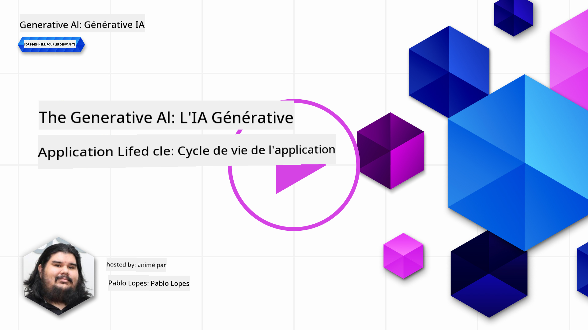
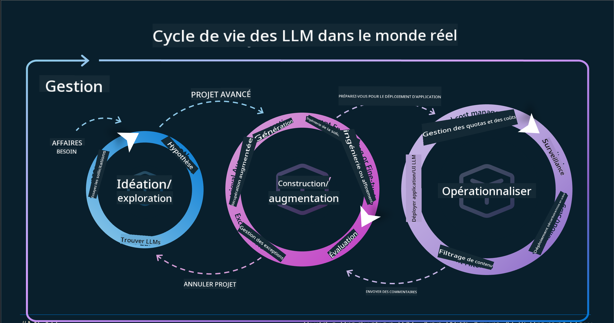
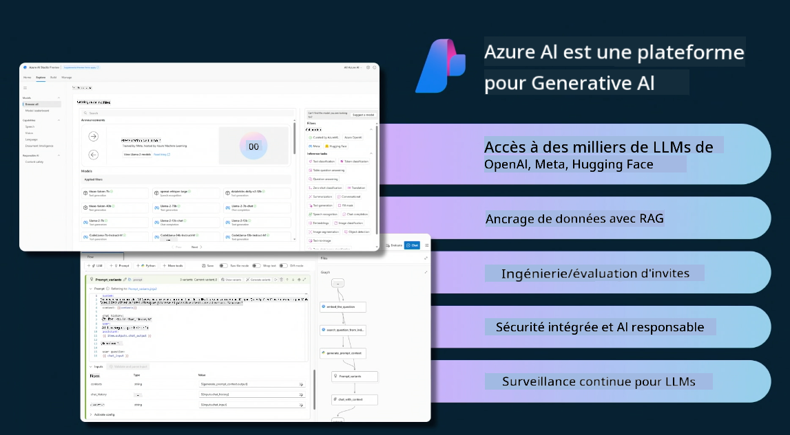
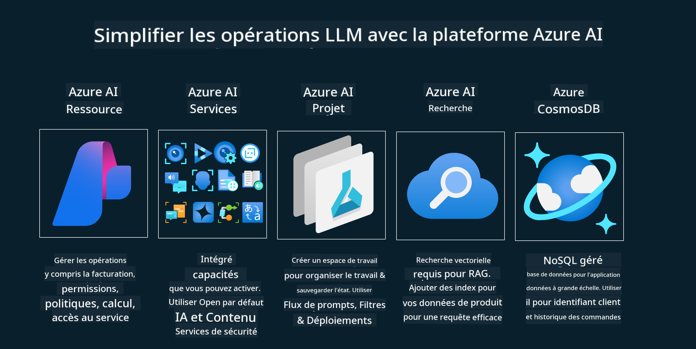
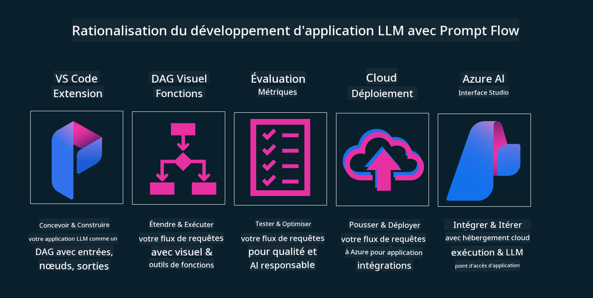

<!--
CO_OP_TRANSLATOR_METADATA:
{
  "original_hash": "27a5347a5022d5ef0a72ab029b03526a",
  "translation_date": "2025-05-19T23:17:58+00:00",
  "source_file": "14-the-generative-ai-application-lifecycle/README.md",
  "language_code": "fr"
}
-->

# Le Cycle de Vie des Applications d'IA Générative

Une question importante pour toutes les applications d'IA est la pertinence des fonctionnalités d'IA, car l'IA est un domaine en évolution rapide. Pour garantir que votre application reste pertinente, fiable et robuste, vous devez la surveiller, l'évaluer et l'améliorer en continu. C'est là qu'intervient le cycle de vie de l'IA générative.

Le cycle de vie de l'IA générative est un cadre qui vous guide à travers les étapes de développement, de déploiement et de maintenance d'une application d'IA générative. Il vous aide à définir vos objectifs, mesurer vos performances, identifier vos défis et mettre en œuvre vos solutions. Il vous aide également à aligner votre application avec les normes éthiques et légales de votre domaine et de vos parties prenantes. En suivant le cycle de vie de l'IA générative, vous pouvez vous assurer que votre application apporte toujours de la valeur et satisfait vos utilisateurs.

## Introduction

Dans ce chapitre, vous allez :

- Comprendre le Changement de Paradigme de MLOps à LLMOps
- Le Cycle de Vie des LLM
- Les Outils du Cycle de Vie
- La Métrification et l'Évaluation du Cycle de Vie

## Comprendre le Changement de Paradigme de MLOps à LLMOps

Les LLM sont un nouvel outil dans l'arsenal de l'Intelligence Artificielle, ils sont incroyablement puissants dans les tâches d'analyse et de génération pour les applications. Cependant, cette puissance a des conséquences sur la manière dont nous rationalisons les tâches d'IA et d'Apprentissage Machine Classique.

Avec cela, nous avons besoin d'un nouveau Paradigme pour adapter cet outil de manière dynamique, avec les incitations appropriées. Nous pouvons catégoriser les anciennes applications d'IA comme "Apps ML" et les nouvelles applications d'IA comme "Apps GenAI" ou simplement "Apps IA", reflétant la technologie et les techniques grand public utilisées à l'époque. Cela modifie notre discours de plusieurs manières, regardez la comparaison suivante.

Notez que dans LLMOps, nous nous concentrons davantage sur les Développeurs d'Applications, en utilisant les intégrations comme point clé, en utilisant des "Modèles-comme-un-Service" et en réfléchissant aux points suivants pour les métriques.

- Qualité : Qualité de la réponse
- Préjudice : IA Responsable
- Honnêteté : Fondement de la réponse (Cela a-t-il du sens ? Est-ce correct ?)
- Coût : Budget de la solution
- Latence : Temps moyen pour la réponse par jeton

## Le Cycle de Vie des LLM

Tout d'abord, pour comprendre le cycle de vie et les modifications, notons l'infographie suivante.

Comme vous pouvez le constater, cela diffère des cycles de vie habituels de MLOps. Les LLM ont de nombreuses nouvelles exigences, comme le Prompting, différentes techniques pour améliorer la qualité (Ajustement Fin, RAG, Meta-Prompts), une évaluation et une responsabilité différentes avec l'IA responsable, enfin, de nouvelles métriques d'évaluation (Qualité, Préjudice, Honnêteté, Coût et Latence).

Par exemple, regardez comment nous concevons. En utilisant l'ingénierie des prompts pour expérimenter avec divers LLM afin d'explorer les possibilités pour tester si leurs Hypothèses pourraient être correctes.

Notez que ce n'est pas linéaire, mais des boucles intégrées, itératives et avec un cycle global.

Comment pourrions-nous explorer ces étapes ? Entrons dans les détails pour voir comment nous pourrions construire un cycle de vie.

Cela peut sembler un peu compliqué, concentrons-nous d'abord sur les trois grandes étapes.

1. Idéation/Exploration : Exploration, ici nous pouvons explorer selon nos besoins commerciaux. Prototypage, création d'un [PromptFlow](https://microsoft.github.io/promptflow/index.html?WT.mc_id=academic-105485-koreyst) et tester s'il est suffisamment efficace pour notre Hypothèse.
2. Construction/Augmentation : Mise en œuvre, maintenant, nous commençons à évaluer pour des ensembles de données plus importants et à mettre en œuvre des techniques, comme l'Ajustement Fin et RAG, pour vérifier la robustesse de notre solution. Si ce n'est pas le cas, la réimplémentation, l'ajout de nouvelles étapes dans notre flux ou la restructuration des données, pourrait aider. Après avoir testé notre flux et notre échelle, si cela fonctionne et que nous vérifions nos Métriques, il est prêt pour l'étape suivante.
3. Opérationnalisation : Intégration, maintenant ajouter des systèmes de Surveillance et d'Alerte à notre système, déploiement et intégration d'applications à notre Application.

Ensuite, nous avons le cycle global de Gestion, en nous concentrant sur la sécurité, la conformité et la gouvernance.

Félicitations, vous avez maintenant votre App IA prête à être utilisée et opérationnelle. Pour une expérience pratique, jetez un œil à la [Démo Contoso Chat.](https://nitya.github.io/contoso-chat/?WT.mc_id=academic-105485-koreys)

Maintenant, quels outils pourrions-nous utiliser ?

## Les Outils du Cycle de Vie

Pour les Outils, Microsoft propose la [Plateforme Azure AI](https://azure.microsoft.com/solutions/ai/?WT.mc_id=academic-105485-koreys) et [PromptFlow](https://microsoft.github.io/promptflow/index.html?WT.mc_id=academic-105485-koreyst) pour faciliter et rendre votre cycle facile à mettre en œuvre et prêt à l'emploi.

La [Plateforme Azure AI](https://azure.microsoft.com/solutions/ai/?WT.mc_id=academic-105485-koreys), vous permet d'utiliser [AI Studio](https://ai.azure.com/?WT.mc_id=academic-105485-koreys). AI Studio est un portail web qui vous permet d'explorer des modèles, des échantillons et des outils. Gérer vos ressources, les flux de développement UI et les options SDK/CLI pour le développement Code-First.

Azure AI, vous permet d'utiliser plusieurs ressources, pour gérer vos opérations, services, projets, besoins de recherche vectorielle et de bases de données.

Construisez, de la Preuve de Concept (POC) jusqu'aux applications à grande échelle avec PromptFlow :

- Concevez et construisez des applications depuis VS Code, avec des outils visuels et fonctionnels
- Testez et ajustez vos applications pour une IA de qualité, facilement.
- Utilisez Azure AI Studio pour Intégrer et Itérer avec le cloud, Pousser et Déployer pour une intégration rapide.

## Super ! Continuez votre Apprentissage !

Incroyable, apprenez maintenant comment nous structurons une application pour utiliser les concepts avec l'[Application Contoso Chat](https://nitya.github.io/contoso-chat/?WT.mc_id=academic-105485-koreyst), pour voir comment Cloud Advocacy ajoute ces concepts dans des démonstrations. Pour plus de contenu, consultez notre [session de présentation Ignite !
](https://www.youtube.com/watch?v=DdOylyrTOWg)

Maintenant, consultez la Leçon 15, pour comprendre comment [la Génération Augmentée par Récupération et les Bases de Données Vectorielles](../15-rag-and-vector-databases/README.md?WT.mc_id=academic-105485-koreyst) impactent l'IA Générative et pour créer des Applications plus engageantes !

**Avertissement** :  
Ce document a été traduit à l'aide du service de traduction IA [Co-op Translator](https://github.com/Azure/co-op-translator). Bien que nous nous efforcions d'assurer l'exactitude, veuillez noter que les traductions automatisées peuvent contenir des erreurs ou des inexactitudes. Le document original dans sa langue d'origine doit être considéré comme la source faisant autorité. Pour des informations critiques, une traduction humaine professionnelle est recommandée. Nous ne sommes pas responsables des malentendus ou des interprétations erronées résultant de l'utilisation de cette traduction.