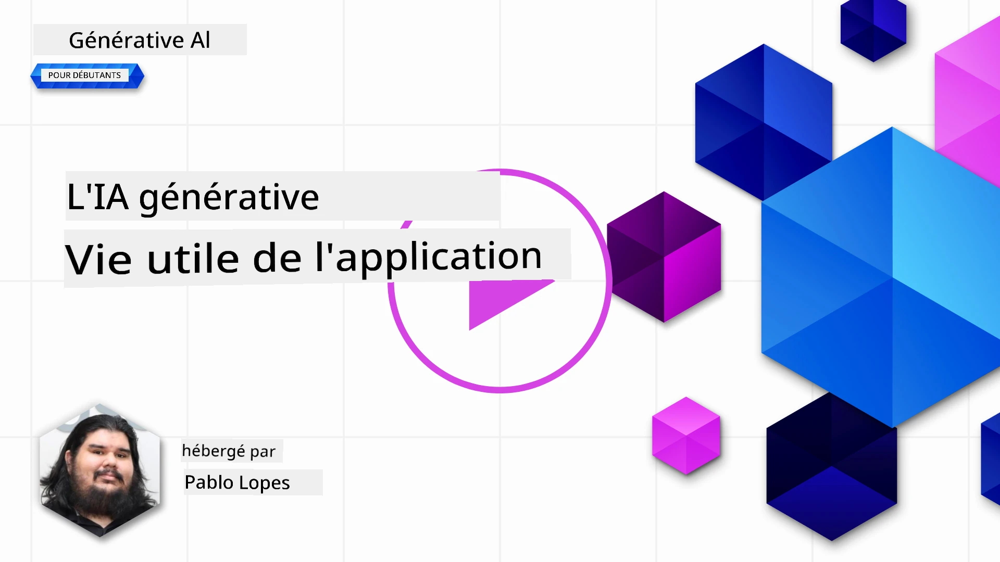
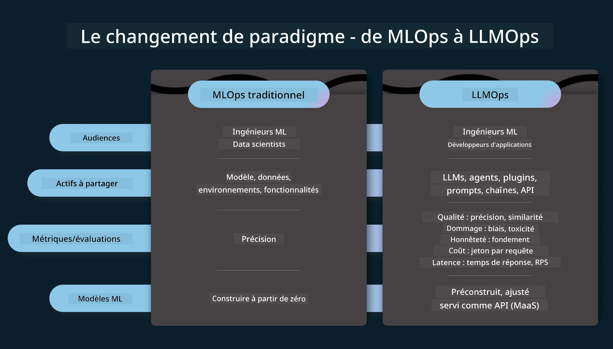
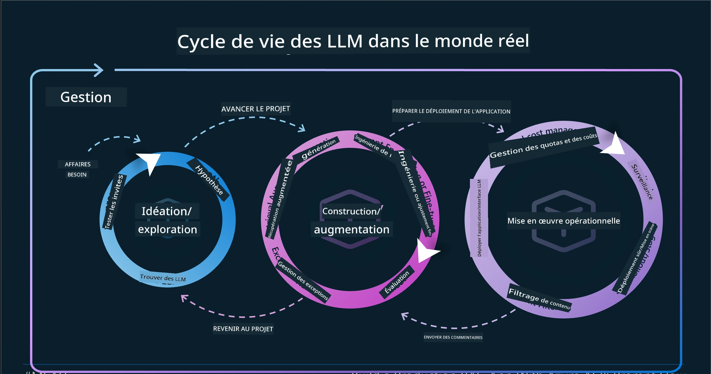
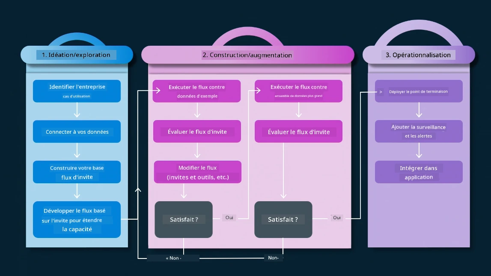
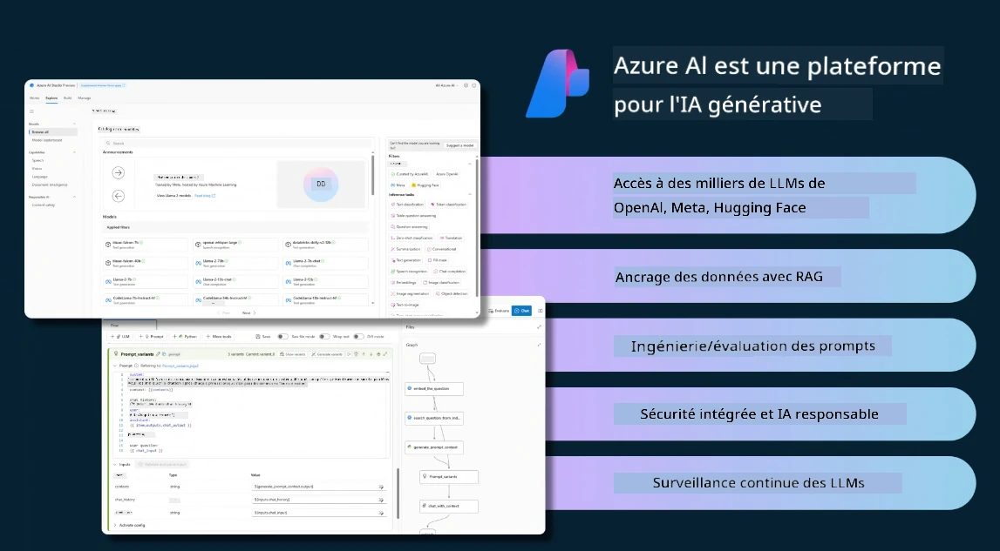
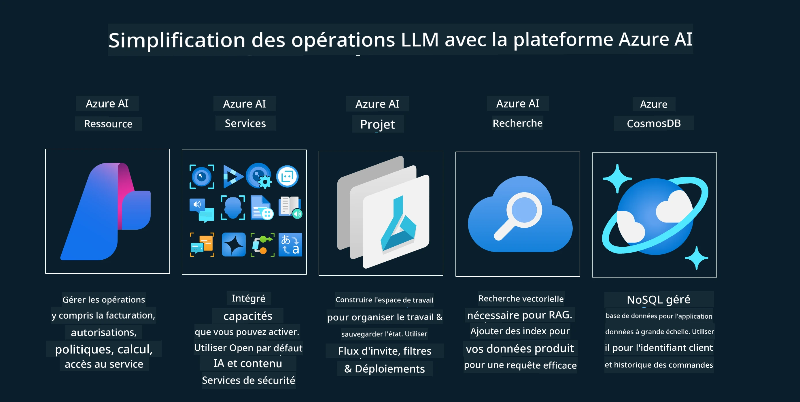
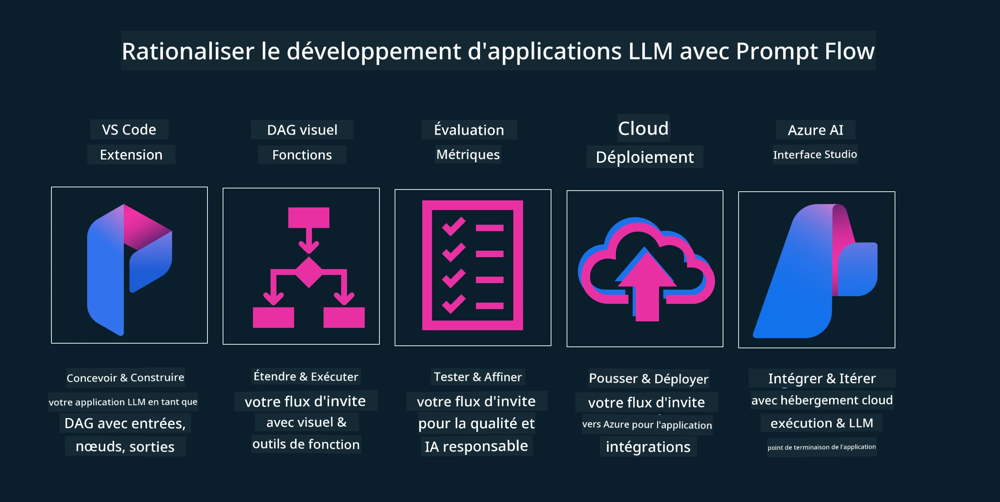

# Le cycle de vie des applications d'IA générative

Une question importante pour toutes les applications d'IA est la pertinence des fonctionnalités d'IA, car l'IA est un domaine en évolution rapide. Pour garantir que votre application reste pertinente, fiable et robuste, vous devez la surveiller, l'évaluer et l'améliorer continuellement. C'est là qu'intervient le cycle de vie de l'IA générative.

Le cycle de vie de l'IA générative est un cadre qui vous guide à travers les étapes de développement, de déploiement et de maintenance d'une application d'IA générative. Il vous aide à définir vos objectifs, mesurer vos performances, identifier vos défis et mettre en œuvre vos solutions. Il vous aide également à aligner votre application avec les normes éthiques et légales de votre domaine et de vos parties prenantes. En suivant le cycle de vie de l'IA générative, vous pouvez vous assurer que votre application fournit toujours de la valeur et satisfait vos utilisateurs.

## Introduction

Dans ce chapitre, vous allez :

- Comprendre le changement de paradigme de MLOps à LLMOps
- Le cycle de vie des LLM
- Outils du cycle de vie
- Metrification et évaluation du cycle de vie

## Comprendre le changement de paradigme de MLOps à LLMOps

Les LLM sont un nouvel outil dans l'arsenal de l'intelligence artificielle, ils sont incroyablement puissants pour les tâches d'analyse et de génération d'applications, cependant cette puissance a des conséquences sur la manière dont nous rationalisons les tâches d'IA et d'apprentissage automatique classique.

Pour cela, nous avons besoin d'un nouveau paradigme pour adapter cet outil de manière dynamique, avec les bons incitatifs. Nous pouvons catégoriser les anciennes applications d'IA comme des "applications ML" et les nouvelles applications d'IA comme des "applications GenAI" ou simplement "applications IA", reflétant la technologie et les techniques grand public utilisées à l'époque. Cela modifie notre récit de plusieurs manières, regardez la comparaison suivante.

Remarquez que dans LLMOps, nous nous concentrons davantage sur les développeurs d'applications, en utilisant les intégrations comme point clé, en utilisant le "Models-as-a-Service" et en pensant aux points suivants pour les métriques.

- Qualité : qualité de la réponse
- Dommage : IA responsable
- Honnêteté : fondement de la réponse (A-t-elle du sens ? Est-elle correcte ?)
- Coût : budget de la solution
- Latence : temps moyen pour la réponse par token

## Le cycle de vie des LLM

Tout d'abord, pour comprendre le cycle de vie et les modifications, remarquons l'infographie suivante.

Comme vous pouvez le constater, cela diffère des cycles de vie habituels de MLOps. Les LLM ont de nombreuses nouvelles exigences, telles que le Prompting, différentes techniques pour améliorer la qualité (Fine-Tuning, RAG, Meta-Prompts), une évaluation et une responsabilité différentes avec l'IA responsable, enfin, de nouvelles métriques d'évaluation (Qualité, Dommage, Honnêteté, Coût et Latence).

Par exemple, regardez comment nous idéons. Utiliser l'ingénierie de prompt pour expérimenter avec divers LLM afin d'explorer les possibilités et tester si leurs hypothèses pourraient être correctes.

Notez que ce n'est pas linéaire, mais des boucles intégrées, itératives et avec un cycle global.

Comment pourrions-nous explorer ces étapes ? Entrons dans le détail de la façon dont nous pourrions construire un cycle de vie.

Cela peut sembler un peu compliqué, concentrons-nous d'abord sur les trois grandes étapes.

1. Idéation/Exploration : Exploration, ici nous pouvons explorer selon nos besoins métier. Prototypage, création d'un [PromptFlow](https://microsoft.github.io/promptflow/index.html?WT.mc_id=academic-105485-koreyst) et test pour vérifier s'il est suffisamment efficace pour notre hypothèse.
1. Construction/Amélioration : Implémentation, maintenant, nous commençons à évaluer avec des ensembles de données plus grands, à mettre en œuvre des techniques, comme le Fine-tuning et RAG, pour vérifier la robustesse de notre solution. Si ce n'est pas le cas, réimplémenter, ajouter de nouvelles étapes dans notre flux ou restructurer les données peut aider. Après avoir testé notre flux et notre échelle, s'il fonctionne et que nos métriques sont vérifiées, il est prêt pour l'étape suivante.
1. Operationalisation : Intégration, maintenant en ajoutant des systèmes de surveillance et d'alerte à notre système, déploiement et intégration d'application dans notre application.

Ensuite, nous avons le cycle global de gestion, axé sur la sécurité, la conformité et la gouvernance.

Félicitations, vous avez maintenant votre application IA prête à fonctionner et opérationnelle. Pour une expérience pratique, jetez un œil à la [démonstration Contoso Chat.](https://nitya.github.io/contoso-chat/?WT.mc_id=academic-105485-koreyst)

Maintenant, quels outils pourrions-nous utiliser ?

## Outils du cycle de vie

Pour les outils, Microsoft propose la [plateforme Azure AI](https://azure.microsoft.com/solutions/ai/?WT.mc_id=academic-105485-koreyst) et [PromptFlow](https://microsoft.github.io/promptflow/index.html?WT.mc_id=academic-105485-koreyst) facilite et rend votre cycle facile à mettre en œuvre et prêt à l'emploi.

La [plateforme Azure AI](https://azure.microsoft.com/solutions/ai/?WT.mc_id=academic-105485-koreyst) vous permet d'utiliser [AI Studio](https://ai.azure.com/?WT.mc_id=academic-105485-koreyst). AI Studio est un portail web qui vous permet d'explorer des modèles, des exemples et des outils. Gérer vos ressources, les flux de développement UI et les options SDK/CLI pour un développement axé sur le code.

Azure AI vous permet d'utiliser plusieurs ressources, pour gérer vos opérations, services, projets, recherche vectorielle et besoins en bases de données.

Construct, du Proof-of-Concept (POC) jusqu'aux applications à grande échelle avec PromptFlow :

- Concevoir et construire des applications depuis VS Code, avec des outils visuels et fonctionnels
- Tester et affiner vos applications pour une IA de qualité, facilement.
- Utiliser Azure AI Studio pour intégrer et itérer avec le cloud, pousser et déployer pour une intégration rapide.

## Super ! Continuez votre apprentissage !

Incroyable, apprenez maintenant comment nous structurons une application pour utiliser les concepts avec l'[application Contoso Chat](https://nitya.github.io/contoso-chat/?WT.mc_id=academic-105485-koreyst), pour voir comment Cloud Advocacy ajoute ces concepts lors des démonstrations. Pour plus de contenu, consultez notre [session Ignite breakout !](https://www.youtube.com/watch?v=DdOylyrTOWg)

Maintenant, consultez la leçon 15, pour comprendre comment la [génération augmentée par récupération et les bases de données vectorielles](../15-rag-and-vector-databases/README.md?WT.mc_id=academic-105485-koreyst) impactent l'IA générative et pour réaliser des applications plus engageantes !

---

<!-- CO-OP TRANSLATOR DISCLAIMER START -->
**Clause de non-responsabilité** :  
Ce document a été traduit à l’aide du service de traduction automatique [Co-op Translator](https://github.com/Azure/co-op-translator). Bien que nous fassions tout notre possible pour garantir l’exactitude, veuillez noter que les traductions automatisées peuvent contenir des erreurs ou des inexactitudes. Le document original dans sa langue d’origine doit être considéré comme la source faisant foi. Pour des informations critiques, il est recommandé de recourir à une traduction professionnelle réalisée par un humain. Nous déclinons toute responsabilité en cas de malentendus ou de mauvaises interprétations résultant de l’utilisation de cette traduction.
<!-- CO-OP TRANSLATOR DISCLAIMER END -->